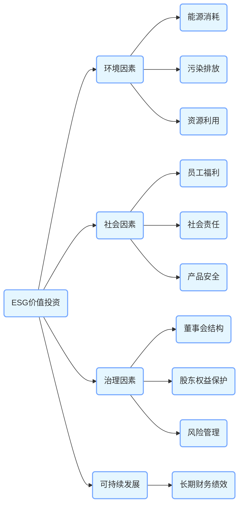

# 珍妮·沙德洛的ESG价值投资：将可持续发展纳入考量

> 关键词：ESG价值投资、可持续发展、珍妮·沙德洛、投资策略、企业评估

> 摘要：本文围绕珍妮·沙德洛所倡导的ESG价值投资展开，深入探讨将可持续发展纳入投资考量的理念、方法及实践。详细介绍ESG价值投资的核心概念、算法原理、数学模型，通过项目实战案例展示其在实际投资中的应用，分析其实际应用场景，推荐相关学习资源、开发工具和研究论文，最后总结其未来发展趋势与挑战，为投资者和相关从业者提供全面且深入的参考。

## 1. 背景介绍 
### 1.1 目的和范围
随着全球对可持续发展的关注度不断提升，传统的投资理念逐渐受到挑战。珍妮·沙德洛提出的ESG价值投资理念，旨在将环境（Environmental）、社会（Social）和治理（Governance）因素纳入投资决策过程，以实现长期的可持续回报。本文的目的是深入剖析这一投资理念，探讨其原理、方法和实际应用，范围涵盖ESG价值投资的各个方面，包括核心概念、算法原理、数学模型、项目实战以及未来发展趋势等。

### 1.2 预期读者
本文预期读者包括投资者、金融从业者、企业管理者、学术研究人员以及对可持续发展和投资感兴趣的人士。通过阅读本文，读者将能够深入了解ESG价值投资的理论和实践，为其在投资决策、企业管理或学术研究中提供有价值的参考。

### 1.3 文档结构概述
本文将按照以下结构展开：首先介绍ESG价值投资的核心概念与联系，包括其原理和架构；接着阐述核心算法原理和具体操作步骤，并通过Python代码进行详细说明；然后介绍相关的数学模型和公式，并举例说明；之后通过项目实战案例展示ESG价值投资的实际应用；再分析其实际应用场景；推荐相关的工具和资源；最后总结ESG价值投资的未来发展趋势与挑战，并提供常见问题解答和扩展阅读参考资料。

### 1.4 术语表
#### 1.4.1 核心术语定义
- **ESG价值投资**：一种将环境、社会和治理因素纳入投资决策的投资策略，旨在寻找具有可持续发展潜力的企业，实现长期的经济、社会和环境效益。
- **环境（Environmental）**：指企业在生产经营过程中对自然环境的影响，包括能源消耗、污染排放、资源利用等方面。
- **社会（Social）**：涉及企业与员工、客户、社区等利益相关者的关系，包括员工福利、社会责任、产品安全等方面。
- **治理（Governance）**：关注企业的内部管理和决策机制，包括董事会结构、股东权益保护、风险管理等方面。
- **可持续发展**：指既满足当代人的需求，又不损害后代人满足其需求的能力的发展模式。

#### 1.4.2 相关概念解释
- **ESG评级**：对企业在环境、社会和治理方面的表现进行评估和打分的过程，评级结果可作为投资者判断企业可持续发展能力的重要依据。
- **负筛选**：在投资组合构建过程中，排除那些在ESG方面表现不佳的企业，以降低投资风险。
- **正筛选**：选择那些在ESG方面表现优秀的企业纳入投资组合，以获取可持续的投资回报。

#### 1.4.3 缩略词列表
- **ESG**：Environmental, Social and Governance（环境、社会和治理）
- **ROI**：Return on Investment（投资回报率）
- **NPO**：Non - Profit Organization（非营利组织）

## 2. 核心概念与联系 
### 核心概念原理
ESG价值投资的核心原理是认为企业在环境、社会和治理方面的良好表现与其长期的财务绩效密切相关。从环境方面来看，注重环境保护和可持续资源利用的企业，能够降低因环境法规变化、资源短缺等带来的风险，同时也可能获得政府的政策支持和消费者的认可。例如，一家积极开发清洁能源技术的企业，不仅有助于减少碳排放，还可能在未来的能源市场中占据优势。

在社会方面，企业关注员工福利、社会责任和产品安全等问题，能够提高员工的工作积极性和忠诚度，增强企业的品牌形象和市场竞争力。比如，一家重视员工培训和发展的企业，能够吸引和留住优秀人才，从而提升企业的创新能力和运营效率。

治理方面，健全的公司治理结构能够确保企业决策的科学性和公正性，有效防范内部风险，保护股东权益。例如，一个具有独立董事会和完善内部控制制度的企业，能够更好地应对市场变化和挑战，实现长期稳定的发展。

### 架构示意图


该架构图展示了ESG价值投资的核心组成部分，包括环境、社会和治理因素，以及它们与可持续发展和长期财务绩效之间的关系。环境因素包括能源消耗、污染排放和资源利用等；社会因素涵盖员工福利、社会责任和产品安全等；治理因素涉及董事会结构、股东权益保护和风险管理等。这些因素共同影响企业的可持续发展能力，进而影响其长期财务绩效。

## 3. 核心算法原理 & 具体操作步骤 
### 核心算法原理
在ESG价值投资中，一个重要的算法是基于多因素模型来评估企业的ESG综合得分。假设我们有 $n$ 个企业，每个企业有 $m$ 个ESG相关指标，我们可以通过以下步骤计算每个企业的ESG综合得分。

首先，对每个指标进行标准化处理，以消除不同指标之间的量纲差异。设第 $i$ 个企业的第 $j$ 个指标值为 $x_{ij}$，标准化后的指标值为 $z_{ij}$，计算公式为：

$z_{ij}=\frac{x_{ij}-\bar{x}_j}{s_j}$

其中，$\bar{x}_j$ 是第 $j$ 个指标的平均值，$s_j$ 是第 $j$ 个指标的标准差。

然后，为每个指标分配权重 $w_j$，权重的确定可以根据专家意见、历史数据或机器学习算法等方法。最后，计算每个企业的ESG综合得分 $S_i$：

$S_i=\sum_{j = 1}^{m}w_jz_{ij}$

### 具体操作步骤
1. **数据收集**：收集每个企业的ESG相关指标数据，可以通过企业年报、可持续发展报告、第三方数据提供商等渠道获取。
2. **数据清洗**：对收集到的数据进行清洗，处理缺失值、异常值等问题。
3. **指标标准化**：按照上述公式对每个指标进行标准化处理。
4. **权重确定**：根据实际情况确定每个指标的权重。
5. **综合得分计算**：根据标准化后的指标值和权重，计算每个企业的ESG综合得分。

### Python源代码实现
```python
import numpy as np

def standardize_data(data):
    """
    对数据进行标准化处理
    :param data: 输入的二维数组，每行代表一个企业，每列代表一个指标
    :return: 标准化后的二维数组
    """
    means = np.mean(data, axis=0)
    stds = np.std(data, axis=0)
    standardized_data = (data - means) / stds
    return standardized_data

def calculate_esg_score(data, weights):
    """
    计算每个企业的ESG综合得分
    :param data: 标准化后的二维数组
    :param weights: 指标权重数组
    :return: 每个企业的ESG综合得分数组
    """
    scores = np.dot(data, weights)
    return scores

# 示例数据
data = np.array([[10, 20, 30], [15, 25, 35], [20, 30, 40]])
weights = np.array([0.3, 0.3, 0.4])

# 数据标准化
standardized_data = standardize_data(data)

# 计算ESG综合得分
esg_scores = calculate_esg_score(standardized_data, weights)

print("标准化后的数据：")
print(standardized_data)
print("ESG综合得分：")
print(esg_scores)
```

在上述代码中，`standardize_data` 函数用于对输入的数据进行标准化处理，`calculate_esg_score` 函数用于计算每个企业的ESG综合得分。通过示例数据展示了如何调用这两个函数进行数据处理和得分计算。

## 4. 数学模型和公式 & 详细讲解 & 举例说明 
### 数学模型
ESG价值投资的数学模型可以基于多因素线性回归模型来构建。假设企业的股票收益率 $R$ 与企业的ESG综合得分 $S$ 以及其他一些控制变量 $X_1,X_2,\cdots,X_k$ 之间存在线性关系，我们可以建立如下模型：

$R=\beta_0+\beta_1S+\beta_2X_1+\beta_3X_2+\cdots+\beta_{k + 1}X_k+\epsilon$

其中，$\beta_0$ 是截距项，$\beta_1,\beta_2,\cdots,\beta_{k + 1}$ 是回归系数，$\epsilon$ 是误差项。

### 公式详细讲解
- **$R$**：表示企业的股票收益率，是我们要解释和预测的变量。
- **$S$**：企业的ESG综合得分，反映了企业在环境、社会和治理方面的综合表现。
- **$X_1,X_2,\cdots,X_k$**：其他控制变量，例如企业的财务指标（如市盈率、市净率等）、行业因素等。
- **$\beta_0$**：截距项，表示当所有自变量都为 0 时，企业的股票收益率的预期值。
- **$\beta_1$**：表示ESG综合得分对企业股票收益率的影响系数。如果 $\beta_1>0$，说明ESG表现越好的企业，其股票收益率越高；反之，如果 $\beta_1<0$，则说明ESG表现与股票收益率呈负相关。
- **$\epsilon$**：误差项，反映了模型中未考虑到的因素对企业股票收益率的影响。

### 举例说明
假设我们收集了 100 家企业的数据，包括它们的股票收益率、ESG综合得分、市盈率和市净率。我们可以使用Python的 `statsmodels` 库来进行线性回归分析。

```python
import numpy as np
import statsmodels.api as sm

# 生成示例数据
np.random.seed(0)
n = 100
esg_scores = np.random.randn(n)
pe_ratios = np.random.randn(n)
pb_ratios = np.random.randn(n)
# 假设股票收益率与ESG得分、市盈率和市净率存在线性关系
R = 0.5 + 0.2 * esg_scores + 0.1 * pe_ratios + 0.15 * pb_ratios + np.random.randn(n) * 0.1

# 构建自变量矩阵
X = np.column_stack((esg_scores, pe_ratios, pb_ratios))
X = sm.add_constant(X)

# 进行线性回归分析
model = sm.OLS(R, X)
results = model.fit()

# 输出回归结果
print(results.summary())
```

在上述代码中，我们首先生成了示例数据，包括ESG综合得分、市盈率、市净率和股票收益率。然后构建自变量矩阵 $X$，并添加常数项。最后使用 `statsmodels` 库的 `OLS` 函数进行线性回归分析，并输出回归结果。通过回归结果，我们可以得到各个自变量的回归系数和显著性水平，从而判断ESG综合得分以及其他控制变量对企业股票收益率的影响。

## 5. 项目实战：代码实际案例和详细解释说明 
### 5.1  开发环境搭建
在进行ESG价值投资的项目实战时，我们需要搭建相应的开发环境。以下是具体步骤：

1. **安装Python**：建议安装Python 3.7及以上版本，可以从Python官方网站（https://www.python.org/downloads/）下载并安装。
2. **安装必要的库**：我们需要安装一些常用的Python库，如 `numpy`、`pandas`、`statsmodels` 等。可以使用 `pip` 命令进行安装：
```sh
pip install numpy pandas statsmodels
```
3. **选择开发工具**：可以选择使用Jupyter Notebook、PyCharm等开发工具。Jupyter Notebook适合进行交互式数据分析和代码演示，PyCharm则是一个功能强大的Python集成开发环境，适合进行大型项目的开发。

### 5.2  源代码详细实现和代码解读
以下是一个完整的ESG价值投资项目实战代码示例，包括数据收集、数据清洗、指标标准化、综合得分计算和线性回归分析等步骤。

```python
import numpy as np
import pandas as pd
import statsmodels.api as sm

# 1. 数据收集
# 假设我们从CSV文件中读取数据
data = pd.read_csv('esg_data.csv')

# 2. 数据清洗
# 处理缺失值
data = data.dropna()

# 3. 指标标准化
esg_columns = ['esg_indicator_1', 'esg_indicator_2', 'esg_indicator_3']
standardized_data = (data[esg_columns] - data[esg_columns].mean()) / data[esg_columns].std()

# 4. 权重确定
weights = np.array([0.3, 0.3, 0.4])

# 5. 综合得分计算
data['esg_score'] = np.dot(standardized_data, weights)

# 6. 线性回归分析
# 假设我们要分析ESG得分对股票收益率的影响
X = data[['esg_score']]
X = sm.add_constant(X)
y = data['stock_return']

model = sm.OLS(y, X)
results = model.fit()

# 输出回归结果
print(results.summary())
```

### 代码解读与分析
1. **数据收集**：使用 `pandas` 库的 `read_csv` 函数从CSV文件中读取ESG相关数据。
2. **数据清洗**：使用 `dropna` 函数处理数据中的缺失值，确保数据的完整性。
3. **指标标准化**：对ESG相关指标进行标准化处理，消除不同指标之间的量纲差异。
4. **权重确定**：手动设置每个指标的权重，实际应用中可以根据专家意见、历史数据或机器学习算法等方法确定。
5. **综合得分计算**：使用 `np.dot` 函数计算每个企业的ESG综合得分。
6. **线性回归分析**：使用 `statsmodels` 库的 `OLS` 函数进行线性回归分析，研究ESG得分对股票收益率的影响。最后输出回归结果，包括回归系数、显著性水平等信息。

## 6. 实际应用场景 
### 投资组合管理
投资者可以将ESG价值投资理念应用于投资组合管理中。通过筛选出ESG表现优秀的企业，构建具有可持续发展潜力的投资组合。这样的投资组合不仅可以降低投资风险，还可能获得长期的稳定回报。例如，一些养老基金和慈善基金已经开始将ESG因素纳入投资决策，以实现资产的保值增值和社会责任的履行。

### 企业风险管理
企业可以通过评估自身的ESG表现，识别潜在的风险和机会。例如，一家化工企业如果能够积极采取环保措施，降低污染排放，不仅可以避免因环境法规变化带来的罚款和声誉损失，还可能获得政府的奖励和消费者的认可，从而提升企业的竞争力。

### 社会责任投资
社会责任投资者关注企业在社会和环境方面的表现，他们更愿意投资那些具有良好社会责任感的企业。ESG价值投资为社会责任投资者提供了一种科学的投资方法，帮助他们找到符合自己价值观的投资标的。

### 政策制定与监管
政府和监管机构可以利用ESG评估结果来制定相关政策和法规，引导企业更加注重可持续发展。例如，政府可以对ESG表现优秀的企业给予税收优惠、财政补贴等政策支持，对ESG表现不佳的企业加强监管和处罚。

## 7. 工具和资源推荐
### 7.1 学习资源推荐
#### 7.1.1 书籍推荐
- 《ESG投资：理念、方法与实践》：本书系统介绍了ESG投资的基本概念、理论和实践方法，是学习ESG投资的经典教材。
- 《可持续金融与投资》：深入探讨了可持续金融和投资的发展趋势、政策环境和实践案例，对理解ESG价值投资的宏观背景具有重要意义。
- 《绿色金融与可持续发展》：介绍了绿色金融的相关理论和实践，包括绿色信贷、绿色债券、绿色投资等，为ESG价值投资提供了更广阔的视角。

#### 7.1.2 在线课程
- Coursera上的“ESG Investing: Principles and Practice”：由知名大学教授授课，系统介绍了ESG投资的原理和实践方法。
- edX上的“Sustainable Finance and Investing”：该课程涵盖了可持续金融和投资的各个方面，包括ESG评估、绿色金融产品等。
- 中国大学MOOC上的“绿色金融与可持续发展”：结合中国实际情况，介绍了绿色金融和可持续发展的相关知识和实践案例。

#### 7.1.3 技术博客和网站
- MSCI ESG Research：提供全球企业的ESG评级和研究报告，是了解企业ESG表现的重要数据源。
- Sustainalytics：专注于ESG研究和评级，为投资者提供专业的ESG分析和咨询服务。
- 财新网ESG频道：及时报道国内外ESG领域的最新动态和研究成果，是了解ESG行业发展趋势的重要渠道。

### 7.2 开发工具框架推荐
#### 7.2.1 IDE和编辑器
- PyCharm：功能强大的Python集成开发环境，支持代码编辑、调试、版本控制等功能，适合进行大型ESG投资项目的开发。
- Jupyter Notebook：交互式的数据分析和代码演示工具，适合进行ESG数据的探索性分析和模型验证。
- Visual Studio Code：轻量级的代码编辑器，支持多种编程语言和插件扩展，可用于快速开发和调试ESG投资相关代码。

#### 7.2.2 调试和性能分析工具
- `pdb`：Python自带的调试工具，可用于调试ESG投资相关的Python代码，帮助开发者定位和解决问题。
- `cProfile`：Python的性能分析工具，可用于分析ESG投资代码的性能瓶颈，优化代码运行效率。
- `py-spy`：一个轻量级的Python性能分析工具，无需修改代码即可进行性能分析，适合快速定位性能问题。

#### 7.2.3 相关框架和库
- `pandas`：强大的数据处理和分析库，可用于ESG数据的清洗、整理和分析。
- `numpy`：Python的数值计算库，提供了高效的数组操作和数学函数，可用于ESG指标的计算和模型的实现。
- `statsmodels`：用于统计建模和数据分析的Python库，可用于ESG投资中的线性回归分析、时间序列分析等。

### 7.3 相关论文著作推荐
#### 7.3.1 经典论文
- “Corporate Social Responsibility and Financial Performance: A Meta - Analysis”：该论文对企业社会责任与财务绩效之间的关系进行了元分析，为ESG价值投资提供了重要的理论支持。
- “ESG and Financial Performance: Aggregated Evidence from More than 2000 Empirical Studies”：系统总结了超过2000项实证研究的结果，分析了ESG因素与企业财务绩效之间的关系。
- “The Impact of Corporate Social Responsibility on Firm Value: The Role of Customer Awareness”：研究了企业社会责任对企业价值的影响，以及客户认知在其中的作用。

#### 7.3.2 最新研究成果
- 关注《Journal of Sustainable Finance & Investment》、《Sustainable Development》等学术期刊，这些期刊经常发表ESG领域的最新研究成果。
- 参加国际可持续金融和投资领域的学术会议，如可持续金融全球峰会等，了解最新的研究动态和前沿观点。

#### 7.3.3 应用案例分析
- 可以参考一些知名投资机构的ESG投资报告和案例分析，如贝莱德、富达等。这些报告详细介绍了他们在ESG投资方面的实践经验和投资策略。
- 关注一些企业的可持续发展报告，了解企业在ESG方面的实践和成果，以及对企业经营和财务绩效的影响。

## 8. 总结：未来发展趋势与挑战
### 未来发展趋势
- **市场规模持续扩大**：随着全球对可持续发展的关注度不断提高，ESG价值投资的市场规模将持续扩大。越来越多的投资者将把ESG因素纳入投资决策，推动ESG投资产品的不断创新和发展。
- **数据和技术的应用不断深化**：随着大数据、人工智能等技术的不断发展，ESG数据的收集、分析和应用将更加精准和高效。投资者可以利用这些技术更好地评估企业的ESG表现，挖掘投资机会。
- **行业标准和规范逐步完善**：为了促进ESG价值投资的健康发展，相关的行业标准和规范将逐步完善。例如，国际组织和监管机构将制定更加统一的ESG披露标准和评级方法，提高ESG信息的可比性和透明度。
- **与其他投资策略融合**：ESG价值投资将与其他投资策略，如价值投资、成长投资等相互融合，形成更加多元化的投资策略。投资者可以根据自己的风险偏好和投资目标，选择适合自己的投资策略。

### 挑战
- **数据质量和可比性问题**：目前，ESG数据的质量和可比性仍然存在较大问题。不同的数据提供商采用的指标体系和评估方法可能不同，导致企业的ESG评级结果存在差异。这给投资者的决策带来了一定的困难。
- **投资回报的不确定性**：虽然理论上ESG表现优秀的企业可能具有更好的长期财务绩效，但在实际投资中，ESG投资的回报仍然存在不确定性。市场因素、行业竞争等多种因素可能影响企业的财务表现，从而影响ESG投资的回报。
- **企业披露意愿和能力不足**：部分企业对ESG信息披露的重要性认识不足，缺乏披露的意愿和能力。这导致投资者难以获取全面、准确的ESG信息，影响了ESG价值投资的实施。
- **监管和政策的不确定性**：ESG价值投资的发展离不开监管和政策的支持，但目前相关的监管和政策还存在一定的不确定性。不同国家和地区的监管政策可能存在差异，政策的变化也可能对ESG投资市场产生影响。

## 9. 附录：常见问题与解答
### 问题1：ESG价值投资与传统投资有什么区别？
解答：传统投资主要关注企业的财务指标，如盈利能力、偿债能力等，而ESG价值投资除了关注财务指标外，还将环境、社会和治理因素纳入投资决策过程。ESG价值投资更注重企业的长期可持续发展能力，以及企业对社会和环境的影响。

### 问题2：如何评估企业的ESG表现？
解答：可以通过多种方式评估企业的ESG表现，如参考第三方机构的ESG评级报告、分析企业的可持续发展报告、关注企业的社会责任活动等。同时，也可以构建自己的ESG评估指标体系，对企业的ESG表现进行量化评估。

### 问题3：ESG投资一定能获得更高的回报吗？
解答：虽然一些研究表明，ESG表现优秀的企业可能具有更好的长期财务绩效，但ESG投资并不一定能保证获得更高的回报。市场因素、行业竞争等多种因素可能影响企业的财务表现，从而影响ESG投资的回报。ESG投资更注重长期的可持续回报和风险控制。

### 问题4：企业为什么要重视ESG信息披露？
解答：企业重视ESG信息披露有以下几个原因：一是可以提高企业的透明度和公信力，增强投资者和其他利益相关者对企业的信任；二是有助于企业识别和管理潜在的风险和机会，提升企业的可持续发展能力；三是符合监管要求和市场趋势，有利于企业在市场竞争中占据优势。

## 10. 扩展阅读 & 参考资料
### 扩展阅读
- 《ESG投资实战手册》：进一步介绍了ESG投资的实战方法和技巧，包括投资组合构建、风险管理等方面的内容。
- 《可持续投资的未来》：探讨了可持续投资的未来发展趋势和面临的挑战，对ESG价值投资的未来发展具有重要的启示意义。
- 《绿色金融与低碳经济》：介绍了绿色金融与低碳经济的相关知识和实践案例，为ESG价值投资提供了更深入的理论和实践支持。

### 参考资料
- 相关的学术论文和研究报告，如《Journal of Financial Economics》、《Review of Financial Studies》等学术期刊上发表的关于ESG投资的论文。
- 国际组织和监管机构发布的相关文件和报告，如联合国责任投资原则组织（PRI）发布的报告、各国证券监管机构发布的ESG披露指引等。
- 企业的可持续发展报告和年报，这些报告可以提供企业的ESG信息和财务信息，是了解企业实际情况的重要资料。

作者：AI天才研究院/AI Genius Institute & 禅与计算机程序设计艺术 /Zen And The Art of Computer Programming