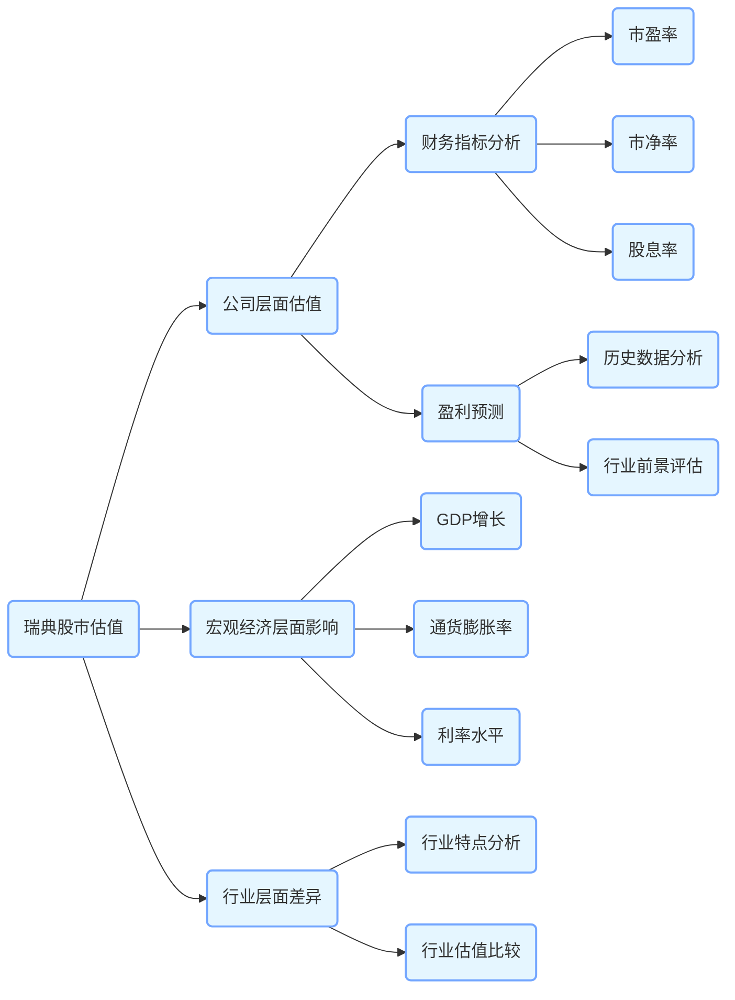

# 瑞典股市估值:北欧经济强国的市场表现

> 关键词：瑞典股市、估值、北欧经济、市场表现、经济指标

> 摘要：本文聚焦于瑞典股市的估值情况，深入分析北欧经济强国瑞典的股市在不同经济环境下的表现。通过介绍相关背景知识，阐述核心概念与联系，剖析核心算法原理及操作步骤，引入数学模型和公式进行详细讲解与举例说明，结合项目实战案例展开代码分析，探讨实际应用场景，推荐相关工具和资源，最后总结瑞典股市未来发展趋势与挑战，并解答常见问题。旨在为投资者、研究者等提供全面且深入的瑞典股市估值相关信息。

## 1. 背景介绍 
### 1.1 目的和范围
本研究的目的在于全面深入地分析瑞典股市的估值情况，探讨其与北欧经济环境的相互关系以及在市场中的具体表现。研究范围涵盖瑞典主要的股票市场指数、上市公司的财务数据、宏观经济指标等，同时也会考虑国际经济形势对瑞典股市的影响。通过对这些因素的综合研究，为投资者、金融分析师以及相关研究人员提供关于瑞典股市估值的准确评估和有价值的参考信息。

### 1.2 预期读者
本文预期读者包括对瑞典股市感兴趣的投资者，无论是个人投资者还是机构投资者，他们希望通过了解瑞典股市的估值情况来做出更明智的投资决策；金融分析师，他们需要对瑞典股市进行深入研究和分析，为客户提供专业的投资建议；经济研究人员，他们关注北欧经济和金融市场的发展，希望通过本文获取关于瑞典股市的详细信息，以支持相关的学术研究和政策分析。

### 1.3 文档结构概述
本文将按照以下结构展开：首先介绍核心概念与联系，明确与瑞典股市估值相关的基本概念和它们之间的逻辑关系；接着阐述核心算法原理和具体操作步骤，通过Python代码详细说明如何进行相关计算；然后引入数学模型和公式，对估值过程进行理论分析和举例说明；再通过项目实战案例，展示如何在实际中运用相关知识进行股市估值分析；之后探讨瑞典股市估值在实际中的应用场景；推荐相关的工具和资源，帮助读者进一步深入学习和研究；最后总结瑞典股市的未来发展趋势与挑战，解答常见问题，并提供扩展阅读和参考资料。

### 1.4 术语表
#### 1.4.1 核心术语定义
- **股市估值**：指对股票市场整体或个别股票的价值进行评估的过程，通过各种方法和指标来确定股票的合理价格。
- **市盈率（P/E）**：是股票价格除以每股收益的比率，反映了投资者为获取公司每一元盈利所愿意支付的价格。
- **市净率（P/B）**：是股票价格与每股净资产的比率，用于衡量股票价格相对于每股净资产的倍数。
- **股息率**：是股息与股票价格之间的比率，反映了投资者从股票股息中获得的收益比例。

#### 1.4.2 相关概念解释
- **宏观经济指标**：如国内生产总值（GDP）、通货膨胀率、利率等，这些指标反映了一个国家或地区的经济总体状况，会对股市估值产生重要影响。
- **行业估值差异**：不同行业由于其经营特点、发展前景等因素的不同，其合理的估值水平也会存在差异。例如，科技行业通常具有较高的市盈率，而传统制造业的市盈率相对较低。

#### 1.4.3 缩略词列表
- **P/E**：市盈率（Price-to-Earnings Ratio）
- **P/B**：市净率（Price-to-Book Ratio）
- **GDP**：国内生产总值（Gross Domestic Product）

## 2. 核心概念与联系 
### 核心概念原理
#### 股市估值原理
股市估值的核心原理是基于对公司未来盈利能力和资产价值的预期。通过分析公司的财务报表、行业前景、宏观经济环境等因素，来确定公司股票的合理价值。常见的估值方法包括相对估值法和绝对估值法。相对估值法是通过与同行业或类似公司的估值指标进行比较，来评估目标公司的价值；绝对估值法是通过预测公司未来的现金流，并将其折现到当前，来计算公司的内在价值。

#### 宏观经济与股市估值的关系
宏观经济状况对股市估值有着重要的影响。当经济增长强劲时，公司的盈利能力通常会提高，投资者对股票的预期收益也会增加，从而推动股市估值上升；相反，当经济衰退时，公司的盈利可能会下降，投资者的风险偏好降低，股市估值也会相应下降。此外，通货膨胀率、利率等宏观经济指标也会影响股市估值。例如，高通货膨胀率可能会导致利率上升，从而增加公司的融资成本，降低公司的盈利能力，进而压低股市估值。

### 架构的文本示意图
```plaintext
瑞典股市估值
|-- 公司层面估值
|   |-- 财务指标分析
|   |   |-- 市盈率
|   |   |-- 市净率
|   |   |-- 股息率
|   |-- 盈利预测
|       |-- 历史数据分析
|       |-- 行业前景评估
|-- 宏观经济层面影响
|   |-- GDP增长
|   |-- 通货膨胀率
|   |-- 利率水平
|-- 行业层面差异
|   |-- 行业特点分析
|   |-- 行业估值比较
```

### Mermaid 流程图


## 3. 核心算法原理 & 具体操作步骤 
### 市盈率（P/E）计算原理及Python代码实现
#### 原理
市盈率是股票价格除以每股收益的比率，计算公式为：

$$P/E = \frac{股票价格}{每股收益}$$

其中，股票价格是当前股票在市场上的交易价格，每股收益是公司净利润除以总股本得到的值。

#### Python代码实现
```python
def calculate_pe(stock_price, earnings_per_share):
    """
    计算市盈率
    :param stock_price: 股票价格
    :param earnings_per_share: 每股收益
    :return: 市盈率
    """
    if earnings_per_share == 0:
        return None
    return stock_price / earnings_per_share

# 示例数据
stock_price = 50
earnings_per_share = 2

pe_ratio = calculate_pe(stock_price, earnings_per_share)
print(f"市盈率: {pe_ratio}")
```

### 市净率（P/B）计算原理及Python代码实现
#### 原理
市净率是股票价格与每股净资产的比率，计算公式为：

$$P/B = \frac{股票价格}{每股净资产}$$

其中，每股净资产是公司净资产除以总股本得到的值。

#### Python代码实现
```python
def calculate_pb(stock_price, book_value_per_share):
    """
    计算市净率
    :param stock_price: 股票价格
    :param book_value_per_share: 每股净资产
    :return: 市净率
    """
    if book_value_per_share == 0:
        return None
    return stock_price / book_value_per_share

# 示例数据
stock_price = 50
book_value_per_share = 10

pb_ratio = calculate_pb(stock_price, book_value_per_share)
print(f"市净率: {pb_ratio}")
```

### 股息率计算原理及Python代码实现
#### 原理
股息率是股息与股票价格之间的比率，计算公式为：

$$股息率 = \frac{每股股息}{股票价格} \times 100\%$$

其中，每股股息是公司向股东每股派发的股息金额。

#### Python代码实现
```python
def calculate_dividend_yield(dividend_per_share, stock_price):
    """
    计算股息率
    :param dividend_per_share: 每股股息
    :param stock_price: 股票价格
    :return: 股息率
    """
    if stock_price == 0:
        return None
    return (dividend_per_share / stock_price) * 100

# 示例数据
dividend_per_share = 1
stock_price = 50

dividend_yield = calculate_dividend_yield(dividend_per_share, stock_price)
print(f"股息率: {dividend_yield}%")
```

## 4. 数学模型和公式 & 详细讲解 & 举例说明 
### 股息贴现模型（DDM）
#### 原理
股息贴现模型是一种绝对估值方法，它基于股票的内在价值等于其未来股息的现值之和的原理。假设公司的股息以固定增长率 $g$ 增长，并且投资者要求的必要收益率为 $r$，则股票的内在价值 $V$ 可以通过以下公式计算：

$$V = \frac{D_1}{r - g}$$

其中，$D_1$ 是下一期预计的股息。

#### 详细讲解
该模型的核心思想是将股票视为一种能够产生未来现金流（股息）的资产，通过将未来股息折现到当前，来计算股票的内在价值。必要收益率 $r$ 反映了投资者对该股票的风险补偿要求，股息增长率 $g$ 则反映了公司的盈利增长能力。当 $r > g$ 时，模型才有意义。

#### 举例说明
假设某公司预计下一期股息 $D_1$ 为 2 元，股息增长率 $g$ 为 5%，投资者要求的必要收益率 $r$ 为 10%。则该股票的内在价值为：

$$V = \frac{2}{0.1 - 0.05} = \frac{2}{0.05} = 40$$（元）

如果当前股票市场价格低于 40 元，则该股票可能被低估；反之，如果市场价格高于 40 元，则该股票可能被高估。

### 自由现金流贴现模型（DCF）
#### 原理
自由现金流贴现模型也是一种绝对估值方法，它基于公司的内在价值等于其未来自由现金流的现值之和的原理。公司的自由现金流是指公司在满足了所有必要的资本支出和营运资金需求后，剩余的可分配给股东和债权人的现金流量。假设公司的自由现金流以固定增长率 $g$ 增长，并且加权平均资本成本（WACC）为 $r$，则公司的内在价值 $V$ 可以通过以下公式计算：

$$V = \frac{FCF_1}{r - g}$$

其中，$FCF_1$ 是下一期预计的自由现金流。

#### 详细讲解
该模型考虑了公司的全部现金流量，而不仅仅是股息。加权平均资本成本 $r$ 反映了公司的融资成本和风险水平，自由现金流增长率 $g$ 则反映了公司的经营增长能力。与股息贴现模型类似，当 $r > g$ 时，模型才有意义。

#### 举例说明
假设某公司预计下一期自由现金流 $FCF_1$ 为 100 万元，自由现金流增长率 $g$ 为 3%，加权平均资本成本 $r$ 为 8%。则该公司的内在价值为：

$$V = \frac{100}{0.08 - 0.03} = \frac{100}{0.05} = 2000$$（万元）

如果公司的市场价值低于 2000 万元，则该公司可能被低估；反之，如果市场价值高于 2000 万元，则该公司可能被高估。

## 5. 项目实战：代码实际案例和详细解释说明 
### 5.1  开发环境搭建
#### 安装Python
首先需要安装Python编程语言。可以从Python官方网站（https://www.python.org/downloads/）下载适合自己操作系统的Python安装包，并按照安装向导进行安装。建议安装Python 3.x版本。

#### 安装必要的库
在进行瑞典股市估值分析时，需要使用一些Python库来获取和处理数据。可以使用以下命令来安装这些库：
```bash
pip install pandas yfinance matplotlib
```
- **pandas**：用于数据处理和分析。
- **yfinance**：用于从雅虎财经获取股票数据。
- **matplotlib**：用于数据可视化。

### 5.2  源代码详细实现和代码解读
```python
import yfinance as yf
import pandas as pd
import matplotlib.pyplot as plt

# 定义要分析的瑞典股票代码
stock_symbol = 'ABB.ST'  # ABB公司在瑞典股市的代码

# 获取股票数据
stock_data = yf.download(stock_symbol, start='2020-01-01', end='2023-12-31')

# 计算每日收益率
stock_data['Daily_Return'] = stock_data['Close'].pct_change()

# 计算市盈率（假设已知每股收益为5）
earnings_per_share = 5
stock_data['P/E'] = stock_data['Close'] / earnings_per_share

# 绘制收盘价和市盈率的图表
fig, axes = plt.subplots(2, 1, figsize=(12, 8))

axes[0].plot(stock_data['Close'])
axes[0].set_title(f'{stock_symbol} Closing Price')
axes[0].set_xlabel('Date')
axes[0].set_ylabel('Price')

axes[1].plot(stock_data['P/E'])
axes[1].set_title(f'{stock_symbol} P/E Ratio')
axes[1].set_xlabel('Date')
axes[1].set_ylabel('P/E Ratio')

plt.tight_layout()
plt.show()
```

### 5.3  代码解读与分析
#### 代码功能概述
这段代码的主要功能是获取瑞典股票市场上 ABB 公司的股票数据，并计算每日收益率和市盈率，最后将收盘价和市盈率绘制成图表进行可视化展示。

#### 代码详细解读
1. **导入必要的库**：导入 `yfinance`、`pandas` 和 `matplotlib.pyplot` 库，分别用于获取股票数据、数据处理和数据可视化。
2. **定义股票代码**：定义要分析的瑞典股票代码 `ABB.ST`，表示 ABB 公司在瑞典股市的代码。
3. **获取股票数据**：使用 `yf.download()` 函数从雅虎财经获取 ABB 公司从 2020 年 1 月 1 日到 2023 年 12 月 31 日的股票数据。
4. **计算每日收益率**：使用 `pct_change()` 方法计算股票收盘价的每日收益率，并将结果存储在 `Daily_Return` 列中。
5. **计算市盈率**：假设已知每股收益为 5，通过将收盘价除以每股收益来计算市盈率，并将结果存储在 `P/E` 列中。
6. **绘制图表**：使用 `matplotlib` 库绘制收盘价和市盈率的图表，分别展示在两个子图中。

#### 分析
通过观察收盘价图表，可以了解 ABB 公司股票价格的历史走势；通过观察市盈率图表，可以了解该股票的估值变化情况。如果市盈率在一段时间内持续上升，可能表示该股票被高估；反之，如果市盈率持续下降，可能表示该股票被低估。

## 6. 实际应用场景 
### 投资决策
投资者可以利用瑞典股市估值信息来做出投资决策。例如，通过比较不同股票的市盈率、市净率等估值指标，选择被低估的股票进行投资。同时，结合宏观经济数据和行业前景分析，判断股票市场的整体走势，合理调整投资组合。

### 风险管理
金融机构和投资者可以通过对瑞典股市估值的分析，评估投资组合的风险水平。当股市估值过高时，市场可能存在较大的回调风险，此时可以适当减少股票投资比例，增加债券等其他资产的配置；反之，当股市估值过低时，可以适当增加股票投资比例。

### 企业融资
瑞典的企业在进行融资决策时，可以参考股市估值情况。如果股市估值较高，企业可以通过发行股票的方式进行融资，以获得更多的资金；如果股市估值较低，企业可能更倾向于通过债券融资等其他方式来筹集资金。

### 政策制定
政府和监管机构可以根据瑞典股市估值情况制定相关的经济政策和监管措施。例如，当股市估值过高，出现泡沫迹象时，政府可以采取加息、收紧信贷等措施来抑制市场过热；当股市估值过低，市场信心不足时，政府可以采取降息、加大财政支出等措施来刺激市场。

## 7. 工具和资源推荐
### 7.1 学习资源推荐
#### 7.1.1 书籍推荐
- 《证券分析》（Security Analysis）：由本杰明·格雷厄姆（Benjamin Graham）和戴维·多德（David Dodd）所著，是价值投资领域的经典著作，详细介绍了股票估值的基本方法和原则。
- 《聪明的投资者》（The Intelligent Investor）：同样是本杰明·格雷厄姆的著作，这本书以通俗易懂的语言阐述了投资的基本理念和策略，对股市估值有深入的探讨。
- 《估值：难点、解决方案及相关案例》（Valuation: Measuring and Managing the Value of Companies）：由蒂姆·科勒（Tim Koller）、马克·戈德哈特（Marc Goedhart）和戴维·威塞尔斯（David Wessels）所著，全面介绍了企业估值的各种方法和技术，包括相对估值法和绝对估值法。

#### 7.1.2 在线课程
- Coursera上的“投资学原理”（Principles of Investments）课程：由知名高校教授授课，涵盖了股票估值、投资组合理论等内容，适合初学者和有一定基础的学习者。
- edX上的“金融市场”（Financial Markets）课程：由耶鲁大学教授罗伯特·席勒（Robert Shiller）主讲，深入探讨了金融市场的运行机制和股票估值的相关问题。

#### 7.1.3 技术博客和网站
- Seeking Alpha：提供全球股市的分析和评论，包括瑞典股市的相关内容，有很多专业投资者和分析师分享自己的观点和研究成果。
- Bloomberg：是全球知名的金融信息服务提供商，提供瑞典股市的实时行情、数据分析和研究报告等。

### 7.2 开发工具框架推荐
#### 7.2.1 IDE和编辑器
- PyCharm：是一款专业的Python集成开发环境，具有强大的代码编辑、调试和项目管理功能，适合进行股市估值分析的Python代码开发。
- Jupyter Notebook：是一个交互式的开发环境，支持Python等多种编程语言，方便进行数据探索、分析和可视化，非常适合进行股市估值的研究和实验。

#### 7.2.2 调试和性能分析工具
- pdb：是Python自带的调试工具，可以帮助开发者定位代码中的错误和问题。
- cProfile：是Python的性能分析工具，可以分析代码的运行时间和函数调用情况，帮助开发者优化代码性能。

#### 7.2.3 相关框架和库
- scikit-learn：是一个强大的机器学习库，提供了各种机器学习算法和工具，可以用于股市估值的预测和分析。
- TensorFlow和PyTorch：是深度学习框架，可以用于构建和训练神经网络模型，对股市数据进行更复杂的分析和预测。

### 7.3 相关论文著作推荐
#### 7.3.1 经典论文
- Fama, E. F., & French, K. R. (1992). The cross-section of expected stock returns. The Journal of Finance, 47(2), 427-465. 该论文提出了著名的Fama-French三因子模型，对股票收益率的影响因素进行了深入研究，对股市估值有重要的理论意义。
- Modigliani, F., & Miller, M. H. (1958). The cost of capital, corporation finance and the theory of investment. The American Economic Review, 48(3), 261-297. 这篇论文提出了Modigliani-Miller定理，对企业融资和估值理论产生了深远影响。

#### 7.3.2 最新研究成果
可以通过学术数据库如IEEE Xplore、ACM Digital Library、ScienceDirect等搜索关于瑞典股市估值和北欧经济的最新研究论文，了解该领域的前沿动态和研究成果。

#### 7.3.3 应用案例分析
一些知名的金融研究机构和咨询公司会发布关于瑞典股市的应用案例分析报告，如麦肯锡、波士顿咨询集团等。这些报告通常会结合实际案例，分析瑞典股市估值在投资决策、风险管理等方面的应用。

## 8. 总结：未来发展趋势与挑战
### 未来发展趋势
#### 数字化转型推动股市发展
随着瑞典经济的数字化转型加速，科技、金融科技等领域的企业将在股市中占据越来越重要的地位。这些企业的创新能力和高增长潜力将吸引更多的投资者，推动瑞典股市的发展。

#### 可持续投资成为主流
瑞典是全球可持续发展的领先国家，投资者对可持续投资的关注度不断提高。未来，符合环境、社会和治理（ESG）标准的企业将更容易获得投资者的青睐，可持续投资将成为瑞典股市的主流趋势。

#### 国际合作与开放
瑞典股市将进一步加强与国际金融市场的合作与开放，吸引更多的国际投资者。同时，瑞典的企业也将有更多机会在国际市场上融资和发展，提升瑞典股市的国际影响力。

### 挑战
#### 全球经济不确定性
全球经济形势的不确定性，如贸易摩擦、地缘政治风险等，将对瑞典股市产生一定的影响。这些不确定性可能导致投资者风险偏好下降，股市波动加剧。

#### 科技变革带来的挑战
虽然科技变革为瑞典股市带来了发展机遇，但也带来了一些挑战。例如，新兴科技企业的估值难度较大，其商业模式和盈利前景存在较大的不确定性；同时，科技发展也可能导致传统行业受到冲击，影响相关企业的股价表现。

#### 监管压力
随着金融市场的发展和创新，监管机构将加强对瑞典股市的监管力度。企业需要遵守更加严格的监管要求，这可能增加企业的合规成本，对股市的发展产生一定的制约。

## 9. 附录：常见问题与解答
### 如何获取瑞典股市的实时数据？
可以通过专业的金融数据提供商，如Bloomberg、Reuters等获取瑞典股市的实时数据。此外，一些在线金融平台如雅虎财经、谷歌财经等也提供部分瑞典股票的实时行情数据。

### 瑞典股市的交易时间是什么时候？
瑞典斯德哥尔摩证券交易所的交易时间为周一至周五的北京时间16:00至23:30。

### 市盈率和市净率哪个更重要？
市盈率和市净率都是重要的估值指标，但它们的侧重点不同。市盈率主要反映了市场对公司盈利的预期，适用于盈利稳定的公司；市净率主要反映了公司的资产价值，适用于资产较重的公司。在实际应用中，应综合考虑这两个指标以及其他因素，来评估股票的价值。

### 股息贴现模型和自由现金流贴现模型有什么区别？
股息贴现模型基于公司的股息分配情况来计算股票的内在价值，适用于股息分配稳定的公司；自由现金流贴现模型基于公司的自由现金流来计算公司的内在价值，考虑了公司的全部现金流量，适用于各种类型的公司。在实际应用中，应根据公司的具体情况选择合适的模型。

## 10. 扩展阅读 & 参考资料
### 扩展阅读
- 《金融炼金术》（The Alchemy of Finance）：乔治·索罗斯（George Soros）的著作，探讨了金融市场的反身性原理，对理解股市的波动和估值有一定的启发。
- 《非理性繁荣》（Irrational Exuberance）：罗伯特·席勒（Robert Shiller）的著作，分析了股市泡沫的形成和破灭机制，对投资者的心理和行为进行了深入研究。

### 参考资料
- 瑞典中央银行（Sveriges Riksbank）发布的经济报告和研究论文。
- 瑞典金融监管局（Finansinspektionen）发布的监管政策和市场数据。
- 斯德哥尔摩证券交易所（Nasdaq Stockholm）的官方网站，提供股市的交易规则、上市公司信息等。

作者：AI天才研究院/AI Genius Institute & 禅与计算机程序设计艺术 /Zen And The Art of Computer Programming