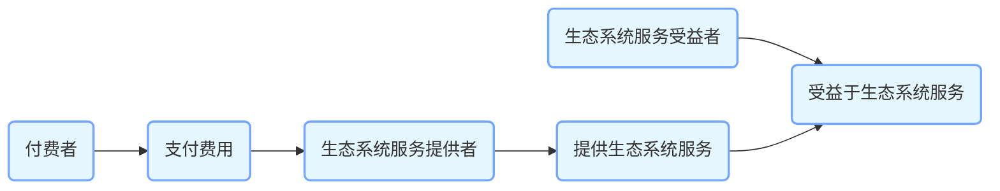

# 生态系统服务付费机制的投资模式探讨

> 关键词：生态系统服务付费机制、投资模式、生态经济、可持续发展、环境金融

> 摘要：本文旨在深入探讨生态系统服务付费机制的投资模式。首先介绍了生态系统服务付费机制的背景和重要性，明确了研究的目的和范围。接着阐述了核心概念，包括生态系统服务、付费机制等，并给出了相关的架构示意图和流程图。详细讲解了核心算法原理及具体操作步骤，结合数学模型和公式进行分析。通过项目实战案例，展示了投资模式在实际中的应用和实现过程。探讨了该机制的实际应用场景，推荐了相关的学习资源、开发工具和论文著作。最后总结了未来发展趋势与挑战，解答了常见问题，并提供了扩展阅读和参考资料，为生态系统服务付费机制的投资模式研究和实践提供全面的指导。

## 1. 背景介绍 
### 1.1 目的和范围
生态系统为人类提供了众多至关重要的服务，如清洁的空气、水源涵养、土壤保持等。然而，长期以来，这些生态系统服务的价值并未得到充分的认识和体现，导致生态环境不断恶化。生态系统服务付费机制（Payment for Ecosystem Services, PES）作为一种市场化的生态保护手段，旨在通过经济激励来促进生态系统的保护和可持续利用。

本文的目的是深入探讨生态系统服务付费机制的投资模式，分析不同投资模式的特点、优缺点以及适用场景，为投资者、政策制定者和生态保护从业者提供参考。研究范围涵盖了各种类型的生态系统服务，包括但不限于森林生态系统服务、湿地生态系统服务、农田生态系统服务等，以及与之相关的付费机制和投资模式。

### 1.2 预期读者
本文的预期读者包括：
1. **投资者**：对生态环境领域投资感兴趣的个人和机构投资者，希望了解生态系统服务付费机制的投资机会和风险。
2. **政策制定者**：政府部门的相关工作人员，负责制定生态保护政策和法规，需要了解不同投资模式对生态保护的影响。
3. **生态保护从业者**：从事生态保护和研究的专业人员，包括生态学家、环境工程师等，希望深入了解生态系统服务付费机制的运作原理和实践经验。
4. **学者和研究人员**：对生态经济、环境金融等领域进行研究的学者和研究人员，关注生态系统服务付费机制的理论和实践进展。

### 1.3 文档结构概述
本文将按照以下结构进行阐述：
1. **背景介绍**：介绍研究的目的、范围、预期读者和文档结构，以及相关术语的定义。
2. **核心概念与联系**：解释生态系统服务、付费机制等核心概念，给出概念原理和架构的文本示意图和 Mermaid 流程图。
3. **核心算法原理 & 具体操作步骤**：讲解核心算法原理，如成本 - 效益分析、风险评估等，并给出具体的操作步骤，同时使用 Python 源代码进行详细阐述。
4. **数学模型和公式 & 详细讲解 & 举例说明**：介绍相关的数学模型和公式，如生态系统服务价值评估模型、投资回报率模型等，并进行详细讲解和举例说明。
5. **项目实战：代码实际案例和详细解释说明**：通过实际项目案例，展示生态系统服务付费机制投资模式的开发环境搭建、源代码实现和代码解读。
6. **实际应用场景**：探讨生态系统服务付费机制投资模式在不同领域的实际应用场景。
7. **工具和资源推荐**：推荐相关的学习资源、开发工具和论文著作。
8. **总结：未来发展趋势与挑战**：总结生态系统服务付费机制投资模式的未来发展趋势和面临的挑战。
9. **附录：常见问题与解答**：解答读者可能遇到的常见问题。
10. **扩展阅读 & 参考资料**：提供扩展阅读的建议和相关参考资料。

### 1.4 术语表
#### 1.4.1 核心术语定义
1. **生态系统服务（Ecosystem Services）**：指生态系统为人类提供的各种利益，包括供给服务（如食物、水、木材等）、调节服务（如气候调节、洪水控制、水质净化等）、文化服务（如旅游、休闲、教育等）和支持服务（如土壤形成、养分循环等）。
2. **生态系统服务付费机制（Payment for Ecosystem Services, PES）**：是一种基于市场的生态保护手段，通过向提供生态系统服务的一方支付费用，激励其采取有利于生态保护的行为，从而实现生态系统服务的可持续供给。
3. **投资模式（Investment Model）**：指投资者为了获取经济回报或实现其他目标，将资金投入到特定项目或领域的方式和策略。
4. **成本 - 效益分析（Cost - Benefit Analysis）**：是一种用于评估项目或政策的经济可行性的方法，通过比较项目的成本和效益，确定项目是否值得投资。
5. **风险评估（Risk Assessment）**：是指对投资项目可能面临的各种风险进行识别、分析和评估的过程，以便投资者采取相应的风险应对措施。

#### 1.4.2 相关概念解释
1. **生态补偿（Ecological Compensation）**：是指通过经济手段对生态环境的破坏者进行惩罚，对生态环境的保护者进行补偿，以实现生态环境的公平和可持续发展。生态系统服务付费机制是生态补偿的一种具体形式。
2. **绿色金融（Green Finance）**：是指为支持环境改善、应对气候变化和资源节约高效利用的经济活动，即对环保、节能、清洁能源、绿色交通、绿色建筑等领域的项目投融资、项目运营、风险管理等所提供的金融服务。生态系统服务付费机制的投资模式与绿色金融密切相关。
3. **可持续发展（Sustainable Development）**：是指既满足当代人的需求，又不损害后代人满足其需求的能力的发展。生态系统服务付费机制的投资模式旨在促进生态保护和经济发展的协调统一，实现可持续发展的目标。

#### 1.4.3 缩略词列表
1. **PES**：Payment for Ecosystem Services（生态系统服务付费机制）
2. **CBA**：Cost - Benefit Analysis（成本 - 效益分析）
3. **RA**：Risk Assessment（风险评估）

## 2. 核心概念与联系 
### 核心概念原理
生态系统服务付费机制的核心原理是基于生态系统服务的价值和市场机制。生态系统服务具有经济价值，但由于其公共物品的属性，往往存在市场失灵的问题。生态系统服务付费机制通过建立一种经济激励机制，使生态系统服务的提供者能够获得相应的经济回报，从而激励他们采取有利于生态保护的行为。

在这个机制中，存在三个主要的参与方：生态系统服务的提供者、生态系统服务的受益者和付费者。生态系统服务的提供者通常是土地所有者、农民、牧民等，他们通过采取特定的土地利用方式或管理措施，为生态系统服务的产生做出贡献。生态系统服务的受益者可以是当地居民、企业、政府等，他们从生态系统服务中获得了各种利益。付费者可以是受益者本身，也可以是其他第三方，如政府、基金会、企业等，他们为了获得生态系统服务或支持生态保护，向提供者支付费用。

### 架构的文本示意图
```plaintext
生态系统服务付费机制架构

|-- 生态系统服务提供者
|   |-- 土地所有者
|   |-- 农民
|   |-- 牧民
|   |--...
|
|-- 生态系统服务受益者
|   |-- 当地居民
|   |-- 企业
|   |-- 政府
|   |--...
|
|-- 付费者
|   |-- 受益者
|   |-- 政府
|   |-- 基金会
|   |-- 企业
|   |--...
|
|-- 付费机制
|   |-- 直接支付
|   |-- 税收优惠
|   |-- 市场交易
|   |--...
|
|-- 生态系统服务
|   |-- 供给服务
|   |   |-- 食物
|   |   |-- 水
|   |   |-- 木材
|   |   |--...
|   |-- 调节服务
|   |   |-- 气候调节
|   |   |-- 洪水控制
|   |   |-- 水质净化
|   |   |--...
|   |-- 文化服务
|   |   |-- 旅游
|   |   |-- 休闲
|   |   |-- 教育
|   |   |--...
|   |-- 支持服务
|   |   |-- 土壤形成
|   |   |-- 养分循环
|   |   |--...
```

### Mermaid 流程图


该流程图展示了生态系统服务付费机制的基本流程。生态系统服务提供者提供生态系统服务，生态系统服务受益者从中受益，付费者向提供者支付费用，形成一个闭环的经济激励机制。

## 3. 核心算法原理 & 具体操作步骤 
### 核心算法原理
#### 成本 - 效益分析（CBA）
成本 - 效益分析是评估生态系统服务付费机制投资项目的重要方法。其基本原理是比较项目的成本和效益，计算项目的净现值（Net Present Value, NPV）和内部收益率（Internal Rate of Return, IRR），以确定项目是否值得投资。

净现值的计算公式为：
$$NPV=\sum_{t = 0}^{n}\frac{B_t - C_t}{(1 + r)^t}$$
其中，$B_t$ 表示第 $t$ 期的效益，$C_t$ 表示第 $t$ 期的成本，$r$ 表示折现率，$n$ 表示项目的寿命期。

内部收益率是使项目净现值为零的折现率，即：
$$\sum_{t = 0}^{n}\frac{B_t - C_t}{(1 + IRR)^t}=0$$

#### 风险评估（RA）
风险评估是识别、分析和评估投资项目可能面临的各种风险的过程。常见的风险评估方法包括敏感性分析、蒙特卡罗模拟等。

敏感性分析是通过改变项目的某个或多个参数，观察项目净现值或内部收益率的变化情况，以评估项目对不同参数的敏感性。

蒙特卡罗模拟是一种基于概率统计的模拟方法，通过随机生成项目的输入参数，模拟项目的各种可能结果，从而评估项目的风险。

### 具体操作步骤
#### 步骤 1：确定项目范围和目标
明确生态系统服务付费机制投资项目的范围和目标，包括所涉及的生态系统类型、生态系统服务类型、投资规模、预期效益等。

#### 步骤 2：收集数据
收集与项目相关的数据，包括生态系统服务的价值评估数据、项目的成本数据、市场需求数据、政策法规数据等。

#### 步骤 3：进行成本 - 效益分析
根据收集到的数据，计算项目的成本和效益，运用上述成本 - 效益分析公式计算项目的净现值和内部收益率，评估项目的经济可行性。

#### 步骤 4：进行风险评估
运用敏感性分析、蒙特卡罗模拟等方法，对项目可能面临的各种风险进行评估，确定项目的风险水平。

#### 步骤 5：制定投资决策
根据成本 - 效益分析和风险评估的结果，制定投资决策。如果项目的净现值大于零，内部收益率大于折现率，且风险水平在可接受范围内，则可以考虑投资该项目。

### Python 源代码实现
```python
import numpy as np

def calculate_npv(benefits, costs, discount_rate):
    """
    计算项目的净现值
    :param benefits: 各期效益列表
    :param costs: 各期成本列表
    :param discount_rate: 折现率
    :return: 净现值
    """
    net_cash_flows = np.array(benefits) - np.array(costs)
    periods = len(net_cash_flows)
    discount_factors = [(1 + discount_rate) ** -t for t in range(periods)]
    npv = np.sum(net_cash_flows * discount_factors)
    return npv

def calculate_irr(benefits, costs):
    """
    计算项目的内部收益率
    :param benefits: 各期效益列表
    :param costs: 各期成本列表
    :return: 内部收益率
    """
    net_cash_flows = np.array(benefits) - np.array(costs)
    irr = np.irr(net_cash_flows)
    return irr

# 示例数据
benefits = [0, 100, 200, 300, 400]
costs = [500, 50, 50, 50, 50]
discount_rate = 0.1

# 计算净现值和内部收益率
npv = calculate_npv(benefits, costs, discount_rate)
irr = calculate_irr(benefits, costs)

print(f"净现值: {npv}")
print(f"内部收益率: {irr}")
```

在上述代码中，`calculate_npv` 函数用于计算项目的净现值，`calculate_irr` 函数用于计算项目的内部收益率。通过示例数据，展示了如何调用这两个函数进行成本 - 效益分析。

## 4. 数学模型和公式 & 详细讲解 & 举例说明 
### 生态系统服务价值评估模型
#### 市场价值法
市场价值法是根据生态系统服务在市场上的交易价格来评估其价值的方法。如果生态系统服务具有明确的市场价格，如木材、农产品等，则可以直接使用市场价格来计算其价值。

计算公式为：
$$V = P\times Q$$
其中，$V$ 表示生态系统服务的价值，$P$ 表示市场价格，$Q$ 表示生态系统服务的数量。

例如，一片森林每年可提供 1000 立方米的木材，木材的市场价格为每立方米 500 元，则该森林木材供给服务的价值为：
$$V = 500\times1000 = 500000$$（元）

#### 替代成本法
替代成本法是通过估算替代生态系统服务所需的成本来评估其价值的方法。当生态系统服务没有明确的市场价格时，可以考虑使用替代成本法。

例如，为了净化一定量的污水，需要建设一座污水处理厂，其建设和运营成本为每年 100 万元。如果某湿地生态系统能够自然净化相同数量的污水，则该湿地的水质净化服务价值可以估算为每年 100 万元。

#### 条件价值法
条件价值法是通过问卷调查等方式，询问人们愿意为获得某种生态系统服务支付的费用或为失去某种生态系统服务接受的补偿费用，从而评估生态系统服务的价值。

假设通过问卷调查得知，当地居民愿意为保护一片湿地生态系统每年支付的平均费用为 50 元，该地区共有 10000 名居民，则该湿地生态系统的文化服务（如休闲、旅游等）价值可以估算为：
$$V = 50\times10000 = 500000$$（元）

### 投资回报率模型
投资回报率（Return on Investment, ROI）是衡量投资项目盈利能力的重要指标，其计算公式为：
$$ROI=\frac{净利润}{投资成本}\times100\%$$

例如，某生态系统服务付费机制投资项目的投资成本为 100 万元，项目运营一年后的净利润为 20 万元，则该项目的投资回报率为：
$$ROI=\frac{20}{100}\times100\% = 20\%$$

### 风险评估模型
#### 敏感性分析
敏感性分析主要通过计算敏感度系数来评估项目对不同参数的敏感性。敏感度系数的计算公式为：
$$S_{AF}=\frac{\Delta A/A}{\Delta F/F}$$
其中，$S_{AF}$ 表示敏感度系数，$\Delta A/A$ 表示评价指标（如净现值）的变化率，$\Delta F/F$ 表示不确定因素（如成本、效益等）的变化率。

假设某项目的净现值为 100 万元，当成本增加 10% 时，净现值变为 80 万元。则成本的敏感度系数为：
$$S_{AF}=\frac{(80 - 100)/100}{0.1}=- 2$$

#### 蒙特卡罗模拟
蒙特卡罗模拟是一种基于概率统计的模拟方法，通过随机生成项目的输入参数，模拟项目的各种可能结果。假设某项目的效益和成本服从正态分布，我们可以使用 Python 中的 `numpy` 库进行蒙特卡罗模拟。

```python
import numpy as np
import matplotlib.pyplot as plt

# 模拟次数
num_simulations = 1000

# 效益和成本的均值和标准差
benefit_mean = 200
benefit_std = 20
cost_mean = 150
cost_std = 15

# 生成随机效益和成本
benefits = np.random.normal(benefit_mean, benefit_std, num_simulations)
costs = np.random.normal(cost_mean, cost_std, num_simulations)

# 计算净现值
discount_rate = 0.1
npvs = []
for i in range(num_simulations):
    npv = (benefits[i] - costs[i]) / (1 + discount_rate)
    npvs.append(npv)

# 绘制净现值的直方图
plt.hist(npvs, bins=30, edgecolor='k')
plt.xlabel('净现值')
plt.ylabel('频数')
plt.title('蒙特卡罗模拟净现值分布')
plt.show()
```

在上述代码中，我们使用 `numpy` 库生成了 1000 个随机的效益和成本值，计算了每个模拟的净现值，并绘制了净现值的直方图。通过蒙特卡罗模拟，我们可以直观地了解项目净现值的分布情况，评估项目的风险。

## 5. 项目实战：代码实际案例和详细解释说明 
### 5.1  开发环境搭建
#### 操作系统
本项目可以在 Windows、Linux 或 macOS 操作系统上进行开发。建议使用最新版本的操作系统以确保兼容性和稳定性。

#### Python 环境
安装 Python 3.7 及以上版本。可以从 Python 官方网站（https://www.python.org/downloads/）下载并安装。

#### 开发工具
推荐使用 PyCharm 作为开发工具，它是一款功能强大的 Python 集成开发环境（IDE），提供了代码编辑、调试、版本控制等一系列功能。也可以使用 Visual Studio Code 等轻量级编辑器。

#### 安装必要的库
在命令行中使用 `pip` 命令安装必要的库，如 `numpy`、`matplotlib` 等：
```sh
pip install numpy matplotlib
```

### 5.2  源代码详细实现和代码解读
```python
import numpy as np
import matplotlib.pyplot as plt

# 定义生态系统服务付费机制投资项目类
class PESInvestmentProject:
    def __init__(self, initial_cost, annual_benefits, annual_costs, discount_rate, project_life):
        """
        初始化项目参数
        :param initial_cost: 初始投资成本
        :param annual_benefits: 每年的效益列表
        :param annual_costs: 每年的成本列表
        :param discount_rate: 折现率
        :param project_life: 项目寿命期
        """
        self.initial_cost = initial_cost
        self.annual_benefits = annual_benefits
        self.annual_costs = annual_costs
        self.discount_rate = discount_rate
        self.project_life = project_life

    def calculate_npv(self):
        """
        计算项目的净现值
        :return: 净现值
        """
        net_cash_flows = [-self.initial_cost] + [self.annual_benefits[i] - self.annual_costs[i] for i in range(self.project_life)]
        discount_factors = [(1 + self.discount_rate) ** -t for t in range(self.project_life + 1)]
        npv = np.sum(np.array(net_cash_flows) * np.array(discount_factors))
        return npv

    def calculate_irr(self):
        """
        计算项目的内部收益率
        :return: 内部收益率
        """
        net_cash_flows = [-self.initial_cost] + [self.annual_benefits[i] - self.annual_costs[i] for i in range(self.project_life)]
        irr = np.irr(np.array(net_cash_flows))
        return irr

    def sensitivity_analysis(self, parameter, change_rate):
        """
        进行敏感性分析
        :param parameter: 要分析的参数，如 'initial_cost'、'annual_benefits' 等
        :param change_rate: 参数的变化率
        :return: 净现值的变化率
        """
        original_npv = self.calculate_npv()
        if parameter == 'initial_cost':
            new_initial_cost = self.initial_cost * (1 + change_rate)
            new_project = PESInvestmentProject(new_initial_cost, self.annual_benefits, self.annual_costs, self.discount_rate, self.project_life)
        elif parameter == 'annual_benefits':
            new_annual_benefits = [benefit * (1 + change_rate) for benefit in self.annual_benefits]
            new_project = PESInvestmentProject(self.initial_cost, new_annual_benefits, self.annual_costs, self.discount_rate, self.project_life)
        elif parameter == 'annual_costs':
            new_annual_costs = [cost * (1 + change_rate) for cost in self.annual_costs]
            new_project = PESInvestmentProject(self.initial_cost, self.annual_benefits, new_annual_costs, self.discount_rate, self.project_life)
        else:
            raise ValueError("无效的参数名称")

        new_npv = new_project.calculate_npv()
        npv_change_rate = (new_npv - original_npv) / original_npv
        return npv_change_rate

    def monte_carlo_simulation(self, num_simulations):
        """
        进行蒙特卡罗模拟
        :param num_simulations: 模拟次数
        :return: 模拟得到的净现值列表
        """
        npvs = []
        for _ in range(num_simulations):
            random_benefits = [np.random.normal(benefit, benefit * 0.1) for benefit in self.annual_benefits]
            random_costs = [np.random.normal(cost, cost * 0.1) for cost in self.annual_costs]
            new_project = PESInvestmentProject(self.initial_cost, random_benefits, random_costs, self.discount_rate, self.project_life)
            npv = new_project.calculate_npv()
            npvs.append(npv)
        return npvs

# 示例项目参数
initial_cost = 1000000
annual_benefits = [200000, 220000, 240000, 260000, 280000]
annual_costs = [100000, 110000, 120000, 130000, 140000]
discount_rate = 0.1
project_life = 5

# 创建项目实例
project = PESInvestmentProject(initial_cost, annual_benefits, annual_costs, discount_rate, project_life)

# 计算净现值和内部收益率
npv = project.calculate_npv()
irr = project.calculate_irr()
print(f"净现值: {npv}")
print(f"内部收益率: {irr}")

# 进行敏感性分析
parameter = 'annual_benefits'
change_rate = 0.1
npv_change_rate = project.sensitivity_analysis(parameter, change_rate)
print(f"当 {parameter} 增加 {change_rate * 100}% 时，净现值变化率: {npv_change_rate * 100}%")

# 进行蒙特卡罗模拟
num_simulations = 1000
npvs = project.monte_carlo_simulation(num_simulations)

# 绘制净现值的直方图
plt.hist(npvs, bins=30, edgecolor='k')
plt.xlabel('净现值')
plt.ylabel('频数')
plt.title('蒙特卡罗模拟净现值分布')
plt.show()
```

### 5.3  代码解读与分析
#### 类定义
`PESInvestmentProject` 类用于表示生态系统服务付费机制投资项目，包含了项目的初始投资成本、每年的效益和成本、折现率和项目寿命期等参数。

#### 方法实现
1. **`calculate_npv` 方法**：计算项目的净现值。通过将每年的净现金流量折现到当前时刻，然后求和得到净现值。
2. **`calculate_irr` 方法**：计算项目的内部收益率。使用 `numpy` 库的 `irr` 函数求解使净现值为零的折现率。
3. **`sensitivity_analysis` 方法**：进行敏感性分析。通过改变项目的某个参数（如初始投资成本、每年的效益或成本），计算净现值的变化率，评估项目对该参数的敏感性。
4. **`monte_carlo_simulation` 方法**：进行蒙特卡罗模拟。通过随机生成每年的效益和成本，模拟项目的各种可能结果，得到净现值的分布情况。

#### 示例运行
在代码的最后，我们创建了一个项目实例，计算了项目的净现值和内部收益率，进行了敏感性分析和蒙特卡罗模拟，并绘制了净现值的直方图。通过这些操作，我们可以全面评估项目的经济可行性和风险。

## 6. 实际应用场景 
### 森林生态系统服务付费
#### 碳汇交易
森林具有吸收二氧化碳的功能，通过碳汇交易，企业或其他组织可以购买森林碳汇来抵消其碳排放。投资者可以投资森林保护和造林项目，通过出售碳汇获得经济回报。例如，某企业为了实现碳中和目标，向一个森林碳汇项目购买了一定数量的碳汇指标，该项目的投资者则从中获得了收益。

#### 木材供应和生态旅游
投资者可以投资森林经营项目，既可以通过砍伐和销售木材获得经济收入，又可以开发森林生态旅游项目，吸引游客，增加旅游收入。同时，良好的森林生态环境也为其他生态系统服务的提供奠定了基础。

### 湿地生态系统服务付费
#### 水质净化和洪水调节
湿地具有净化水质和调节洪水的功能。政府或污水处理企业可以向湿地保护者支付费用，以利用湿地的水质净化服务。投资者可以参与湿地保护和修复项目，通过获得政府补贴或企业付费来实现经济回报。例如，某城市的污水处理厂向一片湿地保护区支付费用，委托其对部分污水进行自然净化处理。

#### 湿地生态旅游
湿地独特的生态景观和丰富的生物多样性吸引了大量游客。投资者可以开发湿地生态旅游项目，建设旅游设施，提供旅游服务，如观鸟、划船等，从而获得旅游收入。

### 农田生态系统服务付费
#### 农业面源污染控制
农业生产过程中产生的面源污染对水环境造成了严重影响。政府或水资源管理部门可以向采用环保农业技术的农民支付费用，以减少农业面源污染。投资者可以参与农业生态项目的投资，推广环保农业技术，帮助农民获得付费，同时从项目中获得一定的收益。

#### 农产品质量提升
随着消费者对农产品质量和安全的关注度不断提高，投资者可以投资农产品质量提升项目，如有机农业、绿色农业等。通过提高农产品的品质和附加值，获得更高的市场价格，实现经济回报。

## 7. 工具和资源推荐
### 7.1 学习资源推荐
#### 7.1.1 书籍推荐
1. 《生态经济学》：本书系统介绍了生态经济学的基本理论和方法，包括生态系统服务价值评估、生态补偿机制等内容，对于理解生态系统服务付费机制具有重要的参考价值。
2. 《绿色金融：理论与实践》：详细阐述了绿色金融的概念、发展现状和实践案例，涉及生态系统服务付费机制的投资模式和金融创新等方面的内容。
3. 《环境经济学》：从经济学的角度探讨了环境问题的本质和解决方法，包括生态系统服务的市场机制和政策设计等内容。

#### 7.1.2 在线课程
1. Coursera 上的 “Ecosystem Services and Sustainability” 课程：由知名高校的教授授课，介绍了生态系统服务的概念、评估方法和可持续发展的相关内容。
2. edX 上的 “Green Finance and Investment” 课程：深入讲解了绿色金融的理论和实践，包括生态系统服务付费机制的投资策略和风险管理等方面的知识。

#### 7.1.3 技术博客和网站
1. 世界自然基金会（WWF）官网：提供了大量关于生态保护和生态系统服务的信息和研究报告。
2. 国际自然保护联盟（IUCN）官网：发布了许多有关生态系统服务付费机制的政策建议和实践案例。
3. 生态经济学会官网：关注生态经济领域的最新研究动态和学术交流，有许多关于生态系统服务价值评估和付费机制的文章和研究成果。

### 7.2 开发工具框架推荐
#### 7.2.1 IDE和编辑器
1. PyCharm：功能强大的 Python 集成开发环境，提供了代码编辑、调试、版本控制等一系列功能，适合进行生态系统服务付费机制投资项目的开发。
2. Visual Studio Code：轻量级的代码编辑器，支持多种编程语言，具有丰富的插件扩展功能，可以满足不同的开发需求。

#### 7.2.2 调试和性能分析工具
1. PDB：Python 自带的调试工具，可以帮助开发者在代码运行过程中进行调试，查找和解决问题。
2. cProfile：Python 的性能分析工具，可以分析代码的运行时间和函数调用情况，帮助开发者优化代码性能。

#### 7.2.3 相关框架和库
1. `numpy`：Python 的数值计算库，提供了高效的数组操作和数学函数，用于实现成本 - 效益分析、风险评估等算法。
2. `matplotlib`：Python 的绘图库，可以绘制各种类型的图表，如净现值直方图、敏感性分析图表等，帮助开发者直观地展示分析结果。
3. `pandas`：Python 的数据处理库，用于数据的读取、清洗和分析，方便处理生态系统服务付费机制投资项目中的各种数据。

### 7.3 相关论文著作推荐
#### 7.3.1 经典论文
1. "The Economics of Ecosystems and Biodiversity (TEEB)"：该报告是生态系统和生物多样性经济学领域的经典文献，系统评估了生态系统服务的经济价值和保护的重要性。
2. "Payment for Ecosystem Services: Some Nuts and Bolts"：详细介绍了生态系统服务付费机制的基本原理、设计要素和实施方法。

#### 7.3.2 最新研究成果
1. 近年来在《Ecological Economics》、《Journal of Environmental Economics and Management》等学术期刊上发表的关于生态系统服务付费机制的研究论文，关注了该领域的最新理论和实践进展。
2. 国际组织和研究机构发布的研究报告，如世界银行的《Natural Capital Accounting and Valuation of Ecosystem Services》等，提供了生态系统服务价值评估和付费机制的最新方法和案例。

#### 7.3.3 应用案例分析
1. 《Case Studies in Payment for Ecosystem Services》：收集了世界各地生态系统服务付费机制的实际应用案例，分析了不同案例的特点、成功经验和挑战。
2. 相关政府部门和企业发布的生态系统服务付费项目报告，详细介绍了项目的实施过程、效果评估和经济收益等情况。

## 8. 总结：未来发展趋势与挑战
### 未来发展趋势
#### 市场规模扩大
随着人们对生态环境问题的关注度不断提高和可持续发展理念的深入人心，生态系统服务付费机制的市场需求将不断增加。未来，生态系统服务付费市场的规模有望进一步扩大，涉及的领域和范围也将更加广泛。

#### 金融创新不断
为了满足生态系统服务付费机制投资的需求，金融机构将不断推出创新的金融产品和服务，如生态债券、绿色基金、碳期货等。这些金融创新将为生态系统服务付费机制的发展提供更多的资金支持和风险管理工具。

#### 国际合作加强
生态系统服务具有全球性和跨区域的特点，需要各国之间加强合作。未来，国际组织和各国政府将加强在生态系统服务付费机制方面的合作，共同制定标准和规范，分享经验和技术，推动全球生态保护事业的发展。

#### 数字化和智能化应用
随着信息技术的快速发展，数字化和智能化技术将在生态系统服务付费机制中得到更广泛的应用。例如，利用卫星遥感、物联网等技术实时监测生态系统服务的变化情况，利用区块链技术实现付费交易的透明化和可追溯性等。

### 面临的挑战
#### 生态系统服务价值评估难题
生态系统服务的价值评估是生态系统服务付费机制的关键环节，但目前还存在许多难题。生态系统服务的多样性和复杂性使得其价值难以准确评估，不同的评估方法和参数选择可能导致评估结果的差异较大。

#### 政策法规不完善
生态系统服务付费机制的实施需要完善的政策法规支持，但目前相关的政策法规还不够健全。例如，缺乏明确的产权界定、付费标准和监管机制等，导致付费机制的运行存在一定的困难和风险。

#### 投资回报不确定性
生态系统服务付费机制的投资回报受到多种因素的影响，如生态系统服务的市场需求、政策变化、自然灾害等，具有较大的不确定性。这使得投资者在进行投资决策时面临较大的风险，影响了投资的积极性。

#### 社会认知和参与度不足
部分社会公众和企业对生态系统服务的价值和付费机制的重要性认识不足，参与生态保护和付费的积极性不高。此外，生态系统服务付费机制的实施需要多方面的参与和协作，但目前各利益相关方之间的沟通和协调还存在一定的问题。

## 9. 附录：常见问题与解答
### 问题 1：生态系统服务付费机制与生态补偿有什么区别？
生态系统服务付费机制是生态补偿的一种具体形式。生态补偿是一个更广泛的概念，包括通过行政手段、法律手段等对生态环境的破坏者进行惩罚，对生态环境的保护者进行补偿。而生态系统服务付费机制主要是基于市场机制，通过向提供生态系统服务的一方支付费用，激励其采取有利于生态保护的行为。

### 问题 2：如何确定生态系统服务的付费标准？
确定生态系统服务的付费标准是一个复杂的问题，需要综合考虑多种因素。常见的方法包括市场价值法、替代成本法、条件价值法等。同时，还需要考虑生态系统服务的供给成本、市场需求、政策目标等因素。在实际操作中，可以通过协商、拍卖等方式确定付费标准。

### 问题 3：生态系统服务付费机制的投资风险有哪些？
生态系统服务付费机制的投资风险主要包括以下几个方面：
1. **生态风险**：如自然灾害、病虫害等可能导致生态系统服务的供给减少或质量下降，影响投资回报。
2. **市场风险**：生态系统服务的市场需求和价格可能受到经济形势、政策变化等因素的影响，存在不确定性。
3. **政策风险**：相关政策法规的变化可能影响生态系统服务付费机制的运行和投资回报。
4. **技术风险**：生态系统服务的监测和评估技术可能存在误差或不完善，影响付费机制的公平性和有效性。

### 问题 4：如何提高社会公众和企业对生态系统服务付费机制的参与度？
可以从以下几个方面提高社会公众和企业的参与度：
1. **加强宣传教育**：通过各种媒体渠道，宣传生态系统服务的价值和付费机制的重要性，提高社会公众和企业的认知水平。
2. **提供经济激励**：政府可以出台相关的优惠政策，如税收减免、财政补贴等，鼓励企业和社会公众参与生态系统服务付费机制。
3. **建立公平合理的机制**：确保付费机制的公平性和透明度，让参与者能够获得合理的回报，提高其参与的积极性。
4. **加强合作与沟通**：建立政府、企业、社会公众等各利益相关方之间的沟通和协作机制，共同推动生态系统服务付费机制的实施。

## 10. 扩展阅读 & 参考资料
### 扩展阅读
1. 《自然资本论》：探讨了自然资本的概念和价值，以及如何将自然资本纳入经济发展的考量中，与生态系统服务付费机制密切相关。
2. 《零碳社会》：介绍了实现零碳社会的路径和方法，其中涉及到生态系统服务在应对气候变化中的作用和价值。
3. 《循环经济：从线性经济到闭环经济》：阐述了循环经济的理念和实践，生态系统服务付费机制可以为循环经济的发展提供支持和保障。

### 参考资料
1. 世界银行. Natural Capital Accounting and Valuation of Ecosystem Services.
2. 国际自然保护联盟（IUCN）. Payment for Ecosystem Services: A Global Review.
3. 生态经济学会. 生态经济学研究报告.
4. 相关学术期刊：《Ecological Economics》、《Journal of Environmental Economics and Management》、《Environmental Science & Technology》等。

作者：AI天才研究院/AI Genius Institute & 禅与计算机程序设计艺术 /Zen And The Art of Computer Programming