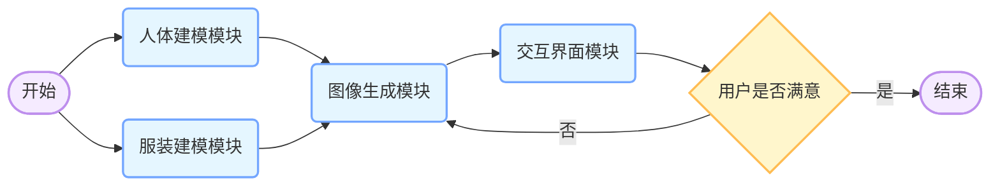

# 生成对抗网络在虚拟试衣系统中的应用创新

> 关键词：生成对抗网络、虚拟试衣系统、图像生成、应用创新、时尚科技

> 摘要：本文聚焦于生成对抗网络（GAN）在虚拟试衣系统中的应用创新。首先介绍了研究的背景、目的、预期读者等信息，接着阐述了生成对抗网络和虚拟试衣系统的核心概念及联系，详细讲解了相关核心算法原理与操作步骤，给出了数学模型和公式并举例说明。通过项目实战展示了代码的实际案例及详细解释，探讨了虚拟试衣系统的实际应用场景。同时推荐了学习资源、开发工具框架和相关论文著作。最后总结了未来发展趋势与挑战，提供了常见问题解答及扩展阅读和参考资料，旨在为该领域的研究和实践提供全面而深入的指导。

## 1. 背景介绍 
### 1.1 目的和范围
随着时尚产业的发展和科技的进步，虚拟试衣系统成为了研究和应用的热点。传统的试衣方式存在时间和空间的限制，而虚拟试衣系统能够为用户提供更加便捷、高效的试衣体验。生成对抗网络作为一种强大的图像生成模型，在虚拟试衣系统中具有巨大的应用潜力。本文的目的是深入探讨生成对抗网络在虚拟试衣系统中的应用创新，分析其原理、算法、实际应用案例等，为相关领域的研究和开发提供理论支持和实践指导。研究范围涵盖了生成对抗网络的基本原理、虚拟试衣系统的架构设计、算法实现、实际应用场景以及未来发展趋势等方面。

### 1.2 预期读者
本文预期读者包括计算机科学、人工智能、时尚科技等领域的研究人员、开发者、学生以及对虚拟试衣系统和生成对抗网络感兴趣的专业人士。对于研究人员，本文可以为他们的科研工作提供新的思路和方向；对于开发者，本文可以帮助他们掌握相关技术并应用于实际项目中；对于学生，本文可以作为学习资料，帮助他们了解前沿技术的应用；对于其他专业人士，本文可以让他们对虚拟试衣系统和生成对抗网络有更深入的了解。

### 1.3 文档结构概述
本文将按照以下结构进行组织：首先介绍核心概念与联系，包括生成对抗网络和虚拟试衣系统的基本原理和架构；接着详细讲解核心算法原理和具体操作步骤，并给出Python源代码；然后介绍数学模型和公式，并通过举例进行说明；之后进行项目实战，展示代码的实际案例和详细解释；再探讨实际应用场景；推荐相关的工具和资源；总结未来发展趋势与挑战；提供常见问题解答；最后给出扩展阅读和参考资料。

### 1.4 术语表
#### 1.4.1 核心术语定义
- **生成对抗网络（Generative Adversarial Networks，GAN）**：由生成器和判别器组成的深度学习模型，通过两者之间的对抗训练来生成逼真的数据样本。
- **虚拟试衣系统（Virtual Try - on System）**：利用计算机技术模拟用户试穿衣服的系统，让用户在不实际试穿的情况下看到自己穿上特定衣服的效果。
- **生成器（Generator）**：GAN中的一部分，负责生成数据样本，如生成穿着特定衣服的人体图像。
- **判别器（Discriminator）**：GAN中的另一部分，负责判断输入的数据是真实数据还是生成器生成的假数据。

#### 1.4.2 相关概念解释
- **图像生成**：指通过算法生成具有一定真实性和视觉效果的图像，在虚拟试衣系统中，就是生成用户穿着衣服的图像。
- **对抗训练**：生成器和判别器之间的一种训练方式，生成器试图生成更逼真的数据来欺骗判别器，判别器则试图准确区分真实数据和生成数据，两者在对抗中不断提升性能。

#### 1.4.3 缩略词列表
- **GAN**：Generative Adversarial Networks（生成对抗网络）
- **CNN**：Convolutional Neural Network（卷积神经网络）
- **FCN**：Fully Convolutional Network（全卷积网络）

## 2. 核心概念与联系 

### 2.1 生成对抗网络原理
生成对抗网络由生成器 $G$ 和判别器 $D$ 组成。生成器接收一个随机噪声向量 $z$ 作为输入，通过一系列的神经网络层将其转换为一个数据样本 $G(z)$，在虚拟试衣系统中，这个样本通常是一张穿着衣服的人体图像。判别器接收一个数据样本 $x$ 作为输入，判断它是真实数据（如真实拍摄的穿着衣服的人体图像）还是生成器生成的假数据，输出一个概率值 $D(x)$，表示 $x$ 是真实数据的概率。

生成器和判别器通过对抗训练来不断提升性能。在训练过程中，生成器的目标是生成更逼真的数据，使得判别器难以区分真假；判别器的目标是准确区分真实数据和生成数据。两者相互竞争，最终达到一个平衡状态，此时生成器能够生成非常逼真的数据。

### 2.2 虚拟试衣系统架构
虚拟试衣系统通常包括以下几个主要部分：
- **人体建模模块**：对用户的人体特征进行建模，如身高、体重、体型等，以便生成符合用户身材的试衣效果。
- **服装建模模块**：对服装的款式、颜色、材质等进行建模，将服装信息转换为计算机可以处理的形式。
- **图像生成模块**：利用生成对抗网络等技术，根据用户的人体模型和服装模型生成用户穿着衣服的图像。
- **交互界面模块**：提供用户与系统进行交互的界面，让用户可以选择服装、调整试衣效果等。

### 2.3 核心概念联系
生成对抗网络在虚拟试衣系统中主要应用于图像生成模块。通过生成对抗网络，系统可以根据用户的人体特征和选择的服装信息生成逼真的试衣图像。生成器负责生成试衣图像，判别器则用于判断生成的图像是否逼真。人体建模模块和服装建模模块为生成对抗网络提供了输入信息，交互界面模块则让用户可以方便地使用生成的试衣效果。

### 2.4 文本示意图
```plaintext
虚拟试衣系统
|-- 人体建模模块
|   |-- 人体特征提取
|   |-- 人体模型生成
|-- 服装建模模块
|   |-- 服装款式分析
|   |-- 服装材质处理
|-- 图像生成模块
|   |-- 生成对抗网络
|       |-- 生成器（输入：人体模型、服装模型、随机噪声）
|       |-- 判别器（输入：真实试衣图像、生成试衣图像）
|-- 交互界面模块
|   |-- 用户服装选择
|   |-- 试衣效果调整
```

### 2.5 Mermaid流程图


## 3. 核心算法原理 & 具体操作步骤 

### 3.1 生成对抗网络核心算法原理
生成对抗网络的训练过程可以用以下目标函数来表示：

生成器的目标是最小化判别器将其生成的数据判断为假数据的概率，即：
$$\min_G V(D, G) = \mathbb{E}_{z \sim p_z(z)}[\log(1 - D(G(z)))]$$

判别器的目标是最大化区分真实数据和生成数据的能力，即：
$$\max_D V(D, G) = \mathbb{E}_{x \sim p_{data}(x)}[\log(D(x))] + \mathbb{E}_{z \sim p_z(z)}[\log(1 - D(G(z)))]$$

其中，$p_{data}(x)$ 是真实数据的分布，$p_z(z)$ 是随机噪声的分布。

### 3.2 具体操作步骤

#### 3.2.1 数据准备
- 收集大量的真实人体图像和服装图像，对其进行标注和预处理，如裁剪、缩放、归一化等。
- 构建人体模型和服装模型，将其转换为适合生成对抗网络输入的格式。

#### 3.2.2 模型定义
使用Python和深度学习框架（如TensorFlow、PyTorch）定义生成器和判别器的网络结构。以下是一个简单的生成器和判别器的Python代码示例（使用PyTorch）：

```python
import torch
import torch.nn as nn

# 定义生成器
class Generator(nn.Module):
    def __init__(self, input_dim, output_dim):
        super(Generator, self).__init__()
        self.model = nn.Sequential(
            nn.Linear(input_dim, 256),
            nn.LeakyReLU(0.2),
            nn.Linear(256, 512),
            nn.LeakyReLU(0.2),
            nn.Linear(512, output_dim),
            nn.Tanh()
        )

    def forward(self, z):
        return self.model(z)

# 定义判别器
class Discriminator(nn.Module):
    def __init__(self, input_dim):
        super(Discriminator, self).__init__()
        self.model = nn.Sequential(
            nn.Linear(input_dim, 512),
            nn.LeakyReLU(0.2),
            nn.Linear(512, 256),
            nn.LeakyReLU(0.2),
            nn.Linear(256, 1),
            nn.Sigmoid()
        )

    def forward(self, x):
        return self.model(x)
```

#### 3.2.3 模型训练
在训练过程中，交替更新生成器和判别器的参数。具体步骤如下：
1. 从真实数据集中随机采样一批真实数据 $x$。
2. 生成一批随机噪声 $z$，通过生成器生成一批假数据 $G(z)$。
3. 计算判别器对真实数据和假数据的输出 $D(x)$ 和 $D(G(z))$。
4. 根据判别器的目标函数更新判别器的参数。
5. 生成一批新的随机噪声 $z$，计算判别器对生成数据的输出 $D(G(z))$。
6. 根据生成器的目标函数更新生成器的参数。

以下是训练代码示例：

```python
import torch.optim as optim

# 初始化生成器和判别器
input_dim = 100
output_dim = 784  # 假设输出图像的维度为 28x28
generator = Generator(input_dim, output_dim)
discriminator = Discriminator(output_dim)

# 定义优化器和损失函数
g_optimizer = optim.Adam(generator.parameters(), lr=0.0002, betas=(0.5, 0.999))
d_optimizer = optim.Adam(discriminator.parameters(), lr=0.0002, betas=(0.5, 0.999))
criterion = nn.BCELoss()

# 训练参数
num_epochs = 100
batch_size = 64

# 训练循环
for epoch in range(num_epochs):
    for i, real_data in enumerate(data_loader):
        # 训练判别器
        d_optimizer.zero_grad()
        real_labels = torch.ones(batch_size, 1)
        fake_labels = torch.zeros(batch_size, 1)

        # 计算判别器对真实数据的损失
        real_output = discriminator(real_data)
        d_real_loss = criterion(real_output, real_labels)

        # 生成假数据
        z = torch.randn(batch_size, input_dim)
        fake_data = generator(z)

        # 计算判别器对假数据的损失
        fake_output = discriminator(fake_data.detach())
        d_fake_loss = criterion(fake_output, fake_labels)

        # 总判别器损失
        d_loss = d_real_loss + d_fake_loss
        d_loss.backward()
        d_optimizer.step()

        # 训练生成器
        g_optimizer.zero_grad()
        z = torch.randn(batch_size, input_dim)
        fake_data = generator(z)
        output = discriminator(fake_data)
        g_loss = criterion(output, real_labels)
        g_loss.backward()
        g_optimizer.step()

    print(f'Epoch [{epoch+1}/{num_epochs}], D_loss: {d_loss.item():.4f}, G_loss: {g_loss.item():.4f}')
```

#### 3.2.4 模型评估
训练完成后，需要对生成对抗网络的性能进行评估。可以使用一些指标，如Inception Score（IS）、Frechet Inception Distance（FID）等，来评估生成图像的质量和多样性。

## 4. 数学模型和公式 & 详细讲解 & 举例说明 

### 4.1 生成对抗网络的数学模型
生成对抗网络的数学模型可以用前面提到的目标函数来表示。为了更深入地理解这个模型，我们可以对其进行详细讲解。

#### 4.1.1 判别器目标函数
判别器的目标函数为：
$$\max_D V(D, G) = \mathbb{E}_{x \sim p_{data}(x)}[\log(D(x))] + \mathbb{E}_{z \sim p_z(z)}[\log(1 - D(G(z)))]$$

这个目标函数可以分为两部分：
- $\mathbb{E}_{x \sim p_{data}(x)}[\log(D(x))]$：表示判别器对真实数据的判断能力。当判别器能够准确地将真实数据判断为真实数据时，$D(x)$ 接近 1，$\log(D(x))$ 接近 0，这部分损失较小。
- $\mathbb{E}_{z \sim p_z(z)}[\log(1 - D(G(z)))]$：表示判别器对生成数据的判断能力。当判别器能够准确地将生成数据判断为假数据时，$D(G(z))$ 接近 0，$\log(1 - D(G(z)))$ 接近 0，这部分损失也较小。

#### 4.1.2 生成器目标函数
生成器的目标函数为：
$$\min_G V(D, G) = \mathbb{E}_{z \sim p_z(z)}[\log(1 - D(G(z)))]$$

生成器的目标是让判别器难以区分生成数据和真实数据，即让 $D(G(z))$ 接近 1。当 $D(G(z))$ 接近 1 时，$\log(1 - D(G(z)))$ 接近负无穷，生成器的损失最小。

### 4.2 举例说明
假设我们有一个简单的二维数据集，真实数据分布 $p_{data}(x)$ 是一个高斯分布，随机噪声分布 $p_z(z)$ 也是一个高斯分布。生成器 $G$ 接收一个二维的随机噪声向量 $z$，通过一个简单的线性变换生成一个二维的数据点 $G(z)$。判别器 $D$ 接收一个二维的数据点 $x$，输出一个概率值 $D(x)$。

在训练过程中，生成器不断调整其参数，使得生成的数据点越来越接近真实数据分布；判别器不断调整其参数，使得能够准确区分真实数据点和生成数据点。最终，当生成器和判别器达到平衡时，生成器能够生成符合真实数据分布的二维数据点。

### 4.3 数学模型的意义
生成对抗网络的数学模型通过对抗训练的方式，让生成器和判别器相互竞争，从而使得生成器能够学习到真实数据的分布，生成逼真的数据样本。这种模型在图像生成、数据增强等领域具有广泛的应用。

## 5. 项目实战：代码实际案例和详细解释说明 

### 5.1  开发环境搭建
#### 5.1.1 安装Python
首先需要安装Python，建议使用Python 3.7及以上版本。可以从Python官方网站（https://www.python.org/downloads/）下载并安装。

#### 5.1.2 安装深度学习框架
本文使用PyTorch作为深度学习框架，可以根据自己的系统和CUDA版本选择合适的安装方式。可以通过以下命令安装：
```bash
pip install torch torchvision
```

#### 5.1.3 安装其他依赖库
还需要安装一些其他的依赖库，如NumPy、Matplotlib等，可以使用以下命令安装：
```bash
pip install numpy matplotlib
```

### 5.2  源代码详细实现和代码解读

#### 5.2.1 数据加载和预处理
```python
import torch
from torchvision import datasets, transforms

# 定义数据预处理
transform = transforms.Compose([
    transforms.ToTensor(),
    transforms.Normalize((0.5,), (0.5,))
])

# 加载MNIST数据集
train_dataset = datasets.MNIST(root='./data', train=True,
                               transform=transform, download=True)
train_loader = torch.utils.data.DataLoader(train_dataset, batch_size=64, shuffle=True)
```
代码解读：
- `transforms.Compose` 用于组合多个数据预处理操作，这里将图像转换为张量并进行归一化处理。
- `datasets.MNIST` 用于加载MNIST手写数字数据集。
- `torch.utils.data.DataLoader` 用于创建数据加载器，方便批量加载数据。

#### 5.2.2 定义生成器和判别器
```python
import torch.nn as nn

# 定义生成器
class Generator(nn.Module):
    def __init__(self, input_dim, output_dim):
        super(Generator, self).__init__()
        self.model = nn.Sequential(
            nn.Linear(input_dim, 256),
            nn.LeakyReLU(0.2),
            nn.Linear(256, 512),
            nn.LeakyReLU(0.2),
            nn.Linear(512, output_dim),
            nn.Tanh()
        )

    def forward(self, z):
        return self.model(z)

# 定义判别器
class Discriminator(nn.Module):
    def __init__(self, input_dim):
        super(Discriminator, self).__init__()
        self.model = nn.Sequential(
            nn.Linear(input_dim, 512),
            nn.LeakyReLU(0.2),
            nn.Linear(512, 256),
            nn.LeakyReLU(0.2),
            nn.Linear(256, 1),
            nn.Sigmoid()
        )

    def forward(self, x):
        return self.model(x)
```
代码解读：
- 生成器接收一个随机噪声向量 $z$，通过三层全连接层生成一个长度为 `output_dim` 的向量，最后使用 `Tanh` 激活函数将输出值限制在 $[-1, 1]$ 范围内。
- 判别器接收一个输入向量 $x$，通过三层全连接层输出一个概率值，表示 $x$ 是真实数据的概率，最后使用 `Sigmoid` 激活函数将输出值限制在 $[0, 1]$ 范围内。

#### 5.2.3 训练模型
```python
import torch.optim as optim
import matplotlib.pyplot as plt

# 初始化生成器和判别器
input_dim = 100
output_dim = 784  # 28x28
generator = Generator(input_dim, output_dim)
discriminator = Discriminator(output_dim)

# 定义优化器和损失函数
g_optimizer = optim.Adam(generator.parameters(), lr=0.0002, betas=(0.5, 0.999))
d_optimizer = optim.Adam(discriminator.parameters(), lr=0.0002, betas=(0.5, 0.999))
criterion = nn.BCELoss()

# 训练参数
num_epochs = 100
batch_size = 64

# 训练循环
for epoch in range(num_epochs):
    for i, (real_images, _) in enumerate(train_loader):
        real_images = real_images.view(-1, output_dim)

        # 训练判别器
        d_optimizer.zero_grad()
        real_labels = torch.ones(batch_size, 1)
        fake_labels = torch.zeros(batch_size, 1)

        # 计算判别器对真实数据的损失
        real_output = discriminator(real_images)
        d_real_loss = criterion(real_output, real_labels)

        # 生成假数据
        z = torch.randn(batch_size, input_dim)
        fake_images = generator(z)

        # 计算判别器对假数据的损失
        fake_output = discriminator(fake_images.detach())
        d_fake_loss = criterion(fake_output, fake_labels)

        # 总判别器损失
        d_loss = d_real_loss + d_fake_loss
        d_loss.backward()
        d_optimizer.step()

        # 训练生成器
        g_optimizer.zero_grad()
        z = torch.randn(batch_size, input_dim)
        fake_images = generator(z)
        output = discriminator(fake_images)
        g_loss = criterion(output, real_labels)
        g_loss.backward()
        g_optimizer.step()

    print(f'Epoch [{epoch+1}/{num_epochs}], D_loss: {d_loss.item():.4f}, G_loss: {g_loss.item():.4f}')

    # 每10个epoch可视化生成的图像
    if (epoch + 1) % 10 == 0:
        z = torch.randn(16, input_dim)
        fake_images = generator(z).view(-1, 1, 28, 28)
        fig, axs = plt.subplots(4, 4, figsize=(4, 4))
        for i in range(4):
            for j in range(4):
                axs[i, j].imshow(fake_images[i*4 + j].squeeze().detach().numpy(), cmap='gray')
                axs[i, j].axis('off')
        plt.show()
```
代码解读：
- 在每个训练周期中，首先训练判别器，计算判别器对真实数据和假数据的损失，然后更新判别器的参数。
- 接着训练生成器，计算生成器的损失并更新生成器的参数。
- 每10个训练周期，可视化生成的图像，观察生成器的训练效果。

### 5.3  代码解读与分析
#### 5.3.1 数据处理
通过 `transforms` 对数据进行预处理，将图像转换为张量并进行归一化处理，使得数据的取值范围在 $[-1, 1]$ 之间，有利于模型的训练。

#### 5.3.2 模型结构
生成器和判别器都使用了全连接层，通过多层的非线性变换来学习数据的特征。`LeakyReLU` 激活函数可以缓解梯度消失问题，`Tanh` 和 `Sigmoid` 激活函数分别用于生成器和判别器的输出层，将输出值限制在合适的范围内。

#### 5.3.3 训练过程
训练过程中，交替更新判别器和生成器的参数，使得两者在对抗中不断提升性能。判别器的目标是准确区分真实数据和生成数据，生成器的目标是生成更逼真的数据来欺骗判别器。

#### 5.3.4 可视化
通过可视化生成的图像，可以直观地观察生成器的训练效果，判断模型是否收敛。

## 6. 实际应用场景 
### 6.1 在线购物平台
在在线购物平台上，虚拟试衣系统可以让用户在购买衣服之前先在虚拟环境中试穿，看到自己穿上衣服的效果。这可以提高用户的购物体验，减少因尺码、款式不合适而导致的退货率。例如，用户可以上传自己的照片，选择喜欢的衣服，系统会生成用户穿着该衣服的图像，让用户更直观地了解衣服的效果。

### 6.2 时尚设计与展示
时尚设计师可以使用虚拟试衣系统来展示他们的设计作品。通过生成不同身材、不同风格的模特穿着设计服装的图像，设计师可以更全面地展示他们的创意，同时也可以节省制作实体模特和拍摄照片的成本。

### 6.3 游戏与动漫产业
在游戏和动漫产业中，虚拟试衣系统可以用于角色的服装定制。玩家可以根据自己的喜好为游戏角色选择不同的服装，系统可以实时生成角色穿着新服装的形象，增加游戏的趣味性和互动性。

### 6.4 虚拟现实与增强现实
结合虚拟现实（VR）和增强现实（AR）技术，虚拟试衣系统可以提供更加沉浸式的试衣体验。用户可以在虚拟环境中自由走动，从不同角度观察自己穿上衣服的效果，或者通过AR技术将虚拟衣服叠加到现实场景中的自己身上，实现更加真实的试衣感受。

## 7. 工具和资源推荐
### 7.1 学习资源推荐
#### 7.1.1 书籍推荐
- 《深度学习》（Deep Learning）：由Ian Goodfellow、Yoshua Bengio和Aaron Courville所著，是深度学习领域的经典教材，涵盖了生成对抗网络等多种深度学习模型的原理和应用。
- 《Python深度学习》（Deep Learning with Python）：由Francois Chollet所著，介绍了如何使用Python和Keras进行深度学习开发，包括生成对抗网络的实现。

#### 7.1.2 在线课程
- Coursera上的“深度学习专项课程”（Deep Learning Specialization）：由Andrew Ng教授主讲，包含了生成对抗网络等深度学习模型的详细讲解和实践。
- edX上的“人工智能基础”（Introduction to Artificial Intelligence）：介绍了人工智能的基本概念和技术，包括生成对抗网络的原理和应用。

#### 7.1.3 技术博客和网站
- Medium：上面有很多关于生成对抗网络和虚拟试衣系统的技术文章和实践经验分享。
- arXiv：是一个预印本平台，上面可以找到最新的关于生成对抗网络和虚拟试衣系统的研究论文。

### 7.2 开发工具框架推荐
#### 7.2.1 IDE和编辑器
- PyCharm：是一款专业的Python集成开发环境，提供了代码编辑、调试、版本控制等功能，适合开发深度学习项目。
- Jupyter Notebook：是一个交互式的开发环境，适合进行数据探索、模型实验和可视化，在深度学习研究和开发中广泛使用。

#### 7.2.2 调试和性能分析工具
- TensorBoard：是TensorFlow提供的可视化工具，可以用于监控模型的训练过程、可视化模型结构和性能指标等。
- PyTorch Profiler：是PyTorch提供的性能分析工具，可以帮助开发者找出模型中的性能瓶颈，优化代码。

#### 7.2.3 相关框架和库
- PyTorch：是一个开源的深度学习框架，提供了丰富的深度学习模型和工具，方便开发者进行模型开发和训练。
- TensorFlow：是另一个广泛使用的深度学习框架，具有强大的分布式训练和部署能力。
- OpenCV：是一个计算机视觉库，提供了图像处理、特征提取等功能，在虚拟试衣系统中可以用于人体特征提取和服装图像预处理。

### 7.3 相关论文著作推荐
#### 7.3.1 经典论文
- “Generative Adversarial Nets”：由Ian Goodfellow等人发表，是生成对抗网络的开山之作，介绍了生成对抗网络的基本原理和训练方法。
- “Unpaired Image - to - Image Translation using Cycle - Consistent Adversarial Networks”：提出了CycleGAN模型，用于无配对图像到图像的转换，在虚拟试衣系统中可以用于服装风格转换。

#### 7.3.2 最新研究成果
可以通过arXiv、IEEE Xplore等学术平台查找关于生成对抗网络在虚拟试衣系统中的最新研究成果，了解该领域的前沿技术和发展趋势。

#### 7.3.3 应用案例分析
一些学术会议和期刊上会发表关于虚拟试衣系统的应用案例分析，如ACM SIGGRAPH、IEEE Transactions on Visualization and Computer Graphics等，这些案例可以为实际项目的开发提供参考。

## 8. 总结：未来发展趋势与挑战
### 8.1 未来发展趋势
#### 8.1.1 更高的图像生成质量
随着生成对抗网络技术的不断发展，未来虚拟试衣系统生成的图像质量将不断提高，更加逼真和自然。这将使得用户能够获得更加真实的试衣体验，进一步提高用户的满意度。

#### 8.1.2 多模态融合
未来的虚拟试衣系统将不仅仅局限于图像生成，还将融合语音、手势等多模态交互方式。用户可以通过语音指令选择衣服、调整试衣效果，通过手势操作实现更加自然的交互体验。

#### 8.1.3 个性化定制
虚拟试衣系统将更加注重个性化定制，根据用户的身材、肤色、喜好等因素生成更加符合用户需求的试衣效果。同时，系统还可以根据用户的历史试衣记录和购买行为，为用户提供个性化的服装推荐。

#### 8.1.4 与物联网的结合
虚拟试衣系统可以与物联网技术相结合，实现更加智能化的试衣体验。例如，用户可以通过智能镜子进行虚拟试衣，镜子可以实时感知用户的身体数据，并将其传输到虚拟试衣系统中，生成更加准确的试衣效果。

### 8.2 挑战
#### 8.2.1 数据质量和多样性
生成对抗网络的性能很大程度上依赖于训练数据的质量和多样性。在虚拟试衣系统中，需要大量的真实人体图像和服装图像作为训练数据，并且这些数据需要具有丰富的多样性，包括不同的身材、肤色、服装款式等。如何收集和整理高质量、多样化的训练数据是一个挑战。

#### 8.2.2 模型训练的稳定性
生成对抗网络的训练过程往往不稳定，容易出现梯度消失、梯度爆炸等问题，导致模型无法收敛或生成的图像质量不佳。如何提高模型训练的稳定性，是当前研究的一个热点问题。

#### 8.2.3 人体姿态和动作的处理
在实际试衣过程中，人体的姿态和动作是多样化的。如何在虚拟试衣系统中准确地处理人体的姿态和动作，生成符合人体动态的试衣效果，是一个具有挑战性的问题。

#### 8.2.4 隐私和安全问题
虚拟试衣系统需要收集用户的人体图像和个人信息，这涉及到用户的隐私和安全问题。如何保护用户的隐私和数据安全，防止用户信息泄露，是虚拟试衣系统开发中需要重视的问题。

## 9. 附录：常见问题与解答
### 9.1 生成对抗网络在虚拟试衣系统中生成的图像质量不高怎么办？
可以从以下几个方面进行改进：
- 增加训练数据的质量和多样性，收集更多不同身材、不同服装款式的图像。
- 调整生成器和判别器的网络结构，尝试使用更复杂的网络结构，如卷积神经网络（CNN）。
- 优化训练参数，如学习率、批量大小等，通过实验找到最优的参数组合。
- 使用一些技巧来提高模型训练的稳定性，如梯度裁剪、批量归一化等。

### 9.2 虚拟试衣系统如何处理不同身材的用户？
可以采用以下方法：
- 人体建模：通过对用户的人体特征进行建模，如身高、体重、体型等，生成符合用户身材的人体模型。
- 服装变形：根据用户的人体模型对服装进行变形处理，使得服装能够贴合用户的身材。
- 数据增强：在训练数据中加入不同身材的人体图像，让模型学习到不同身材下的试衣效果。

### 9.3 生成对抗网络的训练时间过长怎么办？
可以尝试以下方法来缩短训练时间：
- 使用GPU进行训练，GPU具有强大的并行计算能力，可以显著提高训练速度。
- 减少训练数据的规模，但要注意保证数据的代表性。
- 调整模型的复杂度，使用较小的网络结构可以减少训练时间。
- 采用分布式训练的方法，将训练任务分配到多个GPU或多个计算节点上进行并行训练。

### 9.4 虚拟试衣系统如何保证用户的隐私和数据安全？
可以采取以下措施：
- 数据加密：对用户的人体图像和个人信息进行加密处理，防止数据在传输和存储过程中被窃取。
- 访问控制：设置严格的访问权限，只有授权的人员才能访问用户的数据。
- 匿名化处理：在使用用户数据进行训练时，对数据进行匿名化处理，保护用户的个人身份信息。
- 遵守相关法律法规：确保虚拟试衣系统的开发和运营符合相关的隐私和数据保护法律法规。

## 10. 扩展阅读 & 参考资料
### 10.1 扩展阅读
- 《人工智能：现代方法》（Artificial Intelligence: A Modern Approach）：这本书涵盖了人工智能的各个方面，包括机器学习、深度学习等，可以帮助读者更全面地了解人工智能的知识体系。
- 《计算机视觉：算法与应用》（Computer Vision: Algorithms and Applications）：介绍了计算机视觉的基本算法和应用，对于理解虚拟试衣系统中的图像生成和处理技术有很大帮助。

### 10.2 参考资料
- Goodfellow, I. J., et al. "Generative adversarial nets." Advances in neural information processing systems. 2014.
- Zhu, J. Y., et al. "Unpaired image - to - image translation using cycle - consistent adversarial networks." Proceedings of the IEEE international conference on computer vision. 2017.
- Radford, A., Metz, L., & Chintala, S. "Unsupervised representation learning with deep convolutional generative adversarial networks." arXiv preprint arXiv:1511.06434 (2015).

作者：AI天才研究院/AI Genius Institute & 禅与计算机程序设计艺术 /Zen And The Art of Computer Programming