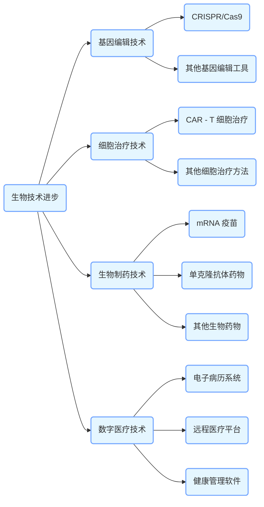

# 生物技术进步带来的医疗健康投资主题

> 关键词：生物技术进步、医疗健康投资、基因编辑、细胞治疗、生物制药、数字医疗、投资趋势

> 摘要：本文聚焦于生物技术进步所带来的医疗健康投资主题。随着生物技术在基因编辑、细胞治疗、生物制药等领域取得重大突破，医疗健康行业迎来了全新的发展机遇，也吸引了大量投资者的关注。文章首先介绍了生物技术进步在医疗健康领域的背景，包括目的和范围、预期读者、文档结构概述以及相关术语。接着阐述了核心概念及其联系，分析了核心算法原理与操作步骤，探讨了数学模型和公式。通过项目实战案例，详细解释了代码实现和分析。还介绍了实际应用场景，推荐了相关的工具和资源。最后总结了未来发展趋势与挑战，解答了常见问题，并提供了扩展阅读和参考资料，旨在为投资者深入了解该投资主题提供全面且专业的指导。

## 1. 背景介绍 
### 1.1 目的和范围
生物技术的快速发展正在深刻改变医疗健康行业的格局。从基础研究到临床应用，生物技术在基因测序、基因编辑、细胞治疗、生物制药等多个领域都取得了显著进展。本文章的目的在于深入探讨生物技术进步为医疗健康投资带来的新机遇和挑战，分析相关投资主题的可行性和潜力。范围涵盖了生物技术在医疗健康领域的主要应用方向，以及与之相关的投资策略、市场趋势和风险评估。

### 1.2 预期读者
本文的预期读者主要包括医疗健康领域的投资者，如风险投资家、私募股权投资者、对冲基金经理等；医疗行业的从业者，如生物科技公司的管理人员、研发人员、医生等；以及对生物技术和医疗健康投资感兴趣的研究人员和学生。通过阅读本文，读者可以了解生物技术进步对医疗健康投资的影响，掌握相关投资主题的核心要点和分析方法。

### 1.3 文档结构概述
本文将按照以下结构进行阐述：首先介绍生物技术进步在医疗健康领域的背景知识，包括相关术语的定义和解释；然后深入探讨核心概念及其联系，分析核心算法原理和操作步骤；接着介绍数学模型和公式，并通过实际案例进行详细说明；之后进行项目实战，展示代码实现和分析；再介绍实际应用场景和相关的工具资源推荐；最后总结未来发展趋势与挑战，解答常见问题，并提供扩展阅读和参考资料。

### 1.4 术语表
#### 1.4.1 核心术语定义
- **生物技术**：利用生物体（包括微生物、动物细胞、植物细胞）或其组成部分（细胞器和酶）来生产有用物质，或为人类提供某种服务的技术。
- **基因编辑**：对生物体基因组特定目标基因进行修饰的一种基因工程技术。
- **细胞治疗**：指将正常或生物工程改造过的人体细胞移植或输入患者体内，新输入的细胞可以替代受损细胞、或者具有更强的免疫杀伤功能，从而达到治疗疾病的目的。
- **生物制药**：利用基因工程、细胞工程、发酵工程等生物技术，从生物体、生物组织、细胞、体液等中制造的一类用于预防、治疗和诊断的制品。
- **数字医疗**：将信息技术应用于医疗健康领域，包括电子病历、远程医疗、健康管理软件等。

#### 1.4.2 相关概念解释
- **精准医疗**：以个体化医疗为基础、随着基因组测序技术快速进步以及生物信息与大数据科学的交叉应用而发展起来的新型医学概念与医疗模式。它强调在临床决策中综合考虑患者的基因信息、环境因素和生活方式等，实现精准的疾病诊断和治疗。
- **再生医学**：是一门研究如何促进机体自我修复与再生，或构建新的组织与器官以恢复、维持或改善损伤组织和器官功能的学科。再生医学涉及干细胞技术、组织工程、基因治疗等多个领域。

#### 1.4.3 缩略词列表
- **CRISPR**：Clustered Regularly Interspaced Short Palindromic Repeats，成簇的规律间隔的短回文重复序列，是一种基因编辑技术。
- **CAR - T**：Chimeric Antigen Receptor T - Cell Immunotherapy，嵌合抗原受体 T 细胞免疫疗法，是一种细胞治疗方法。
- **mRNA**：Messenger Ribonucleic Acid，信使核糖核酸，在生物制药中可用于疫苗和治疗药物的研发。

## 2. 核心概念与联系 

### 核心概念原理
#### 基因编辑技术
基因编辑技术是生物技术领域的一项重大突破，其核心原理是通过特定的核酸酶对生物体基因组中的特定序列进行切割和修饰。以 CRISPR/Cas9 技术为例，CRISPR 是细菌和古细菌在长期演化过程中形成的一种适应性免疫防御机制，用于对抗病毒等外来遗传物质的入侵。Cas9 是一种核酸酶，它可以在向导 RNA（gRNA）的引导下，识别并结合到基因组中的特定 DNA 序列上，然后对该序列进行切割，引发细胞的 DNA 修复机制。通过设计不同的 gRNA，可以实现对不同基因位点的精准编辑。

#### 细胞治疗技术
细胞治疗技术主要基于细胞的生物学特性和功能，通过对细胞进行体外操作和改造，使其具有治疗疾病的能力。以 CAR - T 细胞治疗为例，其原理是从患者体内提取 T 细胞，然后在体外通过基因工程技术将嵌合抗原受体（CAR）基因导入 T 细胞中，使 T 细胞表达 CAR。CAR 可以特异性识别肿瘤细胞表面的抗原，激活 T 细胞的杀伤功能，从而达到治疗肿瘤的目的。

#### 生物制药技术
生物制药技术是利用生物技术生产药物的过程。以 mRNA 疫苗为例，其原理是将编码病原体抗原的 mRNA 导入人体细胞中，人体细胞利用这些 mRNA 合成病原体的抗原蛋白，从而激发机体的免疫反应。与传统疫苗相比，mRNA 疫苗具有研发速度快、生产工艺相对简单等优点。

### 架构的文本示意图
```plaintext
生物技术进步
├── 基因编辑技术
│   ├── CRISPR/Cas9
│   ├── 其他基因编辑工具
├── 细胞治疗技术
│   ├── CAR - T 细胞治疗
│   ├── 其他细胞治疗方法
├── 生物制药技术
│   ├── mRNA 疫苗
│   ├── 单克隆抗体药物
│   ├── 其他生物药物
├── 数字医疗技术
│   ├── 电子病历系统
│   ├── 远程医疗平台
│   ├── 健康管理软件
```

### Mermaid 流程图


这些核心概念之间相互联系、相互促进。基因编辑技术可以为细胞治疗和生物制药提供技术支持，例如通过基因编辑技术可以改造 T 细胞，提高 CAR - T 细胞治疗的效果；也可以用于优化生物药物的生产过程。细胞治疗技术和生物制药技术则是生物技术在医疗健康领域的具体应用，它们的发展离不开基因编辑等基础技术的支持。数字医疗技术可以为基因编辑、细胞治疗和生物制药提供数据支持和信息化管理手段，促进这些技术的临床应用和推广。

## 3. 核心算法原理 & 具体操作步骤 

### 基因编辑中的算法原理及 Python 实现
在基因编辑中，一个重要的问题是如何设计高效、特异的向导 RNA（gRNA）。下面我们以简单的 gRNA 设计算法为例，介绍其原理和 Python 实现。

#### 算法原理
gRNA 设计的核心目标是找到与目标 DNA 序列互补且特异性高的 RNA 序列。基本步骤如下：
1. 确定目标 DNA 序列。
2. 生成与目标 DNA 序列互补的 RNA 序列。
3. 评估生成的 RNA 序列的特异性，避免与非目标 DNA 序列发生结合。

#### Python 源代码实现
```python
# 定义 DNA 到 RNA 的互补碱基映射
base_mapping = {'A': 'U', 'T': 'A', 'C': 'G', 'G': 'C'}

def generate_gRNA(target_dna):
    """
    生成与目标 DNA 序列互补的 gRNA 序列
    :param target_dna: 目标 DNA 序列
    :return: gRNA 序列
    """
    gRNA = ""
    for base in target_dna:
        if base in base_mapping:
            gRNA += base_mapping[base]
        else:
            print(f"无效的碱基: {base}")
            return None
    return gRNA

# 示例目标 DNA 序列
target_dna = "ATCG"
gRNA = generate_gRNA(target_dna)
if gRNA:
    print(f"目标 DNA 序列: {target_dna}")
    print(f"生成的 gRNA 序列: {gRNA}")
```

### 细胞治疗中的数据分析算法及 Python 实现
在细胞治疗中，对细胞的特征和功能进行分析是非常重要的。例如，通过流式细胞术可以获取细胞的多种特征数据，下面我们以简单的细胞聚类分析为例，介绍其原理和 Python 实现。

#### 算法原理
细胞聚类分析的目的是将具有相似特征的细胞分为不同的类别。常用的聚类算法有 K - Means 算法，其基本步骤如下：
1. 随机选择 K 个初始聚类中心。
2. 计算每个细胞到各个聚类中心的距离，将细胞分配到距离最近的聚类中心所在的类别。
3. 更新每个聚类的中心位置，即计算该聚类中所有细胞特征的平均值。
4. 重复步骤 2 和 3，直到聚类中心不再发生变化或达到最大迭代次数。

#### Python 源代码实现
```python
import numpy as np
from sklearn.cluster import KMeans

# 模拟细胞特征数据
cell_features = np.array([[1, 2], [2, 3], [8, 9], [9, 10]])

# 设置聚类的类别数
k = 2

# 创建 K - Means 模型
kmeans = KMeans(n_clusters=k)

# 进行聚类分析
kmeans.fit(cell_features)

# 获取聚类结果
labels = kmeans.labels_

print("细胞特征数据:")
print(cell_features)
print("聚类结果:")
print(labels)
```

## 4. 数学模型和公式 & 详细讲解 & 举例说明 

### 基因编辑中的数学模型
在基因编辑中，评估 gRNA 的特异性是一个关键问题。可以使用热力学模型来计算 gRNA 与目标 DNA 序列以及非目标 DNA 序列的结合自由能 $\Delta G$。结合自由能可以反映 gRNA 与 DNA 序列结合的稳定性，$\Delta G$ 越小，结合越稳定。

#### 自由能计算公式
$$\Delta G = \Delta H - T\Delta S$$
其中，$\Delta H$ 是焓变，反映了分子间相互作用的能量变化；$\Delta S$ 是熵变，反映了分子的无序程度变化；$T$ 是绝对温度。

#### 详细讲解
焓变 $\Delta H$ 和熵变 $\Delta S$ 可以通过实验测量或理论计算得到。在实际应用中，通常使用一些软件工具来计算这些参数。例如，RNAstructure 软件可以根据核酸序列计算其二级结构和自由能。

#### 举例说明
假设我们有一个 gRNA 序列和一个目标 DNA 序列，通过 RNAstructure 软件计算得到它们结合的 $\Delta H = -20$ kcal/mol，$\Delta S = -0.05$ kcal/(mol·K)，在温度 $T = 310$ K（人体体温）下，结合自由能为：
$$\Delta G = -20 - 310\times(-0.05) = -20 + 15.5 = -4.5 \text{ kcal/mol}$$
这表明 gRNA 与目标 DNA 序列的结合是比较稳定的。

### 细胞治疗中的数学模型
在细胞治疗中，评估细胞的增殖和杀伤能力是重要的指标。可以使用细胞动力学模型来描述细胞的生长和死亡过程。

#### 细胞动力学模型
考虑一个简单的细胞增殖模型，假设细胞的增殖速率与细胞数量成正比，细胞的死亡速率也与细胞数量成正比。则细胞数量 $N(t)$ 随时间 $t$ 的变化可以用以下微分方程描述：
$$\frac{dN(t)}{dt} = (\lambda - \mu)N(t)$$
其中，$\lambda$ 是细胞的增殖速率常数，$\mu$ 是细胞的死亡速率常数。

#### 详细讲解
这个微分方程的解为：
$$N(t) = N_0e^{(\lambda - \mu)t}$$
其中，$N_0$ 是初始细胞数量。当 $\lambda > \mu$ 时，细胞数量呈指数增长；当 $\lambda < \mu$ 时，细胞数量呈指数减少；当 $\lambda = \mu$ 时，细胞数量保持不变。

#### 举例说明
假设初始细胞数量 $N_0 = 100$，细胞的增殖速率常数 $\lambda = 0.1$ /天，细胞的死亡速率常数 $\mu = 0.05$ /天。则在 $t = 5$ 天时，细胞数量为：
$$N(5) = 100e^{(0.1 - 0.05)\times5} = 100e^{0.25} \approx 128$$

## 5. 项目实战：代码实际案例和详细解释说明 

### 5.1  开发环境搭建
#### 硬件环境
- 计算机：建议使用配置较高的台式机或笔记本电脑，具备至少 8GB 内存和 256GB 以上的硬盘空间。
- 服务器（可选）：如果需要处理大规模的数据或进行复杂的计算，可以考虑使用服务器。

#### 软件环境
- 操作系统：推荐使用 Windows 10、macOS 或 Linux（如 Ubuntu）。
- Python 环境：安装 Python 3.7 及以上版本，可以使用 Anaconda 来管理 Python 环境。
- 相关库：安装 numpy、pandas、scikit - learn、matplotlib 等常用库，可以使用以下命令进行安装：
```bash
pip install numpy pandas scikit-learn matplotlib
```

### 5.2  源代码详细实现和代码解读
#### 项目背景
假设我们要对一组肿瘤细胞的基因表达数据进行分析，以识别不同的肿瘤亚型。我们将使用 K - Means 聚类算法对基因表达数据进行聚类分析。

#### 源代码实现
```python
import numpy as np
import pandas as pd
from sklearn.cluster import KMeans
import matplotlib.pyplot as plt

# 读取基因表达数据
data = pd.read_csv('gene_expression_data.csv')

# 提取特征数据
X = data.drop('sample_id', axis=1).values

# 设置聚类的类别数
k = 3

# 创建 K - Means 模型
kmeans = KMeans(n_clusters=k)

# 进行聚类分析
kmeans.fit(X)

# 获取聚类结果
labels = kmeans.labels_

# 将聚类结果添加到原始数据中
data['cluster'] = labels

# 可视化聚类结果
plt.scatter(X[:, 0], X[:, 1], c=labels, cmap='viridis')
plt.xlabel('Gene 1 Expression')
plt.ylabel('Gene 2 Expression')
plt.title('K - Means Clustering of Tumor Cells')
plt.show()
```

#### 代码解读
1. **数据读取**：使用 `pandas` 库的 `read_csv` 函数读取基因表达数据文件 `gene_expression_data.csv`。
2. **特征提取**：使用 `drop` 方法删除 `sample_id` 列，然后将剩余的数据转换为 `numpy` 数组。
3. **模型创建**：使用 `sklearn` 库的 `KMeans` 类创建一个 K - Means 模型，设置聚类的类别数为 3。
4. **聚类分析**：使用 `fit` 方法对特征数据进行聚类分析。
5. **结果获取**：使用 `labels_` 属性获取聚类结果。
6. **结果添加**：将聚类结果添加到原始数据的 `cluster` 列中。
7. **可视化**：使用 `matplotlib` 库的 `scatter` 函数绘制散点图，将不同聚类的细胞用不同的颜色表示。

### 5.3  代码解读与分析
#### 聚类结果分析
通过观察散点图，可以直观地看到不同聚类的细胞在基因表达空间中的分布情况。每个聚类代表一种肿瘤亚型，不同聚类之间的细胞在基因表达上存在差异。

#### 聚类效果评估
可以使用一些评估指标来评估聚类效果，例如轮廓系数（Silhouette Coefficient）。轮廓系数的取值范围在 - 1 到 1 之间，值越接近 1 表示聚类效果越好。可以使用 `sklearn` 库的 `silhouette_score` 函数来计算轮廓系数。

```python
from sklearn.metrics import silhouette_score

silhouette_avg = silhouette_score(X, labels)
print(f"轮廓系数: {silhouette_avg}")
```

## 6. 实际应用场景 
### 基因编辑技术的应用场景
#### 疾病治疗
基因编辑技术可以用于治疗一些遗传性疾病，如镰状细胞贫血、地中海贫血等。通过对患者的造血干细胞进行基因编辑，纠正致病基因突变，然后将编辑后的干细胞回输到患者体内，有望实现疾病的根治。

#### 农业育种
基因编辑技术可以用于改良农作物的性状，如提高作物的产量、品质和抗逆性。例如，通过编辑水稻的基因，可以使其具有更强的抗病虫害能力。

### 细胞治疗技术的应用场景
#### 肿瘤治疗
CAR - T 细胞治疗在血液系统肿瘤的治疗中取得了显著的疗效，如急性淋巴细胞白血病、非霍奇金淋巴瘤等。通过改造患者自身的 T 细胞，使其能够特异性识别和杀伤肿瘤细胞。

#### 自身免疫性疾病治疗
细胞治疗技术也可以用于治疗自身免疫性疾病，如类风湿性关节炎、多发性硬化症等。通过调节免疫系统的功能，减轻自身免疫反应对机体的损伤。

### 生物制药技术的应用场景
#### 疫苗研发
mRNA 疫苗在新冠疫情的防控中发挥了重要作用。与传统疫苗相比，mRNA 疫苗具有研发速度快、生产工艺相对简单等优点，可以快速应对突发传染病的挑战。

#### 抗体药物研发
单克隆抗体药物在肿瘤、自身免疫性疾病等领域的治疗中具有重要的应用价值。通过筛选和制备针对特定靶点的单克隆抗体，可以实现精准治疗。

### 数字医疗技术的应用场景
#### 远程医疗
远程医疗可以实现患者与医生之间的远程沟通和诊断，提高医疗资源的利用效率。例如，通过远程医疗平台，医生可以为偏远地区的患者进行会诊和治疗指导。

#### 健康管理
健康管理软件可以帮助用户记录和管理自己的健康信息，如运动、饮食、睡眠等。通过对健康数据的分析，为用户提供个性化的健康建议和干预措施。

## 7. 工具和资源推荐
### 7.1 学习资源推荐
#### 7.1.1 书籍推荐
- 《生物技术概论》：全面介绍了生物技术的基本概念、原理和应用，适合初学者阅读。
- 《基因编辑：从基础研究到临床应用》：深入探讨了基因编辑技术的原理、发展和应用前景，对于想深入了解基因编辑技术的读者有很大的帮助。
- 《细胞治疗学》：系统介绍了细胞治疗的理论、技术和临床应用，是细胞治疗领域的经典著作。

#### 7.1.2 在线课程
- Coursera 上的“生物技术基础”课程：由知名高校的教授授课，内容涵盖了生物技术的各个方面。
- edX 上的“基因编辑技术”课程：详细介绍了基因编辑技术的原理和应用，提供了丰富的案例和实践项目。
- 中国大学 MOOC 上的“生物制药技术”课程：结合国内的生物制药产业发展，介绍了生物制药的研发、生产和质量控制等方面的知识。

#### 7.1.3 技术博客和网站
- BioTechniques：提供生物技术领域的最新研究进展、技术方法和实验技巧等内容。
- Nature Biotechnology：发表生物技术领域的高水平研究论文和综述，是了解生物技术前沿动态的重要渠道。
- 丁香园：国内知名的医疗健康领域的网站，提供医学资讯、学术交流和专业培训等服务。

### 7.2 开发工具框架推荐
#### 7.2.1 IDE和编辑器
- PyCharm：一款专业的 Python 集成开发环境，提供代码编辑、调试、版本控制等功能，适合 Python 开发者使用。
- Jupyter Notebook：一个基于网页的交互式计算环境，可以方便地进行代码编写、数据可视化和文档撰写，广泛应用于数据分析和机器学习领域。
- Visual Studio Code：一款轻量级的代码编辑器，支持多种编程语言和插件扩展，具有丰富的功能和良好的用户体验。

#### 7.2.2 调试和性能分析工具
- PDB：Python 自带的调试工具，可以帮助开发者定位和解决代码中的问题。
- cProfile：Python 的性能分析工具，可以分析代码的运行时间和函数调用情况，帮助开发者优化代码性能。
- TensorBoard：用于可视化深度学习模型的训练过程和性能指标，方便开发者进行模型调优。

#### 7.2.3 相关框架和库
- NumPy：Python 的数值计算库，提供了高效的数组操作和数学函数，是数据分析和机器学习的基础库。
- Pandas：用于数据处理和分析的库，提供了灵活的数据结构和数据操作方法，方便进行数据清洗、转换和分析。
- Scikit - learn：一个简单易用的机器学习库，提供了丰富的机器学习算法和工具，如分类、回归、聚类等。

### 7.3 相关论文著作推荐
#### 7.3.1 经典论文
- "A programmable dual - RNA - guided DNA endonuclease in adaptive bacterial immunity"：介绍了 CRISPR/Cas9 基因编辑技术的原理和应用，是基因编辑领域的经典论文。
- "Chimeric antigen receptor T cells for sustained remissions in leukemia"：报道了 CAR - T 细胞治疗在白血病治疗中的显著疗效，开创了细胞治疗的新纪元。
- "Messenger RNA vaccines — a new era in vaccinology"：综述了 mRNA 疫苗的发展历程、原理和应用前景，为 mRNA 疫苗的研发和应用提供了重要的理论支持。

#### 7.3.2 最新研究成果
可以通过学术数据库如 PubMed、Web of Science 等搜索生物技术和医疗健康领域的最新研究成果。例如，关注基因编辑技术在不同疾病治疗中的应用进展、细胞治疗技术的新突破以及生物制药技术的创新成果等。

#### 7.3.3 应用案例分析
- 《医疗健康领域的生物技术创新案例集》：收集了国内外生物技术在医疗健康领域的应用案例，通过对这些案例的分析，可以了解生物技术在实际应用中的优势和挑战。
- 各大生物科技公司的年报和研究报告：如诺华、吉利德科学等公司的年报和研究报告，包含了公司在生物技术研发和医疗健康投资方面的最新进展和战略规划。

## 8. 总结：未来发展趋势与挑战
### 未来发展趋势
#### 技术融合
生物技术将与信息技术、材料科学等其他领域的技术进行深度融合。例如，生物技术与人工智能的结合可以实现对生物数据的高效分析和挖掘，加速药物研发和疾病诊断的进程；生物技术与材料科学的结合可以开发出新型的生物材料，用于组织工程和再生医学。

#### 个性化医疗
随着基因编辑、细胞治疗等技术的不断发展，个性化医疗将成为未来医疗健康的发展方向。通过对患者的基因信息、生物标志物等进行分析，为患者提供个性化的诊断和治疗方案，提高治疗效果和患者的生活质量。

#### 全球合作
生物技术的研发和应用需要大量的资金、人力和技术资源，因此全球合作将成为必然趋势。各国的科研机构、企业和政府将加强合作，共同攻克生物技术领域的难题，推动医疗健康事业的发展。

### 挑战
#### 伦理道德问题
基因编辑、细胞治疗等生物技术涉及到人类的生殖、遗传等敏感领域，可能会引发一系列的伦理道德问题。例如，基因编辑技术用于人类生殖可能会导致基因歧视、“设计婴儿”等问题，需要建立相应的伦理道德准则和监管机制。

#### 安全性和有效性问题
生物技术的安全性和有效性是其应用的关键。基因编辑技术可能会导致脱靶效应，对非目标基因造成损伤；细胞治疗技术可能会引发免疫反应等不良反应。因此，需要加强对生物技术的安全性和有效性评估，确保其在临床应用中的安全性和可靠性。

#### 市场竞争和知识产权问题
随着生物技术的快速发展，市场竞争日益激烈。生物科技公司需要不断创新，提高自身的核心竞争力。同时，知识产权保护也是一个重要的问题，需要加强对生物技术相关专利的保护，鼓励创新和研发。

## 9. 附录：常见问题与解答
### 基因编辑技术是否会对人类产生不可逆的影响？
基因编辑技术如果应用不当，可能会对人类产生不可逆的影响。例如，基因编辑技术用于人类生殖可能会改变人类的基因库，影响后代的遗传特征。因此，在进行基因编辑研究和应用时，需要严格遵守伦理道德准则和监管要求，确保其安全性和可控性。

### 细胞治疗技术的成本是否过高？
目前，细胞治疗技术的成本相对较高。这主要是由于细胞治疗技术的研发、生产和质量控制等环节需要大量的资金和技术投入。随着技术的不断进步和规模效应的显现，细胞治疗技术的成本有望逐渐降低。同时，政府和医保部门也可以通过制定相关政策，降低患者的治疗负担。

### 生物制药技术与传统制药技术相比有哪些优势？
生物制药技术与传统制药技术相比，具有以下优势：
- 特异性高：生物制药可以针对特定的靶点进行设计和研发，提高药物的疗效和安全性。
- 研发速度快：生物技术的发展使得药物研发的周期缩短，能够更快地满足临床需求。
- 生产工艺灵活：生物制药可以利用生物技术生产各种类型的药物，如蛋白质药物、核酸药物等，生产工艺相对灵活。

### 数字医疗技术是否会取代医生的作用？
数字医疗技术不会取代医生的作用。数字医疗技术可以为医生提供更多的辅助诊断和治疗工具，提高医疗效率和质量。但医生的临床经验、判断力和人文关怀是数字医疗技术无法替代的。数字医疗技术与医生的专业知识和技能相结合，将为患者提供更好的医疗服务。

## 10. 扩展阅读 & 参考资料
### 扩展阅读
- 《未来医疗：从大数据到精准医疗》：探讨了信息技术在医疗健康领域的应用和发展趋势，以及如何实现从大数据到精准医疗的转变。
- 《生命的未来：生物技术革命将如何改变世界》：介绍了生物技术的发展历程和未来前景，以及生物技术对人类社会、经济和环境的影响。

### 参考资料
- Alberts B, Johnson A, Lewis J, et al. Molecular Biology of the Cell. Garland Science; 2014.
- Lander ES. Initial sequencing and analysis of the human genome. Nature. 2001;409(6822):860 - 921.
- Zhang F. The new frontier of genome engineering with CRISPR - Cas9. RNA Biology. 2013;10(5):818 - 823.

作者：AI天才研究院/AI Genius Institute & 禅与计算机程序设计艺术 /Zen And The Art of Computer Programming