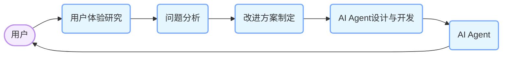

# 用户体验研究：提升AI Agent的易用性

> 关键词：用户体验研究、AI Agent、易用性、人机交互、用户需求

> 摘要：本文聚焦于用户体验研究在提升AI Agent易用性方面的重要作用。通过对相关核心概念的阐述、算法原理的分析、数学模型的讲解以及实际项目案例的展示，深入探讨了如何通过用户体验研究来优化AI Agent的设计与开发，以提高其易用性。同时，介绍了AI Agent在不同场景下的应用，推荐了相关的学习资源、开发工具和论文著作。最后，对AI Agent易用性的未来发展趋势与挑战进行了总结，并提供了常见问题的解答和扩展阅读参考资料。

## 1. 背景介绍 
### 1.1 目的和范围
随着人工智能技术的飞速发展，AI Agent在各个领域得到了广泛的应用。然而，其易用性问题成为了制约其进一步普及和推广的重要因素。本研究的目的在于通过深入的用户体验研究，找出影响AI Agent易用性的关键因素，并提出相应的改进措施，以提升AI Agent在实际应用中的用户满意度和使用效率。研究范围涵盖了AI Agent的各个方面，包括交互界面设计、功能实现、响应速度等。

### 1.2 预期读者
本文预期读者主要包括从事人工智能研究与开发的专业人员，如程序员、软件架构师等；对AI Agent应用感兴趣的企业管理人员和产品经理；以及希望了解用户体验研究和AI Agent易用性相关知识的学生和爱好者。

### 1.3 文档结构概述
本文首先介绍了用户体验研究和AI Agent易用性的相关背景知识，包括目的、预期读者和文档结构。接着阐述了核心概念与联系，通过文本示意图和Mermaid流程图展示了相关原理和架构。然后详细讲解了核心算法原理和具体操作步骤，并结合Python源代码进行说明。随后介绍了数学模型和公式，并举例说明其应用。在项目实战部分，通过实际案例展示了如何进行开发环境搭建、源代码实现和代码解读。之后介绍了AI Agent的实际应用场景，推荐了相关的工具和资源。最后对未来发展趋势与挑战进行了总结，提供了常见问题解答和扩展阅读参考资料。

### 1.4 术语表
#### 1.4.1 核心术语定义
- **用户体验研究**：是指通过各种方法和技术，了解用户在使用产品或服务过程中的感受、需求和行为，以便对产品或服务进行优化和改进的研究活动。
- **AI Agent**：是指能够在一定环境中自主地感知、决策和行动的人工智能实体，它可以模拟人类的智能行为，完成各种任务。
- **易用性**：是指产品或服务在使用过程中，用户能够轻松、高效地完成任务，并且获得良好的使用体验的特性。

#### 1.4.2 相关概念解释
- **人机交互**：是指人与计算机之间进行信息交流和互动的过程，它是AI Agent易用性的重要体现。
- **用户需求**：是指用户在使用产品或服务时所期望实现的目标和功能，了解用户需求是提升AI Agent易用性的关键。

#### 1.4.3 缩略词列表
- **AI**：Artificial Intelligence，人工智能
- **UI**：User Interface，用户界面
- **UX**：User Experience，用户体验

## 2. 核心概念与联系 

### 核心概念原理
用户体验研究的核心原理是以人为本，通过深入了解用户的需求、期望和行为，来设计和优化产品或服务。对于AI Agent来说，提升易用性的关键在于使其能够更好地理解用户的意图，提供准确、高效的响应，并与用户进行自然、流畅的交互。

在用户体验研究中，通常会采用多种方法，如用户调研、可用性测试、用户反馈收集等，来获取用户的信息和意见。通过对这些数据的分析和整理，可以发现AI Agent在易用性方面存在的问题，并提出相应的改进方案。

### 架构的文本示意图
以下是一个简单的用户体验研究提升AI Agent易用性的架构示意图：

用户 -> 用户体验研究（用户调研、可用性测试、用户反馈收集） -> 问题分析 -> 改进方案制定 -> AI Agent设计与开发 -> AI Agent -> 用户

### Mermaid流程图


这个流程图展示了用户体验研究提升AI Agent易用性的循环过程。首先从用户出发，进行用户体验研究，获取用户的信息和意见。然后对这些信息进行分析，找出存在的问题。接着根据问题制定改进方案，并将其应用到AI Agent的设计与开发中。最后，改进后的AI Agent再反馈给用户，形成一个闭环。

## 3. 核心算法原理 & 具体操作步骤 

### 核心算法原理
在提升AI Agent易用性的过程中，涉及到多个核心算法，如自然语言处理算法、机器学习算法等。这里以自然语言处理中的意图识别算法为例进行说明。

意图识别算法的主要目的是将用户输入的自然语言文本转化为计算机能够理解的意图表示。常见的意图识别算法包括基于规则的方法、基于机器学习的方法和基于深度学习的方法。

基于规则的方法是通过预先定义一系列的规则来判断用户的意图。例如，如果用户输入的文本中包含“查询天气”，则可以判断用户的意图是查询天气。这种方法的优点是简单易懂，适用于规则明确的场景；缺点是灵活性较差，难以处理复杂的自然语言表达。

基于机器学习的方法是通过训练模型来学习用户意图和文本之间的映射关系。常见的机器学习算法包括朴素贝叶斯、支持向量机等。这种方法的优点是可以处理复杂的自然语言表达，具有较好的灵活性；缺点是需要大量的训练数据，并且模型的训练和调优过程较为复杂。

基于深度学习的方法是通过深度神经网络来学习用户意图和文本之间的复杂映射关系。常见的深度学习模型包括卷积神经网络（CNN）、循环神经网络（RNN）及其变体（如LSTM、GRU）等。这种方法的优点是可以自动学习文本的特征，具有较高的准确率和泛化能力；缺点是模型的训练时间较长，需要大量的计算资源。

### 具体操作步骤

#### 数据准备
首先需要收集和整理用于训练模型的数据集。数据集应包含用户的自然语言文本和对应的意图标签。例如，对于天气查询场景，数据集可以包含以下样本：

| 文本 | 意图标签 |
| ---- | ---- |
| 今天北京的天气怎么样 | 查询天气 |
| 明天上海会下雨吗 | 查询天气 |
| 我想知道广州后天的气温 | 查询天气 |

#### 数据预处理
对收集到的数据集进行预处理，包括文本清洗、分词、去除停用词等操作。例如，使用Python的`jieba`库进行中文分词：

```python
import jieba

text = "今天北京的天气怎么样"
words = jieba.lcut(text)
print(words)
```

#### 特征提取
将预处理后的文本转化为计算机能够处理的特征向量。常见的特征提取方法包括词袋模型、TF-IDF等。以下是使用`sklearn`库实现TF-IDF特征提取的示例代码：

```python
from sklearn.feature_extraction.text import TfidfVectorizer

corpus = [
    "今天北京的天气怎么样",
    "明天上海会下雨吗",
    "我想知道广州后天的气温"
]

vectorizer = TfidfVectorizer()
X = vectorizer.fit_transform(corpus)
print(X.toarray())
```

#### 模型训练
选择合适的意图识别算法，并使用预处理和特征提取后的数据进行模型训练。以下是使用朴素贝叶斯算法进行模型训练的示例代码：

```python
from sklearn.naive_bayes import MultinomialNB
from sklearn.feature_extraction.text import TfidfVectorizer
from sklearn.model_selection import train_test_split

# 假设已经有了文本数据和对应的意图标签
corpus = [
    "今天北京的天气怎么样",
    "明天上海会下雨吗",
    "我想知道广州后天的气温"
]
labels = ["查询天气", "查询天气", "查询天气"]

# 特征提取
vectorizer = TfidfVectorizer()
X = vectorizer.fit_transform(corpus)

# 划分训练集和测试集
X_train, X_test, y_train, y_test = train_test_split(X, labels, test_size=0.2, random_state=42)

# 模型训练
clf = MultinomialNB()
clf.fit(X_train, y_train)

# 模型评估
accuracy = clf.score(X_test, y_test)
print(f"模型准确率: {accuracy}")
```

#### 模型部署
将训练好的模型部署到AI Agent中，使其能够实时对用户输入的文本进行意图识别。在实际应用中，可以使用Flask等框架搭建一个Web服务，接收用户的请求并返回意图识别结果。以下是一个简单的Flask应用示例：

```python
from flask import Flask, request, jsonify
from sklearn.feature_extraction.text import TfidfVectorizer
from sklearn.naive_bayes import MultinomialNB

app = Flask(__name__)

# 假设已经有了训练好的模型和特征提取器
corpus = [
    "今天北京的天气怎么样",
    "明天上海会下雨吗",
    "我想知道广州后天的气温"
]
labels = ["查询天气", "查询天气", "查询天气"]

vectorizer = TfidfVectorizer()
X = vectorizer.fit_transform(corpus)

clf = MultinomialNB()
clf.fit(X, labels)

@app.route('/predict', methods=['POST'])
def predict():
    data = request.get_json()
    text = data['text']
    X_new = vectorizer.transform([text])
    prediction = clf.predict(X_new)
    return jsonify({'intent': prediction[0]})

if __name__ == '__main__':
    app.run(debug=True)
```

## 4. 数学模型和公式 & 详细讲解 & 举例说明 

### 朴素贝叶斯算法的数学模型和公式
朴素贝叶斯算法是一种基于贝叶斯定理和特征条件独立假设的分类算法。其核心思想是通过计算每个类别的后验概率，选择后验概率最大的类别作为预测结果。

#### 贝叶斯定理
贝叶斯定理是概率论中的一个重要定理，它描述了在已知某些条件下，某个事件发生的概率。其数学公式为：

$$P(Y|X) = \frac{P(X|Y)P(Y)}{P(X)}$$

其中，$P(Y|X)$ 表示在给定特征 $X$ 的条件下，类别 $Y$ 发生的后验概率；$P(X|Y)$ 表示在类别 $Y$ 发生的条件下，特征 $X$ 出现的条件概率；$P(Y)$ 表示类别 $Y$ 发生的先验概率；$P(X)$ 表示特征 $X$ 出现的概率。

#### 朴素贝叶斯算法的假设
朴素贝叶斯算法假设特征之间是条件独立的，即：

$$P(X|Y) = \prod_{i=1}^{n}P(x_i|Y)$$

其中，$X = (x_1, x_2, \cdots, x_n)$ 表示特征向量，$x_i$ 表示第 $i$ 个特征。

#### 朴素贝叶斯算法的分类规则
根据贝叶斯定理和特征条件独立假设，朴素贝叶斯算法的分类规则为：

$$\hat{Y} = \arg\max_{Y} P(Y|X) = \arg\max_{Y} \frac{P(X|Y)P(Y)}{P(X)} = \arg\max_{Y} P(X|Y)P(Y)$$

其中，$\hat{Y}$ 表示预测的类别。

### 详细讲解
在意图识别任务中，我们可以将用户输入的文本看作特征 $X$，将意图标签看作类别 $Y$。通过训练数据计算每个意图标签的先验概率 $P(Y)$ 和每个特征在每个意图标签下的条件概率 $P(x_i|Y)$，然后根据上述分类规则进行意图预测。

### 举例说明
假设我们有以下训练数据：

| 文本 | 意图标签 |
| ---- | ---- |
| 今天北京的天气怎么样 | 查询天气 |
| 明天上海会下雨吗 | 查询天气 |
| 我想吃披萨 | 订餐 |

我们可以计算每个意图标签的先验概率：

$P(查询天气) = \frac{2}{3}$

$P(订餐) = \frac{1}{3}$

然后计算每个特征在每个意图标签下的条件概率。例如，对于特征“天气”，在“查询天气”意图标签下的条件概率为：

$P(天气|查询天气) = \frac{2}{2} = 1$

在“订餐”意图标签下的条件概率为：

$P(天气|订餐) = \frac{0}{1} = 0$

假设用户输入的文本为“今天深圳的天气如何”，我们可以计算该文本在每个意图标签下的后验概率：

$P(查询天气|今天深圳的天气如何) \propto P(今天|查询天气)P(深圳|查询天气)P(天气|查询天气)P(如何|查询天气)P(查询天气)$

$P(订餐|今天深圳的天气如何) \propto P(今天|订餐)P(深圳|订餐)P(天气|订餐)P(如何|订餐)P(订餐)$

由于 $P(天气|订餐) = 0$，所以 $P(订餐|今天深圳的天气如何) = 0$。而 $P(查询天气|今天深圳的天气如何) > 0$，因此预测该文本的意图为“查询天气”。

## 5. 项目实战：代码实际案例和详细解释说明 

### 5.1  开发环境搭建
#### 安装Python
首先需要安装Python环境，建议使用Python 3.7及以上版本。可以从Python官方网站（https://www.python.org/downloads/）下载并安装。

#### 安装必要的库
在项目中，我们需要使用一些Python库，如`jieba`、`sklearn`、`Flask`等。可以使用`pip`命令进行安装：

```bash
pip install jieba sklearn flask
```

### 5.2  源代码详细实现和代码解读
以下是一个完整的AI Agent意图识别项目的源代码：

```python
import jieba
from sklearn.feature_extraction.text import TfidfVectorizer
from sklearn.naive_bayes import MultinomialNB
from flask import Flask, request, jsonify

# 数据准备
corpus = [
    "今天北京的天气怎么样",
    "明天上海会下雨吗",
    "我想知道广州后天的气温",
    "我想吃披萨",
    "帮我订一份汉堡"
]
labels = ["查询天气", "查询天气", "查询天气", "订餐", "订餐"]

# 数据预处理
def preprocess(text):
    words = jieba.lcut(text)
    return " ".join(words)

corpus_preprocessed = [preprocess(text) for text in corpus]

# 特征提取
vectorizer = TfidfVectorizer()
X = vectorizer.fit_transform(corpus_preprocessed)

# 模型训练
clf = MultinomialNB()
clf.fit(X, labels)

# Flask应用
app = Flask(__name__)

@app.route('/predict', methods=['POST'])
def predict():
    data = request.get_json()
    text = data['text']
    text_preprocessed = preprocess(text)
    X_new = vectorizer.transform([text_preprocessed])
    prediction = clf.predict(X_new)
    return jsonify({'intent': prediction[0]})

if __name__ == '__main__':
    app.run(debug=True)
```

#### 代码解读
1. **数据准备**：定义了一个包含用户文本和对应意图标签的数据集。
2. **数据预处理**：使用`jieba`库对文本进行分词，并将分词结果用空格连接成字符串。
3. **特征提取**：使用`TfidfVectorizer`将预处理后的文本转化为TF-IDF特征向量。
4. **模型训练**：使用`MultinomialNB`训练一个朴素贝叶斯分类器。
5. **Flask应用**：使用Flask框架搭建一个Web服务，接收用户的请求并返回意图识别结果。

### 5.3  代码解读与分析
#### 优点
- **简单易懂**：使用朴素贝叶斯算法和常见的机器学习库，代码结构清晰，易于理解和实现。
- **可扩展性**：可以通过增加训练数据和改进特征提取方法来提高模型的准确率和泛化能力。
- **灵活性**：可以根据不同的应用场景，调整模型的参数和算法。

#### 缺点
- **数据依赖性**：模型的性能高度依赖于训练数据的质量和数量。
- **特征局限性**：TF-IDF特征提取方法不能很好地捕捉文本的语义信息。
- **算法局限性**：朴素贝叶斯算法的假设（特征条件独立）在实际应用中可能不成立。

## 6. 实际应用场景 
### 智能客服
在智能客服场景中，AI Agent可以通过意图识别技术理解用户的问题，并提供相应的解决方案。例如，当用户咨询产品的价格、功能、使用方法等问题时，AI Agent可以快速准确地给出回答，提高客户服务的效率和质量。

### 语音助手
语音助手如小爱同学、Siri等，也是AI Agent的典型应用。用户可以通过语音指令与语音助手进行交互，完成查询信息、设置提醒、控制设备等任务。语音助手需要具备良好的易用性，能够准确理解用户的语音指令，并以自然流畅的方式进行回应。

### 智能教育
在智能教育领域，AI Agent可以作为学习伙伴，为学生提供个性化的学习支持。例如，根据学生的学习进度和能力，为其推荐合适的学习资源和练习题；当学生遇到问题时，能够及时给予解答和指导。

### 智能家居控制
AI Agent可以与智能家居设备集成，实现对家居设备的智能控制。用户可以通过语音或手机应用向AI Agent发送指令，如打开灯光、调节温度、播放音乐等。易用性对于智能家居控制尤为重要，因为用户希望能够轻松、便捷地控制家居设备。

## 7. 工具和资源推荐
### 7.1 学习资源推荐
#### 7.1.1 书籍推荐
- 《Python机器学习实战》：本书通过大量的实例，介绍了Python在机器学习领域的应用，包括数据预处理、特征提取、模型训练和评估等内容。
- 《自然语言处理入门》：全面介绍了自然语言处理的基本概念、算法和技术，适合初学者学习。
- 《用户体验要素》：深入探讨了用户体验设计的原则和方法，对于提升AI Agent的易用性具有重要的指导意义。

#### 7.1.2 在线课程
- Coursera上的“机器学习”课程：由斯坦福大学教授Andrew Ng主讲，是机器学习领域的经典课程，涵盖了机器学习的基本概念、算法和应用。
- edX上的“自然语言处理”课程：介绍了自然语言处理的前沿技术和应用，包括词法分析、句法分析、语义理解等内容。
- Udemy上的“用户体验设计基础”课程：讲解了用户体验设计的基本流程和方法，通过实际案例进行演示。

#### 7.1.3 技术博客和网站
- Medium：是一个知名的技术博客平台，上面有很多关于人工智能、用户体验等领域的优质文章。
- 知乎：是一个知识分享社区，有很多专业人士在上面分享关于AI Agent、用户体验研究等方面的经验和见解。
- 开源中国：提供了丰富的开源项目和技术文章，对于学习和实践AI Agent开发很有帮助。

### 7.2 开发工具框架推荐
#### 7.2.1 IDE和编辑器
- PyCharm：是一款专门为Python开发设计的集成开发环境，具有代码编辑、调试、版本控制等功能，适合开发AI Agent项目。
- Visual Studio Code：是一款轻量级的代码编辑器，支持多种编程语言和插件扩展，可用于快速开发和调试AI Agent代码。

#### 7.2.2 调试和性能分析工具
- PDB：是Python自带的调试工具，可以帮助开发者定位和解决代码中的问题。
- cProfile：是Python的性能分析工具，可以分析代码的运行时间和内存使用情况，帮助开发者优化代码性能。

#### 7.2.3 相关框架和库
- TensorFlow：是一个开源的机器学习框架，提供了丰富的工具和算法，可用于开发各种AI Agent模型。
- PyTorch：是另一个流行的深度学习框架，具有简洁易用的API和高效的计算性能，适合进行自然语言处理任务。
- NLTK：是Python的自然语言处理工具包，提供了丰富的语料库和工具，可用于文本预处理、特征提取等任务。

### 7.3 相关论文著作推荐
#### 7.3.1 经典论文
- 《A Mathematical Theory of Communication》：香农的这篇论文奠定了信息论的基础，对于理解自然语言处理中的信息表示和传输具有重要意义。
- 《Gradient-Based Learning Applied to Document Recognition》：介绍了卷积神经网络在图像识别领域的应用，其思想也可应用于自然语言处理中的文本分类任务。

#### 7.3.2 最新研究成果
- 《Attention Is All You Need》：提出了Transformer模型，是自然语言处理领域的重要突破，为AI Agent的意图识别和语言生成提供了新的思路。
- 《BERT: Pre-training of Deep Bidirectional Transformers for Language Understanding》：介绍了BERT模型，在自然语言处理的多个任务中取得了优异的成绩。

#### 7.3.3 应用案例分析
- 《Applying User Experience Design in AI Agent Development: A Case Study》：通过实际案例分析，介绍了如何将用户体验设计方法应用于AI Agent的开发过程中，以提升其易用性。
- 《Enhancing the Usability of AI Chatbots through User-Centered Design》：研究了如何通过以用户为中心的设计方法来提高AI聊天机器人的易用性。

## 8. 总结：未来发展趋势与挑战
### 未来发展趋势
- **更加智能化**：AI Agent将具备更强的智能水平，能够更好地理解用户的意图和情感，提供更加个性化、智能化的服务。
- **多模态交互**：除了文本和语音交互，AI Agent将支持更多的交互方式，如图像、手势等，实现更加自然、便捷的人机交互。
- **跨领域融合**：AI Agent将与更多的领域进行融合，如医疗、金融、交通等，为不同领域的用户提供更加专业、高效的服务。

### 挑战
- **数据隐私和安全**：随着AI Agent的广泛应用，用户数据的隐私和安全问题将变得更加突出。如何保护用户的数据不被泄露和滥用，是一个亟待解决的问题。
- **伦理和法律问题**：AI Agent的决策和行为可能会对人类产生影响，因此需要建立相应的伦理和法律规范，确保其合法、合规、合理地运行。
- **用户信任问题**：由于AI Agent的决策过程往往是黑盒的，用户可能对其决策结果缺乏信任。如何提高用户对AI Agent的信任度，是提升其易用性的重要挑战。

## 9. 附录：常见问题与解答
### 问题1：如何选择合适的意图识别算法？
答：选择合适的意图识别算法需要考虑多个因素，如数据量、数据复杂度、算法的性能和可解释性等。如果数据量较小且规则明确，可以选择基于规则的方法；如果数据量较大且需要处理复杂的自然语言表达，可以选择基于机器学习或深度学习的方法。

### 问题2：如何提高AI Agent的易用性？
答：提高AI Agent的易用性可以从多个方面入手，如优化交互界面设计、提高响应速度、提供准确的结果、增加反馈机制等。同时，通过用户体验研究，了解用户的需求和意见，不断对AI Agent进行改进和优化。

### 问题3：如何处理AI Agent的错误识别问题？
答：可以通过以下方法处理AI Agent的错误识别问题：增加训练数据，提高模型的准确率；使用集成学习方法，结合多个模型的结果进行决策；引入人工干预机制，当AI Agent无法准确识别时，将问题转交给人工处理。

## 10. 扩展阅读 & 参考资料
### 扩展阅读
- 《人工智能：现代方法》：全面介绍了人工智能的基本概念、算法和应用，是人工智能领域的经典教材。
- 《设计心理学》：探讨了人类的认知和行为特点，对于理解用户需求和设计易用的产品具有重要的启示作用。

### 参考资料
- [Python官方文档](https://docs.python.org/3/)
- [Scikit-learn官方文档](https://scikit-learn.org/stable/)
- [TensorFlow官方文档](https://www.tensorflow.org/api_docs)
- [PyTorch官方文档](https://pytorch.org/docs/stable/index.html)

作者：AI天才研究院/AI Genius Institute & 禅与计算机程序设计艺术 /Zen And The Art of Computer Programming