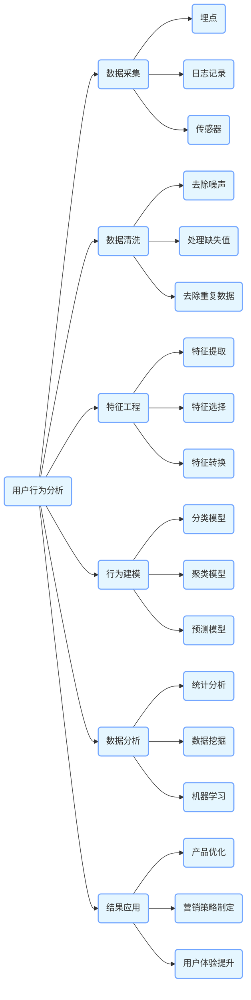

# 用户行为分析

> 关键词：用户行为分析、数据采集、行为建模、数据分析、应用场景

> 摘要：本文围绕用户行为分析展开深入探讨。首先介绍了用户行为分析的背景，包括目的、预期读者、文档结构和相关术语。接着阐述了核心概念与联系，通过示意图和流程图展示其原理架构。详细讲解了核心算法原理和具体操作步骤，并给出Python源代码示例。对数学模型和公式进行了深入分析和举例说明。通过项目实战，展示了代码的实际案例和详细解释。探讨了用户行为分析在不同领域的实际应用场景，推荐了学习资源、开发工具框架和相关论文著作。最后总结了未来发展趋势与挑战，提供了常见问题解答和扩展阅读参考资料，旨在为读者全面呈现用户行为分析的理论与实践知识。

## 1. 背景介绍 
### 1.1 目的和范围
用户行为分析的主要目的是深入了解用户在与产品、服务或系统交互过程中的行为模式、偏好和需求。通过对用户行为数据的收集、整理、分析和解读，企业和组织可以优化产品设计、提升用户体验、制定精准的营销策略、提高运营效率等。

本文章的范围涵盖了用户行为分析的各个方面，包括核心概念、算法原理、数学模型、实际应用案例等。我们将从理论层面深入探讨用户行为分析的基本原理和方法，同时通过实际的项目案例展示如何在实际开发中应用这些理论知识。

### 1.2 预期读者
本文预期读者包括从事互联网产品开发、运营、市场营销的专业人士，以及对数据分析、人工智能等领域感兴趣的学生和研究人员。对于想要了解用户行为分析技术的初学者，本文将提供系统的知识体系和详细的操作指南；对于有一定经验的专业人士，本文将分享一些前沿的技术和实际应用案例，为他们的工作提供参考和启发。

### 1.3 文档结构概述
本文将按照以下结构进行组织：
- 核心概念与联系：介绍用户行为分析的基本概念、原理和架构，通过文本示意图和Mermaid流程图进行直观展示。
- 核心算法原理 & 具体操作步骤：详细讲解用户行为分析中常用的算法原理，并给出Python源代码示例。
- 数学模型和公式 & 详细讲解 & 举例说明：介绍用户行为分析中涉及的数学模型和公式，并通过具体例子进行详细解释。
- 项目实战：代码实际案例和详细解释说明：通过一个实际的项目案例，展示如何使用Python进行用户行为分析，包括开发环境搭建、源代码实现和代码解读。
- 实际应用场景：探讨用户行为分析在不同领域的实际应用场景，如电商、社交、金融等。
- 工具和资源推荐：推荐一些学习用户行为分析的资源，包括书籍、在线课程、技术博客和网站，以及开发工具框架和相关论文著作。
- 总结：未来发展趋势与挑战：总结用户行为分析的发展趋势和面临的挑战。
- 附录：常见问题与解答：提供一些常见问题的解答，帮助读者更好地理解和应用用户行为分析技术。
- 扩展阅读 & 参考资料：提供一些扩展阅读的资料和参考书目，方便读者深入学习。

### 1.4 术语表
#### 1.4.1 核心术语定义
- **用户行为**：指用户在与产品、服务或系统交互过程中所采取的各种操作和行动，如点击、浏览、购买、分享等。
- **用户行为数据**：记录用户行为的各种数据，包括时间、地点、操作类型、操作内容等。
- **用户行为分析**：对用户行为数据进行收集、整理、分析和解读，以了解用户行为模式、偏好和需求的过程。
- **行为建模**：通过对用户行为数据的分析，建立用户行为模型，以预测用户未来的行为和需求。
- **数据分析**：对用户行为数据进行统计、挖掘和分析，以发现数据中的规律和价值。

#### 1.4.2 相关概念解释
- **数据采集**：指收集用户行为数据的过程，可以通过埋点、日志记录、传感器等方式实现。
- **数据清洗**：对采集到的原始数据进行预处理，去除噪声、缺失值和重复数据，以提高数据质量。
- **特征工程**：从原始数据中提取有用的特征，以便于后续的分析和建模。
- **模型评估**：对建立的用户行为模型进行评估，以衡量模型的准确性和有效性。

#### 1.4.3 缩略词列表
- **API**：Application Programming Interface，应用程序编程接口
- **SDK**：Software Development Kit，软件开发工具包
- **ETL**：Extract, Transform, Load，数据抽取、转换和加载
- **KPI**：Key Performance Indicator，关键绩效指标

## 2. 核心概念与联系 
用户行为分析涉及多个核心概念，这些概念之间相互关联，共同构成了用户行为分析的整体框架。下面我们通过文本示意图和Mermaid流程图来展示这些核心概念及其联系。

### 文本示意图
```plaintext
用户行为分析
|-- 数据采集
|   |-- 埋点
|   |-- 日志记录
|   |-- 传感器
|-- 数据清洗
|   |-- 去除噪声
|   |-- 处理缺失值
|   |-- 去除重复数据
|-- 特征工程
|   |-- 特征提取
|   |-- 特征选择
|   |-- 特征转换
|-- 行为建模
|   |-- 分类模型
|   |-- 聚类模型
|   |-- 预测模型
|-- 数据分析
|   |-- 统计分析
|   |-- 数据挖掘
|   |-- 机器学习
|-- 结果应用
|   |-- 产品优化
|   |-- 营销策略制定
|   |-- 用户体验提升
```

### Mermaid流程图


从上述示意图和流程图可以看出，用户行为分析的核心流程包括数据采集、数据清洗、特征工程、行为建模、数据分析和结果应用。每个环节都相互关联，前一个环节的输出是后一个环节的输入。通过对用户行为数据的不断处理和分析，最终实现对用户行为的深入理解和应用。

## 3. 核心算法原理 & 具体操作步骤 
在用户行为分析中，常用的算法包括分类算法、聚类算法和预测算法等。下面我们将详细介绍这些算法的原理，并给出Python源代码示例。

### 分类算法：决策树算法
#### 算法原理
决策树是一种基于树结构进行决策的分类算法。它通过对数据的特征进行递归划分，构建一棵决策树，每个内部节点表示一个特征上的测试，每个分支表示测试输出，每个叶节点表示一个类别。决策树的构建过程就是不断选择最优特征进行划分，直到所有样本都被正确分类或达到停止条件。

#### 具体操作步骤
1. **数据准备**：收集和整理用户行为数据，将其分为训练集和测试集。
2. **特征选择**：选择对分类有重要影响的特征。
3. **构建决策树**：使用训练集数据构建决策树。
4. **模型评估**：使用测试集数据评估决策树的性能。
5. **预测应用**：使用训练好的决策树对新的用户行为数据进行分类预测。

#### Python源代码示例
```python
from sklearn.datasets import load_iris
from sklearn.model_selection import train_test_split
from sklearn.tree import DecisionTreeClassifier
from sklearn.metrics import accuracy_score

# 加载数据集
iris = load_iris()
X = iris.data
y = iris.target

# 划分训练集和测试集
X_train, X_test, y_train, y_test = train_test_split(X, y, test_size=0.3, random_state=42)

# 创建决策树分类器
clf = DecisionTreeClassifier()

# 训练模型
clf.fit(X_train, y_train)

# 预测
y_pred = clf.predict(X_test)

# 评估模型
accuracy = accuracy_score(y_test, y_pred)
print(f"决策树模型的准确率: {accuracy}")
```

### 聚类算法：K-Means算法
#### 算法原理
K-Means算法是一种无监督学习算法，用于将数据点划分为K个不同的簇。它的基本思想是通过迭代的方式，不断调整簇的中心位置，使得每个数据点到其所属簇的中心的距离之和最小。

#### 具体操作步骤
1. **数据准备**：收集和整理用户行为数据。
2. **选择簇的数量K**：确定要划分的簇的数量。
3. **初始化簇的中心**：随机选择K个数据点作为初始簇的中心。
4. **迭代更新**：重复以下步骤直到簇的中心不再变化：
    - 计算每个数据点到各个簇的中心的距离，将其分配到距离最近的簇中。
    - 重新计算每个簇的中心位置。
5. **结果输出**：输出每个数据点所属的簇。

#### Python源代码示例
```python
from sklearn.datasets import make_blobs
from sklearn.cluster import KMeans
import matplotlib.pyplot as plt

# 生成模拟数据
X, y = make_blobs(n_samples=300, centers=4, cluster_std=0.60, random_state=0)

# 创建K-Means聚类器
kmeans = KMeans(n_clusters=4, random_state=42)

# 训练模型
kmeans.fit(X)

# 获取聚类结果
labels = kmeans.labels_
centroids = kmeans.cluster_centers_

# 可视化聚类结果
plt.scatter(X[:, 0], X[:, 1], c=labels, cmap='viridis')
plt.scatter(centroids[:, 0], centroids[:, 1], marker='X', s=200, c='red')
plt.title('K-Means Clustering')
plt.show()
```

### 预测算法：线性回归算法
#### 算法原理
线性回归是一种用于预测连续数值的算法。它通过建立自变量和因变量之间的线性关系，来预测因变量的值。线性回归的目标是找到一条最佳的直线，使得所有数据点到该直线的距离之和最小。

#### 具体操作步骤
1. **数据准备**：收集和整理用户行为数据，将其分为自变量和因变量。
2. **模型训练**：使用训练集数据训练线性回归模型。
3. **模型评估**：使用测试集数据评估线性回归模型的性能。
4. **预测应用**：使用训练好的线性回归模型对新的用户行为数据进行预测。

#### Python源代码示例
```python
import numpy as np
from sklearn.linear_model import LinearRegression
from sklearn.model_selection import train_test_split
from sklearn.metrics import mean_squared_error

# 生成模拟数据
X = np.array([1, 2, 3, 4, 5, 6, 7, 8, 9, 10]).reshape(-1, 1)
y = np.array([2, 4, 6, 8, 10, 12, 14, 16, 18, 20])

# 划分训练集和测试集
X_train, X_test, y_train, y_test = train_test_split(X, y, test_size=0.2, random_state=42)

# 创建线性回归模型
model = LinearRegression()

# 训练模型
model.fit(X_train, y_train)

# 预测
y_pred = model.predict(X_test)

# 评估模型
mse = mean_squared_error(y_test, y_pred)
print(f"线性回归模型的均方误差: {mse}")
```

## 4. 数学模型和公式 & 详细讲解 & 举例说明 
### 决策树算法的数学模型和公式
#### 信息熵
信息熵是衡量数据纯度的一个指标，它表示数据集中的不确定性程度。信息熵的计算公式为：
$$H(X)=-\sum_{i=1}^{n}p(x_i)\log_2p(x_i)$$
其中，$X$ 是数据集，$p(x_i)$ 是数据集中第 $i$ 个类别出现的概率。

#### 信息增益
信息增益是指在使用某个特征进行划分后，数据集的信息熵减少的程度。信息增益的计算公式为：
$$IG(D,A)=H(D)-\sum_{v\in Values(A)}\frac{|D^v|}{|D|}H(D^v)$$
其中，$D$ 是数据集，$A$ 是特征，$Values(A)$ 是特征 $A$ 的所有取值，$D^v$ 是特征 $A$ 取值为 $v$ 时的子集。

#### 举例说明
假设我们有一个数据集，包含两个特征（天气和温度）和一个类别（是否出门），如下表所示：

| 天气 | 温度 | 是否出门 |
|------|------|----------|
| 晴天 | 高温 | 是       |
| 晴天 | 低温 | 是       |
| 阴天 | 高温 | 否       |
| 阴天 | 低温 | 否       |

首先，计算数据集的信息熵：
- 是：2 个样本
- 否：2 个样本
- 总样本数：4 个
- $p(是)=\frac{2}{4}=0.5$
- $p(否)=\frac{2}{4}=0.5$
- $H(D)=-0.5\log_20.5 - 0.5\log_20.5 = 1$

然后，计算使用天气特征进行划分后的信息增益：
- 晴天：2 个样本（都是是）
- 阴天：2 个样本（都是否）
- $H(D_{晴天})=-1\log_21 - 0\log_20 = 0$
- $H(D_{阴天})=-0\log_20 - 1\log_21 = 0$
- $IG(D,天气)=H(D)-\frac{2}{4}H(D_{晴天})-\frac{2}{4}H(D_{阴天})=1 - 0 - 0 = 1$

同理，可以计算使用温度特征进行划分后的信息增益。最终，选择信息增益最大的特征进行划分。

### K-Means算法的数学模型和公式
#### 欧氏距离
K-Means算法使用欧氏距离来衡量数据点之间的距离。欧氏距离的计算公式为：
$$d(x,y)=\sqrt{\sum_{i=1}^{n}(x_i - y_i)^2}$$
其中，$x$ 和 $y$ 是两个数据点，$n$ 是数据点的维度。

#### 簇的中心更新公式
在K-Means算法中，簇的中心更新公式为：
$$\mu_j=\frac{1}{|C_j|}\sum_{x\in C_j}x$$
其中，$\mu_j$ 是第 $j$ 个簇的中心，$C_j$ 是第 $j$ 个簇中的所有数据点，$|C_j|$ 是第 $j$ 个簇中的数据点数量。

#### 举例说明
假设我们有三个数据点 $x_1=(1,2)$，$x_2=(2,3)$，$x_3=(3,4)$，初始簇的中心为 $\mu_1=(1,1)$ 和 $\mu_2=(3,3)$。

首先，计算每个数据点到各个簇的中心的距离：
- $d(x_1,\mu_1)=\sqrt{(1 - 1)^2 + (2 - 1)^2}=1$
- $d(x_1,\mu_2)=\sqrt{(1 - 3)^2 + (2 - 3)^2}=\sqrt{5}$
- $d(x_2,\mu_1)=\sqrt{(2 - 1)^2 + (3 - 1)^2}=\sqrt{5}$
- $d(x_2,\mu_2)=\sqrt{(2 - 3)^2 + (3 - 3)^2}=1$
- $d(x_3,\mu_1)=\sqrt{(3 - 1)^2 + (4 - 1)^2}=\sqrt{13}$
- $d(x_3,\mu_2)=\sqrt{(3 - 3)^2 + (4 - 3)^2}=1$

然后，将数据点分配到距离最近的簇中：
- $x_1$ 分配到 $\mu_1$ 所在的簇
- $x_2$ 和 $x_3$ 分配到 $\mu_2$ 所在的簇

最后，更新簇的中心：
- $\mu_1=\frac{1}{1}(1,2)=(1,2)$
- $\mu_2=\frac{1}{2}((2,3)+(3,4))=(2.5,3.5)$

重复以上步骤，直到簇的中心不再变化。

### 线性回归算法的数学模型和公式
#### 线性回归模型
线性回归模型的数学表达式为：
$$y=\beta_0+\beta_1x_1+\beta_2x_2+\cdots+\beta_nx_n+\epsilon$$
其中，$y$ 是因变量，$x_1,x_2,\cdots,x_n$ 是自变量，$\beta_0,\beta_1,\beta_2,\cdots,\beta_n$ 是模型的参数，$\epsilon$ 是误差项。

#### 最小二乘法
线性回归模型的参数可以通过最小二乘法来估计。最小二乘法的目标是使预测值与实际值之间的误差平方和最小，即：
$$\min_{\beta_0,\beta_1,\cdots,\beta_n}\sum_{i=1}^{m}(y_i-\hat{y}_i)^2=\min_{\beta_0,\beta_1,\cdots,\beta_n}\sum_{i=1}^{m}(y_i-(\beta_0+\beta_1x_{i1}+\beta_2x_{i2}+\cdots+\beta_nx_{in}))^2$$
其中，$m$ 是样本数量，$y_i$ 是第 $i$ 个样本的实际值，$\hat{y}_i$ 是第 $i$ 个样本的预测值。

#### 举例说明
假设我们有一个简单的线性回归问题，自变量 $x$ 和因变量 $y$ 的数据如下：

| $x$ | $y$ |
|-----|-----|
| 1   | 2   |
| 2   | 4   |
| 3   | 6   |
| 4   | 8   |
| 5   | 10  |

我们要建立一个线性回归模型 $y=\beta_0+\beta_1x$，使用最小二乘法估计参数 $\beta_0$ 和 $\beta_1$。

首先，计算 $\bar{x}$ 和 $\bar{y}$：
- $\bar{x}=\frac{1+2+3+4+5}{5}=3$
- $\bar{y}=\frac{2+4+6+8+10}{5}=6$

然后，计算 $\beta_1$：
$$\beta_1=\frac{\sum_{i=1}^{5}(x_i-\bar{x})(y_i-\bar{y})}{\sum_{i=1}^{5}(x_i-\bar{x})^2}=\frac{(1 - 3)(2 - 6)+(2 - 3)(4 - 6)+(3 - 3)(6 - 6)+(4 - 3)(8 - 6)+(5 - 3)(10 - 6)}{(1 - 3)^2+(2 - 3)^2+(3 - 3)^2+(4 - 3)^2+(5 - 3)^2}=2$$

最后，计算 $\beta_0$：
$$\beta_0=\bar{y}-\beta_1\bar{x}=6 - 2\times3 = 0$$

所以，线性回归模型为 $y = 2x$。

## 5. 项目实战：代码实际案例和详细解释说明 
### 5.1  开发环境搭建
在进行用户行为分析项目实战之前，我们需要搭建一个开发环境。以下是具体的步骤：

#### 安装Python
首先，我们需要安装Python。可以从Python官方网站（https://www.python.org/downloads/）下载适合你操作系统的Python版本，并按照安装向导进行安装。

#### 安装必要的库
我们需要安装一些必要的Python库，包括`pandas`、`numpy`、`scikit-learn`、`matplotlib`等。可以使用`pip`命令进行安装：
```sh
pip install pandas numpy scikit-learn matplotlib
```

#### 选择开发工具
可以选择使用Jupyter Notebook或PyCharm等开发工具。Jupyter Notebook适合进行交互式开发和数据分析，PyCharm适合进行大规模的项目开发。

### 5.2  源代码详细实现和代码解读
我们以一个电商用户行为分析项目为例，详细介绍源代码的实现和解读。

#### 数据准备
首先，我们需要准备用户行为数据。假设我们有一个包含用户ID、商品ID、行为类型（点击、购买等）和行为时间的CSV文件`user_behavior.csv`。

```python
import pandas as pd

# 读取数据
data = pd.read_csv('user_behavior.csv')

# 查看数据基本信息
print('数据基本信息：')
data.info()

# 查看数据集行数和列数
rows, columns = data.shape

if rows < 10000:
    # 小样本数据（行数少于10000）查看全量数据信息
    print('数据全部内容信息：')
    print(data.to_csv(sep='\t', na_rep='nan'))
else:
    # 大样本数据查看数据前几行信息
    print('数据前几行内容信息：')
    print(data.head().to_csv(sep='\t', na_rep='nan'))
```

#### 数据清洗
接下来，我们对数据进行清洗，去除缺失值和重复数据。

```python
# 查看缺失值情况
print('数据缺失值情况：')
print(data.isnull().sum())

# 删除缺失值
data = data.dropna()

# 查看重复值情况
print('数据重复值情况：')
print(data.duplicated().sum())

# 删除重复值
data = data.drop_duplicates()
```

#### 特征工程
我们从行为时间中提取出小时、星期等特征。

```python
# 将行为时间列转换为日期时间类型
data['行为时间'] = pd.to_datetime(data['行为时间'])

# 从行为时间中提取小时、星期
data['小时'] = data['行为时间'].dt.hour
data['星期'] = data['行为时间'].dt.dayofweek
```

#### 行为建模
我们使用K-Means算法对用户进行聚类，分析不同类型的用户行为。

```python
from sklearn.cluster import KMeans
from sklearn.preprocessing import StandardScaler

# 选择特征
features = ['小时', '星期']
X = data[features]

# 数据标准化
scaler = StandardScaler()
X_scaled = scaler.fit_transform(X)

# 创建K-Means聚类器
kmeans = KMeans(n_clusters=3, random_state=42)

# 训练模型
kmeans.fit(X_scaled)

# 获取聚类结果
data['聚类标签'] = kmeans.labels_
```

#### 数据分析
我们分析不同聚类用户的行为特征。

```python
import matplotlib.pyplot as plt

# 统计不同聚类的用户数量
cluster_counts = data['聚类标签'].value_counts()

# 可视化不同聚类的用户数量
plt.bar(cluster_counts.index, cluster_counts.values)
plt.xlabel('聚类标签')
plt.ylabel('用户数量')
plt.title('不同聚类的用户数量')
plt.show()

# 分析不同聚类用户的行为时间分布
for cluster in range(3):
    cluster_data = data[data['聚类标签'] == cluster]
    plt.hist(cluster_data['小时'], bins=24, alpha=0.5, label=f'聚类{cluster}')
plt.xlabel('小时')
plt.ylabel('用户数量')
plt.title('不同聚类用户的行为时间分布')
plt.legend()
plt.show()
```

### 5.3  代码解读与分析
#### 数据准备部分
- 使用`pandas`库的`read_csv`函数读取CSV文件，将数据加载到DataFrame中。
- 使用`info`方法查看数据的基本信息，包括列名、数据类型、非空值数量等。
- 根据数据行数的多少，选择查看全量数据信息或前几行数据信息。

#### 数据清洗部分
- 使用`isnull`方法查看数据的缺失值情况，使用`dropna`方法删除缺失值。
- 使用`duplicated`方法查看数据的重复值情况，使用`drop_duplicates`方法删除重复值。

#### 特征工程部分
- 使用`pd.to_datetime`函数将行为时间列转换为日期时间类型。
- 使用`dt.hour`和`dt.dayofweek`方法从行为时间中提取小时和星期特征。

#### 行为建模部分
- 选择需要的特征，使用`StandardScaler`对数据进行标准化处理，以消除不同特征之间的量纲影响。
- 创建K-Means聚类器，设置聚类数量为3。
- 使用`fit`方法训练模型，使用`labels_`属性获取聚类结果。

#### 数据分析部分
- 使用`value_counts`方法统计不同聚类的用户数量，使用`bar`函数可视化结果。
- 使用`hist`函数绘制不同聚类用户的行为时间分布直方图，以分析不同聚类用户的行为特征。

## 6. 实际应用场景 
用户行为分析在各个领域都有广泛的应用，下面我们介绍一些常见的应用场景。

### 电商领域
- **商品推荐**：通过分析用户的浏览、收藏、购买等行为，了解用户的兴趣和偏好，为用户推荐个性化的商品，提高用户的购买转化率。
- **用户细分**：将用户分为不同的群体，如高价值用户、潜在用户、流失用户等，针对不同群体制定不同的营销策略，提高营销效果。
- **优化商品页面**：分析用户在商品页面的停留时间、点击位置等行为，了解用户的关注点和需求，优化商品页面的布局和内容，提高用户的购买意愿。

### 社交领域
- **用户关系分析**：分析用户之间的关注、互动等行为，了解用户的社交关系网络，为用户推荐可能感兴趣的好友，提高用户的社交活跃度。
- **内容推荐**：根据用户的点赞、评论、分享等行为，了解用户的兴趣和偏好，为用户推荐个性化的内容，提高用户的使用时长和参与度。
- **广告投放**：分析用户的行为数据，了解用户的兴趣和需求，为广告投放提供精准的目标受众，提高广告的点击率和转化率。

### 金融领域
- **风险评估**：分析用户的交易行为、信用记录等数据，评估用户的信用风险和还款能力，为金融机构提供风险预警和决策支持。
- **客户细分**：将客户分为不同的群体，如高净值客户、普通客户、潜在客户等，针对不同群体提供个性化的金融产品和服务，提高客户的满意度和忠诚度。
- **营销活动优化**：分析用户对营销活动的响应行为，了解用户的需求和偏好，优化营销活动的内容和形式，提高营销活动的效果。

### 教育领域
- **学习行为分析**：分析学生的学习行为数据，如学习时间、学习进度、作业完成情况等，了解学生的学习习惯和能力，为学生提供个性化的学习建议和辅导。
- **课程推荐**：根据学生的学习兴趣和成绩，为学生推荐适合的课程，提高学生的学习效果和满意度。
- **教学质量评估**：分析教师的教学行为数据，如授课时间、互动情况、学生反馈等，评估教师的教学质量，为教学管理提供决策支持。

## 7. 工具和资源推荐
### 7.1 学习资源推荐
#### 7.1.1 书籍推荐
- 《Python数据分析实战》：本书介绍了使用Python进行数据分析的基本方法和技巧，包括数据采集、清洗、分析和可视化等方面的内容，适合初学者学习。
- 《机器学习实战》：本书通过实际案例介绍了机器学习的基本算法和应用，包括分类、聚类、回归等算法，适合有一定编程基础的读者学习。
- 《用户体验要素》：本书介绍了用户体验设计的基本原理和方法，包括用户研究、信息架构、交互设计等方面的内容，对于理解用户行为分析在产品设计中的应用有很大帮助。

#### 7.1.2 在线课程
- Coursera上的“Data Science Specialization”：该课程由多所知名大学的教授授课，涵盖了数据科学的各个方面，包括数据采集、清洗、分析和可视化等内容，适合系统学习数据科学的知识。
- edX上的“Introduction to Machine Learning”：该课程介绍了机器学习的基本概念和算法，包括线性回归、逻辑回归、决策树等算法，适合初学者学习机器学习。
- Udemy上的“User Experience Design Essentials”：该课程介绍了用户体验设计的基本原理和方法，包括用户研究、信息架构、交互设计等方面的内容，对于理解用户行为分析在产品设计中的应用有很大帮助。

#### 7.1.3 技术博客和网站
- Medium：该网站上有很多关于数据分析、机器学习、用户体验设计等方面的技术博客，内容丰富，适合学习和交流。
- Towards Data Science：该网站专注于数据分析和机器学习领域的技术文章，提供了很多实用的技巧和案例，适合学习和参考。
- Nielsen Norman Group：该网站是用户体验设计领域的权威网站，提供了很多关于用户研究、信息架构、交互设计等方面的文章和报告，适合学习和了解用户体验设计的最新趋势。

### 7.2 开发工具框架推荐
#### 7.2.1 IDE和编辑器
- Jupyter Notebook：是一个交互式的开发环境，适合进行数据分析和机器学习的实验和开发。
- PyCharm：是一款专业的Python集成开发环境，提供了丰富的功能和插件，适合进行大规模的Python项目开发。
- Visual Studio Code：是一款轻量级的代码编辑器，支持多种编程语言和插件，适合进行快速开发和调试。

#### 7.2.2 调试和性能分析工具
- PySnooper：是一个简单易用的Python调试工具，可以在不修改代码的情况下，实时输出函数的执行过程和变量的值。
- cProfile：是Python标准库中的一个性能分析工具，可以分析函数的调用时间和调用次数，帮助优化代码性能。
- Memory Profiler：是一个Python内存分析工具，可以分析函数的内存使用情况，帮助发现内存泄漏问题。

#### 7.2.3 相关框架和库
- pandas：是一个强大的数据分析库，提供了丰富的数据结构和数据处理方法，适合进行数据清洗、分析和可视化。
- numpy：是一个基础的科学计算库，提供了高效的数组操作和数学函数，适合进行数值计算和矩阵运算。
- scikit-learn：是一个常用的机器学习库，提供了丰富的机器学习算法和工具，适合进行分类、聚类、回归等任务。
- TensorFlow：是一个开源的深度学习框架，提供了丰富的深度学习模型和工具，适合进行图像识别、自然语言处理等任务。

### 7.3 相关论文著作推荐
#### 7.3.1 经典论文
- “The Elements of Statistical Learning”：该书介绍了统计学习的基本理论和方法，包括线性回归、逻辑回归、决策树等算法，是统计学习领域的经典著作。
- “Pattern Recognition and Machine Learning”：该书介绍了模式识别和机器学习的基本理论和方法，包括贝叶斯方法、神经网络、支持向量机等算法，是模式识别和机器学习领域的经典著作。
- “User-Centered Design: An Integrated Approach”：该书介绍了用户中心设计的基本原理和方法，包括用户研究、信息架构、交互设计等方面的内容，是用户体验设计领域的经典著作。

#### 7.3.2 最新研究成果
- 可以关注ACM SIGKDD、IEEE ICML、NeurIPS等顶级学术会议，了解用户行为分析领域的最新研究成果。
- 可以关注Data Mining and Knowledge Discovery、Journal of Machine Learning Research等顶级学术期刊，了解用户行为分析领域的最新研究动态。

#### 7.3.3 应用案例分析
- 可以关注一些知名企业的技术博客，如Google AI Blog、Facebook Research等，了解他们在用户行为分析领域的应用案例和实践经验。
- 可以关注一些数据分析竞赛平台，如Kaggle、天池等，了解一些实际的数据分析项目和解决方案。

## 8. 总结：未来发展趋势与挑战
### 未来发展趋势
- **多模态数据融合**：未来的用户行为分析将不仅仅局限于传统的文本、数值数据，还将融合图像、音频、视频等多模态数据，以更全面地了解用户的行为和需求。
- **实时分析与反馈**：随着技术的发展，用户行为分析将越来越注重实时性，能够实时收集、分析用户行为数据，并及时给予用户反馈和建议。
- **深度学习的应用**：深度学习在图像识别、自然语言处理等领域取得了巨大的成功，未来将在用户行为分析中得到更广泛的应用，如用户画像生成、行为预测等。
- **隐私保护与合规性**：随着用户对隐私保护的关注度不断提高，未来的用户行为分析将更加注重隐私保护和合规性，采用更加安全、可靠的技术和方法来处理用户数据。

### 面临的挑战
- **数据质量问题**：用户行为数据往往存在噪声、缺失值、重复数据等问题，如何提高数据质量是用户行为分析面临的一个重要挑战。
- **数据安全与隐私保护**：用户行为数据包含了大量的个人隐私信息，如何保障数据的安全和隐私是用户行为分析面临的一个严峻挑战。
- **算法复杂度与可解释性**：一些复杂的机器学习和深度学习算法在用户行为分析中取得了很好的效果，但这些算法往往具有较高的复杂度，难以解释和理解，如何提高算法的可解释性是一个需要解决的问题。
- **跨领域融合与创新**：用户行为分析涉及到多个领域的知识和技术，如何实现跨领域的融合与创新，提高用户行为分析的应用价值是一个挑战。

## 9. 附录：常见问题与解答
### 问题1：如何选择合适的特征进行用户行为分析？
解答：选择合适的特征需要考虑以下几个方面：
- **相关性**：选择与分析目标相关的特征，如在预测用户购买行为时，选择用户的浏览历史、收藏记录等特征。
- **可获取性**：选择容易获取的特征，避免选择难以收集或成本过高的特征。
- **稳定性**：选择稳定的特征，避免选择波动较大的特征，以免影响分析结果的准确性。
- **多样性**：选择具有多样性的特征，以全面反映用户的行为和需求。

### 问题2：如何评估用户行为分析模型的性能？
解答：评估用户行为分析模型的性能可以使用以下几种方法：
- **准确率**：对于分类模型，可以使用准确率来评估模型的性能，即预测正确的样本数占总样本数的比例。
- **均方误差**：对于回归模型，可以使用均方误差来评估模型的性能，即预测值与实际值之间的误差平方和的平均值。
- **召回率和F1值**：对于分类模型，还可以使用召回率和F1值来评估模型的性能，召回率表示预测为正类的样本中实际为正类的比例，F1值是准确率和召回率的调和平均值。
- **交叉验证**：使用交叉验证的方法，将数据集分为多个子集，分别进行训练和测试，以评估模型的泛化能力。

### 问题3：如何处理用户行为数据中的缺失值？
解答：处理用户行为数据中的缺失值可以使用以下几种方法：
- **删除缺失值**：如果缺失值的比例较小，可以直接删除包含缺失值的样本。
- **填充缺失值**：可以使用均值、中位数、众数等统计量来填充缺失值，也可以使用机器学习算法来预测缺失值。
- **使用特殊值表示**：可以使用特殊值（如-1、NaN等）来表示缺失值，在后续的分析中进行特殊处理。

### 问题4：如何保障用户行为数据的安全和隐私？
解答：保障用户行为数据的安全和隐私可以采取以下措施：
- **数据加密**：对用户行为数据进行加密处理，确保数据在传输和存储过程中的安全性。
- **访问控制**：设置严格的访问权限，只有授权人员才能访问和处理用户行为数据。
- **匿名化处理**：对用户行为数据进行匿名化处理，去除用户的敏感信息，如姓名、身份证号等。
- **合规性管理**：遵守相关的法律法规和行业标准，如GDPR、《网络安全法》等，确保数据处理过程的合规性。

## 10. 扩展阅读 & 参考资料
### 扩展阅读
- 《数据挖掘：概念与技术》：该书介绍了数据挖掘的基本概念和技术，包括关联规则挖掘、分类算法、聚类算法等内容，适合深入学习数据挖掘的知识。
- 《深度学习》：该书介绍了深度学习的基本理论和方法，包括神经网络、卷积神经网络、循环神经网络等内容，适合深入学习深度学习的知识。
- 《用户体验度量：收集、分析与呈现》：该书介绍了用户体验度量的基本方法和技术，包括可用性测试、眼动追踪、问卷调查等内容，适合深入学习用户体验设计的知识。

### 参考资料
- Python官方文档：https://docs.python.org/
- pandas官方文档：https://pandas.pydata.org/docs/
- scikit-learn官方文档：https://scikit-learn.org/stable/documentation.html
- TensorFlow官方文档：https://www.tensorflow.org/api_docs

作者：AI天才研究院/AI Genius Institute & 禅与计算机程序设计艺术 /Zen And The Art of Computer Programming