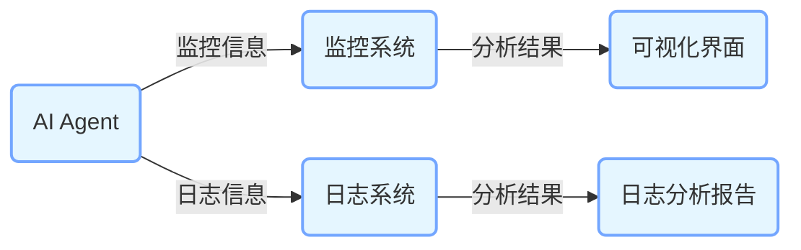

# 监控与日志：追踪AI Agent的行为与性能

> 关键词：AI Agent、监控、日志、行为追踪、性能评估

> 摘要：本文围绕监控与日志在追踪AI Agent行为与性能方面的应用展开深入探讨。首先介绍了相关背景知识，包括目的范围、预期读者等内容。接着阐述了核心概念与联系，详细讲解了核心算法原理及具体操作步骤，同时给出了相应的数学模型和公式并举例说明。通过项目实战，展示了代码的实际案例及详细解释。分析了AI Agent在不同场景下的实际应用，推荐了学习资源、开发工具框架以及相关论文著作。最后总结了未来发展趋势与挑战，解答了常见问题并提供扩展阅读与参考资料，旨在为读者全面了解和掌握追踪AI Agent行为与性能的方法提供有力的技术支持。

## 1. 背景介绍 
### 1.1 目的和范围
随着人工智能技术的飞速发展，AI Agent在各个领域得到了广泛应用，如智能客服、自动驾驶、机器人等。然而，AI Agent的行为和性能往往难以直观地进行评估和理解。监控与日志技术的引入，旨在实时追踪AI Agent的行为轨迹，量化其性能指标，从而帮助开发者更好地优化AI Agent的设计，提高其可靠性和效率。本文的范围涵盖了监控与日志技术的基本原理、实现方法、实际应用案例，以及相关的工具和资源推荐。

### 1.2 预期读者
本文主要面向人工智能领域的开发者、研究人员、软件架构师以及对AI Agent技术感兴趣的技术爱好者。无论您是刚刚接触AI Agent开发，还是希望进一步提升对AI Agent监控与日志技术的理解，都能从本文中获得有价值的信息。

### 1.3 文档结构概述
本文将按照以下结构进行组织：首先介绍监控与日志技术的核心概念和它们之间的联系，通过文本示意图和Mermaid流程图进行直观展示；接着详细阐述核心算法原理，并给出具体的操作步骤，同时使用Python源代码进行示例；然后介绍相关的数学模型和公式，并通过实际例子进行说明；通过项目实战，展示如何在实际开发中应用监控与日志技术；分析AI Agent在不同场景下的实际应用；推荐相关的学习资源、开发工具框架以及论文著作；最后总结未来发展趋势与挑战，解答常见问题并提供扩展阅读与参考资料。

### 1.4 术语表
#### 1.4.1 核心术语定义
- **AI Agent**：能够感知环境、做出决策并采取行动以实现特定目标的人工智能实体。它可以是软件程序、机器人等形式。
- **监控**：对AI Agent的运行状态、行为和性能进行实时监测和分析的过程。
- **日志**：记录AI Agent在运行过程中产生的各种信息，如事件、操作、错误等，以便后续的分析和调试。
- **行为追踪**：通过监控和日志记录，跟踪AI Agent在不同时间点的行为表现，了解其决策过程和行动轨迹。
- **性能评估**：根据监控和日志数据，对AI Agent的性能指标进行量化评估，如准确率、响应时间、资源利用率等。

#### 1.4.2 相关概念解释
- **实时监控**：在AI Agent运行过程中，实时获取其状态信息并进行分析，以便及时发现问题并采取措施。
- **离线日志分析**：将AI Agent产生的日志数据存储下来，在后续的时间点进行深入分析，挖掘潜在的问题和规律。
- **可视化监控**：将监控和日志数据以直观的图表、报表等形式展示出来，方便开发者和管理人员快速了解AI Agent的运行情况。

#### 1.4.3 缩略词列表
- **API**：Application Programming Interface，应用程序编程接口
- **ML**：Machine Learning，机器学习
- **DL**：Deep Learning，深度学习
- **GPU**：Graphics Processing Unit，图形处理器
- **CPU**：Central Processing Unit，中央处理器

## 2. 核心概念与联系 
### 核心概念原理
监控与日志是追踪AI Agent行为与性能的两个关键手段，它们相互配合，共同为开发者提供全面的信息。

监控的核心原理是通过在AI Agent的关键位置插入监测点，实时收集其运行状态信息。这些信息可以包括CPU和GPU的使用率、内存占用情况、网络带宽、响应时间等。监控系统会将这些信息进行整理和分析，以直观的方式展示给开发者，帮助他们及时发现潜在的问题。

日志的核心原理是记录AI Agent在运行过程中产生的各种事件和操作。日志可以是文本形式，也可以是结构化的数据。通过记录详细的日志信息，开发者可以深入了解AI Agent的决策过程、行为轨迹以及出现的错误。日志还可以用于事后的分析和调试，帮助开发者找出问题的根源。

### 文本示意图
```plaintext
              +----------------+
              |    AI Agent    |
              +----------------+
                    |
                    | 监控信息 日志信息
                    v
 +---------------------+       +---------------------+
 |      监控系统       |       |      日志系统       |
 +---------------------+       +---------------------+
                    |                 |
                    | 分析结果        | 分析结果
                    v                 v
 +---------------------+       +---------------------+
 |    可视化界面       |       |    日志分析报告     |
 +---------------------+       +---------------------+
```

### Mermaid流程图


## 3. 核心算法原理 & 具体操作步骤 
### 核心算法原理
在监控与日志系统中，有几个核心算法用于数据的收集、分析和处理。

#### 数据收集算法
数据收集算法的目的是从AI Agent中获取各种运行状态信息和日志数据。在Python中，可以使用`psutil`库来收集系统资源信息，如CPU和内存使用率。以下是一个简单的示例代码：
```python
import psutil

# 获取CPU使用率
cpu_percent = psutil.cpu_percent(interval=1)
print(f"CPU使用率: {cpu_percent}%")

# 获取内存使用率
memory = psutil.virtual_memory()
memory_percent = memory.percent
print(f"内存使用率: {memory_percent}%")
```

#### 数据分析算法
数据分析算法用于对收集到的监控和日志数据进行处理和分析，以提取有价值的信息。例如，可以使用统计分析方法来计算性能指标的平均值、标准差等。以下是一个计算一组数据平均值的示例代码：
```python
data = [1, 2, 3, 4, 5]
average = sum(data) / len(data)
print(f"数据平均值: {average}")
```

#### 异常检测算法
异常检测算法用于识别监控和日志数据中的异常情况。常见的异常检测方法包括基于阈值的检测和基于机器学习的检测。以下是一个基于阈值的异常检测示例代码：
```python
threshold = 80
cpu_percent = psutil.cpu_percent(interval=1)
if cpu_percent > threshold:
    print(f"CPU使用率异常: {cpu_percent}%")
else:
    print(f"CPU使用率正常: {cpu_percent}%")
```

### 具体操作步骤
#### 步骤1：确定监控和日志的目标
在开始监控和日志记录之前，需要明确要监控和记录的内容。例如，要监控AI Agent的CPU和内存使用率，以及记录其决策过程和出现的错误。

#### 步骤2：选择合适的监控和日志工具
根据监控和日志的目标，选择合适的工具和库。例如，可以使用`psutil`库进行系统资源监控，使用`logging`模块进行日志记录。

#### 步骤3：在AI Agent中插入监测点和日志记录代码
在AI Agent的关键位置插入监测点和日志记录代码，以便收集所需的信息。例如，在AI Agent做出决策的地方记录决策结果，在出现错误的地方记录错误信息。

#### 步骤4：搭建监控和日志系统
搭建一个监控和日志系统，用于收集、存储和分析监控和日志数据。可以使用数据库来存储数据，使用可视化工具来展示分析结果。

#### 步骤5：定期分析监控和日志数据
定期对监控和日志数据进行分析，发现潜在的问题和规律。根据分析结果，对AI Agent进行优化和调整。

## 4. 数学模型和公式 & 详细讲解 & 举例说明 
### 数学模型和公式
#### 平均值公式
平均值是一组数据的总和除以数据的个数，用于表示数据的集中趋势。其数学公式为：
$$
\bar{x} = \frac{1}{n} \sum_{i=1}^{n} x_i
$$
其中，$\bar{x}$ 表示平均值，$n$ 表示数据的个数，$x_i$ 表示第 $i$ 个数据。

#### 标准差公式
标准差是一组数据与其平均值的偏离程度的度量，用于表示数据的离散程度。其数学公式为：
$$
\sigma = \sqrt{\frac{1}{n} \sum_{i=1}^{n} (x_i - \bar{x})^2}
$$
其中，$\sigma$ 表示标准差，$\bar{x}$ 表示平均值，$n$ 表示数据的个数，$x_i$ 表示第 $i$ 个数据。

### 详细讲解
平均值是最常用的统计指标之一，它可以帮助我们了解数据的总体水平。标准差则可以反映数据的波动情况，标准差越大，说明数据越分散；标准差越小，说明数据越集中。

### 举例说明
假设有一组数据：$[1, 2, 3, 4, 5]$，我们可以使用上述公式计算其平均值和标准差。

#### 计算平均值
$$
\bar{x} = \frac{1 + 2 + 3 + 4 + 5}{5} = 3
$$

#### 计算标准差
首先计算每个数据与平均值的差值的平方：
$$
(1 - 3)^2 = 4, (2 - 3)^2 = 1, (3 - 3)^2 = 0, (4 - 3)^2 = 1, (5 - 3)^2 = 4
$$
然后计算这些差值的平方的总和：
$$
4 + 1 + 0 + 1 + 4 = 10
$$
最后计算标准差：
$$
\sigma = \sqrt{\frac{10}{5}} = \sqrt{2} \approx 1.414
$$

在Python中，可以使用`statistics`模块来计算平均值和标准差：
```python
import statistics

data = [1, 2, 3, 4, 5]
average = statistics.mean(data)
stdev = statistics.stdev(data)

print(f"平均值: {average}")
print(f"标准差: {stdev}")
```

## 5. 项目实战：代码实际案例和详细解释说明 
### 5.1  开发环境搭建
#### 安装Python
首先，需要安装Python环境。可以从Python官方网站（https://www.python.org/downloads/）下载适合自己操作系统的Python安装包，并按照安装向导进行安装。

#### 安装必要的库
在项目中，需要使用`psutil`和`logging`库。可以使用以下命令来安装这些库：
```sh
pip install psutil
```

### 5.2  源代码详细实现和代码解读
以下是一个简单的AI Agent监控与日志记录的示例代码：
```python
import psutil
import logging
import time

# 配置日志记录
logging.basicConfig(filename='agent.log', level=logging.INFO,
                    format='%(asctime)s - %(levelname)s - %(message)s')

def monitor_agent():
    while True:
        try:
            # 获取CPU使用率
            cpu_percent = psutil.cpu_percent(interval=1)
            # 获取内存使用率
            memory = psutil.virtual_memory()
            memory_percent = memory.percent

            # 记录监控信息到日志
            logging.info(f"CPU使用率: {cpu_percent}%, 内存使用率: {memory_percent}%")

            # 检查是否有异常
            if cpu_percent > 80 or memory_percent > 80:
                logging.warning(f"资源使用率异常: CPU {cpu_percent}%, 内存 {memory_percent}%")

            time.sleep(5)  # 每隔5秒监控一次
        except Exception as e:
            logging.error(f"监控过程中出现错误: {e}")

if __name__ == "__main__":
    monitor_agent()
```

### 代码解读与分析
#### 日志配置部分
```python
logging.basicConfig(filename='agent.log', level=logging.INFO,
                    format='%(asctime)s - %(levelname)s - %(message)s')
```
这部分代码配置了日志记录的基本信息，包括日志文件的名称、日志级别和日志格式。日志文件名为`agent.log`，日志级别为`INFO`，表示只记录信息级别的日志。日志格式包括时间、日志级别和日志内容。

#### 监控循环部分
```python
while True:
    try:
        # 获取CPU使用率
        cpu_percent = psutil.cpu_percent(interval=1)
        # 获取内存使用率
        memory = psutil.virtual_memory()
        memory_percent = memory.percent

        # 记录监控信息到日志
        logging.info(f"CPU使用率: {cpu_percent}%, 内存使用率: {memory_percent}%")

        # 检查是否有异常
        if cpu_percent > 80 or memory_percent > 80:
            logging.warning(f"资源使用率异常: CPU {cpu_percent}%, 内存 {memory_percent}%")

        time.sleep(5)  # 每隔5秒监控一次
    except Exception as e:
        logging.error(f"监控过程中出现错误: {e}")
```
这部分代码是一个无限循环，每隔5秒获取一次CPU和内存的使用率，并将这些信息记录到日志中。如果CPU或内存使用率超过80%，则记录一条警告信息。如果在监控过程中出现异常，则记录一条错误信息。

## 6. 实际应用场景 
### 智能客服系统
在智能客服系统中，监控与日志技术可以用于追踪AI Agent的行为和性能。通过监控AI Agent的响应时间、准确率等指标，开发者可以及时发现系统中的问题，并进行优化。日志记录可以帮助开发者了解AI Agent与用户的对话过程，分析用户的需求和问题，从而提高智能客服的服务质量。

### 自动驾驶汽车
在自动驾驶汽车中，监控与日志技术对于确保车辆的安全和可靠性至关重要。通过监控AI Agent的决策过程、传感器数据等信息，开发者可以实时了解车辆的运行状态，及时发现潜在的危险。日志记录可以用于事故分析和责任认定，帮助开发者改进自动驾驶算法。

### 机器人应用
在机器人应用中，监控与日志技术可以用于追踪机器人的运动轨迹、动作执行情况等。通过监控机器人的能耗、负载等性能指标，开发者可以优化机器人的设计和控制策略。日志记录可以帮助开发者了解机器人在不同环境下的行为表现，为机器人的智能化发展提供数据支持。

## 7. 工具和资源推荐
### 7.1 学习资源推荐
#### 7.1.1 书籍推荐
- 《Python数据分析实战》：本书介绍了Python在数据分析领域的应用，包括数据收集、清洗、分析和可视化等方面的内容，对于学习监控和日志数据分析非常有帮助。
- 《机器学习实战》：本书通过实际案例介绍了机器学习的基本算法和应用，对于理解异常检测等算法原理有很大的帮助。
- 《人工智能：现代方法》：本书是人工智能领域的经典教材，涵盖了AI Agent的基本概念、决策方法和学习算法等内容，对于深入理解AI Agent的行为和性能有重要的指导意义。

#### 7.1.2 在线课程
- Coursera上的“机器学习”课程：由斯坦福大学教授Andrew Ng主讲，是机器学习领域的经典课程，对于学习机器学习算法和应用非常有帮助。
- edX上的“人工智能基础”课程：该课程介绍了人工智能的基本概念、算法和应用，对于初学者来说是一个很好的入门课程。
- Udemy上的“Python数据分析与可视化”课程：该课程介绍了Python在数据分析和可视化方面的应用，对于学习监控和日志数据的分析和展示有很大的帮助。

#### 7.1.3 技术博客和网站
- Medium：是一个技术博客平台，上面有很多关于人工智能、数据分析等领域的文章，可以从中获取最新的技术动态和实践经验。
- Towards Data Science：是一个专注于数据科学和机器学习的博客网站，上面有很多高质量的技术文章和案例分析。
- Kaggle：是一个数据科学竞赛平台，上面有很多数据集和优秀的解决方案，可以通过参加竞赛和学习他人的解决方案来提高自己的技术水平。

### 7.2 开发工具框架推荐
#### 7.2.1 IDE和编辑器
- PyCharm：是一款专门为Python开发设计的集成开发环境，具有代码编辑、调试、版本控制等功能，非常适合Python开发者使用。
- Visual Studio Code：是一款轻量级的代码编辑器，支持多种编程语言，具有丰富的插件生态系统，可以根据自己的需求进行扩展。

#### 7.2.2 调试和性能分析工具
- pdb：是Python自带的调试工具，可以用于调试Python代码，定位问题所在。
- cProfile：是Python的性能分析工具，可以用于分析Python代码的执行时间和内存使用情况，找出性能瓶颈。

#### 7.2.3 相关框架和库
- TensorFlow：是一个开源的机器学习框架，广泛应用于深度学习领域，可以用于构建和训练AI Agent模型。
- PyTorch：是另一个流行的深度学习框架，具有简洁易用的特点，适合快速开发和实验。
- Elasticsearch：是一个开源的分布式搜索和分析引擎，可以用于存储和分析大量的监控和日志数据。

### 7.3 相关论文著作推荐
#### 7.3.1 经典论文
- “Reinforcement Learning: An Introduction”：这是强化学习领域的经典著作，介绍了强化学习的基本概念、算法和应用，对于理解AI Agent的决策过程有重要的意义。
- “Deep Learning”：这是深度学习领域的经典教材，由Yoshua Bengio、Ian Goodfellow和Aaron Courville合著，涵盖了深度学习的基本原理、算法和应用。

#### 7.3.2 最新研究成果
- 在ACM SIGKDD、NeurIPS、ICML等顶级学术会议上发表的关于AI Agent监控和日志分析的论文，这些论文反映了该领域的最新研究成果和发展趋势。

#### 7.3.3 应用案例分析
- 一些知名企业的技术博客，如Google AI Blog、Facebook AI Research等，上面会分享他们在AI Agent应用中的实践经验和案例分析，可以从中学习到很多实际应用中的技巧和方法。

## 8. 总结：未来发展趋势与挑战
### 未来发展趋势
#### 智能化监控与分析
随着人工智能技术的不断发展，监控与日志系统将越来越智能化。未来的监控系统将能够自动识别异常情况，并提供相应的解决方案。日志分析也将更加智能化，能够自动挖掘数据中的潜在信息，为开发者提供更有价值的建议。

#### 实时性和准确性的提升
在一些对实时性要求较高的应用场景中，如自动驾驶汽车、金融交易等，对监控与日志系统的实时性和准确性提出了更高的要求。未来的监控与日志系统将不断优化算法和架构，提高数据的采集和处理速度，确保能够及时准确地反映AI Agent的行为和性能。

#### 跨平台和跨领域的集成
随着AI Agent在不同领域的广泛应用，监控与日志系统需要能够支持跨平台和跨领域的集成。未来的监控与日志系统将能够与不同的操作系统、硬件设备和应用程序进行无缝集成，实现对AI Agent的全面监控和管理。

### 挑战
#### 数据安全和隐私保护
监控和日志数据包含了AI Agent的大量敏感信息，如决策过程、用户交互记录等。如何保障这些数据的安全和隐私，防止数据泄露和滥用，是未来监控与日志系统面临的一个重要挑战。

#### 大规模数据处理和存储
随着AI Agent的应用规模不断扩大，监控和日志数据的量也会急剧增加。如何高效地处理和存储这些大规模数据，是未来监控与日志系统需要解决的另一个问题。

#### 复杂系统的监控和分析
一些复杂的AI Agent系统，如多智能体系统、深度强化学习系统等，其行为和性能受到多种因素的影响，监控和分析难度较大。如何设计有效的监控和分析方法，对这些复杂系统进行全面准确的评估，是未来需要研究的重要课题。

## 9. 附录：常见问题与解答
### 问题1：如何选择合适的监控指标？
解答：选择合适的监控指标需要根据AI Agent的具体应用场景和目标来确定。一般来说，可以从系统资源使用情况（如CPU、内存、网络带宽等）、性能指标（如准确率、响应时间、吞吐量等）、行为指标（如决策频率、动作执行情况等）等方面进行考虑。同时，还需要结合业务需求，选择对业务影响较大的指标进行重点监控。

### 问题2：日志记录的频率应该如何设置？
解答：日志记录的频率需要根据实际情况进行权衡。如果记录频率过高，会产生大量的日志数据，增加存储和处理的负担；如果记录频率过低，可能会错过一些重要的信息。一般来说，可以根据AI Agent的运行状态和业务需求来设置日志记录的频率。例如，在系统初始化和关键操作时，可以增加日志记录的频率；在系统稳定运行时，可以适当降低日志记录的频率。

### 问题3：如何处理监控和日志数据中的噪声？
解答：监控和日志数据中可能会存在一些噪声，如随机的波动、错误的数据等。处理这些噪声可以采用滤波、平滑等方法。例如，可以使用移动平均法对数据进行平滑处理，去除随机波动的影响。同时，还可以结合异常检测算法，识别和剔除明显的错误数据。

### 问题4：如何确保监控和日志系统的可靠性？
解答：确保监控和日志系统的可靠性可以从以下几个方面入手：一是采用冗余设计，如使用多个监控节点和日志存储设备，防止单点故障；二是进行定期的数据备份，确保数据的安全性和可恢复性；三是对监控和日志系统进行实时监测，及时发现和处理系统中的故障和异常。

## 10. 扩展阅读 & 参考资料
### 扩展阅读
- 《数据挖掘：概念与技术》：本书介绍了数据挖掘的基本概念、算法和应用，对于深入理解监控和日志数据分析有很大的帮助。
- 《云计算与大数据》：本书介绍了云计算和大数据的基本概念、技术和应用，对于了解大规模数据处理和存储有重要的指导意义。

### 参考资料
- Python官方文档（https://docs.python.org/）
- psutil官方文档（https://psutil.readthedocs.io/）
- logging官方文档（https://docs.python.org/3/library/logging.html）
- TensorFlow官方文档（https://www.tensorflow.org/api_docs）
- PyTorch官方文档（https://pytorch.org/docs/stable/index.html）

作者：AI天才研究院/AI Genius Institute & 禅与计算机程序设计艺术 /Zen And The Art of Computer Programming