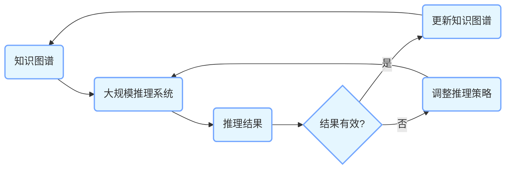

# 知识图谱驱动的大规模推理系统优化研究

> 关键词：知识图谱、大规模推理系统、优化研究、图算法、机器学习

> 摘要：本文聚焦于知识图谱驱动的大规模推理系统优化研究。首先介绍了相关背景，包括研究目的、预期读者等。详细阐述了知识图谱和大规模推理系统的核心概念及其联系，通过文本示意图和 Mermaid 流程图直观展示。深入讲解了核心算法原理，并用 Python 代码进行详细说明。探讨了相关数学模型和公式，结合具体例子加深理解。通过项目实战，从开发环境搭建到源代码实现与解读，展示了系统的实际应用。分析了知识图谱驱动的大规模推理系统在多个领域的实际应用场景。推荐了学习资源、开发工具框架以及相关论文著作。最后总结了未来发展趋势与挑战，并对常见问题进行了解答，为该领域的研究和实践提供了全面而深入的参考。

## 1. 背景介绍 
### 1.1 目的和范围
随着信息技术的飞速发展，知识图谱作为一种强大的知识表示和管理工具，在众多领域得到了广泛应用。大规模推理系统基于知识图谱进行推理计算，能够挖掘出隐藏在知识中的潜在信息，为决策、智能问答等提供支持。然而，当面对大规模的知识图谱时，推理系统面临着效率低下、资源消耗大等问题。本研究的目的在于探索如何对知识图谱驱动的大规模推理系统进行优化，提高其推理效率和性能，降低资源消耗。研究范围涵盖了知识图谱的构建、推理算法的设计与优化、系统架构的改进等方面。

### 1.2 预期读者
本文的预期读者包括从事人工智能、知识工程、数据库等领域的研究人员和开发者，以及对知识图谱和推理系统感兴趣的学生和专业人士。对于那些希望深入了解知识图谱驱动的大规模推理系统优化技术的读者，本文将提供有价值的参考。

### 1.3 文档结构概述
本文共分为十个部分。第一部分为背景介绍，阐述研究的目的、范围、预期读者和文档结构。第二部分介绍知识图谱和大规模推理系统的核心概念及其联系，通过示意图和流程图进行展示。第三部分讲解核心算法原理，并给出 Python 代码实现。第四部分探讨相关的数学模型和公式，结合具体例子进行说明。第五部分通过项目实战，介绍开发环境搭建、源代码实现和代码解读。第六部分分析实际应用场景。第七部分推荐学习资源、开发工具框架和相关论文著作。第八部分总结未来发展趋势与挑战。第九部分为附录，解答常见问题。第十部分提供扩展阅读和参考资料。

### 1.4 术语表
#### 1.4.1 核心术语定义
- **知识图谱**：是一种用图模型来描述知识和建模世界万物之间关联关系的技术方法。它由实体、关系和属性组成，实体表示现实世界中的事物，关系表示实体之间的联系，属性表示实体的特征。
- **大规模推理系统**：基于知识图谱进行推理计算的系统，能够从已知的知识中推导出新的知识。推理过程可以基于规则、统计等方法。
- **推理优化**：通过改进推理算法、系统架构等方式，提高推理系统的效率和性能，降低资源消耗。

#### 1.4.2 相关概念解释
- **图算法**：用于处理图结构数据的算法，如广度优先搜索、深度优先搜索、最短路径算法等。在知识图谱推理中，图算法可以用于查找实体之间的关系路径。
- **机器学习**：是一门多领域交叉学科，涉及概率论、统计学、逼近论、凸分析、算法复杂度理论等多门学科。在知识图谱推理中，机器学习可以用于预测实体之间的关系。

#### 1.4.3 缩略词列表
- **RDF**：Resource Description Framework，资源描述框架，是一种用于表示知识图谱数据的标准格式。
- **OWL**：Web Ontology Language，网络本体语言，用于定义和描述知识图谱中的本体。

## 2. 核心概念与联系 
### 知识图谱的概念
知识图谱本质上是一种语义网络，它以图的形式来表示实体及其之间的关系。在知识图谱中，节点表示实体，边表示实体之间的关系。例如，在一个关于人物的知识图谱中，节点可以表示具体的人物，边可以表示人物之间的亲属关系、工作关系等。知识图谱的构建通常包括数据采集、数据清洗、实体识别、关系抽取等步骤。通过将各种来源的数据进行整合和处理，构建出一个完整的知识图谱。

### 大规模推理系统的概念
大规模推理系统是基于知识图谱进行推理计算的系统。它的主要任务是根据知识图谱中已有的知识，推导出新的知识。推理过程可以基于规则、统计等方法。例如，基于规则的推理可以通过定义一系列的规则，如“如果 A 是 B 的父亲，B 是 C 的父亲，那么 A 是 C 的祖父”，来推导出新的关系。统计推理则可以通过对知识图谱中大量数据的分析，预测实体之间的关系。

### 知识图谱与大规模推理系统的联系
知识图谱为大规模推理系统提供了数据基础，推理系统则通过对知识图谱的处理和分析，挖掘出隐藏在知识中的潜在信息。知识图谱的质量和规模直接影响着推理系统的性能和效果。一个高质量、大规模的知识图谱可以为推理系统提供更丰富的信息，从而提高推理的准确性和效率。同时，推理系统的优化也可以反过来促进知识图谱的完善和扩展，通过推理得到的新的知识可以添加到知识图谱中，进一步丰富知识图谱的内容。

### 文本示意图
```plaintext
知识图谱
├── 实体
│   ├── 人物
│   ├── 地点
│   ├── 组织
└── 关系
    ├── 亲属关系
    ├── 工作关系
    ├── 地理位置关系

大规模推理系统
├── 推理引擎
│   ├── 规则推理
│   ├── 统计推理
└── 数据接口
    ├── 知识图谱读取
    ├── 推理结果输出

联系：知识图谱为推理系统提供数据，推理系统对知识图谱进行推理分析，结果反馈到知识图谱
```

### Mermaid 流程图


## 3. 核心算法原理 & 具体操作步骤 
### 基于规则的推理算法原理
基于规则的推理算法是通过定义一系列的规则来进行推理。规则通常由前提和结论组成，当前提条件满足时，就可以推导出结论。例如，定义规则“如果 A 是 B 的父亲，B 是 C 的父亲，那么 A 是 C 的祖父”。在推理过程中，系统会在知识图谱中查找满足前提条件的实体和关系，如果找到，则可以推导出新的关系。

### Python 代码实现
```python
# 定义知识图谱
knowledge_graph = {
    ('A', '父亲', 'B'),
    ('B', '父亲', 'C')
}

# 定义规则
rules = [
    {
        '前提': [('?x', '父亲', '?y'), ('?y', '父亲', '?z')],
        '结论': ('?x', '祖父', '?z')
    }
]

def rule_based_reasoning(knowledge_graph, rules):
    new_facts = set()
    for rule in rules:
        premise = rule['前提']
        conclusion = rule['结论']
        for fact in knowledge_graph:
            bindings = {}
            match = True
            for i, pattern in enumerate(premise):
                subject, relation, object = pattern
                if subject.startswith('?'):
                    if subject not in bindings:
                        bindings[subject] = fact[i]
                    elif bindings[subject]!= fact[i]:
                        match = False
                        break
                elif subject!= fact[i]:
                    match = False
                    break
            if match:
                new_subject = bindings.get(conclusion[0], conclusion[0])
                new_relation = conclusion[1]
                new_object = bindings.get(conclusion[2], conclusion[2])
                new_fact = (new_subject, new_relation, new_object)
                new_facts.add(new_fact)
    return new_facts

# 进行推理
new_facts = rule_based_reasoning(knowledge_graph, rules)
print("推理得到的新事实:", new_facts)
```

### 代码解释
1. **知识图谱定义**：使用集合来存储知识图谱中的事实，每个事实是一个三元组，表示实体之间的关系。
2. **规则定义**：规则是一个列表，每个规则是一个字典，包含前提和结论。前提和结论都是三元组的列表，其中变量以 `?` 开头。
3. **推理函数**：`rule_based_reasoning` 函数接受知识图谱和规则作为输入，通过遍历规则和知识图谱中的事实，进行匹配和推理。如果前提条件满足，则推导出新的事实。
4. **推理执行**：调用 `rule_based_reasoning` 函数进行推理，并打印推理得到的新事实。

### 基于统计的推理算法原理
基于统计的推理算法通过对知识图谱中大量数据的分析，学习实体之间关系的概率分布，从而预测实体之间的关系。常见的方法包括基于图嵌入的方法和基于概率图模型的方法。基于图嵌入的方法将知识图谱中的实体和关系映射到低维向量空间中，通过向量的运算来预测关系。基于概率图模型的方法则通过构建概率图模型，如贝叶斯网络、马尔可夫随机场等，来计算关系的概率。

### Python 代码实现（基于图嵌入的简单示例）
```python
import numpy as np

# 定义实体和关系的嵌入向量
entity_embeddings = {
    'A': np.array([0.1, 0.2]),
    'B': np.array([0.3, 0.4]),
    'C': np.array([0.5, 0.6])
}

relation_embeddings = {
    '父亲': np.array([0.7, 0.8]),
    '祖父': np.array([0.9, 1.0])
}

def statistical_reasoning(entity_embeddings, relation_embeddings, subject, relation, object):
    subject_embedding = entity_embeddings[subject]
    relation_embedding = relation_embeddings[relation]
    object_embedding = entity_embeddings[object]
    score = np.dot(subject_embedding + relation_embedding, object_embedding)
    return score

# 进行推理
score = statistical_reasoning(entity_embeddings, relation_embeddings, 'A', '祖父', 'C')
print("推理得分:", score)
```

### 代码解释
1. **嵌入向量定义**：使用字典来存储实体和关系的嵌入向量，每个向量是一个 NumPy 数组。
2. **推理函数**：`statistical_reasoning` 函数接受实体和关系的嵌入向量、主题、关系和对象作为输入，通过向量的运算计算得分。得分越高，表示实体之间存在该关系的可能性越大。
3. **推理执行**：调用 `statistical_reasoning` 函数进行推理，并打印推理得分。

## 4. 数学模型和公式 & 详细讲解 & 举例说明 
### 基于规则的推理数学模型
基于规则的推理可以用逻辑公式来表示。设 $R$ 是规则的集合，每个规则 $r \in R$ 可以表示为 $P(r) \rightarrow C(r)$，其中 $P(r)$ 是规则的前提条件，$C(r)$ 是规则的结论。知识图谱 $G$ 可以表示为一组三元组 $(s, p, o)$ 的集合，其中 $s$ 是主题，$p$ 是谓词，$o$ 是对象。推理过程就是在 $G$ 中查找满足 $P(r)$ 的三元组，如果找到，则将 $C(r)$ 对应的三元组添加到 $G$ 中。

例如，规则 “如果 A 是 B 的父亲，B 是 C 的父亲，那么 A 是 C 的祖父” 可以表示为：
$$(A, 父亲, B) \land (B, 父亲, C) \rightarrow (A, 祖父, C)$$

### 基于统计的推理数学模型（以图嵌入为例）
基于图嵌入的推理方法将实体和关系映射到低维向量空间中。设 $\mathbf{e}_s$、$\mathbf{e}_o$ 分别是实体 $s$ 和 $o$ 的嵌入向量，$\mathbf{r}$ 是关系 $r$ 的嵌入向量。推理得分 $f(s, r, o)$ 可以定义为：
$$f(s, r, o) = g(\mathbf{e}_s + \mathbf{r}, \mathbf{e}_o)$$
其中 $g$ 是一个评分函数，常见的评分函数包括点积、余弦相似度等。例如，当 $g$ 是点积时，推理得分可以表示为：
$$f(s, r, o) = (\mathbf{e}_s + \mathbf{r})^T \mathbf{e}_o$$

### 举例说明
假设有一个简单的知识图谱，包含以下三元组：
$$G = \{ (A, 父亲, B), (B, 父亲, C) \}$$
使用基于规则的推理，根据规则 $(A, 父亲, B) \land (B, 父亲, C) \rightarrow (A, 祖父, C)$，可以推导出新的三元组 $(A, 祖父, C)$。

使用基于图嵌入的推理，假设实体和关系的嵌入向量如下：
$$\mathbf{e}_A = [0.1, 0.2], \mathbf{e}_B = [0.3, 0.4], \mathbf{e}_C = [0.5, 0.6]$$
$$\mathbf{r}_{父亲} = [0.7, 0.8], \mathbf{r}_{祖父} = [0.9, 1.0]$$
则推理得分 $f(A, 祖父, C)$ 为：
$$\begin{align*}
f(A, 祖父, C) &= (\mathbf{e}_A + \mathbf{r}_{祖父})^T \mathbf{e}_C \\
&= ([0.1, 0.2] + [0.9, 1.0])^T [0.5, 0.6] \\
&= [1.0, 1.2]^T [0.5, 0.6] \\
&= 1.0 \times 0.5 + 1.2 \times 0.6 \\
&= 0.5 + 0.72 \\
&= 1.22
\end{align*}$$

## 5. 项目实战：代码实际案例和详细解释说明 
### 5.1  开发环境搭建
#### 硬件环境
建议使用具有较高性能的计算机，如多核 CPU、较大内存（至少 8GB）和一定的存储容量（根据知识图谱的规模而定）。

#### 软件环境
- **操作系统**：可以选择 Linux 系统（如 Ubuntu）或 Windows 系统。
- **Python 环境**：安装 Python 3.7 及以上版本。可以使用 Anaconda 来管理 Python 环境，方便安装各种依赖库。
- **数据库**：选择适合存储知识图谱的数据库，如 Neo4j、JanusGraph 等。这里以 Neo4j 为例，安装 Neo4j 数据库并启动服务。

#### 安装依赖库
使用 `pip` 安装以下依赖库：
```bash
pip install py2neo numpy
```
`py2neo` 用于与 Neo4j 数据库进行交互，`numpy` 用于数值计算。

### 5.2  源代码详细实现和代码解读
#### 连接到 Neo4j 数据库
```python
from py2neo import Graph

# 连接到 Neo4j 数据库
graph = Graph("bolt://localhost:7687", auth=("neo4j", "password"))
```
代码解释：使用 `py2neo` 库的 `Graph` 类连接到本地的 Neo4j 数据库，需要提供数据库的地址和认证信息。

#### 导入知识图谱数据到 Neo4j
```python
# 定义知识图谱数据
knowledge_graph = [
    ('A', '父亲', 'B'),
    ('B', '父亲', 'C')
]

# 导入数据到 Neo4j
for subject, relation, object in knowledge_graph:
    graph.run(f"MERGE (s:Entity {{name: '{subject}'}}) "
              f"MERGE (o:Entity {{name: '{object}'}}) "
              f"MERGE (s)-[r:{relation}]->(o)")
```
代码解释：使用 `graph.run` 方法执行 Cypher 查询，将知识图谱中的三元组导入到 Neo4j 数据库中。`MERGE` 语句用于创建节点和关系，如果节点或关系已经存在，则不会重复创建。

#### 基于规则的推理在 Neo4j 上的实现
```python
# 定义规则
rule = {
    '前提': [('?x', '父亲', '?y'), ('?y', '父亲', '?z')],
    '结论': ('?x', '祖父', '?z')
}

# 执行推理
query = f"MATCH {', '.join([f'({p[0]}:{p[1]}:{p[2]})' for p in rule['前提']])} " \
        f"CREATE ({rule['结论'][0]})-[:{rule['结论'][1]}]->({rule['结论'][2]})"
graph.run(query)
```
代码解释：根据规则生成 Cypher 查询语句，使用 `MATCH` 语句查找满足前提条件的节点和关系，使用 `CREATE` 语句创建新的关系。

#### 查询推理结果
```python
# 查询推理结果
result = graph.run("MATCH (s)-[r:祖父]->(o) RETURN s.name, r.type, o.name")
for record in result:
    print(record)
```
代码解释：使用 `MATCH` 语句查询所有具有 “祖父” 关系的节点对，并打印查询结果。

### 5.3  代码解读与分析
#### 数据导入部分
通过 `MERGE` 语句将知识图谱数据导入到 Neo4j 数据库中，确保数据的唯一性。这种方式可以避免重复数据的插入，提高数据的质量。

#### 推理部分
使用 Cypher 查询语言实现基于规则的推理。Cypher 是 Neo4j 的查询语言，具有简洁、灵活的特点。通过 `MATCH` 和 `CREATE` 语句，可以方便地实现规则的匹配和新关系的创建。

#### 查询结果部分
使用 `MATCH` 语句查询推理结果，将结果以记录的形式返回。可以根据需要对结果进行进一步的处理和分析。

## 6. 实际应用场景 
### 智能问答系统
在智能问答系统中，知识图谱驱动的大规模推理系统可以帮助系统更好地理解用户的问题，并从知识图谱中推理出准确的答案。例如，当用户询问 “A 的祖父是谁” 时，系统可以通过知识图谱中的关系进行推理，找到 A 的祖父。

### 推荐系统
在推荐系统中，推理系统可以根据用户的历史行为和知识图谱中的信息，为用户推荐更符合其兴趣的物品。例如，根据用户的购买历史和知识图谱中物品之间的关联关系，推荐相关的物品。

### 金融风险评估
在金融领域，知识图谱可以整合企业、个人的各种信息，推理系统可以通过对这些信息的分析，评估金融风险。例如，通过分析企业之间的股权关系、交易关系等，预测企业的信用风险。

### 医疗诊断
在医疗领域，知识图谱可以存储医学知识、病例信息等，推理系统可以根据患者的症状和知识图谱中的知识，辅助医生进行诊断。例如，根据患者的症状和疾病之间的关联关系，推荐可能的疾病。

## 7. 工具和资源推荐
### 7.1 学习资源推荐
#### 7.1.1 书籍推荐
- 《知识图谱：方法、实践与应用》：全面介绍了知识图谱的理论、方法和应用，是学习知识图谱的经典书籍。
- 《人工智能：一种现代的方法》：涵盖了人工智能的各个领域，包括知识表示、推理等内容，对理解知识图谱驱动的推理系统有很大帮助。

#### 7.1.2 在线课程
- Coursera 上的 “Knowledge Graphs” 课程：由知名教授授课，系统地介绍了知识图谱的相关知识。
- 慕课网上的 “知识图谱实战教程”：通过实际案例，讲解知识图谱的构建和应用。

#### 7.1.3 技术博客和网站
- 开源中国：提供了大量关于知识图谱和人工智能的技术文章和案例。
- 知乎：有很多关于知识图谱的讨论和分享，可以了解到最新的研究动态和实践经验。

### 7.2 开发工具框架推荐
#### 7.2.1 IDE和编辑器
- PyCharm：是一款专业的 Python 集成开发环境，具有代码编辑、调试、自动补全等功能，适合开发基于 Python 的推理系统。
- Visual Studio Code：是一款轻量级的代码编辑器，支持多种编程语言，有丰富的插件可以扩展功能。

#### 7.2.2 调试和性能分析工具
- Neo4j Browser：是 Neo4j 数据库的可视化工具，可以方便地进行数据查询、调试和性能分析。
- cProfile：是 Python 的性能分析工具，可以帮助分析代码的性能瓶颈。

#### 7.2.3 相关框架和库
- DGL-KE：是一个基于深度学习的知识图谱嵌入框架，提供了多种知识图谱嵌入模型的实现。
- RDFLib：是一个 Python 库，用于处理 RDF 数据，方便进行知识图谱的构建和查询。

### 7.3 相关论文著作推荐
#### 7.3.1 经典论文
- “TransE: Translating Embeddings for Modeling Multi-relational Data”：提出了 TransE 模型，是知识图谱嵌入领域的经典论文。
- “Knowledge Graph Embedding by Translating on Hyperplanes”：提出了 TransH 模型，对 TransE 模型进行了改进。

#### 7.3.2 最新研究成果
- 关注 ACL、AAAI、IJCAI 等顶级学术会议的论文，了解知识图谱推理领域的最新研究动态。

#### 7.3.3 应用案例分析
- 可以在 ACM Digital Library、IEEE Xplore 等数据库中查找知识图谱推理在各个领域的应用案例分析论文。

## 8. 总结：未来发展趋势与挑战
### 未来发展趋势
#### 融合多模态信息
未来的知识图谱将不仅仅局限于文本信息，还将融合图像、音频、视频等多模态信息。这将使得知识图谱更加丰富和全面，为推理系统提供更多的信息来源。

#### 与深度学习的深度融合
深度学习在处理复杂数据和模式识别方面具有强大的能力。未来，知识图谱推理系统将与深度学习技术深度融合，利用深度学习的方法来提高推理的准确性和效率。

#### 可解释性推理
随着人工智能在各个领域的广泛应用，可解释性成为了一个重要的问题。未来的推理系统将更加注重可解释性，能够为推理结果提供合理的解释，增强用户对系统的信任。

### 挑战
#### 大规模数据处理
随着知识图谱的规模不断增大，推理系统面临着大规模数据处理的挑战。如何高效地存储、查询和处理大规模的知识图谱数据，是需要解决的问题。

#### 知识图谱的质量和完整性
知识图谱的质量和完整性直接影响着推理系统的性能。如何保证知识图谱的质量，及时更新和补充知识图谱中的信息，是一个挑战。

#### 推理效率和可扩展性
提高推理系统的效率和可扩展性是一个长期的挑战。如何设计高效的推理算法和系统架构，使得推理系统能够在大规模数据和复杂推理任务下保持高效运行，是需要研究的方向。

## 9. 附录：常见问题与解答
### 知识图谱的构建有哪些方法？
知识图谱的构建方法主要包括自顶向下和自底向上两种。自顶向下的方法是先定义本体和规则，然后根据这些本体和规则从数据源中抽取知识。自底向上的方法是先从数据源中抽取实体和关系，然后逐步构建知识图谱。

### 如何评估推理系统的性能？
可以从以下几个方面评估推理系统的性能：
- **准确性**：推理结果的准确率，即推理得到的正确结果占总结果的比例。
- **召回率**：推理系统能够找到的正确结果占所有正确结果的比例。
- **效率**：推理系统的执行时间和资源消耗。

### 知识图谱和数据库有什么区别？
知识图谱是一种语义网络，强调实体之间的关系和语义信息。数据库是一种数据存储和管理系统，主要关注数据的存储和查询。知识图谱可以基于数据库进行存储和管理，但它的功能更侧重于知识的表示和推理。

## 10. 扩展阅读 & 参考资料
### 扩展阅读
- 《深度学习》：深入了解深度学习的理论和方法，有助于理解知识图谱与深度学习的融合。
- 《图算法》：学习图算法的基本原理和应用，对知识图谱的处理和推理有很大帮助。

### 参考资料
- 《知识图谱技术综述》
- 《大规模知识图谱推理方法研究》

作者：AI天才研究院/AI Genius Institute & 禅与计算机程序设计艺术 /Zen And The Art of Computer Programming