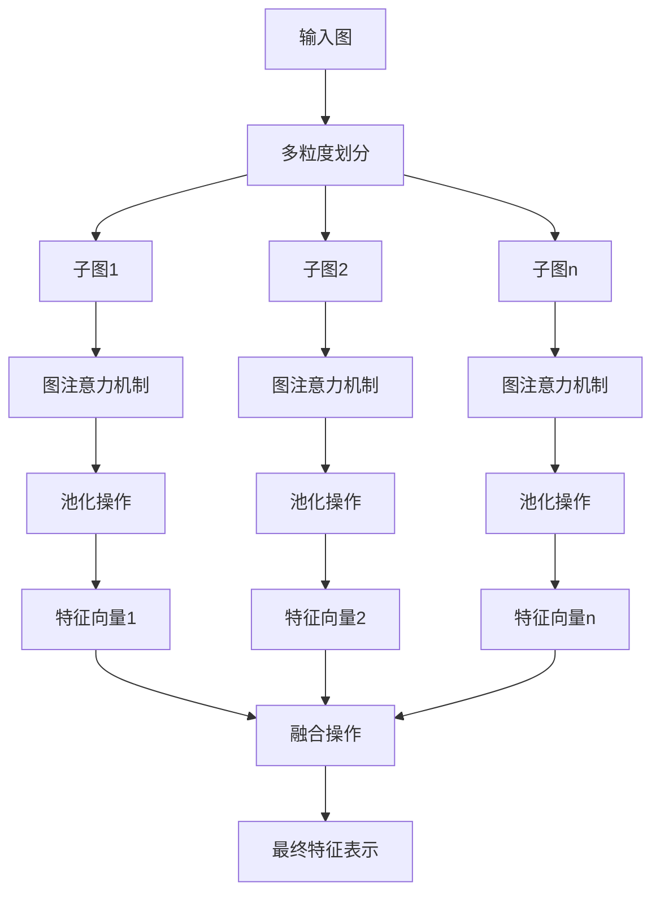

# 知识抽象推理中多粒度图注意力池化的应用

> 关键词：知识抽象推理、多粒度图注意力池化、图神经网络、注意力机制、池化操作

> 摘要：本文深入探讨了知识抽象推理中多粒度图注意力池化的应用。首先介绍了相关背景，包括目的范围、预期读者等内容。接着阐述了核心概念与联系，详细讲解了多粒度图注意力池化的原理和架构，并给出了文本示意图和Mermaid流程图。核心算法原理部分使用Python源代码进行了详细阐述，同时介绍了相关的数学模型和公式，并举例说明。通过项目实战，展示了代码的实际案例并进行详细解释。分析了多粒度图注意力池化在不同场景下的实际应用，还推荐了相关的工具和资源，包括学习资源、开发工具框架以及论文著作等。最后总结了未来发展趋势与挑战，并给出常见问题与解答以及扩展阅读和参考资料。

## 1. 背景介绍 
### 1.1 目的和范围
知识抽象推理在人工智能、自然语言处理、知识图谱等众多领域有着至关重要的作用。它旨在从复杂的知识表示中提取出关键信息，进行有效的推理和决策。多粒度图注意力池化作为一种新兴的技术，为知识抽象推理提供了更强大的工具。本文的目的在于深入研究多粒度图注意力池化在知识抽象推理中的应用，探讨其原理、算法、实际应用场景等方面。范围涵盖了从理论基础到实际项目的整个流程，包括核心概念的解释、算法的实现、数学模型的构建、项目实战案例的分析以及相关工具和资源的推荐等。

### 1.2 预期读者
本文预期读者包括从事人工智能、机器学习、图神经网络等相关领域的研究人员和开发者。对于对知识抽象推理和图注意力机制感兴趣的初学者，也可以通过本文了解相关的基本概念和技术原理。同时，对于在实际项目中需要进行知识表示和推理的工程师，本文提供的项目实战案例和工具资源推荐也具有一定的参考价值。

### 1.3 文档结构概述
本文按照以下结构进行组织：首先介绍背景信息，包括目的范围、预期读者和文档结构概述。接着详细阐述核心概念与联系，包括多粒度图注意力池化的原理和架构，并给出相应的示意图和流程图。核心算法原理部分使用Python代码详细讲解了多粒度图注意力池化的实现过程。数学模型和公式部分给出了相关的理论基础，并通过举例进行说明。项目实战部分展示了如何在实际项目中应用多粒度图注意力池化，包括开发环境搭建、源代码实现和代码解读。然后分析了多粒度图注意力池化的实际应用场景。接着推荐了相关的学习资源、开发工具框架和论文著作。最后总结未来发展趋势与挑战，给出常见问题与解答以及扩展阅读和参考资料。

### 1.4 术语表
#### 1.4.1 核心术语定义
- **知识抽象推理**：从复杂的知识表示中提取关键信息，进行逻辑推理和决策的过程。
- **多粒度图注意力池化**：一种结合了多粒度思想和图注意力机制的池化操作，用于在图结构数据上进行信息聚合和特征提取。
- **图神经网络（GNN）**：一类专门处理图结构数据的神经网络模型，能够学习图中节点和边的特征表示。
- **注意力机制**：一种模拟人类注意力的机制，用于在处理数据时自动分配不同的权重，突出重要信息。
- **池化操作**：在神经网络中，用于对数据进行下采样和信息聚合的操作。

#### 1.4.2 相关概念解释
- **图结构数据**：由节点和边组成的数据结构，节点表示实体，边表示实体之间的关系。例如，知识图谱就是一种典型的图结构数据，其中节点可以表示实体（如人物、地点等），边可以表示实体之间的关系（如父子关系、位于关系等）。
- **多粒度**：指在不同的尺度或层次上对数据进行处理和分析。在多粒度图注意力池化中，多粒度可以体现在对图的不同层次的子图进行处理，以捕捉不同尺度的信息。
- **特征表示**：将原始数据转换为适合机器学习模型处理的向量表示。在图神经网络中，节点和边的特征表示可以用于后续的推理和分类任务。

#### 1.4.3 缩略词列表
- **GNN**：Graph Neural Network（图神经网络）
- **GAT**：Graph Attention Network（图注意力网络）
- **MPNN**：Message Passing Neural Network（消息传递神经网络）

## 2. 核心概念与联系 
### 核心概念原理
多粒度图注意力池化结合了多粒度思想和图注意力机制，旨在从图结构数据中提取不同尺度的重要信息。在知识抽象推理中，图结构数据可以表示知识图谱，其中节点表示实体，边表示实体之间的关系。多粒度图注意力池化的核心思想是在不同的粒度上对图进行处理，通过注意力机制自动分配权重，突出重要的节点和边，然后进行池化操作，将图的信息聚合到一个低维的特征向量中。

具体来说，多粒度图注意力池化可以分为以下几个步骤：
1. **多粒度划分**：将原始图划分为不同粒度的子图。可以根据节点的连接关系、语义信息等进行划分。例如，可以将图划分为局部子图和全局子图，局部子图可以捕捉节点的局部信息，全局子图可以捕捉图的整体结构信息。
2. **图注意力机制**：在每个子图上应用图注意力机制，计算每个节点的注意力权重。图注意力机制通过学习节点之间的关系，为每个节点分配不同的权重，使得模型能够关注到重要的节点和边。
3. **池化操作**：根据计算得到的注意力权重，对每个子图进行池化操作，将子图的信息聚合到一个低维的特征向量中。池化操作可以采用平均池化、最大池化等方法。
4. **融合操作**：将不同粒度的池化结果进行融合，得到最终的特征表示。融合操作可以采用拼接、加权求和等方法。

### 架构的文本示意图
以下是多粒度图注意力池化的架构文本示意图：

```plaintext
输入图 -> 多粒度划分 -> 子图1 -> 图注意力机制 -> 池化操作 -> 特征向量1
               |
               -> 子图2 -> 图注意力机制 -> 池化操作 -> 特征向量2
               |
              ...
               |
               -> 子图n -> 图注意力机制 -> 池化操作 -> 特征向量n
               |
融合操作 -> 最终特征表示
```

### Mermaid流程图


## 3. 核心算法原理 & 具体操作步骤 
### 图注意力机制原理
图注意力机制是多粒度图注意力池化的核心部分，它通过计算节点之间的注意力权重，使得模型能够关注到重要的节点和边。下面是图注意力机制的Python代码实现：

```python
import torch
import torch.nn as nn
import torch.nn.functional as F

class GraphAttentionLayer(nn.Module):
    def __init__(self, in_features, out_features, dropout, alpha, concat=True):
        super(GraphAttentionLayer, self).__init__()
        self.dropout = dropout
        self.in_features = in_features
        self.out_features = out_features
        self.alpha = alpha
        self.concat = concat

        self.W = nn.Parameter(torch.empty(size=(in_features, out_features)))
        nn.init.xavier_uniform_(self.W.data, gain=1.414)
        self.a = nn.Parameter(torch.empty(size=(2*out_features, 1)))
        nn.init.xavier_uniform_(self.a.data, gain=1.414)

        self.leakyrelu = nn.LeakyReLU(self.alpha)

    def forward(self, h, adj):
        Wh = torch.mm(h, self.W)  # h.shape: (N, in_features), Wh.shape: (N, out_features)
        e = self._prepare_attentional_mechanism_input(Wh)

        zero_vec = -9e15*torch.ones_like(e)
        attention = torch.where(adj > 0, e, zero_vec)
        attention = F.softmax(attention, dim=1)
        attention = F.dropout(attention, self.dropout, training=self.training)
        h_prime = torch.matmul(attention, Wh)

        if self.concat:
            return F.elu(h_prime)
        else:
            return h_prime

    def _prepare_attentional_mechanism_input(self, Wh):
        # Wh.shape (N, out_feature)
        # self.a.shape (2 * out_feature, 1)
        # Wh1&2.shape (N, 1)
        # e.shape (N, N)
        Wh1 = torch.matmul(Wh, self.a[:self.out_features, :])
        Wh2 = torch.matmul(Wh, self.a[self.out_features:, :])
        # broadcast add
        e = Wh1 + Wh2.T
        return self.leakyrelu(e)
```

### 多粒度图注意力池化算法步骤
1. **多粒度划分**：将输入图划分为不同粒度的子图。可以使用图分割算法，如谱聚类算法等。
```python
import networkx as nx
import numpy as np

def multi_granularity_partition(G, num_partitions):
    partitions = []
    for i in range(num_partitions):
        # 这里使用谱聚类算法进行图分割
        laplacian = nx.normalized_laplacian_matrix(G).toarray()
        eigenvalues, eigenvectors = np.linalg.eig(laplacian)
        sorted_indices = np.argsort(eigenvalues)
        second_eigenvector = eigenvectors[:, sorted_indices[1]]
        partition = second_eigenvector > 0
        subgraph = G.subgraph(np.where(partition)[0])
        partitions.append(subgraph)
    return partitions
```
2. **图注意力机制应用**：在每个子图上应用图注意力机制，计算节点的注意力权重。
```python
# 假设已经有了节点特征矩阵 h 和邻接矩阵 adj
num_nodes = h.shape[0]
adj = torch.FloatTensor(nx.adjacency_matrix(G).todense())
gat_layer = GraphAttentionLayer(in_features=h.shape[1], out_features=64, dropout=0.6, alpha=0.2)
h_prime = gat_layer(h, adj)
```
3. **池化操作**：根据注意力权重对每个子图进行池化操作。这里使用平均池化作为示例。
```python
def average_pooling(h_prime):
    pooled_features = torch.mean(h_prime, dim=0)
    return pooled_features
```
4. **融合操作**：将不同粒度的池化结果进行融合。这里使用拼接的方法。
```python
def fusion(pooled_features_list):
    fused_features = torch.cat(pooled_features_list, dim=0)
    return fused_features
```

### 完整的多粒度图注意力池化算法实现
```python
def multi_granularity_graph_attention_pooling(G, h, num_partitions):
    partitions = multi_granularity_partition(G, num_partitions)
    pooled_features_list = []
    for subgraph in partitions:
        sub_adj = torch.FloatTensor(nx.adjacency_matrix(subgraph).todense())
        sub_h = h[list(subgraph.nodes())]
        gat_layer = GraphAttentionLayer(in_features=h.shape[1], out_features=64, dropout=0.6, alpha=0.2)
        sub_h_prime = gat_layer(sub_h, sub_adj)
        pooled_features = average_pooling(sub_h_prime)
        pooled_features_list.append(pooled_features)
    fused_features = fusion(pooled_features_list)
    return fused_features
```

## 4. 数学模型和公式 & 详细讲解 & 举例说明 
### 图注意力机制数学模型
图注意力机制的核心是计算节点之间的注意力权重。假设输入的节点特征矩阵为 $H \in \mathbb{R}^{N \times F}$，其中 $N$ 是节点的数量，$F$ 是节点特征的维度。首先，通过一个线性变换将节点特征映射到一个新的空间：
$$
\mathbf{W} \in \mathbb{R}^{F \times F'}
$$
$$
\mathbf{Wh} \in \mathbb{R}^{N \times F'}
$$
其中 $\mathbf{W}$ 是可学习的权重矩阵，$F'$ 是变换后的特征维度。

然后，计算节点 $i$ 和节点 $j$ 之间的注意力系数 $e_{ij}$：
$$
e_{ij} = \text{LeakyReLU}(\mathbf{a}^T [\mathbf{Wh}_i \| \mathbf{Wh}_j])
$$
其中 $\mathbf{a} \in \mathbb{R}^{2F'}$ 是可学习的权重向量，$\|$ 表示拼接操作。

为了得到归一化的注意力权重 $\alpha_{ij}$，使用 softmax 函数：
$$
\alpha_{ij} = \frac{\exp(e_{ij})}{\sum_{k \in \mathcal{N}_i} \exp(e_{ik})}
$$
其中 $\mathcal{N}_i$ 是节点 $i$ 的邻居节点集合。

最后，更新节点 $i$ 的特征 $\mathbf{h}_i'$：
$$
\mathbf{h}_i' = \sigma\left(\sum_{j \in \mathcal{N}_i} \alpha_{ij} \mathbf{Wh}_j\right)
$$
其中 $\sigma$ 是激活函数，如 ELU 函数。

### 池化操作数学模型
池化操作的目的是将子图的信息聚合到一个低维的特征向量中。以平均池化为例，假设子图的节点特征矩阵为 $\mathbf{H}' \in \mathbb{R}^{M \times F'}$，其中 $M$ 是子图中节点的数量。平均池化的计算公式为：
$$
\mathbf{p} = \frac{1}{M} \sum_{i=1}^{M} \mathbf{h}_i'
$$
其中 $\mathbf{p} \in \mathbb{R}^{F'}$ 是池化后的特征向量。

### 融合操作数学模型
融合操作将不同粒度的池化结果进行融合。以拼接为例，假设不同粒度的池化结果为 $\mathbf{p}_1, \mathbf{p}_2, \cdots, \mathbf{p}_n$，其中 $\mathbf{p}_i \in \mathbb{R}^{F_i}$。拼接后的特征向量为：
$$
\mathbf{f} = [\mathbf{p}_1 \| \mathbf{p}_2 \| \cdots \| \mathbf{p}_n]
$$
其中 $\mathbf{f} \in \mathbb{R}^{\sum_{i=1}^{n} F_i}$。

### 举例说明
假设我们有一个包含 5 个节点的图，节点特征维度为 3。输入的节点特征矩阵 $H$ 为：
$$
H = \begin{bmatrix}
1 & 2 & 3 \\
4 & 5 & 6 \\
7 & 8 & 9 \\
10 & 11 & 12 \\
13 & 14 & 15
\end{bmatrix}
$$
邻接矩阵 $A$ 为：
$$
A = \begin{bmatrix}
0 & 1 & 0 & 0 & 0 \\
1 & 0 & 1 & 0 & 0 \\
0 & 1 & 0 & 1 & 0 \\
0 & 0 & 1 & 0 & 1 \\
0 & 0 & 0 & 1 & 0
\end{bmatrix}
$$
我们将图划分为 2 个子图，分别计算每个子图的注意力权重和池化结果，最后进行融合。

首先，对节点特征矩阵进行线性变换：
$$
\mathbf{W} = \begin{bmatrix}
0.1 & 0.2 & 0.3 \\
0.4 & 0.5 & 0.6 \\
0.7 & 0.8 & 0.9
\end{bmatrix}
$$
$$
\mathbf{Wh} = H \cdot \mathbf{W} = \begin{bmatrix}
3.0 & 3.6 & 4.2 \\
6.6 & 8.1 & 9.6 \\
10.2 & 12.6 & 15.0 \\
13.8 & 17.1 & 20.4 \\
17.4 & 21.6 & 25.8
\end{bmatrix}
$$
然后，计算注意力系数和注意力权重，更新节点特征。接着，对每个子图进行平均池化，得到池化结果 $\mathbf{p}_1$ 和 $\mathbf{p}_2$。最后，将 $\mathbf{p}_1$ 和 $\mathbf{p}_2$ 进行拼接，得到最终的特征表示 $\mathbf{f}$。

## 5. 项目实战：代码实际案例和详细解释说明 
### 5.1  开发环境搭建
为了实现多粒度图注意力池化在知识抽象推理中的应用，我们需要搭建相应的开发环境。以下是具体的步骤：
1. **安装Python**：建议使用Python 3.7及以上版本。可以从Python官方网站（https://www.python.org/downloads/）下载并安装。
2. **安装深度学习框架**：我们使用PyTorch作为深度学习框架。可以根据自己的CUDA版本和操作系统，从PyTorch官方网站（https://pytorch.org/get-started/locally/）选择合适的安装命令进行安装。例如，对于CPU版本的PyTorch，可以使用以下命令：
```bash
pip install torch torchvision torchaudio
```
3. **安装其他依赖库**：还需要安装一些其他的依赖库，如`networkx`用于图处理，`numpy`用于数值计算等。可以使用以下命令进行安装：
```bash
pip install networkx numpy
```

### 5.2  源代码详细实现和代码解读
以下是一个完整的项目实战代码示例，展示了如何使用多粒度图注意力池化进行知识抽象推理：

```python
import torch
import torch.nn as nn
import torch.nn.functional as F
import networkx as nx
import numpy as np

# 图注意力层
class GraphAttentionLayer(nn.Module):
    def __init__(self, in_features, out_features, dropout, alpha, concat=True):
        super(GraphAttentionLayer, self).__init__()
        self.dropout = dropout
        self.in_features = in_features
        self.out_features = out_features
        self.alpha = alpha
        self.concat = concat

        self.W = nn.Parameter(torch.empty(size=(in_features, out_features)))
        nn.init.xavier_uniform_(self.W.data, gain=1.414)
        self.a = nn.Parameter(torch.empty(size=(2*out_features, 1)))
        nn.init.xavier_uniform_(self.a.data, gain=1.414)

        self.leakyrelu = nn.LeakyReLU(self.alpha)

    def forward(self, h, adj):
        Wh = torch.mm(h, self.W)  # h.shape: (N, in_features), Wh.shape: (N, out_features)
        e = self._prepare_attentional_mechanism_input(Wh)

        zero_vec = -9e15*torch.ones_like(e)
        attention = torch.where(adj > 0, e, zero_vec)
        attention = F.softmax(attention, dim=1)
        attention = F.dropout(attention, self.dropout, training=self.training)
        h_prime = torch.matmul(attention, Wh)

        if self.concat:
            return F.elu(h_prime)
        else:
            return h_prime

    def _prepare_attentional_mechanism_input(self, Wh):
        Wh1 = torch.matmul(Wh, self.a[:self.out_features, :])
        Wh2 = torch.matmul(Wh, self.a[self.out_features:, :])
        e = Wh1 + Wh2.T
        return self.leakyrelu(e)

# 多粒度划分
def multi_granularity_partition(G, num_partitions):
    partitions = []
    for i in range(num_partitions):
        laplacian = nx.normalized_laplacian_matrix(G).toarray()
        eigenvalues, eigenvectors = np.linalg.eig(laplacian)
        sorted_indices = np.argsort(eigenvalues)
        second_eigenvector = eigenvectors[:, sorted_indices[1]]
        partition = second_eigenvector > 0
        subgraph = G.subgraph(np.where(partition)[0])
        partitions.append(subgraph)
    return partitions

# 平均池化
def average_pooling(h_prime):
    pooled_features = torch.mean(h_prime, dim=0)
    return pooled_features

# 融合操作
def fusion(pooled_features_list):
    fused_features = torch.cat(pooled_features_list, dim=0)
    return fused_features

# 多粒度图注意力池化
def multi_granularity_graph_attention_pooling(G, h, num_partitions):
    partitions = multi_granularity_partition(G, num_partitions)
    pooled_features_list = []
    for subgraph in partitions:
        sub_adj = torch.FloatTensor(nx.adjacency_matrix(subgraph).todense())
        sub_h = h[list(subgraph.nodes())]
        gat_layer = GraphAttentionLayer(in_features=h.shape[1], out_features=64, dropout=0.6, alpha=0.2)
        sub_h_prime = gat_layer(sub_h, sub_adj)
        pooled_features = average_pooling(sub_h_prime)
        pooled_features_list.append(pooled_features)
    fused_features = fusion(pooled_features_list)
    return fused_features

# 示例代码
if __name__ == "__main__":
    # 创建一个简单的图
    G = nx.karate_club_graph()
    num_nodes = G.number_of_nodes()
    node_features = torch.randn(num_nodes, 10)  # 随机生成节点特征

    # 进行多粒度图注意力池化
    num_partitions = 2
    fused_features = multi_granularity_graph_attention_pooling(G, node_features, num_partitions)
    print("Fused features shape:", fused_features.shape)
```

### 代码解读与分析
1. **图注意力层（GraphAttentionLayer）**：该类实现了图注意力机制。在`__init__`方法中，初始化了可学习的权重矩阵`W`和`a`，以及激活函数`leakyrelu`。在`forward`方法中，首先对输入的节点特征矩阵进行线性变换，然后计算注意力系数和注意力权重，最后根据注意力权重更新节点特征。
2. **多粒度划分（multi_granularity_partition）**：该函数使用谱聚类算法将输入图划分为不同粒度的子图。通过计算图的拉普拉斯矩阵的特征向量，将图分割成两部分，重复多次得到不同的子图。
3. **平均池化（average_pooling）**：该函数对输入的节点特征矩阵进行平均池化，将子图的信息聚合到一个低维的特征向量中。
4. **融合操作（fusion）**：该函数将不同粒度的池化结果进行拼接，得到最终的特征表示。
5. **多粒度图注意力池化（multi_granularity_graph_attention_pooling）**：该函数整合了多粒度划分、图注意力机制、池化操作和融合操作，实现了完整的多粒度图注意力池化过程。
6. **示例代码**：创建了一个简单的图（空手道俱乐部图），随机生成节点特征，然后调用`multi_granularity_graph_attention_pooling`函数进行多粒度图注意力池化，最后打印出融合后的特征向量的形状。

## 6. 实际应用场景 
### 知识图谱推理
在知识图谱中，节点表示实体，边表示实体之间的关系。多粒度图注意力池化可以用于知识图谱推理，通过提取不同尺度的信息，更好地理解知识图谱的结构和语义。例如，在问答系统中，可以使用多粒度图注意力池化对知识图谱进行建模，根据问题从知识图谱中提取相关信息，进行推理和回答。

### 推荐系统
在推荐系统中，用户和物品可以表示为图中的节点，用户与物品之间的交互可以表示为边。多粒度图注意力池化可以用于挖掘用户和物品之间的潜在关系，提取不同层次的特征信息，从而提高推荐的准确性和多样性。例如，在电商推荐系统中，可以根据用户的历史购买记录和浏览行为，构建用户 - 物品图，使用多粒度图注意力池化进行特征提取，为用户推荐更符合其兴趣的商品。

### 社交网络分析
在社交网络中，用户可以表示为节点，用户之间的关系（如好友关系、关注关系等）可以表示为边。多粒度图注意力池化可以用于分析社交网络的结构和用户行为，发现社区结构、预测用户的行为等。例如，在社交媒体平台中，可以使用多粒度图注意力池化分析用户的社交圈子，预测用户可能感兴趣的内容或可能关注的人。

### 生物信息学
在生物信息学中，蛋白质 - 蛋白质相互作用网络、基因调控网络等可以表示为图结构数据。多粒度图注意力池化可以用于分析这些生物网络的结构和功能，预测蛋白质的功能、发现疾病相关的基因等。例如，在药物研发中，可以使用多粒度图注意力池化分析蛋白质 - 蛋白质相互作用网络，寻找潜在的药物靶点。

## 7. 工具和资源推荐
### 7.1 学习资源推荐
#### 7.1.1 书籍推荐
- 《图神经网络：基础、前沿与应用》：全面介绍了图神经网络的基本概念、算法和应用，对多粒度图注意力池化等相关技术也有一定的涉及。
- 《深度学习》：经典的深度学习教材，对神经网络的基本原理和算法进行了详细的讲解，为理解多粒度图注意力池化的理论基础提供了帮助。

#### 7.1.2 在线课程
- Coursera上的“Graph Neural Networks”课程：由知名教授授课，系统地介绍了图神经网络的相关知识，包括图注意力机制和池化操作等内容。
- edX上的“Deep Learning for Graphs”课程：深入探讨了深度学习在图结构数据上的应用，对多粒度图注意力池化的原理和实现有详细的讲解。

#### 7.1.3 技术博客和网站
- Medium上的“Graph Neural Networks”专栏：汇集了众多图神经网络领域的优秀文章，包括最新的研究成果和实践经验。
- arXiv.org：提供了大量的学术论文，包括图神经网络和多粒度图注意力池化相关的研究论文，可以及时了解该领域的最新动态。

### 7.2 开发工具框架推荐
#### 7.2.1 IDE和编辑器
- PyCharm：功能强大的Python集成开发环境，提供了代码编辑、调试、版本控制等一系列功能，适合开发多粒度图注意力池化相关的项目。
- Jupyter Notebook：交互式的开发环境，方便进行代码的编写、测试和可视化，适合进行算法的实验和验证。

#### 7.2.2 调试和性能分析工具
- PyTorch Profiler：PyTorch自带的性能分析工具，可以帮助分析代码的性能瓶颈，优化多粒度图注意力池化算法的运行效率。
- TensorBoard：用于可视化深度学习模型的训练过程和结果，可以直观地观察多粒度图注意力池化模型的训练情况。

#### 7.2.3 相关框架和库
- PyTorch Geometric：基于PyTorch的图神经网络框架，提供了丰富的图神经网络层和工具，方便实现多粒度图注意力池化算法。
- DGL（Deep Graph Library）：另一个流行的图神经网络框架，支持多种深度学习后端，具有高效的图计算能力。

### 7.3 相关论文著作推荐
#### 7.3.1 经典论文
- “Graph Attention Networks”：提出了图注意力网络（GAT），为图注意力机制的发展奠定了基础。
- “Hierarchical Graph Representation Learning with Differentiable Pooling”：介绍了可微池化方法，为多粒度图池化的研究提供了重要的思路。

#### 7.3.2 最新研究成果
- 可以关注ICML、NeurIPS、AAAI等顶级学术会议上发表的关于图神经网络和多粒度图注意力池化的最新研究论文，了解该领域的前沿动态。

#### 7.3.3 应用案例分析
- 一些学术数据库（如ACM Digital Library、IEEE Xplore等）收录了大量关于图神经网络在不同领域应用的案例分析论文，可以参考这些论文了解多粒度图注意力池化在实际应用中的具体实现和效果。

## 8. 总结：未来发展趋势与挑战
### 未来发展趋势
- **更高效的算法设计**：随着数据规模的不断增大，对多粒度图注意力池化算法的效率提出了更高的要求。未来的研究可能会集中在设计更高效的算法，减少计算复杂度和内存占用。
- **与其他技术的融合**：多粒度图注意力池化可以与其他技术（如强化学习、迁移学习等）进行融合，以提高知识抽象推理的能力和应用范围。例如，将多粒度图注意力池化与强化学习相结合，用于解决复杂的决策问题。
- **跨领域应用拓展**：多粒度图注意力池化在知识图谱推理、推荐系统、社交网络分析等领域已经取得了一定的应用成果。未来，它有望在更多的领域得到应用，如医疗保健、金融、交通等。

### 挑战
- **数据质量和规模**：多粒度图注意力池化的性能高度依赖于数据的质量和规模。在实际应用中，获取高质量、大规模的图结构数据往往是一个挑战。此外，数据的噪声和缺失值也会影响模型的性能。
- **可解释性问题**：图神经网络模型（包括多粒度图注意力池化）通常被认为是黑盒模型，缺乏可解释性。在一些对解释性要求较高的应用场景中，如医疗诊断、金融风险评估等，模型的可解释性问题需要得到解决。
- **计算资源需求**：多粒度图注意力池化算法的计算复杂度较高，需要大量的计算资源。在实际应用中，如何在有限的计算资源下实现高效的模型训练和推理是一个亟待解决的问题。

## 9. 附录：常见问题与解答
### 问题1：多粒度图注意力池化与传统的池化操作有什么区别？
传统的池化操作（如平均池化、最大池化）通常是在规则的网格数据（如图像、音频等）上进行的，没有考虑数据的图结构信息。而多粒度图注意力池化是专门针对图结构数据设计的，它结合了多粒度思想和图注意力机制，能够自动关注图中重要的节点和边，提取不同尺度的信息。

### 问题2：如何选择合适的多粒度划分方法？
选择合适的多粒度划分方法需要考虑图的结构特点、数据的语义信息以及具体的应用场景。常见的多粒度划分方法包括谱聚类算法、层次聚类算法等。在实际应用中，可以通过实验比较不同划分方法的效果，选择最优的方法。

### 问题3：多粒度图注意力池化的计算复杂度如何？
多粒度图注意力池化的计算复杂度主要取决于图的规模、多粒度划分的粒度数量以及图注意力机制的复杂度。一般来说，图的规模越大、粒度数量越多，计算复杂度越高。在实际应用中，可以通过优化算法和使用高效的计算设备（如GPU）来降低计算复杂度。

### 问题4：多粒度图注意力池化模型的训练过程中需要注意什么？
在训练多粒度图注意力池化模型时，需要注意以下几点：
1. **数据预处理**：对输入的图结构数据进行预处理，如归一化、特征选择等，以提高模型的性能。
2. **超参数调整**：选择合适的超参数（如学习率、批次大小、注意力机制的参数等），可以通过网格搜索、随机搜索等方法进行超参数调优。
3. **防止过拟合**：可以使用正则化方法（如L1、L2正则化）、Dropout等技术来防止模型过拟合。

## 10. 扩展阅读 & 参考资料
### 扩展阅读
- 《Graph Representation Learning》：深入介绍了图表示学习的相关知识，对理解多粒度图注意力池化的理论基础有很大的帮助。
- 《Advances in Neural Information Processing Systems》（NeurIPS）会议论文集：收录了大量图神经网络和注意力机制相关的前沿研究成果，可以进一步了解该领域的最新发展动态。

### 参考资料
1. Veličković, P., Cucurull, G., Casanova, A., Romero, A., Lio, P., & Bengio, Y. (2017). Graph attention networks. arXiv preprint arXiv:1710.10903.
2. Ying, R., You, J., Morris, C., Ren, X., Hamilton, W. L., & Leskovec, J. (2018). Hierarchical graph representation learning with differentiable pooling. In Advances in neural information processing systems (pp. 4800-4810).

作者：AI天才研究院/AI Genius Institute & 禅与计算机程序设计艺术 /Zen And The Art of Computer Programming