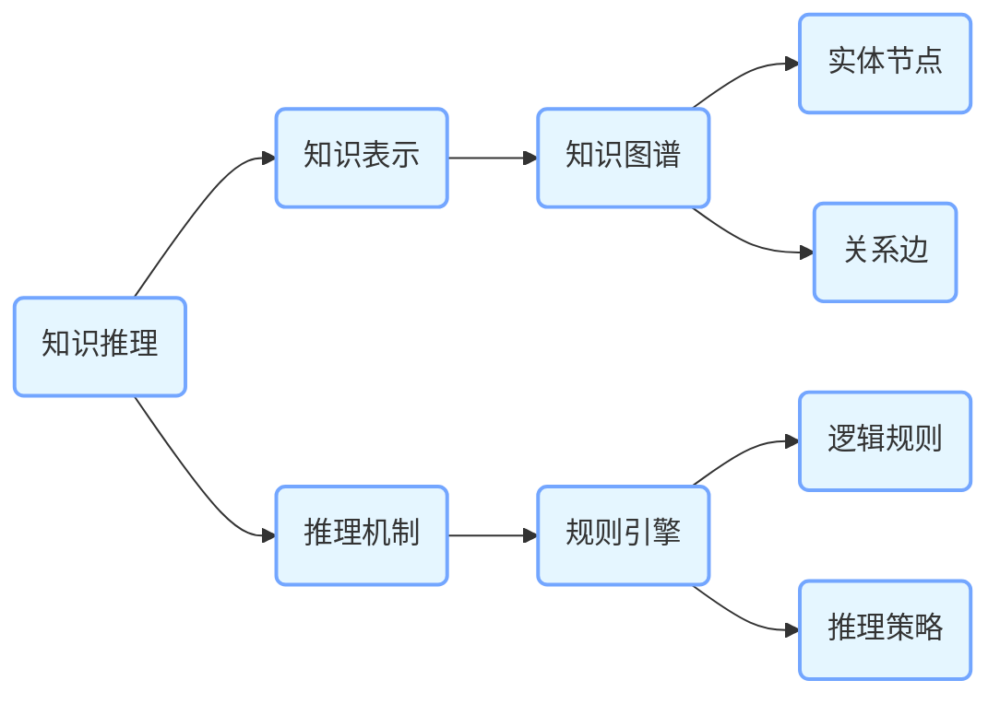

# 知识推理：增强AI Agent的逻辑思考能力

> 关键词：知识推理、AI Agent、逻辑思考能力、知识图谱、推理算法

> 摘要：本文围绕知识推理增强AI Agent逻辑思考能力展开。首先介绍知识推理和AI Agent的背景知识，明确文章目的和适用读者。接着阐述核心概念及联系，包括知识表示、推理机制等，并给出示意图和流程图。详细讲解核心算法原理，结合Python代码说明。探讨相关数学模型和公式，举例加深理解。通过项目实战展示代码实现与解读。分析实际应用场景，推荐学习资源、开发工具和相关论文著作。最后总结未来发展趋势与挑战，解答常见问题，并提供扩展阅读和参考资料，旨在全面深入地阐述知识推理对提升AI Agent逻辑思考能力的重要作用和实现方法。

## 1. 背景介绍 
### 1.1 目的和范围
本文章的主要目的是深入探讨知识推理如何增强AI Agent的逻辑思考能力。我们将详细介绍知识推理的核心概念、算法原理、数学模型，以及如何在实际项目中运用知识推理来提升AI Agent的性能。范围涵盖了从理论基础到实际应用的各个方面，包括知识表示、推理算法的实现、项目实战案例，以及相关的工具和资源推荐。

### 1.2 预期读者
本文预期读者包括人工智能领域的研究人员、开发者、学生，以及对AI Agent和知识推理感兴趣的技术爱好者。对于希望深入了解知识推理技术，提升AI Agent逻辑思考能力的专业人士，本文将提供全面而深入的知识和实践指导。

### 1.3 文档结构概述
本文共分为十个部分。第一部分是背景介绍，阐述文章的目的、预期读者和文档结构。第二部分介绍核心概念与联系，包括知识推理和AI Agent的基本概念、它们之间的联系，并通过示意图和流程图进行说明。第三部分详细讲解核心算法原理，结合Python代码展示推理算法的具体实现步骤。第四部分介绍数学模型和公式，对推理过程中的数学原理进行详细讲解，并举例说明。第五部分是项目实战，包括开发环境搭建、源代码实现和代码解读。第六部分分析知识推理在不同领域的实际应用场景。第七部分推荐学习资源、开发工具和相关论文著作。第八部分总结知识推理的未来发展趋势与挑战。第九部分是附录，解答常见问题。第十部分提供扩展阅读和参考资料。

### 1.4 术语表
#### 1.4.1 核心术语定义
- **知识推理**：从已有的知识中推导出新的知识的过程。它基于一定的逻辑规则和算法，利用已知的事实和关系，得出未知的结论。
- **AI Agent**：能够感知环境、做出决策并采取行动以实现特定目标的人工智能实体。它可以是软件程序、机器人等。
- **知识图谱**：一种以图的形式表示知识的方法，由节点和边组成，节点表示实体，边表示实体之间的关系。
- **逻辑思考能力**：指能够运用逻辑规则进行分析、推理和判断的能力，在AI Agent中表现为能够根据已知信息合理地推导出新的信息。

#### 1.4.2 相关概念解释
- **知识表示**：将知识以计算机能够理解和处理的方式进行表示的方法。常见的知识表示方法包括谓词逻辑、语义网络、框架等。
- **推理机制**：实现知识推理的具体方法和策略，如基于规则的推理、基于案例的推理、基于机器学习的推理等。
- **本体**：对特定领域内概念和关系的明确、形式化的描述，用于规范知识的表示和推理。

#### 1.4.3 缩略词列表
- **RDF**：Resource Description Framework，资源描述框架，一种用于表示知识的标准数据模型。
- **OWL**：Web Ontology Language，网络本体语言，用于创建本体和描述语义信息。
- **Datalog**：一种基于逻辑编程的规则语言，常用于知识推理。

## 2. 核心概念与联系 

### 核心概念原理
#### 知识推理
知识推理是人工智能领域的重要研究方向，其核心原理是基于已有的知识和逻辑规则，推导出新的知识。知识推理可以分为演绎推理、归纳推理和类比推理等不同类型。演绎推理是从一般到特殊的推理过程，例如从“所有的人都会死亡”和“苏格拉底是人”可以推出“苏格拉底会死亡”。归纳推理是从特殊到一般的推理过程，通过对多个具体事例的观察和分析，总结出一般性的规律。类比推理是根据两个或多个事物之间的相似性，从一个事物的已知属性推导出另一个事物的未知属性。

#### AI Agent
AI Agent是具有自主决策和行动能力的人工智能实体。它通过感知环境获取信息，运用知识推理和决策算法对信息进行处理，然后采取相应的行动。AI Agent的性能取决于其知识表示、推理能力和决策策略。一个具有强大知识推理能力的AI Agent能够更好地理解环境、预测未来事件，并做出更合理的决策。

#### 知识图谱
知识图谱是一种用于表示知识的图结构，它将实体表示为节点，将实体之间的关系表示为边。知识图谱可以有效地整合和组织大量的知识，为知识推理提供丰富的信息来源。通过在知识图谱上进行推理，可以发现实体之间的隐含关系，挖掘新的知识。

### 架构的文本示意图
```plaintext
           知识推理
             |
             |
     +----------------+
     |                |
  知识表示        推理机制
     |                |
     |                |
  知识图谱        规则引擎
     |                |
     |                |
  实体节点           逻辑规则
     |                |
     |                |
  关系边             推理策略
```

### Mermaid流程图


## 3. 核心算法原理 & 具体操作步骤 

### 基于规则的推理算法原理
基于规则的推理是一种常见的知识推理方法，它通过定义一系列的规则来进行推理。规则通常由前提和结论组成，当前提条件满足时，就可以得出相应的结论。例如，规则“如果A是B的父亲，B是C的父亲，那么A是C的祖父”就是一个简单的基于规则的推理规则。

### Python代码实现
```python
# 定义规则类
class Rule:
    def __init__(self, premise, conclusion):
        self.premise = premise
        self.conclusion = conclusion

    def check_premise(self, facts):
        for fact in self.premise:
            if fact not in facts:
                return False
        return True

    def apply_rule(self, facts):
        if self.check_premise(facts):
            if self.conclusion not in facts:
                facts.append(self.conclusion)
        return facts

# 定义推理函数
def rule_based_reasoning(facts, rules):
    new_facts = facts.copy()
    for rule in rules:
        new_facts = rule.apply_rule(new_facts)
    return new_facts

# 示例使用
facts = ["A是B的父亲", "B是C的父亲"]
rules = [Rule(["A是B的父亲", "B是C的父亲"], "A是C的祖父")]

result = rule_based_reasoning(facts, rules)
print("推理结果:", result)
```

### 代码解释
1. **Rule类**：定义了规则的结构，包括前提和结论。`check_premise`方法用于检查前提条件是否满足，`apply_rule`方法用于应用规则，如果前提条件满足，则将结论添加到事实列表中。
2. **rule_based_reasoning函数**：遍历所有的规则，对每个规则应用到事实列表中，不断更新事实列表，直到没有新的事实可以添加为止。
3. **示例使用**：定义了一些初始事实和规则，调用`rule_based_reasoning`函数进行推理，并输出推理结果。

## 4. 数学模型和公式 & 详细讲解 & 举例说明 

### 命题逻辑推理
命题逻辑是一种基本的逻辑推理形式，它使用命题变量和逻辑运算符来表示命题和推理规则。命题变量可以取真或假两种值，逻辑运算符包括与（$\land$）、或（$\lor$）、非（$\neg$）等。

#### 数学公式
- **合取（与）**：$P \land Q$ 表示命题 $P$ 和 $Q$ 同时为真时，该命题为真，否则为假。
- **析取（或）**：$P \lor Q$ 表示命题 $P$ 或 $Q$ 至少有一个为真时，该命题为真，否则为假。
- **否定**：$\neg P$ 表示命题 $P$ 的否定，当 $P$ 为真时，$\neg P$ 为假；当 $P$ 为假时，$\neg P$ 为真。

#### 详细讲解
命题逻辑推理的核心是根据已知的命题和逻辑规则，推导出新的命题。例如，已知命题 $P$ 和 $P \to Q$（表示如果 $P$ 为真，则 $Q$ 为真），可以通过假言推理规则得出命题 $Q$。

#### 举例说明
假设 $P$ 表示“今天是晴天”，$Q$ 表示“我会去散步”，已知 $P$ 为真，且 $P \to Q$ 为真，那么根据假言推理规则，可以得出 $Q$ 为真，即“我会去散步”。

### 谓词逻辑推理
谓词逻辑是命题逻辑的扩展，它引入了谓词、变量和量词来表示更复杂的命题和推理规则。谓词是一个函数，它接受一个或多个参数，并返回一个命题。量词包括全称量词（$\forall$）和存在量词（$\exists$）。

#### 数学公式
- **全称量词**：$\forall x P(x)$ 表示对于所有的 $x$，命题 $P(x)$ 都为真。
- **存在量词**：$\exists x P(x)$ 表示存在至少一个 $x$，使得命题 $P(x)$ 为真。

#### 详细讲解
谓词逻辑推理可以处理更复杂的知识表示和推理问题。例如，已知 $\forall x (P(x) \to Q(x))$ 和 $P(a)$，可以通过全称实例化和假言推理规则得出 $Q(a)$。

#### 举例说明
假设 $P(x)$ 表示“$x$ 是学生”，$Q(x)$ 表示“$x$ 要学习”，已知“所有的学生都要学习”（即 $\forall x (P(x) \to Q(x))$），且“张三是学生”（即 $P(张三)$），那么可以得出“张三要学习”（即 $Q(张三)$）。

## 5. 项目实战：代码实际案例和详细解释说明 

### 5.1  开发环境搭建
#### 安装Python
首先需要安装Python编程语言，建议使用Python 3.7及以上版本。可以从Python官方网站（https://www.python.org/downloads/）下载并安装。

#### 安装必要的库
本项目需要使用`rdflib`库来处理知识图谱，使用以下命令进行安装：
```sh
pip install rdflib
```

### 5.2  源代码详细实现和代码解读
```python
from rdflib import Graph, Literal, RDF, URIRef
from rdflib.namespace import FOAF, XSD

# 创建一个知识图谱
g = Graph()

# 定义实体和关系
bob = URIRef("http://example.org/people/Bob")
alice = URIRef("http://example.org/people/Alice")
knows = URIRef("http://example.org/relations/knows")

# 添加事实到知识图谱
g.add((bob, RDF.type, FOAF.Person))
g.add((alice, RDF.type, FOAF.Person))
g.add((bob, knows, alice))

# 定义推理规则
def infer_friendship(graph):
    new_triples = []
    for s1, p1, o1 in graph:
        for s2, p2, o2 in graph:
            if p1 == knows and p2 == knows and o1 == s2:
                new_triple = (s1, knows, o2)
                if new_triple not in graph:
                    new_triples.append(new_triple)
    for triple in new_triples:
        graph.add(triple)
    return graph

# 进行推理
new_graph = infer_friendship(g)

# 输出推理结果
for s, p, o in new_graph:
    print(s, p, o)
```

### 5.3  代码解读与分析
1. **创建知识图谱**：使用`rdflib`库创建一个空的知识图谱`g`。
2. **定义实体和关系**：使用`URIRef`定义实体（Bob和Alice）和关系（knows）。
3. **添加事实到知识图谱**：使用`g.add`方法将事实（Bob和Alice是Person，Bob认识Alice）添加到知识图谱中。
4. **定义推理规则**：`infer_friendship`函数实现了一个简单的推理规则，如果A认识B，B认识C，那么可以推断出A认识C。
5. **进行推理**：调用`infer_friendship`函数对知识图谱进行推理，得到新的知识图谱`new_graph`。
6. **输出推理结果**：遍历新的知识图谱，输出所有的三元组。

## 6. 实际应用场景 
### 智能客服
在智能客服系统中，知识推理可以帮助客服机器人更好地理解用户的问题，并根据已有的知识和规则给出准确的回答。例如，当用户询问“某产品是否支持某项功能”时，客服机器人可以通过知识推理，结合产品的特性和功能描述，给出肯定或否定的回答。

### 医疗诊断
在医疗领域，知识推理可以辅助医生进行诊断。通过将医学知识和病例信息表示为知识图谱，利用推理算法可以根据患者的症状、检查结果等信息，推断出可能的疾病和治疗方案。

### 金融风险评估
在金融领域，知识推理可以用于评估客户的信用风险和投资风险。通过分析客户的财务状况、信用记录、市场信息等知识，运用推理算法可以预测客户的违约概率和投资收益，为金融机构提供决策支持。

### 智能推荐系统
在智能推荐系统中，知识推理可以根据用户的历史行为和偏好，结合商品的属性和关联信息，推荐用户可能感兴趣的商品。例如，根据用户购买过的书籍，推荐相关的作者和书籍类型。

## 7. 工具和资源推荐
### 7.1 学习资源推荐
#### 7.1.1 书籍推荐
- 《人工智能：一种现代的方法》：全面介绍了人工智能的各个领域，包括知识推理、机器学习、自然语言处理等，是人工智能领域的经典教材。
- 《知识图谱：方法、实践与应用》：详细介绍了知识图谱的构建、表示、推理和应用，是学习知识图谱和知识推理的重要参考书籍。
- 《逻辑与计算机设计基础》：介绍了逻辑推理的基本原理和方法，以及如何将逻辑应用于计算机设计和编程中，对理解知识推理的逻辑基础有很大帮助。

#### 7.1.2 在线课程
- Coursera上的“Artificial Intelligence”课程：由斯坦福大学教授讲授，涵盖了人工智能的核心概念和技术，包括知识推理、搜索算法、机器学习等。
- edX上的“Knowledge Graphs”课程：详细介绍了知识图谱的理论和实践，包括知识表示、知识抽取、知识推理等方面的内容。
- 中国大学MOOC上的“人工智能基础”课程：由国内知名高校教授讲授，系统介绍了人工智能的基本概念、方法和应用，适合初学者学习。

#### 7.1.3 技术博客和网站
- AI Stack Exchange：一个专门讨论人工智能问题的问答社区，用户可以在这里提问、回答问题，获取关于知识推理和其他人工智能技术的最新信息。
- Towards Data Science：一个专注于数据科学和人工智能的技术博客平台，上面有很多关于知识推理、机器学习、深度学习等方面的高质量文章。
- 机器之心：国内知名的人工智能媒体，提供人工智能领域的最新技术动态、研究成果和应用案例，对了解知识推理的发展趋势有很大帮助。

### 7.2 开发工具框架推荐
#### 7.2.1 IDE和编辑器
- PyCharm：一款专业的Python集成开发环境，提供了丰富的代码编辑、调试、测试等功能，适合开发基于Python的知识推理项目。
- Visual Studio Code：一款轻量级的代码编辑器，支持多种编程语言，通过安装插件可以方便地进行Python开发和知识图谱处理。

#### 7.2.2 调试和性能分析工具
- pdb：Python自带的调试工具，可以帮助开发者在代码中设置断点、单步执行代码，方便调试知识推理算法。
- cProfile：Python的性能分析工具，可以分析代码的运行时间和函数调用次数，帮助开发者优化知识推理算法的性能。

#### 7.2.3 相关框架和库
- rdflib：一个Python库，用于处理RDF数据和知识图谱，提供了丰富的API和工具，方便进行知识表示、存储和推理。
- Owlready2：一个用于处理OWL本体的Python库，支持本体的加载、推理和修改，适用于基于本体的知识推理项目。
- DatalogPy：一个Python实现的Datalog引擎，用于实现基于规则的知识推理，支持复杂的规则定义和推理操作。

### 7.3 相关论文著作推荐
#### 7.3.1 经典论文
- “A Logic for Default Reasoning”：介绍了默认推理的逻辑基础和算法，是默认推理领域的经典论文。
- “Knowledge Representation and Reasoning”：对知识表示和推理的基本概念、方法和技术进行了系统的阐述，是知识推理领域的重要参考文献。
- “Semantic Web”：提出了语义网的概念和架构，为知识图谱和知识推理的发展奠定了基础。

#### 7.3.2 最新研究成果
- “Knowledge Graph Embedding: A Survey of Approaches and Applications”：对知识图谱嵌入技术进行了全面的综述，介绍了最新的研究成果和应用场景。
- “Neural-Symbolic AI: The State of the Art and Future Challenges”：探讨了神经符号人工智能的发展现状和未来挑战，提出了将神经网络和符号推理相结合的新方法。
- “Explainable AI: An Overview”：介绍了解释性人工智能的概念、方法和应用，为提高知识推理的可解释性提供了新的思路。

#### 7.3.3 应用案例分析
- “Applying Knowledge Graphs in Healthcare: A Systematic Review”：分析了知识图谱在医疗领域的应用案例，包括疾病诊断、药物研发、医疗质量评估等方面。
- “Knowledge Graph-based Financial Risk Assessment”：介绍了基于知识图谱的金融风险评估方法和应用案例，为金融机构提供了有效的风险评估工具。
- “Intelligent Customer Service System Based on Knowledge Reasoning”：阐述了基于知识推理的智能客服系统的设计和实现方法，提高了客服系统的智能化水平。

## 8. 总结：未来发展趋势与挑战
### 未来发展趋势
#### 融合多种推理技术
未来的知识推理系统将融合演绎推理、归纳推理、类比推理等多种推理技术，结合机器学习、深度学习等方法，提高推理的准确性和效率。例如，将神经网络与符号推理相结合，利用神经网络的强大学习能力和符号推理的可解释性，实现更智能的推理。

#### 大规模知识图谱的应用
随着知识图谱技术的不断发展，大规模知识图谱将得到更广泛的应用。知识推理将在更大规模的知识图谱上进行，挖掘更复杂的知识和关系。例如，构建全球范围内的知识图谱，用于解决跨领域、跨语言的知识推理问题。

#### 可解释性推理
可解释性是知识推理的重要发展方向。未来的推理系统将不仅能够给出推理结果，还能够解释推理的过程和依据，提高推理的可信度和可接受性。例如，在医疗诊断和金融风险评估等领域，可解释性推理尤为重要。

#### 多模态知识推理
多模态知识推理将结合文本、图像、音频等多种模态的信息进行推理。例如，在智能安防系统中，结合视频监控和文本报警信息进行推理，提高安防的准确性和及时性。

### 挑战
#### 知识获取和表示的难题
知识获取和表示是知识推理的基础，但目前仍然面临很多难题。例如，如何从大量的非结构化数据中提取准确的知识，如何将不同来源、不同格式的知识进行统一表示，都是需要解决的问题。

#### 推理效率和可扩展性
随着知识图谱的规模不断增大，推理的效率和可扩展性成为了重要的挑战。如何在大规模知识图谱上进行高效的推理，如何处理动态变化的知识，都是需要研究的问题。

#### 可解释性和不确定性处理
虽然可解释性推理是未来的发展方向，但目前仍然缺乏有效的方法来实现。同时，知识推理中存在很多不确定性，如何处理这些不确定性，提高推理的可靠性，也是需要解决的问题。

#### 隐私和安全问题
在知识推理过程中，涉及到大量的敏感信息，如个人隐私、商业机密等。如何保证这些信息的隐私和安全，防止信息泄露和滥用，是知识推理面临的重要挑战。

## 9. 附录：常见问题与解答
### 知识推理和机器学习有什么区别？
知识推理是基于已有的知识和逻辑规则进行推理，得出新的知识。它强调的是逻辑的严谨性和可解释性。而机器学习是通过对大量数据的学习，发现数据中的模式和规律，从而进行预测和分类。它强调的是数据的驱动和模型的学习能力。

### 如何选择合适的知识表示方法？
选择合适的知识表示方法需要考虑以下因素：知识的复杂度、推理的需求、数据的来源和格式等。如果知识比较简单，推理规则明确，可以选择谓词逻辑或规则表示法；如果知识比较复杂，涉及到大量的实体和关系，可以选择知识图谱表示法；如果需要处理不确定的知识，可以选择概率图模型等方法。

### 知识推理在实际应用中存在哪些局限性？
知识推理在实际应用中存在以下局限性：知识的不完整性和不确定性可能导致推理结果不准确；推理算法的复杂度较高，在大规模知识图谱上的推理效率较低；推理过程的可解释性较差，难以让用户理解推理的依据和过程。

### 如何提高知识推理的效率？
可以通过以下方法提高知识推理的效率：优化推理算法，减少不必要的计算；采用分布式计算和并行计算技术，提高推理的并行度；对知识图谱进行预处理和索引，加快知识的查询和访问速度。

## 10. 扩展阅读 & 参考资料
### 扩展阅读
- 《人工智能哲学》：探讨了人工智能的哲学基础和伦理问题，对理解知识推理的本质和应用有一定的帮助。
- 《大数据时代的知识工程》：介绍了大数据时代知识工程的发展趋势和应用，包括知识图谱、知识推理等方面的内容。
- 《智能计算系统》：介绍了智能计算系统的原理、设计和应用，对了解知识推理在智能计算系统中的作用有一定的参考价值。

### 参考资料
- 相关学术期刊和会议论文，如Artificial Intelligence、Journal of Artificial Intelligence Research、AAAI、IJCAI等。
- 开源项目和代码库，如GitHub上的知识推理相关项目。
- 行业报告和研究机构的研究成果，如Gartner、IDC等发布的关于人工智能和知识推理的报告。

作者：AI天才研究院/AI Genius Institute & 禅与计算机程序设计艺术 /Zen And The Art of Computer Programming