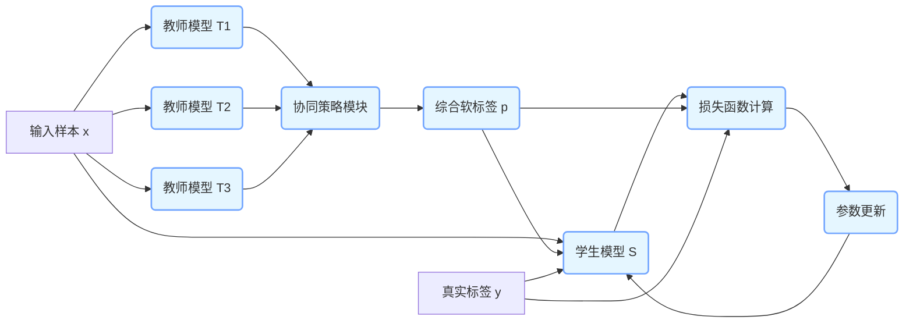

# 知识蒸馏在多教师模型中的协同策略

> 关键词：知识蒸馏、多教师模型、协同策略、模型压缩、知识迁移

> 摘要：本文深入探讨了知识蒸馏在多教师模型中的协同策略。首先介绍了知识蒸馏和多教师模型的背景知识，明确了研究目的和范围。接着详细阐述了核心概念及它们之间的联系，给出了相应的原理和架构示意图与流程图。然后对核心算法原理进行了讲解，并结合Python代码给出具体操作步骤。通过数学模型和公式对相关原理进行了进一步分析，并举例说明。在项目实战部分，给出了开发环境搭建、源代码实现和代码解读。探讨了该技术的实际应用场景，推荐了学习资源、开发工具框架和相关论文著作。最后总结了未来发展趋势与挑战，还提供了常见问题解答和扩展阅读参考资料，旨在为研究和应用知识蒸馏在多教师模型协同策略的人员提供全面而深入的指导。

## 1. 背景介绍 
### 1.1 目的和范围
知识蒸馏作为一种有效的模型压缩和知识迁移技术，近年来在深度学习领域得到了广泛关注。传统的知识蒸馏通常使用单个教师模型来指导学生模型的学习，但在实际应用中，多个不同的教师模型可能拥有更丰富和多样化的知识。因此，研究知识蒸馏在多教师模型中的协同策略具有重要意义。本文的目的是系统地探讨如何让多个教师模型协同工作，将它们的知识有效地传递给学生模型，提高学生模型的性能和泛化能力。研究范围涵盖了多教师模型协同策略的核心概念、算法原理、数学模型、实际应用场景以及相关的工具和资源。

### 1.2 预期读者
本文预期读者包括深度学习领域的研究人员、人工智能工程师、对模型压缩和知识迁移技术感兴趣的学生以及从事相关项目开发的专业人士。对于希望深入了解知识蒸馏在多教师模型中应用的读者，本文将提供全面而深入的技术指导和理论支持。

### 1.3 文档结构概述
本文将按照以下结构进行组织：首先介绍核心概念与联系，包括知识蒸馏和多教师模型的基本原理以及它们之间的关系；接着详细讲解核心算法原理和具体操作步骤，并给出Python代码示例；然后通过数学模型和公式对相关原理进行进一步分析，并举例说明；在项目实战部分，将介绍开发环境搭建、源代码实现和代码解读；之后探讨该技术的实际应用场景；推荐学习资源、开发工具框架和相关论文著作；最后总结未来发展趋势与挑战，提供常见问题解答和扩展阅读参考资料。

### 1.4 术语表
#### 1.4.1 核心术语定义
- **知识蒸馏（Knowledge Distillation）**：一种将教师模型的知识迁移到学生模型的技术，通过让学生模型学习教师模型的输出（如软标签）来提高自身性能。
- **多教师模型（Multi - Teacher Model）**：由多个不同的教师模型组成的集合，这些教师模型可以具有不同的架构、训练数据或训练方法。
- **协同策略（Collaborative Strategy）**：指多个教师模型在知识蒸馏过程中如何相互协作，以更好地将知识传递给学生模型的策略。
- **学生模型（Student Model）**：接收教师模型知识的模型，通常具有较小的规模和较低的计算复杂度。
- **软标签（Soft Labels）**：教师模型输出的概率分布，相比于硬标签（如分类任务中的one - hot编码），软标签包含了更多的信息。

#### 1.4.2 相关概念解释
- **模型压缩（Model Compression）**：通过减少模型的参数数量、计算复杂度等方式，在不显著降低模型性能的前提下，使模型更适合在资源受限的设备上运行。知识蒸馏是一种常用的模型压缩方法。
- **知识迁移（Knowledge Transfer）**：将在一个任务或数据集上学到的知识应用到另一个任务或数据集上的过程。知识蒸馏可以看作是一种知识迁移的方式，将教师模型在训练过程中学习到的知识迁移到学生模型中。

#### 1.4.3 缩略词列表
- **KD**：Knowledge Distillation（知识蒸馏）
- **MT - KD**：Multi - Teacher Knowledge Distillation（多教师知识蒸馏）

## 2. 核心概念与联系 

### 2.1 知识蒸馏基本原理
知识蒸馏的基本思想是让学生模型学习教师模型的输出，而不仅仅是训练数据的真实标签。在传统的知识蒸馏中，教师模型通常是一个大型、复杂且性能良好的模型，学生模型则是一个相对较小、简单的模型。教师模型的输出（软标签）包含了更多的信息，例如不同类别之间的相对置信度，学生模型可以通过学习这些软标签来提高自己的性能。

假设我们有一个分类任务，训练数据为 $\{(x_i, y_i)\}_{i = 1}^{N}$，其中 $x_i$ 是输入样本，$y_i$ 是真实标签。教师模型 $T$ 对输入 $x_i$ 的输出为 $p_T(x_i)$，这是一个概率分布，即软标签。学生模型 $S$ 对输入 $x_i$ 的输出为 $p_S(x_i)$。知识蒸馏的损失函数通常由两部分组成：

- 蒸馏损失（Distillation Loss）：衡量学生模型输出 $p_S(x_i)$ 与教师模型输出 $p_T(x_i)$ 之间的差异，常用的度量方法是 KL 散度（Kullback - Leibler Divergence）：
  $$L_{distill} = \text{KL}(p_T(x_i) || p_S(x_i)) = \sum_{j} p_T(x_i)_j \log \frac{p_T(x_i)_j}{p_S(x_i)_j}$$
- 真实标签损失（True Label Loss）：衡量学生模型输出 $p_S(x_i)$ 与真实标签 $y_i$ 之间的差异，常用的是交叉熵损失（Cross - Entropy Loss）：
  $$L_{true} = H(y_i, p_S(x_i)) = -\sum_{j} y_{i_j} \log p_S(x_i)_j$$

总的损失函数为：
$$L = \alpha L_{distill} + (1 - \alpha) L_{true}$$
其中 $\alpha$ 是一个超参数，用于平衡蒸馏损失和真实标签损失的权重。

### 2.2 多教师模型的概念
多教师模型是指由多个不同的教师模型组成的集合。这些教师模型可以在不同的数据集上训练，或者具有不同的架构和训练方法。每个教师模型都可以学习到不同方面的知识，通过将多个教师模型的知识整合起来，可以为学生模型提供更丰富和多样化的信息。

例如，在图像分类任务中，一个教师模型可能更擅长识别物体的形状，另一个教师模型可能更擅长识别物体的颜色。通过使用多教师模型，学生模型可以同时学习到这两方面的知识，从而提高分类性能。

### 2.3 多教师模型的协同策略原理
多教师模型的协同策略旨在解决如何让多个教师模型有效地协同工作，将它们的知识传递给学生模型的问题。常见的协同策略包括：

- **平均策略（Average Strategy）**：将多个教师模型的输出进行平均，得到一个综合的软标签，然后让学生模型学习这个综合软标签。假设我们有 $M$ 个教师模型 $T_1, T_2, \cdots, T_M$，它们对输入 $x_i$ 的输出分别为 $p_{T_1}(x_i), p_{T_2}(x_i), \cdots, p_{T_M}(x_i)$，则综合软标签为：
  $$p_{avg}(x_i) = \frac{1}{M} \sum_{m = 1}^{M} p_{T_m}(x_i)$$
  学生模型的蒸馏损失为：
  $$L_{distill} = \text{KL}(p_{avg}(x_i) || p_S(x_i))$$

- **加权平均策略（Weighted Average Strategy）**：为每个教师模型分配一个权重，根据权重对教师模型的输出进行加权平均，得到综合软标签。权重可以根据教师模型的性能、可靠性等因素进行设置。设教师模型 $T_m$ 的权重为 $w_m$，且 $\sum_{m = 1}^{M} w_m = 1$，则综合软标签为：
  $$p_{weighted}(x_i) = \sum_{m = 1}^{M} w_m p_{T_m}(x_i)$$
  学生模型的蒸馏损失为：
  $$L_{distill} = \text{KL}(p_{weighted}(x_i) || p_S(x_i))$$

- **动态融合策略（Dynamic Fusion Strategy）**：根据输入样本的不同，动态地调整每个教师模型的权重。例如，可以使用一个元模型（Meta - Model）来根据输入样本计算每个教师模型的权重，从而实现更灵活的知识融合。

### 2.4 核心概念架构示意图


该示意图展示了知识蒸馏在多教师模型中的整体架构。输入样本 $x$ 同时输入到多个教师模型中，教师模型的输出经过协同策略模块处理后得到综合软标签 $p$。学生模型接收输入样本 $x$、综合软标签 $p$ 和真实标签 $y$，通过损失函数计算得到损失值，然后进行参数更新。

## 3. 核心算法原理 & 具体操作步骤 

### 3.1 核心算法原理
知识蒸馏在多教师模型中的核心算法是通过协同策略将多个教师模型的知识传递给学生模型。具体来说，算法的主要步骤包括：

1. **初始化**：初始化多个教师模型 $T_1, T_2, \cdots, T_M$ 和学生模型 $S$ 的参数。
2. **前向传播**：对于每个输入样本 $x_i$，分别计算每个教师模型的输出 $p_{T_1}(x_i), p_{T_2}(x_i), \cdots, p_{T_M}(x_i)$。
3. **协同策略处理**：根据选定的协同策略（如平均策略、加权平均策略等），对教师模型的输出进行处理，得到综合软标签 $p(x_i)$。
4. **学生模型前向传播**：计算学生模型对输入样本 $x_i$ 的输出 $p_S(x_i)$。
5. **损失函数计算**：计算蒸馏损失 $L_{distill}$ 和真实标签损失 $L_{true}$，并根据权重 $\alpha$ 计算总的损失函数 $L$。
6. **反向传播和参数更新**：根据总的损失函数 $L$ 对学生模型的参数进行反向传播和更新。

### 3.2 具体操作步骤及Python代码实现

```python
import torch
import torch.nn as nn
import torch.optim as optim

# 定义教师模型和学生模型
class TeacherModel(nn.Module):
    def __init__(self, input_size, hidden_size, output_size):
        super(TeacherModel, self).__init__()
        self.fc1 = nn.Linear(input_size, hidden_size)
        self.relu = nn.ReLU()
        self.fc2 = nn.Linear(hidden_size, output_size)

    def forward(self, x):
        out = self.fc1(x)
        out = self.relu(out)
        out = self.fc2(out)
        return out

class StudentModel(nn.Module):
    def __init__(self, input_size, hidden_size, output_size):
        super(StudentModel, self).__init__()
        self.fc1 = nn.Linear(input_size, hidden_size)
        self.relu = nn.ReLU()
        self.fc2 = nn.Linear(hidden_size, output_size)

    def forward(self, x):
        out = self.fc1(x)
        out = self.relu(out)
        out = self.fc2(out)
        return out

# 初始化模型
input_size = 10
hidden_size = 20
output_size = 5
num_teachers = 3

teachers = [TeacherModel(input_size, hidden_size, output_size) for _ in range(num_teachers)]
student = StudentModel(input_size, hidden_size, output_size)

# 定义损失函数和优化器
criterion_distill = nn.KLDivLoss(reduction='batchmean')
criterion_true = nn.CrossEntropyLoss()
optimizer = optim.Adam(student.parameters(), lr=0.001)

# 超参数
alpha = 0.5

# 模拟训练数据
num_samples = 100
train_data = torch.randn(num_samples, input_size)
train_labels = torch.randint(0, output_size, (num_samples,))

# 训练循环
num_epochs = 10
for epoch in range(num_epochs):
    for i in range(num_samples):
        x = train_data[i].unsqueeze(0)
        y = train_labels[i].unsqueeze(0)

        # 教师模型前向传播
        teacher_outputs = [teacher(x) for teacher in teachers]
        teacher_probs = [torch.softmax(output, dim=1) for output in teacher_outputs]

        # 平均策略计算综合软标签
        avg_teacher_probs = torch.mean(torch.stack(teacher_probs), dim=0)

        # 学生模型前向传播
        student_output = student(x)
        student_probs = torch.softmax(student_output, dim=1)

        # 计算损失函数
        distill_loss = criterion_distill(torch.log(student_probs), avg_teacher_probs)
        true_loss = criterion_true(student_output, y)
        total_loss = alpha * distill_loss + (1 - alpha) * true_loss

        # 反向传播和参数更新
        optimizer.zero_grad()
        total_loss.backward()
        optimizer.step()

    print(f'Epoch {epoch + 1}/{num_epochs}, Loss: {total_loss.item()}')

```

### 3.3 代码解释
1. **模型定义**：定义了教师模型 `TeacherModel` 和学生模型 `StudentModel`，它们都是简单的两层全连接神经网络。
2. **初始化模型**：初始化了多个教师模型和一个学生模型。
3. **损失函数和优化器**：使用 KL 散度损失作为蒸馏损失，交叉熵损失作为真实标签损失，使用 Adam 优化器对学生模型的参数进行更新。
4. **训练循环**：在每个训练周期中，对于每个输入样本，首先计算每个教师模型的输出，然后使用平均策略计算综合软标签。接着计算学生模型的输出，计算蒸馏损失和真实标签损失，最后根据总的损失函数进行反向传播和参数更新。

## 4. 数学模型和公式 & 详细讲解 & 举例说明 

### 4.1 蒸馏损失的数学模型
蒸馏损失通常使用 KL 散度来衡量学生模型输出与教师模型输出之间的差异。KL 散度的定义为：

$$\text{KL}(p || q) = \sum_{j} p_j \log \frac{p_j}{q_j}$$

其中 $p$ 是教师模型的输出概率分布（软标签），$q$ 是学生模型的输出概率分布。KL 散度衡量了从分布 $q$ 到分布 $p$ 的信息损失。

例如，假设教师模型的输出为 $p = [0.1, 0.2, 0.3, 0.4]$，学生模型的输出为 $q = [0.2, 0.2, 0.2, 0.4]$，则 KL 散度为：

$$\text{KL}(p || q) = 0.1 \log \frac{0.1}{0.2} + 0.2 \log \frac{0.2}{0.2} + 0.3 \log \frac{0.3}{0.2} + 0.4 \log \frac{0.4}{0.4}$$
$$= 0.1 \log 0.5 + 0 + 0.3 \log 1.5 + 0 \approx -0.1 \times 0.693 + 0 + 0.3 \times 0.405 + 0 \approx 0.052$$

### 4.2 真实标签损失的数学模型
真实标签损失通常使用交叉熵损失来衡量学生模型输出与真实标签之间的差异。交叉熵损失的定义为：

$$H(y, p) = -\sum_{j} y_j \log p_j$$

其中 $y$ 是真实标签的 one - hot 编码，$p$ 是学生模型的输出概率分布。

例如，假设真实标签为 $y = [0, 0, 1, 0]$，学生模型的输出为 $p = [0.2, 0.2, 0.5, 0.1]$，则交叉熵损失为：

$$H(y, p) = - (0 \log 0.2 + 0 \log 0.2 + 1 \log 0.5 + 0 \log 0.1) \approx -(-0.693) = 0.693$$

### 4.3 总的损失函数
总的损失函数是蒸馏损失和真实标签损失的加权和：

$$L = \alpha L_{distill} + (1 - \alpha) L_{true}$$

其中 $\alpha$ 是一个超参数，用于平衡蒸馏损失和真实标签损失的权重。当 $\alpha = 1$ 时，只考虑蒸馏损失；当 $\alpha = 0$ 时，只考虑真实标签损失。

例如，假设蒸馏损失 $L_{distill} = 0.052$，真实标签损失 $L_{true} = 0.693$，$\alpha = 0.5$，则总的损失函数为：

$$L = 0.5 \times 0.052 + (1 - 0.5) \times 0.693 = 0.026 + 0.3465 = 0.3725$$

### 4.4 加权平均策略的数学模型
在加权平均策略中，综合软标签是多个教师模型输出的加权和：

$$p_{weighted}(x) = \sum_{m = 1}^{M} w_m p_{T_m}(x)$$

其中 $w_m$ 是教师模型 $T_m$ 的权重，且 $\sum_{m = 1}^{M} w_m = 1$。

例如，假设有两个教师模型，它们的输出分别为 $p_{T_1}(x) = [0.1, 0.2, 0.3, 0.4]$ 和 $p_{T_2}(x) = [0.2, 0.3, 0.2, 0.3]$，权重分别为 $w_1 = 0.6$ 和 $w_2 = 0.4$，则综合软标签为：

$$p_{weighted}(x) = 0.6 \times [0.1, 0.2, 0.3, 0.4] + 0.4 \times [0.2, 0.3, 0.2, 0.3]$$
$$= [0.6 \times 0.1 + 0.4 \times 0.2, 0.6 \times 0.2 + 0.4 \times 0.3, 0.6 \times 0.3 + 0.4 \times 0.2, 0.6 \times 0.4 + 0.4 \times 0.3]$$
$$= [0.14, 0.24, 0.26, 0.36]$$

## 5. 项目实战：代码实际案例和详细解释说明 

### 5.1  开发环境搭建
#### 5.1.1 安装Python
首先需要安装 Python，建议使用 Python 3.7 及以上版本。可以从 Python 官方网站（https://www.python.org/downloads/）下载并安装。

#### 5.1.2 安装深度学习框架
本项目使用 PyTorch 作为深度学习框架，可以根据自己的操作系统和 CUDA 版本选择合适的安装方式。在命令行中运行以下命令安装 PyTorch：

```sh
pip install torch torchvision
```

#### 5.1.3 安装其他依赖库
可能还需要安装一些其他的依赖库，如 `numpy`、`matplotlib` 等，可以使用以下命令进行安装：

```sh
pip install numpy matplotlib
```

### 5.2  源代码详细实现和代码解读
以下是一个完整的项目实战代码示例，使用了加权平均策略进行多教师知识蒸馏：

```python
import torch
import torch.nn as nn
import torch.optim as optim
import numpy as np

# 定义教师模型和学生模型
class TeacherModel(nn.Module):
    def __init__(self, input_size, hidden_size, output_size):
        super(TeacherModel, self).__init__()
        self.fc1 = nn.Linear(input_size, hidden_size)
        self.relu = nn.ReLU()
        self.fc2 = nn.Linear(hidden_size, output_size)

    def forward(self, x):
        out = self.fc1(x)
        out = self.relu(out)
        out = self.fc2(out)
        return out

class StudentModel(nn.Module):
    def __init__(self, input_size, hidden_size, output_size):
        super(StudentModel, self).__init__()
        self.fc1 = nn.Linear(input_size, hidden_size)
        self.relu = nn.ReLU()
        self.fc2 = nn.Linear(hidden_size, output_size)

    def forward(self, x):
        out = self.fc1(x)
        out = self.relu(out)
        out = self.fc2(out)
        return out

# 初始化模型
input_size = 10
hidden_size = 20
output_size = 5
num_teachers = 3

teachers = [TeacherModel(input_size, hidden_size, output_size) for _ in range(num_teachers)]
student = StudentModel(input_size, hidden_size, output_size)

# 定义损失函数和优化器
criterion_distill = nn.KLDivLoss(reduction='batchmean')
criterion_true = nn.CrossEntropyLoss()
optimizer = optim.Adam(student.parameters(), lr=0.001)

# 超参数
alpha = 0.5
teacher_weights = np.array([0.3, 0.3, 0.4])  # 教师模型权重

# 模拟训练数据
num_samples = 100
train_data = torch.randn(num_samples, input_size)
train_labels = torch.randint(0, output_size, (num_samples,))

# 训练循环
num_epochs = 10
for epoch in range(num_epochs):
    for i in range(num_samples):
        x = train_data[i].unsqueeze(0)
        y = train_labels[i].unsqueeze(0)

        # 教师模型前向传播
        teacher_outputs = [teacher(x) for teacher in teachers]
        teacher_probs = [torch.softmax(output, dim=1) for output in teacher_outputs]

        # 加权平均策略计算综合软标签
        weighted_teacher_probs = torch.sum(torch.stack([w * p for w, p in zip(teacher_weights, teacher_probs)]), dim=0)

        # 学生模型前向传播
        student_output = student(x)
        student_probs = torch.softmax(student_output, dim=1)

        # 计算损失函数
        distill_loss = criterion_distill(torch.log(student_probs), weighted_teacher_probs)
        true_loss = criterion_true(student_output, y)
        total_loss = alpha * distill_loss + (1 - alpha) * true_loss

        # 反向传播和参数更新
        optimizer.zero_grad()
        total_loss.backward()
        optimizer.step()

    print(f'Epoch {epoch + 1}/{num_epochs}, Loss: {total_loss.item()}')

```

### 5.3  代码解读与分析
#### 5.3.1 模型定义
- `TeacherModel` 和 `StudentModel` 都是简单的两层全连接神经网络，包含一个输入层、一个隐藏层和一个输出层。
#### 5.3.2 初始化模型
- 初始化了多个教师模型和一个学生模型。
#### 5.3.3 损失函数和优化器
- 使用 KL 散度损失作为蒸馏损失，交叉熵损失作为真实标签损失，使用 Adam 优化器对学生模型的参数进行更新。
#### 5.3.4 超参数设置
- `alpha` 用于平衡蒸馏损失和真实标签损失的权重。
- `teacher_weights` 是教师模型的权重，用于加权平均策略。
#### 5.3.5 训练循环
- 在每个训练周期中，对于每个输入样本，首先计算每个教师模型的输出，然后使用加权平均策略计算综合软标签。
- 接着计算学生模型的输出，计算蒸馏损失和真实标签损失，最后根据总的损失函数进行反向传播和参数更新。

## 6. 实际应用场景 
### 6.1 智能边缘设备
在智能边缘设备（如智能手机、智能摄像头、智能手表等）上运行深度学习模型时，由于设备的计算资源和存储容量有限，需要使用模型压缩技术。知识蒸馏在多教师模型中的协同策略可以将多个大型、复杂的教师模型的知识迁移到一个小型、简单的学生模型中，从而使学生模型在边缘设备上能够高效运行，同时保持较高的性能。

例如，在智能摄像头的目标检测任务中，可以使用多个不同架构和训练数据的教师模型进行知识蒸馏，让学生模型学习到更丰富的目标特征，提高目标检测的准确率。

### 6.2 自动驾驶
在自动驾驶领域，深度学习模型需要处理大量的传感器数据，对计算资源的要求非常高。使用多教师知识蒸馏可以将多个专业的教师模型（如用于目标检测、语义分割、行为预测等的模型）的知识整合到一个学生模型中，减少模型的计算复杂度，提高模型的实时性和可靠性。

例如，在自动驾驶汽车的决策系统中，学生模型可以通过学习多个教师模型的知识，更好地应对各种复杂的交通场景，做出更准确的决策。

### 6.3 医疗影像分析
在医疗影像分析中，深度学习模型可以帮助医生进行疾病诊断和治疗方案制定。然而，由于医疗数据的敏感性和隐私性，以及模型的复杂性，模型的训练和部署面临着挑战。知识蒸馏在多教师模型中的协同策略可以让多个基于不同数据集或不同方法训练的教师模型协同工作，将知识传递给学生模型，提高学生模型的性能和泛化能力。

例如，在医学图像分类任务中，多个教师模型可以分别从不同的角度（如纹理、形状、颜色等）对医学图像进行分析，学生模型通过学习这些教师模型的知识，能够更准确地对疾病进行分类。

### 6.4 自然语言处理
在自然语言处理任务中，如文本分类、机器翻译、情感分析等，模型的规模通常较大，训练和推理的时间较长。多教师知识蒸馏可以将多个预训练模型（如 BERT、GPT 等）的知识迁移到一个小型的学生模型中，提高学生模型的性能和效率。

例如，在文本分类任务中，多个不同的预训练模型可以学习到不同的语言特征和语义信息，学生模型通过学习这些教师模型的知识，能够更准确地对文本进行分类。

## 7. 工具和资源推荐
### 7.1 学习资源推荐
#### 7.1.1 书籍推荐
- 《深度学习》（Deep Learning）：由 Ian Goodfellow、Yoshua Bengio 和 Aaron Courville 所著，是深度学习领域的经典教材，涵盖了深度学习的基本原理、算法和应用。
- 《动手学深度学习》（Dive into Deep Learning）：由 Aston Zhang、Zachary C. Lipton、Mu Li 和 Alexander J. Smola 所著，提供了丰富的代码示例和实践项目，适合初学者快速上手深度学习。
- 《神经网络与深度学习》：由邱锡鹏所著，系统地介绍了神经网络和深度学习的基本概念、模型和算法，同时也涉及了一些最新的研究成果。

#### 7.1.2 在线课程
- Coursera 上的“深度学习专项课程”（Deep Learning Specialization）：由 Andrew Ng 教授授课，包括五门课程，全面介绍了深度学习的各个方面，如神经网络基础、卷积神经网络、循环神经网络等。
- edX 上的“使用 PyTorch 进行深度学习”（Introduction to Deep Learning with PyTorch）：介绍了如何使用 PyTorch 构建和训练深度学习模型，适合想要深入学习 PyTorch 的读者。
- 哔哩哔哩（B 站）上有许多关于深度学习和知识蒸馏的教学视频，如李沐老师的“动手学深度学习”系列视频，讲解详细，通俗易懂。

#### 7.1.3 技术博客和网站
- Medium 上有许多关于深度学习和知识蒸馏的技术博客，如 Towards Data Science 等，这些博客经常分享最新的研究成果和实践经验。
- arXiv（https://arxiv.org/）：是一个预印本数据库，包含了大量的学术论文，其中有很多关于知识蒸馏和多教师模型的研究论文。
- GitHub 上有许多与知识蒸馏相关的开源项目，可以通过搜索相关关键词找到这些项目，学习其中的代码和实现方法。

### 7.2 开发工具框架推荐
#### 7.2.1 IDE和编辑器
- PyCharm：是一款专门为 Python 开发设计的集成开发环境（IDE），提供了丰富的代码编辑、调试、代码分析等功能，适合开发深度学习项目。
- Jupyter Notebook：是一个交互式的开发环境，支持 Python、R 等多种编程语言，可以方便地进行代码编写、实验和结果展示，非常适合深度学习的研究和开发。
- Visual Studio Code：是一款轻量级的代码编辑器，支持多种编程语言和插件扩展，可以通过安装相关插件来进行深度学习开发。

#### 7.2.2 调试和性能分析工具
- PyTorch Profiler：是 PyTorch 提供的性能分析工具，可以帮助用户分析模型的运行时间、内存使用情况等，找出性能瓶颈。
- TensorBoard：是 TensorFlow 提供的可视化工具，也可以与 PyTorch 结合使用，用于可视化模型的训练过程、损失函数变化、模型结构等。
- NVIDIA Nsight Systems：是 NVIDIA 提供的性能分析工具，适用于 GPU 加速的深度学习模型，可以帮助用户分析 GPU 的使用情况和性能瓶颈。

#### 7.2.3 相关框架和库
- PyTorch：是一个开源的深度学习框架，提供了丰富的神经网络层、优化器、损失函数等，支持 GPU 加速，易于使用和扩展。
- TensorFlow：是另一个广泛使用的深度学习框架，提供了高级的深度学习 API 和分布式训练功能，适合大规模的深度学习项目。
- Scikit - learn：是一个用于机器学习的 Python 库，提供了各种机器学习算法和工具，如分类、回归、聚类等，可以用于数据预处理和模型评估。

### 7.3 相关论文著作推荐
#### 7.3.1 经典论文
- “Distilling the Knowledge in a Neural Network”：由 Geoffrey Hinton、Oriol Vinyals 和 Jeff Dean 发表，是知识蒸馏领域的开创性论文，首次提出了知识蒸馏的概念和方法。
- “Deep Mutual Learning”：提出了深度互学习的方法，让多个学生模型相互学习，提高模型的性能。
- “Multi - Teacher Knowledge Distillation for Image Classification”：研究了多教师知识蒸馏在图像分类任务中的应用，提出了一些有效的协同策略。

#### 7.3.2 最新研究成果
- 可以通过 arXiv、ACM Digital Library、IEEE Xplore 等学术数据库搜索最新的关于知识蒸馏和多教师模型的研究论文，了解该领域的最新进展。

#### 7.3.3 应用案例分析
- 在一些学术会议（如 CVPR、ICML、NeurIPS 等）的论文中，有许多关于知识蒸馏在不同领域（如图像处理、自然语言处理、医疗等）的应用案例分析，可以从中学习到实际应用中的经验和技巧。

## 8. 总结：未来发展趋势与挑战
### 8.1 未来发展趋势
#### 8.1.1 更复杂的协同策略
未来的研究可能会探索更复杂的多教师模型协同策略，例如根据输入样本的动态特征自适应地调整教师模型的权重，或者让教师模型之间进行更深入的交互和协作，以提高知识传递的效率和质量。

#### 8.1.2 与其他技术的融合
知识蒸馏在多教师模型中的协同策略可能会与其他技术（如元学习、强化学习、联邦学习等）进行融合，以解决更复杂的问题和应用场景。例如，在联邦学习中使用多教师知识蒸馏可以更好地保护数据隐私，同时提高模型的性能。

#### 8.1.3 跨领域应用
随着深度学习在各个领域的广泛应用，知识蒸馏在多教师模型中的协同策略也将在更多的领域得到应用，如金融、教育、农业等。通过将不同领域的知识进行整合和迁移，可以提高模型的泛化能力和适应性。

### 8.2 挑战
#### 8.2.1 教师模型选择和权重分配
如何选择合适的教师模型和确定教师模型的权重是一个挑战。不同的教师模型可能具有不同的性能和特点，如何根据任务需求和数据特点选择最优的教师模型组合，并合理分配权重，需要进一步的研究和探索。

#### 8.2.2 知识冲突和冗余
在多教师模型中，不同的教师模型可能会提供相互冲突或冗余的知识，如何处理这些知识冲突和冗余，避免学生模型学习到错误或重复的信息，是一个需要解决的问题。

#### 8.2.3 计算资源和时间成本
多教师模型的训练和知识蒸馏过程通常需要更多的计算资源和时间，如何优化算法和模型结构，降低计算资源和时间成本，提高训练效率，是一个重要的挑战。

## 9. 附录：常见问题与解答
### 9.1 知识蒸馏在多教师模型中一定能提高学生模型的性能吗？
不一定。虽然多教师模型可以提供更丰富和多样化的知识，但如果教师模型选择不当、协同策略不合理或者知识存在冲突和冗余，可能会导致学生模型的性能下降。因此，需要根据具体的任务和数据特点，选择合适的教师模型和协同策略。

### 9.2 如何选择教师模型的权重？
教师模型的权重可以根据教师模型的性能、可靠性、与任务的相关性等因素进行设置。一种简单的方法是根据教师模型在验证集上的准确率来分配权重，准确率高的教师模型分配更高的权重。另外，也可以使用动态权重分配方法，根据输入样本的不同动态地调整教师模型的权重。

### 9.3 多教师知识蒸馏的计算复杂度高吗？
多教师知识蒸馏的计算复杂度通常比单教师知识蒸馏高，因为需要同时计算多个教师模型的输出。但是，可以通过一些优化方法（如模型剪枝、量化等）来降低计算复杂度。另外，在实际应用中，可以根据具体情况选择合适的教师模型数量和协同策略，以平衡计算复杂度和模型性能。

### 9.4 知识蒸馏在多教师模型中对数据有什么要求？
知识蒸馏在多教师模型中对数据的要求与单教师知识蒸馏类似。教师模型和学生模型通常需要使用相同的训练数据，以确保知识的有效传递。另外，数据的质量和多样性也会影响知识蒸馏的效果，高质量、多样化的数据可以帮助学生模型学习到更丰富和准确的知识。

## 10. 扩展阅读 & 参考资料
### 10.1 扩展阅读
- “Model Compression and Acceleration: A Survey”：对模型压缩和加速技术进行了全面的综述，包括知识蒸馏、模型剪枝、量化等方法。
- “Advances in Knowledge Distillation: A Survey”：对知识蒸馏技术的最新进展进行了综述，涵盖了不同的知识蒸馏方法和应用场景。

### 10.2 参考资料
- Hinton, G., Vinyals, O., & Dean, J. (2015). Distilling the Knowledge in a Neural Network. arXiv preprint arXiv:1503.02531.
- Zhang, Y., & Xiang, T. (2017). Deep Mutual Learning. In Proceedings of the IEEE Conference on Computer Vision and Pattern Recognition (pp. 4320 - 4328).
- Park, T. B., Kim, D., Lu, Y., & Cho, M. (2019). Multi - Teacher Knowledge Distillation for Image Classification. In Proceedings of the IEEE/CVF International Conference on Computer Vision (pp. 10773 - 10782).

作者：AI天才研究院/AI Genius Institute & 禅与计算机程序设计艺术 /Zen And The Art of Computer Programming