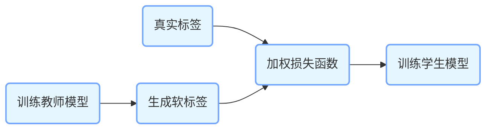

# 知识蒸馏在模型压缩中的最新进展

> 关键词：知识蒸馏、模型压缩、深度学习、最新进展、神经网络

> 摘要：本文聚焦于知识蒸馏在模型压缩领域的最新进展。首先介绍了研究的背景、目的、预期读者等内容。接着阐述了知识蒸馏和模型压缩的核心概念及其联系，并给出了相应的原理示意图和流程图。详细讲解了知识蒸馏的核心算法原理，用 Python 代码进行了示例说明，同时给出了相关的数学模型和公式。通过项目实战，展示了知识蒸馏在模型压缩中的具体实现和代码解读。探讨了其实际应用场景，推荐了学习资源、开发工具框架以及相关论文著作。最后总结了知识蒸馏在模型压缩中的未来发展趋势与挑战，并提供了常见问题的解答和扩展阅读参考资料，旨在为读者全面呈现知识蒸馏在模型压缩方面的最新情况和技术要点。

## 1. 背景介绍 
### 1.1 目的和范围
随着深度学习的快速发展，神经网络模型变得越来越复杂，参数数量急剧增加。虽然这些大型模型在各种任务中取得了优异的性能，但它们在计算资源和存储需求方面也带来了巨大的挑战。例如，在移动设备、嵌入式系统等资源受限的环境中，部署这些大型模型变得十分困难。模型压缩技术应运而生，旨在减少模型的参数数量和计算量，同时尽可能保持模型的性能。

知识蒸馏作为一种有效的模型压缩方法，近年来受到了广泛的关注。本文的目的是全面介绍知识蒸馏在模型压缩中的最新进展，包括核心概念、算法原理、实际应用等方面，为研究者和开发者提供一个系统的参考。范围涵盖了知识蒸馏的基本原理、常见的蒸馏方法、在不同领域的应用案例以及最新的研究成果。

### 1.2 预期读者
本文的预期读者包括对深度学习、模型压缩和知识蒸馏感兴趣的研究者、学生和开发者。对于初学者，本文可以作为一个入门指南，帮助他们了解知识蒸馏的基本概念和方法；对于有一定经验的研究者和开发者，本文可以提供最新的研究进展和技术趋势，为他们的研究和开发工作提供参考。

### 1.3 文档结构概述
本文将按照以下结构进行组织：
1. 背景介绍：介绍研究的目的、范围、预期读者和文档结构概述。
2. 核心概念与联系：阐述知识蒸馏和模型压缩的核心概念，以及它们之间的联系，并给出相应的原理示意图和流程图。
3. 核心算法原理 & 具体操作步骤：详细讲解知识蒸馏的核心算法原理，用 Python 代码进行示例说明。
4. 数学模型和公式 & 详细讲解 & 举例说明：给出知识蒸馏的数学模型和公式，并进行详细讲解和举例说明。
5. 项目实战：代码实际案例和详细解释说明：通过一个具体的项目实战，展示知识蒸馏在模型压缩中的实际应用和代码实现。
6. 实际应用场景：探讨知识蒸馏在不同领域的实际应用场景。
7. 工具和资源推荐：推荐学习知识蒸馏和模型压缩的相关资源，包括书籍、在线课程、技术博客、开发工具框架和相关论文著作。
8. 总结：未来发展趋势与挑战：总结知识蒸馏在模型压缩中的未来发展趋势和面临的挑战。
9. 附录：常见问题与解答：提供常见问题的解答。
10. 扩展阅读 & 参考资料：提供扩展阅读的建议和参考资料。

### 1.4 术语表
#### 1.4.1 核心术语定义
- **知识蒸馏（Knowledge Distillation）**：一种模型压缩技术，通过将一个大型的预训练模型（教师模型）的知识转移到一个小型的模型（学生模型）中，使学生模型能够在保持较高性能的同时减少参数数量和计算量。
- **模型压缩（Model Compression）**：通过各种技术手段减少深度学习模型的参数数量和计算量，以提高模型的效率和可部署性。
- **教师模型（Teacher Model）**：在知识蒸馏中，通常是一个大型的、性能较好的预训练模型，用于提供知识给学生模型。
- **学生模型（Student Model）**：在知识蒸馏中，是一个小型的模型，通过学习教师模型的知识来提高自身的性能。
- **软标签（Soft Labels）**：教师模型输出的概率分布，包含了更多的知识信息，用于指导学生模型的学习。
- **硬标签（Hard Labels）**：真实的类别标签，用于传统的监督学习。

#### 1.4.2 相关概念解释
- **蒸馏损失（Distillation Loss）**：用于衡量学生模型的输出与教师模型的软标签之间的差异，是知识蒸馏中的关键损失函数。
- **分类损失（Classification Loss）**：用于衡量学生模型的输出与真实标签之间的差异，通常采用交叉熵损失函数。
- **温度参数（Temperature）**：在知识蒸馏中，用于控制软标签的平滑程度，温度越高，软标签越平滑。

#### 1.4.3 缩略词列表
- **DNN**：深度神经网络（Deep Neural Network）
- **CNN**：卷积神经网络（Convolutional Neural Network）
- **RNN**：循环神经网络（Recurrent Neural Network）
- **MLP**：多层感知机（Multi-Layer Perceptron）

## 2. 核心概念与联系 
### 知识蒸馏的核心概念
知识蒸馏的核心思想是将教师模型的知识转移到学生模型中。教师模型通常是一个大型的、经过充分训练的模型，具有较高的性能。学生模型则是一个小型的模型，参数数量和计算量较少。通过让学生模型学习教师模型的输出（软标签），可以使学生模型在保持较高性能的同时减少模型的规模。

具体来说，知识蒸馏的过程可以分为以下几个步骤：
1. 训练教师模型：使用大量的数据对教师模型进行训练，使其在目标任务上达到较好的性能。
2. 生成软标签：将训练数据输入到教师模型中，得到教师模型的输出，即软标签。软标签包含了更多的知识信息，例如不同类别之间的相似性。
3. 训练学生模型：在训练学生模型时，同时使用真实标签和教师模型的软标签。通常采用一个加权的损失函数，将分类损失和蒸馏损失结合起来。

### 模型压缩的核心概念
模型压缩的目的是减少深度学习模型的参数数量和计算量，以提高模型的效率和可部署性。常见的模型压缩方法包括剪枝、量化、低秩分解和知识蒸馏等。

- **剪枝（Pruning）**：通过去除模型中不重要的连接或神经元，减少模型的参数数量。
- **量化（Quantization）**：将模型的参数从高精度（如 32 位浮点数）转换为低精度（如 8 位整数），减少模型的存储需求和计算量。
- **低秩分解（Low-Rank Decomposition）**：将模型的权重矩阵分解为低秩矩阵的乘积，减少模型的参数数量。

### 知识蒸馏与模型压缩的联系
知识蒸馏是一种有效的模型压缩方法，它通过将教师模型的知识转移到学生模型中，使学生模型能够在减少参数数量和计算量的同时保持较高的性能。与其他模型压缩方法相比，知识蒸馏具有以下优点：
- **性能提升**：知识蒸馏可以利用教师模型的知识，帮助学生模型学习到更丰富的特征表示，从而提高学生模型的性能。
- **灵活性**：知识蒸馏可以应用于不同类型的模型和任务，具有较强的灵活性。
- **可解释性**：知识蒸馏的过程相对直观，易于理解和解释。

### 核心概念原理和架构的文本示意图
```plaintext
+----------------+         +----------------+
|  教师模型      |         |  学生模型      |
| (大型预训练)   |         | (小型模型)     |
+----------------+         +----------------+
       |                         |
       |  生成软标签             |
       v                         |
+----------------+               |
|  软标签         |               |
+----------------+               |
       |                         |
       |  结合真实标签           |
       v                         v
+----------------+         +----------------+
|  加权损失函数   |         |  训练学生模型 |
+----------------+         +----------------+
```

### Mermaid 流程图


## 3. 核心算法原理 & 具体操作步骤 
### 核心算法原理
知识蒸馏的核心算法原理是通过最小化一个加权的损失函数来训练学生模型，该损失函数由分类损失和蒸馏损失组成。具体来说，设 $x$ 为输入样本，$y$ 为真实标签，$T$ 为温度参数，$p_t(x)$ 为教师模型的输出（软标签），$p_s(x)$ 为学生模型的输出。则知识蒸馏的损失函数可以表示为：

$$
L = \alpha \cdot L_{cls}(p_s(x), y) + (1 - \alpha) \cdot L_{dist}(p_s(x; T), p_t(x; T))
$$

其中，$L_{cls}$ 是分类损失函数，通常采用交叉熵损失函数；$L_{dist}$ 是蒸馏损失函数，也通常采用交叉熵损失函数；$\alpha$ 是一个权重系数，用于平衡分类损失和蒸馏损失。

### 具体操作步骤
1. **训练教师模型**：使用大量的数据对教师模型进行训练，使其在目标任务上达到较好的性能。
2. **生成软标签**：将训练数据输入到教师模型中，得到教师模型的输出（软标签）。
3. **初始化学生模型**：随机初始化学生模型的参数。
4. **训练学生模型**：在训练学生模型时，同时使用真实标签和教师模型的软标签，最小化上述加权损失函数。可以使用随机梯度下降（SGD）、Adam 等优化算法进行训练。
5. **评估学生模型**：使用测试数据对训练好的学生模型进行评估，检查其性能是否满足要求。

### Python 源代码示例
```python
import torch
import torch.nn as nn
import torch.optim as optim

# 定义教师模型
class TeacherModel(nn.Module):
    def __init__(self):
        super(TeacherModel, self).__init__()
        self.fc1 = nn.Linear(10, 20)
        self.fc2 = nn.Linear(20, 5)

    def forward(self, x):
        x = torch.relu(self.fc1(x))
        x = self.fc2(x)
        return x

# 定义学生模型
class StudentModel(nn.Module):
    def __init__(self):
        super(StudentModel, self).__init__()
        self.fc1 = nn.Linear(10, 10)
        self.fc2 = nn.Linear(10, 5)

    def forward(self, x):
        x = torch.relu(self.fc1(x))
        x = self.fc2(x)
        return x

# 初始化模型
teacher_model = TeacherModel()
student_model = StudentModel()

# 定义损失函数和优化器
criterion_cls = nn.CrossEntropyLoss()
criterion_dist = nn.KLDivLoss(reduction='batchmean')
optimizer = optim.Adam(student_model.parameters(), lr=0.001)

# 超参数设置
alpha = 0.3
T = 2.0

# 模拟训练数据
x = torch.randn(32, 10)
y = torch.randint(0, 5, (32,))

# 训练学生模型
for epoch in range(100):
    # 前向传播
    teacher_output = teacher_model(x)
    student_output = student_model(x)

    # 计算分类损失
    loss_cls = criterion_cls(student_output, y)

    # 计算蒸馏损失
    teacher_logits = teacher_output / T
    student_logits = student_output / T
    teacher_probs = torch.softmax(teacher_logits, dim=1)
    student_log_probs = torch.log_softmax(student_logits, dim=1)
    loss_dist = criterion_dist(student_log_probs, teacher_probs) * (T ** 2)

    # 计算总损失
    loss = alpha * loss_cls + (1 - alpha) * loss_dist

    # 反向传播和优化
    optimizer.zero_grad()
    loss.backward()
    optimizer.step()

    if (epoch + 1) % 10 == 0:
        print(f'Epoch {epoch + 1}, Loss: {loss.item()}')
```

### 代码解释
1. **定义教师模型和学生模型**：分别定义了一个简单的全连接神经网络作为教师模型和学生模型。
2. **定义损失函数和优化器**：使用交叉熵损失函数作为分类损失，使用 KL 散度损失函数作为蒸馏损失，使用 Adam 优化器进行参数更新。
3. **设置超参数**：设置了权重系数 $\alpha$ 和温度参数 $T$。
4. **模拟训练数据**：生成了一批随机的训练数据。
5. **训练学生模型**：在每个训练步骤中，计算分类损失和蒸馏损失，然后将它们加权求和得到总损失，最后进行反向传播和参数更新。

## 4. 数学模型和公式 & 详细讲解 & 举例说明 
### 分类损失函数
分类损失函数用于衡量学生模型的输出与真实标签之间的差异，通常采用交叉熵损失函数。交叉熵损失函数的定义如下：

$$
L_{cls}(p_s(x), y) = - \sum_{i=1}^{C} y_i \log(p_{s_i}(x))
$$

其中，$C$ 是类别数，$y_i$ 是真实标签的第 $i$ 个分量，$p_{s_i}(x)$ 是学生模型输出的第 $i$ 个分量的概率。

### 蒸馏损失函数
蒸馏损失函数用于衡量学生模型的输出（经过温度缩放）与教师模型的输出（经过温度缩放）之间的差异，通常采用 KL 散度损失函数。KL 散度损失函数的定义如下：

$$
L_{dist}(p_s(x; T), p_t(x; T)) = \sum_{i=1}^{C} p_{t_i}(x; T) \log\left(\frac{p_{t_i}(x; T)}{p_{s_i}(x; T)}\right)
$$

其中，$p_{t_i}(x; T)$ 和 $p_{s_i}(x; T)$ 分别是教师模型和学生模型经过温度缩放后的输出的第 $i$ 个分量的概率。

### 温度参数的作用
温度参数 $T$ 用于控制软标签的平滑程度。当 $T$ 较大时，软标签更加平滑，不同类别之间的概率差异更小；当 $T$ 较小时，软标签更加尖锐，不同类别之间的概率差异更大。温度参数的作用可以通过以下公式体现：

$$
p_i(x; T) = \frac{\exp(z_i(x) / T)}{\sum_{j=1}^{C} \exp(z_j(x) / T)}
$$

其中，$z_i(x)$ 是模型输出的第 $i$ 个分量的 logits。

### 举例说明
假设我们有一个三分类问题，教师模型的输出 logits 为 $z_t = [3, 1, -1]$，学生模型的输出 logits 为 $z_s = [2, 1, 0]$，真实标签为 $y = [1, 0, 0]$，温度参数 $T = 2$。

1. **计算教师模型的软标签**：
$$
p_{t_1}(x; T) = \frac{\exp(3 / 2)}{\exp(3 / 2) + \exp(1 / 2) + \exp(-1 / 2)} \approx 0.77
$$
$$
p_{t_2}(x; T) = \frac{\exp(1 / 2)}{\exp(3 / 2) + \exp(1 / 2) + \exp(-1 / 2)} \approx 0.17
$$
$$
p_{t_3}(x; T) = \frac{\exp(-1 / 2)}{\exp(3 / 2) + \exp(1 / 2) + \exp(-1 / 2)} \approx 0.06
$$

2. **计算学生模型的软标签**：
$$
p_{s_1}(x; T) = \frac{\exp(2 / 2)}{\exp(2 / 2) + \exp(1 / 2) + \exp(0 / 2)} \approx 0.57
$$
$$
p_{s_2}(x; T) = \frac{\exp(1 / 2)}{\exp(2 / 2) + \exp(1 / 2) + \exp(0 / 2)} \approx 0.27
$$
$$
p_{s_3}(x; T) = \frac{\exp(0 / 2)}{\exp(2 / 2) + \exp(1 / 2) + \exp(0 / 2)} \approx 0.16
$$

3. **计算蒸馏损失**：
$$
L_{dist}(p_s(x; T), p_t(x; T)) = 0.77 \log\left(\frac{0.77}{0.57}\right) + 0.17 \log\left(\frac{0.17}{0.27}\right) + 0.06 \log\left(\frac{0.06}{0.16}\right) \approx 0.18
$$

4. **计算分类损失**：
$$
L_{cls}(p_s(x), y) = - \log(0.57) \approx 0.56
$$

假设 $\alpha = 0.3$，则总损失为：

$$
L = 0.3 \times 0.56 + (1 - 0.3) \times 0.18 \approx 0.29
$$

## 5. 项目实战：代码实际案例和详细解释说明 
### 5.1  开发环境搭建
#### 安装 Python
首先，确保你已经安装了 Python 3.6 或更高版本。可以从 Python 官方网站（https://www.python.org/downloads/）下载并安装 Python。

#### 安装 PyTorch
使用以下命令安装 PyTorch：
```sh
pip install torch torchvision
```

#### 安装其他依赖库
安装其他必要的依赖库，如 `numpy`、`matplotlib` 等：
```sh
pip install numpy matplotlib
```

### 5.2  源代码详细实现和代码解读
以下是一个使用知识蒸馏对 CIFAR-10 数据集进行图像分类的完整代码示例：

```python
import torch
import torch.nn as nn
import torch.optim as optim
import torchvision
import torchvision.transforms as transforms

# 定义教师模型（ResNet18）
import torchvision.models as models
teacher_model = models.resnet18(pretrained=False)
num_ftrs = teacher_model.fc.in_features
teacher_model.fc = nn.Linear(num_ftrs, 10)

# 定义学生模型（简单的卷积神经网络）
class StudentModel(nn.Module):
    def __init__(self):
        super(StudentModel, self).__init__()
        self.conv1 = nn.Conv2d(3, 16, kernel_size=3, padding=1)
        self.relu1 = nn.ReLU()
        self.pool1 = nn.MaxPool2d(2, 2)
        self.conv2 = nn.Conv2d(16, 32, kernel_size=3, padding=1)
        self.relu2 = nn.ReLU()
        self.pool2 = nn.MaxPool2d(2, 2)
        self.fc1 = nn.Linear(32 * 8 * 8, 128)
        self.relu3 = nn.ReLU()
        self.fc2 = nn.Linear(128, 10)

    def forward(self, x):
        x = self.pool1(self.relu1(self.conv1(x)))
        x = self.pool2(self.relu2(self.conv2(x)))
        x = x.view(-1, 32 * 8 * 8)
        x = self.relu3(self.fc1(x))
        x = self.fc2(x)
        return x

# 数据预处理
transform = transforms.Compose(
    [transforms.ToTensor(),
     transforms.Normalize((0.5, 0.5, 0.5), (0.5, 0.5, 0.5))])

# 加载 CIFAR-10 数据集
trainset = torchvision.datasets.CIFAR10(root='./data', train=True,
                                        download=True, transform=transform)
trainloader = torch.utils.data.DataLoader(trainset, batch_size=32,
                                          shuffle=True, num_workers=2)

testset = torchvision.datasets.CIFAR10(root='./data', train=False,
                                       download=True, transform=transform)
testloader = torch.utils.data.DataLoader(testset, batch_size=32,
                                         shuffle=False, num_workers=2)

# 定义损失函数和优化器
criterion_cls = nn.CrossEntropyLoss()
criterion_dist = nn.KLDivLoss(reduction='batchmean')
optimizer = optim.Adam(student_model.parameters(), lr=0.001)

# 超参数设置
alpha = 0.3
T = 2.0

# 训练教师模型（这里省略训练过程，假设教师模型已经训练好）
#...

# 训练学生模型
for epoch in range(20):
    running_loss = 0.0
    for i, data in enumerate(trainloader, 0):
        inputs, labels = data

        # 前向传播
        teacher_output = teacher_model(inputs)
        student_output = student_model(inputs)

        # 计算分类损失
        loss_cls = criterion_cls(student_output, labels)

        # 计算蒸馏损失
        teacher_logits = teacher_output / T
        student_logits = student_output / T
        teacher_probs = torch.softmax(teacher_logits, dim=1)
        student_log_probs = torch.log_softmax(student_logits, dim=1)
        loss_dist = criterion_dist(student_log_probs, teacher_probs) * (T ** 2)

        # 计算总损失
        loss = alpha * loss_cls + (1 - alpha) * loss_dist

        # 反向传播和优化
        optimizer.zero_grad()
        loss.backward()
        optimizer.step()

        running_loss += loss.item()
        if i % 200 == 199:
            print(f'[{epoch + 1}, {i + 1}] loss: {running_loss / 200:.3f}')
            running_loss = 0.0

print('Finished Training')

# 评估学生模型
correct = 0
total = 0
with torch.no_grad():
    for data in testloader:
        images, labels = data
        outputs = student_model(images)
        _, predicted = torch.max(outputs.data, 1)
        total += labels.size(0)
        correct += (predicted == labels).sum().item()

print(f'Accuracy of the network on the 10000 test images: {100 * correct / total}%')
```

### 代码解读
1. **定义教师模型和学生模型**：
    - 教师模型使用预定义的 ResNet18 模型，并修改最后一层的输出维度为 10，以适应 CIFAR-10 数据集的 10 个类别。
    - 学生模型定义了一个简单的卷积神经网络，包含两个卷积层和两个全连接层。

2. **数据预处理和加载**：
    - 使用 `transforms.Compose` 定义了数据预处理的步骤，包括将图像转换为张量和归一化。
    - 使用 `torchvision.datasets.CIFAR10` 加载 CIFAR-10 数据集，并使用 `torch.utils.data.DataLoader` 创建数据加载器。

3. **定义损失函数和优化器**：
    - 使用交叉熵损失函数作为分类损失，使用 KL 散度损失函数作为蒸馏损失。
    - 使用 Adam 优化器对学生模型的参数进行更新。

4. **训练学生模型**：
    - 在每个训练步骤中，计算教师模型和学生模型的输出。
    - 计算分类损失和蒸馏损失，并将它们加权求和得到总损失。
    - 进行反向传播和参数更新。

5. **评估学生模型**：
    - 使用测试数据对训练好的学生模型进行评估，计算其准确率。

### 5.3  代码解读与分析
#### 优点
- **模型压缩效果**：通过知识蒸馏，学生模型可以在减少参数数量和计算量的同时，尽可能保持教师模型的性能。在本示例中，学生模型是一个简单的卷积神经网络，参数数量远小于教师模型（ResNet18），但通过学习教师模型的知识，仍然可以达到较高的准确率。
- **灵活性**：知识蒸馏的方法可以应用于不同类型的模型和任务，只需要定义合适的教师模型和学生模型，以及相应的损失函数和优化器。

#### 缺点
- **教师模型依赖**：知识蒸馏的效果依赖于教师模型的性能。如果教师模型的性能不佳，学生模型也难以达到较好的效果。
- **超参数调整**：知识蒸馏中有一些超参数，如权重系数 $\alpha$ 和温度参数 $T$，需要进行调整以达到最佳效果。超参数的调整可能需要一定的经验和实验。

## 6. 实际应用场景 
### 移动设备和嵌入式系统
在移动设备（如智能手机、平板电脑）和嵌入式系统（如智能手表、智能家居设备）中，计算资源和存储容量通常非常有限。知识蒸馏可以将大型的深度学习模型压缩成小型的模型，使其能够在这些设备上高效运行。例如，在图像识别应用中，可以将一个大型的卷积神经网络模型通过知识蒸馏压缩成一个小型的模型，部署到移动设备上，实现实时的图像识别功能。

### 自动驾驶
自动驾驶系统需要在实时性和准确性之间取得平衡。大型的深度学习模型在准确性方面表现出色，但计算量较大，难以满足实时性要求。知识蒸馏可以将这些大型模型压缩成小型模型，在保证一定准确性的前提下，提高系统的实时性能。例如，在目标检测任务中，将一个复杂的目标检测模型通过知识蒸馏压缩成一个轻量级的模型，用于自动驾驶车辆的实时目标检测。

### 智能安防
智能安防系统需要对大量的视频监控数据进行实时分析和处理。知识蒸馏可以帮助压缩深度学习模型，减少计算资源的消耗，提高系统的处理效率。例如，在人脸识别应用中，将一个大型的人脸识别模型通过知识蒸馏压缩成一个小型的模型，部署到安防监控设备上，实现快速准确的人脸识别功能。

### 医疗影像分析
医疗影像分析领域需要处理大量的医学图像数据，如 X 光、CT、MRI 等。大型的深度学习模型在医疗影像分析中可以取得较好的性能，但对计算资源和存储容量的要求较高。知识蒸馏可以将这些大型模型压缩成小型模型，使其能够在医疗设备上运行，为医生提供更及时的诊断支持。例如，在肺癌检测任务中，将一个复杂的肺癌检测模型通过知识蒸馏压缩成一个轻量级的模型，用于基层医疗单位的肺癌早期筛查。

## 7. 工具和资源推荐
### 7.1 学习资源推荐
#### 7.1.1 书籍推荐
- 《深度学习》（Deep Learning）：由 Ian Goodfellow、Yoshua Bengio 和 Aaron Courville 所著，是深度学习领域的经典教材，涵盖了深度学习的基本概念、算法和应用。
- 《Python 深度学习》（Deep Learning with Python）：由 Francois Chollet 所著，通过大量的代码示例介绍了如何使用 Python 和 Keras 进行深度学习开发。
- 《动手学深度学习》（Dive into Deep Learning）：由 Aston Zhang、Zack C. Lipton、Mu Li 和 Alexander J. Smola 所著，提供了丰富的代码实现和详细的解释，适合初学者学习深度学习。

#### 7.1.2 在线课程
- Coursera 上的《深度学习专项课程》（Deep Learning Specialization）：由 Andrew Ng 教授授课，包括五门课程，全面介绍了深度学习的各个方面。
- edX 上的《使用 PyTorch 进行深度学习》（Introduction to Deep Learning with PyTorch）：介绍了如何使用 PyTorch 进行深度学习开发，包括模型构建、训练和评估等内容。
- 哔哩哔哩（B 站）上有许多关于深度学习和知识蒸馏的教学视频，可以根据自己的需求进行搜索和学习。

#### 7.1.3 技术博客和网站
- Medium：上面有许多深度学习领域的技术博客文章，包括知识蒸馏的最新研究成果和应用案例。
- arXiv：是一个预印本服务器，提供了大量的学术论文，包括知识蒸馏的相关研究。
- GitHub：上面有许多开源的深度学习项目和代码实现，可以学习和参考。

### 7.2 开发工具框架推荐
#### 7.2.1 IDE和编辑器
- PyCharm：是一款专业的 Python 集成开发环境，提供了丰富的代码编辑、调试和分析功能。
- Jupyter Notebook：是一个交互式的开发环境，适合进行数据分析和深度学习实验。
- Visual Studio Code：是一款轻量级的代码编辑器，支持多种编程语言和插件扩展，也可以用于深度学习开发。

#### 7.2.2 调试和性能分析工具
- PyTorch Profiler：是 PyTorch 自带的性能分析工具，可以帮助开发者分析模型的计算时间和内存使用情况。
- TensorBoard：是 TensorFlow 提供的可视化工具，也可以与 PyTorch 结合使用，用于可视化模型的训练过程和性能指标。
- NVIDIA Nsight Systems：是 NVIDIA 提供的性能分析工具，适用于 GPU 加速的深度学习应用。

#### 7.2.3 相关框架和库
- PyTorch：是一个开源的深度学习框架，提供了丰富的神经网络层和优化算法，支持动态图计算，易于使用和调试。
- TensorFlow：是另一个广泛使用的深度学习框架，提供了强大的分布式训练和部署功能。
- Hugging Face Transformers：是一个用于自然语言处理的开源库，提供了许多预训练的模型和工具，方便进行模型压缩和知识蒸馏。

### 7.3 相关论文著作推荐
#### 7.3.1 经典论文
- 《Distilling the Knowledge in a Neural Network》：这是知识蒸馏领域的开山之作，由 Geoffrey Hinton 等人发表，介绍了知识蒸馏的基本思想和方法。
- 《FitNets: Hints for Thin Deep Nets》：提出了一种基于中间层特征的知识蒸馏方法，通过让学生模型学习教师模型的中间层特征来提高性能。
- 《Pay Attention to MLPs》：探索了在多层感知机（MLP）中应用知识蒸馏的方法，为 MLP 在图像分类等任务中的应用提供了新的思路。

#### 7.3.2 最新研究成果
- 可以关注 arXiv 上的最新论文，了解知识蒸馏在模型压缩领域的最新研究进展。例如，一些研究尝试将知识蒸馏与其他模型压缩方法（如剪枝、量化）相结合，以进一步提高压缩效果。
- 国际学术会议（如 NeurIPS、ICML、CVPR 等）上也会有许多关于知识蒸馏的最新研究成果发表，可以关注这些会议的论文集。

#### 7.3.3 应用案例分析
- 许多科技公司（如 Google、Facebook、Microsoft 等）会在自己的技术博客上分享知识蒸馏在实际应用中的案例和经验。可以关注这些公司的技术博客，了解知识蒸馏在不同领域的实际应用情况。
- 一些学术论文也会对知识蒸馏在特定应用场景中的效果进行分析和评估，可以参考这些论文了解知识蒸馏的实际应用效果。

## 8. 总结：未来发展趋势与挑战
### 未来发展趋势
#### 与其他模型压缩方法结合
未来，知识蒸馏可能会与其他模型压缩方法（如剪枝、量化、低秩分解等）更加紧密地结合，以实现更好的压缩效果。例如，可以先对教师模型进行剪枝，然后再使用知识蒸馏将剪枝后的教师模型的知识转移到学生模型中，进一步减少学生模型的参数数量和计算量。

#### 多模态知识蒸馏
随着多模态数据（如图像、文本、音频等）的广泛应用，多模态知识蒸馏将成为一个重要的研究方向。多模态知识蒸馏可以将不同模态的教师模型的知识融合到一个学生模型中，使学生模型能够处理多模态数据，提高模型的泛化能力和性能。

#### 自适应知识蒸馏
自适应知识蒸馏可以根据不同的任务、数据集和模型结构，自动调整知识蒸馏的参数和方法，以达到最佳的压缩效果。未来，自适应知识蒸馏的研究将不断深入，为知识蒸馏的应用提供更加灵活和高效的解决方案。

#### 强化学习与知识蒸馏的结合
强化学习在许多领域（如游戏、机器人控制等）取得了显著的成果。将强化学习与知识蒸馏相结合，可以让学生模型通过与环境的交互学习教师模型的策略，提高学生模型的决策能力和性能。

### 面临的挑战
#### 教师模型的选择和训练
教师模型的性能直接影响知识蒸馏的效果。如何选择合适的教师模型，并对其进行高效的训练，是一个需要解决的问题。此外，对于一些复杂的任务，可能需要多个教师模型进行联合训练，这也增加了教师模型选择和训练的难度。

#### 超参数的调整
知识蒸馏中有一些超参数（如权重系数 $\alpha$、温度参数 $T$ 等）需要进行调整，以达到最佳的压缩效果。超参数的调整通常需要大量的实验和经验，缺乏有效的自动调整方法。如何设计一种高效的超参数调整算法，是知识蒸馏面临的一个挑战。

#### 知识的有效传递
在知识蒸馏过程中，如何确保教师模型的知识能够有效地传递给学生模型，是一个关键问题。特别是对于一些复杂的模型和任务，教师模型的知识可能非常复杂，难以完全传递给学生模型。如何设计更有效的知识传递机制，提高知识蒸馏的效果，是未来需要研究的方向。

#### 模型的可解释性
虽然知识蒸馏可以提高模型的性能和压缩效果，但模型的可解释性仍然是一个问题。特别是在一些对模型可解释性要求较高的领域（如医疗、金融等），如何提高知识蒸馏后模型的可解释性，是一个需要解决的挑战。

## 9. 附录：常见问题与解答
### 1. 知识蒸馏一定能提高学生模型的性能吗？
不一定。知识蒸馏的效果受到多种因素的影响，如教师模型的性能、学生模型的结构、蒸馏损失函数的设计、超参数的选择等。如果教师模型的性能不佳，或者蒸馏过程中参数设置不合理，学生模型的性能可能不会得到提高，甚至可能下降。

### 2. 如何选择合适的温度参数 $T$？
温度参数 $T$ 的选择需要根据具体的任务和数据集进行调整。一般来说，当 $T$ 较大时，软标签更加平滑，不同类别之间的概率差异更小，适合在数据分布较为复杂的情况下使用；当 $T$ 较小时，软标签更加尖锐，不同类别之间的概率差异更大，适合在数据分布较为简单的情况下使用。可以通过实验的方法，尝试不同的 $T$ 值，选择性能最好的 $T$。

### 3. 知识蒸馏和传统的监督学习有什么区别？
传统的监督学习只使用真实标签来训练模型，而知识蒸馏除了使用真实标签外，还使用教师模型的软标签来指导学生模型的学习。软标签包含了更多的知识信息，例如不同类别之间的相似性，通过学习软标签，学生模型可以学习到更丰富的特征表示，从而提高性能。

### 4. 知识蒸馏可以应用于哪些类型的模型？
知识蒸馏可以应用于各种类型的深度学习模型，如卷积神经网络（CNN）、循环神经网络（RNN）、多层感知机（MLP）等。无论是图像分类、目标检测、自然语言处理还是其他任务，都可以使用知识蒸馏进行模型压缩。

### 5. 知识蒸馏和模型剪枝、量化有什么关系？
知识蒸馏、模型剪枝和量化都是模型压缩的方法，它们可以相互结合使用。例如，可以先对模型进行剪枝，减少模型的参数数量，然后再使用知识蒸馏将剪枝后的模型的知识转移到一个更小的模型中，最后对这个小模型进行量化，进一步减少模型的存储需求和计算量。

## 10. 扩展阅读 & 参考资料
### 扩展阅读
- 阅读更多关于深度学习和模型压缩的书籍和论文，深入了解相关的理论和方法。
- 关注深度学习领域的学术会议和研讨会，了解最新的研究动态和发展趋势。
- 参与开源项目，实践知识蒸馏和模型压缩的技术，提高自己的编程能力和实践经验。

### 参考资料
- Hinton, G., Vinyals, O., & Dean, J. (2015). Distilling the Knowledge in a Neural Network. arXiv preprint arXiv:1503.02531.
- Romero, A., Ballas, N., Kahou, S. E., Chassang, A., Gatta, C., & Bengio, Y. (2014). FitNets: Hints for Thin Deep Nets. arXiv preprint arXiv:1412.6550.
- Touvron, H., Cord, M., Douze, M., Massa, F., Sablayrolles, A., & Jegou, H. (2021). Pay Attention to MLPs. arXiv preprint arXiv:2105.08050.

作者：AI天才研究院/AI Genius Institute & 禅与计算机程序设计艺术 /Zen And The Art of Computer Programming