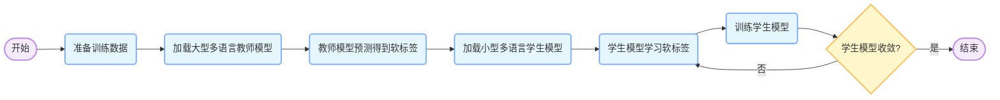

# 知识蒸馏技术在多语言模型压缩中的创新应用

> 关键词：知识蒸馏技术、多语言模型压缩、创新应用、模型性能、计算资源

> 摘要：本文聚焦于知识蒸馏技术在多语言模型压缩中的创新应用。首先介绍了知识蒸馏和多语言模型压缩的背景，阐述了研究目的和范围，明确了预期读者和文档结构。接着深入探讨了知识蒸馏和多语言模型的核心概念及联系，给出了原理和架构的示意图与流程图。详细讲解了核心算法原理和具体操作步骤，并结合 Python 源代码进行说明。同时，运用数学模型和公式对其进行深入分析，辅以举例说明。通过项目实战，展示了开发环境搭建、源代码实现及解读。分析了该技术在多个实际场景中的应用，推荐了相关的学习资源、开发工具框架和论文著作。最后总结了未来发展趋势与挑战，提供了常见问题解答和扩展阅读参考资料，旨在为相关领域的研究和实践提供全面而深入的指导。

## 1. 背景介绍 
### 1.1 目的和范围
随着自然语言处理技术的飞速发展，多语言模型在跨语言交流、国际商务、文化传播等众多领域发挥着越来越重要的作用。然而，这些多语言模型通常具有庞大的参数数量，需要大量的计算资源和存储资源来运行和维护，这在一定程度上限制了它们的广泛应用。知识蒸馏技术作为一种有效的模型压缩方法，能够在不显著损失模型性能的前提下，将大型教师模型的知识迁移到小型学生模型中，从而降低模型的计算复杂度和存储需求。

本文的目的在于深入探讨知识蒸馏技术在多语言模型压缩中的创新应用，详细介绍其原理、算法、实现步骤以及实际应用场景。通过对相关理论和实践的研究，为研究者和开发者提供一个全面而深入的技术指南，帮助他们更好地理解和应用知识蒸馏技术来解决多语言模型压缩的问题。

### 1.2 预期读者
本文的预期读者主要包括自然语言处理领域的研究者、人工智能和机器学习相关专业的学生、从事多语言模型开发和应用的工程师以及对知识蒸馏技术和模型压缩感兴趣的技术爱好者。无论您是初学者还是有一定经验的专业人士，都能从本文中获得有价值的信息和启发。

### 1.3 文档结构概述
本文将按照以下结构进行组织：
- 核心概念与联系：介绍知识蒸馏技术和多语言模型的核心概念，以及它们之间的联系，并通过文本示意图和 Mermaid 流程图进行直观展示。
- 核心算法原理 & 具体操作步骤：详细讲解知识蒸馏的核心算法原理，并给出具体的操作步骤，同时使用 Python 源代码进行示例说明。
- 数学模型和公式 & 详细讲解 & 举例说明：运用数学模型和公式对知识蒸馏技术进行深入分析，并通过具体的例子帮助读者更好地理解。
- 项目实战：通过一个实际的项目案例，展示知识蒸馏技术在多语言模型压缩中的具体应用，包括开发环境搭建、源代码实现和代码解读。
- 实际应用场景：分析知识蒸馏技术在多语言模型压缩中的实际应用场景，如智能翻译设备、多语言聊天机器人等。
- 工具和资源推荐：推荐相关的学习资源、开发工具框架和论文著作，帮助读者进一步深入学习和研究。
- 总结：未来发展趋势与挑战：总结知识蒸馏技术在多语言模型压缩中的应用现状，分析未来的发展趋势和面临的挑战。
- 附录：常见问题与解答：提供常见问题的解答，帮助读者解决在学习和实践过程中遇到的问题。
- 扩展阅读 & 参考资料：提供相关的扩展阅读材料和参考资料，方便读者进一步深入研究。

### 1.4 术语表
#### 1.4.1 核心术语定义
- **知识蒸馏（Knowledge Distillation）**：一种模型压缩技术，通过让小型学生模型学习大型教师模型的输出，将教师模型的知识迁移到学生模型中，从而实现模型的压缩。
- **多语言模型（Multilingual Model）**：能够处理多种语言的自然语言处理模型，通常具有庞大的参数数量和较高的计算复杂度。
- **教师模型（Teacher Model）**：在知识蒸馏中，通常是一个大型的、性能较好的模型，用于向学生模型传授知识。
- **学生模型（Student Model）**：在知识蒸馏中，是一个小型的、需要学习教师模型知识的模型，通过学习教师模型的输出，实现模型的压缩和性能提升。

#### 1.4.2 相关概念解释
- **软标签（Soft Labels）**：教师模型输出的概率分布，包含了比硬标签（类别标签）更多的信息，能够帮助学生模型更好地学习。
- **温度参数（Temperature Parameter）**：在知识蒸馏中，用于控制软标签的平滑程度，温度越高，软标签越平滑。

#### 1.4.3 缩略词列表
- **NLP**：Natural Language Processing，自然语言处理
- **MLM**：Masked Language Model，掩码语言模型
- **BERT**：Bidirectional Encoder Representations from Transformers，基于变换器的双向编码器表示

## 2. 核心概念与联系 

### 知识蒸馏技术原理
知识蒸馏的核心思想是让学生模型学习教师模型的输出，从而将教师模型的知识迁移到学生模型中。具体来说，教师模型通常是一个大型的、性能较好的模型，而学生模型是一个小型的、需要学习的模型。在训练过程中，教师模型会对输入数据进行预测，得到一个概率分布，即软标签。学生模型则需要学习这个软标签，而不是传统的硬标签（类别标签）。通过这种方式，学生模型可以学习到教师模型的泛化能力和知识，从而在不显著损失性能的前提下实现模型的压缩。

### 多语言模型概述
多语言模型是能够处理多种语言的自然语言处理模型。这些模型通常基于大规模的多语言语料库进行训练，能够学习到不同语言之间的共性和差异，从而实现跨语言的自然语言处理任务。常见的多语言模型包括 mBERT（Multilingual BERT）、XLM - RoBERTa 等。这些模型具有庞大的参数数量和较高的计算复杂度，需要大量的计算资源和存储资源来运行和维护。

### 知识蒸馏与多语言模型压缩的联系
知识蒸馏技术可以有效地应用于多语言模型压缩。通过将大型多语言教师模型的知识蒸馏到小型多语言学生模型中，可以在不显著损失模型性能的前提下，降低模型的计算复杂度和存储需求。这样，小型学生模型就可以在资源受限的设备上运行，如移动设备、嵌入式系统等，从而扩大多语言模型的应用范围。

### 文本示意图
```plaintext
+-------------------+           +-------------------+
| 大型多语言教师模型 |  ---->   | 小型多语言学生模型 |
| (Large Multilingual Teacher Model) |           | (Small Multilingual Student Model) |
+-------------------+           +-------------------+
           |                             |
           | 软标签 (Soft Labels)         |
           |                             |
           v                             v
+-------------------+           +-------------------+
| 训练数据 (Training Data) |           | 训练数据 (Training Data) |
+-------------------+           +-------------------+
```

### Mermaid 流程图


## 3. 核心算法原理 & 具体操作步骤 

### 核心算法原理
知识蒸馏的核心算法主要基于损失函数的设计，通常由两部分组成：一是学生模型对真实标签的损失，二是学生模型对教师模型软标签的损失。具体来说，总损失函数可以表示为：

$$L_{total} = \alpha L_{CE}(y, \hat{y}_s) + (1 - \alpha) T^2 L_{KL}(\hat{y}_t^T, \hat{y}_s^T)$$

其中，$L_{CE}(y, \hat{y}_s)$ 是学生模型对真实标签 $y$ 的交叉熵损失，$\hat{y}_s$ 是学生模型的预测输出；$L_{KL}(\hat{y}_t^T, \hat{y}_s^T)$ 是教师模型软标签 $\hat{y}_t^T$ 和学生模型预测输出 $\hat{y}_s^T$ 在温度 $T$ 下的 KL 散度损失；$\alpha$ 是一个超参数，用于平衡两部分损失的权重；$T$ 是温度参数，用于控制软标签的平滑程度。

### 具体操作步骤
1. **数据准备**：收集和整理多语言的训练数据，并进行预处理，如分词、编码等。
2. **模型加载**：加载大型多语言教师模型和小型多语言学生模型。
3. **教师模型预测**：使用教师模型对训练数据进行预测，得到软标签。
4. **损失函数计算**：计算总损失函数 $L_{total}$，包括学生模型对真实标签的损失和对教师模型软标签的损失。
5. **模型训练**：使用优化器（如 Adam）对学生模型进行训练，最小化总损失函数。
6. **模型评估**：在验证集上评估学生模型的性能，根据评估结果调整超参数（如 $\alpha$ 和 $T$）。
7. **模型部署**：将训练好的学生模型部署到实际应用中。

### Python 源代码示例
```python
import torch
import torch.nn as nn
import torch.optim as optim

# 定义学生模型和教师模型
class StudentModel(nn.Module):
    def __init__(self, input_size, hidden_size, output_size):
        super(StudentModel, self).__init__()
        self.fc1 = nn.Linear(input_size, hidden_size)
        self.relu = nn.ReLU()
        self.fc2 = nn.Linear(hidden_size, output_size)

    def forward(self, x):
        out = self.fc1(x)
        out = self.relu(out)
        out = self.fc2(out)
        return out

class TeacherModel(nn.Module):
    def __init__(self, input_size, hidden_size, output_size):
        super(TeacherModel, self).__init__()
        self.fc1 = nn.Linear(input_size, hidden_size * 2)
        self.relu = nn.ReLU()
        self.fc2 = nn.Linear(hidden_size * 2, output_size)

    def forward(self, x):
        out = self.fc1(x)
        out = self.relu(out)
        out = self.fc2(out)
        return out

# 初始化模型
input_size = 10
hidden_size = 20
output_size = 5
student_model = StudentModel(input_size, hidden_size, output_size)
teacher_model = TeacherModel(input_size, hidden_size, output_size)

# 定义损失函数和优化器
criterion_ce = nn.CrossEntropyLoss()
criterion_kl = nn.KLDivLoss(reduction='batchmean')
optimizer = optim.Adam(student_model.parameters(), lr=0.001)

# 超参数设置
alpha = 0.3
T = 2.0

# 模拟训练数据
num_samples = 100
x = torch.randn(num_samples, input_size)
y = torch.randint(0, output_size, (num_samples,))

# 训练过程
num_epochs = 10
for epoch in range(num_epochs):
    # 教师模型预测得到软标签
    with torch.no_grad():
        teacher_output = teacher_model(x)
        teacher_soft_labels = nn.functional.softmax(teacher_output / T, dim=1)

    # 学生模型预测
    student_output = student_model(x)
    student_soft_output = nn.functional.log_softmax(student_output / T, dim=1)

    # 计算损失
    loss_ce = criterion_ce(student_output, y)
    loss_kl = criterion_kl(student_soft_output, teacher_soft_labels)
    loss_total = alpha * loss_ce + (1 - alpha) * T ** 2 * loss_kl

    # 反向传播和优化
    optimizer.zero_grad()
    loss_total.backward()
    optimizer.step()

    print(f'Epoch {epoch + 1}/{num_epochs}, Loss: {loss_total.item():.4f}')
```

## 4. 数学模型和公式 & 详细讲解 & 举例说明 

### 交叉熵损失函数
交叉熵损失函数 $L_{CE}(y, \hat{y}_s)$ 用于衡量学生模型的预测输出 $\hat{y}_s$ 与真实标签 $y$ 之间的差异。其数学公式为：

$$L_{CE}(y, \hat{y}_s) = -\sum_{i=1}^{C} y_i \log(\hat{y}_{s_i})$$

其中，$C$ 是类别数，$y_i$ 是真实标签的第 $i$ 个分量（通常为 0 或 1），$\hat{y}_{s_i}$ 是学生模型预测输出的第 $i$ 个分量。

### KL 散度损失函数
KL 散度损失函数 $L_{KL}(\hat{y}_t^T, \hat{y}_s^T)$ 用于衡量教师模型软标签 $\hat{y}_t^T$ 和学生模型预测输出 $\hat{y}_s^T$ 在温度 $T$ 下的差异。其数学公式为：

$$L_{KL}(\hat{y}_t^T, \hat{y}_s^T) = \sum_{i=1}^{C} \hat{y}_{t_i}^T \log\left(\frac{\hat{y}_{t_i}^T}{\hat{y}_{s_i}^T}\right)$$

其中，$\hat{y}_{t_i}^T$ 和 $\hat{y}_{s_i}^T$ 分别是教师模型软标签和学生模型预测输出在温度 $T$ 下的第 $i$ 个分量。

### 总损失函数
总损失函数 $L_{total}$ 由交叉熵损失和 KL 散度损失加权求和得到，其数学公式为：

$$L_{total} = \alpha L_{CE}(y, \hat{y}_s) + (1 - \alpha) T^2 L_{KL}(\hat{y}_t^T, \hat{y}_s^T)$$

### 详细讲解
- **交叉熵损失**：交叉熵损失主要用于让学生模型学习真实标签，保证模型的基本分类能力。
- **KL 散度损失**：KL 散度损失用于让学生模型学习教师模型的软标签，从而学习到教师模型的泛化能力和知识。
- **温度参数 $T$**：温度参数 $T$ 用于控制软标签的平滑程度。当 $T$ 较大时，软标签更加平滑，能够提供更多的信息；当 $T$ 较小时，软标签更加接近硬标签。
- **超参数 $\alpha$**：超参数 $\alpha$ 用于平衡交叉熵损失和 KL 散度损失的权重。当 $\alpha$ 较大时，学生模型更注重学习真实标签；当 $\alpha$ 较小时，学生模型更注重学习教师模型的软标签。

### 举例说明
假设我们有一个三分类问题，真实标签 $y = [1, 0, 0]$，教师模型的输出为 $o_t = [3, 1, 0.5]$，学生模型的输出为 $o_s = [2, 1, 0.5]$。温度参数 $T = 2$，超参数 $\alpha = 0.3$。

1. **计算教师模型软标签**：
   首先，计算教师模型输出的 softmax 值：
   $$\hat{y}_t^T = \text{softmax}\left(\frac{o_t}{T}\right) = \text{softmax}\left(\begin{bmatrix}1.5\\0.5\\0.25\end{bmatrix}\right) = \begin{bmatrix}0.731\\0.214\\0.055\end{bmatrix}$$

2. **计算学生模型预测输出的 softmax 值**：
   $$\hat{y}_s^T = \text{softmax}\left(\frac{o_s}{T}\right) = \text{softmax}\left(\begin{bmatrix}1\\0.5\\0.25\end{bmatrix}\right) = \begin{bmatrix}0.619\\0.259\\0.122\end{bmatrix}$$

3. **计算交叉熵损失**：
   $$L_{CE}(y, \hat{y}_s) = -\sum_{i=1}^{3} y_i \log(\hat{y}_{s_i}) = -1 \times \log(0.619) \approx 0.479$$

4. **计算 KL 散度损失**：
   $$L_{KL}(\hat{y}_t^T, \hat{y}_s^T) = \sum_{i=1}^{3} \hat{y}_{t_i}^T \log\left(\frac{\hat{y}_{t_i}^T}{\hat{y}_{s_i}^T}\right) = 0.731 \times \log\left(\frac{0.731}{0.619}\right) + 0.214 \times \log\left(\frac{0.214}{0.259}\right) + 0.055 \times \log\left(\frac{0.055}{0.122}\right) \approx 0.078$$

5. **计算总损失**：
   $$L_{total} = \alpha L_{CE}(y, \hat{y}_s) + (1 - \alpha) T^2 L_{KL}(\hat{y}_t^T, \hat{y}_s^T) = 0.3 \times 0.479 + (1 - 0.3) \times 2^2 \times 0.078 \approx 0.313$$

## 5. 项目实战：代码实际案例和详细解释说明 

### 5.1  开发环境搭建
#### 安装 Python
首先，确保你已经安装了 Python 3.6 或更高版本。你可以从 Python 官方网站（https://www.python.org/downloads/）下载并安装适合你操作系统的 Python 版本。

#### 创建虚拟环境
为了避免不同项目之间的依赖冲突，建议使用虚拟环境。可以使用 `venv` 模块来创建虚拟环境：
```bash
python -m venv knowledge_distillation_env
source knowledge_distillation_env/bin/activate  # 对于 Linux/Mac
knowledge_distillation_env\Scripts\activate  # 对于 Windows
```

#### 安装必要的库
在虚拟环境中，安装必要的深度学习库，如 PyTorch、Transformers 等：
```bash
pip install torch transformers
```

### 5.2  源代码详细实现和代码解读
```python
import torch
import torch.nn as nn
import torch.optim as optim
from transformers import AutoTokenizer, AutoModelForSequenceClassification

# 加载预训练的多语言教师模型和分词器
teacher_model_name = 'bert-base-multilingual-cased'
teacher_tokenizer = AutoTokenizer.from_pretrained(teacher_model_name)
teacher_model = AutoModelForSequenceClassification.from_pretrained(teacher_model_name, num_labels=2)

# 定义小型多语言学生模型
student_model_name = 'distilbert-base-multilingual-cased'
student_tokenizer = AutoTokenizer.from_pretrained(student_model_name)
student_model = AutoModelForSequenceClassification.from_pretrained(student_model_name, num_labels=2)

# 定义损失函数和优化器
criterion_ce = nn.CrossEntropyLoss()
criterion_kl = nn.KLDivLoss(reduction='batchmean')
optimizer = optim.Adam(student_model.parameters(), lr=2e-5)

# 超参数设置
alpha = 0.3
T = 2.0
batch_size = 16
num_epochs = 3

# 模拟训练数据
train_texts = [
    "This is a positive sentence.",
    "This is a negative sentence.",
    "Another positive example.",
    "Another negative example."
]
train_labels = [1, 0, 1, 0]

# 数据处理
train_encodings = student_tokenizer(train_texts, truncation=True, padding=True, return_tensors='pt')
train_labels = torch.tensor(train_labels)

# 训练过程
for epoch in range(num_epochs):
    for i in range(0, len(train_texts), batch_size):
        # 获取当前批次的数据
        batch_input_ids = train_encodings['input_ids'][i:i + batch_size]
        batch_attention_mask = train_encodings['attention_mask'][i:i + batch_size]
        batch_labels = train_labels[i:i + batch_size]

        # 教师模型预测得到软标签
        with torch.no_grad():
            teacher_outputs = teacher_model(batch_input_ids, attention_mask=batch_attention_mask)
            teacher_logits = teacher_outputs.logits
            teacher_soft_labels = nn.functional.softmax(teacher_logits / T, dim=1)

        # 学生模型预测
        student_outputs = student_model(batch_input_ids, attention_mask=batch_attention_mask)
        student_logits = student_outputs.logits
        student_soft_logits = nn.functional.log_softmax(student_logits / T, dim=1)

        # 计算损失
        loss_ce = criterion_ce(student_logits, batch_labels)
        loss_kl = criterion_kl(student_soft_logits, teacher_soft_labels)
        loss_total = alpha * loss_ce + (1 - alpha) * T ** 2 * loss_kl

        # 反向传播和优化
        optimizer.zero_grad()
        loss_total.backward()
        optimizer.step()

    print(f'Epoch {epoch + 1}/{num_epochs}, Loss: {loss_total.item():.4f}')

# 保存训练好的学生模型
student_model.save_pretrained('distilled_multilingual_model')
student_tokenizer.save_pretrained('distilled_multilingual_model')
```

### 5.3  代码解读与分析
1. **模型加载**：使用 `transformers` 库加载预训练的多语言教师模型 `bert-base-multilingual-cased` 和小型多语言学生模型 `distilbert-base-multilingual-cased`，以及对应的分词器。
2. **损失函数和优化器**：定义交叉熵损失函数 `criterion_ce` 和 KL 散度损失函数 `criterion_kl`，并使用 Adam 优化器来更新学生模型的参数。
3. **数据处理**：使用学生模型的分词器对训练文本进行编码，将其转换为模型可以接受的输入格式。
4. **训练过程**：
   - 在每个批次中，首先使用教师模型对输入数据进行预测，得到软标签。
   - 然后使用学生模型对相同的输入数据进行预测，计算学生模型的预测输出。
   - 计算交叉熵损失和 KL 散度损失，并将它们加权求和得到总损失。
   - 使用反向传播算法计算梯度，并使用优化器更新学生模型的参数。
5. **模型保存**：训练完成后，将训练好的学生模型和分词器保存到本地。

通过这种方式，我们可以将大型多语言教师模型的知识蒸馏到小型多语言学生模型中，实现模型的压缩。

## 6. 实际应用场景 
### 智能翻译设备
在智能翻译设备中，由于设备的计算资源和存储资源有限，无法运行大型的多语言模型。知识蒸馏技术可以将大型多语言翻译模型的知识蒸馏到小型模型中，使得小型模型在保证一定翻译质量的前提下，能够在智能翻译设备上快速运行，实现实时翻译功能。

### 多语言聊天机器人
多语言聊天机器人需要处理多种语言的用户输入，并及时给出准确的回复。知识蒸馏技术可以帮助压缩多语言聊天机器人的模型，降低其计算复杂度和响应时间，提高用户体验。同时，小型模型也可以部署在更多的平台上，扩大聊天机器人的应用范围。

### 跨境电商平台
跨境电商平台需要处理来自不同国家和地区的用户查询和商品信息，涉及多种语言。知识蒸馏技术可以用于压缩多语言搜索模型和推荐模型，提高平台的搜索效率和推荐准确性，同时降低服务器的计算成本和存储需求。

### 国际新闻媒体
国际新闻媒体需要对不同语言的新闻进行分类、摘要和翻译。知识蒸馏技术可以将大型多语言新闻处理模型的知识迁移到小型模型中，使得新闻媒体能够在有限的资源下快速处理和发布多语言新闻，提高新闻的传播效率和影响力。

## 7. 工具和资源推荐
### 7.1 学习资源推荐
#### 7.1.1 书籍推荐
- 《深度学习》（Deep Learning）：由 Ian Goodfellow、Yoshua Bengio 和 Aaron Courville 所著，是深度学习领域的经典教材，涵盖了知识蒸馏等模型压缩技术的相关内容。
- 《自然语言处理入门》（Natural Language Processing with Python）：介绍了自然语言处理的基本概念和方法，包括多语言模型的使用和优化。
- 《Transformer 模型实战》（Transformers for Natural Language Processing）：详细介绍了 Transformer 架构及其在自然语言处理中的应用，对理解多语言模型和知识蒸馏技术有很大帮助。

#### 7.1.2 在线课程
- Coursera 上的“深度学习专项课程”（Deep Learning Specialization）：由 Andrew Ng 教授授课，涵盖了深度学习的各个方面，包括模型压缩和知识蒸馏。
- edX 上的“自然语言处理基础”（Foundations of Natural Language Processing）：介绍了自然语言处理的基本理论和方法，适合初学者入门。
- 吴恩达的“机器学习”（Machine Learning）课程：虽然主要是关于机器学习的基础知识，但对于理解模型训练和优化的原理非常有帮助。

#### 7.1.3 技术博客和网站
- Hugging Face Blog（https://huggingface.co/blog）：提供了关于自然语言处理和深度学习的最新技术文章和研究成果，包括知识蒸馏和多语言模型的相关内容。
- Towards Data Science（https://towardsdatascience.com）：是一个数据科学和机器学习领域的博客平台，有很多关于知识蒸馏和模型压缩的优质文章。
- ArXiv（https://arxiv.org）：是一个预印本数据库，包含了大量的学术论文，你可以在上面搜索到关于知识蒸馏和多语言模型的最新研究成果。

### 7.2 开发工具框架推荐
#### 7.2.1 IDE和编辑器
- PyCharm：是一款专业的 Python 集成开发环境，提供了丰富的代码编辑、调试和分析功能，适合开发和调试深度学习模型。
- Visual Studio Code：是一款轻量级的代码编辑器，支持多种编程语言和插件扩展，安装相关的 Python 和深度学习插件后，可以方便地进行模型开发。
- Jupyter Notebook：是一个交互式的开发环境，适合进行数据探索、模型实验和代码演示，在深度学习领域得到了广泛的应用。

#### 7.2.2 调试和性能分析工具
- TensorBoard：是 TensorFlow 提供的可视化工具，可以用于监控模型训练过程中的损失函数、准确率等指标，还可以可视化模型的结构和参数分布。
- PyTorch Profiler：是 PyTorch 提供的性能分析工具，可以帮助你分析模型的计算瓶颈和内存使用情况，优化模型的性能。
- NVIDIA Nsight Systems：是 NVIDIA 提供的性能分析工具，适用于 GPU 加速的深度学习模型，可以帮助你深入分析 GPU 的使用情况和性能瓶颈。

#### 7.2.3 相关框架和库
- PyTorch：是一个开源的深度学习框架，提供了丰富的神经网络层和优化算法，支持动态图计算，非常适合进行模型开发和研究。
- Transformers：是 Hugging Face 开发的一个自然语言处理库，提供了大量的预训练模型和工具，方便用户进行多语言模型的使用和微调。
- Scikit - learn：是一个开源的机器学习库，提供了多种机器学习算法和工具，可用于数据预处理、模型评估等任务。

### 7.3 相关论文著作推荐
#### 7.3.1 经典论文
- “Distilling the Knowledge in a Neural Network”：由 Geoffrey Hinton 等人发表，是知识蒸馏技术的开山之作，介绍了知识蒸馏的基本思想和方法。
- “BERT: Pre - training of Deep Bidirectional Transformers for Language Understanding”：提出了 BERT 模型，是自然语言处理领域的里程碑式论文，为多语言模型的发展奠定了基础。
- “Multilingual BERT: A Step Towards Cross - lingual NLP”：介绍了多语言 BERT 模型的训练方法和应用，展示了多语言模型在跨语言自然语言处理任务中的潜力。

#### 7.3.2 最新研究成果
- 在 ArXiv 上搜索“Knowledge Distillation for Multilingual Models”可以找到关于知识蒸馏技术在多语言模型中的最新研究成果，这些研究可能会提出新的算法和方法，提高模型压缩的效果和性能。
- 关注顶级学术会议如 ACL（Association for Computational Linguistics）、EMNLP（Conference on Empirical Methods in Natural Language Processing）等，这些会议上会发表很多关于自然语言处理和知识蒸馏的最新研究成果。

#### 7.3.3 应用案例分析
- 一些企业和研究机构会在其官方网站或技术博客上分享知识蒸馏技术在多语言模型压缩中的应用案例，如 Google、Microsoft 等。这些案例可以帮助你了解实际应用中的问题和解决方案，以及如何将知识蒸馏技术应用到实际项目中。

## 8. 总结：未来发展趋势与挑战
### 未来发展趋势
#### 更高效的蒸馏算法
未来，研究人员将致力于开发更高效的知识蒸馏算法，进一步提高模型压缩的效果和性能。例如，探索新的损失函数、优化策略和蒸馏策略，以减少学生模型与教师模型之间的性能差距，同时降低计算成本和训练时间。

#### 多模态知识蒸馏
随着多模态数据（如图像、文本、音频等）在自然语言处理中的应用越来越广泛，多模态知识蒸馏将成为一个重要的研究方向。通过将多模态教师模型的知识蒸馏到多模态学生模型中，可以实现更强大的多模态处理能力，应用于智能机器人、自动驾驶等领域。

#### 自适应知识蒸馏
自适应知识蒸馏将根据不同的任务、数据集和硬件环境，自动调整蒸馏参数和策略，以实现最佳的模型压缩效果。这种自适应的方法可以提高知识蒸馏技术的灵活性和实用性，使其能够更好地适应不同的应用场景。

#### 跨领域知识蒸馏
跨领域知识蒸馏将不同领域的教师模型的知识迁移到学生模型中，使学生模型能够在多个领域中表现出色。例如，将医疗领域的知识蒸馏到通用的自然语言处理模型中，提高模型在医疗文本处理中的性能。

### 挑战
#### 性能损失问题
尽管知识蒸馏技术可以在一定程度上降低模型的计算复杂度和存储需求，但在某些情况下，学生模型的性能可能会显著低于教师模型。如何在保证模型压缩效果的前提下，尽量减少性能损失，是知识蒸馏技术面临的一个重要挑战。

#### 数据隐私和安全问题
在知识蒸馏过程中，教师模型的知识可能会包含敏感信息，如用户隐私数据、商业机密等。如何在知识蒸馏过程中保护数据的隐私和安全，避免信息泄露，是一个需要解决的问题。

#### 模型可解释性问题
知识蒸馏技术通常会将教师模型的知识以一种黑盒的方式迁移到学生模型中，导致学生模型的可解释性较差。如何提高学生模型的可解释性，使人们能够理解模型的决策过程和依据，是知识蒸馏技术在实际应用中面临的一个挑战。

#### 硬件资源限制
尽管知识蒸馏技术可以压缩模型，但在一些资源受限的设备上，如物联网设备、可穿戴设备等，仍然可能存在硬件资源不足的问题。如何进一步优化模型压缩算法，使其能够在更有限的硬件资源下运行，是一个需要解决的问题。

## 9. 附录：常见问题与解答
### 知识蒸馏技术一定会降低模型的计算复杂度吗？
不一定。虽然知识蒸馏的主要目的是将大型教师模型的知识迁移到小型学生模型中，从而降低模型的计算复杂度，但如果在蒸馏过程中选择的学生模型结构不合理，或者蒸馏参数设置不当，可能会导致学生模型的计算复杂度并没有明显降低，甚至可能会增加。因此，在进行知识蒸馏时，需要合理选择学生模型和蒸馏参数，以确保模型压缩的效果。

### 如何选择合适的温度参数 $T$？
温度参数 $T$ 用于控制软标签的平滑程度。一般来说，当 $T$ 较大时，软标签更加平滑，能够提供更多的信息；当 $T$ 较小时，软标签更加接近硬标签。选择合适的温度参数需要根据具体的任务和数据集进行实验和调整。通常可以从一个较大的值开始，如 $T = 2$ 或 $T = 3$，然后逐步减小 $T$ 的值，观察学生模型的性能变化，选择能够使学生模型性能最优的 $T$ 值。

### 知识蒸馏技术可以应用于所有类型的模型吗？
知识蒸馏技术可以应用于多种类型的模型，包括神经网络模型（如卷积神经网络、循环神经网络、Transformer 模型等）和传统机器学习模型（如决策树、支持向量机等）。但不同类型的模型在知识蒸馏过程中可能需要采用不同的方法和策略。例如，对于神经网络模型，通常可以使用软标签和 KL 散度损失来进行知识蒸馏；而对于传统机器学习模型，可能需要采用其他的方法，如特征提取和模型融合等。

### 学生模型的性能是否一定能达到教师模型的水平？
一般情况下，学生模型的性能很难完全达到教师模型的水平。因为教师模型通常是一个大型的、性能较好的模型，具有更强大的表达能力和泛化能力。知识蒸馏技术的目的是在不显著损失模型性能的前提下，将教师模型的知识迁移到学生模型中，使学生模型能够在资源受限的情况下尽可能接近教师模型的性能。但在实际应用中，学生模型的性能可能会受到多种因素的影响，如学生模型的结构、蒸馏参数的设置、训练数据的质量等。因此，需要根据具体的任务和需求，在模型性能和资源消耗之间进行权衡。

## 10. 扩展阅读 & 参考资料
### 扩展阅读
- “Model Compression and Acceleration for Deep Neural Networks: The Principles, Progress, and Challenges”：这篇综述文章详细介绍了深度学习模型压缩和加速的各种方法和技术，包括知识蒸馏、剪枝、量化等，对理解模型压缩的原理和发展趋势有很大帮助。
- “Cross - lingual Language Model Pretraining”：探讨了跨语言语言模型预训练的方法和技术，对于深入理解多语言模型的训练和应用有一定的参考价值。
- “Adversarial Knowledge Distillation for Text Classification”：介绍了一种基于对抗学习的知识蒸馏方法，可用于文本分类任务，为知识蒸馏技术的创新应用提供了思路。

### 参考资料
- Hinton, G., Vinyals, O., & Dean, J. (2015). Distilling the Knowledge in a Neural Network. arXiv preprint arXiv:1503.02531.
- Devlin, J., Chang, M. W., Lee, K., & Toutanova, K. (2018). BERT: Pre - training of Deep Bidirectional Transformers for Language Understanding. arXiv preprint arXiv:1810.04805.
- Conneau, A., & Lample, G. (2019). Cross - lingual Language Model Pretraining. arXiv preprint arXiv:1901.07291.

作者：AI天才研究院/AI Genius Institute & 禅与计算机程序设计艺术 /Zen And The Art of Computer Programming