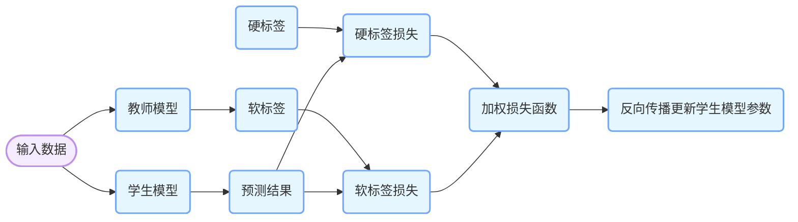

# 知识蒸馏技术在模型压缩与加速中的应用

> 关键词：知识蒸馏技术、模型压缩、模型加速、深度学习、迁移学习

> 摘要：本文深入探讨了知识蒸馏技术在模型压缩与加速中的应用。首先介绍了知识蒸馏的背景，包括其目的、适用读者群体、文档结构和相关术语。接着阐述了知识蒸馏的核心概念、联系以及架构原理，并以示意图和流程图展示。详细讲解了核心算法原理和具体操作步骤，同时给出Python代码示例。还介绍了相关数学模型和公式，并举例说明。通过项目实战展示代码实际案例及详细解释。探讨了知识蒸馏在不同场景下的实际应用，推荐了学习资源、开发工具框架和相关论文著作。最后总结了知识蒸馏的未来发展趋势与挑战，并提供常见问题解答和扩展阅读参考资料。

## 1. 背景介绍 
### 1.1 目的和范围
在深度学习领域，随着模型复杂度的不断增加，模型的参数量和计算量也急剧增长。这导致模型在部署时面临着诸多挑战，如硬件资源需求大、推理速度慢等。知识蒸馏技术作为一种有效的模型压缩与加速方法应运而生。本文的目的是全面介绍知识蒸馏技术在模型压缩与加速中的应用，涵盖其原理、算法、实际应用案例等方面，帮助读者深入理解和掌握这一技术。

### 1.2 预期读者
本文适合对深度学习、模型压缩与加速感兴趣的研究人员、工程师和学生。无论您是刚刚接触深度学习领域，还是已经有一定的实践经验，都可以从本文中获得关于知识蒸馏技术的有价值信息。

### 1.3 文档结构概述
本文将按照以下结构进行组织：首先介绍知识蒸馏的核心概念与联系，包括其原理和架构；接着详细讲解核心算法原理和具体操作步骤，并给出Python代码示例；然后介绍相关的数学模型和公式，并举例说明；通过项目实战展示代码实际案例及详细解释；探讨知识蒸馏在不同场景下的实际应用；推荐学习资源、开发工具框架和相关论文著作；最后总结知识蒸馏的未来发展趋势与挑战，并提供常见问题解答和扩展阅读参考资料。

### 1.4 术语表
#### 1.4.1 核心术语定义
- **知识蒸馏（Knowledge Distillation）**：一种模型压缩与加速技术，通过将一个大型的预训练模型（教师模型）的知识迁移到一个小型的模型（学生模型）中，使得学生模型能够在保持较高性能的同时，减少参数量和计算量。
- **教师模型（Teacher Model）**：一个大型的、性能较好的预训练模型，用于向学生模型传递知识。
- **学生模型（Student Model）**：一个小型的模型，通过学习教师模型的知识来提高自身性能。
- **软标签（Soft Labels）**：教师模型输出的概率分布，包含了更多的类别之间的关系信息，相比于硬标签（只有一个类别为1，其他为0），软标签能够提供更多的知识。

#### 1.4.2 相关概念解释
- **模型压缩（Model Compression）**：通过各种技术手段减少模型的参数量和计算量，使得模型能够在资源受限的环境下运行。
- **模型加速（Model Acceleration）**：提高模型的推理速度，减少推理时间。
- **迁移学习（Transfer Learning）**：将在一个任务上学习到的知识迁移到另一个相关任务上，以提高学习效率和性能。

#### 1.4.3 缩略词列表
- **DNN**：深度神经网络（Deep Neural Network）
- **CNN**：卷积神经网络（Convolutional Neural Network）
- **RNN**：循环神经网络（Recurrent Neural Network）

## 2. 核心概念与联系 
知识蒸馏的核心思想是将教师模型的知识迁移到学生模型中。教师模型通常是一个大型的、性能较好的预训练模型，它已经在大规模数据集上进行了训练，学习到了丰富的知识。学生模型则是一个小型的模型，通过学习教师模型的知识来提高自身性能。

### 核心概念原理
知识蒸馏的原理基于软标签的思想。在传统的分类任务中，我们通常使用硬标签（即只有一个类别为1，其他为0）来训练模型。而在知识蒸馏中，教师模型输出的是一个概率分布（软标签），这个概率分布包含了更多的类别之间的关系信息。学生模型的目标是学习教师模型输出的软标签，而不仅仅是真实的硬标签。

具体来说，知识蒸馏的训练过程可以分为两个阶段：
1. **教师模型训练**：使用大规模数据集对教师模型进行训练，使其学习到丰富的知识。
2. **学生模型训练**：在学生模型训练过程中，同时考虑真实的硬标签和教师模型输出的软标签。通常使用一个加权损失函数来平衡这两个目标：
   - 硬标签损失：衡量学生模型输出与真实硬标签之间的差异，通常使用交叉熵损失函数。
   - 软标签损失：衡量学生模型输出与教师模型输出的软标签之间的差异，也通常使用交叉熵损失函数。

### 架构的文本示意图
```plaintext
输入数据 --> 教师模型 --> 软标签
           |
           v
输入数据 --> 学生模型 --> 预测结果
  |                     |
  v                     v
硬标签损失              软标签损失
  |                     |
  v                     v
  加权损失函数 --> 反向传播更新学生模型参数
```

### Mermaid流程图


## 3. 核心算法原理 & 具体操作步骤 
### 核心算法原理
知识蒸馏的核心算法基于损失函数的设计。如前所述，损失函数通常由两部分组成：硬标签损失和软标签损失。

设 $x$ 为输入数据，$y$ 为真实的硬标签，$T$ 为温度参数（用于控制软标签的平滑程度），$p_t$ 为教师模型输出的软标签，$p_s$ 为学生模型输出的预测结果。

硬标签损失函数 $L_{hard}$ 通常使用交叉熵损失函数：
\[L_{hard}=-\sum_{i}y_i\log(p_{s_i})\]

软标签损失函数 $L_{soft}$ 也使用交叉熵损失函数，但在计算软标签时使用温度参数 $T$ 进行平滑处理：
\[p_{t_i}^{soft}=\frac{\exp(p_{t_i}/T)}{\sum_{j}\exp(p_{t_j}/T)}\]
\[p_{s_i}^{soft}=\frac{\exp(p_{s_i}/T)}{\sum_{j}\exp(p_{s_j}/T)}\]
\[L_{soft}=-\sum_{i}p_{t_i}^{soft}\log(p_{s_i}^{soft})\]

最终的损失函数 $L$ 是硬标签损失和软标签损失的加权和：
\[L = \alpha L_{hard}+(1 - \alpha)L_{soft}\]
其中 $\alpha$ 是一个权重系数，用于平衡硬标签损失和软标签损失。

### 具体操作步骤
1. **教师模型训练**：
   - 准备大规模数据集。
   - 选择合适的模型架构作为教师模型。
   - 使用传统的训练方法（如随机梯度下降）对教师模型进行训练，直到收敛。
2. **学生模型训练**：
   - 选择合适的模型架构作为学生模型，通常学生模型的参数量要比教师模型小。
   - 在训练学生模型时，同时计算硬标签损失和软标签损失。
   - 根据最终的损失函数 $L$ 进行反向传播，更新学生模型的参数。

### Python源代码详细阐述
```python
import torch
import torch.nn as nn
import torch.optim as optim

# 定义教师模型
class TeacherModel(nn.Module):
    def __init__(self, input_size, hidden_size, num_classes):
        super(TeacherModel, self).__init__()
        self.fc1 = nn.Linear(input_size, hidden_size)
        self.relu = nn.ReLU()
        self.fc2 = nn.Linear(hidden_size, num_classes)

    def forward(self, x):
        out = self.fc1(x)
        out = self.relu(out)
        out = self.fc2(out)
        return out

# 定义学生模型
class StudentModel(nn.Module):
    def __init__(self, input_size, num_classes):
        super(StudentModel, self).__init__()
        self.fc = nn.Linear(input_size, num_classes)

    def forward(self, x):
        out = self.fc(x)
        return out

# 定义知识蒸馏损失函数
def knowledge_distillation_loss(student_output, teacher_output, labels, T, alpha):
    hard_loss = nn.CrossEntropyLoss()(student_output, labels)
    soft_loss = nn.KLDivLoss(reduction='batchmean')(
        nn.functional.log_softmax(student_output / T, dim=1),
        nn.functional.softmax(teacher_output / T, dim=1)
    ) * (T * T)
    loss = alpha * hard_loss + (1 - alpha) * soft_loss
    return loss

# 训练学生模型
def train_student_model(teacher_model, student_model, train_loader, optimizer, T, alpha, epochs):
    teacher_model.eval()
    for epoch in range(epochs):
        running_loss = 0.0
        for inputs, labels in train_loader:
            optimizer.zero_grad()
            teacher_output = teacher_model(inputs)
            student_output = student_model(inputs)
            loss = knowledge_distillation_loss(student_output, teacher_output, labels, T, alpha)
            loss.backward()
            optimizer.step()
            running_loss += loss.item()
        print(f'Epoch {epoch + 1}, Loss: {running_loss / len(train_loader)}')

# 示例使用
input_size = 10
hidden_size = 20
num_classes = 5
T = 2.0
alpha = 0.2
epochs = 10

teacher_model = TeacherModel(input_size, hidden_size, num_classes)
student_model = StudentModel(input_size, num_classes)
optimizer = optim.Adam(student_model.parameters(), lr=0.001)

# 假设 train_loader 是一个 DataLoader 对象
# train_loader = DataLoader(...)

train_student_model(teacher_model, student_model, train_loader, optimizer, T, alpha, epochs)
```

## 4. 数学模型和公式 & 详细讲解 & 举例说明 
### 数学模型和公式
如前面所述，知识蒸馏的核心数学模型和公式如下：

#### 硬标签损失函数
\[L_{hard}=-\sum_{i}y_i\log(p_{s_i})\]
其中 $y_i$ 是真实硬标签的第 $i$ 个元素，$p_{s_i}$ 是学生模型输出的预测结果的第 $i$ 个元素。

#### 软标签损失函数
首先计算软标签：
\[p_{t_i}^{soft}=\frac{\exp(p_{t_i}/T)}{\sum_{j}\exp(p_{t_j}/T)}\]
\[p_{s_i}^{soft}=\frac{\exp(p_{s_i}/T)}{\sum_{j}\exp(p_{s_j}/T)}\]
然后计算软标签损失：
\[L_{soft}=-\sum_{i}p_{t_i}^{soft}\log(p_{s_i}^{soft})\]
其中 $T$ 是温度参数，用于控制软标签的平滑程度。

#### 最终损失函数
\[L = \alpha L_{hard}+(1 - \alpha)L_{soft}\]
其中 $\alpha$ 是一个权重系数，用于平衡硬标签损失和软标签损失。

### 详细讲解
- **硬标签损失函数**：硬标签损失函数衡量的是学生模型输出与真实硬标签之间的差异。在传统的分类任务中，我们通常使用硬标签来训练模型，硬标签损失函数能够确保学生模型学习到正确的分类信息。
- **软标签损失函数**：软标签损失函数衡量的是学生模型输出与教师模型输出的软标签之间的差异。软标签包含了更多的类别之间的关系信息，通过学习软标签，学生模型能够学习到教师模型的一些隐含知识，从而提高自身性能。
- **温度参数 $T$**：温度参数 $T$ 用于控制软标签的平滑程度。当 $T$ 较大时，软标签的分布更加平滑，不同类别之间的差异变小；当 $T$ 较小时，软标签的分布更加尖锐，不同类别之间的差异变大。通常，$T$ 的取值在 1 到 10 之间。
- **权重系数 $\alpha$**：权重系数 $\alpha$ 用于平衡硬标签损失和软标签损失。当 $\alpha$ 较大时，硬标签损失在最终损失函数中占比更大，学生模型更注重学习真实的硬标签；当 $\alpha$ 较小时，软标签损失在最终损失函数中占比更大，学生模型更注重学习教师模型的软标签。

### 举例说明
假设我们有一个三分类任务，输入数据为 $x$，真实硬标签为 $y = [1, 0, 0]$，教师模型输出的预测结果为 $p_t = [0.8, 0.1, 0.1]$，学生模型输出的预测结果为 $p_s = [0.7, 0.2, 0.1]$，温度参数 $T = 2.0$，权重系数 $\alpha = 0.2$。

#### 计算硬标签损失
\[L_{hard}=-\sum_{i}y_i\log(p_{s_i})=-(1\times\log(0.7)+0\times\log(0.2)+0\times\log(0.1))\approx0.357\]

#### 计算软标签
\[p_{t_1}^{soft}=\frac{\exp(0.8/2)}{\exp(0.8/2)+\exp(0.1/2)+\exp(0.1/2)}\approx0.632\]
\[p_{t_2}^{soft}=\frac{\exp(0.1/2)}{\exp(0.8/2)+\exp(0.1/2)+\exp(0.1/2)}\approx0.184\]
\[p_{t_3}^{soft}=\frac{\exp(0.1/2)}{\exp(0.8/2)+\exp(0.1/2)+\exp(0.1/2)}\approx0.184\]

\[p_{s_1}^{soft}=\frac{\exp(0.7/2)}{\exp(0.7/2)+\exp(0.2/2)+\exp(0.1/2)}\approx0.577\]
\[p_{s_2}^{soft}=\frac{\exp(0.2/2)}{\exp(0.7/2)+\exp(0.2/2)+\exp(0.1/2)}\approx0.231\]
\[p_{s_3}^{soft}=\frac{\exp(0.1/2)}{\exp(0.7/2)+\exp(0.2/2)+\exp(0.1/2)}\approx0.192\]

#### 计算软标签损失
\[L_{soft}=-\sum_{i}p_{t_i}^{soft}\log(p_{s_i}^{soft})\approx-(0.632\times\log(0.577)+0.184\times\log(0.231)+0.184\times\log(0.192))\approx0.314\]

#### 计算最终损失
\[L = \alpha L_{hard}+(1 - \alpha)L_{soft}=0.2\times0.357+(1 - 0.2)\times0.314\approx0.322\]

## 5. 项目实战：代码实际案例和详细解释说明 
### 5.1  开发环境搭建
为了实现知识蒸馏的项目实战，我们需要搭建以下开发环境：
- **Python**：建议使用 Python 3.6 及以上版本。
- **PyTorch**：深度学习框架，用于构建和训练模型。可以使用以下命令安装：
```sh
pip install torch torchvision
```
- **NumPy**：用于数值计算。可以使用以下命令安装：
```sh
pip install numpy
```
- **Matplotlib**：用于可视化结果。可以使用以下命令安装：
```sh
pip install matplotlib
```

### 5.2  源代码详细实现和代码解读
```python
import torch
import torch.nn as nn
import torch.optim as optim
import torchvision
import torchvision.transforms as transforms
import matplotlib.pyplot as plt

# 定义教师模型
class TeacherModel(nn.Module):
    def __init__(self):
        super(TeacherModel, self).__init__()
        self.conv1 = nn.Conv2d(3, 6, 5)
        self.pool = nn.MaxPool2d(2, 2)
        self.conv2 = nn.Conv2d(6, 16, 5)
        self.fc1 = nn.Linear(16 * 5 * 5, 120)
        self.fc2 = nn.Linear(120, 84)
        self.fc3 = nn.Linear(84, 10)

    def forward(self, x):
        x = self.pool(torch.relu(self.conv1(x)))
        x = self.pool(torch.relu(self.conv2(x)))
        x = x.view(-1, 16 * 5 * 5)
        x = torch.relu(self.fc1(x))
        x = torch.relu(self.fc2(x))
        x = self.fc3(x)
        return x

# 定义学生模型
class StudentModel(nn.Module):
    def __init__(self):
        super(StudentModel, self).__init__()
        self.fc1 = nn.Linear(3 * 32 * 32, 128)
        self.fc2 = nn.Linear(128, 10)

    def forward(self, x):
        x = x.view(-1, 3 * 32 * 32)
        x = torch.relu(self.fc1(x))
        x = self.fc2(x)
        return x

# 定义知识蒸馏损失函数
def knowledge_distillation_loss(student_output, teacher_output, labels, T, alpha):
    hard_loss = nn.CrossEntropyLoss()(student_output, labels)
    soft_loss = nn.KLDivLoss(reduction='batchmean')(
        nn.functional.log_softmax(student_output / T, dim=1),
        nn.functional.softmax(teacher_output / T, dim=1)
    ) * (T * T)
    loss = alpha * hard_loss + (1 - alpha) * soft_loss
    return loss

# 训练教师模型
def train_teacher_model(teacher_model, train_loader, optimizer, epochs):
    criterion = nn.CrossEntropyLoss()
    for epoch in range(epochs):
        running_loss = 0.0
        for i, data in enumerate(train_loader, 0):
            inputs, labels = data
            optimizer.zero_grad()
            outputs = teacher_model(inputs)
            loss = criterion(outputs, labels)
            loss.backward()
            optimizer.step()
            running_loss += loss.item()
        print(f'Epoch {epoch + 1}, Loss: {running_loss / len(train_loader)}')

# 训练学生模型
def train_student_model(teacher_model, student_model, train_loader, optimizer, T, alpha, epochs):
    teacher_model.eval()
    for epoch in range(epochs):
        running_loss = 0.0
        for i, data in enumerate(train_loader, 0):
            inputs, labels = data
            optimizer.zero_grad()
            teacher_output = teacher_model(inputs)
            student_output = student_model(inputs)
            loss = knowledge_distillation_loss(student_output, teacher_output, labels, T, alpha)
            loss.backward()
            optimizer.step()
            running_loss += loss.item()
        print(f'Epoch {epoch + 1}, Loss: {running_loss / len(train_loader)}')

# 测试模型
def test_model(model, test_loader):
    correct = 0
    total = 0
    with torch.no_grad():
        for data in test_loader:
            images, labels = data
            outputs = model(images)
            _, predicted = torch.max(outputs.data, 1)
            total += labels.size(0)
            correct += (predicted == labels).sum().item()
    print(f'Accuracy: {100 * correct / total}%')

# 数据加载
transform = transforms.Compose(
    [transforms.ToTensor(),
     transforms.Normalize((0.5, 0.5, 0.5), (0.5, 0.5, 0.5))]
)

trainset = torchvision.datasets.CIFAR10(root='./data', train=True,
                                        download=True, transform=transform)
train_loader = torch.utils.data.DataLoader(trainset, batch_size=4,
                                          shuffle=True, num_workers=2)

testset = torchvision.datasets.CIFAR10(root='./data', train=False,
                                       download=True, transform=transform)
test_loader = torch.utils.data.DataLoader(testset, batch_size=4,
                                         shuffle=False, num_workers=2)

# 初始化模型和优化器
teacher_model = TeacherModel()
student_model = StudentModel()
teacher_optimizer = optim.SGD(teacher_model.parameters(), lr=0.001, momentum=0.9)
student_optimizer = optim.SGD(student_model.parameters(), lr=0.001, momentum=0.9)

# 训练教师模型
train_teacher_model(teacher_model, train_loader, teacher_optimizer, epochs=5)

# 训练学生模型
T = 2.0
alpha = 0.2
train_student_model(teacher_model, student_model, train_loader, student_optimizer, T, alpha, epochs=5)

# 测试模型
print('Teacher Model Accuracy:')
test_model(teacher_model, test_loader)
print('Student Model Accuracy:')
test_model(student_model, test_loader)
```

### 代码解读与分析
- **教师模型和学生模型定义**：
  - `TeacherModel` 是一个简单的卷积神经网络，包含两个卷积层和三个全连接层。
  - `StudentModel` 是一个简单的全连接神经网络，包含两个全连接层。
- **知识蒸馏损失函数**：`knowledge_distillation_loss` 函数实现了知识蒸馏的损失函数，包括硬标签损失和软标签损失。
- **训练函数**：
  - `train_teacher_model` 函数用于训练教师模型，使用传统的交叉熵损失函数。
  - `train_student_model` 函数用于训练学生模型，使用知识蒸馏损失函数。
- **测试函数**：`test_model` 函数用于测试模型的准确率。
- **数据加载**：使用 `torchvision` 加载 CIFAR-10 数据集，并进行预处理。
- **模型训练和测试**：首先训练教师模型，然后使用教师模型的知识来训练学生模型，最后测试教师模型和学生模型的准确率。

## 6. 实际应用场景 
知识蒸馏技术在模型压缩与加速中有广泛的实际应用场景，以下是一些常见的场景：

### 移动设备和嵌入式系统
在移动设备（如手机、平板电脑）和嵌入式系统（如智能摄像头、智能手表）中，硬件资源通常比较有限，无法运行大型的深度学习模型。知识蒸馏技术可以将大型的预训练模型压缩成小型的模型，使得这些模型能够在移动设备和嵌入式系统上高效运行，同时保持较高的性能。例如，在手机上进行图像分类、语音识别等任务时，可以使用知识蒸馏后的小型模型来提高推理速度和降低功耗。

### 实时应用
在一些实时应用场景中，如自动驾驶、视频监控等，需要模型能够在短时间内给出推理结果。知识蒸馏技术可以加速模型的推理速度，满足实时性要求。例如，在自动驾驶中，需要快速对道路场景进行识别和分析，使用知识蒸馏后的模型可以提高系统的响应速度，增强安全性。

### 分布式计算和边缘计算
在分布式计算和边缘计算场景中，数据通常分布在不同的节点上，并且节点之间的通信带宽有限。知识蒸馏技术可以减少模型的参数量和计算量，降低数据传输和计算成本。例如，在边缘计算中，每个边缘节点可以使用知识蒸馏后的小型模型进行本地推理，减少与云端的通信，提高系统的效率和可靠性。

### 多模态学习
在多模态学习中，需要处理多种类型的数据（如图像、文本、音频等），模型通常比较复杂。知识蒸馏技术可以将多模态模型压缩成小型的模型，提高模型的训练和推理效率。例如，在图像和文本的联合分类任务中，可以使用知识蒸馏技术将大型的多模态模型压缩成小型的模型，减少计算资源的消耗。

## 7. 工具和资源推荐
### 7.1 学习资源推荐
#### 7.1.1 书籍推荐
- 《深度学习》（Deep Learning）：由 Ian Goodfellow、Yoshua Bengio 和 Aaron Courville 所著，是深度学习领域的经典教材，涵盖了深度学习的基本原理、算法和应用。
- 《动手学深度学习》（Dive into Deep Learning）：由 Aston Zhang、Zachary C. Lipton、Mu Li 和 Alexander J. Smola 所著，以动手实践为导向，详细介绍了深度学习的各个方面，包括知识蒸馏等模型压缩技术。

#### 7.1.2 在线课程
- Coursera 上的《深度学习专项课程》（Deep Learning Specialization）：由 Andrew Ng 教授授课，包括五门课程，涵盖了深度学习的基础知识、卷积神经网络、循环神经网络等内容，也涉及到模型压缩和加速的相关技术。
- edX 上的《人工智能导论》（Introduction to Artificial Intelligence）：由 MIT 教授授课，介绍了人工智能的基本概念和方法，包括深度学习中的知识蒸馏技术。

#### 7.1.3 技术博客和网站
- Medium 上的 Towards Data Science：是一个专注于数据科学和机器学习的技术博客平台，有很多关于知识蒸馏和模型压缩的文章。
- arXiv.org：是一个预印本论文平台，提供了大量关于深度学习和知识蒸馏的最新研究成果。

### 7.2 开发工具框架推荐
#### 7.2.1 IDE和编辑器
- PyCharm：是一个专门为 Python 开发设计的集成开发环境，提供了丰富的功能，如代码编辑、调试、版本控制等，非常适合深度学习项目的开发。
- Jupyter Notebook：是一个交互式的开发环境，支持代码、文本、图表等多种形式的展示，方便进行数据探索和模型实验。

#### 7.2.2 调试和性能分析工具
- TensorBoard：是 TensorFlow 提供的一个可视化工具，可以用于监控模型的训练过程、查看模型的性能指标等。
- PyTorch Profiler：是 PyTorch 提供的一个性能分析工具，可以帮助开发者找出模型中的性能瓶颈，进行优化。

#### 7.2.3 相关框架和库
- PyTorch：是一个广泛使用的深度学习框架，提供了丰富的神经网络层和优化算法，支持知识蒸馏等模型压缩技术的实现。
- TensorFlow：是另一个流行的深度学习框架，也提供了很多用于模型压缩和加速的工具和库。

### 7.3 相关论文著作推荐
#### 7.3.1 经典论文
- 《Distilling the Knowledge in a Neural Network》：由 Geoffrey Hinton、Oriol Vinyals 和 Jeff Dean 发表，是知识蒸馏领域的开创性论文，首次提出了知识蒸馏的概念和方法。
- 《FitNets: Hints for Thin Deep Nets》：提出了一种基于中间层特征的知识蒸馏方法，通过学习教师模型中间层的特征来提高学生模型的性能。

#### 7.3.2 最新研究成果
- 《Patient Knowledge Distillation for BERT Model Compression》：针对 BERT 模型的压缩问题，提出了一种耐心知识蒸馏的方法，取得了较好的压缩效果。
- 《Adversarial Knowledge Distillation for Small Object Detection》：将知识蒸馏技术应用于小目标检测任务，通过对抗训练的方式提高学生模型在小目标检测上的性能。

#### 7.3.3 应用案例分析
- 《Knowledge Distillation for MobileNets》：介绍了如何使用知识蒸馏技术对 MobileNets 模型进行压缩和加速，提高模型在移动设备上的运行效率。
- 《Knowledge Distillation in Autonomous Driving》：探讨了知识蒸馏技术在自动驾驶领域的应用，包括如何将大型的感知模型压缩成小型的模型，以满足实时性要求。

## 8. 总结：未来发展趋势与挑战
### 未来发展趋势
- **与其他技术的融合**：知识蒸馏技术将与其他模型压缩和加速技术（如量化、剪枝等）相结合，进一步提高模型的压缩率和加速效果。同时，知识蒸馏也将与其他机器学习技术（如迁移学习、强化学习等）融合，拓展其应用场景。
- **多模态知识蒸馏**：随着多模态学习的发展，多模态知识蒸馏将成为一个重要的研究方向。如何将不同模态的知识有效地蒸馏到一个小型模型中，是一个具有挑战性的问题。
- **自适应知识蒸馏**：未来的知识蒸馏技术将更加注重自适应能力，能够根据不同的任务和数据特点自动调整蒸馏策略，提高蒸馏效果。

### 挑战
- **知识迁移的有效性**：如何确保教师模型的知识能够有效地迁移到学生模型中，是知识蒸馏技术面临的一个重要挑战。特别是在教师模型和学生模型的架构差异较大的情况下，知识迁移的效果可能会受到影响。
- **蒸馏策略的优化**：目前的知识蒸馏策略大多是基于经验的，缺乏理论上的指导。如何设计更加合理的蒸馏策略，提高蒸馏效率和效果，是一个需要深入研究的问题。
- **数据隐私和安全**：在知识蒸馏过程中，教师模型的知识可能包含敏感信息。如何保护数据隐私和安全，避免信息泄露，是一个亟待解决的问题。

## 9. 附录：常见问题与解答
### 问题 1：知识蒸馏和传统的模型训练有什么区别？
传统的模型训练通常使用真实的硬标签来训练模型，而知识蒸馏在训练学生模型时，不仅考虑真实的硬标签，还考虑教师模型输出的软标签。软标签包含了更多的类别之间的关系信息，能够帮助学生模型学习到教师模型的一些隐含知识，从而提高自身性能。

### 问题 2：温度参数 $T$ 的作用是什么？如何选择合适的温度参数？
温度参数 $T$ 用于控制软标签的平滑程度。当 $T$ 较大时，软标签的分布更加平滑，不同类别之间的差异变小；当 $T$ 较小时，软标签的分布更加尖锐，不同类别之间的差异变大。通常，$T$ 的取值在 1 到 10 之间。选择合适的温度参数需要进行实验和调优，一般可以通过在验证集上评估不同温度参数下的模型性能来确定。

### 问题 3：权重系数 $\alpha$ 的作用是什么？如何选择合适的权重系数？
权重系数 $\alpha$ 用于平衡硬标签损失和软标签损失。当 $\alpha$ 较大时，硬标签损失在最终损失函数中占比更大，学生模型更注重学习真实的硬标签；当 $\alpha$ 较小时，软标签损失在最终损失函数中占比更大，学生模型更注重学习教师模型的软标签。选择合适的权重系数需要根据具体的任务和数据特点进行实验和调优，一般可以通过在验证集上评估不同权重系数下的模型性能来确定。

### 问题 4：知识蒸馏一定能提高学生模型的性能吗？
知识蒸馏并不一定能保证提高学生模型的性能。其效果受到多种因素的影响，如教师模型的性能、学生模型的架构、蒸馏策略等。在某些情况下，如果教师模型的性能较差或者蒸馏策略不合理，知识蒸馏可能无法提高学生模型的性能，甚至可能导致性能下降。

## 10. 扩展阅读 & 参考资料
- Hinton, G., Vinyals, O., & Dean, J. (2015). Distilling the Knowledge in a Neural Network. arXiv preprint arXiv:1503.02531.
- Romero, A., Ballas, N., Kahou, S. E., Chassang, A., Gatta, C., & Bengio, Y. (2014). FitNets: Hints for Thin Deep Nets. arXiv preprint arXiv:1412.6550.
- Sanh, V., Debut, L., Chaumond, J., & Wolf, T. (2019). DistilBERT, a distilled version of BERT: smaller, faster, cheaper and lighter. arXiv preprint arXiv:1910.01108.
- Liu, Z., Li, X., Shen, Z., Huang, G., & Wei, Y. (2020). Patient Knowledge Distillation for BERT Model Compression. arXiv preprint arXiv:2004.09940.

作者：AI天才研究院/AI Genius Institute & 禅与计算机程序设计艺术 /Zen And The Art of Computer Programming