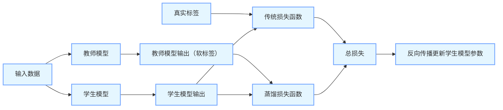

# 知识蒸馏：压缩模型大小的同时保持性能

> 关键词：知识蒸馏、模型压缩、模型性能、教师模型、学生模型

> 摘要：本文围绕知识蒸馏这一核心技术展开，旨在深入探讨如何在压缩模型大小的同时保持模型性能。首先介绍了知识蒸馏的背景信息，包括目的、预期读者、文档结构和相关术语。接着阐述了知识蒸馏的核心概念、联系以及架构，用示意图和流程图进行直观展示。详细讲解了核心算法原理，并给出 Python 代码示例。同时介绍了知识蒸馏涉及的数学模型和公式，结合实际例子进行说明。通过项目实战，展示了代码的实际案例并进行详细解释。探讨了知识蒸馏的实际应用场景，推荐了学习资源、开发工具框架以及相关论文著作。最后总结了知识蒸馏的未来发展趋势与挑战，并提供了常见问题解答和扩展阅读参考资料。

## 1. 背景介绍 
### 1.1 目的和范围
在当今的人工智能和机器学习领域，深度学习模型变得越来越复杂和庞大。虽然大型模型在各种任务中取得了卓越的性能，但它们也带来了诸多问题，如高计算成本、长推理时间和大存储需求。这使得这些模型在资源受限的设备（如移动设备、嵌入式系统）上难以部署。知识蒸馏作为一种有效的模型压缩技术，旨在解决这些问题。本文的目的是全面深入地介绍知识蒸馏技术，包括其原理、算法、应用场景等，范围涵盖从理论基础到实际应用的各个方面。

### 1.2 预期读者
本文预期读者包括对深度学习和模型压缩技术感兴趣的研究人员、开发者、学生等。无论是刚接触深度学习的初学者，还是有一定经验的专业人士，都能从本文中获取有价值的信息。初学者可以通过本文了解知识蒸馏的基本概念和原理，专业人士则可以深入研究其算法细节和实际应用案例。

### 1.3 文档结构概述
本文将按照以下结构进行组织：首先介绍知识蒸馏的背景信息，包括目的、预期读者、文档结构和相关术语。接着阐述知识蒸馏的核心概念、联系以及架构，用示意图和流程图进行直观展示。详细讲解核心算法原理，并给出 Python 代码示例。同时介绍知识蒸馏涉及的数学模型和公式，结合实际例子进行说明。通过项目实战，展示代码的实际案例并进行详细解释。探讨知识蒸馏的实际应用场景，推荐学习资源、开发工具框架以及相关论文著作。最后总结知识蒸馏的未来发展趋势与挑战，并提供常见问题解答和扩展阅读参考资料。

### 1.4 术语表
#### 1.4.1 核心术语定义
- **知识蒸馏（Knowledge Distillation）**：一种模型压缩技术，通过将一个大型、复杂的教师模型（Teacher Model）的知识转移到一个小型、简单的学生模型（Student Model）中，使得学生模型在保持较小规模的同时，尽可能达到与教师模型相近的性能。
- **教师模型（Teacher Model）**：通常是一个大型、复杂且性能良好的模型，它作为知识的提供者，将其学到的知识通过某种方式传递给学生模型。
- **学生模型（Student Model）**：一个小型、简单的模型，它通过学习教师模型的知识来提高自身性能，最终在资源受限的环境中进行部署。
- **软标签（Soft Labels）**：教师模型输出的概率分布，它包含了比硬标签（如类别标签）更多的信息，知识蒸馏利用软标签来训练学生模型。
- **温度参数（Temperature Parameter）**：在知识蒸馏中用于控制软标签的平滑程度，通过调整温度参数可以改变软标签的分布。

#### 1.4.2 相关概念解释
- **模型压缩（Model Compression）**：为了减少模型的存储需求和计算复杂度，对模型进行压缩的一系列技术，知识蒸馏是其中一种重要的方法。
- **迁移学习（Transfer Learning）**：将在一个任务上学习到的知识迁移到另一个相关任务上的技术，知识蒸馏可以看作是一种特殊的迁移学习，将教师模型的知识迁移到学生模型上。
- **正则化（Regularization）**：用于防止模型过拟合的技术，知识蒸馏在一定程度上可以起到正则化的作用，提高学生模型的泛化能力。

#### 1.4.3 缩略词列表
- **KD**：Knowledge Distillation（知识蒸馏）
- **LM**：Large Model（大型模型）
- **SM**：Small Model（小型模型）

## 2. 核心概念与联系 

### 核心概念原理
知识蒸馏的核心思想是让一个小型的学生模型学习大型教师模型的知识。教师模型通常在大规模数据集上进行训练，具有较高的性能，但模型规模较大。学生模型则相对较小，计算成本和存储需求较低。知识蒸馏通过将教师模型的输出（软标签）作为额外的监督信息，引导学生模型的学习，使得学生模型能够模仿教师模型的行为。

具体来说，在传统的监督学习中，模型的训练目标是最小化预测结果与真实标签之间的损失。而在知识蒸馏中，除了这个传统的损失之外，还引入了一个蒸馏损失，用于衡量学生模型的输出与教师模型的软标签之间的差异。通过同时优化这两个损失，学生模型可以学习到教师模型的知识，从而在保持较小规模的情况下，达到与教师模型相近的性能。

### 架构示意图
下面是知识蒸馏的架构示意图：



### 核心概念联系
教师模型和学生模型之间通过软标签建立联系。教师模型根据输入数据生成软标签，学生模型的训练不仅要考虑与真实标签的匹配，还要尽可能接近教师模型的软标签。蒸馏损失函数用于衡量这种接近程度，传统损失函数用于衡量学生模型输出与真实标签的差异。总损失是这两个损失的组合，通过反向传播算法更新学生模型的参数，使得学生模型不断学习教师模型的知识。

## 3. 核心算法原理 & 具体操作步骤 

### 核心算法原理
知识蒸馏的核心算法可以分为以下几个步骤：
1. **训练教师模型**：在大规模数据集上训练一个大型、复杂的教师模型，使其达到较高的性能。
2. **生成软标签**：使用训练好的教师模型对训练数据进行推理，得到每个样本的软标签。软标签是一个概率分布，表示样本属于各个类别的概率。
3. **训练学生模型**：在训练学生模型时，同时考虑传统的损失函数（如交叉熵损失）和蒸馏损失函数。蒸馏损失函数用于衡量学生模型的输出与教师模型的软标签之间的差异。总损失是这两个损失的加权和，通过反向传播算法更新学生模型的参数。

### 具体操作步骤
以下是使用 Python 和 PyTorch 实现知识蒸馏的代码示例：

```python
import torch
import torch.nn as nn
import torch.optim as optim
from torchvision import datasets, transforms

# 定义教师模型和学生模型
class TeacherModel(nn.Module):
    def __init__(self):
        super(TeacherModel, self).__init__()
        self.fc1 = nn.Linear(784, 256)
        self.fc2 = nn.Linear(256, 128)
        self.fc3 = nn.Linear(128, 10)

    def forward(self, x):
        x = x.view(-1, 784)
        x = torch.relu(self.fc1(x))
        x = torch.relu(self.fc2(x))
        x = self.fc3(x)
        return x

class StudentModel(nn.Module):
    def __init__(self):
        super(StudentModel, self).__init__()
        self.fc1 = nn.Linear(784, 64)
        self.fc2 = nn.Linear(64, 10)

    def forward(self, x):
        x = x.view(-1, 784)
        x = torch.relu(self.fc1(x))
        x = self.fc2(x)
        return x

# 数据加载
transform = transforms.Compose([
    transforms.ToTensor(),
    transforms.Normalize((0.1307,), (0.3081,))
])

train_dataset = datasets.MNIST(root='./data', train=True,
                               download=True, transform=transform)
train_loader = torch.utils.data.DataLoader(train_dataset, batch_size=64, shuffle=True)

test_dataset = datasets.MNIST(root='./data', train=False,
                              download=True, transform=transform)
test_loader = torch.utils.data.DataLoader(test_dataset, batch_size=64, shuffle=False)

# 训练教师模型
teacher_model = TeacherModel()
criterion = nn.CrossEntropyLoss()
optimizer = optim.Adam(teacher_model.parameters(), lr=0.001)

num_epochs = 10
for epoch in range(num_epochs):
    running_loss = 0.0
    for i, (images, labels) in enumerate(train_loader):
        optimizer.zero_grad()
        outputs = teacher_model(images)
        loss = criterion(outputs, labels)
        loss.backward()
        optimizer.step()
        running_loss += loss.item()
    print(f'Epoch {epoch + 1}, Loss: {running_loss / len(train_loader)}')

# 知识蒸馏训练学生模型
student_model = StudentModel()
teacher_model.eval()

temperature = 4
alpha = 0.7

criterion_ce = nn.CrossEntropyLoss()
criterion_kd = nn.KLDivLoss(reduction='batchmean')
optimizer = optim.Adam(student_model.parameters(), lr=0.001)

num_epochs = 10
for epoch in range(num_epochs):
    running_loss = 0.0
    for i, (images, labels) in enumerate(train_loader):
        optimizer.zero_grad()
        student_outputs = student_model(images)
        with torch.no_grad():
            teacher_outputs = teacher_model(images)

        # 计算传统损失
        loss_ce = criterion_ce(student_outputs, labels)

        # 计算蒸馏损失
        soft_student_outputs = nn.functional.log_softmax(student_outputs / temperature, dim=1)
        soft_teacher_outputs = nn.functional.softmax(teacher_outputs / temperature, dim=1)
        loss_kd = criterion_kd(soft_student_outputs, soft_teacher_outputs) * (temperature ** 2)

        # 总损失
        loss = alpha * loss_kd + (1 - alpha) * loss_ce

        loss.backward()
        optimizer.step()
        running_loss += loss.item()
    print(f'Epoch {epoch + 1}, Loss: {running_loss / len(train_loader)}')

# 测试学生模型
correct = 0
total = 0
with torch.no_grad():
    for images, labels in test_loader:
        outputs = student_model(images)
        _, predicted = torch.max(outputs.data, 1)
        total += labels.size(0)
        correct += (predicted == labels).sum().item()

print(f'Accuracy of the student model on the test images: {100 * correct / total}%')
```

### 代码解释
1. **定义教师模型和学生模型**：分别定义了一个简单的多层感知机作为教师模型和学生模型。教师模型的层数和神经元数量比学生模型多。
2. **数据加载**：使用 PyTorch 的 `torchvision` 库加载 MNIST 数据集，并进行预处理。
3. **训练教师模型**：使用交叉熵损失函数和 Adam 优化器训练教师模型。
4. **知识蒸馏训练学生模型**：在训练学生模型时，同时计算传统的交叉熵损失和蒸馏损失。蒸馏损失使用 KL 散度损失函数，通过温度参数控制软标签的平滑程度。总损失是这两个损失的加权和，通过反向传播算法更新学生模型的参数。
5. **测试学生模型**：在测试集上评估学生模型的准确率。

## 4. 数学模型和公式 & 详细讲解 & 举例说明 

### 数学模型和公式
#### 传统损失函数
在传统的监督学习中，通常使用交叉熵损失函数来衡量模型的预测结果与真实标签之间的差异。对于一个样本 $x$，其真实标签为 $y$，模型的输出为 $z$，交叉熵损失函数的定义如下：

$$
L_{ce}(z, y) = -\sum_{i=1}^{C} y_i \log(p_i)
$$

其中，$C$ 是类别数，$y_i$ 是真实标签的第 $i$ 个分量（通常是一个 one-hot 向量），$p_i$ 是模型输出的第 $i$ 个分量经过 softmax 函数处理后的概率值：

$$
p_i = \frac{\exp(z_i)}{\sum_{j=1}^{C} \exp(z_j)}
$$

#### 蒸馏损失函数
蒸馏损失函数用于衡量学生模型的输出与教师模型的软标签之间的差异。通常使用 KL 散度损失函数，其定义如下：

$$
L_{kd}(s, t) = \sum_{i=1}^{C} t_i \log(\frac{t_i}{s_i})
$$

其中，$s$ 是学生模型的输出经过 softmax 函数处理后的概率分布，$t$ 是教师模型的输出经过 softmax 函数处理后的概率分布。为了控制软标签的平滑程度，引入温度参数 $T$，将模型的输出除以 $T$ 后再进行 softmax 处理：

$$
s_i^T = \frac{\exp(\frac{s_i}{T})}{\sum_{j=1}^{C} \exp(\frac{s_j}{T})}
$$

$$
t_i^T = \frac{\exp(\frac{t_i}{T})}{\sum_{j=1}^{C} \exp(\frac{t_j}{T})}
$$

此时，蒸馏损失函数变为：

$$
L_{kd}^T(s, t) = T^2 \sum_{i=1}^{C} t_i^T \log(\frac{t_i^T}{s_i^T})
$$

#### 总损失函数
总损失函数是传统损失函数和蒸馏损失函数的加权和：

$$
L = \alpha L_{kd}^T(s, t) + (1 - \alpha) L_{ce}(s, y)
$$

其中，$\alpha$ 是一个权重参数，用于控制蒸馏损失和传统损失的相对重要性。

### 详细讲解
传统损失函数 $L_{ce}$ 用于衡量学生模型的输出与真实标签之间的差异，它是监督学习中常用的损失函数。蒸馏损失函数 $L_{kd}$ 用于衡量学生模型的输出与教师模型的软标签之间的差异，通过引入温度参数 $T$，可以控制软标签的平滑程度。当 $T$ 较大时，软标签的分布更加平滑，包含更多的类别信息；当 $T$ 较小时，软标签的分布更加集中，接近硬标签。总损失函数 $L$ 是这两个损失的加权和，通过调整权重参数 $\alpha$，可以平衡蒸馏损失和传统损失的影响。

### 举例说明
假设我们有一个三分类问题，真实标签为 $y = [1, 0, 0]$，教师模型的输出为 $t = [5, 3, 1]$，学生模型的输出为 $s = [4, 2, 1]$。温度参数 $T = 2$，权重参数 $\alpha = 0.7$。

首先，计算传统损失函数：

$$
p = \text{softmax}(s) = [\frac{\exp(4)}{\exp(4) + \exp(2) + \exp(1)}, \frac{\exp(2)}{\exp(4) + \exp(2) + \exp(1)}, \frac{\exp(1)}{\exp(4) + \exp(2) + \exp(1)}] \approx [0.87, 0.12, 0.01]
$$

$$
L_{ce}(s, y) = -\sum_{i=1}^{3} y_i \log(p_i) = -\log(0.87) \approx 0.14
$$

然后，计算蒸馏损失函数：

$$
s^T = \text{softmax}(\frac{s}{T}) = [\frac{\exp(2)}{\exp(2) + \exp(1) + \exp(0.5)}, \frac{\exp(1)}{\exp(2) + \exp(1) + \exp(0.5)}, \frac{\exp(0.5)}{\exp(2) + \exp(1) + \exp(0.5)}] \approx [0.64, 0.26, 0.10]
$$

$$
t^T = \text{softmax}(\frac{t}{T}) = [\frac{\exp(2.5)}{\exp(2.5) + \exp(1.5) + \exp(0.5)}, \frac{\exp(1.5)}{\exp(2.5) + \exp(1.5) + \exp(0.5)}, \frac{\exp(0.5)}{\exp(2.5) + \exp(1.5) + \exp(0.5)}] \approx [0.80, 0.16, 0.04]
$$

$$
L_{kd}^T(s, t) = T^2 \sum_{i=1}^{3} t_i^T \log(\frac{t_i^T}{s_i^T}) = 4 \times (0.80 \log(\frac{0.80}{0.64}) + 0.16 \log(\frac{0.16}{0.26}) + 0.04 \log(\frac{0.04}{0.10})) \approx 0.32
$$

最后，计算总损失函数：

$$
L = \alpha L_{kd}^T(s, t) + (1 - \alpha) L_{ce}(s, y) = 0.7 \times 0.32 + 0.3 \times 0.14 \approx 0.26
$$

## 5. 项目实战：代码实际案例和详细解释说明 

### 5.1  开发环境搭建
#### 安装 Python
首先，确保你已经安装了 Python 3.x 版本。可以从 Python 官方网站（https://www.python.org/downloads/）下载并安装适合你操作系统的 Python 版本。

#### 安装 PyTorch
PyTorch 是一个开源的深度学习框架，我们将使用它来实现知识蒸馏。可以根据你的 CUDA 版本和操作系统选择合适的安装方式。以下是使用 pip 安装 PyTorch 的示例命令：

```bash
pip install torch torchvision
```

#### 安装其他依赖库
还需要安装一些其他的依赖库，如 `numpy`、`matplotlib` 等。可以使用以下命令进行安装：

```bash
pip install numpy matplotlib
```

### 5.2  源代码详细实现和代码解读
以下是一个完整的知识蒸馏项目实战代码示例：

```python
import torch
import torch.nn as nn
import torch.optim as optim
from torchvision import datasets, transforms
import matplotlib.pyplot as plt

# 定义教师模型和学生模型
class TeacherModel(nn.Module):
    def __init__(self):
        super(TeacherModel, self).__init__()
        self.conv1 = nn.Conv2d(1, 16, kernel_size=3, padding=1)
        self.pool = nn.MaxPool2d(2, 2)
        self.conv2 = nn.Conv2d(16, 32, kernel_size=3, padding=1)
        self.fc1 = nn.Linear(32 * 7 * 7, 128)
        self.fc2 = nn.Linear(128, 10)

    def forward(self, x):
        x = self.pool(torch.relu(self.conv1(x)))
        x = self.pool(torch.relu(self.conv2(x)))
        x = x.view(-1, 32 * 7 * 7)
        x = torch.relu(self.fc1(x))
        x = self.fc2(x)
        return x

class StudentModel(nn.Module):
    def __init__(self):
        super(StudentModel, self).__init__()
        self.conv1 = nn.Conv2d(1, 8, kernel_size=3, padding=1)
        self.pool = nn.MaxPool2d(2, 2)
        self.fc1 = nn.Linear(8 * 7 * 7, 64)
        self.fc2 = nn.Linear(64, 10)

    def forward(self, x):
        x = self.pool(torch.relu(self.conv1(x)))
        x = self.pool(x)
        x = x.view(-1, 8 * 7 * 7)
        x = torch.relu(self.fc1(x))
        x = self.fc2(x)
        return x

# 数据加载
transform = transforms.Compose([
    transforms.ToTensor(),
    transforms.Normalize((0.1307,), (0.3081,))
])

train_dataset = datasets.MNIST(root='./data', train=True,
                               download=True, transform=transform)
train_loader = torch.utils.data.DataLoader(train_dataset, batch_size=64, shuffle=True)

test_dataset = datasets.MNIST(root='./data', train=False,
                              download=True, transform=transform)
test_loader = torch.utils.data.DataLoader(test_dataset, batch_size=64, shuffle=False)

# 训练教师模型
teacher_model = TeacherModel()
criterion = nn.CrossEntropyLoss()
optimizer = optim.Adam(teacher_model.parameters(), lr=0.001)

num_epochs = 10
teacher_losses = []
for epoch in range(num_epochs):
    running_loss = 0.0
    for i, (images, labels) in enumerate(train_loader):
        optimizer.zero_grad()
        outputs = teacher_model(images)
        loss = criterion(outputs, labels)
        loss.backward()
        optimizer.step()
        running_loss += loss.item()
    epoch_loss = running_loss / len(train_loader)
    teacher_losses.append(epoch_loss)
    print(f'Epoch {epoch + 1}, Teacher Loss: {epoch_loss}')

# 绘制教师模型训练损失曲线
plt.plot(teacher_losses)
plt.xlabel('Epoch')
plt.ylabel('Loss')
plt.title('Teacher Model Training Loss')
plt.show()

# 知识蒸馏训练学生模型
student_model = StudentModel()
teacher_model.eval()

temperature = 4
alpha = 0.7

criterion_ce = nn.CrossEntropyLoss()
criterion_kd = nn.KLDivLoss(reduction='batchmean')
optimizer = optim.Adam(student_model.parameters(), lr=0.001)

num_epochs = 10
student_losses = []
for epoch in range(num_epochs):
    running_loss = 0.0
    for i, (images, labels) in enumerate(train_loader):
        optimizer.zero_grad()
        student_outputs = student_model(images)
        with torch.no_grad():
            teacher_outputs = teacher_model(images)

        # 计算传统损失
        loss_ce = criterion_ce(student_outputs, labels)

        # 计算蒸馏损失
        soft_student_outputs = nn.functional.log_softmax(student_outputs / temperature, dim=1)
        soft_teacher_outputs = nn.functional.softmax(teacher_outputs / temperature, dim=1)
        loss_kd = criterion_kd(soft_student_outputs, soft_teacher_outputs) * (temperature ** 2)

        # 总损失
        loss = alpha * loss_kd + (1 - alpha) * loss_ce

        loss.backward()
        optimizer.step()
        running_loss += loss.item()
    epoch_loss = running_loss / len(train_loader)
    student_losses.append(epoch_loss)
    print(f'Epoch {epoch + 1}, Student Loss: {epoch_loss}')

# 绘制学生模型训练损失曲线
plt.plot(student_losses)
plt.xlabel('Epoch')
plt.ylabel('Loss')
plt.title('Student Model Training Loss')
plt.show()

# 测试学生模型
correct = 0
total = 0
with torch.no_grad():
    for images, labels in test_loader:
        outputs = student_model(images)
        _, predicted = torch.max(outputs.data, 1)
        total += labels.size(0)
        correct += (predicted == labels).sum().item()

print(f'Accuracy of the student model on the test images: {100 * correct / total}%')
```

### 代码解读与分析
#### 模型定义
- **教师模型**：使用两个卷积层和两个全连接层构建一个简单的卷积神经网络。
- **学生模型**：与教师模型类似，但卷积层的通道数和全连接层的神经元数量较少，模型规模更小。

#### 数据加载
使用 PyTorch 的 `torchvision` 库加载 MNIST 数据集，并进行预处理，包括将图像转换为张量和归一化。

#### 训练教师模型
使用交叉熵损失函数和 Adam 优化器训练教师模型。记录每个 epoch 的损失，并绘制训练损失曲线。

#### 知识蒸馏训练学生模型
在训练学生模型时，同时计算传统的交叉熵损失和蒸馏损失。蒸馏损失使用 KL 散度损失函数，通过温度参数控制软标签的平滑程度。总损失是这两个损失的加权和，通过反向传播算法更新学生模型的参数。记录每个 epoch 的损失，并绘制训练损失曲线。

#### 测试学生模型
在测试集上评估学生模型的准确率。

### 结果分析
通过绘制训练损失曲线，可以观察到教师模型和学生模型的训练过程。学生模型在知识蒸馏的帮助下，虽然模型规模较小，但仍然可以达到较高的准确率。通过调整温度参数和权重参数，可以进一步优化学生模型的性能。

## 6. 实际应用场景 
### 移动设备和嵌入式系统
在移动设备（如智能手机、平板电脑）和嵌入式系统（如智能手表、智能家居设备）上，资源（如计算能力、存储容量）通常是受限的。知识蒸馏可以将大型模型的知识转移到小型模型中，使得这些小型模型能够在移动设备和嵌入式系统上高效运行。例如，在移动图像识别应用中，可以使用知识蒸馏技术将大型的图像分类模型压缩为小型模型，以减少计算量和存储需求，同时保持较高的识别准确率。

### 边缘计算
边缘计算是指在靠近数据源的边缘设备上进行数据处理和分析，以减少数据传输延迟和带宽需求。知识蒸馏可以帮助在边缘设备上部署轻量级的模型，实现实时的数据分析和决策。例如，在智能交通系统中，边缘设备（如交通摄像头）可以使用知识蒸馏后的小型模型进行车辆检测和识别，及时反馈交通信息。

### 在线服务
在在线服务中，模型的推理速度和资源消耗是关键因素。知识蒸馏可以提高模型的推理速度，减少服务器的计算负担，从而降低运营成本。例如，在搜索引擎、推荐系统等在线服务中，使用知识蒸馏后的小型模型可以更快地响应用户请求，提高用户体验。

### 联邦学习
联邦学习是一种在多个参与方之间进行分布式模型训练的技术，每个参与方的数据是私有的，不进行数据共享。知识蒸馏可以在联邦学习中发挥重要作用，通过将中央服务器上的大型模型的知识转移到各个参与方的小型模型中，提高各个参与方的模型性能，同时保护数据隐私。

## 7. 工具和资源推荐
### 7.1 学习资源推荐
#### 7.1.1 书籍推荐
- 《深度学习》（Deep Learning）：由 Ian Goodfellow、Yoshua Bengio 和 Aaron Courville 所著，是深度学习领域的经典教材，涵盖了深度学习的基本原理、算法和应用。
- 《动手学深度学习》（Dive into Deep Learning）：由 Aston Zhang、Zack C. Lipton、Mu Li 和 Alexander J. Smola 所著，提供了丰富的代码示例和实践项目，适合初学者快速上手深度学习。
- 《神经网络与深度学习》（Neural Networks and Deep Learning）：由 Michael Nielsen 所著，以通俗易懂的方式介绍了神经网络和深度学习的基本概念和算法。

#### 7.1.2 在线课程
- Coursera 上的“深度学习专项课程”（Deep Learning Specialization）：由 Andrew Ng 教授授课，涵盖了深度学习的各个方面，包括神经网络基础、卷积神经网络、循环神经网络等。
- edX 上的“强化学习”（Reinforcement Learning）：由 David Silver 教授授课，深入介绍了强化学习的理论和算法。
- 哔哩哔哩上的“李宏毅机器学习”：由李宏毅教授授课，以生动有趣的方式讲解机器学习和深度学习的知识。

#### 7.1.3 技术博客和网站
- Medium 上的 Towards Data Science：是一个专注于数据科学和机器学习的技术博客，提供了大量的优质文章和教程。
- arXiv：是一个预印本服务器，包含了大量的学术论文，涵盖了人工智能、机器学习、深度学习等领域的最新研究成果。
- Kaggle：是一个数据科学竞赛平台，提供了丰富的数据集和竞赛项目，可以通过参与竞赛来提高自己的实践能力。

### 7.2 开发工具框架推荐
#### 7.2.1 IDE和编辑器
- PyCharm：是一款专门为 Python 开发设计的集成开发环境（IDE），提供了丰富的功能，如代码编辑、调试、版本控制等。
- Jupyter Notebook：是一个交互式的开发环境，适合进行数据探索、模型训练和可视化。可以在浏览器中运行代码，并实时查看结果。
- Visual Studio Code：是一款轻量级的代码编辑器，支持多种编程语言，包括 Python。可以通过安装扩展插件来增强其功能。

#### 7.2.2 调试和性能分析工具
- PyTorch Profiler：是 PyTorch 提供的一个性能分析工具，可以帮助开发者分析模型的训练和推理过程，找出性能瓶颈。
- TensorBoard：是 TensorFlow 提供的一个可视化工具，可以用于监控模型的训练过程、可视化模型结构和分析性能指标。
- cProfile：是 Python 内置的一个性能分析工具，可以帮助开发者分析代码的运行时间和函数调用情况。

#### 7.2.3 相关框架和库
- PyTorch：是一个开源的深度学习框架，提供了丰富的神经网络层和优化算法，支持 GPU 加速。
- TensorFlow：是另一个广泛使用的深度学习框架，具有强大的分布式训练和部署能力。
- Scikit-learn：是一个用于机器学习的 Python 库，提供了丰富的机器学习算法和工具，如分类、回归、聚类等。

### 7.3 相关论文著作推荐
#### 7.3.1 经典论文
- “Distilling the Knowledge in a Neural Network”：由 Geoffrey Hinton、Oriol Vinyals 和 Jeff Dean 发表，是知识蒸馏领域的开创性论文，首次提出了知识蒸馏的概念。
- “MobileNets: Efficient Convolutional Neural Networks for Mobile Vision Applications”：提出了 MobileNet 系列模型，是一种轻量级的卷积神经网络，适用于移动设备和嵌入式系统。
- “EfficientNet: Rethinking Model Scaling for Convolutional Neural Networks”：提出了 EfficientNet 系列模型，通过自动搜索网络结构和缩放策略，实现了高效的模型设计。

#### 7.3.2 最新研究成果
- “Knowledge Distillation with Adversarial Samples Supporting Decision Boundary”：提出了一种基于对抗样本的知识蒸馏方法，通过生成对抗样本支持决策边界，提高了学生模型的性能。
- “Label-Free Knowledge Distillation for Object Detection”：提出了一种无标签的知识蒸馏方法，用于目标检测任务，减少了对标注数据的依赖。
- “Online Knowledge Distillation for Efficient Object Detection”：提出了一种在线知识蒸馏方法，用于高效的目标检测，在训练过程中动态地更新教师模型和学生模型。

#### 7.3.3 应用案例分析
- “Knowledge Distillation for Speech Recognition on Mobile Devices”：介绍了知识蒸馏在移动设备语音识别中的应用，通过将大型语音识别模型的知识转移到小型模型中，实现了高效的语音识别。
- “Knowledge Distillation for Medical Image Analysis”：探讨了知识蒸馏在医学图像分析中的应用，如疾病诊断、图像分割等，提高了医学图像分析的效率和准确性。
- “Knowledge Distillation for Autonomous Driving”：研究了知识蒸馏在自动驾驶中的应用，通过将大型的自动驾驶模型压缩为小型模型，提高了自动驾驶系统的实时性和可靠性。

## 8. 总结：未来发展趋势与挑战
### 未来发展趋势
#### 多模态知识蒸馏
随着人工智能技术的发展，多模态数据（如图像、文本、语音）的处理变得越来越重要。未来的知识蒸馏技术将不仅仅局限于单模态数据，而是会扩展到多模态数据的处理。通过将不同模态的知识进行蒸馏，可以提高模型在多模态任务中的性能。

#### 自适应知识蒸馏
在不同的应用场景中，模型的需求和资源限制是不同的。未来的知识蒸馏技术将更加注重自适应能力，能够根据具体的应用场景和资源限制，自动调整蒸馏策略和参数，以达到最佳的性能和效率。

#### 知识蒸馏与其他技术的融合
知识蒸馏可以与其他技术（如强化学习、迁移学习、元学习等）进行融合，进一步提高模型的性能和泛化能力。例如，将知识蒸馏与强化学习相结合，可以在强化学习任务中加速模型的训练过程。

#### 硬件友好的知识蒸馏
随着硬件技术的不断发展，如芯片设计和架构的改进，未来的知识蒸馏技术将更加注重与硬件的结合，设计出更加适合硬件平台的模型结构和蒸馏算法，以充分发挥硬件的性能优势。

### 挑战
#### 知识表示和传递
如何有效地表示和传递教师模型的知识是知识蒸馏面临的一个挑战。目前的知识蒸馏方法主要基于软标签，但软标签可能无法完全捕捉教师模型的所有知识。未来需要探索更加有效的知识表示和传递方法。

#### 模型架构设计
设计合适的学生模型架构是知识蒸馏的关键。学生模型需要在保持较小规模的同时，能够充分学习教师模型的知识。如何设计出高效的学生模型架构，仍然是一个需要深入研究的问题。

#### 超参数调优
知识蒸馏涉及到多个超参数（如温度参数、权重参数等）的调优，这些超参数的选择对学生模型的性能有很大的影响。目前，超参数调优主要依赖于经验和试错，缺乏有效的自动化方法。未来需要研究更加智能的超参数调优算法。

#### 数据隐私和安全
在知识蒸馏过程中，教师模型的知识可能包含敏感信息。如何在知识蒸馏过程中保护数据隐私和安全，是一个需要关注的问题。未来需要研究更加安全的知识蒸馏方法，确保数据的隐私和安全。

## 9. 附录：常见问题与解答
### 问题 1：知识蒸馏和传统的模型压缩方法有什么区别？
知识蒸馏是一种特殊的模型压缩方法，它通过将大型教师模型的知识转移到小型学生模型中，使得学生模型在保持较小规模的同时，尽可能达到与教师模型相近的性能。与传统的模型压缩方法（如剪枝、量化）不同，知识蒸馏不仅可以减少模型的参数数量，还可以利用教师模型的知识来提高学生模型的性能。

### 问题 2：温度参数的作用是什么？如何选择合适的温度参数？
温度参数用于控制软标签的平滑程度。当温度参数较大时，软标签的分布更加平滑，包含更多的类别信息；当温度参数较小时，软标签的分布更加集中，接近硬标签。选择合适的温度参数需要根据具体的任务和数据集进行实验。一般来说，可以通过网格搜索等方法来选择最优的温度参数。

### 问题 3：权重参数 $\alpha$ 的作用是什么？如何选择合适的权重参数？
权重参数 $\alpha$ 用于控制蒸馏损失和传统损失的相对重要性。当 $\alpha$ 较大时，蒸馏损失的影响更大，学生模型更注重学习教师模型的知识；当 $\alpha$ 较小时，传统损失的影响更大，学生模型更注重与真实标签的匹配。选择合适的权重参数需要根据具体的任务和数据集进行实验。可以通过交叉验证等方法来选择最优的权重参数。

### 问题 4：知识蒸馏是否适用于所有类型的模型？
知识蒸馏适用于大多数类型的模型，包括神经网络、决策树、支持向量机等。但不同类型的模型在知识蒸馏过程中可能需要采用不同的方法和策略。例如，对于神经网络模型，可以使用软标签进行知识蒸馏；对于决策树模型，可以通过转移树的结构和节点信息来进行知识蒸馏。

### 问题 5：知识蒸馏是否会增加训练时间？
知识蒸馏通常会增加一定的训练时间，因为在训练学生模型时，需要同时计算传统损失和蒸馏损失，并且需要使用教师模型生成软标签。但相比于训练一个大型模型，知识蒸馏的训练时间仍然相对较短。此外，通过优化算法和硬件加速等方法，可以进一步减少知识蒸馏的训练时间。

## 10. 扩展阅读 & 参考资料
### 扩展阅读
- 《深度学习实战》（Deep Learning in Practice）：介绍了深度学习在各个领域的实际应用案例，包括图像识别、自然语言处理、语音识别等。
- 《人工智能：现代方法》（Artificial Intelligence: A Modern Approach）：是人工智能领域的经典教材，涵盖了人工智能的各个方面，包括知识表示、推理、机器学习、深度学习等。
- 《模型压缩与加速》（Model Compression and Acceleration）：专门介绍了模型压缩和加速的技术和方法，包括知识蒸馏、剪枝、量化等。

### 参考资料
- Hinton, G., Vinyals, O., & Dean, J. (2015). Distilling the Knowledge in a Neural Network. arXiv preprint arXiv:1503.02531.
- Howard, A. G., Zhu, M., Chen, B., Kalenichenko, D., Wang, W., Weyand, T.,... & Adam, H. (2017). MobileNets: Efficient Convolutional Neural Networks for Mobile Vision Applications. arXiv preprint arXiv:1704.04861.
- Tan, M., & Le, Q. V. (2019). EfficientNet: Rethinking Model Scaling for Convolutional Neural Networks. In Proceedings of the IEEE/CVF Conference on Computer Vision and Pattern Recognition (pp. 6105-6114).

作者：AI天才研究院/AI Genius Institute & 禅与计算机程序设计艺术 /Zen And The Art of Computer Programming