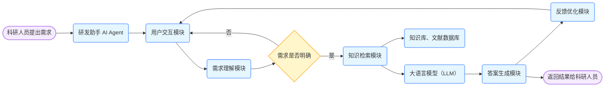

# 研发助手 AI Agent：LLM 在科研过程中的辅助作用

> 关键词：研发助手、AI Agent、大语言模型（LLM）、科研辅助、人工智能

> 摘要：本文深入探讨了研发助手 AI Agent 在科研过程中借助大语言模型（LLM）所发挥的辅助作用。首先介绍了相关背景信息，包括目的、预期读者等内容。接着详细阐述了核心概念及其联系，通过文本示意图和 Mermaid 流程图进行直观展示。对核心算法原理结合 Python 代码进行讲解，并给出了具体操作步骤。同时分析了相关的数学模型和公式，辅以举例说明。通过项目实战，展示了代码实际案例并进行详细解释。探讨了其在实际科研中的应用场景，推荐了相关的学习资源、开发工具框架以及论文著作。最后总结了未来发展趋势与挑战，还提供了常见问题解答和扩展阅读参考资料，旨在全面展现 LLM 在科研辅助方面的重要价值和应用前景。

## 1. 背景介绍 
### 1.1 目的和范围
随着人工智能技术的飞速发展，大语言模型（LLM）如 ChatGPT、文心一言等不断涌现，展现出强大的语言理解和生成能力。本研究旨在深入探讨研发助手 AI Agent 如何利用 LLM 在科研过程中发挥辅助作用，以提高科研效率、拓宽研究思路、提升研究质量。研究范围涵盖了科研的各个阶段，包括文献调研、实验设计、数据分析、论文撰写等，旨在全面揭示 LLM 在科研中的应用潜力和实际效果。

### 1.2 预期读者
本文的预期读者主要包括科研工作者，如高校教师、科研机构研究人员等，他们可以通过了解 LLM 在科研中的应用，提高自身的科研效率和质量。同时，也适合对人工智能在科研领域应用感兴趣的技术爱好者、学生等群体，帮助他们了解相关技术和发展趋势。此外，从事人工智能研发的工程师也可以从本文中获取关于如何构建和优化研发助手 AI Agent 的思路和方法。

### 1.3 文档结构概述
本文共分为十个部分。第一部分为背景介绍，阐述了研究的目的、范围、预期读者和文档结构。第二部分介绍核心概念与联系，包括研发助手 AI Agent、LLM 等核心概念的原理和架构，并通过文本示意图和 Mermaid 流程图进行直观展示。第三部分讲解核心算法原理和具体操作步骤，结合 Python 代码详细阐述。第四部分分析数学模型和公式，进行详细讲解并举例说明。第五部分是项目实战，介绍开发环境搭建、源代码详细实现和代码解读。第六部分探讨实际应用场景。第七部分推荐相关的工具和资源，包括学习资源、开发工具框架和论文著作。第八部分总结未来发展趋势与挑战。第九部分是附录，提供常见问题与解答。第十部分为扩展阅读和参考资料。

### 1.4 术语表
#### 1.4.1 核心术语定义
- **研发助手 AI Agent**：一种基于人工智能技术的智能代理，能够与科研人员进行交互，利用大语言模型等技术为科研过程提供各种辅助服务，如文献检索、实验设计建议、数据分析支持等。
- **大语言模型（LLM）**：一种基于深度学习的自然语言处理模型，通过在大规模文本数据上进行训练，学习语言的模式和规律，能够生成自然流畅的文本，回答各种问题，进行语言推理等。
- **科研过程**：指科研人员从提出研究问题、进行文献调研、设计实验、收集和分析数据到撰写论文等一系列活动的全过程。

#### 1.4.2 相关概念解释
- **自然语言处理（NLP）**：是人工智能的一个重要领域，研究如何让计算机理解、处理和生成人类语言。大语言模型是自然语言处理领域的重要成果之一。
- **智能代理**：是一种能够感知环境、自主决策并采取行动以实现特定目标的软件实体。研发助手 AI Agent 就是一种智能代理，它能够感知科研人员的需求，利用 LLM 等技术提供相应的辅助服务。

#### 1.4.3 缩略词列表
- **LLM**：Large Language Model（大语言模型）
- **NLP**：Natural Language Processing（自然语言处理）
- **AI**：Artificial Intelligence（人工智能）

## 2. 核心概念与联系 
### 核心概念原理
#### 研发助手 AI Agent
研发助手 AI Agent 是一个集成了多种人工智能技术的智能系统，其核心目标是为科研人员提供高效、准确的科研辅助服务。它通过与科研人员进行自然语言交互，理解科研人员的需求，并利用大语言模型等技术生成相应的回答和建议。研发助手 AI Agent 通常包括以下几个主要模块：
- **用户交互模块**：负责与科研人员进行交互，接收科研人员的输入，并将处理结果反馈给科研人员。
- **需求理解模块**：对科研人员的输入进行分析和理解，提取关键信息，确定科研人员的需求。
- **知识检索模块**：根据科研人员的需求，从知识库、文献数据库等数据源中检索相关的知识和信息。
- **答案生成模块**：利用大语言模型对检索到的知识和信息进行处理和整合，生成符合科研人员需求的回答和建议。
- **反馈优化模块**：根据科研人员的反馈，对系统的性能和结果进行优化和改进。

#### 大语言模型（LLM）
大语言模型是基于深度学习的自然语言处理模型，通常采用Transformer架构。它通过在大规模文本数据上进行无监督学习，学习语言的模式和规律，从而能够生成自然流畅的文本，回答各种问题，进行语言推理等。大语言模型的训练过程通常包括预训练和微调两个阶段：
- **预训练阶段**：在大规模无标注文本数据上进行训练，学习语言的通用模式和规律。
- **微调阶段**：在特定领域的标注数据上进行微调，使模型能够更好地适应特定领域的任务和需求。

### 架构的文本示意图
```plaintext
+---------------------+
| 科研人员            |
+---------------------+
        |
        v
+---------------------+
| 研发助手 AI Agent   |
| +-----------------+ |
| | 用户交互模块    | |
| +-----------------+ |
| | 需求理解模块    | |
| +-----------------+ |
| | 知识检索模块    | |
| +-----------------+ |
| | 答案生成模块    | |
| +-----------------+ |
| | 反馈优化模块    | |
| +-----------------+ |
+---------------------+
        |
        v
+---------------------+
| 大语言模型（LLM）  |
+---------------------+
        |
        v
+---------------------+
| 知识库、文献数据库  |
+---------------------+
```

### Mermaid 流程图


## 3. 核心算法原理 & 具体操作步骤 
### 核心算法原理
研发助手 AI Agent 在利用大语言模型进行科研辅助时，主要涉及以下几个核心算法：
#### 自然语言处理算法
- **分词算法**：将科研人员输入的文本分割成一个个词语，常用的分词算法有基于规则的分词算法、基于统计的分词算法和基于深度学习的分词算法等。
- **词性标注算法**：为每个词语标注其词性，如名词、动词、形容词等，常用的词性标注算法有基于规则的词性标注算法、基于统计的词性标注算法和基于深度学习的词性标注算法等。
- **命名实体识别算法**：识别文本中的命名实体，如人名、地名、组织机构名等，常用的命名实体识别算法有基于规则的命名实体识别算法、基于统计的命名实体识别算法和基于深度学习的命名实体识别算法等。

#### 知识检索算法
- **向量空间模型**：将文本表示为向量，通过计算向量之间的相似度来进行知识检索。常用的相似度计算方法有余弦相似度、欧几里得距离等。
- **倒排索引**：建立文档中词语与文档之间的映射关系，通过词语快速定位包含该词语的文档，提高检索效率。

#### 答案生成算法
- **序列到序列模型**：将输入的文本序列转换为输出的文本序列，如基于Transformer架构的序列到序列模型。
- **生成对抗网络（GAN）**：通过生成器和判别器的对抗训练，生成高质量的文本。

### 具体操作步骤
#### 步骤 1：用户输入处理
科研人员通过用户交互模块输入科研需求，研发助手 AI Agent 的需求理解模块对输入进行处理，包括分词、词性标注、命名实体识别等操作，提取关键信息。

```python
import jieba
import jieba.posseg as pseg

def process_user_input(input_text):
    # 分词
    words = pseg.cut(input_text)
    key_info = []
    for word, flag in words:
        # 提取关键信息，这里简单假设名词为关键信息
        if flag.startswith('n'):
            key_info.append(word)
    return key_info

input_text = "查找关于人工智能在医疗领域应用的文献"
key_info = process_user_input(input_text)
print("提取的关键信息：", key_info)
```

#### 步骤 2：知识检索
知识检索模块根据提取的关键信息，从知识库、文献数据库等数据源中检索相关的知识和信息。

```python
# 模拟知识库
knowledge_base = {
    "人工智能在医疗领域的应用": ["文献1", "文献2", "文献3"]
}

def knowledge_retrieval(key_info):
    query = " ".join(key_info)
    if query in knowledge_base:
        return knowledge_base[query]
    else:
        return []

retrieved_docs = knowledge_retrieval(key_info)
print("检索到的文献：", retrieved_docs)
```

#### 步骤 3：答案生成
答案生成模块利用大语言模型对检索到的知识和信息进行处理和整合，生成符合科研人员需求的回答和建议。

```python
# 模拟大语言模型
def answer_generation(retrieved_docs):
    if retrieved_docs:
        answer = "以下是关于人工智能在医疗领域应用的相关文献：" + ", ".join(retrieved_docs)
    else:
        answer = "未检索到相关文献。"
    return answer

answer = answer_generation(retrieved_docs)
print("生成的答案：", answer)
```

#### 步骤 4：结果反馈与优化
反馈优化模块根据科研人员的反馈，对系统的性能和结果进行优化和改进。

```python
def feedback_optimization(feedback):
    # 这里简单模拟根据反馈进行优化的过程
    if feedback == "不满意":
        print("将对系统进行优化...")
    else:
        print("感谢您的反馈！")

feedback = input("请对结果进行反馈（满意/不满意）：")
feedback_optimization(feedback)
```

## 4. 数学模型和公式 & 详细讲解 & 举例说明 
### 向量空间模型
#### 数学模型和公式
向量空间模型将文本表示为向量，假设文本集合中有 $n$ 个词语，每个文本可以表示为一个 $n$ 维向量 $\vec{v}=(v_1, v_2, \cdots, v_n)$，其中 $v_i$ 表示第 $i$ 个词语在文本中的权重。常用的权重计算方法有词频 - 逆文档频率（TF - IDF），其计算公式如下：

$$TF - IDF_{i,j} = TF_{i,j} \times IDF_i$$

其中，$TF_{i,j}$ 表示词语 $i$ 在文档 $j$ 中的词频，即词语 $i$ 在文档 $j$ 中出现的次数；$IDF_i$ 表示词语 $i$ 的逆文档频率，计算公式为：

$$IDF_i = \log\frac{N}{df_i}$$

其中，$N$ 表示文档集合中的文档总数，$df_i$ 表示包含词语 $i$ 的文档数。

文本之间的相似度可以通过计算向量之间的余弦相似度来衡量，余弦相似度的计算公式为：

$$\cos(\vec{v}_1, \vec{v}_2) = \frac{\vec{v}_1 \cdot \vec{v}_2}{\|\vec{v}_1\| \|\vec{v}_2\|}$$

其中，$\vec{v}_1$ 和 $\vec{v}_2$ 分别表示两个文本的向量，$\vec{v}_1 \cdot \vec{v}_2$ 表示向量的点积，$\|\vec{v}_1\|$ 和 $\|\vec{v}_2\|$ 分别表示向量的模。

#### 详细讲解
向量空间模型的核心思想是将文本表示为向量，通过计算向量之间的相似度来衡量文本之间的相似程度。TF - IDF 权重计算方法可以有效地降低常见词语的权重，提高稀有词语的权重，从而更准确地表示文本的特征。余弦相似度是一种常用的向量相似度计算方法，它可以衡量两个向量之间的夹角余弦值，夹角越小，余弦值越接近 1，说明两个向量越相似。

#### 举例说明
假设文档集合中有三个文档：
- $D_1$: "人工智能在医疗领域的应用"
- $D_2$: "人工智能在教育领域的应用"
- $D_3$: "医疗技术的发展"

首先，对文档进行分词处理，得到词语集合：["人工智能", "医疗", "领域", "应用", "教育", "技术", "发展"]。

然后，计算每个文档的 TF - IDF 向量：
- 对于 $D_1$：
  - $TF$ 向量：$(1, 1, 1, 1, 0, 0, 0)$
  - $IDF$ 向量：$(\log\frac{3}{2}, \log\frac{3}{2}, \log\frac{3}{2}, \log\frac{3}{2}, \log\frac{3}{1}, \log\frac{3}{1}, \log\frac{3}{1})$
  - $TF - IDF$ 向量：$(1\times\log\frac{3}{2}, 1\times\log\frac{3}{2}, 1\times\log\frac{3}{2}, 1\times\log\frac{3}{2}, 0\times\log\frac{3}{1}, 0\times\log\frac{3}{1}, 0\times\log\frac{3}{1})$

同理，可以计算出 $D_2$ 和 $D_3$ 的 $TF - IDF$ 向量。

最后，计算文档之间的余弦相似度，例如计算 $D_1$ 和 $D_2$ 的余弦相似度：

```python
import numpy as np

# 假设已经计算出 D1 和 D2 的 TF - IDF 向量
v1 = np.array([1*np.log(3/2), 1*np.log(3/2), 1*np.log(3/2), 1*np.log(3/2), 0, 0, 0])
v2 = np.array([1*np.log(3/2), 0, 1*np.log(3/2), 1*np.log(3/2), 1*np.log(3/1), 0, 0])

cos_sim = np.dot(v1, v2) / (np.linalg.norm(v1) * np.linalg.norm(v2))
print("D1 和 D2 的余弦相似度：", cos_sim)
```

### 序列到序列模型
#### 数学模型和公式
序列到序列模型通常由编码器和解码器组成，编码器将输入序列 $\mathbf{x}=(x_1, x_2, \cdots, x_n)$ 编码为一个上下文向量 $\mathbf{c}$，解码器根据上下文向量 $\mathbf{c}$ 生成输出序列 $\mathbf{y}=(y_1, y_2, \cdots, y_m)$。

编码器的输出可以表示为：

$$\mathbf{h}_t = f(\mathbf{x}_t, \mathbf{h}_{t - 1})$$

其中，$\mathbf{h}_t$ 表示编码器在时间步 $t$ 的隐藏状态，$f$ 是编码器的循环单元，如 LSTM 或 GRU。

上下文向量 $\mathbf{c}$ 可以是编码器最后一个时间步的隐藏状态 $\mathbf{h}_n$，也可以是所有隐藏状态的加权和。

解码器的输出可以表示为：

$$\mathbf{s}_t = g(\mathbf{y}_{t - 1}, \mathbf{s}_{t - 1}, \mathbf{c})$$

$$P(y_t|\mathbf{y}_{<t}, \mathbf{x}) = \text{softmax}(W\mathbf{s}_t + b)$$

其中，$\mathbf{s}_t$ 表示解码器在时间步 $t$ 的隐藏状态，$g$ 是解码器的循环单元，$W$ 和 $b$ 是可学习的参数。

#### 详细讲解
序列到序列模型的核心思想是将输入序列编码为一个固定长度的上下文向量，然后解码器根据上下文向量生成输出序列。编码器和解码器通常采用循环神经网络（RNN）或其变体，如 LSTM 和 GRU，以处理序列数据。在生成输出序列时，解码器根据前一个时间步的输出和当前的隐藏状态预测下一个时间步的输出，通过 softmax 函数将预测结果转换为概率分布。

#### 举例说明
假设我们要实现一个简单的序列到序列模型，将输入的英文句子翻译成中文句子。以下是一个简化的代码示例：

```python
import torch
import torch.nn as nn
import torch.optim as optim

# 定义编码器
class Encoder(nn.Module):
    def __init__(self, input_size, hidden_size):
        super(Encoder, self).__init__()
        self.hidden_size = hidden_size
        self.embedding = nn.Embedding(input_size, hidden_size)
        self.gru = nn.GRU(hidden_size, hidden_size)

    def forward(self, input, hidden):
        embedded = self.embedding(input).view(1, 1, -1)
        output, hidden = self.gru(embedded, hidden)
        return output, hidden

    def initHidden(self):
        return torch.zeros(1, 1, self.hidden_size)

# 定义解码器
class Decoder(nn.Module):
    def __init__(self, hidden_size, output_size):
        super(Decoder, self).__init__()
        self.hidden_size = hidden_size
        self.embedding = nn.Embedding(output_size, hidden_size)
        self.gru = nn.GRU(hidden_size, hidden_size)
        self.out = nn.Linear(hidden_size, output_size)
        self.softmax = nn.LogSoftmax(dim=1)

    def forward(self, input, hidden):
        output = self.embedding(input).view(1, 1, -1)
        output = torch.relu(output)
        output, hidden = self.gru(output, hidden)
        output = self.softmax(self.out(output[0]))
        return output, hidden

    def initHidden(self):
        return torch.zeros(1, 1, self.hidden_size)

# 训练模型
input_size = 100  # 输入词汇表大小
hidden_size = 256
output_size = 100  # 输出词汇表大小

encoder = Encoder(input_size, hidden_size)
decoder = Decoder(hidden_size, output_size)

criterion = nn.NLLLoss()
encoder_optimizer = optim.SGD(encoder.parameters(), lr=0.01)
decoder_optimizer = optim.SGD(decoder.parameters(), lr=0.01)

# 模拟训练数据
input_tensor = torch.randint(0, input_size, (10,))
target_tensor = torch.randint(0, output_size, (10,))

encoder_hidden = encoder.initHidden()
encoder_optimizer.zero_grad()
decoder_optimizer.zero_grad()

input_length = input_tensor.size(0)
target_length = target_tensor.size(0)

encoder_outputs = torch.zeros(input_length, encoder.hidden_size)

for ei in range(input_length):
    encoder_output, encoder_hidden = encoder(input_tensor[ei], encoder_hidden)
    encoder_outputs[ei] = encoder_output[0, 0]

decoder_input = torch.tensor([[0]])  # 起始符号
decoder_hidden = encoder_hidden

loss = 0

for di in range(target_length):
    decoder_output, decoder_hidden = decoder(decoder_input, decoder_hidden)
    topv, topi = decoder_output.topk(1)
    decoder_input = topi.squeeze().detach()

    loss += criterion(decoder_output, target_tensor[di].unsqueeze(0))

    if decoder_input.item() == 1:  # 结束符号
        break

loss.backward()

encoder_optimizer.step()
decoder_optimizer.step()

print("训练损失：", loss.item())
```

## 5. 项目实战：代码实际案例和详细解释说明 
### 5.1  开发环境搭建
#### 安装 Python
首先，需要安装 Python 环境，建议使用 Python 3.7 及以上版本。可以从 Python 官方网站（https://www.python.org/downloads/）下载并安装适合自己操作系统的 Python 版本。

#### 安装必要的库
在项目中，需要使用一些 Python 库，如 `jieba`、`torch` 等。可以使用 `pip` 命令进行安装：

```sh
pip install jieba torch
```

#### 配置开发环境
可以使用集成开发环境（IDE）如 PyCharm 或 Visual Studio Code 进行项目开发。在 IDE 中创建一个新的 Python 项目，并将上述安装的库添加到项目的依赖中。

### 5.2  源代码详细实现和代码解读
#### 实现一个简单的研发助手 AI Agent
```python
import jieba
import jieba.posseg as pseg

# 模拟知识库
knowledge_base = {
    "人工智能在医疗领域的应用": ["文献1", "文献2", "文献3"],
    "人工智能在教育领域的应用": ["文献4", "文献5", "文献6"]
}

# 需求理解模块
def process_user_input(input_text):
    # 分词
    words = pseg.cut(input_text)
    key_info = []
    for word, flag in words:
        # 提取关键信息，这里简单假设名词为关键信息
        if flag.startswith('n'):
            key_info.append(word)
    return key_info

# 知识检索模块
def knowledge_retrieval(key_info):
    query = " ".join(key_info)
    if query in knowledge_base:
        return knowledge_base[query]
    else:
        return []

# 答案生成模块
def answer_generation(retrieved_docs):
    if retrieved_docs:
        answer = "以下是相关文献：" + ", ".join(retrieved_docs)
    else:
        answer = "未检索到相关文献。"
    return answer

# 反馈优化模块
def feedback_optimization(feedback):
    # 这里简单模拟根据反馈进行优化的过程
    if feedback == "不满意":
        print("将对系统进行优化...")
    else:
        print("感谢您的反馈！")

# 主函数
def main():
    while True:
        input_text = input("请输入您的科研需求（输入 '退出' 结束）：")
        if input_text == "退出":
            break
        key_info = process_user_input(input_text)
        retrieved_docs = knowledge_retrieval(key_info)
        answer = answer_generation(retrieved_docs)
        print(answer)
        feedback = input("请对结果进行反馈（满意/不满意）：")
        feedback_optimization(feedback)

if __name__ == "__main__":
    main()
```

#### 代码解读
- **需求理解模块（`process_user_input` 函数）**：使用 `jieba` 库对用户输入的文本进行分词处理，并提取其中的名词作为关键信息。
- **知识检索模块（`knowledge_retrieval` 函数）**：将提取的关键信息组合成查询语句，在模拟的知识库中进行检索，返回相关的文献列表。
- **答案生成模块（`answer_generation` 函数）**：根据检索到的文献列表生成相应的回答，如果未检索到相关文献，则返回提示信息。
- **反馈优化模块（`feedback_optimization` 函数）**：根据用户的反馈信息，简单模拟对系统进行优化的过程。
- **主函数（`main` 函数）**：实现了一个简单的交互循环，不断接收用户的输入，处理用户需求，返回结果，并接收用户的反馈。

### 5.3  代码解读与分析
#### 优点
- **简单易懂**：代码结构清晰，各个模块的功能明确，易于理解和维护。
- **可扩展性**：可以方便地扩展知识库和添加新的功能模块，如引入更复杂的自然语言处理算法、使用真实的文献数据库等。

#### 缺点
- **知识库简单**：使用的是模拟的知识库，实际应用中需要使用真实的文献数据库，并进行更复杂的知识管理和检索。
- **自然语言处理能力有限**：仅使用了简单的分词和词性标注方法，对于复杂的自然语言理解和处理能力不足。
- **缺乏反馈优化机制**：反馈优化模块只是简单模拟了优化过程，实际应用中需要根据用户的反馈信息对系统进行更深入的优化和改进。

## 6. 实际应用场景 
### 文献调研
在科研过程中，文献调研是一个重要的环节。研发助手 AI Agent 可以帮助科研人员快速准确地检索相关文献。科研人员只需输入研究主题，研发助手 AI Agent 可以利用大语言模型理解主题的含义，从学术数据库中筛选出最相关的文献，并对文献进行摘要和总结，为科研人员提供文献的核心内容和关键观点，节省科研人员的时间和精力。

### 实验设计
研发助手 AI Agent 可以根据科研人员的研究目的和已有数据，提供实验设计的建议。它可以分析实验的可行性、设计合理的实验方案、选择合适的实验方法和技术等。例如，在生物实验中，研发助手 AI Agent 可以根据研究的基因和样本信息，设计出最优化的实验流程，包括样本处理、实验条件设置等。

### 数据分析
在数据分析阶段，研发助手 AI Agent 可以帮助科研人员选择合适的数据分析方法和工具。它可以对数据进行初步的探索性分析，发现数据中的规律和异常，为科研人员提供数据分析的思路和建议。同时，研发助手 AI Agent 还可以协助科研人员编写数据分析代码，提高数据分析的效率和准确性。

### 论文撰写
研发助手 AI Agent 可以在论文撰写过程中提供多方面的帮助。它可以帮助科研人员组织论文结构，提供论文各部分的写作模板和示例。在语言表达方面，研发助手 AI Agent 可以检查论文中的语法错误、拼写错误，提供更准确、流畅的表达方式。此外，它还可以根据论文的主题和内容，推荐相关的参考文献，提高论文的学术水平。

## 7. 工具和资源推荐
### 7.1 学习资源推荐
#### 7.1.1 书籍推荐
- 《深度学习》（Deep Learning）：由 Ian Goodfellow、Yoshua Bengio 和 Aaron Courville 所著，是深度学习领域的经典教材，涵盖了深度学习的基本概念、算法和应用。
- 《自然语言处理入门》：何晗著，适合初学者入门自然语言处理领域，介绍了自然语言处理的基本技术和方法。
- 《人工智能：一种现代的方法》（Artificial Intelligence: A Modern Approach）：由 Stuart Russell 和 Peter Norvig 所著，全面介绍了人工智能的各个领域，包括搜索算法、机器学习、自然语言处理等。

#### 7.1.2 在线课程
- Coursera 上的《深度学习专项课程》（Deep Learning Specialization）：由 Andrew Ng 教授授课，系统地介绍了深度学习的理论和实践。
- edX 上的《自然语言处理基础》（Foundations of Natural Language Processing）：讲解了自然语言处理的基本概念、算法和技术。
- 哔哩哔哩（B站）上有许多关于人工智能和自然语言处理的免费教程，适合初学者学习。

#### 7.1.3 技术博客和网站
- Medium：是一个技术博客平台，上面有许多关于人工智能、自然语言处理的高质量文章。
- Towards Data Science：专注于数据科学和人工智能领域的技术博客，提供了许多实用的技术文章和案例分析。
- arXiv：是一个预印本论文数据库，科研人员可以在上面查找最新的人工智能和自然语言处理研究成果。

### 7.2 开发工具框架推荐
#### 7.2.1 IDE和编辑器
- PyCharm：是一款专业的 Python 集成开发环境，提供了丰富的代码编辑、调试和项目管理功能。
- Visual Studio Code：是一款轻量级的代码编辑器，支持多种编程语言，通过安装插件可以扩展其功能，非常适合 Python 开发。

#### 7.2.2 调试和性能分析工具
- Py-Spy：是一个用于 Python 程序的性能分析工具，可以实时监控 Python 程序的 CPU 使用率、函数调用情况等。
- PDB：是 Python 自带的调试器，可以帮助开发者定位和解决代码中的问题。

#### 7.2.3 相关框架和库
- PyTorch：是一个开源的深度学习框架，提供了丰富的深度学习模型和工具，易于使用和扩展。
- TensorFlow：是 Google 开发的深度学习框架，具有广泛的应用和丰富的社区资源。
- Transformers：是 Hugging Face 开发的自然语言处理库，提供了许多预训练的大语言模型和相关工具，方便开发者进行自然语言处理任务的开发。

### 7.3 相关论文著作推荐
#### 7.3.1 经典论文
- 《Attention Is All You Need》：提出了 Transformer 架构，是自然语言处理领域的重要突破。
- 《BERT: Pre-training of Deep Bidirectional Transformers for Language Understanding》：介绍了 BERT 模型，在自然语言处理任务中取得了优异的成绩。
- 《Generative Adversarial Nets》：提出了生成对抗网络（GAN）的概念，为生成式模型的发展奠定了基础。

#### 7.3.2 最新研究成果
- 在 arXiv 上可以查找关于大语言模型、自然语言处理在科研辅助方面的最新研究论文。
- 顶级学术会议如 ACL（Association for Computational Linguistics）、NeurIPS（Neural Information Processing Systems）等会发表许多关于人工智能和自然语言处理的最新研究成果。

#### 7.3.3 应用案例分析
- 可以在学术数据库如 IEEE Xplore、ACM Digital Library 等查找关于大语言模型在科研领域应用的案例分析论文，了解实际应用中的经验和挑战。

## 8. 总结：未来发展趋势与挑战
### 未来发展趋势
#### 更强大的语言理解和生成能力
随着大语言模型技术的不断发展，研发助手 AI Agent 将具备更强大的语言理解和生成能力。它可以更好地理解科研人员的复杂需求，生成更准确、详细、有深度的回答和建议。例如，在处理专业领域的科研问题时，能够准确把握问题的核心，提供专业的解决方案。

#### 与多模态数据的融合
未来的研发助手 AI Agent 将不仅仅局限于处理文本数据，还将与图像、音频、视频等多模态数据进行融合。例如，在科研实验中，可以结合实验图像和数据，为科研人员提供更全面的分析和建议。在生物医学领域，可以分析医学影像数据，辅助医生进行疾病诊断和治疗方案制定。

#### 个性化服务
研发助手 AI Agent 将根据科研人员的个人偏好、研究领域、历史交互记录等信息，为科研人员提供个性化的服务。例如，根据科研人员的研究方向，推荐最相关的文献和研究成果；根据科研人员的使用习惯，优化交互界面和功能。

#### 与科研工具的深度集成
研发助手 AI Agent 将与各种科研工具进行深度集成，如实验设备、数据分析软件、论文写作工具等。科研人员可以在使用这些工具的过程中直接调用研发助手 AI Agent 的功能，实现无缝衔接，提高科研效率。例如，在使用数据分析软件时，可以实时获取研发助手 AI Agent 的数据分析建议。

### 挑战
#### 数据隐私和安全问题
研发助手 AI Agent 在处理科研数据时，涉及到大量的敏感信息，如科研成果、实验数据等。如何保证数据的隐私和安全是一个重要的挑战。需要采取有效的数据加密、访问控制等技术手段，防止数据泄露和滥用。

#### 模型的可解释性
大语言模型通常是基于深度学习的黑盒模型，其决策过程难以解释。在科研领域，科研人员需要了解模型的决策依据，以便对结果进行评估和验证。因此，提高模型的可解释性是一个亟待解决的问题。

#### 伦理和法律问题
随着研发助手 AI Agent 在科研中的广泛应用，会带来一系列的伦理和法律问题。例如，模型生成的内容是否存在版权问题、是否会对科研的公正性和客观性产生影响等。需要建立相应的伦理和法律规范，引导研发助手 AI Agent 的合理使用。

#### 技术门槛和成本
开发和维护研发助手 AI Agent 需要具备较高的技术门槛和大量的计算资源。对于一些小型科研团队和机构来说，可能难以承担相应的成本。因此，如何降低技术门槛和成本，使更多的科研人员受益，是一个需要解决的问题。

## 9. 附录：常见问题与解答
### 问题 1：研发助手 AI Agent 能否替代科研人员进行科研工作？
解答：研发助手 AI Agent 不能替代科研人员进行科研工作。它只是一种辅助工具，可以帮助科研人员提高效率、拓宽思路、提供建议等。科研工作需要科研人员具备专业的知识、创新能力和实践经验，这些是研发助手 AI Agent 无法替代的。

### 问题 2：使用研发助手 AI Agent 会存在数据泄露的风险吗？
解答：存在一定的数据泄露风险。为了降低风险，在使用研发助手 AI Agent 时，应选择可靠的平台和服务商，了解其数据隐私和安全政策。同时，可以对敏感数据进行加密处理，避免将关键的科研数据直接输入到不可信的系统中。

### 问题 3：研发助手 AI Agent 生成的结果是否一定准确？
解答：研发助手 AI Agent 生成的结果不一定完全准确。大语言模型虽然具有强大的语言生成能力，但它是基于训练数据进行学习的，可能存在知识偏差和错误。科研人员在使用研发助手 AI Agent 生成的结果时，需要进行批判性的思考和验证，结合自己的专业知识和实际情况进行判断。

### 问题 4：如何评估研发助手 AI Agent 的性能？
解答：可以从以下几个方面评估研发助手 AI Agent 的性能：
- **准确性**：评估生成结果的准确性和可靠性，是否符合科研人员的需求。
- **响应速度**：衡量系统对科研人员输入的响应时间，响应速度越快，效率越高。
- **可解释性**：评估模型的决策过程是否可解释，科研人员能否理解模型生成结果的依据。
- **用户体验**：包括交互界面的友好性、操作的便捷性等方面，良好的用户体验可以提高科研人员的使用意愿。

## 10. 扩展阅读 & 参考资料
### 扩展阅读
- 《智能时代》：吴军著，介绍了人工智能在各个领域的应用和发展趋势，对理解研发助手 AI Agent 在科研中的应用有一定的帮助。
- 《计算广告：互联网商业变现的市场与技术》：刘鹏、王超著，虽然是关于计算广告领域的书籍，但其中涉及到的机器学习和数据分析技术可以为研发助手 AI Agent 的开发提供一些思路。

### 参考资料
- Goodfellow, I., Bengio, Y., & Courville, A. (2016). Deep Learning. MIT Press.
- Devlin, J., Chang, M. W., Lee, K., & Toutanova, K. (2018). BERT: Pre-training of Deep Bidirectional Transformers for Language Understanding. arXiv preprint arXiv:1810.04805.
- Vaswani, A., Shazeer, N., Parmar, N., Uszkoreit, J., Jones, L., Gomez, A. N.,... & Polosukhin, I. (2017). Attention Is All You Need. In Advances in neural information processing systems (pp. 5998-6008).

作者：AI天才研究院/AI Genius Institute & 禅与计算机程序设计艺术 /Zen And The Art of Computer Programming