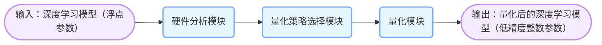

# 硬件感知量化技术在边缘AI设备中的优化应用

> 关键词：硬件感知量化技术、边缘AI设备、优化应用、量化算法、模型压缩

> 摘要：本文深入探讨了硬件感知量化技术在边缘AI设备中的优化应用。首先介绍了相关背景，包括目的范围、预期读者等内容。接着详细阐述了核心概念与联系，通过文本示意图和Mermaid流程图展示其原理和架构。在核心算法原理部分，使用Python源代码进行详细说明，并给出了对应的数学模型和公式。项目实战环节包含开发环境搭建、源代码实现及解读。随后分析了实际应用场景，推荐了学习资源、开发工具框架和相关论文著作。最后总结了未来发展趋势与挑战，并对常见问题进行了解答，还提供了扩展阅读与参考资料，旨在为相关领域的研究和实践提供全面而深入的指导。

## 1. 背景介绍 
### 1.1 目的和范围
随着人工智能技术的飞速发展，边缘AI设备在各个领域的应用越来越广泛，如智能安防、智能家居、工业监测等。然而，边缘AI设备通常具有资源受限的特点，如计算能力有限、存储容量小、功耗要求严格等。硬件感知量化技术作为一种有效的模型压缩和加速方法，可以在不显著损失模型性能的前提下，降低模型的计算复杂度和存储需求，从而更好地适配边缘AI设备。

本文的目的在于深入研究硬件感知量化技术在边缘AI设备中的优化应用，详细介绍其核心概念、算法原理、数学模型，并通过实际项目案例展示其具体应用过程。范围涵盖了硬件感知量化技术的基本原理、相关算法的实现、在边缘AI设备上的部署以及实际应用场景分析等方面。

### 1.2 预期读者
本文的预期读者主要包括人工智能领域的研究人员、工程师、开发者，以及对边缘计算和模型压缩技术感兴趣的技术爱好者。对于正在从事边缘AI设备开发、模型优化等相关工作的专业人士，本文可以提供有价值的技术参考和实践指导；对于初学者，本文可以帮助他们了解硬件感知量化技术的基本概念和应用场景，为进一步深入学习打下基础。

### 1.3 文档结构概述
本文将按照以下结构进行组织：
1. 背景介绍：阐述本文的目的和范围、预期读者以及文档结构概述，并对相关术语进行解释。
2. 核心概念与联系：介绍硬件感知量化技术的核心概念，通过文本示意图和Mermaid流程图展示其原理和架构。
3. 核心算法原理 & 具体操作步骤：详细讲解硬件感知量化技术的核心算法原理，使用Python源代码进行具体实现和说明。
4. 数学模型和公式 & 详细讲解 & 举例说明：给出硬件感知量化技术的数学模型和公式，并进行详细讲解和举例说明。
5. 项目实战：代码实际案例和详细解释说明：通过实际项目案例，介绍开发环境搭建、源代码实现和代码解读。
6. 实际应用场景：分析硬件感知量化技术在边缘AI设备中的实际应用场景。
7. 工具和资源推荐：推荐相关的学习资源、开发工具框架和论文著作。
8. 总结：未来发展趋势与挑战：总结硬件感知量化技术在边缘AI设备中的应用现状，分析未来发展趋势和面临的挑战。
9. 附录：常见问题与解答：对常见问题进行解答。
10. 扩展阅读 & 参考资料：提供扩展阅读材料和参考资料。

### 1.4 术语表
#### 1.4.1 核心术语定义
- **硬件感知量化技术**：一种考虑硬件特性的量化方法，在进行模型量化时充分结合硬件的计算能力、存储结构等特点，以实现模型在硬件上的高效运行。
- **边缘AI设备**：指在网络边缘侧进行人工智能计算的设备，如智能摄像头、智能传感器、嵌入式开发板等，具有实时性强、数据隐私保护好等优点。
- **模型量化**：将模型中的浮点参数和计算转换为低精度整数表示的过程，从而减少模型的存储需求和计算量。
- **量化算法**：用于实现模型量化的具体算法，如均匀量化、非均匀量化等。

#### 1.4.2 相关概念解释
- **模型压缩**：通过各种技术手段（如量化、剪枝、知识蒸馏等）减少模型的参数数量和计算量，以提高模型的运行效率和降低资源消耗。
- **硬件加速**：利用硬件的特定架构和功能（如GPU、FPGA等）来加速计算过程，提高计算效率。
- **深度学习模型**：基于神经网络的机器学习模型，具有强大的特征提取和模式识别能力，广泛应用于图像识别、语音识别、自然语言处理等领域。

#### 1.4.3 缩略词列表
- **AI**：Artificial Intelligence，人工智能
- **GPU**：Graphics Processing Unit，图形处理器
- **FPGA**：Field-Programmable Gate Array，现场可编程门阵列
- **CNN**：Convolutional Neural Network，卷积神经网络
- **RNN**：Recurrent Neural Network，循环神经网络

## 2. 核心概念与联系 
### 核心概念原理
硬件感知量化技术的核心思想是在进行模型量化时充分考虑硬件的特性，以实现模型在硬件上的高效运行。传统的量化方法通常只关注模型的精度和压缩率，而忽略了硬件的实际情况。例如，不同的硬件平台在计算能力、存储结构、数据传输带宽等方面存在差异，这些差异会影响量化模型的实际运行效率。

硬件感知量化技术通过对硬件的深入分析，选择合适的量化策略和参数，使得量化后的模型能够更好地适配硬件。具体来说，它可以根据硬件的计算单元特点，选择合适的量化位数和量化方式；根据硬件的存储结构，优化模型的存储布局，减少数据访问时间；根据硬件的数据传输带宽，合理安排数据的传输顺序和方式，提高数据传输效率。

### 架构的文本示意图
下面是硬件感知量化技术的架构文本示意图：

```plaintext
输入：深度学习模型（浮点参数）
|
|-- 硬件分析模块
|   |-- 分析硬件的计算能力、存储结构、数据传输带宽等特性
|
|-- 量化策略选择模块
|   |-- 根据硬件分析结果，选择合适的量化位数、量化方式等量化策略
|
|-- 量化模块
|   |-- 根据选择的量化策略，将深度学习模型的浮点参数量化为低精度整数参数
|
输出：量化后的深度学习模型（低精度整数参数）
```

### Mermaid流程图


这个流程图展示了硬件感知量化技术的主要流程，从输入深度学习模型开始，经过硬件分析、量化策略选择和量化模块，最终输出量化后的模型。

## 3. 核心算法原理 & 具体操作步骤 
### 核心算法原理
硬件感知量化技术的核心算法主要包括量化策略选择和量化过程。量化策略选择的目的是根据硬件的特性和模型的需求，选择合适的量化位数和量化方式。常见的量化位数有8位、4位、2位等，量化方式有均匀量化和非均匀量化等。

均匀量化是一种简单而常用的量化方式，它将浮点数据均匀地映射到有限的整数范围内。假设浮点数据的取值范围为 $[a, b]$，量化位数为 $n$，则量化公式为：

$$
q = \text{round}\left(\frac{x - a}{b - a} \times (2^n - 1)\right)
$$

其中，$x$ 是浮点数据，$q$ 是量化后的整数数据。反量化公式为：

$$
x' = a + \frac{q}{2^n - 1} \times (b - a)
$$

其中，$x'$ 是反量化后的浮点数据。

### 具体操作步骤
下面是使用Python实现均匀量化的具体代码：

```python
import numpy as np

def uniform_quantize(x, a, b, n):
    """
    均匀量化函数
    :param x: 输入的浮点数据
    :param a: 浮点数据的最小值
    :param b: 浮点数据的最大值
    :param n: 量化位数
    :return: 量化后的整数数据
    """
    scale = (b - a) / (2**n - 1)
    zero_point = round(-a / scale)
    q = np.round(x / scale + zero_point)
    q = np.clip(q, 0, 2**n - 1).astype(np.int32)
    return q

def uniform_dequantize(q, a, b, n):
    """
    均匀反量化函数
    :param q: 量化后的整数数据
    :param a: 浮点数据的最小值
    :param b: 浮点数据的最大值
    :param n: 量化位数
    :return: 反量化后的浮点数据
    """
    scale = (b - a) / (2**n - 1)
    zero_point = round(-a / scale)
    x = (q - zero_point) * scale
    return x

# 示例
x = np.random.randn(10)  # 生成随机浮点数据
a = np.min(x)
b = np.max(x)
n = 8  # 量化位数

q = uniform_quantize(x, a, b, n)
x_dequantized = uniform_dequantize(q, a, b, n)

print("Original data:", x)
print("Quantized data:", q)
print("Dequantized data:", x_dequantized)
```

### 代码解释
1. `uniform_quantize` 函数实现了均匀量化的过程，首先计算量化比例 `scale` 和零点 `zero_point`，然后将浮点数据 `x` 转换为整数数据 `q`，并进行裁剪以确保量化后的数据在合法范围内。
2. `uniform_dequantize` 函数实现了均匀反量化的过程，根据量化比例和零点将整数数据 `q` 转换为浮点数据 `x`。
3. 示例代码中，首先生成了随机浮点数据 `x`，然后计算其最小值 `a` 和最大值 `b`，选择量化位数 `n` 为 8。接着调用 `uniform_quantize` 函数进行量化，得到量化后的整数数据 `q`，再调用 `uniform_dequantize` 函数进行反量化，得到反量化后的浮点数据 `x_dequantized`。最后打印原始数据、量化数据和反量化数据。

## 4. 数学模型和公式 & 详细讲解 & 举例说明 
### 数学模型和公式
#### 均匀量化
如前面所述，均匀量化的量化公式为：

$$
q = \text{round}\left(\frac{x - a}{b - a} \times (2^n - 1)\right)
$$

反量化公式为：

$$
x' = a + \frac{q}{2^n - 1} \times (b - a)
$$

其中，$x$ 是浮点数据，$q$ 是量化后的整数数据，$x'$ 是反量化后的浮点数据，$a$ 和 $b$ 分别是浮点数据的最小值和最大值，$n$ 是量化位数。

#### 量化误差
量化过程会引入一定的误差，量化误差可以用均方误差（Mean Squared Error, MSE）来衡量。均方误差的计算公式为：

$$
\text{MSE} = \frac{1}{N} \sum_{i=1}^{N} (x_i - x_i')^2
$$

其中，$N$ 是数据的数量，$x_i$ 是原始浮点数据，$x_i'$ 是反量化后的浮点数据。

### 详细讲解
均匀量化的基本思想是将浮点数据的取值范围 $[a, b]$ 划分为 $2^n$ 个等间隔的区间，每个区间对应一个整数。量化过程就是将浮点数据映射到对应的整数上，反量化过程则是将整数还原为浮点数据。

量化误差的产生是由于量化过程中对浮点数据进行了离散化处理，导致部分信息丢失。量化位数 $n$ 越大，量化区间越细，量化误差越小，但模型的存储需求和计算量也会相应增加。因此，在实际应用中需要根据硬件的特性和模型的需求，选择合适的量化位数。

### 举例说明
假设浮点数据的取值范围为 $[0, 1]$，量化位数 $n = 2$，则量化区间为 $[0, 0.25)$、$[0.25, 0.5)$、$[0.5, 0.75)$、$[0.75, 1]$，对应的量化整数分别为 0、1、2、3。

对于浮点数据 $x = 0.3$，根据量化公式：

$$
q = \text{round}\left(\frac{0.3 - 0}{1 - 0} \times (2^2 - 1)\right) = \text{round}(0.3 \times 3) = \text{round}(0.9) = 1
$$

反量化后的浮点数据为：

$$
x' = 0 + \frac{1}{2^2 - 1} \times (1 - 0) = \frac{1}{3} \approx 0.333
$$

量化误差为：

$$
\text{MSE} = (0.3 - 0.333)^2 = 0.001089
$$

通过这个例子可以看出，量化过程会引入一定的误差，但在合适的量化位数下，误差可以控制在可接受的范围内。

## 5. 项目实战：代码实际案例和详细解释说明 
### 5.1  开发环境搭建
#### 硬件环境
- 边缘AI设备：选择一款常见的边缘AI开发板，如NVIDIA Jetson Nano。
- 计算机：用于代码开发和模型训练，推荐使用配置较高的台式机或笔记本电脑。

#### 软件环境
- 操作系统：在计算机上安装Ubuntu 18.04或更高版本，在边缘AI设备上安装适合的操作系统，如Jetson Nano上的JetPack。
- Python环境：安装Python 3.6或更高版本，并使用pip安装必要的库，如TensorFlow、PyTorch、NumPy等。

```bash
# 安装Python库
pip install tensorflow torch numpy
```

### 5.2  源代码详细实现和代码解读
#### 示例项目：使用硬件感知量化技术优化图像分类模型
本示例项目将使用TensorFlow框架，以ResNet-18模型为例，展示如何使用硬件感知量化技术对图像分类模型进行优化。

```python
import tensorflow as tf
from tensorflow.keras.applications.resnet_v2 import ResNet18V2
from tensorflow.keras.datasets import cifar10
from tensorflow.keras.utils import to_categorical
import numpy as np

# 加载数据集
(x_train, y_train), (x_test, y_test) = cifar10.load_data()
x_train = x_train.astype('float32') / 255.0
x_test = x_test.astype('float32') / 255.0
y_train = to_categorical(y_train, 10)
y_test = to_categorical(y_test, 10)

# 构建ResNet-18模型
model = ResNet18V2(weights=None, input_shape=(32, 32, 3), classes=10)
model.compile(optimizer='adam', loss='categorical_crossentropy', metrics=['accuracy'])

# 训练模型
model.fit(x_train, y_train, epochs=10, batch_size=32, validation_data=(x_test, y_test))

# 硬件感知量化
import tensorflow_model_optimization as tfmot

quantize_model = tfmot.quantization.keras.quantize_model
q_aware_model = quantize_model(model)
q_aware_model.compile(optimizer='adam', loss='categorical_crossentropy', metrics=['accuracy'])

# 微调量化感知模型
q_aware_model.fit(x_train[:1000], y_train[:1000], epochs=1, batch_size=32)

# 转换为量化模型
converter = tf.lite.TFLiteConverter.from_keras_model(q_aware_model)
converter.optimizations = [tf.lite.Optimize.DEFAULT]
tflite_quant_model = converter.convert()

# 保存量化后的模型
with open('resnet18_quant.tflite', 'wb') as f:
    f.write(tflite_quant_model)
```

#### 代码解读
1. **数据集加载**：使用 `cifar10.load_data()` 加载CIFAR-10数据集，并进行归一化处理和标签的one-hot编码。
2. **模型构建和训练**：构建ResNet-18模型，并使用 `model.compile()` 编译模型，然后使用 `model.fit()` 进行训练。
3. **硬件感知量化**：使用 `tfmot.quantization.keras.quantize_model` 对模型进行量化感知训练，得到量化感知模型 `q_aware_model`。
4. **微调量化感知模型**：使用少量数据对量化感知模型进行微调，以提高模型在量化后的性能。
5. **转换为量化模型**：使用 `tf.lite.TFLiteConverter` 将量化感知模型转换为TFLite量化模型。
6. **保存量化后的模型**：将量化后的模型保存为 `resnet18_quant.tflite` 文件。

### 5.3  代码解读与分析
#### 量化感知训练
量化感知训练是硬件感知量化技术的关键步骤之一。在量化感知训练过程中，模型的权重和激活值在训练时模拟量化过程，但实际存储和计算仍然使用浮点数据。这样可以让模型在训练过程中适应量化带来的误差，从而提高量化后模型的性能。

#### 模型转换
使用 `tf.lite.TFLiteConverter` 将量化感知模型转换为TFLite量化模型时，通过设置 `converter.optimizations = [tf.lite.Optimize.DEFAULT]` 可以自动选择合适的量化策略，如8位量化。

#### 性能分析
量化后的模型通常具有更小的存储体积和更快的推理速度，但可能会在一定程度上损失模型的精度。在实际应用中，需要根据具体需求权衡精度和性能之间的关系。

## 6. 实际应用场景 
### 智能安防
在智能安防领域，边缘AI设备如智能摄像头需要实时对监控画面进行分析，如目标检测、行为识别等。硬件感知量化技术可以对深度学习模型进行压缩和加速，使得模型能够在边缘设备上高效运行，减少数据传输延迟，提高系统的实时性和响应速度。同时，量化后的模型占用的存储空间更小，降低了设备的存储成本。

### 智能家居
智能家居设备如智能音箱、智能门锁等也需要具备一定的人工智能能力，如语音识别、图像识别等。硬件感知量化技术可以优化这些设备上的模型，使其在有限的计算资源和功耗下实现高效的推理，提高用户体验。例如，通过量化语音识别模型，可以减少智能音箱的唤醒时间和功耗。

### 工业监测
在工业监测领域，边缘AI设备可以对工业生产过程中的数据进行实时监测和分析，如设备状态监测、质量检测等。硬件感知量化技术可以提高模型在边缘设备上的运行效率，及时发现生产过程中的异常情况，保障生产的安全和稳定。同时，量化后的模型可以降低设备的计算负担，减少能源消耗。

## 7. 工具和资源推荐
### 7.1 学习资源推荐
#### 7.1.1 书籍推荐
- 《深度学习》（Deep Learning）：由Ian Goodfellow、Yoshua Bengio和Aaron Courville所著，是深度学习领域的经典教材，涵盖了深度学习的基本概念、算法和应用。
- 《Python深度学习》（Deep Learning with Python）：由Francois Chollet所著，介绍了如何使用Python和Keras框架进行深度学习开发，适合初学者。
- 《神经网络与深度学习》：由邱锡鹏所著，全面介绍了神经网络和深度学习的基本原理、算法和应用，是国内深度学习领域的优秀教材。

#### 7.1.2 在线课程
- Coursera上的“深度学习专项课程”（Deep Learning Specialization）：由Andrew Ng教授授课，包括深度学习基础、卷积神经网络、循环神经网络等多个课程，是学习深度学习的优质资源。
- edX上的“强化学习基础”（Fundamentals of Reinforcement Learning）：介绍了强化学习的基本概念、算法和应用，适合对强化学习感兴趣的学习者。
- 哔哩哔哩上的“李沐动手学深度学习”：由李沐老师主讲，通过实际代码演示的方式介绍深度学习的原理和应用，内容生动易懂。

#### 7.1.3 技术博客和网站
- Medium：是一个技术博客平台，上面有很多关于人工智能、深度学习的优质文章。
- arXiv：是一个预印本平台，提供了大量的最新学术研究论文，涵盖了人工智能、机器学习等多个领域。
- 机器之心：是一个专注于人工智能领域的媒体平台，提供了丰富的行业资讯、技术文章和研究报告。

### 7.2 开发工具框架推荐
#### 7.2.1 IDE和编辑器
- PyCharm：是一款专业的Python集成开发环境，具有代码编辑、调试、版本控制等功能，适合Python开发。
- Visual Studio Code：是一款轻量级的代码编辑器，支持多种编程语言，具有丰富的插件扩展功能，可用于深度学习开发。
- Jupyter Notebook：是一个交互式的编程环境，适合进行数据探索、模型训练和可视化等工作。

#### 7.2.2 调试和性能分析工具
- TensorBoard：是TensorFlow框架提供的可视化工具，可以用于监控模型的训练过程、查看模型的结构和性能指标等。
- PyTorch Profiler：是PyTorch框架提供的性能分析工具，可以用于分析模型的计算时间、内存使用情况等。
- NVIDIA Nsight Compute：是NVIDIA提供的性能分析工具，可用于GPU上的深度学习模型性能分析。

#### 7.2.3 相关框架和库
- TensorFlow：是Google开发的深度学习框架，具有丰富的工具和库，支持多种硬件平台，广泛应用于工业界和学术界。
- PyTorch：是Facebook开发的深度学习框架，具有动态图特性，易于使用和调试，受到很多研究人员的喜爱。
- TensorFlow Model Optimization Toolkit：是TensorFlow提供的模型优化工具包，包含了量化、剪枝等多种模型优化技术。

### 7.3 相关论文著作推荐
#### 7.3.1 经典论文
- “Deep Compression: Compressing Deep Neural Networks with Pruning, Trained Quantization and Huffman Coding”：提出了一种综合的模型压缩方法，包括剪枝、量化和哈夫曼编码，显著减少了模型的存储需求。
- “Quantization and Training of Neural Networks for Efficient Integer-Arithmetic-Only Inference”：介绍了一种量化训练方法，使得模型可以在整数运算下高效推理，同时保持较高的精度。
- “MobileNetV2: Inverted Residuals and Linear Bottlenecks”：提出了MobileNetV2架构，通过引入倒置残差结构和线性瓶颈层，提高了模型的计算效率。

#### 7.3.2 最新研究成果
- 在arXiv等预印本平台上搜索“Hardware-aware quantization”等关键词，可以获取最新的硬件感知量化技术研究成果。
- 关注顶级学术会议如NeurIPS、ICML、CVPR等，这些会议上会有很多关于硬件感知量化技术的最新研究论文。

#### 7.3.3 应用案例分析
- 一些科技公司的官方博客会分享他们在边缘AI设备上应用硬件感知量化技术的实际案例，如NVIDIA、Google等。
- 相关的技术论坛和社区也会有开发者分享自己的应用经验和案例，如Stack Overflow、GitHub等。

## 8. 总结：未来发展趋势与挑战
### 未来发展趋势
#### 更细粒度的量化
未来的硬件感知量化技术可能会朝着更细粒度的量化方向发展，如使用更低的量化位数（如2位、1位），以进一步减少模型的存储需求和计算量。同时，研究人员也会探索非均匀量化等更复杂的量化方式，以提高量化的精度。

#### 与硬件架构的深度融合
随着硬件技术的不断发展，硬件感知量化技术将与硬件架构进行更深度的融合。例如，硬件厂商可以在芯片设计阶段就考虑量化计算的需求，设计专门的量化计算单元，从而提高量化模型的运行效率。

#### 自动化量化策略选择
为了降低量化过程的复杂性，未来可能会出现自动化的量化策略选择工具。这些工具可以根据硬件的特性和模型的需求，自动选择合适的量化策略和参数，提高量化的效率和效果。

### 挑战
#### 量化精度损失
尽管硬件感知量化技术可以在一定程度上减少量化误差，但仍然难以完全避免量化精度损失的问题。在一些对精度要求较高的应用场景中，如医疗影像诊断、自动驾驶等，量化精度损失可能会影响模型的性能和可靠性。

#### 硬件兼容性
不同的硬件平台具有不同的特性和计算能力，硬件感知量化技术需要考虑硬件的兼容性问题。在将量化模型部署到不同的硬件平台上时，可能需要进行额外的优化和调整，以确保模型能够在不同硬件上高效运行。

#### 模型复杂性增加
随着深度学习模型的不断发展，模型的复杂性越来越高。硬件感知量化技术需要处理更复杂的模型结构和参数，这对算法的效率和性能提出了更高的要求。同时，复杂的模型也会增加量化过程的难度和计算量。

## 9. 附录：常见问题与解答
### 1. 硬件感知量化技术会显著降低模型的精度吗？
硬件感知量化技术在设计时会尽量减少量化对模型精度的影响。通过合理选择量化策略和进行量化感知训练，可以在不显著降低模型精度的前提下，实现模型的压缩和加速。但在某些情况下，如使用较低的量化位数，可能会导致一定程度的精度损失。

### 2. 如何选择合适的量化位数？
选择合适的量化位数需要综合考虑硬件的特性、模型的需求和精度要求。一般来说，较高的量化位数可以减少量化误差，但会增加模型的存储需求和计算量；较低的量化位数可以减少存储需求和计算量，但可能会导致精度损失。在实际应用中，可以通过实验来选择合适的量化位数。

### 3. 硬件感知量化技术适用于所有类型的深度学习模型吗？
硬件感知量化技术适用于大多数类型的深度学习模型，如卷积神经网络（CNN）、循环神经网络（RNN）等。但不同类型的模型在量化过程中可能会有不同的特点和挑战，需要根据具体情况进行调整和优化。

### 4. 如何评估量化模型的性能？
可以从多个方面评估量化模型的性能，如模型的精度、存储体积、推理速度、计算复杂度等。可以使用测试数据集对量化模型进行测试，比较量化前后模型的精度变化；使用工具测量量化模型的存储体积和推理速度，评估其在硬件上的运行效率。

## 10. 扩展阅读 & 参考资料
### 扩展阅读
- 《模型压缩与加速》：深入介绍了模型压缩和加速的各种技术，包括量化、剪枝、知识蒸馏等。
- 《边缘计算技术与应用》：介绍了边缘计算的基本概念、技术和应用场景，与硬件感知量化技术在边缘AI设备中的应用密切相关。

### 参考资料
- TensorFlow官方文档：https://www.tensorflow.org/
- PyTorch官方文档：https://pytorch.org/
- NVIDIA Jetson Nano开发者文档：https://developer.nvidia.com/embedded/jetson-nano-developer-kit

作者：AI天才研究院/AI Genius Institute & 禅与计算机程序设计艺术 /Zen And The Art of Computer Programming