# 确保AI Agent的安全性与隐私保护

> 关键词：AI Agent、安全性、隐私保护、安全机制、数据加密

> 摘要：本文围绕确保AI Agent的安全性与隐私保护展开深入探讨。首先介绍了相关背景，包括目的范围、预期读者等内容。接着阐述了AI Agent安全性与隐私保护的核心概念及其联系，分析了核心算法原理并给出具体操作步骤。通过数学模型和公式对关键问题进行详细讲解和举例说明。以实际项目为例，展示了代码实现和详细解读。探讨了AI Agent在不同场景下的实际应用，推荐了学习、开发工具等相关资源。最后总结了未来发展趋势与挑战，解答常见问题并提供扩展阅读与参考资料，旨在为保障AI Agent的安全与隐私提供全面的技术指导。

## 1. 背景介绍 
### 1.1 目的和范围
随着人工智能技术的飞速发展，AI Agent在各个领域得到了广泛应用。AI Agent能够自主地执行任务、与环境交互并做出决策，然而其安全性和隐私保护问题也日益凸显。本文的目的在于深入探讨如何确保AI Agent的安全性与隐私保护，涵盖了从理论原理到实际应用的多个方面，包括核心概念、算法原理、数学模型、项目实战以及实际应用场景等，旨在为开发者、研究人员和相关从业者提供全面的技术指导和解决方案。

### 1.2 预期读者
本文的预期读者包括人工智能领域的开发者、软件工程师、研究人员、安全专家以及对AI Agent安全性和隐私保护感兴趣的技术爱好者。对于那些正在从事或计划从事AI Agent开发和应用的人员，本文将提供有价值的技术信息和实践经验；对于安全专家而言，本文可以作为深入研究AI Agent安全问题的参考资料；对于技术爱好者，本文能够帮助他们了解AI Agent安全与隐私保护的基本概念和重要性。

### 1.3 文档结构概述
本文将按照以下结构进行组织：首先介绍背景信息，包括目的、预期读者和文档结构概述；接着阐述AI Agent安全性与隐私保护的核心概念及其联系，并给出相应的示意图和流程图；然后详细讲解核心算法原理和具体操作步骤，使用Python源代码进行说明；通过数学模型和公式对关键问题进行深入分析和举例；展示项目实战案例，包括开发环境搭建、源代码实现和代码解读；探讨AI Agent在实际应用场景中的安全与隐私保护问题；推荐相关的学习资源、开发工具和论文著作；最后总结未来发展趋势与挑战，解答常见问题并提供扩展阅读与参考资料。

### 1.4 术语表
#### 1.4.1 核心术语定义
- **AI Agent**：人工智能代理，是一种能够感知环境、自主决策并执行相应动作的软件实体。它可以通过学习和交互不断提高自身的性能和能力。
- **安全性**：指AI Agent在运行过程中能够抵御各种攻击和威胁，保证系统的正常运行和数据的完整性、可用性和保密性。
- **隐私保护**：确保AI Agent在处理和使用用户数据时，不会泄露用户的敏感信息，保护用户的个人隐私。
- **安全机制**：为了保障AI Agent的安全性而采用的各种技术和方法，如加密、认证、访问控制等。
- **数据加密**：将数据转换为密文的过程，只有拥有正确密钥的用户才能将其解密为明文，从而保证数据在传输和存储过程中的保密性。

#### 1.4.2 相关概念解释
- **威胁模型**：对AI Agent可能面临的各种威胁进行建模和分析，包括攻击者的动机、能力和攻击方式等，以便制定相应的安全策略。
- **零知识证明**：一种密码学技术，允许一方在不泄露任何额外信息的情况下，向另一方证明某个陈述是真实的。在AI Agent的隐私保护中具有重要应用。
- **差分隐私**：一种用于保护数据隐私的数学框架，通过在数据中添加噪声来降低个体信息的可识别性，同时保证数据的统计特性基本不变。

#### 1.4.3 缩略词列表
- **AI**：Artificial Intelligence，人工智能
- **ML**：Machine Learning，机器学习
- **DL**：Deep Learning，深度学习
- **SSL/TLS**：Secure Sockets Layer/Transport Layer Security，安全套接层/传输层安全协议
- **PKI**：Public Key Infrastructure，公钥基础设施

## 2. 核心概念与联系 

### 核心概念原理
#### AI Agent的基本概念
AI Agent是一种具有自主性、反应性、社会性和主动性的软件实体。它能够感知环境中的信息，根据自身的目标和知识进行决策，并采取相应的行动。AI Agent可以基于不同的技术实现，如规则引擎、机器学习和深度学习等。

#### 安全性的原理
AI Agent的安全性主要涉及到对系统的保护，防止其受到各种攻击和威胁。这些攻击可能来自外部的恶意攻击者，也可能来自内部的误操作或漏洞。为了确保安全性，需要采用多种安全机制，如身份认证、访问控制、数据加密、入侵检测等。

#### 隐私保护的原理
隐私保护的核心是确保AI Agent在处理和使用用户数据时，不会泄露用户的敏感信息。这可以通过数据加密、匿名化、差分隐私等技术来实现。同时，还需要建立严格的数据使用规则和访问控制机制，确保只有授权的人员才能访问和处理用户数据。

### 架构的文本示意图
```plaintext
+---------------------+
|      AI Agent       |
| +-----------------+ |
| |    Perception   | |
| +-----------------+ |
| |    Decision     | |
| +-----------------+ |
| |    Action       | |
| +-----------------+ |
|                     |
| +-----------------+ |
| |   Security       | |
| |  Mechanisms     | |
| +-----------------+ |
| |   Privacy        | |
| |  Protection     | |
| +-----------------+ |
+---------------------+
```
该示意图展示了AI Agent的基本架构，包括感知、决策和行动三个主要模块，以及安全机制和隐私保护模块。安全机制和隐私保护贯穿于AI Agent的整个生命周期，确保其安全性和用户数据的隐私。

### Mermaid流程图

```mermaid
graph LR
    classDef startend fill:#F5EBFF,stroke:#BE8FED,stroke-width:2px;
    classDef process fill:#E5F6FF,stroke:#73A6FF,stroke-width:2px;
    classDef decision fill:#FFF6CC,stroke:#FFBC52,stroke-width:2px;

    A([Start]):::startend --> B(AI Agent Initialization):::process
    B --> C{Is Data Encrypted?}:::decision
    C -->|Yes| D(Proceed with Normal Operation):::process
    C -->|No| E(Encrypt Data):::process
    E --> D
    D --> F{Is User Authenticated?}:::decision
    F -->|Yes| G(Allow Access to Data):::process
    F -->|No| H(Authenticate User):::process
    H --> G
    G --> I{Is There a Security Threat?}:::decision
    I -->|Yes| J(Activate Security Mechanisms):::process
    I -->|No| K(Continue Normal Operation):::process
    J --> K
    K --> L(Perform Actions):::process
    L --> M{Is Privacy Protected?}:::decision
    M -->|Yes| N(Complete Task):::process
    M -->|No| O(Apply Privacy Protection Techniques):::process
    O --> N
    N --> P([End]):::startend
```

该流程图展示了AI Agent在运行过程中确保安全性和隐私保护的主要流程。从初始化开始，首先检查数据是否加密，然后进行用户认证，接着检测是否存在安全威胁，最后检查隐私是否得到保护。如果在任何环节发现问题，将采取相应的措施进行处理，直到任务完成。

## 3. 核心算法原理 & 具体操作步骤 

### 核心算法原理
#### 数据加密算法
数据加密是保障AI Agent数据安全的重要手段。常见的数据加密算法包括对称加密算法和非对称加密算法。

**对称加密算法**：使用相同的密钥进行加密和解密。常见的对称加密算法有AES（Advanced Encryption Standard）。AES算法的核心是通过一系列的置换和替换操作，将明文转换为密文。其加密过程可以表示为：
```python
from Crypto.Cipher import AES
from Crypto.Random import get_random_bytes

# 生成随机密钥
key = get_random_bytes(16)
# 初始化加密器
cipher = AES.new(key, AES.MODE_EAX)
# 待加密的数据
data = b"Hello, World!"
# 加密数据
ciphertext, tag = cipher.encrypt_and_digest(data)
```

**非对称加密算法**：使用公钥和私钥进行加密和解密。常见的非对称加密算法有RSA。RSA算法基于大整数分解的困难性，公钥用于加密，私钥用于解密。其加密过程可以表示为：
```python
from Crypto.PublicKey import RSA
from Crypto.Cipher import PKCS1_OAEP

# 生成密钥对
key = RSA.generate(2048)
private_key = key.export_key()
public_key = key.publickey().export_key()

# 加载公钥
recipient_key = RSA.import_key(public_key)
cipher_rsa = PKCS1_OAEP.new(recipient_key)

# 待加密的数据
data = b"Hello, World!"
# 加密数据
enc_data = cipher_rsa.encrypt(data)
```

#### 身份认证算法
身份认证用于验证用户的身份，确保只有合法的用户才能访问AI Agent的资源。常见的身份认证算法有基于密码的认证和基于数字证书的认证。

**基于密码的认证**：用户输入用户名和密码，系统将其与预先存储的密码进行比对。可以使用哈希函数对密码进行加密存储，以提高安全性。
```python
import hashlib

# 存储的哈希密码
stored_password_hash = hashlib.sha256(b"password123").hexdigest()

# 用户输入的密码
user_password = b"password123"
# 计算用户输入密码的哈希值
user_password_hash = hashlib.sha256(user_password).hexdigest()

# 比对哈希值
if user_password_hash == stored_password_hash:
    print("Authentication successful")
else:
    print("Authentication failed")
```

**基于数字证书的认证**：使用数字证书来验证用户的身份。数字证书由可信的证书颁发机构（CA）颁发，包含了用户的公钥和其他身份信息。
```python
import ssl

# 创建SSL上下文
context = ssl.create_default_context(ssl.Purpose.CLIENT_AUTH)
# 加载服务器证书和私钥
context.load_cert_chain(certfile="server.crt", keyfile="server.key")

# 建立SSL连接
with socket.socket(socket.AF_INET, socket.SOCK_STREAM) as s:
    s.bind(('localhost', 443))
    s.listen(1)
    conn, addr = s.accept()
    with context.wrap_socket(conn, server_side=True) as ssock:
        # 进行身份认证
        cert = ssock.getpeercert()
        if cert:
            print("Authentication successful")
        else:
            print("Authentication failed")
```

### 具体操作步骤
#### 数据加密操作步骤
1. 选择合适的加密算法，如AES或RSA。
2. 生成加密密钥，对于对称加密算法，生成一个随机的密钥；对于非对称加密算法，生成公钥和私钥对。
3. 初始化加密器，使用生成的密钥进行初始化。
4. 对待加密的数据进行加密操作，得到密文。

#### 身份认证操作步骤
1. 选择合适的身份认证方式，如基于密码的认证或基于数字证书的认证。
2. 如果是基于密码的认证，用户输入用户名和密码，系统将其与预先存储的密码进行比对；如果是基于数字证书的认证，用户提供数字证书，系统验证证书的有效性。
3. 根据认证结果，决定是否允许用户访问AI Agent的资源。

## 4. 数学模型和公式 & 详细讲解 & 举例说明 

### 数据加密的数学模型
#### 对称加密模型
对称加密可以用一个简单的数学模型来表示。设明文为 $P$，密钥为 $K$，加密函数为 $E$，密文为 $C$，则加密过程可以表示为：
$$C = E(P, K)$$
解密过程可以表示为：
$$P = D(C, K)$$
其中 $D$ 为解密函数，且满足 $D(E(P, K), K) = P$。

例如，在AES算法中，加密函数 $E$ 是一个复杂的置换和替换操作的组合，密钥 $K$ 用于控制这些操作的参数。

#### 非对称加密模型
非对称加密使用公钥 $K_p$ 和私钥 $K_s$。设明文为 $P$，加密函数为 $E$，密文为 $C$，则加密过程可以表示为：
$$C = E(P, K_p)$$
解密过程可以表示为：
$$P = D(C, K_s)$$
其中 $D$ 为解密函数，且满足 $D(E(P, K_p), K_s) = P$。

例如，在RSA算法中，公钥 $K_p$ 由两个大质数 $p$ 和 $q$ 以及一个公开指数 $e$ 组成，私钥 $K_s$ 由 $p$、$q$ 和一个秘密指数 $d$ 组成。加密和解密过程基于模幂运算。

### 差分隐私的数学模型
差分隐私是一种用于保护数据隐私的数学框架。设 $D$ 和 $D'$ 是两个相邻的数据集（即它们只在一个记录上不同），机制 $M$ 是一个随机算法，用于处理数据集并输出结果。机制 $M$ 满足 $\epsilon$-差分隐私，如果对于任意的输出 $S$，有：
$$\frac{Pr[M(D) \in S]}{Pr[M(D') \in S]} \leq e^{\epsilon}$$
其中 $\epsilon$ 是差分隐私的参数，控制了隐私保护的程度。$\epsilon$ 越小，隐私保护程度越高，但数据的可用性可能会降低。

例如，假设我们有一个数据集 $D$ 包含用户的年龄信息，我们想要计算年龄的平均值。为了保护用户的隐私，我们可以使用差分隐私机制 $M$，在计算平均值时添加一定的噪声。设 $M(D)$ 是添加噪声后的平均值，$M(D')$ 是相邻数据集 $D'$ 添加噪声后的平均值，那么根据差分隐私的定义，对于任意的输出区间 $S$，上述不等式都应该成立。

### 举例说明
#### 对称加密举例
假设我们使用AES算法对一个字符串 "Hello, World!" 进行加密。密钥长度为128位（16字节），加密模式为EAX。

```python
from Crypto.Cipher import AES
from Crypto.Random import get_random_bytes

# 生成随机密钥
key = get_random_bytes(16)
# 初始化加密器
cipher = AES.new(key, AES.MODE_EAX)
# 待加密的数据
data = b"Hello, World!"
# 加密数据
ciphertext, tag = cipher.encrypt_and_digest(data)

# 初始化解密器
nonce = cipher.nonce
cipher = AES.new(key, AES.MODE_EAX, nonce)
# 解密数据
try:
    decrypted_data = cipher.decrypt_and_verify(ciphertext, tag)
    print("Decrypted data:", decrypted_data.decode())
except ValueError:
    print("Data is corrupted or tampered with")
```
在这个例子中，我们首先生成一个随机的128位密钥，然后使用AES算法的EAX模式对字符串 "Hello, World!" 进行加密。加密后得到密文和标签。接着，我们使用相同的密钥和随机数对密文进行解密，并验证标签的有效性。如果标签验证通过，则输出解密后的明文。

#### 差分隐私举例
假设我们有一个数据集 $D$ 包含100个用户的年龄信息，我们想要计算年龄的平均值。为了保护用户的隐私，我们使用拉普拉斯机制添加噪声。

```python
import numpy as np

# 数据集
ages = np.random.randint(18, 60, 100)
# 真实平均值
true_mean = np.mean(ages)

# 差分隐私参数
epsilon = 0.1
# 敏感度（年龄的最大变化为1）
sensitivity = 1
# 拉普拉斯噪声
noise = np.random.laplace(0, sensitivity / epsilon)
# 添加噪声后的平均值
noisy_mean = true_mean + noise

print("True mean:", true_mean)
print("Noisy mean:", noisy_mean)
```
在这个例子中，我们首先生成一个包含100个随机年龄的数据集，然后计算真实的年龄平均值。接着，我们设置差分隐私参数 $\epsilon$ 为0.1，敏感度为1（因为年龄的最大变化为1）。使用拉普拉斯机制生成噪声，并将其添加到真实平均值上，得到添加噪声后的平均值。通过这种方式，我们在一定程度上保护了用户的隐私。

## 5. 项目实战：代码实际案例和详细解释说明 

### 5.1  开发环境搭建
#### 操作系统
建议使用Linux系统，如Ubuntu 20.04或更高版本，因为Linux系统在开发和部署方面具有更好的稳定性和兼容性。

#### Python环境
安装Python 3.8或更高版本。可以使用以下命令在Ubuntu系统上安装Python 3.8：
```bash
sudo apt update
sudo apt install python3.8
```

#### 依赖库安装
安装必要的Python库，如`pycryptodome`用于加密操作，`requests`用于网络请求，`flask`用于搭建Web服务。可以使用以下命令进行安装：
```bash
pip install pycryptodome requests flask
```

### 5.2  源代码详细实现和代码解读
#### 项目概述
我们将实现一个简单的AI Agent系统，该系统可以接收用户的请求，对请求进行加密处理，验证用户的身份，然后返回处理结果。

#### 代码实现

```python
from flask import Flask, request
from Crypto.Cipher import AES
from Crypto.Random import get_random_bytes
import hashlib

app = Flask(__name__)

# 存储的哈希密码
stored_password_hash = hashlib.sha256(b"password123").hexdigest()

# 生成随机密钥
key = get_random_bytes(16)

@app.route('/process_request', methods=['POST'])
def process_request():
    # 获取用户输入的密码
    user_password = request.form.get('password')
    # 计算用户输入密码的哈希值
    user_password_hash = hashlib.sha256(user_password.encode()).hexdigest()

    # 身份认证
    if user_password_hash!= stored_password_hash:
        return "Authentication failed", 401

    # 获取用户请求数据
    data = request.form.get('data').encode()

    # 加密数据
    cipher = AES.new(key, AES.MODE_EAX)
    ciphertext, tag = cipher.encrypt_and_digest(data)

    # 处理请求（这里简单返回加密后的数据）
    response = {
        'ciphertext': ciphertext.hex(),
        'tag': tag.hex(),
        'nonce': cipher.nonce.hex()
    }

    return response, 200

if __name__ == '__main__':
    app.run(debug=True)
```

#### 代码解读
1. **导入必要的库**：导入`flask`用于搭建Web服务，`Crypto.Cipher`和`Crypto.Random`用于加密操作，`hashlib`用于密码哈希处理。
2. **初始化Flask应用**：创建一个Flask应用实例。
3. **存储哈希密码**：将用户的密码进行哈希处理并存储。
4. **生成加密密钥**：生成一个随机的128位密钥，用于数据加密。
5. **定义路由**：定义一个`/process_request`的POST请求路由，用于处理用户的请求。
6. **身份认证**：获取用户输入的密码，计算其哈希值，并与存储的哈希密码进行比对。如果比对失败，返回认证失败的信息。
7. **数据加密**：如果身份认证成功，获取用户请求的数据，使用AES算法的EAX模式对数据进行加密。
8. **返回响应**：将加密后的密文、标签和随机数返回给用户。

### 5.3  代码解读与分析
#### 安全性分析
- **身份认证**：使用哈希密码进行身份认证，避免了明文密码的存储和传输，提高了密码的安全性。
- **数据加密**：使用AES算法对用户请求的数据进行加密，确保数据在传输过程中的保密性和完整性。

#### 可扩展性分析
- **加密算法**：可以根据实际需求选择不同的加密算法，如RSA、ChaCha20等。
- **身份认证方式**：可以扩展为基于数字证书的认证或多因素认证，提高身份认证的安全性。

#### 性能分析
- **加密操作**：AES算法的加密和解密速度较快，对于大多数应用场景来说，性能是可以接受的。
- **Web服务**：Flask是一个轻量级的Web框架，性能较好，可以处理大量的并发请求。

## 6. 实际应用场景 
### 智能家居领域
在智能家居系统中，AI Agent可以控制各种智能设备，如灯光、门锁、空调等。为了确保用户的隐私和设备的安全，需要对用户与AI Agent之间的通信进行加密处理，防止数据泄露和恶意攻击。同时，对用户的身份进行认证，只有合法的用户才能控制智能设备。例如，用户可以通过手机APP向AI Agent发送控制指令，APP与AI Agent之间的通信使用SSL/TLS协议进行加密，确保数据的安全性。

### 金融领域
在金融领域，AI Agent可以用于风险评估、投资决策等。为了保护用户的金融信息和交易安全，需要对用户的个人信息和交易数据进行严格的隐私保护和安全处理。例如，银行可以使用AI Agent对客户的信用风险进行评估，在处理客户数据时，采用差分隐私技术对数据进行匿名化处理，同时使用加密算法对数据进行加密存储和传输，防止数据泄露和篡改。

### 医疗领域
在医疗领域，AI Agent可以辅助医生进行诊断和治疗。为了保护患者的隐私和医疗数据的安全，需要对患者的个人信息和医疗记录进行严格的保护。例如，医院可以使用AI Agent对患者的病历进行分析，在处理病历数据时，采用数据加密和访问控制技术，确保只有授权的医生才能访问和处理患者的病历信息。

### 工业互联网领域
在工业互联网领域，AI Agent可以用于设备监控、故障预测等。为了确保工业设备的安全运行和数据的保密性，需要对AI Agent与工业设备之间的通信进行加密处理，同时对AI Agent的访问权限进行严格控制。例如，工厂可以使用AI Agent对生产设备进行实时监控，AI Agent与设备之间的通信使用工业级的加密协议进行加密，防止数据被窃取和篡改。

## 7. 工具和资源推荐
### 7.1 学习资源推荐
#### 7.1.1 书籍推荐
- 《Python密码学编程》：本书详细介绍了Python中各种密码学算法的实现和应用，包括对称加密、非对称加密、哈希函数等，对于学习AI Agent的安全性和隐私保护非常有帮助。
- 《人工智能安全》：全面介绍了人工智能领域的安全问题和解决方案，包括AI Agent的安全性、对抗攻击、隐私保护等方面的内容。
- 《隐私计算：原理、技术与应用》：深入探讨了隐私计算的原理、技术和应用，如差分隐私、同态加密等，对于理解AI Agent的隐私保护技术有很大的帮助。

#### 7.1.2 在线课程
- Coursera上的“Cryptography”课程：由斯坦福大学教授讲授，系统地介绍了密码学的基本原理和应用，包括对称加密、非对称加密、数字签名等内容。
- edX上的“Artificial Intelligence: Ethics and Safety”课程：探讨了人工智能领域的伦理和安全问题，包括AI Agent的安全性和隐私保护等方面的内容。
- Udemy上的“Python for Cybersecurity”课程：通过实际案例介绍了Python在网络安全领域的应用，包括加密、认证、漏洞扫描等方面的内容。

#### 7.1.3 技术博客和网站
- Crypto Stack Exchange：一个专门讨论密码学问题的问答社区，用户可以在这里提出和解答各种密码学相关的问题。
- Schneier on Security：著名密码学家Bruce Schneier的博客，分享了大量关于网络安全和密码学的文章和观点。
- Towards Data Science：一个专注于数据科学和人工智能的技术博客，经常发布关于AI Agent安全性和隐私保护的文章。

### 7.2 开发工具框架推荐
#### 7.2.1 IDE和编辑器
- PyCharm：一款功能强大的Python集成开发环境，提供了代码编辑、调试、版本控制等功能，对于开发AI Agent相关的Python代码非常方便。
- Visual Studio Code：一个轻量级的代码编辑器，支持多种编程语言和插件扩展，具有丰富的代码编辑和调试功能。
- Jupyter Notebook：一个交互式的开发环境，适合进行数据分析和机器学习实验，对于研究AI Agent的算法和模型非常有用。

#### 7.2.2 调试和性能分析工具
- PDB：Python自带的调试器，可以帮助开发者定位和解决代码中的问题。
- cProfile：Python的性能分析工具，可以分析代码的运行时间和内存使用情况，帮助开发者优化代码性能。
- Wireshark：一款网络协议分析工具，可以捕获和分析网络数据包，对于调试AI Agent与外部系统之间的通信非常有帮助。

#### 7.2.3 相关框架和库
- Pycryptodome：一个Python密码学库，提供了各种密码学算法的实现，如AES、RSA、SHA等，方便开发者进行加密和解密操作。
- TensorFlow Privacy：一个用于实现差分隐私的TensorFlow扩展库，可以帮助开发者在机器学习模型中应用差分隐私技术。
- Flask：一个轻量级的Python Web框架，适合快速搭建AI Agent的Web服务。

### 7.3 相关论文著作推荐
#### 7.3.1 经典论文
- “A Method for Obtaining Digital Signatures and Public-Key Cryptosystems”：RSA算法的经典论文，介绍了非对称加密算法RSA的原理和实现。
- “Differential Privacy”：差分隐私的经典论文，提出了差分隐私的概念和基本理论。
- “The Security of Practical Cryptosystems”：讨论了实际密码系统的安全性问题，对于理解AI Agent的安全机制有重要的参考价值。

#### 7.3.2 最新研究成果
- 关注ACM SIGSAC、IEEE Security & Privacy等顶级安全会议的最新研究成果，了解AI Agent安全性和隐私保护领域的最新技术和方法。
- 关注知名学术期刊，如Journal of Cryptology、ACM Transactions on Privacy and Security等，获取该领域的最新研究论文。

#### 7.3.3 应用案例分析
- 研究一些实际应用中的AI Agent安全和隐私保护案例，如谷歌的TensorFlow Privacy在实际项目中的应用，了解如何将理论知识应用到实际场景中。
- 分析一些安全漏洞和攻击事件，如AI Agent的对抗攻击案例，从中吸取教训，提高AI Agent的安全性。

## 8. 总结：未来发展趋势与挑战
### 未来发展趋势
#### 多模态安全技术融合
未来，AI Agent的安全性和隐私保护将不再依赖单一的技术，而是多种安全技术的融合。例如，将加密技术、身份认证技术、访问控制技术和人工智能技术相结合，构建更加全面和智能的安全防护体系。通过人工智能技术可以实时监测和分析系统的安全状态，自动识别和应对各种安全威胁。

#### 隐私增强计算技术的发展
隐私增强计算技术，如同态加密、差分隐私、零知识证明等，将在AI Agent的隐私保护中发挥越来越重要的作用。这些技术可以在不泄露数据隐私的前提下，实现数据的计算和分析，为AI Agent在处理敏感数据时提供更加有效的隐私保护解决方案。

#### 标准化和合规化
随着AI Agent在各个领域的广泛应用，相关的安全和隐私标准将逐渐完善。企业和组织需要遵守这些标准和法规，确保AI Agent的开发和应用符合安全和隐私要求。同时，标准化也有助于不同系统之间的互操作性和数据共享，促进AI Agent技术的健康发展。

### 挑战
#### 对抗攻击的威胁
AI Agent容易受到对抗攻击的影响，攻击者可以通过精心设计的输入数据来误导AI Agent的决策。例如，在图像识别系统中，攻击者可以对图像进行微小的修改，使得AI Agent将图像误分类。如何有效地检测和防御对抗攻击是AI Agent安全性面临的一个重要挑战。

#### 隐私保护与数据可用性的平衡
在保护用户隐私的同时，需要保证AI Agent能够获取足够的数据进行学习和决策。然而，隐私保护技术往往会对数据的可用性产生一定的影响。例如，差分隐私技术通过添加噪声来保护数据隐私，但噪声的添加可能会降低数据的质量和准确性。如何在隐私保护和数据可用性之间找到一个平衡点是一个亟待解决的问题。

#### 法律法规和伦理问题
随着AI Agent技术的发展，相关的法律法规和伦理问题也日益凸显。例如，如何界定AI Agent的责任和义务，如何保护用户的隐私和权益，如何避免AI Agent的滥用等。制定合理的法律法规和伦理准则，引导AI Agent技术的健康发展是一个重要的挑战。

## 9. 附录：常见问题与解答
### 问题1：AI Agent的安全性和隐私保护有什么区别？
**解答**：AI Agent的安全性主要关注系统的正常运行和数据的完整性、可用性和保密性，防止系统受到各种攻击和威胁，如恶意软件攻击、网络入侵等。而隐私保护则侧重于保护用户的个人隐私，确保AI Agent在处理和使用用户数据时，不会泄露用户的敏感信息，如个人身份、健康信息等。

### 问题2：如何选择合适的加密算法？
**解答**：选择合适的加密算法需要考虑多个因素，如安全性、性能、应用场景等。对于对称加密算法，AES是一种常用的选择，它具有较高的安全性和性能，适用于大量数据的加密。对于非对称加密算法，RSA是一种经典的算法，适用于密钥交换和数字签名等场景。在选择加密算法时，还需要考虑算法的密钥长度、加密模式等参数。

### 问题3：差分隐私技术会影响AI Agent的性能吗？
**解答**：差分隐私技术通过添加噪声来保护数据隐私，在一定程度上会影响AI Agent的性能。噪声的添加可能会降低数据的质量和准确性，从而影响AI Agent的学习和决策能力。然而，通过合理选择差分隐私参数和优化算法，可以在保证隐私保护的前提下，尽量减少对性能的影响。

### 问题4：如何确保AI Agent的身份认证安全？
**解答**：确保AI Agent的身份认证安全可以采取多种措施。首先，可以使用强密码或多因素认证方式，如密码加短信验证码、指纹识别等。其次，可以使用数字证书进行身份认证，确保用户的身份信息的真实性和完整性。此外，还可以定期更新密码和证书，加强对认证过程的监控和审计。

## 10. 扩展阅读 & 参考资料
### 扩展阅读
- 《密码学原理与实践》：深入介绍了密码学的基本原理和实践应用，对于进一步学习AI Agent的加密技术非常有帮助。
- 《人工智能：现代方法》：全面介绍了人工智能的基本概念、算法和应用，对于理解AI Agent的工作原理和技术背景有很大的帮助。
- 《网络安全技术与应用》：介绍了网络安全的各种技术和应用，包括防火墙、入侵检测、加密技术等，对于学习AI Agent的网络安全防护有重要的参考价值。

### 参考资料
- NIST（National Institute of Standards and Technology）的官方网站：提供了各种密码学标准和指南，如AES算法的标准文档。
- IETF（Internet Engineering Task Force）的官方网站：发布了许多网络协议和安全标准，如SSL/TLS协议的相关文档。
- IEEE（Institute of Electrical and Electronics Engineers）和ACM（Association for Computing Machinery）的数字图书馆：提供了大量的学术论文和研究报告，涵盖了人工智能、密码学、网络安全等多个领域。

作者：AI天才研究院/AI Genius Institute & 禅与计算机程序设计艺术 /Zen And The Art of Computer Programming