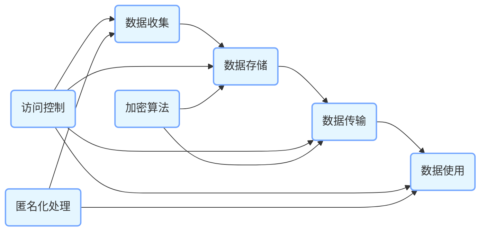

# 确保投资理财智能助手的数据安全与隐私保护

> 关键词：投资理财智能助手、数据安全、隐私保护、加密算法、访问控制

> 摘要：本文聚焦于投资理财智能助手的数据安全与隐私保护问题。首先介绍了相关背景，包括目的范围、预期读者等。接着阐述了核心概念与联系，分析了核心算法原理及操作步骤，并给出了相应的数学模型和公式。通过项目实战展示了如何在实际中保障数据安全与隐私，探讨了实际应用场景。还推荐了相关的工具和资源，最后总结了未来发展趋势与挑战，解答了常见问题并提供了扩展阅读和参考资料，旨在为保障投资理财智能助手的数据安全与隐私提供全面的技术指导和理论支持。

## 1. 背景介绍 
### 1.1 目的和范围
随着金融科技的快速发展，投资理财智能助手越来越受到投资者的青睐。这些智能助手能够根据用户的投资目标、风险偏好等信息，为用户提供个性化的投资建议和服务。然而，投资理财智能助手涉及大量敏感的用户数据，如个人身份信息、财务状况、投资交易记录等。确保这些数据的安全与隐私保护至关重要，否则可能导致用户信息泄露、财产损失等严重后果。本文的目的是深入探讨如何保障投资理财智能助手的数据安全与隐私保护，涵盖从数据的收集、存储、传输到使用的整个生命周期。

### 1.2 预期读者
本文主要面向从事投资理财智能助手开发、运营和安全管理的专业人员，包括软件工程师、安全专家、金融分析师等。同时，对于关注个人数据安全和隐私保护的投资者也具有一定的参考价值。

### 1.3 文档结构概述
本文将按照以下结构进行阐述：首先介绍核心概念与联系，包括数据安全与隐私保护的基本原理和架构；接着详细讲解核心算法原理和具体操作步骤，并用 Python 代码进行示例；然后给出相关的数学模型和公式，并举例说明；通过项目实战展示如何在实际中实现数据安全与隐私保护；探讨投资理财智能助手在不同场景下的数据安全与隐私保护应用；推荐相关的学习资源、开发工具和论文著作；最后总结未来发展趋势与挑战，解答常见问题并提供扩展阅读和参考资料。

### 1.4 术语表
#### 1.4.1 核心术语定义
- **投资理财智能助手**：利用人工智能技术，为用户提供投资理财建议、市场分析、资产配置等服务的软件系统。
- **数据安全**：保护数据免受未经授权的访问、使用、披露、破坏、更改或泄露，确保数据的完整性、可用性和保密性。
- **隐私保护**：确保个人敏感信息不被非法收集、使用、共享或公开，保障个人的隐私权益。
- **加密算法**：用于对数据进行加密处理，将明文转换为密文，以防止数据在传输和存储过程中被窃取或篡改的算法。
- **访问控制**：根据用户的身份和权限，对系统资源的访问进行限制和管理，确保只有授权用户能够访问特定的数据和功能。

#### 1.4.2 相关概念解释
- **对称加密**：使用相同的密钥进行加密和解密的加密算法，如 AES（高级加密标准）。
- **非对称加密**：使用一对密钥，即公钥和私钥，公钥用于加密，私钥用于解密的加密算法，如 RSA。
- **哈希函数**：将任意长度的数据映射为固定长度的哈希值的函数，常用于数据完整性验证和密码存储。
- **差分隐私**：一种在数据发布过程中保护个人隐私的技术，通过在数据中添加噪声来降低个体信息的可识别性。

#### 1.4.3 缩略词列表
- **AES**：Advanced Encryption Standard（高级加密标准）
- **RSA**：Rivest–Shamir–Adleman（一种非对称加密算法）
- **SSL/TLS**：Secure Sockets Layer/Transport Layer Security（安全套接层/传输层安全协议）
- **GDPR**：General Data Protection Regulation（通用数据保护条例）

## 2. 核心概念与联系 

### 数据安全与隐私保护的原理
数据安全与隐私保护的核心原理是通过一系列的技术和管理措施，确保数据在整个生命周期内的保密性、完整性和可用性。保密性是指只有授权用户能够访问数据；完整性是指数据在传输和存储过程中不被篡改；可用性是指数据在需要时能够被及时访问和使用。

### 架构示意图

该流程图展示了投资理财智能助手数据的整个生命周期，包括数据收集、存储、传输和使用。同时，访问控制、加密算法和匿名化处理等技术措施贯穿整个过程，以保障数据的安全与隐私。

### 核心概念联系
数据安全和隐私保护是相互关联的概念。数据安全是隐私保护的基础，只有确保数据的安全，才能有效保护用户的隐私。而隐私保护则是数据安全的重要目标之一，通过采取隐私保护措施，可以进一步增强数据的安全性。例如，加密算法既可以用于保护数据的安全，也可以在一定程度上保护用户的隐私，因为加密后的数据即使被窃取，攻击者也无法直接获取其中的敏感信息。

## 3. 核心算法原理 & 具体操作步骤 

### 加密算法原理
#### 对称加密算法（AES）
AES 是一种对称加密算法，其核心思想是使用相同的密钥对数据进行加密和解密。AES 算法的加密过程包括多轮的替换、置换和混合操作，通过这些操作将明文转换为密文。

以下是使用 Python 的`pycryptodome`库实现 AES 加密和解密的示例代码：
```python
from Crypto.Cipher import AES
from Crypto.Util.Padding import pad, unpad
import os

# 生成随机密钥
key = os.urandom(16)  # 16字节（128位）密钥

# 初始化向量
iv = os.urandom(AES.block_size)

# 待加密的明文
plaintext = b"Hello, World! This is a test."

# 创建 AES 加密器
cipher = AES.new(key, AES.MODE_CBC, iv)

# 对明文进行填充
padded_plaintext = pad(plaintext, AES.block_size)

# 加密
ciphertext = cipher.encrypt(padded_plaintext)

# 创建 AES 解密器
decipher = AES.new(key, AES.MODE_CBC, iv)

# 解密
decrypted_data = decipher.decrypt(ciphertext)

# 去除填充
unpadded_decrypted_data = unpad(decrypted_data, AES.block_size)

print("Original Plaintext:", plaintext)
print("Decrypted Plaintext:", unpadded_decrypted_data)
```
#### 非对称加密算法（RSA）
RSA 是一种非对称加密算法，使用一对密钥，即公钥和私钥。公钥可以公开，用于加密数据；私钥必须保密，用于解密数据。RSA 算法的安全性基于大整数分解的困难性。

以下是使用 Python 的`cryptography`库实现 RSA 加密和解密的示例代码：
```python
from cryptography.hazmat.backends import default_backend
from cryptography.hazmat.primitives.asymmetric import rsa, padding
from cryptography.hazmat.primitives import serialization, hashes

# 生成私钥
private_key = rsa.generate_private_key(
    public_exponent=65537,
    key_size=2048,
    backend=default_backend()
)

# 生成公钥
public_key = private_key.public_key()

# 待加密的明文
message = b"Hello, RSA!"

# 加密
encrypted = public_key.encrypt(
    message,
    padding.OAEP(
        mgf=padding.MGF1(algorithm=hashes.SHA256()),
        algorithm=hashes.SHA256(),
        label=None
    )
)

# 解密
decrypted = private_key.decrypt(
    encrypted,
    padding.OAEP(
        mgf=padding.MGF1(algorithm=hashes.SHA256()),
        algorithm=hashes.SHA256(),
        label=None
    )
)

print("Original Message:", message)
print("Decrypted Message:", decrypted)
```

### 访问控制原理
访问控制的核心思想是根据用户的身份和权限，对系统资源的访问进行限制和管理。常见的访问控制模型包括基于角色的访问控制（RBAC）和基于属性的访问控制（ABAC）。

以下是一个简单的基于角色的访问控制示例代码：
```python
# 定义用户角色和权限
roles = {
    "admin": ["read", "write", "delete"],
    "user": ["read"]
}

# 定义用户和角色的映射
users = {
    "user1": "admin",
    "user2": "user"
}

# 定义资源访问函数
def access_resource(user, action):
    user_role = users.get(user)
    if user_role:
        permissions = roles.get(user_role)
        if permissions and action in permissions:
            print(f"{user} is allowed to {action} the resource.")
        else:
            print(f"{user} is not allowed to {action} the resource.")
    else:
        print(f"User {user} not found.")

# 测试访问控制
access_resource("user1", "write")
access_resource("user2", "delete")
```

### 具体操作步骤
1. **数据收集阶段**：在收集用户数据时，应明确告知用户数据的收集目的、使用方式和存储期限，并获得用户的明确授权。同时，对收集到的数据进行匿名化处理，降低数据的可识别性。
2. **数据存储阶段**：使用加密算法对数据进行加密存储，确保数据在存储过程中的保密性。同时，采用访问控制技术，限制只有授权用户能够访问存储的数据。
3. **数据传输阶段**：使用 SSL/TLS 等安全协议对数据进行加密传输，防止数据在传输过程中被窃取或篡改。
4. **数据使用阶段**：在使用数据时，遵循最小化原则，只使用必要的数据，并对数据进行脱敏处理。同时，对数据的使用进行审计和监控，确保数据的使用符合相关规定和用户授权。

## 4. 数学模型和公式 & 详细讲解 & 举例说明 

### 加密算法的数学基础
#### AES 算法的数学原理
AES 算法基于有限域上的代数运算，主要涉及到字节替换、行移位、列混合和轮密钥加等操作。在有限域 $GF(2^8)$ 中，每个字节可以看作是一个多项式，通过多项式的加法和乘法运算实现数据的加密。

例如，字节替换操作使用一个 S 盒，S 盒是一个固定的 256 字节的查找表，通过查找 S 盒将输入字节替换为输出字节。行移位操作是将矩阵的每一行循环左移一定的位数。列混合操作是将矩阵的每一列与一个固定的多项式进行乘法运算。轮密钥加操作是将当前轮的密钥与矩阵进行异或运算。

#### RSA 算法的数学原理
RSA 算法基于数论中的欧拉定理和大整数分解的困难性。设 $p$ 和 $q$ 是两个大素数，$n = p \times q$，$\varphi(n) = (p - 1) \times (q - 1)$。选择一个整数 $e$，使得 $1 < e < \varphi(n)$ 且 $gcd(e, \varphi(n)) = 1$，则公钥为 $(n, e)$。选择一个整数 $d$，使得 $e \times d \equiv 1 \pmod{\varphi(n)}$，则私钥为 $(n, d)$。

加密过程：对于明文 $m$，密文 $c = m^e \pmod{n}$。
解密过程：对于密文 $c$，明文 $m = c^d \pmod{n}$。

### 访问控制的数学模型
基于角色的访问控制（RBAC）可以用三元组 $(U, R, P)$ 表示，其中 $U$ 是用户集合，$R$ 是角色集合，$P$ 是权限集合。用户和角色之间存在多对多的映射关系，角色和权限之间也存在多对多的映射关系。

例如，假设有用户集合 $U = \{u_1, u_2\}$，角色集合 $R = \{r_1, r_2\}$，权限集合 $P = \{p_1, p_2\}$。用户 $u_1$ 属于角色 $r_1$，用户 $u_2$ 属于角色 $r_2$。角色 $r_1$ 拥有权限 $p_1$ 和 $p_2$，角色 $r_2$ 拥有权限 $p_1$。则可以表示为：
- $U = \{u_1, u_2\}$
- $R = \{r_1, r_2\}$
- $P = \{p_1, p_2\}$
- $UA = \{(u_1, r_1), (u_2, r_2)\}$（用户 - 角色分配）
- $PA = \{(r_1, p_1), (r_1, p_2), (r_2, p_1)\}$（角色 - 权限分配）

### 举例说明
假设我们要对一个投资理财智能助手的用户信息进行加密存储。用户信息包括用户名、密码、身份证号码等敏感信息。我们可以使用 AES 算法对这些信息进行加密，然后存储到数据库中。

```python
from Crypto.Cipher import AES
from Crypto.Util.Padding import pad, unpad
import os

# 生成随机密钥
key = os.urandom(16)  # 16字节（128位）密钥

# 初始化向量
iv = os.urandom(AES.block_size)

# 待加密的用户信息
user_info = b"username:john, password:123456, id_card:123456789012345678"

# 创建 AES 加密器
cipher = AES.new(key, AES.MODE_CBC, iv)

# 对用户信息进行填充
padded_user_info = pad(user_info, AES.block_size)

# 加密
encrypted_user_info = cipher.encrypt(padded_user_info)

# 模拟存储到数据库
# 这里只是简单打印加密后的信息
print("Encrypted User Info:", encrypted_user_info)

# 模拟从数据库读取数据并解密
decipher = AES.new(key, AES.MODE_CBC, iv)
decrypted_data = decipher.decrypt(encrypted_user_info)
unpadded_decrypted_data = unpad(decrypted_data, AES.block_size)

print("Decrypted User Info:", unpadded_decrypted_data)
```

## 5. 项目实战：代码实际案例和详细解释说明 

### 5.1  开发环境搭建
#### 安装 Python
首先，需要安装 Python 环境。可以从 Python 官方网站（https://www.python.org/downloads/）下载适合自己操作系统的 Python 版本，并按照安装向导进行安装。

#### 安装必要的库
在项目中，我们需要使用一些 Python 库来实现数据安全与隐私保护的功能，如`pycryptodome`、`cryptography`等。可以使用`pip`命令进行安装：
```sh
pip install pycryptodome cryptography
```

### 5.2  源代码详细实现和代码解读
以下是一个简单的投资理财智能助手数据安全与隐私保护的项目示例，包括数据加密、访问控制和数据脱敏等功能。

```python
from Crypto.Cipher import AES
from Crypto.Util.Padding import pad, unpad
import os
from cryptography.hazmat.backends import default_backend
from cryptography.hazmat.primitives.asymmetric import rsa, padding
from cryptography.hazmat.primitives import serialization, hashes

# 定义用户角色和权限
roles = {
    "admin": ["read", "write", "delete"],
    "user": ["read"]
}

# 定义用户和角色的映射
users = {
    "user1": "admin",
    "user2": "user"
}

# 生成对称加密密钥
symmetric_key = os.urandom(16)

# 生成非对称加密密钥对
private_key = rsa.generate_private_key(
    public_exponent=65537,
    key_size=2048,
    backend=default_backend()
)
public_key = private_key.public_key()

# 数据加密函数
def encrypt_data(data):
    # 对称加密
    iv = os.urandom(AES.block_size)
    cipher = AES.new(symmetric_key, AES.MODE_CBC, iv)
    padded_data = pad(data, AES.block_size)
    encrypted_data = cipher.encrypt(padded_data)
    return iv + encrypted_data

# 数据解密函数
def decrypt_data(encrypted_data):
    iv = encrypted_data[:AES.block_size]
    ciphertext = encrypted_data[AES.block_size:]
    decipher = AES.new(symmetric_key, AES.MODE_CBC, iv)
    decrypted_data = decipher.decrypt(ciphertext)
    unpadded_decrypted_data = unpad(decrypted_data, AES.block_size)
    return unpadded_decrypted_data

# 访问控制函数
def access_resource(user, action):
    user_role = users.get(user)
    if user_role:
        permissions = roles.get(user_role)
        if permissions and action in permissions:
            return True
        else:
            return False
    else:
        return False

# 数据脱敏函数
def脱敏_data(data):
    # 简单示例：将身份证号码部分隐藏
    if b"id_card" in data:
        parts = data.split(b",")
        for i, part in enumerate(parts):
            if b"id_card" in part:
                id_card = part.split(b":")[1]
                masked_id_card = id_card[:6] + b"******" + id_card[-4:]
                parts[i] = b"id_card:" + masked_id_card
        data = b",".join(parts)
    return data

# 模拟数据处理流程
if __name__ == "__main__":
    # 待处理的数据
    user_data = b"username:john, password:123456, id_card:123456789012345678"

    # 数据脱敏
    masked_data =脱敏_data(user_data)

    # 数据加密
    encrypted_data = encrypt_data(masked_data)

    # 模拟用户访问
    user = "user1"
    action = "read"
    if access_resource(user, action):
        # 解密数据
        decrypted_data = decrypt_data(encrypted_data)
        print("Decrypted Data:", decrypted_data)
    else:
        print("Access denied.")
```

### 5.3  代码解读与分析
- **加密部分**：使用 AES 对称加密算法对数据进行加密，确保数据在存储和传输过程中的保密性。同时，使用 RSA 非对称加密算法可以用于保护对称加密密钥的安全。
- **访问控制部分**：通过定义用户角色和权限，实现基于角色的访问控制，确保只有授权用户能够访问特定的数据和功能。
- **数据脱敏部分**：对敏感数据进行脱敏处理，如将身份证号码部分隐藏，降低数据的可识别性，保护用户的隐私。

## 6. 实际应用场景 
### 个人投资理财
在个人投资理财场景中，投资理财智能助手可以根据用户的个人信息、财务状况和投资目标，为用户提供个性化的投资建议和资产配置方案。为了保护用户的隐私和数据安全，智能助手需要对用户的敏感信息进行加密存储和传输，同时采用访问控制技术，确保只有用户本人或授权的第三方能够访问这些信息。

### 金融机构风险管理
金融机构可以利用投资理财智能助手对客户的投资组合进行风险评估和管理。在这个过程中，智能助手需要处理大量的客户数据，包括客户的资产状况、交易记录等。为了防止数据泄露和滥用，金融机构需要加强数据安全和隐私保护措施，如对数据进行加密、匿名化处理和访问控制等。

### 投资顾问服务
投资顾问可以使用投资理财智能助手来辅助自己为客户提供投资建议。智能助手可以根据客户的需求和市场情况，提供实时的投资分析和建议。在这个过程中，投资顾问需要确保客户的隐私和数据安全，避免客户信息被泄露给第三方。

## 7. 工具和资源推荐
### 7.1 学习资源推荐
#### 7.1.1 书籍推荐
- 《密码编码学与网络安全：原理与实践》：全面介绍了密码学的基本原理和网络安全的相关技术，是学习数据安全和隐私保护的经典教材。
- 《Python 密码学编程》：通过 Python 代码示例，详细介绍了各种密码学算法的实现和应用，适合对 Python 编程和密码学感兴趣的读者。
- 《数据安全与隐私保护技术》：系统阐述了数据安全和隐私保护的相关理论、技术和方法，对实际项目具有很强的指导意义。

#### 7.1.2 在线课程
- Coursera 上的“密码学基础”课程：由知名教授授课，深入讲解了密码学的基本概念和算法，提供了丰富的案例和实践项目。
- edX 上的“数据安全与隐私”课程：涵盖了数据安全和隐私保护的各个方面，包括加密算法、访问控制、匿名化处理等，适合初学者和有一定基础的学习者。

#### 7.1.3 技术博客和网站
- 安全客（https://www.anquanke.com/）：提供了丰富的网络安全技术文章和案例分析，涵盖了数据安全、隐私保护、漏洞挖掘等多个领域。
- 开源中国（https://www.oschina.net/）：汇聚了大量的开源项目和技术文章，对于学习和实践数据安全与隐私保护技术具有很大的帮助。

### 7.2 开发工具框架推荐
#### 7.2.1 IDE和编辑器
- PyCharm：一款功能强大的 Python 集成开发环境，提供了代码编辑、调试、版本控制等一系列功能，适合开发 Python 项目。
- Visual Studio Code：一款轻量级的代码编辑器，支持多种编程语言和插件扩展，具有丰富的代码提示和调试功能。

#### 7.2.2 调试和性能分析工具
- Py-Spy：一个用于 Python 程序性能分析的工具，可以实时监测 Python 程序的 CPU 使用率、函数调用时间等信息，帮助开发者优化代码性能。
- GDB：一个通用的调试器，支持多种编程语言，包括 Python。可以用于调试 Python 程序中的各种问题，如内存泄漏、异常错误等。

#### 7.2.3 相关框架和库
- Pycryptodome：一个功能强大的 Python 密码学库，提供了各种加密算法的实现，如 AES、RSA、SHA 等，方便开发者进行数据加密和解密操作。
- Cryptography：另一个常用的 Python 密码学库，提供了高级的加密和签名功能，支持多种加密算法和协议。

### 7.3 相关论文著作推荐
#### 7.3.1 经典论文
- “A Method for Obtaining Digital Signatures and Public-Key Cryptosystems”：RSA 算法的原始论文，详细介绍了 RSA 算法的原理和实现。
- “The Advanced Encryption Standard (AES)”：介绍了 AES 算法的设计和实现，是了解 AES 算法的重要文献。

#### 7.3.2 最新研究成果
- 关注顶级学术会议和期刊，如 ACM SIGSAC Conference on Computer and Communications Security (CCS)、IEEE Symposium on Security and Privacy (S&P) 等，这些会议和期刊会发表数据安全和隐私保护领域的最新研究成果。

#### 7.3.3 应用案例分析
- 可以参考金融机构、科技公司等发布的关于数据安全和隐私保护的案例分析报告，了解实际项目中遇到的问题和解决方案。

## 8. 总结：未来发展趋势与挑战
### 未来发展趋势
- **人工智能与数据安全的融合**：随着人工智能技术的不断发展，将人工智能应用于数据安全和隐私保护领域将成为未来的一个重要趋势。例如，利用机器学习算法对数据进行实时监测和分析，及时发现潜在的安全威胁。
- **零信任架构的广泛应用**：零信任架构基于“默认不信任，始终验证”的原则，对任何试图访问系统资源的用户和设备都进行严格的身份验证和授权。未来，零信任架构将在投资理财智能助手等领域得到更广泛的应用。
- **隐私计算技术的发展**：隐私计算技术可以在不泄露数据隐私的前提下，实现数据的共享和分析。随着数据共享需求的增加，隐私计算技术将得到进一步的发展和应用。

### 挑战
- **技术复杂性**：数据安全和隐私保护涉及到多种技术和算法，如加密算法、访问控制、匿名化处理等。这些技术的实现和应用具有一定的复杂性，需要开发者具备较高的技术水平。
- **法律法规的不断变化**：随着数据安全和隐私保护问题的日益受到关注，各国政府和监管机构纷纷出台了相关的法律法规，如 GDPR、《中华人民共和国数据安全法》等。企业需要不断适应这些法律法规的变化，确保自身的数据安全和隐私保护措施符合要求。
- **安全威胁的不断演变**：黑客和攻击者的技术手段不断更新和演变，数据安全面临着越来越多的挑战。投资理财智能助手需要不断加强安全防护措施，及时应对各种安全威胁。

## 9. 附录：常见问题与解答
### 如何选择合适的加密算法？
选择合适的加密算法需要考虑多个因素，如数据的敏感性、加密和解密的性能要求、算法的安全性等。对于一般的投资理财数据，AES 对称加密算法是一个不错的选择，因为它具有较高的加密性能和安全性。对于需要保护密钥安全的场景，可以使用 RSA 非对称加密算法。

### 访问控制的粒度应该如何设置？
访问控制的粒度应该根据实际需求进行设置。一般来说，应该遵循最小化原则，即只授予用户完成其工作所需的最小权限。同时，需要根据用户的角色和职责进行合理的权限分配，确保不同用户只能访问其有权限访问的数据和功能。

### 数据脱敏的方法有哪些？
常见的数据脱敏方法包括替换、掩码、加密、泛化等。例如，将身份证号码的部分数字替换为星号，对手机号码进行掩码处理，使用加密算法对敏感数据进行加密，将具体的日期泛化为日期范围等。

## 10. 扩展阅读 & 参考资料
- 《网络安全技术与应用》杂志，提供了大量的数据安全和隐私保护相关的技术文章和案例分析。
- 国际标准化组织（ISO）发布的相关标准，如 ISO/IEC 27001《信息安全管理体系要求》，对于建立和实施数据安全管理体系具有重要的指导意义。
- 各大科技公司和金融机构的官方博客和技术文档，如 Google、Microsoft、IBM 等公司的博客，会分享一些关于数据安全和隐私保护的最佳实践和技术经验。

作者：AI天才研究院/AI Genius Institute & 禅与计算机程序设计艺术 /Zen And The Art of Computer Programming