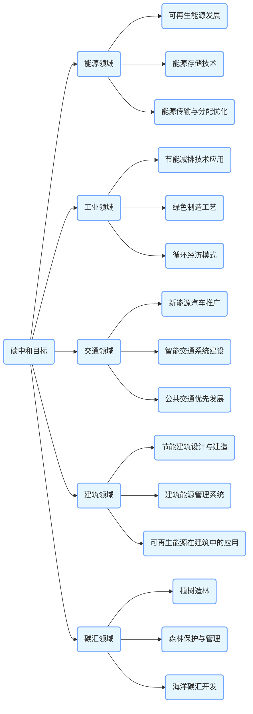

# 碳中和技术路线图与投资策略制定

> 关键词：碳中和、技术路线图、投资策略、能源转型、绿色技术

> 摘要：本文聚焦于碳中和技术路线图与投资策略制定。首先介绍了碳中和的背景，包括目的、预期读者和文档结构等。接着阐述了碳中和相关的核心概念及其联系，分析了核心算法原理和具体操作步骤。通过数学模型和公式对碳中和目标实现进行了详细讲解并举例说明。在项目实战部分，给出了开发环境搭建、源代码实现及解读。探讨了碳中和在不同领域的实际应用场景，推荐了学习资源、开发工具框架以及相关论文著作。最后总结了碳中和未来发展趋势与挑战，解答常见问题并提供扩展阅读和参考资料，旨在为实现碳中和目标提供全面的技术和投资指导。

## 1. 背景介绍 
### 1.1 目的和范围
随着全球气候变化问题日益严峻，碳中和已成为全球各国应对气候变化的重要战略目标。本文的目的在于深入探讨碳中和技术路线图的制定以及与之相匹配的投资策略。范围涵盖了碳中和相关的各种技术领域，包括能源、工业、交通、建筑等，同时分析不同领域的投资机会和风险，为投资者和决策者提供全面的参考。

### 1.2 预期读者
本文预期读者包括对碳中和领域感兴趣的投资者、能源行业从业者、政策制定者、科研人员以及关注气候变化的相关人士。投资者可以从本文中获取关于碳中和投资的策略和方向；能源行业从业者能够了解碳中和技术的发展趋势和应用前景；政策制定者可以参考本文内容制定相关政策；科研人员可以在技术层面得到启发；而关注气候变化的人士则能更深入地了解碳中和的实现路径。

### 1.3 文档结构概述
本文首先介绍碳中和的背景知识，包括目的、读者和结构等。接着阐述核心概念和联系，展示相关的原理和架构示意图。然后详细讲解核心算法原理和具体操作步骤，并用Python代码进行说明。通过数学模型和公式进一步分析碳中和问题。在项目实战部分，进行开发环境搭建、源代码实现和解读。探讨实际应用场景，推荐相关的工具和资源。最后总结未来发展趋势与挑战，解答常见问题并提供扩展阅读和参考资料。

### 1.4 术语表
#### 1.4.1 核心术语定义
- **碳中和**：指企业、团体或个人测算在一定时间内直接或间接产生的温室气体排放总量，通过植树造林、节能减排等形式，以抵消自身产生的二氧化碳排放量，实现二氧化碳“零排放”。
- **技术路线图**：是一种描述技术发展方向和路径的工具，它将技术目标、关键技术、研发活动和时间节点等信息进行整合，为技术研发和产业发展提供指导。
- **投资策略**：是指投资者为了实现投资目标，在投资过程中所采取的各种方法和措施，包括资产配置、投资组合选择、风险控制等。

#### 1.4.2 相关概念解释
- **能源转型**：从传统的化石能源向清洁能源（如太阳能、风能、水能等）的转变过程，是实现碳中和的关键环节。
- **绿色技术**：指能够减少环境污染、降低能源消耗、提高资源利用效率的技术，包括可再生能源技术、节能技术、环保技术等。

#### 1.4.3 缩略词列表
- **GHG**：Greenhouse Gas，温室气体
- **PV**：Photovoltaic，光伏发电
- **EV**：Electric Vehicle，电动汽车

## 2. 核心概念与联系 
### 核心概念原理
碳中和的核心原理是通过减少温室气体排放和增加碳汇来实现二氧化碳的净零排放。在能源领域，通过发展可再生能源，如太阳能、风能、水能等，减少对化石能源的依赖，从而降低二氧化碳排放。在工业领域，采用节能减排技术，提高能源利用效率，减少生产过程中的碳排放。在交通领域，推广电动汽车、氢燃料电池汽车等新能源汽车，降低交通运输行业的碳排放。同时，通过植树造林、森林保护等措施增加碳汇，吸收大气中的二氧化碳。

### 架构的文本示意图
```plaintext
碳中和目标
|
|-- 能源领域
|   |-- 可再生能源发展（太阳能、风能、水能等）
|   |-- 能源存储技术（电池储能、氢储能等）
|   |-- 能源传输与分配优化
|
|-- 工业领域
|   |-- 节能减排技术应用
|   |-- 绿色制造工艺
|   |-- 循环经济模式
|
|-- 交通领域
|   |-- 新能源汽车推广（电动汽车、氢燃料电池汽车等）
|   |-- 智能交通系统建设
|   |-- 公共交通优先发展
|
|-- 建筑领域
|   |-- 节能建筑设计与建造
|   |-- 建筑能源管理系统
|   |-- 可再生能源在建筑中的应用
|
|-- 碳汇领域
|   |-- 植树造林
|   |-- 森林保护与管理
|   |-- 海洋碳汇开发
```

### Mermaid 流程图


## 3. 核心算法原理 & 具体操作步骤 
### 核心算法原理
在制定碳中和技术路线图和投资策略时，需要考虑多个因素，如技术成熟度、成本效益、市场需求等。可以采用多目标优化算法来综合考虑这些因素，以确定最优的技术路线和投资方案。以下是一个简单的多目标优化算法示例，使用Python的`pymoo`库实现。

```python
from pymoo.algorithms.moo.nsga2 import NSGA2
from pymoo.core.problem import Problem
from pymoo.optimize import minimize
import numpy as np

# 定义多目标优化问题
class CarbonNeutralityProblem(Problem):
    def __init__(self):
        super().__init__(n_var=3, n_obj=2, n_constr=0, xl=np.array([0, 0, 0]), xu=np.array([1, 1, 1]))

    def _evaluate(self, X, out, *args, **kwargs):
        # 假设有三个技术选项，每个选项的投资比例为X[0], X[1], X[2]
        # 目标1：最小化碳排放
        f1 = 10 * X[0] + 5 * X[1] + 3 * X[2]
        # 目标2：最大化投资回报率
        f2 = - (20 * X[0] + 15 * X[1] + 12 * X[2])
        out["F"] = np.column_stack([f1, f2])

# 初始化算法
algorithm = NSGA2(pop_size=100)

# 定义问题实例
problem = CarbonNeutralityProblem()

# 运行优化
res = minimize(problem,
               algorithm,
               ('n_gen', 200),
               seed=1,
               verbose=False)

# 输出最优解
print("最优投资比例：", res.X)
print("最小碳排放：", res.F[0])
print("最大投资回报率：", -res.F[1])
```

### 具体操作步骤
1. **数据收集**：收集与碳中和相关的技术信息，包括技术成熟度、成本、碳排放减少量、投资回报率等。
2. **问题定义**：根据收集的数据，定义多目标优化问题，确定决策变量、目标函数和约束条件。
3. **算法选择**：选择合适的多目标优化算法，如NSGA-II、MOEA/D等。
4. **模型求解**：使用选定的算法对问题进行求解，得到最优的技术路线和投资方案。
5. **结果分析**：对求解结果进行分析，评估不同方案的优劣，为决策提供依据。

## 4. 数学模型和公式 & 详细讲解 & 举例说明 
### 数学模型
假设我们有 $n$ 种技术选项，每种技术选项的投资比例为 $x_i$（$i = 1, 2, \cdots, n$），满足 $\sum_{i=1}^{n} x_i = 1$ 且 $0 \leq x_i \leq 1$。

#### 目标函数
- **最小化碳排放**：$C = \sum_{i=1}^{n} c_i x_i$，其中 $c_i$ 是第 $i$ 种技术选项的单位投资碳排放减少量。
- **最大化投资回报率**：$R = \sum_{i=1}^{n} r_i x_i$，其中 $r_i$ 是第 $i$ 种技术选项的单位投资回报率。

#### 约束条件
- 投资比例约束：$\sum_{i=1}^{n} x_i = 1$
- 非负约束：$0 \leq x_i \leq 1$

### 详细讲解
上述数学模型将碳中和技术路线图和投资策略制定问题转化为一个多目标优化问题。目标是在满足投资比例约束和非负约束的前提下，同时最小化碳排放和最大化投资回报率。通过调整不同技术选项的投资比例，可以找到最优的解决方案。

### 举例说明
假设我们有三种技术选项：太阳能光伏发电、风力发电和电动汽车推广。相关数据如下：

| 技术选项 | 单位投资碳排放减少量 ($c_i$) | 单位投资回报率 ($r_i$) |
| ---- | ---- | ---- |
| 太阳能光伏发电 | 10 | 20 |
| 风力发电 | 5 | 15 |
| 电动汽车推广 | 3 | 12 |

将这些数据代入上述数学模型，使用多目标优化算法求解，可以得到最优的投资比例。在前面的Python代码示例中，已经实现了这个求解过程。

## 5. 项目实战：代码实际案例和详细解释说明 
### 5.1  开发环境搭建
- **Python环境**：安装Python 3.7及以上版本，可以从Python官方网站（https://www.python.org/downloads/）下载安装。
- **必要库安装**：使用`pip`命令安装所需的库，如`pymoo`、`numpy`等。
```bash
pip install pymoo numpy
```

### 5.2  源代码详细实现和代码解读
```python
from pymoo.algorithms.moo.nsga2 import NSGA2
from pymoo.core.problem import Problem
from pymoo.optimize import minimize
import numpy as np

# 定义多目标优化问题
class CarbonNeutralityProblem(Problem):
    def __init__(self):
        # 初始化问题，n_var表示决策变量数量，n_obj表示目标函数数量，n_constr表示约束条件数量
        # xl和xu分别表示决策变量的下限和上限
        super().__init__(n_var=3, n_obj=2, n_constr=0, xl=np.array([0, 0, 0]), xu=np.array([1, 1, 1]))

    def _evaluate(self, X, out, *args, **kwargs):
        # 假设有三个技术选项，每个选项的投资比例为X[0], X[1], X[2]
        # 目标1：最小化碳排放
        f1 = 10 * X[0] + 5 * X[1] + 3 * X[2]
        # 目标2：最大化投资回报率
        f2 = - (20 * X[0] + 15 * X[1] + 12 * X[2])
        # 将目标函数值存储在out["F"]中
        out["F"] = np.column_stack([f1, f2])

# 初始化算法
algorithm = NSGA2(pop_size=100)

# 定义问题实例
problem = CarbonNeutralityProblem()

# 运行优化
res = minimize(problem,
               algorithm,
               ('n_gen', 200),
               seed=1,
               verbose=False)

# 输出最优解
print("最优投资比例：", res.X)
print("最小碳排放：", res.F[0])
print("最大投资回报率：", -res.F[1])
```

### 代码解读与分析
1. **导入必要的库**：导入`pymoo`库中的相关类和`numpy`库。
2. **定义多目标优化问题**：创建`CarbonNeutralityProblem`类，继承自`Problem`类，并重写`__init__`和`_evaluate`方法。`__init__`方法用于初始化问题的基本信息，如决策变量数量、目标函数数量、约束条件数量等。`_evaluate`方法用于计算目标函数值。
3. **初始化算法**：使用`NSGA2`算法进行多目标优化，设置种群大小为100。
4. **定义问题实例**：创建`CarbonNeutralityProblem`类的实例。
5. **运行优化**：使用`minimize`函数运行优化算法，设置迭代次数为200。
6. **输出最优解**：输出最优的投资比例、最小碳排放和最大投资回报率。

## 6. 实际应用场景 
### 能源领域
- **可再生能源发电项目**：投资太阳能、风能、水能等可再生能源发电项目，减少对化石能源的依赖，降低碳排放。例如，在中国西部和北部地区建设大规模的风力发电场和太阳能光伏电站。
- **能源存储项目**：发展电池储能、氢储能等能源存储技术，解决可再生能源间歇性和波动性问题，提高能源供应的稳定性。例如，特斯拉的Powerwall电池储能系统。

### 工业领域
- **节能减排改造项目**：对传统工业企业进行节能减排改造，采用先进的节能技术和设备，提高能源利用效率。例如，钢铁企业采用余热回收技术，化工企业采用高效催化技术。
- **绿色制造项目**：推动工业企业向绿色制造转型，采用绿色材料、绿色工艺和绿色设计，减少生产过程中的环境污染和碳排放。例如，汽车制造企业推广电动汽车生产。

### 交通领域
- **新能源汽车产业**：投资电动汽车、氢燃料电池汽车等新能源汽车的研发、生产和销售，推动交通运输行业的能源转型。例如，特斯拉、比亚迪等新能源汽车企业的发展。
- **智能交通系统建设**：建设智能交通系统，提高交通运行效率，减少交通拥堵和尾气排放。例如，智能交通信号灯、智能停车系统等。

### 建筑领域
- **节能建筑项目**：建设节能建筑，采用节能设计、节能材料和节能设备，降低建筑能耗。例如，被动式房屋的建设。
- **建筑能源管理系统**：安装建筑能源管理系统，实时监测和控制建筑能源消耗，提高能源利用效率。例如，施耐德电气的建筑能源管理解决方案。

### 碳汇领域
- **植树造林项目**：投资植树造林项目，增加森林面积，提高森林碳汇能力。例如，中国的“三北”防护林工程。
- **海洋碳汇开发项目**：开展海洋碳汇开发研究，探索利用海洋生态系统吸收二氧化碳的方法。例如，海藻养殖、海洋生态修复等。

## 7. 工具和资源推荐
### 7.1 学习资源推荐
#### 7.1.1 书籍推荐
- 《碳中和与绿色金融》：介绍了碳中和的概念、技术和政策，以及绿色金融在碳中和中的作用。
- 《可再生能源概论》：系统阐述了太阳能、风能、水能等可再生能源的原理、技术和应用。
- 《能源转型：从化石能源到可再生能源》：探讨了能源转型的必要性、挑战和路径。

#### 7.1.2 在线课程
- Coursera上的“Climate Change and Business Strategy”：介绍了气候变化对企业战略的影响，以及企业如何应对气候变化。
- edX上的“Renewable Energy Systems”：讲解了可再生能源系统的设计、运行和管理。
- 中国大学MOOC上的“碳中和导论”：全面介绍了碳中和的基本概念、技术路线和政策措施。

#### 7.1.3 技术博客和网站
- 国际能源署（IEA）官网：提供全球能源市场的最新数据、分析和报告，以及碳中和相关的政策和技术信息。
- 能源研究机构（EIA）官网：发布美国和全球能源市场的统计数据和分析报告。
- 碳中和专业网站“Carbon Neutrality Now”：提供碳中和领域的最新资讯、技术动态和案例分析。

### 7.2 开发工具框架推荐
#### 7.2.1 IDE和编辑器
- PyCharm：功能强大的Python集成开发环境，提供代码编辑、调试、版本控制等功能。
- Visual Studio Code：轻量级的代码编辑器，支持多种编程语言，具有丰富的插件生态系统。

#### 7.2.2 调试和性能分析工具
- Py-Spy：用于分析Python程序的性能瓶颈，找出耗时较长的代码段。
- cProfile：Python内置的性能分析工具，用于统计函数调用次数和执行时间。

#### 7.2.3 相关框架和库
- pymoo：用于多目标优化问题的Python库，提供了多种优化算法和问题定义接口。
- numpy：Python的数值计算库，提供了高效的数组操作和数学函数。
- pandas：用于数据处理和分析的Python库，提供了灵活的数据结构和数据操作方法。

### 7.3 相关论文著作推荐
#### 7.3.1 经典论文
- “Pathways to Deep Decarbonization in the United States”：分析了美国实现深度脱碳的技术路径和政策措施。
- “Renewable Energy and Sustainable Development: A Crucial Review”：综述了可再生能源在可持续发展中的作用和挑战。

#### 7.3.2 最新研究成果
- “The Role of Hydrogen in a Global Energy Transition”：探讨了氢气在全球能源转型中的作用和发展前景。
- “Carbon Capture, Utilization, and Storage (CCUS): A Review”：介绍了碳捕获、利用和封存技术的最新研究进展。

#### 7.3.3 应用案例分析
- “Case Studies of Carbon Neutral Cities”：分析了全球多个碳中和城市的实践经验和成功案例。
- “Investment Strategies for Renewable Energy Projects”：研究了可再生能源项目的投资策略和风险评估方法。

## 8. 总结：未来发展趋势与挑战
### 未来发展趋势
- **技术创新加速**：随着科技的不断进步，碳中和相关技术将不断创新和突破，如高效太阳能电池技术、大容量储能技术、碳捕获和封存技术等。
- **能源结构深度调整**：可再生能源将在全球能源结构中占据越来越大的比例，化石能源的使用将逐渐减少。
- **产业融合发展**：碳中和将推动能源、工业、交通、建筑等多个产业的融合发展，形成新的产业生态和商业模式。
- **国际合作加强**：应对气候变化是全球性挑战，各国将加强在碳中和领域的国际合作，共同推动全球碳中和目标的实现。

### 挑战
- **技术成本较高**：目前，一些碳中和技术的成本仍然较高，如碳捕获和封存技术、氢能源技术等，需要进一步降低成本，提高技术的经济性。
- **能源供应稳定性**：可再生能源具有间歇性和波动性特点，如何保证能源供应的稳定性是实现碳中和面临的重要挑战。
- **政策协调难度大**：碳中和涉及多个领域和部门，需要制定协调一致的政策体系，政策制定和实施的难度较大。
- **社会认知和接受度**：部分公众对碳中和的认识和理解还不够深入，需要加强宣传和教育，提高社会认知和接受度。

## 9. 附录：常见问题与解答
### 问题1：碳中和技术路线图的制定需要考虑哪些因素？
答：制定碳中和技术路线图需要考虑多个因素，包括技术成熟度、成本效益、市场需求、政策环境、资源禀赋等。同时，还需要考虑不同技术之间的协同作用和互补性，以实现整体最优的减排效果。

### 问题2：碳中和投资有哪些风险？
答：碳中和投资存在一定的风险，主要包括技术风险、市场风险、政策风险等。技术风险是指新技术可能无法达到预期的性能和效果；市场风险是指市场需求、价格波动等因素可能影响投资回报；政策风险是指政策变化可能对投资项目产生不利影响。

### 问题3：如何评估碳中和项目的投资回报率？
答：评估碳中和项目的投资回报率需要综合考虑多个因素，如项目成本、收益、运营成本、税收政策等。可以采用净现值（NPV）、内部收益率（IRR）等方法进行评估。同时，还需要考虑项目的社会效益和环境效益。

### 问题4：个人可以为碳中和做些什么？
答：个人可以从日常生活中的小事做起，为碳中和做出贡献。例如，节约能源，减少使用一次性塑料制品，选择公共交通、自行车或步行出行，支持可再生能源的使用等。

## 10. 扩展阅读 & 参考资料
### 扩展阅读
- 《零碳社会：气候变化与气候经济的崛起》
- 《气候经济与人类未来》
- 《绿色经济与可持续发展》

### 参考资料
- 国际能源署（IEA）相关报告
- 联合国气候变化框架公约（UNFCCC）相关文件
- 国家发展和改革委员会、生态环境部等政府部门发布的政策文件和统计数据

作者：AI天才研究院/AI Genius Institute & 禅与计算机程序设计艺术 /Zen And The Art of Computer Programming