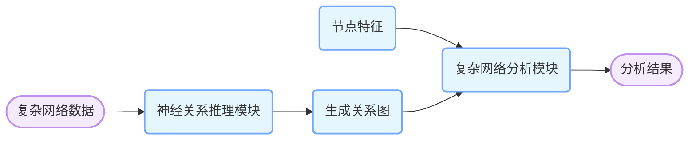

# 神经关系推理在复杂网络分析中的新进展

> 关键词：神经关系推理、复杂网络分析、图神经网络、深度学习、关系发现、网络建模、数据挖掘

> 摘要：本文聚焦于神经关系推理在复杂网络分析中的新进展。首先介绍了研究的背景，包括目的、预期读者、文档结构等内容。接着阐述了神经关系推理和复杂网络分析的核心概念及其联系，通过文本示意图和Mermaid流程图进行清晰展示。详细讲解了神经关系推理的核心算法原理，并用Python代码示例进行说明，同时给出相关数学模型和公式并举例。通过项目实战，从开发环境搭建到源代码实现及解读，展示了神经关系推理在实际中的应用。探讨了其在多个领域的实际应用场景，推荐了学习资源、开发工具框架和相关论文著作。最后总结了未来发展趋势与挑战，并给出常见问题解答和参考资料，旨在全面且深入地呈现神经关系推理在复杂网络分析领域的最新动态和应用价值。

## 1. 背景介绍 
### 1.1 目的和范围
在当今信息爆炸的时代，复杂网络无处不在，如社交网络、生物网络、电力网络等。这些网络具有高度的复杂性和动态性，传统的网络分析方法在处理大规模、高维度、复杂关系的网络数据时面临诸多挑战。神经关系推理作为一种新兴的技术手段，为复杂网络分析提供了新的思路和方法。

本文的目的在于全面介绍神经关系推理在复杂网络分析中的新进展，包括其核心概念、算法原理、数学模型、实际应用等方面。范围涵盖了神经关系推理的基本理论、相关技术的最新发展以及在不同领域复杂网络分析中的具体应用案例。

### 1.2 预期读者
本文预期读者包括但不限于计算机科学、数据科学、统计学、物理学、生物学等领域的研究人员和学生，以及对复杂网络分析和人工智能技术感兴趣的专业人士。对于希望深入了解神经关系推理技术在复杂网络分析中应用的开发者、分析师和决策者也具有一定的参考价值。

### 1.3 文档结构概述
本文将按照以下结构进行组织：
1. **背景介绍**：阐述研究的目的、预期读者和文档结构，为后续内容奠定基础。
2. **核心概念与联系**：介绍神经关系推理和复杂网络分析的核心概念，通过文本示意图和Mermaid流程图展示它们之间的联系。
3. **核心算法原理 & 具体操作步骤**：详细讲解神经关系推理的核心算法原理，并用Python代码示例进行说明。
4. **数学模型和公式 & 详细讲解 & 举例说明**：给出神经关系推理的数学模型和公式，并进行详细讲解和举例。
5. **项目实战：代码实际案例和详细解释说明**：通过实际项目案例，介绍开发环境搭建、源代码实现和代码解读。
6. **实际应用场景**：探讨神经关系推理在不同领域复杂网络分析中的实际应用场景。
7. **工具和资源推荐**：推荐学习资源、开发工具框架和相关论文著作。
8. **总结：未来发展趋势与挑战**：总结神经关系推理在复杂网络分析中的未来发展趋势和面临的挑战。
9. **附录：常见问题与解答**：解答读者可能遇到的常见问题。
10. **扩展阅读 & 参考资料**：提供扩展阅读材料和参考资料，方便读者进一步深入学习。

### 1.4 术语表
#### 1.4.1 核心术语定义
- **神经关系推理（Neural Relational Inference）**：一种基于深度学习的方法，旨在从数据中自动发现实体之间的关系结构。
- **复杂网络（Complex Network）**：由大量节点和节点之间的连接组成的网络，具有复杂的拓扑结构和动力学行为。
- **图神经网络（Graph Neural Network，GNN）**：一类专门用于处理图结构数据的神经网络模型。
- **关系发现（Relation Discovery）**：从数据中识别和提取实体之间关系的过程。
- **网络建模（Network Modeling）**：对复杂网络的结构和行为进行数学描述和建模的过程。

#### 1.4.2 相关概念解释
- **深度学习（Deep Learning）**：一种基于人工神经网络的机器学习方法，通过多层神经网络自动学习数据的特征和模式。
- **表示学习（Representation Learning）**：自动学习数据的有效表示，以便更好地进行后续的分析和处理。
- **变分自编码器（Variational Autoencoder，VAE）**：一种生成模型，用于学习数据的潜在表示。

#### 1.4.3 缩略词列表
- **GNN**：Graph Neural Network（图神经网络）
- **VAE**：Variational Autoencoder（变分自编码器）
- **MLP**：Multilayer Perceptron（多层感知机）

## 2. 核心概念与联系 
### 核心概念原理
#### 神经关系推理
神经关系推理的核心思想是利用深度学习模型从观测数据中自动推断实体之间的关系。传统的关系推理方法往往依赖于手工特征和先验知识，而神经关系推理则通过端到端的训练自动学习关系结构。

其基本原理是将输入数据编码为潜在表示，然后通过解码器根据潜在表示生成输出数据。在这个过程中，关系信息被隐式地编码在潜在表示中。通过优化模型的参数，使得生成的输出数据与观测数据尽可能相似，从而学习到合理的关系结构。

#### 复杂网络分析
复杂网络分析旨在研究复杂网络的结构、动力学行为和功能。复杂网络通常由节点和边组成，节点表示实体，边表示实体之间的关系。复杂网络分析的主要任务包括网络拓扑结构分析、节点重要性评估、社区发现、传播动力学研究等。

### 架构的文本示意图
神经关系推理与复杂网络分析的结合可以表示为以下过程：

复杂网络数据（节点特征、边信息）作为输入，首先经过神经关系推理模块进行关系发现。神经关系推理模块利用深度学习模型学习节点之间的潜在关系，生成关系图。然后，将生成的关系图和原始的节点特征输入到复杂网络分析模块中，进行各种分析任务，如社区发现、节点分类等。最后，输出分析结果，如社区划分、节点重要性排序等。

### Mermaid 流程图


## 3. 核心算法原理 & 具体操作步骤 
### 核心算法原理
神经关系推理的核心算法通常基于变分自编码器（VAE）的框架。VAE 是一种生成模型，由编码器和解码器组成。编码器将输入数据映射到潜在空间，解码器将潜在空间中的表示映射回输入空间。

在神经关系推理中，编码器的输入是节点的特征和观测到的网络数据，输出是潜在关系的概率分布。解码器根据潜在关系的样本生成网络数据。通过最大化观测数据的对数似然的变分下界来训练模型。

### 具体操作步骤
1. **数据预处理**：对复杂网络数据进行预处理，包括节点特征提取、数据归一化等操作。
2. **模型定义**：定义编码器和解码器网络。编码器通常是一个多层感知机（MLP），用于将输入数据映射到潜在空间。解码器可以是一个图神经网络（GNN），用于根据潜在关系生成网络数据。
3. **损失函数定义**：定义变分自编码器的损失函数，包括重构损失和KL散度损失。
4. **模型训练**：使用随机梯度下降（SGD）或其变种（如Adam）对模型进行训练。
5. **关系推断**：在训练好的模型上，通过编码器推断节点之间的潜在关系。

### Python源代码示例
```python
import torch
import torch.nn as nn
import torch.optim as optim

# 定义编码器
class Encoder(nn.Module):
    def __init__(self, input_dim, hidden_dim, latent_dim):
        super(Encoder, self).__init__()
        self.fc1 = nn.Linear(input_dim, hidden_dim)
        self.fc_mu = nn.Linear(hidden_dim, latent_dim)
        self.fc_logvar = nn.Linear(hidden_dim, latent_dim)
        self.relu = nn.ReLU()

    def forward(self, x):
        h = self.relu(self.fc1(x))
        mu = self.fc_mu(h)
        logvar = self.fc_logvar(h)
        return mu, logvar

# 定义解码器
class Decoder(nn.Module):
    def __init__(self, latent_dim, hidden_dim, output_dim):
        super(Decoder, self).__init__()
        self.fc1 = nn.Linear(latent_dim, hidden_dim)
        self.fc2 = nn.Linear(hidden_dim, output_dim)
        self.relu = nn.ReLU()
        self.sigmoid = nn.Sigmoid()

    def forward(self, z):
        h = self.relu(self.fc1(z))
        x_recon = self.sigmoid(self.fc2(h))
        return x_recon

# 定义神经关系推理模型
class NeuralRelationalInference(nn.Module):
    def __init__(self, input_dim, hidden_dim, latent_dim, output_dim):
        super(NeuralRelationalInference, self).__init__()
        self.encoder = Encoder(input_dim, hidden_dim, latent_dim)
        self.decoder = Decoder(latent_dim, hidden_dim, output_dim)

    def reparameterize(self, mu, logvar):
        std = torch.exp(0.5 * logvar)
        eps = torch.randn_like(std)
        return mu + eps * std

    def forward(self, x):
        mu, logvar = self.encoder(x)
        z = self.reparameterize(mu, logvar)
        x_recon = self.decoder(z)
        return x_recon, mu, logvar

# 定义损失函数
def loss_function(x_recon, x, mu, logvar):
    recon_loss = nn.BCELoss(reduction='sum')(x_recon, x)
    kl_loss = -0.5 * torch.sum(1 + logvar - mu.pow(2) - logvar.exp())
    return recon_loss + kl_loss

# 训练模型
def train(model, optimizer, data_loader, epochs):
    model.train()
    for epoch in range(epochs):
        total_loss = 0
        for batch in data_loader:
            x = batch
            optimizer.zero_grad()
            x_recon, mu, logvar = model(x)
            loss = loss_function(x_recon, x, mu, logvar)
            loss.backward()
            optimizer.step()
            total_loss += loss.item()
        print(f'Epoch {epoch+1}/{epochs}, Loss: {total_loss / len(data_loader)}')
```

## 4. 数学模型和公式 & 详细讲解 & 举例说明 
### 数学模型
神经关系推理的数学模型基于变分自编码器的框架。假设我们有一组观测数据 $\mathbf{X} = \{ \mathbf{x}_1, \mathbf{x}_2, \cdots, \mathbf{x}_N \}$，其中 $\mathbf{x}_i$ 表示第 $i$ 个样本。我们希望学习到潜在关系 $\mathbf{Z} = \{ \mathbf{z}_1, \mathbf{z}_2, \cdots, \mathbf{z}_N \}$，使得在给定 $\mathbf{Z}$ 的条件下，$\mathbf{X}$ 的生成概率 $p(\mathbf{X} | \mathbf{Z})$ 最大。

变分自编码器通过引入一个变分分布 $q(\mathbf{Z} | \mathbf{X})$ 来近似后验分布 $p(\mathbf{Z} | \mathbf{X})$。目标是最大化观测数据的对数似然 $\log p(\mathbf{X})$ 的变分下界：

$$
\log p(\mathbf{X}) \geq \mathcal{L}(\mathbf{X}) = \mathbb{E}_{q(\mathbf{Z} | \mathbf{X})} [\log p(\mathbf{X} | \mathbf{Z})] - \text{KL}(q(\mathbf{Z} | \mathbf{X}) || p(\mathbf{Z}))
$$

其中，$\mathbb{E}_{q(\mathbf{Z} | \mathbf{X})} [\log p(\mathbf{X} | \mathbf{Z})]$ 是重构损失，衡量生成数据与观测数据的相似程度；$\text{KL}(q(\mathbf{Z} | \mathbf{X}) || p(\mathbf{Z}))$ 是KL散度损失，衡量变分分布 $q(\mathbf{Z} | \mathbf{X})$ 与先验分布 $p(\mathbf{Z})$ 的差异。

### 详细讲解
- **重构损失**：$\mathbb{E}_{q(\mathbf{Z} | \mathbf{X})} [\log p(\mathbf{X} | \mathbf{Z})]$ 表示在给定潜在关系 $\mathbf{Z}$ 的条件下，生成观测数据 $\mathbf{X}$ 的对数概率的期望。在实际计算中，通常使用蒙特卡罗方法进行近似：

$$
\mathbb{E}_{q(\mathbf{Z} | \mathbf{X})} [\log p(\mathbf{X} | \mathbf{Z})] \approx \frac{1}{L} \sum_{l=1}^{L} \log p(\mathbf{X} | \mathbf{z}^{(l)})
$$

其中，$\mathbf{z}^{(l)}$ 是从变分分布 $q(\mathbf{Z} | \mathbf{X})$ 中采样得到的第 $l$ 个样本，$L$ 是采样次数。

- **KL散度损失**：$\text{KL}(q(\mathbf{Z} | \mathbf{X}) || p(\mathbf{Z}))$ 衡量变分分布 $q(\mathbf{Z} | \mathbf{X})$ 与先验分布 $p(\mathbf{Z})$ 的差异。当 $q(\mathbf{Z} | \mathbf{X})$ 和 $p(\mathbf{Z})$ 都是高斯分布时，KL散度可以解析计算：

$$
\text{KL}(q(\mathbf{Z} | \mathbf{X}) || p(\mathbf{Z})) = \frac{1}{2} \sum_{i=1}^{D} \left( \mu_i^2 + \sigma_i^2 - \log \sigma_i^2 - 1 \right)
$$

其中，$\mu_i$ 和 $\sigma_i^2$ 分别是变分分布 $q(\mathbf{Z} | \mathbf{X})$ 的均值和方差的第 $i$ 个分量，$D$ 是潜在空间的维度。

### 举例说明
假设我们有一个简单的社交网络，节点表示用户，边表示用户之间的好友关系。我们可以将每个用户的特征（如年龄、性别、兴趣爱好等）作为输入数据 $\mathbf{X}$。通过神经关系推理模型，我们可以学习到用户之间的潜在关系 $\mathbf{Z}$，例如用户之间的社交圈子、影响力关系等。

在训练过程中，模型通过最小化重构损失和KL散度损失来学习合理的潜在关系。重构损失确保生成的社交网络结构与观测到的网络结构相似，KL散度损失确保潜在关系的分布符合先验假设。

## 5. 项目实战：代码实际案例和详细解释说明 
### 5.1  开发环境搭建
1. **安装Python**：建议使用Python 3.7及以上版本。可以从Python官方网站（https://www.python.org/downloads/）下载并安装。
2. **安装深度学习框架**：使用PyTorch作为深度学习框架。可以根据自己的CUDA版本和操作系统选择合适的安装方式，具体安装命令可以参考PyTorch官方网站（https://pytorch.org/get-started/locally/）。
3. **安装其他依赖库**：安装必要的依赖库，如`numpy`、`matplotlib`等。可以使用`pip`或`conda`进行安装：

```bash
pip install numpy matplotlib
```

### 5.2  源代码详细实现和代码解读
```python
import torch
import torch.nn as nn
import torch.optim as optim
import numpy as np
import matplotlib.pyplot as plt
from torch.utils.data import DataLoader, TensorDataset

# 生成模拟数据
def generate_data(num_samples, num_features):
    x = np.random.randn(num_samples, num_features)
    return torch.FloatTensor(x)

# 定义编码器
class Encoder(nn.Module):
    def __init__(self, input_dim, hidden_dim, latent_dim):
        super(Encoder, self).__init__()
        self.fc1 = nn.Linear(input_dim, hidden_dim)
        self.fc_mu = nn.Linear(hidden_dim, latent_dim)
        self.fc_logvar = nn.Linear(hidden_dim, latent_dim)
        self.relu = nn.ReLU()

    def forward(self, x):
        h = self.relu(self.fc1(x))
        mu = self.fc_mu(h)
        logvar = self.fc_logvar(h)
        return mu, logvar

# 定义解码器
class Decoder(nn.Module):
    def __init__(self, latent_dim, hidden_dim, output_dim):
        super(Decoder, self).__init__()
        self.fc1 = nn.Linear(latent_dim, hidden_dim)
        self.fc2 = nn.Linear(hidden_dim, output_dim)
        self.relu = nn.ReLU()
        self.sigmoid = nn.Sigmoid()

    def forward(self, z):
        h = self.relu(self.fc1(z))
        x_recon = self.sigmoid(self.fc2(h))
        return x_recon

# 定义神经关系推理模型
class NeuralRelationalInference(nn.Module):
    def __init__(self, input_dim, hidden_dim, latent_dim, output_dim):
        super(NeuralRelationalInference, self).__init__()
        self.encoder = Encoder(input_dim, hidden_dim, latent_dim)
        self.decoder = Decoder(latent_dim, hidden_dim, output_dim)

    def reparameterize(self, mu, logvar):
        std = torch.exp(0.5 * logvar)
        eps = torch.randn_like(std)
        return mu + eps * std

    def forward(self, x):
        mu, logvar = self.encoder(x)
        z = self.reparameterize(mu, logvar)
        x_recon = self.decoder(z)
        return x_recon, mu, logvar

# 定义损失函数
def loss_function(x_recon, x, mu, logvar):
    recon_loss = nn.BCELoss(reduction='sum')(x_recon, x)
    kl_loss = -0.5 * torch.sum(1 + logvar - mu.pow(2) - logvar.exp())
    return recon_loss + kl_loss

# 训练模型
def train(model, optimizer, data_loader, epochs):
    model.train()
    losses = []
    for epoch in range(epochs):
        total_loss = 0
        for batch in data_loader:
            x = batch
            optimizer.zero_grad()
            x_recon, mu, logvar = model(x)
            loss = loss_function(x_recon, x, mu, logvar)
            loss.backward()
            optimizer.step()
            total_loss += loss.item()
        losses.append(total_loss / len(data_loader))
        print(f'Epoch {epoch+1}/{epochs}, Loss: {total_loss / len(data_loader)}')
    return losses

# 主函数
if __name__ == '__main__':
    # 超参数设置
    num_samples = 1000
    num_features = 10
    hidden_dim = 20
    latent_dim = 5
    output_dim = num_features
    batch_size = 32
    epochs = 50
    learning_rate = 0.001

    # 生成数据
    data = generate_data(num_samples, num_features)
    dataset = TensorDataset(data)
    data_loader = DataLoader(dataset, batch_size=batch_size, shuffle=True)

    # 初始化模型
    model = NeuralRelationalInference(num_features, hidden_dim, latent_dim, output_dim)
    optimizer = optim.Adam(model.parameters(), lr=learning_rate)

    # 训练模型
    losses = train(model, optimizer, data_loader, epochs)

    # 绘制损失曲线
    plt.plot(losses)
    plt.xlabel('Epoch')
    plt.ylabel('Loss')
    plt.title('Training Loss')
    plt.show()
```

### 5.3  代码解读与分析
1. **数据生成**：`generate_data` 函数用于生成模拟数据。这里使用`numpy`生成随机数据，并将其转换为`torch.FloatTensor`类型。
2. **模型定义**：
    - `Encoder` 类定义了编码器网络，将输入数据映射到潜在空间。
    - `Decoder` 类定义了解码器网络，将潜在空间中的表示映射回输入空间。
    - `NeuralRelationalInference` 类将编码器和解码器组合在一起，实现了神经关系推理模型。
3. **损失函数**：`loss_function` 函数定义了变分自编码器的损失函数，包括重构损失和KL散度损失。
4. **训练过程**：`train` 函数用于训练模型。在每个epoch中，遍历数据加载器中的所有批次，计算损失并进行反向传播和参数更新。
5. **主函数**：在主函数中，设置超参数，生成数据，初始化模型和优化器，调用`train`函数进行训练，并绘制损失曲线。

通过观察损失曲线，我们可以判断模型的训练效果。如果损失曲线逐渐下降并趋于稳定，说明模型在学习数据的分布。

## 6. 实际应用场景 
### 社交网络分析
在社交网络中，神经关系推理可以用于发现用户之间的潜在关系，如社交圈子、影响力关系等。通过分析用户的行为数据（如点赞、评论、转发等）和个人特征（如年龄、性别、兴趣爱好等），可以推断出用户之间的关系结构，从而为社交推荐、社区发现等任务提供支持。

### 生物网络分析
在生物网络中，如蛋白质相互作用网络、基因调控网络等，神经关系推理可以用于发现生物分子之间的相互作用关系。通过分析基因表达数据、蛋白质组学数据等，可以推断出生物分子之间的潜在关系，从而为疾病诊断、药物研发等领域提供帮助。

### 电力网络分析
在电力网络中，神经关系推理可以用于分析电力设备之间的关联关系和故障传播路径。通过监测电力设备的运行数据（如电压、电流、功率等），可以推断出设备之间的潜在关系，从而实现故障预警、故障诊断和电力系统的优化调度。

### 交通网络分析
在交通网络中，神经关系推理可以用于分析交通流量的变化规律和交通节点之间的关联关系。通过监测交通传感器数据（如车速、车流量、占有率等），可以推断出交通节点之间的潜在关系，从而实现交通拥堵预测、交通信号优化等任务。

## 7. 工具和资源推荐
### 7.1 学习资源推荐
#### 7.1.1 书籍推荐
- 《深度学习》（Deep Learning），Ian Goodfellow、Yoshua Bengio和Aaron Courville著，是深度学习领域的经典教材，涵盖了深度学习的基本概念、算法和应用。
- 《图神经网络入门》（Graph Neural Networks: Foundations, Frontiers, and Applications），由Jiawei Han等著，系统介绍了图神经网络的原理、算法和应用。
- 《复杂网络》（Complex Networks: Principles, Methods and Applications），由Mehran Sahneh等著，全面介绍了复杂网络的理论、模型和分析方法。

#### 7.1.2 在线课程
- Coursera上的“深度学习专项课程”（Deep Learning Specialization），由Andrew Ng教授主讲，包括深度学习的基础、卷积神经网络、循环神经网络等内容。
- edX上的“图神经网络”（Graph Neural Networks）课程，由MIT的教授主讲，深入介绍了图神经网络的原理和应用。
- 哔哩哔哩（Bilibili）上有很多关于深度学习和复杂网络分析的视频教程，可以根据自己的需求选择学习。

#### 7.1.3 技术博客和网站
- Medium上有很多关于深度学习和复杂网络分析的技术博客，可以关注一些知名博主，如Towards Data Science等。
- arXiv.org是一个预印本数据库，提供了大量关于深度学习、复杂网络分析等领域的最新研究成果。
- 各大科技公司的官方博客，如Google AI Blog、Facebook AI Research等，会发布一些最新的技术研究和应用案例。

### 7.2 开发工具框架推荐
#### 7.2.1 IDE和编辑器
- PyCharm：是一款专业的Python集成开发环境（IDE），提供了丰富的代码编辑、调试、版本控制等功能，适合Python开发者使用。
- Jupyter Notebook：是一个交互式的开发环境，支持多种编程语言，如Python、R等。可以方便地进行数据探索、模型训练和结果展示。
- Visual Studio Code：是一款轻量级的代码编辑器，支持多种编程语言和插件扩展，具有丰富的代码编辑和调试功能。

#### 7.2.2 调试和性能分析工具
- PyTorch Profiler：是PyTorch自带的性能分析工具，可以帮助开发者分析模型的性能瓶颈，优化模型的训练和推理速度。
- TensorBoard：是TensorFlow的可视化工具，也可以与PyTorch集成使用。可以用于可视化模型的训练过程、损失曲线、模型结构等。
- cProfile：是Python的内置性能分析工具，可以帮助开发者分析Python代码的性能瓶颈，找出耗时的函数和代码段。

#### 7.2.3 相关框架和库
- PyTorch：是一个开源的深度学习框架，提供了丰富的深度学习模型和工具，支持GPU加速，易于使用和扩展。
- DGL（Deep Graph Library）：是一个专门用于图神经网络的深度学习框架，提供了高效的图数据处理和图神经网络模型实现。
- NetworkX：是一个用于复杂网络分析的Python库，提供了丰富的图算法和数据结构，方便进行网络拓扑结构分析、节点重要性评估等任务。

### 7.3 相关论文著作推荐
#### 7.3.1 经典论文
- “Neural Relational Inference for Interacting Systems”，Kipf等人发表于NeurIPS 2018，是神经关系推理领域的经典论文，提出了基于变分自编码器的神经关系推理模型。
- “Graph Convolutional Networks for Semi-Supervised Classification”，Kipf和Welling发表于ICLR 2017，提出了图卷积网络（GCN），为图神经网络的发展奠定了基础。
- “Complex Networks: Structure and Dynamics”，Newman等人发表于Physics Reports 2006，是复杂网络领域的经典综述论文，全面介绍了复杂网络的理论、模型和应用。

#### 7.3.2 最新研究成果
- 可以关注NeurIPS、ICML、ICLR等顶级机器学习会议和期刊，如Journal of Machine Learning Research（JMLR）、Artificial Intelligence等，获取神经关系推理和复杂网络分析领域的最新研究成果。
- arXiv.org上也有很多关于神经关系推理和复杂网络分析的预印本论文，可以及时了解最新的研究动态。

#### 7.3.3 应用案例分析
- 可以参考一些实际应用案例的论文，如在社交网络分析、生物网络分析、电力网络分析等领域的应用案例。这些论文通常会详细介绍模型的设计、训练和应用过程，对实际项目有一定的参考价值。

## 8. 总结：未来发展趋势与挑战
### 未来发展趋势
1. **多模态数据融合**：未来的神经关系推理模型将越来越多地融合多模态数据，如文本、图像、音频等，以更全面地理解复杂网络中的关系结构。
2. **可解释性增强**：随着深度学习模型的复杂性不断增加，模型的可解释性变得越来越重要。未来的神经关系推理模型将更加注重可解释性，以便更好地理解模型的决策过程和推理结果。
3. **与其他技术的结合**：神经关系推理将与其他技术，如强化学习、迁移学习等相结合，以提高模型的性能和泛化能力，解决更复杂的实际问题。
4. **大规模应用**：随着计算能力的不断提升和数据量的不断增加，神经关系推理将在更多领域得到大规模应用，如金融、医疗、交通等。

### 挑战
1. **数据质量和隐私问题**：复杂网络数据通常具有高维度、噪声大、隐私性强等特点，如何处理这些数据并保护数据隐私是一个挑战。
2. **模型复杂度和计算资源**：神经关系推理模型通常比较复杂，需要大量的计算资源和时间进行训练。如何优化模型结构和训练算法，提高模型的训练效率是一个挑战。
3. **关系的动态变化**：复杂网络中的关系通常是动态变化的，如何捕捉关系的动态变化并及时更新模型是一个挑战。
4. **可解释性和可靠性**：如何提高神经关系推理模型的可解释性和可靠性，使其在实际应用中更加可信和可用是一个挑战。

## 9. 附录：常见问题与解答
### 1. 神经关系推理与传统关系推理方法有什么区别？
传统关系推理方法通常依赖于手工特征和先验知识，需要人工设计特征和规则。而神经关系推理是基于深度学习的方法，通过端到端的训练自动学习关系结构，不需要人工设计特征和规则，能够处理更复杂的关系和大规模的数据。

### 2. 神经关系推理模型的训练时间长怎么办？
可以尝试以下方法来缩短训练时间：
- **优化模型结构**：减少模型的层数和参数数量，降低模型的复杂度。
- **使用GPU加速**：利用GPU的并行计算能力，加速模型的训练过程。
- **调整超参数**：如学习率、批量大小等，选择合适的超参数可以提高训练效率。
- **使用预训练模型**：如果有合适的预训练模型，可以在预训练模型的基础上进行微调，减少训练时间。

### 3. 如何评估神经关系推理模型的性能？
可以使用以下指标来评估神经关系推理模型的性能：
- **重构误差**：衡量生成数据与观测数据的相似程度，如均方误差（MSE）、交叉熵损失等。
- **关系发现准确率**：评估模型发现的关系与真实关系的匹配程度，可以使用准确率、召回率、F1值等指标。
- **模型的泛化能力**：通过在测试集上的性能来评估模型的泛化能力，如测试集上的重构误差、关系发现准确率等。

### 4. 神经关系推理模型在处理大规模数据时会遇到什么问题？
在处理大规模数据时，神经关系推理模型可能会遇到以下问题：
- **内存不足**：大规模数据可能会导致内存不足，无法将所有数据加载到内存中进行训练。可以使用数据分块、流式处理等方法来解决。
- **训练时间长**：大规模数据的训练时间通常较长，可以使用分布式训练、并行计算等方法来加速训练过程。
- **模型过拟合**：大规模数据可能会导致模型过拟合，可以使用正则化、数据增强等方法来防止过拟合。

## 10. 扩展阅读 & 参考资料
### 扩展阅读
- 《深度学习实战》（Deep Learning in Practice），介绍了深度学习在不同领域的实际应用案例和实践经验。
- 《图机器学习》（Graph Machine Learning），深入探讨了图机器学习的理论、算法和应用。
- 《复杂系统与复杂网络》（Complex Systems and Complex Networks），介绍了复杂系统和复杂网络的基本概念、理论和方法。

### 参考资料
- Kipf, T. N., Fetaya, E., Wang, K.-C., Welling, M., & Zemel, R. (2018). Neural Relational Inference for Interacting Systems. Advances in Neural Information Processing Systems 31.
- Kipf, T. N., & Welling, M. (2017). Semi-Supervised Classification with Graph Convolutional Networks. International Conference on Learning Representations.
- Newman, M. E. J., Barabási, A.-L., & Watts, D. J. (2006). The Structure and Dynamics of Networks. Princeton University Press.

作者：AI天才研究院/AI Genius Institute & 禅与计算机程序设计艺术 /Zen And The Art of Computer Programming