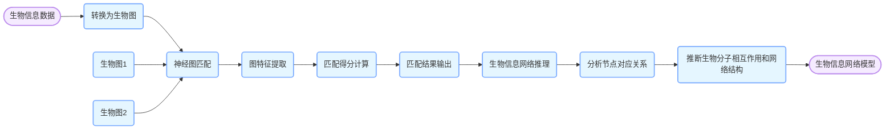

# 神经图匹配在生物信息网络推理中的创新应用

> 关键词：神经图匹配、生物信息网络推理、图神经网络、分子结构分析、疾病机制研究

> 摘要：本文聚焦于神经图匹配在生物信息网络推理中的创新应用。首先介绍了相关背景知识，包括研究目的、预期读者、文档结构和术语定义。接着阐述了神经图匹配和生物信息网络推理的核心概念及其联系，并给出了相应的文本示意图和 Mermaid 流程图。详细讲解了神经图匹配的核心算法原理，通过 Python 源代码进行具体操作步骤的说明。同时，介绍了相关的数学模型和公式，并举例说明。通过项目实战，展示了代码的实际案例和详细解释。分析了神经图匹配在生物信息领域的实际应用场景，如分子结构分析、疾病机制研究等。推荐了学习资源、开发工具框架以及相关论文著作。最后总结了未来发展趋势与挑战，还给出了常见问题与解答以及扩展阅读和参考资料，旨在为相关领域的研究者和开发者提供全面而深入的技术指导。

## 1. 背景介绍 
### 1.1 目的和范围
生物信息网络推理是理解生物系统复杂性的关键技术，它试图从海量的生物数据中挖掘出生物分子之间的相互作用关系和网络结构。然而，生物信息网络具有高度的复杂性和动态性，传统的分析方法在处理这些网络时面临诸多挑战。神经图匹配作为一种新兴的技术，能够有效地处理图结构数据，为生物信息网络推理提供了新的思路和方法。

本文的目的是深入探讨神经图匹配在生物信息网络推理中的创新应用。具体范围包括神经图匹配的核心概念、算法原理、数学模型，以及如何将其应用于生物信息网络推理的实际项目中。同时，还将介绍相关的工具和资源，以及对未来发展趋势和挑战的分析。

### 1.2 预期读者
本文的预期读者包括生物信息学领域的研究者、计算机科学领域对图神经网络和生物信息处理感兴趣的开发者、研究生以及相关领域的专业人士。对于那些希望了解神经图匹配技术在生物信息网络推理中应用的读者，本文将提供全面而深入的技术指导。

### 1.3 文档结构概述
本文将按照以下结构进行组织：
1. 背景介绍：介绍研究目的、预期读者、文档结构和术语定义。
2. 核心概念与联系：阐述神经图匹配和生物信息网络推理的核心概念及其联系，并给出相应的文本示意图和 Mermaid 流程图。
3. 核心算法原理 & 具体操作步骤：详细讲解神经图匹配的核心算法原理，通过 Python 源代码进行具体操作步骤的说明。
4. 数学模型和公式 & 详细讲解 & 举例说明：介绍相关的数学模型和公式，并举例说明。
5. 项目实战：代码实际案例和详细解释说明：通过项目实战，展示代码的实际案例和详细解释。
6. 实际应用场景：分析神经图匹配在生物信息领域的实际应用场景。
7. 工具和资源推荐：推荐学习资源、开发工具框架以及相关论文著作。
8. 总结：未来发展趋势与挑战：总结未来发展趋势与挑战。
9. 附录：常见问题与解答：给出常见问题与解答。
10. 扩展阅读 & 参考资料：提供扩展阅读和参考资料。

### 1.4 术语表
#### 1.4.1 核心术语定义
- **神经图匹配（Neural Graph Matching）**：一种基于神经网络的图匹配技术，用于寻找两个或多个图之间的节点对应关系。
- **生物信息网络推理（Biological Information Network Inference）**：从生物数据中推断生物分子之间的相互作用关系和网络结构的过程。
- **图神经网络（Graph Neural Network，GNN）**：一类专门处理图结构数据的神经网络模型。
- **分子图（Molecular Graph）**：将分子表示为图的形式，其中节点表示原子，边表示原子之间的化学键。
- **蛋白质相互作用网络（Protein - Protein Interaction Network，PPI Network）**：描述蛋白质之间相互作用关系的网络。

#### 1.4.2 相关概念解释
- **图匹配**：在两个或多个图中找到节点和边的对应关系，使得这些对应关系满足一定的匹配准则。
- **网络推理**：根据已知的数据和信息，推断出网络的结构和参数。
- **生物信息学**：运用计算机科学和信息技术来研究生物数据的学科。

#### 1.4.3 缩略词列表
- GNN：Graph Neural Network
- PPI：Protein - Protein Interaction
- MLP：Multi - Layer Perceptron

## 2. 核心概念与联系 

### 2.1 神经图匹配的核心概念
神经图匹配是一种利用神经网络来解决图匹配问题的技术。传统的图匹配方法通常基于组合优化算法，计算复杂度较高，难以处理大规模的图数据。而神经图匹配通过神经网络学习图的特征表示，从而可以高效地进行图匹配。

神经图匹配的基本流程包括：
1. **图特征提取**：使用图神经网络（GNN）对输入的图进行特征提取，将图的节点和边信息转换为低维的向量表示。
2. **匹配得分计算**：根据提取的图特征，计算两个图之间节点的匹配得分。
3. **匹配结果输出**：根据匹配得分，确定两个图之间的节点对应关系。

### 2.2 生物信息网络推理的核心概念
生物信息网络推理是生物信息学中的一个重要研究方向，其目标是从生物数据中推断出生物分子之间的相互作用关系和网络结构。生物信息网络包括基因调控网络、蛋白质相互作用网络、代谢网络等。

生物信息网络推理的主要方法包括：
1. **基于统计学的方法**：通过统计分析生物数据，推断生物分子之间的关联关系。
2. **基于机器学习的方法**：利用机器学习算法，如支持向量机、神经网络等，对生物数据进行建模和分析。
3. **基于图论的方法**：将生物分子之间的相互作用关系表示为图，利用图论算法进行网络推理。

### 2.3 神经图匹配与生物信息网络推理的联系
神经图匹配在生物信息网络推理中具有重要的应用价值。在生物信息领域，许多生物数据可以表示为图的形式，如分子图、蛋白质相互作用网络等。通过神经图匹配技术，可以比较不同生物图之间的相似性，从而推断生物分子之间的功能关系和进化关系。

例如，在药物研发中，可以使用神经图匹配技术比较不同分子的结构相似性，从而筛选出具有潜在治疗效果的药物分子。在疾病机制研究中，可以通过比较正常细胞和病变细胞的蛋白质相互作用网络，找出与疾病相关的关键蛋白质和信号通路。

### 2.4 文本示意图
```plaintext
生物信息数据（基因、蛋白质等） -> 转换为生物图（分子图、PPI网络等）
神经图匹配：
    输入：生物图1，生物图2
    处理：图特征提取 -> 匹配得分计算 -> 匹配结果输出
    输出：生物图1和生物图2的节点对应关系
生物信息网络推理：
    输入：生物图匹配结果
    处理：分析节点对应关系，推断生物分子相互作用和网络结构
    输出：生物信息网络模型
```

### 2.5 Mermaid 流程图


## 3. 核心算法原理 & 具体操作步骤 

### 3.1 核心算法原理
神经图匹配的核心算法通常基于图神经网络（GNN）和注意力机制。下面我们将详细介绍一种基于图卷积网络（GCN）和注意力机制的神经图匹配算法。

#### 3.1.1 图卷积网络（GCN）
图卷积网络是一种常用的图神经网络，用于对图的节点特征进行卷积操作。给定一个图 $G=(V, E)$，其中 $V$ 是节点集合，$E$ 是边集合，节点 $i$ 的特征向量为 $x_i$。GCN 的一层卷积操作可以表示为：

$$H^{(l + 1)}=\sigma\left(\tilde{D}^{-\frac{1}{2}}\tilde{A}\tilde{D}^{-\frac{1}{2}}H^{(l)}W^{(l)}\right)$$

其中，$H^{(l)}$ 是第 $l$ 层的节点特征矩阵，$W^{(l)}$ 是第 $l$ 层的可学习权重矩阵，$\tilde{A}=A + I$ 是邻接矩阵 $A$ 加上自环，$\tilde{D}$ 是 $\tilde{A}$ 的度矩阵，$\sigma$ 是激活函数。

#### 3.1.2 注意力机制
注意力机制用于计算两个图之间节点的匹配得分。给定两个图 $G_1$ 和 $G_2$，其节点特征矩阵分别为 $H_1$ 和 $H_2$。注意力机制可以计算节点 $i$ 在图 $G_1$ 中与节点 $j$ 在图 $G_2$ 中的匹配得分：

$$s_{ij}=\text{MLP}\left([H_{1i}; H_{2j}]\right)$$

其中，$[H_{1i}; H_{2j}]$ 表示将节点 $i$ 在图 $G_1$ 中的特征向量和节点 $j$ 在图 $G_2$ 中的特征向量拼接起来，$\text{MLP}$ 是一个多层感知机。

#### 3.1.3 匹配结果输出
根据匹配得分 $s_{ij}$，可以使用匈牙利算法或其他匹配算法确定两个图之间的节点对应关系。

### 3.2 具体操作步骤

#### 3.2.1 数据预处理
将生物信息数据转换为图的形式，如分子图、蛋白质相互作用网络等。同时，对图的节点特征进行归一化处理。

#### 3.2.2 图特征提取
使用 GCN 对输入的图进行特征提取，得到节点的低维特征表示。

#### 3.2.3 匹配得分计算
使用注意力机制计算两个图之间节点的匹配得分。

#### 3.2.4 匹配结果输出
使用匈牙利算法确定两个图之间的节点对应关系。

### 3.3 Python 源代码实现

```python
import torch
import torch.nn as nn
import torch.nn.functional as F
from torch_geometric.nn import GCNConv
from scipy.optimize import linear_sum_assignment

# 定义 GCN 模型
class GCN(nn.Module):
    def __init__(self, in_channels, hidden_channels, out_channels):
        super(GCN, self).__init__()
        self.conv1 = GCNConv(in_channels, hidden_channels)
        self.conv2 = GCNConv(hidden_channels, out_channels)

    def forward(self, x, edge_index):
        x = self.conv1(x, edge_index)
        x = F.relu(x)
        x = self.conv2(x, edge_index)
        return x

# 定义注意力机制
class Attention(nn.Module):
    def __init__(self, in_channels):
        super(Attention, self).__init__()
        self.mlp = nn.Sequential(
            nn.Linear(2 * in_channels, 128),
            nn.ReLU(),
            nn.Linear(128, 1)
        )

    def forward(self, x1, x2):
        num_nodes1 = x1.size(0)
        num_nodes2 = x2.size(0)
        x1 = x1.unsqueeze(1).repeat(1, num_nodes2, 1)
        x2 = x2.unsqueeze(0).repeat(num_nodes1, 1, 1)
        concat = torch.cat([x1, x2], dim=-1)
        scores = self.mlp(concat).squeeze(-1)
        return scores

# 神经图匹配模型
class NeuralGraphMatching(nn.Module):
    def __init__(self, in_channels, hidden_channels, out_channels):
        super(NeuralGraphMatching, self).__init__()
        self.gcn = GCN(in_channels, hidden_channels, out_channels)
        self.attention = Attention(out_channels)

    def forward(self, x1, edge_index1, x2, edge_index2):
        # 图特征提取
        h1 = self.gcn(x1, edge_index1)
        h2 = self.gcn(x2, edge_index2)
        # 匹配得分计算
        scores = self.attention(h1, h2)
        return scores

# 示例代码
if __name__ == "__main__":
    # 随机生成图数据
    num_nodes1 = 10
    num_nodes2 = 10
    in_channels = 16
    x1 = torch.randn(num_nodes1, in_channels)
    edge_index1 = torch.tensor([[i, (i + 1) % num_nodes1] for i in range(num_nodes1)], dtype=torch.long).t().contiguous()
    x2 = torch.randn(num_nodes2, in_channels)
    edge_index2 = torch.tensor([[i, (i + 1) % num_nodes2] for i in range(num_nodes2)], dtype=torch.long).t().contiguous()

    # 初始化模型
    model = NeuralGraphMatching(in_channels, 32, 64)

    # 前向传播
    scores = model(x1, edge_index1, x2, edge_index2)

    # 使用匈牙利算法进行匹配
    row_ind, col_ind = linear_sum_assignment(-scores.detach().numpy())

    print("匹配结果：", row_ind, col_ind)
```

## 4. 数学模型和公式 & 详细讲解 & 举例说明 

### 4.1 图卷积网络（GCN）的数学模型和公式
图卷积网络（GCN）的核心公式为：

$$H^{(l + 1)}=\sigma\left(\tilde{D}^{-\frac{1}{2}}\tilde{A}\tilde{D}^{-\frac{1}{2}}H^{(l)}W^{(l)}\right)$$

#### 详细讲解
- $\tilde{A}=A + I$：邻接矩阵 $A$ 加上自环，这样可以让节点在卷积操作中考虑自身的特征。
- $\tilde{D}$：$\tilde{A}$ 的度矩阵，度矩阵是一个对角矩阵，其对角元素表示节点的度（即与该节点相连的边的数量）。
- $\tilde{D}^{-\frac{1}{2}}\tilde{A}\tilde{D}^{-\frac{1}{2}}$：这是对邻接矩阵进行归一化处理，目的是解决不同节点度差异导致的信息传播不均衡问题。
- $H^{(l)}$：第 $l$ 层的节点特征矩阵，每一行表示一个节点的特征向量。
- $W^{(l)}$：第 $l$ 层的可学习权重矩阵，用于对节点特征进行线性变换。
- $\sigma$：激活函数，常用的激活函数有 ReLU、Sigmoid 等，用于引入非线性因素。

#### 举例说明
假设有一个简单的图，包含 3 个节点，其邻接矩阵 $A$ 为：

$$A=\begin{bmatrix}
0 & 1 & 1\\
1 & 0 & 1\\
1 & 1 & 0
\end{bmatrix}$$

则 $\tilde{A}=A + I$ 为：

$$\tilde{A}=\begin{bmatrix}
1 & 1 & 1\\
1 & 1 & 1\\
1 & 1 & 1
\end{bmatrix}$$

$\tilde{D}$ 为：

$$\tilde{D}=\begin{bmatrix}
3 & 0 & 0\\
0 & 3 & 0\\
0 & 0 & 3
\end{bmatrix}$$

$\tilde{D}^{-\frac{1}{2}}$ 为：

$$\tilde{D}^{-\frac{1}{2}}=\begin{bmatrix}
\frac{1}{\sqrt{3}} & 0 & 0\\
0 & \frac{1}{\sqrt{3}} & 0\\
0 & 0 & \frac{1}{\sqrt{3}}
\end{bmatrix}$$

$\tilde{D}^{-\frac{1}{2}}\tilde{A}\tilde{D}^{-\frac{1}{2}}$ 为：

$$\tilde{D}^{-\frac{1}{2}}\tilde{A}\tilde{D}^{-\frac{1}{2}}=\begin{bmatrix}
\frac{1}{3} & \frac{1}{3} & \frac{1}{3}\\
\frac{1}{3} & \frac{1}{3} & \frac{1}{3}\\
\frac{1}{3} & \frac{1}{3} & \frac{1}{3}
\end{bmatrix}$$

假设第 $l$ 层的节点特征矩阵 $H^{(l)}$ 为：

$$H^{(l)}=\begin{bmatrix}
1 & 2\\
3 & 4\\
5 & 6
\end{bmatrix}$$

可学习权重矩阵 $W^{(l)}$ 为：

$$W^{(l)}=\begin{bmatrix}
0.1 & 0.2\\
0.3 & 0.4
\end{bmatrix}$$

则 $\tilde{D}^{-\frac{1}{2}}\tilde{A}\tilde{D}^{-\frac{1}{2}}H^{(l)}W^{(l)}$ 为：

$$\tilde{D}^{-\frac{1}{2}}\tilde{A}\tilde{D}^{-\frac{1}{2}}H^{(l)}W^{(l)}=\begin{bmatrix}
\frac{1}{3} & \frac{1}{3} & \frac{1}{3}\\
\frac{1}{3} & \frac{1}{3} & \frac{1}{3}\\
\frac{1}{3} & \frac{1}{3} & \frac{1}{3}
\end{bmatrix}\begin{bmatrix}
1 & 2\\
3 & 4\\
5 & 6
\end{bmatrix}\begin{bmatrix}
0.1 & 0.2\\
0.3 & 0.4
\end{bmatrix}=\begin{bmatrix}
2.8 & 3.6\\
2.8 & 3.6\\
2.8 & 3.6
\end{bmatrix}$$

假设激活函数 $\sigma$ 为 ReLU，则 $H^{(l + 1)}=\sigma\left(\tilde{D}^{-\frac{1}{2}}\tilde{A}\tilde{D}^{-\frac{1}{2}}H^{(l)}W^{(l)}\right)$ 为：

$$H^{(l + 1)}=\begin{bmatrix}
2.8 & 3.6\\
2.8 & 3.6\\
2.8 & 3.6
\end{bmatrix}$$

### 4.2 注意力机制的数学模型和公式
注意力机制计算节点匹配得分的公式为：

$$s_{ij}=\text{MLP}\left([H_{1i}; H_{2j}]\right)$$

#### 详细讲解
- $H_{1i}$：图 $G_1$ 中节点 $i$ 的特征向量。
- $H_{2j}$：图 $G_2$ 中节点 $j$ 的特征向量。
- $[H_{1i}; H_{2j}]$：将 $H_{1i}$ 和 $H_{2j}$ 拼接起来，形成一个更长的向量。
- $\text{MLP}$：多层感知机，是一个由多个全连接层组成的神经网络，用于对拼接后的向量进行非线性变换，得到匹配得分 $s_{ij}$。

#### 举例说明
假设 $H_{1i}=[1, 2]$，$H_{2j}=[3, 4]$，则 $[H_{1i}; H_{2j}]=[1, 2, 3, 4]$。

假设 $\text{MLP}$ 由两个全连接层组成，第一个全连接层的权重矩阵 $W_1$ 为：

$$W_1=\begin{bmatrix}
0.1 & 0.2 & 0.3 & 0.4\\
0.5 & 0.6 & 0.7 & 0.8
\end{bmatrix}$$

偏置向量 $b_1$ 为：

$$b_1=\begin{bmatrix}
0.1\\
0.2
\end{bmatrix}$$

第二个全连接层的权重矩阵 $W_2$ 为：

$$W_2=\begin{bmatrix}
0.9 & 0.1
\end{bmatrix}$$

偏置向量 $b_2$ 为：

$$b_2=[0.3]$$

则经过第一个全连接层后的输出为：

$$z_1 = W_1[H_{1i}; H_{2j}] + b_1=\begin{bmatrix}
0.1 & 0.2 & 0.3 & 0.4\\
0.5 & 0.6 & 0.7 & 0.8
\end{bmatrix}\begin{bmatrix}
1\\
2\\
3\\
4
\end{bmatrix}+\begin{bmatrix}
0.1\\
0.2
\end{bmatrix}=\begin{bmatrix}
3.1\\
7.7
\end{bmatrix}$$

假设激活函数为 ReLU，则 $a_1=\text{ReLU}(z_1)=\begin{bmatrix}
3.1\\
7.7
\end{bmatrix}$。

经过第二个全连接层后的输出为：

$$s_{ij}=W_2a_1 + b_2=\begin{bmatrix}
0.9 & 0.1
\end{bmatrix}\begin{bmatrix}
3.1\\
7.7
\end{bmatrix}+0.3 = 3.86$$

### 4.3 匈牙利算法的数学模型和公式
匈牙利算法用于解决二分图的最大权匹配问题。给定一个匹配得分矩阵 $S=(s_{ij})$，其中 $s_{ij}$ 表示节点 $i$ 在图 $G_1$ 中与节点 $j$ 在图 $G_2$ 中的匹配得分。匈牙利算法的目标是找到一个匹配方案，使得匹配得分总和最大。

匈牙利算法的具体步骤如下：
1. 对矩阵 $S$ 的每一行减去该行的最小值。
2. 对矩阵 $S$ 的每一列减去该列的最小值。
3. 用最少的水平线和垂直线覆盖矩阵 $S$ 中的所有零元素。
4. 如果覆盖所有零元素所需的线数等于矩阵的行数（或列数），则找到了最优匹配；否则，继续下一步。
5. 找到未被覆盖的元素中的最小值，将未被覆盖的元素减去该最小值，将被两条线交叉覆盖的元素加上该最小值，然后返回步骤 3。

## 5. 项目实战：代码实际案例和详细解释说明 

### 5.1 开发环境搭建
#### 5.1.1 安装 Python
首先，确保你已经安装了 Python 3.6 或更高版本。可以从 Python 官方网站（https://www.python.org/downloads/） 下载并安装。

#### 5.1.2 安装 PyTorch
PyTorch 是一个常用的深度学习框架，用于实现神经图匹配模型。可以根据自己的操作系统和 CUDA 版本，从 PyTorch 官方网站（https://pytorch.org/get-started/locally/） 选择合适的安装命令进行安装。例如，如果你使用的是 CPU 版本的 PyTorch，可以使用以下命令安装：

```sh
pip install torch torchvision
```

#### 5.1.3 安装 PyTorch Geometric
PyTorch Geometric 是一个用于处理图结构数据的 PyTorch 扩展库。可以使用以下命令安装：

```sh
pip install torch-geometric
```

#### 5.1.4 安装其他依赖库
还需要安装一些其他的依赖库，如 NumPy、SciPy 等。可以使用以下命令安装：

```sh
pip install numpy scipy
```

### 5.2 源代码详细实现和代码解读
以下是一个完整的神经图匹配项目实战代码，用于比较两个分子图的相似性：

```python
import torch
import torch.nn as nn
import torch.nn.functional as F
from torch_geometric.nn import GCNConv
from scipy.optimize import linear_sum_assignment
from torch_geometric.data import Data

# 定义 GCN 模型
class GCN(nn.Module):
    def __init__(self, in_channels, hidden_channels, out_channels):
        super(GCN, self).__init__()
        self.conv1 = GCNConv(in_channels, hidden_channels)
        self.conv2 = GCNConv(hidden_channels, out_channels)

    def forward(self, x, edge_index):
        x = self.conv1(x, edge_index)
        x = F.relu(x)
        x = self.conv2(x, edge_index)
        return x

# 定义注意力机制
class Attention(nn.Module):
    def __init__(self, in_channels):
        super(Attention, self).__init__()
        self.mlp = nn.Sequential(
            nn.Linear(2 * in_channels, 128),
            nn.ReLU(),
            nn.Linear(128, 1)
        )

    def forward(self, x1, x2):
        num_nodes1 = x1.size(0)
        num_nodes2 = x2.size(0)
        x1 = x1.unsqueeze(1).repeat(1, num_nodes2, 1)
        x2 = x2.unsqueeze(0).repeat(num_nodes1, 1, 1)
        concat = torch.cat([x1, x2], dim=-1)
        scores = self.mlp(concat).squeeze(-1)
        return scores

# 神经图匹配模型
class NeuralGraphMatching(nn.Module):
    def __init__(self, in_channels, hidden_channels, out_channels):
        super(NeuralGraphMatching, self).__init__()
        self.gcn = GCN(in_channels, hidden_channels, out_channels)
        self.attention = Attention(out_channels)

    def forward(self, x1, edge_index1, x2, edge_index2):
        # 图特征提取
        h1 = self.gcn(x1, edge_index1)
        h2 = self.gcn(x2, edge_index2)
        # 匹配得分计算
        scores = self.attention(h1, h2)
        return scores

# 示例代码
if __name__ == "__main__":
    # 定义两个分子图
    # 图 1
    x1 = torch.tensor([[1.0, 2.0], [3.0, 4.0], [5.0, 6.0]], dtype=torch.float)
    edge_index1 = torch.tensor([[0, 1], [1, 2]], dtype=torch.long).t().contiguous()
    data1 = Data(x=x1, edge_index=edge_index1)

    # 图 2
    x2 = torch.tensor([[2.0, 3.0], [4.0, 5.0], [6.0, 7.0]], dtype=torch.float)
    edge_index2 = torch.tensor([[0, 1], [1, 2]], dtype=torch.long).t().contiguous()
    data2 = Data(x=x2, edge_index=edge_index2)

    # 初始化模型
    in_channels = 2
    hidden_channels = 32
    out_channels = 64
    model = NeuralGraphMatching(in_channels, hidden_channels, out_channels)

    # 前向传播
    scores = model(data1.x, data1.edge_index, data2.x, data2.edge_index)

    # 使用匈牙利算法进行匹配
    row_ind, col_ind = linear_sum_assignment(-scores.detach().numpy())

    print("匹配结果：")
    for i in range(len(row_ind)):
        print(f"图 1 中的节点 {row_ind[i]} 匹配到图 2 中的节点 {col_ind[i]}")
```

### 5.3 代码解读与分析
#### 5.3.1 GCN 模型
`GCN` 类定义了一个两层的图卷积网络，用于对图的节点特征进行提取。第一层卷积将输入特征维度从 `in_channels` 转换为 `hidden_channels`，第二层卷积将特征维度从 `hidden_channels` 转换为 `out_channels`。在 `forward` 方法中，使用 ReLU 激活函数引入非线性因素。

#### 5.3.2 注意力机制
`Attention` 类定义了一个注意力机制，用于计算两个图之间节点的匹配得分。在 `forward` 方法中，首先将两个图的节点特征进行拼接，然后通过一个多层感知机（MLP）计算匹配得分。

#### 5.3.3 神经图匹配模型
`NeuralGraphMatching` 类将 GCN 模型和注意力机制结合起来，实现了完整的神经图匹配模型。在 `forward` 方法中，首先使用 GCN 模型对两个图的节点特征进行提取，然后使用注意力机制计算匹配得分。

#### 5.3.4 示例代码
在示例代码中，首先定义了两个分子图 `data1` 和 `data2`，然后初始化了神经图匹配模型 `model`。通过前向传播计算匹配得分 `scores`，最后使用匈牙利算法确定两个图之间的节点对应关系，并输出匹配结果。

## 6. 实际应用场景 
### 6.1 分子结构分析
在药物研发中，神经图匹配可以用于比较不同分子的结构相似性。通过将分子表示为图的形式，其中节点表示原子，边表示原子之间的化学键，可以使用神经图匹配技术找出与目标分子结构相似的其他分子。这些相似分子可能具有相似的生物活性，从而为药物筛选提供了新的候选分子。

例如，在抗癌药物研发中，可以将已知具有抗癌活性的分子作为目标分子，使用神经图匹配技术从化合物库中筛选出与之结构相似的分子，然后对这些分子进行进一步的实验验证，以确定其抗癌活性。

### 6.2 疾病机制研究
在疾病机制研究中，神经图匹配可以用于比较正常细胞和病变细胞的蛋白质相互作用网络。通过找出两个网络之间的差异，可以发现与疾病相关的关键蛋白质和信号通路。

例如，在癌症研究中，可以比较正常组织和癌组织的蛋白质相互作用网络，找出在癌组织中发生显著变化的蛋白质和信号通路。这些变化可能与癌症的发生、发展和转移密切相关，从而为癌症的诊断和治疗提供新的靶点。

### 6.3 生物进化分析
在生物进化分析中，神经图匹配可以用于比较不同物种的基因调控网络。通过找出不同网络之间的相似性和差异，可以推断物种之间的进化关系。

例如，通过比较人类和其他灵长类动物的基因调控网络，可以发现人类特有的基因调控机制，从而深入了解人类的进化历程。

### 6.4 生物网络重构
在生物信息网络推理中，神经图匹配可以用于重构生物网络。通过比较不同条件下的生物图，如不同发育阶段、不同疾病状态下的分子图或蛋白质相互作用网络，可以推断出生物网络的动态变化。

例如，在细胞分化过程中，可以比较不同分化阶段的基因调控网络，找出在分化过程中起关键作用的基因和信号通路，从而重构细胞分化的调控网络。

## 7. 工具和资源推荐
### 7.1 学习资源推荐
#### 7.1.1 书籍推荐
- 《图神经网络：基础、前沿与应用》：全面介绍了图神经网络的基本概念、算法和应用，对于理解神经图匹配技术有很大的帮助。
- 《生物信息学：从基因组到药物发现》：系统地介绍了生物信息学的基本理论和方法，包括生物信息网络推理的相关内容。
- 《深度学习》：深度学习领域的经典教材，对于理解神经网络的基本原理和算法有很大的帮助。

#### 7.1.2 在线课程
- Coursera 上的“Graph Neural Networks”课程：由知名学者授课，详细介绍了图神经网络的理论和实践。
- edX 上的“Bioinformatics: An Introduction”课程：提供了生物信息学的入门知识，包括生物信息网络推理的相关内容。
- 网易云课堂上的“深度学习实战教程”：通过实际项目案例，介绍了深度学习的应用和开发技巧。

#### 7.1.3 技术博客和网站
- Medium 上的“Graph Neural Networks”专栏：汇集了图神经网络领域的最新研究成果和技术文章。
- Bioinformatics.org：生物信息学领域的专业网站，提供了丰富的生物信息学资源和工具。
- arXiv.org：预印本论文网站，可以及时了解神经图匹配和生物信息网络推理领域的最新研究动态。

### 7.2 开发工具框架推荐
#### 7.2.1 IDE和编辑器
- PyCharm：一款功能强大的 Python 集成开发环境，支持代码调试、版本控制等功能，适合开发神经图匹配项目。
- Jupyter Notebook：一个交互式的开发环境，适合进行数据分析和模型实验，方便展示代码和结果。
- Visual Studio Code：一款轻量级的代码编辑器，支持多种编程语言和插件，具有丰富的扩展功能。

#### 7.2.2 调试和性能分析工具
- PyTorch Profiler：PyTorch 提供的性能分析工具，可以帮助开发者分析模型的运行时间和内存使用情况，优化模型性能。
- TensorBoard：一个可视化工具，用于监控和分析深度学习模型的训练过程，包括损失函数、准确率等指标的变化。
- cProfile：Python 内置的性能分析工具，可以帮助开发者找出代码中的性能瓶颈。

#### 7.2.3 相关框架和库
- PyTorch Geometric：一个用于处理图结构数据的 PyTorch 扩展库，提供了丰富的图神经网络模型和工具。
- NetworkX：一个用于创建、操作和研究复杂网络的 Python 库，支持图的各种操作和分析。
- RDKit：一个用于化学信息学的开源工具包，提供了分子结构表示、分子指纹计算等功能，可用于分子图的处理。

### 7.3 相关论文著作推荐
#### 7.3.1 经典论文
- “Semi - Supervised Classification with Graph Convolutional Networks”：介绍了图卷积网络（GCN）的基本原理和算法，是图神经网络领域的经典论文。
- “Neural Graph Matching Networks for Few - Shot Learning”：提出了一种基于神经图匹配的少样本学习方法，为神经图匹配技术的发展提供了新的思路。
- “Inferring Signaling Networks from Multiple Perturbation Measurements”：介绍了一种从多个扰动测量数据中推断信号网络的方法，对于生物信息网络推理具有重要的参考价值。

#### 7.3.2 最新研究成果
- 关注 NeurIPS、ICML、KDD 等顶级机器学习会议的论文，了解神经图匹配和生物信息网络推理领域的最新研究成果。
- 关注 Bioinformatics、PLoS Computational Biology 等生物信息学领域的期刊，获取生物信息网络推理的最新研究动态。

#### 7.3.3 应用案例分析
- 阅读一些将神经图匹配应用于生物信息领域的实际案例论文，如在药物研发、疾病诊断等方面的应用案例，学习如何将理论方法应用于实际问题。

## 8. 总结：未来发展趋势与挑战
### 8.1 未来发展趋势
#### 8.1.1 模型的改进和优化
未来，神经图匹配模型将不断改进和优化，以提高匹配的准确性和效率。例如，引入更复杂的图神经网络结构，如图注意力网络（GAT）、图同构网络（GIN）等，以更好地捕捉图的结构信息。同时，优化注意力机制和匹配算法，提高模型的泛化能力。

#### 8.1.2 多模态数据的融合
生物信息数据具有多模态的特点，包括基因序列、蛋白质结构、代谢组学数据等。未来的研究将致力于将神经图匹配技术与多模态数据融合，以更全面地理解生物系统的复杂性。例如，将分子图与基因表达数据相结合，挖掘分子结构与基因功能之间的关系。

#### 8.1.3 跨领域应用的拓展
神经图匹配在生物信息网络推理中的应用将不断拓展到其他领域，如社交网络分析、计算机视觉等。通过借鉴生物信息领域的研究成果，为其他领域的图匹配问题提供新的解决方案。

### 8.2 挑战
#### 8.2.1 数据质量和规模
生物信息数据通常存在噪声和缺失值，数据质量参差不齐。同时，大规模的生物信息数据处理也面临着计算资源和时间的挑战。如何提高数据质量，有效地处理大规模数据，是神经图匹配在生物信息网络推理中面临的重要挑战。

#### 8.2.2 模型的可解释性
深度学习模型通常具有黑盒性质，其决策过程难以解释。在生物信息领域，模型的可解释性尤为重要，因为医生和生物学家需要理解模型的决策依据。如何提高神经图匹配模型的可解释性，是未来研究的一个重要方向。

#### 8.2.3 跨学科研究的难度
神经图匹配在生物信息网络推理中的应用涉及到计算机科学、生物学、数学等多个学科的知识。跨学科研究需要研究者具备广泛的知识背景和团队协作能力，这也给研究带来了一定的难度。

## 9. 附录：常见问题与解答
### 9.1 神经图匹配与传统图匹配方法有什么区别？
神经图匹配利用神经网络学习图的特征表示，从而可以高效地进行图匹配。相比传统的图匹配方法，如基于组合优化算法的方法，神经图匹配具有更高的计算效率和更好的泛化能力，能够处理大规模的图数据。

### 9.2 如何选择合适的图神经网络模型进行图特征提取？
选择合适的图神经网络模型需要考虑图的结构特点和数据规模。对于简单的图结构，可以选择图卷积网络（GCN）；对于需要关注节点之间注意力关系的图结构，可以选择图注意力网络（GAT）；对于需要更强表达能力的图结构，可以选择图同构网络（GIN）。同时，还需要根据数据规模进行模型的调整和优化。

### 9.3 神经图匹配模型的训练需要注意哪些问题？
神经图匹配模型的训练需要注意以下问题：
1. **数据预处理**：对图的节点特征进行归一化处理，以提高模型的训练效果。
2. **损失函数的选择**：根据具体的任务选择合适的损失函数，如交叉熵损失、均方误差损失等。
3. **超参数的调整**：合理调整模型的超参数，如学习率、批次大小、训练轮数等，以提高模型的性能。
4. **模型的评估**：使用合适的评估指标，如准确率、召回率、F1 值等，对模型的性能进行评估。

### 9.4 如何将神经图匹配应用于实际的生物信息网络推理项目中？
将神经图匹配应用于实际的生物信息网络推理项目中，需要以下步骤：
1. **数据收集和预处理**：收集生物信息数据，并将其转换为图的形式。对图的节点特征进行预处理，如归一化、特征选择等。
2. **模型选择和训练**：选择合适的神经图匹配模型，并使用训练数据对模型进行训练。
3. **模型评估和优化**：使用测试数据对模型的性能进行评估，并根据评估结果对模型进行优化。
4. **应用和分析**：将训练好的模型应用于实际的生物信息网络推理任务中，并对推理结果进行分析和解释。

## 10. 扩展阅读 & 参考资料
### 10.1 扩展阅读
- 《深度学习中的图神经网络》：深入介绍了图神经网络的各种模型和应用，对于进一步理解神经图匹配技术有很大的帮助。
- 《生物信息学中的机器学习方法》：介绍了机器学习方法在生物信息学中的应用，包括生物信息网络推理的相关内容。
- 《图论及其应用》：图论领域的经典教材，对于理解图的基本概念和算法有很大的帮助。

### 10.2 参考资料
- 相关的学术论文和研究报告，如在 NeurIPS、ICML、Bioinformatics 等会议和期刊上发表的论文。
- 开源代码库，如 GitHub 上的图神经网络相关项目，可用于学习和参考。
- 官方文档，如 PyTorch、PyTorch Geometric 等框架的官方文档，提供了详细的使用说明和示例代码。

作者：AI天才研究院/AI Genius Institute & 禅与计算机程序设计艺术 /Zen And The Art of Computer Programming