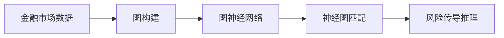

# 神经图匹配技术在金融风险传导推理中的应用创新

> 关键词：神经图匹配技术、金融风险传导推理、图神经网络、应用创新、风险分析

> 摘要：本文聚焦于神经图匹配技术在金融风险传导推理中的应用创新。首先介绍了相关背景，包括目的、预期读者等内容。接着阐述神经图匹配技术的核心概念、算法原理、数学模型。通过项目实战展示其在实际中的代码实现和分析。探讨了该技术在金融领域的实际应用场景，推荐了相关学习资源、开发工具和论文著作。最后总结其未来发展趋势与挑战，并给出常见问题解答和参考资料。旨在为金融领域利用神经图匹配技术进行风险传导推理提供全面的技术指导和理论支持。

## 1. 背景介绍 
### 1.1 目的和范围
金融市场是一个复杂的生态系统，其中各种金融机构、资产和交易之间存在着错综复杂的关系。金融风险传导是指一个金融机构或市场的风险通过各种渠道扩散到其他金融机构或市场，从而引发系统性金融风险的过程。准确识别和推理金融风险传导路径对于维护金融稳定、防范系统性金融风险至关重要。

神经图匹配技术作为一种新兴的人工智能技术，能够有效处理图结构数据，挖掘图中节点和边之间的复杂关系。本研究的目的是探索神经图匹配技术在金融风险传导推理中的应用创新，通过将金融市场中的各种关系抽象为图结构，利用神经图匹配技术来分析和推理风险传导路径，为金融监管和风险管理提供新的方法和工具。

本研究的范围主要包括神经图匹配技术的基本原理、在金融风险传导推理中的应用方法、相关算法和模型的实现，以及实际案例的分析和验证。

### 1.2 预期读者
本文的预期读者包括金融领域的从业者，如金融分析师、风险管理人员、监管人员等，他们可以通过本文了解神经图匹配技术在金融风险传导推理中的应用，为实际工作提供新的思路和方法。同时，也适合人工智能和计算机科学领域的研究人员和开发者，他们可以从金融应用的角度深入了解神经图匹配技术的实际应用场景和挑战。

### 1.3 文档结构概述
本文将按照以下结构进行组织：
- 核心概念与联系：介绍神经图匹配技术和金融风险传导推理的核心概念，以及它们之间的联系，并通过文本示意图和Mermaid流程图进行直观展示。
- 核心算法原理 & 具体操作步骤：详细讲解神经图匹配技术的核心算法原理，并使用Python源代码进行具体实现和步骤说明。
- 数学模型和公式 & 详细讲解 & 举例说明：给出神经图匹配技术在金融风险传导推理中的数学模型和公式，并通过具体例子进行详细讲解。
- 项目实战：代码实际案例和详细解释说明：通过一个实际的金融风险传导推理项目，展示神经图匹配技术的代码实现过程和详细解读。
- 实际应用场景：探讨神经图匹配技术在金融风险传导推理中的实际应用场景。
- 工具和资源推荐：推荐相关的学习资源、开发工具和论文著作，帮助读者进一步深入学习和研究。
- 总结：未来发展趋势与挑战：总结神经图匹配技术在金融风险传导推理中的应用现状，分析其未来发展趋势和面临的挑战。
- 附录：常见问题与解答：解答读者在学习和应用过程中可能遇到的常见问题。
- 扩展阅读 & 参考资料：提供相关的扩展阅读材料和参考资料，方便读者进一步查阅。

### 1.4 术语表
#### 1.4.1 核心术语定义
- 神经图匹配技术：是一种基于图神经网络的技术，用于处理图结构数据，通过学习图中节点和边的特征表示，实现图之间的匹配和相似性计算。
- 金融风险传导：指一个金融机构或市场的风险通过各种渠道扩散到其他金融机构或市场，从而引发系统性金融风险的过程。
- 图神经网络（Graph Neural Network, GNN）：是一类专门用于处理图结构数据的神经网络，能够学习图中节点和边的特征表示，挖掘图中的结构信息。
- 风险传导路径：指金融风险从一个金融机构或市场传递到其他金融机构或市场的具体路径。

#### 1.4.2 相关概念解释
- 图结构数据：由节点和边组成的数据结构，用于表示实体之间的关系。在金融领域，节点可以表示金融机构、资产等，边可以表示它们之间的交易、关联等关系。
- 特征表示：将节点和边的信息转换为低维向量的过程，以便于神经网络进行处理和学习。
- 相似性计算：计算两个图之间的相似程度，用于判断它们是否具有相似的结构和特征。

#### 1.4.3 缩略词列表
- GNN：Graph Neural Network（图神经网络）
- CNN：Convolutional Neural Network（卷积神经网络）
- RNN：Recurrent Neural Network（循环神经网络）

## 2. 核心概念与联系 
### 核心概念原理
#### 神经图匹配技术原理
神经图匹配技术的核心是图神经网络（GNN）。GNN通过消息传递机制，在图的节点和边之间传递信息，从而学习节点和边的特征表示。具体来说，GNN的每一层都会根据节点的邻居信息更新节点的特征，经过多层迭代后，节点的特征会融合图的全局结构信息。

在神经图匹配中，我们通常会将两个图的节点和边的特征表示进行比较，计算它们之间的相似性。常用的相似性度量方法包括欧氏距离、余弦相似度等。通过比较两个图的相似性，我们可以判断它们是否具有相似的结构和特征，从而实现图的匹配。

#### 金融风险传导推理原理
金融风险传导推理的核心是识别和分析金融风险在不同金融机构和市场之间的传导路径。这需要我们构建一个金融网络，将金融机构和市场抽象为节点，它们之间的交易和关联关系抽象为边。然后，通过分析网络中节点和边的特征，以及节点之间的信息传递，来推理风险传导路径。

例如，当一个金融机构出现风险时，我们可以通过分析它与其他金融机构的关联关系，以及这些关联关系的强度，来预测风险可能会传导到哪些其他金融机构。

### 架构的文本示意图
以下是神经图匹配技术在金融风险传导推理中的架构示意图：

金融市场数据 -> 图构建（节点：金融机构、资产；边：交易、关联关系） -> 图神经网络（学习节点和边的特征表示） -> 神经图匹配（计算图之间的相似性） -> 风险传导推理（识别风险传导路径）

### Mermaid流程图


## 3. 核心算法原理 & 具体操作步骤 
### 核心算法原理
在神经图匹配技术中，常用的图神经网络模型包括图卷积网络（GCN）、图注意力网络（GAT）等。这里以GCN为例，介绍其核心算法原理。

GCN的核心思想是通过邻居节点的信息来更新当前节点的特征。具体来说，GCN的第 $l$ 层的节点特征更新公式如下：

$$H^{(l+1)} = \sigma(\tilde{D}^{-\frac{1}{2}}\tilde{A}\tilde{D}^{-\frac{1}{2}}H^{(l)}W^{(l)})$$

其中，$H^{(l)}$ 是第 $l$ 层的节点特征矩阵，$W^{(l)}$ 是第 $l$ 层的可学习权重矩阵，$\tilde{A} = A + I$ 是邻接矩阵 $A$ 加上自环后的矩阵，$\tilde{D}$ 是 $\tilde{A}$ 的度矩阵，$\sigma$ 是激活函数，通常使用ReLU函数。

### 具体操作步骤
以下是使用Python和PyTorch实现一个简单的GCN模型进行神经图匹配的具体步骤：

```python
import torch
import torch.nn as nn
import torch.nn.functional as F

# 定义GCN层
class GCNLayer(nn.Module):
    def __init__(self, in_features, out_features):
        super(GCNLayer, self).__init__()
        self.linear = nn.Linear(in_features, out_features)

    def forward(self, x, adj):
        # 邻接矩阵归一化
        adj = adj + torch.eye(adj.size(0)).to(adj.device)
        d = torch.diag(torch.pow(adj.sum(dim=1), -0.5))
        adj_norm = torch.mm(torch.mm(d, adj), d)

        # 消息传递
        x = torch.mm(adj_norm, x)
        x = self.linear(x)
        x = F.relu(x)
        return x

# 定义GCN模型
class GCN(nn.Module):
    def __init__(self, in_features, hidden_features, out_features):
        super(GCN, self).__init__()
        self.gcn1 = GCNLayer(in_features, hidden_features)
        self.gcn2 = GCNLayer(hidden_features, out_features)

    def forward(self, x, adj):
        x = self.gcn1(x, adj)
        x = self.gcn2(x, adj)
        return x

# 示例数据
num_nodes = 10
in_features = 5
hidden_features = 10
out_features = 3

x = torch.randn(num_nodes, in_features)
adj = torch.randn(num_nodes, num_nodes)
adj = (adj > 0).float()  # 邻接矩阵

# 初始化模型
model = GCN(in_features, hidden_features, out_features)

# 前向传播
output = model(x, adj)
print(output.shape)
```

### 代码解释
1. **GCNLayer类**：定义了一个GCN层，包含一个线性层和一个ReLU激活函数。在`forward`方法中，首先对邻接矩阵进行归一化处理，然后进行消息传递和特征变换。
2. **GCN类**：定义了一个两层的GCN模型，包含两个GCN层。
3. **示例数据**：生成了随机的节点特征矩阵和邻接矩阵。
4. **模型初始化**：初始化GCN模型。
5. **前向传播**：将节点特征矩阵和邻接矩阵输入到模型中，得到输出结果。

## 4. 数学模型和公式 & 详细讲解 & 举例说明 
### 数学模型和公式
#### GCN的数学模型
如前面所述，GCN的第 $l$ 层的节点特征更新公式为：

$$H^{(l+1)} = \sigma(\tilde{D}^{-\frac{1}{2}}\tilde{A}\tilde{D}^{-\frac{1}{2}}H^{(l)}W^{(l)})$$

其中，$H^{(l)} \in \mathbb{R}^{N \times F^{(l)}}$ 是第 $l$ 层的节点特征矩阵，$N$ 是节点数量，$F^{(l)}$ 是第 $l$ 层的特征维度；$W^{(l)} \in \mathbb{R}^{F^{(l)} \times F^{(l+1)}}$ 是第 $l$ 层的可学习权重矩阵；$\tilde{A} = A + I$ 是邻接矩阵 $A$ 加上自环后的矩阵，$\tilde{D}$ 是 $\tilde{A}$ 的度矩阵；$\sigma$ 是激活函数。

#### 神经图匹配的相似性计算
在神经图匹配中，我们通常使用余弦相似度来计算两个图的节点特征表示之间的相似性。余弦相似度的计算公式如下：

$$\text{cosine similarity}(u, v) = \frac{u \cdot v}{\|u\| \|v\|}$$

其中，$u$ 和 $v$ 是两个节点的特征向量。

### 详细讲解
#### GCN的消息传递机制
GCN的消息传递机制可以理解为将邻居节点的信息传递给当前节点。具体来说，$\tilde{D}^{-\frac{1}{2}}\tilde{A}\tilde{D}^{-\frac{1}{2}}$ 是邻接矩阵的归一化形式，它表示了节点之间的连接权重。通过将这个归一化邻接矩阵与节点特征矩阵相乘，我们可以将邻居节点的特征信息传递给当前节点。然后，通过线性变换和激活函数，更新当前节点的特征。

#### 神经图匹配的相似性计算
余弦相似度是一种常用的向量相似度度量方法，它衡量了两个向量之间的夹角余弦值。余弦相似度的值越接近1，表示两个向量越相似；值越接近 -1，表示两个向量越不相似。在神经图匹配中，我们可以通过计算两个图的节点特征表示之间的余弦相似度，来判断它们是否具有相似的结构和特征。

### 举例说明
假设我们有一个包含3个节点的图，节点特征矩阵 $H^{(0)} = \begin{bmatrix} 1 & 2 \\ 3 & 4 \\ 5 & 6 \end{bmatrix}$，邻接矩阵 $A = \begin{bmatrix} 0 & 1 & 0 \\ 1 & 0 & 1 \\ 0 & 1 & 0 \end{bmatrix}$。

首先，计算 $\tilde{A} = A + I = \begin{bmatrix} 1 & 1 & 0 \\ 1 & 1 & 1 \\ 0 & 1 & 1 \end{bmatrix}$，$\tilde{D} = \begin{bmatrix} 2 & 0 & 0 \\ 0 & 3 & 0 \\ 0 & 0 & 2 \end{bmatrix}$，$\tilde{D}^{-\frac{1}{2}} = \begin{bmatrix} \frac{1}{\sqrt{2}} & 0 & 0 \\ 0 & \frac{1}{\sqrt{3}} & 0 \\ 0 & 0 & \frac{1}{\sqrt{2}} \end{bmatrix}$。

然后，计算 $\tilde{D}^{-\frac{1}{2}}\tilde{A}\tilde{D}^{-\frac{1}{2}} = \begin{bmatrix} \frac{1}{2} & \frac{1}{\sqrt{6}} & 0 \\ \frac{1}{\sqrt{6}} & \frac{1}{3} & \frac{1}{\sqrt{6}} \\ 0 & \frac{1}{\sqrt{6}} & \frac{1}{2} \end{bmatrix}$。

假设 $W^{(0)} = \begin{bmatrix} 1 & 2 \\ 3 & 4 \end{bmatrix}$，则 $H^{(1)} = \sigma(\tilde{D}^{-\frac{1}{2}}\tilde{A}\tilde{D}^{-\frac{1}{2}}H^{(0)}W^{(0)})$。

具体计算过程如下：

$\tilde{D}^{-\frac{1}{2}}\tilde{A}\tilde{D}^{-\frac{1}{2}}H^{(0)} = \begin{bmatrix} \frac{1}{2} & \frac{1}{\sqrt{6}} & 0 \\ \frac{1}{\sqrt{6}} & \frac{1}{3} & \frac{1}{\sqrt{6}} \\ 0 & \frac{1}{\sqrt{6}} & \frac{1}{2} \end{bmatrix} \begin{bmatrix} 1 & 2 \\ 3 & 4 \\ 5 & 6 \end{bmatrix} = \begin{bmatrix} \frac{1}{2} + \frac{3}{\sqrt{6}} & 1 + \frac{4}{\sqrt{6}} \\ \frac{1}{\sqrt{6}} + 1 + \frac{5}{\sqrt{6}} & \frac{2}{\sqrt{6}} + \frac{4}{3} + \frac{6}{\sqrt{6}} \\ \frac{3}{\sqrt{6}} + \frac{5}{2} & \frac{4}{\sqrt{6}} + 3 \end{bmatrix}$

$H^{(1)} = \sigma(\tilde{D}^{-\frac{1}{2}}\tilde{A}\tilde{D}^{-\frac{1}{2}}H^{(0)}W^{(0)}) = \text{ReLU}(\begin{bmatrix} \frac{1}{2} + \frac{3}{\sqrt{6}} & 1 + \frac{4}{\sqrt{6}} \\ \frac{1}{\sqrt{6}} + 1 + \frac{5}{\sqrt{6}} & \frac{2}{\sqrt{6}} + \frac{4}{3} + \frac{6}{\sqrt{6}} \\ \frac{3}{\sqrt{6}} + \frac{5}{2} & \frac{4}{\sqrt{6}} + 3 \end{bmatrix} \begin{bmatrix} 1 & 2 \\ 3 & 4 \end{bmatrix})$

通过以上计算，我们可以得到第1层的节点特征矩阵 $H^{(1)}$。

## 5. 项目实战：代码实际案例和详细解释说明 
### 5.1  开发环境搭建
#### 安装Python和Anaconda
首先，确保你已经安装了Python和Anaconda。Anaconda是一个流行的Python数据科学平台，它包含了许多常用的科学计算库和工具。你可以从Anaconda官方网站（https://www.anaconda.com/products/individual）下载并安装适合你操作系统的Anaconda版本。

#### 创建虚拟环境
为了避免不同项目之间的依赖冲突，我们建议使用虚拟环境。在Anaconda Prompt（Windows）或终端（Linux/Mac）中，运行以下命令创建一个新的虚拟环境：

```bash
conda create -n graph_matching python=3.8
conda activate graph_matching
```

#### 安装必要的库
在虚拟环境中，安装以下必要的库：

```bash
pip install torch torchvision torchaudio
pip install dgl  # Deep Graph Library
pip install pandas numpy matplotlib
```

### 5.2  源代码详细实现和代码解读
以下是一个使用DGL库实现的神经图匹配技术在金融风险传导推理中的项目实战代码：

```python
import dgl
import torch
import torch.nn as nn
import torch.nn.functional as F
import pandas as pd
import numpy as np
import matplotlib.pyplot as plt

# 构建金融图数据
def build_financial_graph():
    # 示例数据：金融机构和它们之间的关联关系
    edges_src = torch.tensor([0, 1, 2, 3])
    edges_dst = torch.tensor([1, 2, 3, 0])
    g = dgl.graph((edges_src, edges_dst))

    # 节点特征
    node_features = torch.randn(g.num_nodes(), 10)
    g.ndata['feat'] = node_features

    return g

# 定义GCN模型
class GCN(nn.Module):
    def __init__(self, in_feats, h_feats, num_classes):
        super(GCN, self).__init__()
        self.conv1 = dgl.nn.GraphConv(in_feats, h_feats)
        self.conv2 = dgl.nn.GraphConv(h_feats, num_classes)

    def forward(self, g, in_feat):
        h = self.conv1(g, in_feat)
        h = F.relu(h)
        h = self.conv2(g, h)
        return h

# 训练模型
def train_model(g, model):
    optimizer = torch.optim.Adam(model.parameters(), lr=0.01)
    best_val_acc = 0
    best_test_acc = 0

    features = g.ndata['feat']
    labels = torch.randint(0, 2, (g.num_nodes(),))  # 示例标签

    for e in range(100):
        # 前向传播
        logits = model(g, features)
        pred = logits.argmax(1)

        # 计算损失
        loss = F.cross_entropy(logits, labels)

        # 反向传播
        optimizer.zero_grad()
        loss.backward()
        optimizer.step()

        if e % 5 == 0:
            print(f'Epoch {e}, Loss: {loss.item()}')

    return model

# 主函数
def main():
    # 构建金融图
    g = build_financial_graph()

    # 初始化模型
    in_feats = g.ndata['feat'].shape[1]
    h_feats = 20
    num_classes = 2
    model = GCN(in_feats, h_feats, num_classes)

    # 训练模型
    trained_model = train_model(g, model)

    # 进行风险传导推理
    features = g.ndata['feat']
    logits = trained_model(g, features)
    pred = logits.argmax(1)

    print('Risk propagation prediction:', pred)

if __name__ == '__main__':
    main()
```

### 5.3  代码解读与分析
#### `build_financial_graph`函数
该函数用于构建金融图数据。它创建了一个简单的图，包含4个节点和4条边，并为每个节点随机生成了10维的特征向量。

#### `GCN`类
该类定义了一个两层的GCN模型。使用`dgl.nn.GraphConv`层进行消息传递和特征变换。

#### `train_model`函数
该函数用于训练GCN模型。使用交叉熵损失函数和Adam优化器进行训练，训练过程中每5个epoch打印一次损失值。

#### `main`函数
该函数是主函数，负责调用上述函数完成整个流程。首先构建金融图，然后初始化模型，接着训练模型，最后使用训练好的模型进行风险传导推理，并打印预测结果。

## 6. 实际应用场景 
### 金融机构风险评估
神经图匹配技术可以用于评估金融机构之间的风险关联程度。通过构建金融机构之间的关联图，利用神经图匹配技术计算不同金融机构的图结构相似度，从而评估它们之间的风险传导可能性。例如，如果两个金融机构的图结构相似度较高，那么当其中一个机构出现风险时，另一个机构受到影响的可能性也较大。

### 金融市场系统性风险监测
在金融市场中，系统性风险是指由整个市场因素引起的风险，可能导致多个金融机构和市场同时受到影响。神经图匹配技术可以用于监测金融市场的系统性风险。通过实时分析金融市场中不同板块和机构之间的图结构变化，当发现某些图结构相似度发生异常变化时，可能预示着系统性风险的来临。

### 投资组合风险分析
在投资组合管理中，需要评估不同资产之间的风险关联程度，以优化投资组合的风险收益特征。神经图匹配技术可以用于分析投资组合中不同资产的图结构相似度，从而识别出可能存在的风险传导路径。例如，如果投资组合中的某些资产的图结构相似度较高，那么它们可能会同时受到某些风险因素的影响，需要进行相应的风险分散。

## 7. 工具和资源推荐
### 7.1 学习资源推荐
#### 7.1.1 书籍推荐
- 《图神经网络：基础、前沿与应用》：全面介绍了图神经网络的基本原理、算法和应用，是学习图神经网络的经典书籍。
- 《深度学习》：由深度学习领域的三位先驱Ian Goodfellow、Yoshua Bengio和Aaron Courville撰写，是深度学习领域的权威教材，其中也包含了神经网络的基础知识。

#### 7.1.2 在线课程
- Coursera上的“Graph Neural Networks”课程：由知名教授讲授，详细介绍了图神经网络的理论和实践。
- 吴恩达的“Deep Learning Specialization”课程：虽然不是专门针对图神经网络，但可以帮助你建立深度学习的基础。

#### 7.1.3 技术博客和网站
- DGL官方文档（https://docs.dgl.ai/）：DGL是一个流行的图神经网络库，其官方文档提供了详细的教程和API文档。
- Graph Neural Networks Research Hub（https://graphneural.network/）：一个专门的图神经网络研究网站，包含了最新的研究成果和开源代码。

### 7.2 开发工具框架推荐
#### 7.2.1 IDE和编辑器
- PyCharm：是一个功能强大的Python集成开发环境，支持代码调试、自动补全、版本控制等功能。
- Jupyter Notebook：是一个交互式的编程环境，适合进行数据分析和模型实验。

#### 7.2.2 调试和性能分析工具
- TensorBoard：是TensorFlow的可视化工具，可以用于可视化模型的训练过程、损失曲线等。
- PyTorch Profiler：可以用于分析PyTorch模型的性能瓶颈，帮助优化代码。

#### 7.2.3 相关框架和库
- DGL（Deep Graph Library）：是一个用于图神经网络的深度学习框架，提供了丰富的图神经网络模型和工具。
- PyTorch Geometric：是一个基于PyTorch的图神经网络库，支持高效的图数据处理和模型训练。

### 7.3 相关论文著作推荐
#### 7.3.1 经典论文
- “Semi-Supervised Classification with Graph Convolutional Networks”：提出了图卷积网络（GCN）的经典论文，奠定了图神经网络的基础。
- “Graph Attention Networks”：提出了图注意力网络（GAT），通过引入注意力机制提高了图神经网络的性能。

#### 7.3.2 最新研究成果
- 可以关注NeurIPS、ICML、KDD等顶级机器学习会议上关于图神经网络和金融风险分析的最新研究成果。

#### 7.3.3 应用案例分析
- 一些金融科技公司和研究机构会发布关于神经图匹配技术在金融领域应用的案例分析报告，可以通过搜索引擎查找相关资料。

## 8. 总结：未来发展趋势与挑战
### 未来发展趋势
#### 与其他技术的融合
神经图匹配技术可能会与其他人工智能技术，如自然语言处理、计算机视觉等进行融合，以更全面地分析金融数据和风险。例如，结合自然语言处理技术分析新闻报道和社交媒体数据，获取更多的金融市场信息，从而提高风险传导推理的准确性。

#### 模型的可解释性增强
随着金融监管的加强，模型的可解释性变得越来越重要。未来的研究可能会致力于提高神经图匹配技术的可解释性，使金融从业者能够更好地理解模型的决策过程和结果。

#### 应用场景的拓展
除了金融风险传导推理，神经图匹配技术还可能在金融领域的其他方面得到应用，如金融产品推荐、信用评估等。同时，也可能会拓展到其他行业，如医疗、交通等。

### 挑战
#### 数据质量和隐私问题
金融数据通常具有高维度、复杂和敏感的特点，数据质量和隐私问题是神经图匹配技术应用的重要挑战。需要确保数据的准确性和完整性，同时保护数据的隐私和安全。

#### 模型的计算复杂度
图神经网络的计算复杂度较高，尤其是在处理大规模图数据时。需要研究更高效的算法和优化策略，以提高模型的训练和推理速度。

#### 理论基础的完善
虽然图神经网络已经取得了很大的进展，但相关的理论基础还不够完善。需要进一步研究图神经网络的收敛性、泛化能力等理论问题，为模型的应用提供更坚实的理论支持。

## 9. 附录：常见问题与解答
### 问题1：神经图匹配技术与传统的图匹配方法有什么区别？
神经图匹配技术利用图神经网络学习图的特征表示，能够自动挖掘图中节点和边之间的复杂关系，而传统的图匹配方法通常基于手工特征和规则，难以处理复杂的图结构。神经图匹配技术在处理大规模图数据和复杂图结构时具有更好的性能和泛化能力。

### 问题2：如何选择合适的图神经网络模型？
选择合适的图神经网络模型需要考虑多个因素，如数据的特点、任务的要求、计算资源等。如果数据具有较强的局部结构信息，可以选择图卷积网络（GCN）；如果需要考虑节点之间的重要性差异，可以选择图注意力网络（GAT）。此外，还可以通过实验比较不同模型的性能，选择最优的模型。

### 问题3：神经图匹配技术在金融领域的应用需要多少数据？
数据量的需求取决于具体的应用场景和模型的复杂度。一般来说，数据量越大，模型的性能越好。但在实际应用中，由于金融数据的敏感性和获取难度，可能无法获取大量的数据。可以通过数据增强、迁移学习等方法来缓解数据不足的问题。

## 10. 扩展阅读 & 参考资料
### 扩展阅读
- 《人工智能：现代方法》：全面介绍了人工智能的基本概念、算法和应用，有助于深入理解人工智能的相关知识。
- 《网络科学》：介绍了网络科学的基本理论和方法，对于理解图结构数据和金融网络有很大的帮助。

### 参考资料
- Kipf, T. N., & Welling, M. (2016). Semi-Supervised Classification with Graph Convolutional Networks. arXiv preprint arXiv:1609.02907.
- Veličković, P., Cucurull, G., Casanova, A., Romero, A., Liò, P., & Bengio, Y. (2017). Graph Attention Networks. arXiv preprint arXiv:1710.10903.

作者：AI天才研究院/AI Genius Institute & 禅与计算机程序设计艺术 /Zen And The Art of Computer Programming