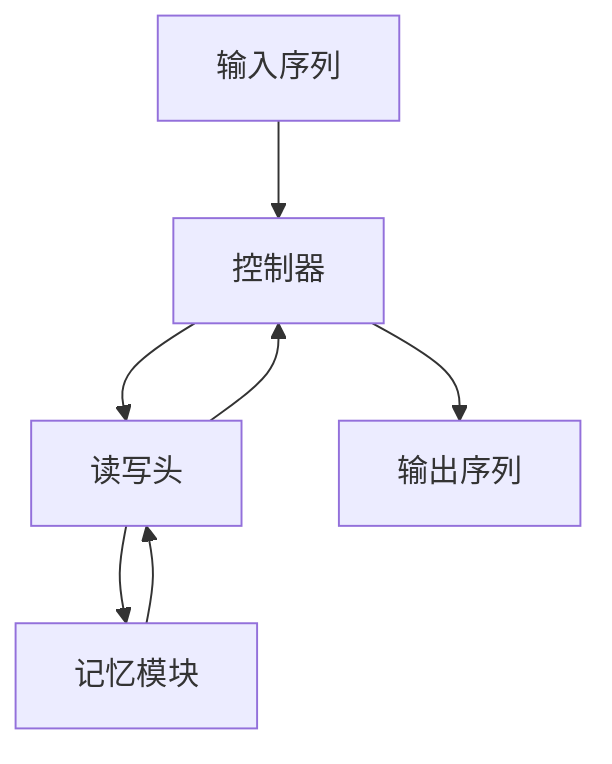

# 神经图灵机:增强AI的可编程性

> 关键词：神经图灵机、人工智能、可编程性、记忆机制、深度学习

> 摘要：本文围绕神经图灵机展开，深入探讨其如何增强AI的可编程性。首先介绍了神经图灵机提出的背景和相关概念，接着阐述了核心概念、算法原理及具体操作步骤，通过数学模型和公式详细剖析其工作机制。结合项目实战，给出代码实际案例并进行解读。分析了神经图灵机在不同领域的实际应用场景，推荐了相关的学习资源、开发工具框架和论文著作。最后总结了神经图灵机的未来发展趋势与挑战，并提供常见问题解答和扩展阅读参考资料，旨在让读者全面深入地了解神经图灵机及其对AI可编程性的提升作用。

## 1. 背景介绍 
### 1.1 目的和范围
传统的神经网络虽然在很多领域取得了显著的成果，如图像识别、自然语言处理等，但在处理需要长期记忆和复杂推理的任务时，表现出一定的局限性。神经图灵机（Neural Turing Machine, NTM）的提出旨在解决这些问题，增强人工智能系统的可编程性和记忆能力。本文的范围涵盖了神经图灵机的基本概念、算法原理、数学模型、实际应用案例以及相关的工具和资源推荐，旨在为读者提供一个全面深入的关于神经图灵机的知识体系。

### 1.2 预期读者
本文的预期读者包括对人工智能、深度学习领域感兴趣的研究人员、开发者，以及希望了解神经图灵机原理和应用的学生。对于有一定编程基础和机器学习知识的读者，能够更深入地理解文中的代码实现和算法细节；而对于初学者，通过阅读本文也可以对神经图灵机有一个初步的认识和了解。

### 1.3 文档结构概述
本文将按照以下结构进行阐述：首先介绍神经图灵机的核心概念与联系，包括其原理和架构的示意图及流程图；接着详细讲解核心算法原理和具体操作步骤，并使用Python源代码进行说明；然后给出神经图灵机的数学模型和公式，并通过举例进行详细讲解；之后通过项目实战，展示代码实际案例并进行详细解释；分析神经图灵机的实际应用场景；推荐相关的学习资源、开发工具框架和论文著作；最后总结神经图灵机的未来发展趋势与挑战，提供常见问题解答和扩展阅读参考资料。

### 1.4 术语表
#### 1.4.1 核心术语定义
- **神经图灵机（Neural Turing Machine, NTM）**：一种结合了神经网络和图灵机概念的计算模型，它引入了外部记忆模块，使得神经网络能够进行更复杂的计算和长期记忆，从而增强了人工智能系统的可编程性。
- **控制器（Controller）**：神经图灵机中的一个神经网络组件，负责根据输入生成读写操作的指令，控制对外部记忆模块的访问。
- **记忆模块（Memory）**：神经图灵机的外部存储单元，用于存储信息，控制器可以通过读写头对其进行读写操作。
- **读写头（Read/Write Head）**：负责与记忆模块进行交互的组件，读头从记忆模块中读取信息，写头将信息写入记忆模块。

#### 1.4.2 相关概念解释
- **图灵机**：由英国数学家艾伦·图灵提出的一种抽象计算模型，它由一个无限长的纸带和一个读写头组成，读写头可以在纸带上移动、读取和写入符号，能够模拟任何可计算的算法。神经图灵机借鉴了图灵机的思想，引入了外部记忆模块，使得神经网络能够进行更灵活的计算。
- **注意力机制（Attention Mechanism）**：在神经图灵机中，注意力机制用于控制读写头对记忆模块的访问。通过计算注意力权重，读写头可以有选择地读取或写入记忆模块中的特定位置，从而提高信息处理的效率和准确性。

#### 1.4.3 缩略词列表
- **NTM**：Neural Turing Machine（神经图灵机）
- **RNN**：Recurrent Neural Network（循环神经网络）
- **LSTM**：Long Short-Term Memory（长短期记忆网络）

## 2. 核心概念与联系 
神经图灵机的核心思想是将神经网络与外部记忆模块相结合，使得神经网络能够像图灵机一样进行更复杂的计算和长期记忆。其基本架构主要由控制器、记忆模块和读写头组成。

### 核心概念原理

控制器是一个神经网络，它接收输入序列，并根据输入生成读写操作的指令。这些指令包括读头和写头的位置、注意力权重等，用于控制对记忆模块的访问。记忆模块是一个二维矩阵，用于存储信息，每一行代表一个记忆单元，每一列代表一个特征维度。读写头负责与记忆模块进行交互，读头从记忆模块中读取信息，写头将信息写入记忆模块。

神经图灵机的工作流程如下：首先，控制器接收输入序列，并根据输入生成读写操作的指令；然后，读写头根据指令对记忆模块进行读写操作；最后，控制器根据读头读取的信息和输入序列生成输出。

### 架构的文本示意图

```plaintext
+-----------------+         +-----------------+         +-----------------+
|     输入序列     |         |     控制器     |         |     输出序列     |
+-----------------+         +-----------------+         +-----------------+
         |                        |                        |
         |                        |                        |
         |                        |                        |
         v                        v                        ^
+-----------------+         +-----------------+         +-----------------+
|     记忆模块     | <------ |     读写头     | ------> |     记忆模块     |
+-----------------+         +-----------------+         +-----------------+
```

### Mermaid 流程图



## 3. 核心算法原理 & 具体操作步骤 

### 核心算法原理

神经图灵机的核心算法主要包括控制器的训练和读写头的操作。控制器通常使用循环神经网络（RNN）或长短期记忆网络（LSTM）实现，其目标是根据输入序列生成读写操作的指令。读写头的操作包括读操作和写操作，读操作根据注意力权重从记忆模块中读取信息，写操作根据注意力权重将信息写入记忆模块。

### 具体操作步骤

#### 步骤 1：初始化
- 初始化控制器的参数 $\theta_c$ 和记忆模块 $M$。
- 初始化读写头的位置和注意力权重。

#### 步骤 2：输入处理
- 控制器接收输入序列 $x_t$，并根据输入生成读写操作的指令，包括读头的注意力权重 $w_{r,t}$ 和写头的注意力权重 $w_{w,t}$。

#### 步骤 3：读操作
- 读头根据注意力权重 $w_{r,t}$ 从记忆模块 $M$ 中读取信息 $r_t$，计算公式为：
$$r_t = \sum_{i=1}^N w_{r,t}(i) M_t(i)$$
其中，$N$ 是记忆模块的行数，$w_{r,t}(i)$ 是第 $i$ 行的注意力权重，$M_t(i)$ 是第 $i$ 行的记忆单元。

#### 步骤 4：写操作
- 写头根据注意力权重 $w_{w,t}$ 将信息写入记忆模块 $M$，包括擦除操作和添加操作。
- 擦除操作：
$$M_t'(i) = M_{t-1}(i) \odot (1 - w_{w,t}(i) e_t)$$
其中，$M_{t-1}(i)$ 是上一时刻第 $i$ 行的记忆单元，$e_t$ 是擦除向量。
- 添加操作：
$$M_t(i) = M_t'(i) + w_{w,t}(i) a_t$$
其中，$a_t$ 是添加向量。

#### 步骤 5：输出生成
- 控制器根据读头读取的信息 $r_t$ 和输入序列 $x_t$ 生成输出序列 $y_t$。

#### 步骤 6：参数更新
- 使用反向传播算法更新控制器的参数 $\theta_c$。

### Python源代码实现

```python
import torch
import torch.nn as nn
import torch.nn.functional as F

# 定义控制器
class Controller(nn.Module):
    def __init__(self, input_size, hidden_size, output_size):
        super(Controller, self).__init__()
        self.rnn = nn.LSTM(input_size, hidden_size, batch_first=True)
        self.fc = nn.Linear(hidden_size, output_size)

    def forward(self, x):
        out, _ = self.rnn(x)
        out = self.fc(out)
        return out

# 定义神经图灵机
class NeuralTuringMachine(nn.Module):
    def __init__(self, input_size, hidden_size, output_size, memory_size, memory_length):
        super(NeuralTuringMachine, self).__init__()
        self.controller = Controller(input_size, hidden_size, output_size)
        self.memory = torch.zeros(memory_size, memory_length)
        self.read_head = None
        self.write_head = None

    def forward(self, x):
        # 控制器生成读写指令
        instructions = self.controller(x)

        # 读操作
        read_output = self.read(instructions)

        # 写操作
        self.write(instructions)

        # 生成输出
        output = instructions + read_output
        return output

    def read(self, instructions):
        # 计算读头的注意力权重
        w_r = F.softmax(instructions[:, :self.memory.size(0)], dim=1)
        read_output = torch.matmul(w_r, self.memory)
        return read_output

    def write(self, instructions):
        # 计算写头的注意力权重
        w_w = F.softmax(instructions[:, self.memory.size(0):2*self.memory.size(0)], dim=1)

        # 擦除操作
        e = torch.sigmoid(instructions[:, 2*self.memory.size(0):3*self.memory.size(0)])
        self.memory = self.memory * (1 - w_w.unsqueeze(-1) * e.unsqueeze(-1))

        # 添加操作
        a = instructions[:, 3*self.memory.size(0):]
        self.memory = self.memory + w_w.unsqueeze(-1) * a.unsqueeze(-1)

# 测试代码
input_size = 10
hidden_size = 20
output_size = 5
memory_size = 10
memory_length = 20

ntm = NeuralTuringMachine(input_size, hidden_size, output_size, memory_size, memory_length)
x = torch.randn(1, 1, input_size)
output = ntm(x)
print(output)
```

## 4. 数学模型和公式 & 详细讲解 & 举例说明 

### 数学模型和公式

#### 控制器
控制器通常使用循环神经网络（RNN）或长短期记忆网络（LSTM）实现，其输入为输入序列 $x_t$，输出为读写操作的指令 $u_t$。以LSTM为例，其计算公式为：
$$i_t = \sigma(W_{ii} x_t + W_{hi} h_{t-1} + b_i)$$
$$f_t = \sigma(W_{if} x_t + W_{hf} h_{t-1} + b_f)$$
$$g_t = \tanh(W_{ig} x_t + W_{hg} h_{t-1} + b_g)$$
$$o_t = \sigma(W_{io} x_t + W_{ho} h_{t-1} + b_o)$$
$$c_t = f_t \odot c_{t-1} + i_t \odot g_t$$
$$h_t = o_t \odot \tanh(c_t)$$
$$u_t = W_{hu} h_t + b_u$$
其中，$i_t$、$f_t$、$g_t$、$o_t$ 分别是输入门、遗忘门、候选记忆单元和输出门，$c_t$ 是细胞状态，$h_t$ 是隐藏状态，$W$ 是权重矩阵，$b$ 是偏置向量，$\sigma$ 是 sigmoid 函数，$\tanh$ 是双曲正切函数。

#### 读操作
读头根据注意力权重 $w_{r,t}$ 从记忆模块 $M$ 中读取信息 $r_t$，计算公式为：
$$r_t = \sum_{i=1}^N w_{r,t}(i) M_t(i)$$
其中，$N$ 是记忆模块的行数，$w_{r,t}(i)$ 是第 $i$ 行的注意力权重，$M_t(i)$ 是第 $i$ 行的记忆单元。

#### 写操作
写操作包括擦除操作和添加操作。
- 擦除操作：
$$M_t'(i) = M_{t-1}(i) \odot (1 - w_{w,t}(i) e_t)$$
其中，$M_{t-1}(i)$ 是上一时刻第 $i$ 行的记忆单元，$e_t$ 是擦除向量。
- 添加操作：
$$M_t(i) = M_t'(i) + w_{w,t}(i) a_t$$
其中，$a_t$ 是添加向量。

### 详细讲解

控制器的作用是根据输入序列生成读写操作的指令，通过LSTM可以有效地处理序列信息，并捕捉长期依赖关系。读操作通过注意力权重从记忆模块中选择需要读取的信息，注意力权重可以根据输入动态调整，从而实现对记忆模块的灵活访问。写操作包括擦除和添加两个步骤，擦除操作可以清除记忆模块中的部分信息，添加操作可以将新的信息写入记忆模块。

### 举例说明

假设记忆模块 $M$ 是一个 $3 \times 2$ 的矩阵：
$$M = \begin{bmatrix}
1 & 2 \\
3 & 4 \\
5 & 6
\end{bmatrix}$$
读头的注意力权重 $w_r = [0.2, 0.3, 0.5]$，则读操作读取的信息 $r$ 为：
$$r = 0.2 \times \begin{bmatrix}1 \\ 2\end{bmatrix} + 0.3 \times \begin{bmatrix}3 \\ 4\end{bmatrix} + 0.5 \times \begin{bmatrix}5 \\ 6\end{bmatrix} = \begin{bmatrix}3.6 \\ 4.8\end{bmatrix}$$

假设写头的注意力权重 $w_w = [0.1, 0.6, 0.3]$，擦除向量 $e = [0.5, 0.5]$，添加向量 $a = [1, 1]$，则写操作的过程如下：
- 擦除操作：
$$M' = \begin{bmatrix}
1 & 2 \\
3 & 4 \\
5 & 6
\end{bmatrix} \odot \begin{bmatrix}
(1 - 0.1 \times 0.5) & (1 - 0.1 \times 0.5) \\
(1 - 0.6 \times 0.5) & (1 - 0.6 \times 0.5) \\
(1 - 0.3 \times 0.5) & (1 - 0.3 \times 0.5)
\end{bmatrix} = \begin{bmatrix}
0.95 & 1.9 \\
1.2 & 1.6 \\
4.25 & 5.1
\end{bmatrix}$$
- 添加操作：
$$M = \begin{bmatrix}
0.95 & 1.9 \\
1.2 & 1.6 \\
4.25 & 5.1
\end{bmatrix} + \begin{bmatrix}
0.1 \times 1 & 0.1 \times 1 \\
0.6 \times 1 & 0.6 \times 1 \\
0.3 \times 1 & 0.3 \times 1
\end{bmatrix} = \begin{bmatrix}
1.05 & 2 \\
1.8 & 2.2 \\
4.55 & 5.4
\end{bmatrix}$$

## 5. 项目实战：代码实际案例和详细解释说明 

### 5.1  开发环境搭建
为了实现神经图灵机的项目实战，我们需要搭建相应的开发环境。以下是具体的步骤：

#### 安装Python
首先，确保你已经安装了Python 3.x版本。可以从Python官方网站（https://www.python.org/downloads/）下载并安装适合你操作系统的Python版本。

#### 安装深度学习框架
我们使用PyTorch作为深度学习框架，因为它具有简洁易用的API和强大的计算能力。可以使用以下命令安装PyTorch：
```sh
pip install torch torchvision
```

#### 安装其他依赖库
还需要安装一些其他的依赖库，如NumPy、Matplotlib等，可以使用以下命令安装：
```sh
pip install numpy matplotlib
```

### 5.2  源代码详细实现和代码解读

```python
import torch
import torch.nn as nn
import torch.nn.functional as F
import numpy as np
import matplotlib.pyplot as plt

# 定义控制器
class Controller(nn.Module):
    def __init__(self, input_size, hidden_size, output_size):
        super(Controller, self).__init__()
        self.rnn = nn.LSTM(input_size, hidden_size, batch_first=True)
        self.fc = nn.Linear(hidden_size, output_size)

    def forward(self, x):
        out, _ = self.rnn(x)
        out = self.fc(out)
        return out

# 定义神经图灵机
class NeuralTuringMachine(nn.Module):
    def __init__(self, input_size, hidden_size, output_size, memory_size, memory_length):
        super(NeuralTuringMachine, self).__init__()
        self.controller = Controller(input_size, hidden_size, output_size)
        self.memory = torch.zeros(memory_size, memory_length)
        self.read_head = None
        self.write_head = None

    def forward(self, x):
        # 控制器生成读写指令
        instructions = self.controller(x)

        # 读操作
        read_output = self.read(instructions)

        # 写操作
        self.write(instructions)

        # 生成输出
        output = instructions + read_output
        return output

    def read(self, instructions):
        # 计算读头的注意力权重
        w_r = F.softmax(instructions[:, :self.memory.size(0)], dim=1)
        read_output = torch.matmul(w_r, self.memory)
        return read_output

    def write(self, instructions):
        # 计算写头的注意力权重
        w_w = F.softmax(instructions[:, self.memory.size(0):2*self.memory.size(0)], dim=1)

        # 擦除操作
        e = torch.sigmoid(instructions[:, 2*self.memory.size(0):3*self.memory.size(0)])
        self.memory = self.memory * (1 - w_w.unsqueeze(-1) * e.unsqueeze(-1))

        # 添加操作
        a = instructions[:, 3*self.memory.size(0):]
        self.memory = self.memory + w_w.unsqueeze(-1) * a.unsqueeze(-1)

# 训练函数
def train(ntm, criterion, optimizer, input_data, target_data, epochs):
    losses = []
    for epoch in range(epochs):
        optimizer.zero_grad()
        output = ntm(input_data)
        loss = criterion(output, target_data)
        loss.backward()
        optimizer.step()
        losses.append(loss.item())
        if (epoch + 1) % 100 == 0:
            print(f'Epoch {epoch + 1}/{epochs}, Loss: {loss.item()}')
    return losses

# 测试代码
input_size = 10
hidden_size = 20
output_size = 5
memory_size = 10
memory_length = 20

ntm = NeuralTuringMachine(input_size, hidden_size, output_size, memory_size, memory_length)
criterion = nn.MSELoss()
optimizer = torch.optim.Adam(ntm.parameters(), lr=0.001)

input_data = torch.randn(1, 1, input_size)
target_data = torch.randn(1, 1, output_size)

epochs = 1000
losses = train(ntm, criterion, optimizer, input_data, target_data, epochs)

# 绘制损失曲线
plt.plot(losses)
plt.xlabel('Epoch')
plt.ylabel('Loss')
plt.title('Training Loss')
plt.show()
```

### 代码解读与分析

#### 控制器部分
`Controller` 类是一个基于LSTM的神经网络，用于生成读写操作的指令。`__init__` 方法初始化了LSTM层和全连接层，`forward` 方法实现了前向传播过程，将输入序列通过LSTM层处理后，再通过全连接层输出读写指令。

#### 神经图灵机部分
`NeuralTuringMachine` 类是神经图灵机的核心类，包含了控制器、记忆模块和读写头的操作。`__init__` 方法初始化了控制器和记忆模块，`forward` 方法实现了神经图灵机的前向传播过程，包括控制器生成读写指令、读操作、写操作和输出生成。`read` 方法根据读写指令计算读头的注意力权重，并从记忆模块中读取信息。`write` 方法根据读写指令计算写头的注意力权重，进行擦除操作和添加操作。

#### 训练部分
`train` 函数实现了神经图灵机的训练过程，使用均方误差损失函数 `nn.MSELoss()` 和Adam优化器进行训练。在每个epoch中，首先将梯度清零，然后进行前向传播计算输出，计算损失，反向传播更新参数。

#### 测试部分
在测试代码中，我们创建了一个神经图灵机实例，定义了损失函数和优化器，生成了随机的输入数据和目标数据，进行了1000个epoch的训练，并绘制了损失曲线。

## 6. 实际应用场景 
神经图灵机由于其增强的可编程性和记忆能力，在很多领域都有潜在的应用价值。

### 自然语言处理
- **文本生成**：神经图灵机可以用于文本生成任务，如故事生成、诗歌创作等。通过引入外部记忆模块，它可以更好地处理长文本，保持上下文的一致性和连贯性。例如，在生成一个长篇故事时，神经图灵机可以利用记忆模块存储之前生成的情节和人物信息，从而生成更加合理和丰富的内容。
- **机器翻译**：在机器翻译任务中，神经图灵机可以更好地处理源语言和目标语言之间的语义和语法差异。记忆模块可以存储源语言中的重要信息，如词汇、语法结构等，帮助模型更准确地生成目标语言的翻译结果。

### 强化学习
- **复杂任务规划**：在强化学习中，神经图灵机可以用于处理复杂的任务规划问题。例如，在机器人导航任务中，神经图灵机可以利用记忆模块存储环境信息和历史行动，从而更好地规划机器人的行动路径，避免重复探索和陷入局部最优解。
- **策略学习**：神经图灵机可以作为强化学习中的策略网络，通过学习环境的动态变化和历史经验，生成更加智能和灵活的策略。例如，在游戏AI中，神经图灵机可以根据游戏的历史状态和玩家的行为模式，调整自己的策略，提高游戏的胜率。

### 图像识别与处理
- **图像生成**：神经图灵机可以用于图像生成任务，如生成艺术图像、动漫角色等。通过引入外部记忆模块，它可以学习和存储图像的特征和风格，从而生成更加逼真和多样化的图像。
- **图像分类**：在图像分类任务中，神经图灵机可以利用记忆模块存储图像的特征和分类信息，提高分类的准确性和效率。例如，在医学图像分类中，神经图灵机可以存储不同疾病的图像特征，帮助医生更准确地诊断疾病。

## 7. 工具和资源推荐
### 7.1 学习资源推荐
#### 7.1.1 书籍推荐
- 《深度学习》（Deep Learning）：由Ian Goodfellow、Yoshua Bengio和Aaron Courville所著，是深度学习领域的经典教材，涵盖了深度学习的基本概念、算法和应用，对理解神经图灵机的理论基础有很大帮助。
- 《神经网络与深度学习》：由邱锡鹏所著，是国内深度学习领域的优秀教材，内容丰富，讲解详细，适合初学者和有一定基础的读者阅读。

#### 7.1.2 在线课程
- Coursera上的“深度学习专项课程”（Deep Learning Specialization）：由Andrew Ng教授授课，包括五门课程，系统地介绍了深度学习的基础知识和应用，是学习深度学习的优质资源。
- edX上的“强化学习基础”（Foundations of Reinforcement Learning）：该课程介绍了强化学习的基本概念、算法和应用，对于理解神经图灵机在强化学习中的应用有很大帮助。

#### 7.1.3 技术博客和网站
- Medium：Medium上有很多关于深度学习和人工智能的技术博客，如Towards Data Science，其中包含了大量关于神经图灵机的文章和教程。
- arXiv：arXiv是一个预印本数据库，收录了很多最新的学术论文，包括神经图灵机的相关研究成果。

### 7.2 开发工具框架推荐
#### 7.2.1 IDE和编辑器
- PyCharm：是一款专门为Python开发设计的集成开发环境（IDE），具有强大的代码编辑、调试和项目管理功能，适合开发神经图灵机的项目。
- Jupyter Notebook：是一个交互式的笔记本环境，支持Python代码的编写、运行和可视化，方便进行模型的实验和调试。

#### 7.2.2 调试和性能分析工具
- TensorBoard：是TensorFlow的可视化工具，也可以用于PyTorch项目。它可以帮助我们可视化模型的训练过程、损失曲线、梯度分布等，方便进行调试和性能分析。
- PyTorch Profiler：是PyTorch提供的性能分析工具，可以帮助我们分析模型的运行时间、内存使用情况等，找出性能瓶颈并进行优化。

#### 7.2.3 相关框架和库
- PyTorch：是一个开源的深度学习框架，具有简洁易用的API和强大的计算能力，适合实现神经图灵机的模型。
- NumPy：是Python的一个科学计算库，提供了高效的数组操作和数学函数，在处理神经图灵机的输入数据和记忆模块时非常有用。

### 7.3 相关论文著作推荐
#### 7.3.1 经典论文
- "Neural Turing Machines"：由Alex Graves、Greg Wayne和Ivo Danihelka发表，是神经图灵机的开创性论文，详细介绍了神经图灵机的原理和架构。
- "Show, Attend and Tell: Neural Image Caption Generation with Visual Attention"：该论文提出了注意力机制在图像描述生成中的应用，对于理解神经图灵机中的注意力机制有很大帮助。

#### 7.3.2 最新研究成果
- 在arXiv上搜索“Neural Turing Machine”可以找到很多最新的研究成果，包括神经图灵机的改进算法、应用场景拓展等。

#### 7.3.3 应用案例分析
- 在相关的学术会议和期刊上可以找到很多神经图灵机的应用案例分析，如ICML、NeurIPS等会议上的论文。

## 8. 总结：未来发展趋势与挑战
### 未来发展趋势
- **与其他技术的融合**：神经图灵机可能会与其他技术如强化学习、生成对抗网络（GAN）等进行更深入的融合，以解决更复杂的问题。例如，将神经图灵机与强化学习相结合，可以提高智能体在复杂环境中的决策能力；将神经图灵机与GAN相结合，可以生成更加逼真和多样化的图像和文本。
- **应用领域的拓展**：随着神经图灵机技术的不断发展，其应用领域将不断拓展。除了自然语言处理、强化学习和图像识别等领域，神经图灵机还可能在生物信息学、金融分析等领域得到应用。
- **模型的优化和改进**：研究人员将不断对神经图灵机的模型进行优化和改进，提高其性能和效率。例如，开发更高效的注意力机制、优化记忆模块的结构等。

### 挑战
- **计算资源需求**：神经图灵机由于引入了外部记忆模块和复杂的读写操作，其计算资源需求较大。在实际应用中，需要解决计算资源的瓶颈问题，提高模型的训练和推理速度。
- **可解释性**：神经图灵机作为一种深度学习模型，其可解释性较差。在一些对可解释性要求较高的领域，如医疗诊断、金融决策等，需要提高神经图灵机的可解释性，以便更好地应用于实际场景。
- **数据需求**：神经图灵机需要大量的数据进行训练，以学习到有效的特征和模式。在一些数据稀缺的领域，需要解决数据不足的问题，提高模型的泛化能力。

## 9. 附录：常见问题与解答
### 问题1：神经图灵机与传统神经网络有什么区别？
答：传统神经网络在处理需要长期记忆和复杂推理的任务时表现出一定的局限性，而神经图灵机引入了外部记忆模块，使得神经网络能够进行更复杂的计算和长期记忆，从而增强了人工智能系统的可编程性。

### 问题2：神经图灵机中的注意力机制有什么作用？
答：在神经图灵机中，注意力机制用于控制读写头对记忆模块的访问。通过计算注意力权重，读写头可以有选择地读取或写入记忆模块中的特定位置，从而提高信息处理的效率和准确性。

### 问题3：神经图灵机的训练难度大吗？
答：神经图灵机的训练难度相对较大，主要原因是其引入了外部记忆模块和复杂的读写操作，需要更多的计算资源和数据。此外，神经图灵机的训练过程也比较复杂，需要使用合适的优化算法和超参数。

### 问题4：神经图灵机可以应用于哪些领域？
答：神经图灵机可以应用于自然语言处理、强化学习、图像识别与处理等领域，如文本生成、机器翻译、复杂任务规划、图像生成、图像分类等。

## 10. 扩展阅读 & 参考资料
- Graves, A., Wayne, G., & Danihelka, I. (2014). Neural Turing Machines. arXiv preprint arXiv:1410.5401.
- Goodfellow, I., Bengio, Y., & Courville, A. (2016). Deep Learning. MIT Press.
- 邱锡鹏. (2019). 神经网络与深度学习. 机械工业出版社.
- Coursera: Deep Learning Specialization. https://www.coursera.org/specializations/deep-learning
- edX: Foundations of Reinforcement Learning. https://www.edx.org/course/foundations-of-reinforcement-learning

作者：AI天才研究院/AI Genius Institute & 禅与计算机程序设计艺术 /Zen And The Art of Computer Programming