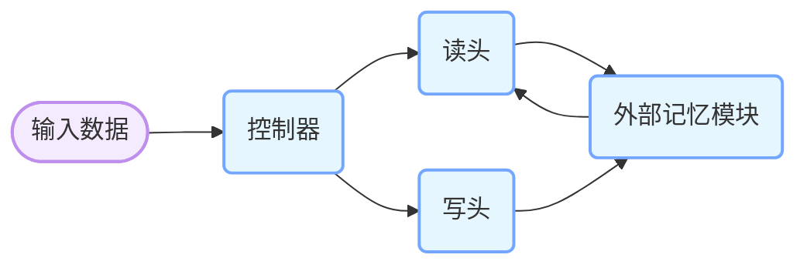

# 神经图灵机在复杂推理任务中的潜力

> 关键词：神经图灵机、复杂推理任务、深度学习、记忆增强、算法原理

> 摘要：本文深入探讨了神经图灵机（Neural Turing Machine, NTM）在复杂推理任务中的潜力。首先介绍了神经图灵机的背景知识，包括其目的、适用读者、文档结构和相关术语。接着阐述了神经图灵机的核心概念、联系以及架构原理，并通过Mermaid流程图进行直观展示。详细讲解了神经图灵机的核心算法原理，结合Python源代码进行分析。给出了神经图灵机的数学模型和公式，并举例说明其应用。通过项目实战，展示了如何搭建开发环境、实现源代码以及对代码进行解读和分析。探讨了神经图灵机在实际应用场景中的表现，推荐了相关的学习资源、开发工具框架和论文著作。最后总结了神经图灵机的未来发展趋势与挑战，并对常见问题进行了解答，提供了扩展阅读和参考资料。

## 1. 背景介绍 
### 1.1 目的和范围
传统的神经网络在处理复杂推理任务时面临着诸多挑战，例如缺乏长期记忆能力、难以进行复杂的逻辑推理等。神经图灵机的出现为解决这些问题提供了新的思路。本文的目的在于全面分析神经图灵机在复杂推理任务中的潜力，深入探讨其原理、算法、应用等方面。范围涵盖了神经图灵机的基本概念、核心算法、数学模型、项目实战以及实际应用场景等多个领域。

### 1.2 预期读者
本文预期读者包括对人工智能、深度学习领域感兴趣的研究人员、开发者，以及相关专业的学生。对于那些希望深入了解神经图灵机并将其应用于复杂推理任务的人员具有较高的参考价值。

### 1.3 文档结构概述
本文首先介绍神经图灵机的背景知识，包括目的、读者和结构等。然后详细阐述核心概念与联系，通过示意图和流程图进行直观展示。接着讲解核心算法原理和具体操作步骤，结合Python代码进行说明。给出数学模型和公式，并举例说明。通过项目实战展示神经图灵机的实际应用，包括开发环境搭建、代码实现和解读。探讨其在实际场景中的应用，推荐相关的学习资源、开发工具和论文著作。最后总结未来发展趋势与挑战，解答常见问题并提供扩展阅读和参考资料。

### 1.4 术语表
#### 1.4.1 核心术语定义
- **神经图灵机（Neural Turing Machine, NTM）**：一种结合了神经网络和图灵机概念的计算模型，它引入了外部记忆模块，使得神经网络能够进行更复杂的计算和推理。
- **复杂推理任务**：需要进行多步骤、多层次逻辑分析和决策的任务，例如自然语言推理、数学证明、规划问题等。
- **外部记忆模块**：神经图灵机中用于存储信息的模块，类似于图灵机的磁带，神经网络可以通过读写操作与该模块进行交互。
- **注意力机制**：一种用于在处理序列数据时，动态地选择关注不同部分信息的机制，在神经图灵机中用于控制对外部记忆模块的读写操作。

#### 1.4.2 相关概念解释
- **图灵机**：由英国数学家艾伦·图灵提出的一种抽象计算模型，它由一个无限长的磁带、一个读写头和一个控制单元组成，能够模拟任何可计算的算法。
- **神经网络**：一种模仿人类神经系统的计算模型，由大量的神经元组成，通过学习数据中的模式和规律来进行预测和分类。
- **深度学习**：神经网络的一个分支，通过构建多层神经网络来学习数据的高级特征，在图像识别、语音识别等领域取得了显著的成果。

#### 1.4.3 缩略词列表
- **NTM**：Neural Turing Machine（神经图灵机）
- **LSTM**：Long Short-Term Memory（长短期记忆网络）

## 2. 核心概念与联系 
神经图灵机的核心思想是将神经网络与外部记忆模块相结合，使得神经网络能够进行更复杂的计算和推理。传统的神经网络在处理长序列数据或需要长期记忆的任务时存在一定的局限性，而神经图灵机通过引入外部记忆模块，为神经网络提供了额外的存储和访问信息的能力。

### 核心概念原理
神经图灵机主要由三部分组成：控制器（Controller）、外部记忆模块（External Memory）和读写头（Read/Write Heads）。

- **控制器**：通常由一个神经网络实现，它接收输入数据，并根据输入数据生成对外部记忆模块的读写操作指令。控制器可以是一个简单的前馈神经网络，也可以是一个循环神经网络（如LSTM）。
- **外部记忆模块**：是一个二维矩阵，用于存储信息。每一行代表一个记忆单元，每一列代表一个特征维度。神经网络可以通过读写头对外部记忆模块进行读写操作。
- **读写头**：负责与外部记忆模块进行交互。读头从外部记忆模块中读取信息，并将其传递给控制器；写头根据控制器的指令，将信息写入外部记忆模块。

### 架构的文本示意图
```plaintext
+-----------------+
|    输入数据     |
+-----------------+
       |
       v
+-----------------+
|    控制器       |
+-----------------+
       |
       +------+
       |      |
       v      v
+-------+  +-------+
| 读头  |  | 写头  |
+-------+  +-------+
       |      |
       v      v
+-----------------+
| 外部记忆模块    |
+-----------------+
```

### Mermaid流程图


## 3. 核心算法原理 & 具体操作步骤 
### 核心算法原理
神经图灵机的核心算法主要包括读写操作和注意力机制。

#### 读操作
读头根据控制器生成的权重向量，从外部记忆模块中读取信息。权重向量表示读头对每个记忆单元的关注程度。读操作的计算公式如下：

$$
\mathbf{r}_t = \sum_{i=1}^N w_t(i) \mathbf{M}_t(i)
$$

其中，$\mathbf{r}_t$ 是第 $t$ 时刻读头读取的信息，$w_t(i)$ 是第 $t$ 时刻读头对第 $i$ 个记忆单元的权重，$\mathbf{M}_t(i)$ 是第 $t$ 时刻第 $i$ 个记忆单元的内容，$N$ 是记忆单元的数量。

#### 写操作
写头根据控制器生成的权重向量和擦除向量、添加向量，对外部记忆模块进行更新。擦除向量用于擦除记忆单元中的部分信息，添加向量用于向记忆单元中添加新的信息。写操作的计算公式如下：

$$
\mathbf{M}_{t+1}(i) = \mathbf{M}_t(i) \odot ( \mathbf{1} - w_t(i) \mathbf{e}_t ) + w_t(i) \mathbf{a}_t
$$

其中，$\mathbf{M}_{t+1}(i)$ 是第 $t+1$ 时刻第 $i$ 个记忆单元的内容，$\mathbf{e}_t$ 是第 $t$ 时刻的擦除向量，$\mathbf{a}_t$ 是第 $t$ 时刻的添加向量，$\odot$ 表示逐元素相乘，$\mathbf{1}$ 是全为 1 的向量。

#### 注意力机制
注意力机制用于生成权重向量，使得神经图灵机能够动态地选择关注不同的记忆单元。常见的注意力机制包括基于内容的注意力和基于位置的注意力。

### 具体操作步骤
以下是神经图灵机的具体操作步骤：

1. **初始化**：初始化外部记忆模块 $\mathbf{M}_0$、读头权重向量 $w_{r0}$、写头权重向量 $w_{w0}$ 等。
2. **输入数据**：将输入数据传递给控制器。
3. **控制器计算**：控制器根据输入数据生成读写操作指令，包括读头权重向量 $w_{rt}$、写头权重向量 $w_{wt}$、擦除向量 $\mathbf{e}_t$ 和添加向量 $\mathbf{a}_t$。
4. **读操作**：读头根据读头权重向量 $w_{rt}$ 从外部记忆模块中读取信息 $\mathbf{r}_t$。
5. **写操作**：写头根据写头权重向量 $w_{wt}$、擦除向量 $\mathbf{e}_t$ 和添加向量 $\mathbf{a}_t$ 对外部记忆模块进行更新。
6. **输出结果**：控制器根据读取的信息 $\mathbf{r}_t$ 生成输出结果。
7. **重复步骤 2 - 6**：直到达到预设的时间步或满足终止条件。

### Python源代码详细阐述
```python
import torch
import torch.nn as nn
import torch.nn.functional as F

class NeuralTuringMachine(nn.Module):
    def __init__(self, input_size, output_size, controller_size, memory_size, memory_length):
        super(NeuralTuringMachine, self).__init__()
        self.input_size = input_size
        self.output_size = output_size
        self.controller_size = controller_size
        self.memory_size = memory_size
        self.memory_length = memory_length

        # 控制器
        self.controller = nn.LSTM(input_size + memory_size, controller_size)

        # 读头
        self.read_head = nn.Linear(controller_size, memory_length)

        # 写头
        self.write_head = nn.Linear(controller_size, memory_length + 2 * memory_size)

        # 输出层
        self.output_layer = nn.Linear(controller_size + memory_size, output_size)

    def forward(self, input_seq):
        batch_size = input_seq.size(0)
        seq_length = input_seq.size(1)

        # 初始化记忆模块
        memory = torch.zeros(batch_size, self.memory_length, self.memory_size)

        # 初始化隐藏状态和细胞状态
        h_t = torch.zeros(1, batch_size, self.controller_size)
        c_t = torch.zeros(1, batch_size, self.controller_size)

        outputs = []

        for t in range(seq_length):
            # 获取当前时刻的输入
            input_t = input_seq[:, t, :]

            # 读操作
            read_weights = F.softmax(self.read_head(h_t.squeeze(0)), dim=1)
            read_vector = torch.bmm(read_weights.unsqueeze(1), memory).squeeze(1)

            # 控制器输入
            controller_input = torch.cat((input_t, read_vector), dim=1)

            # 控制器计算
            _, (h_t, c_t) = self.controller(controller_input.unsqueeze(0), (h_t, c_t))

            # 写操作
            write_params = self.write_head(h_t.squeeze(0))
            write_weights = F.softmax(write_params[:, :self.memory_length], dim=1)
            erase_vector = torch.sigmoid(write_params[:, self.memory_length:self.memory_length + self.memory_size])
            add_vector = torch.tanh(write_params[:, self.memory_length + self.memory_size:])

            memory = memory * (1 - write_weights.unsqueeze(2) * erase_vector.unsqueeze(1)) + \
                     write_weights.unsqueeze(2) * add_vector.unsqueeze(1)

            # 输出计算
            output = self.output_layer(torch.cat((h_t.squeeze(0), read_vector), dim=1))
            outputs.append(output)

        outputs = torch.stack(outputs, dim=1)
        return outputs
```

## 4. 数学模型和公式 & 详细讲解 & 举例说明 
### 数学模型和公式
#### 控制器
控制器通常由一个循环神经网络（如LSTM）实现，其输入为当前时刻的输入数据 $\mathbf{x}_t$ 和读头读取的信息 $\mathbf{r}_t$，输出为隐藏状态 $\mathbf{h}_t$。LSTM的计算公式如下：

$$
\begin{aligned}
\mathbf{i}_t &= \sigma(\mathbf{W}_{ii} \mathbf{x}_t + \mathbf{W}_{hi} \mathbf{h}_{t-1} + \mathbf{b}_i) \\
\mathbf{f}_t &= \sigma(\mathbf{W}_{if} \mathbf{x}_t + \mathbf{W}_{hf} \mathbf{h}_{t-1} + \mathbf{b}_f) \\
\mathbf{g}_t &= \tanh(\mathbf{W}_{ig} \mathbf{x}_t + \mathbf{W}_{hg} \mathbf{h}_{t-1} + \mathbf{b}_g) \\
\mathbf{o}_t &= \sigma(\mathbf{W}_{io} \mathbf{x}_t + \mathbf{W}_{ho} \mathbf{h}_{t-1} + \mathbf{b}_o) \\
\mathbf{c}_t &= \mathbf{f}_t \odot \mathbf{c}_{t-1} + \mathbf{i}_t \odot \mathbf{g}_t \\
\mathbf{h}_t &= \mathbf{o}_t \odot \tanh(\mathbf{c}_t)
\end{aligned}
$$

其中，$\mathbf{i}_t$、$\mathbf{f}_t$、$\mathbf{o}_t$ 分别是输入门、遗忘门和输出门，$\mathbf{g}_t$ 是候选细胞状态，$\mathbf{c}_t$ 是细胞状态，$\sigma$ 是 sigmoid 函数，$\tanh$ 是双曲正切函数，$\mathbf{W}$ 是权重矩阵，$\mathbf{b}$ 是偏置向量。

#### 读操作
读操作的公式前面已经介绍过，这里再次列出：

$$
\mathbf{r}_t = \sum_{i=1}^N w_t(i) \mathbf{M}_t(i)
$$

#### 写操作
写操作的公式也前面已经介绍过，这里再次列出：

$$
\mathbf{M}_{t+1}(i) = \mathbf{M}_t(i) \odot ( \mathbf{1} - w_t(i) \mathbf{e}_t ) + w_t(i) \mathbf{a}_t
$$

### 详细讲解
- **控制器**：控制器的作用是根据输入数据和读取的信息生成读写操作指令。LSTM 能够处理长序列数据，并且具有长期记忆能力，因此适合作为神经图灵机的控制器。
- **读操作**：读头通过权重向量对外部记忆模块中的信息进行加权求和，从而读取信息。权重向量表示读头对每个记忆单元的关注程度。
- **写操作**：写头通过擦除向量和添加向量对外部记忆模块进行更新。擦除向量用于擦除记忆单元中的部分信息，添加向量用于向记忆单元中添加新的信息。

### 举例说明
假设我们有一个神经图灵机，其外部记忆模块的大小为 $N = 3$，每个记忆单元的维度为 $M = 2$，即 $\mathbf{M}_t$ 是一个 $3 \times 2$ 的矩阵。读头的权重向量为 $w_t = [0.2, 0.5, 0.3]$，记忆模块的内容为：

$$
\mathbf{M}_t = \begin{bmatrix}
1 & 2 \\
3 & 4 \\
5 & 6
\end{bmatrix}
$$

则读头读取的信息为：

$$
\begin{aligned}
\mathbf{r}_t &= 0.2 \times \begin{bmatrix} 1 \\ 2 \end{bmatrix} + 0.5 \times \begin{bmatrix} 3 \\ 4 \end{bmatrix} + 0.3 \times \begin{bmatrix} 5 \\ 6 \end{bmatrix} \\
&= \begin{bmatrix} 0.2 \times 1 + 0.5 \times 3 + 0.3 \times 5 \\ 0.2 \times 2 + 0.5 \times 4 + 0.3 \times 6 \end{bmatrix} \\
&= \begin{bmatrix} 3.2 \\ 4.2 \end{bmatrix}
\end{aligned}
$$

假设写头的权重向量为 $w_t = [0.1, 0.8, 0.1]$，擦除向量为 $\mathbf{e}_t = [0.2, 0.3]$，添加向量为 $\mathbf{a}_t = [0.5, 0.6]$，则更新后的记忆模块为：

$$
\begin{aligned}
\mathbf{M}_{t+1}(1) &= \begin{bmatrix} 1 \\ 2 \end{bmatrix} \odot ( \begin{bmatrix} 1 \\ 1 \end{bmatrix} - 0.1 \times \begin{bmatrix} 0.2 \\ 0.3 \end{bmatrix} ) + 0.1 \times \begin{bmatrix} 0.5 \\ 0.6 \end{bmatrix} \\
&= \begin{bmatrix} 1 \\ 2 \end{bmatrix} \odot \begin{bmatrix} 0.98 \\ 0.97 \end{bmatrix} + \begin{bmatrix} 0.05 \\ 0.06 \end{bmatrix} \\
&= \begin{bmatrix} 0.98 + 0.05 \\ 1.94 + 0.06 \end{bmatrix} \\
&= \begin{bmatrix} 1.03 \\ 2 \end{bmatrix} \\
\mathbf{M}_{t+1}(2) &= \begin{bmatrix} 3 \\ 4 \end{bmatrix} \odot ( \begin{bmatrix} 1 \\ 1 \end{bmatrix} - 0.8 \times \begin{bmatrix} 0.2 \\ 0.3 \end{bmatrix} ) + 0.8 \times \begin{bmatrix} 0.5 \\ 0.6 \end{bmatrix} \\
&= \begin{bmatrix} 3 \\ 4 \end{bmatrix} \odot \begin{bmatrix} 0.84 \\ 0.76 \end{bmatrix} + \begin{bmatrix} 0.4 \\ 0.48 \end{bmatrix} \\
&= \begin{bmatrix} 2.52 + 0.4 \\ 3.04 + 0.48 \end{bmatrix} \\
&= \begin{bmatrix} 2.92 \\ 3.52 \end{bmatrix} \\
\mathbf{M}_{t+1}(3) &= \begin{bmatrix} 5 \\ 6 \end{bmatrix} \odot ( \begin{bmatrix} 1 \\ 1 \end{bmatrix} - 0.1 \times \begin{bmatrix} 0.2 \\ 0.3 \end{bmatrix} ) + 0.1 \times \begin{bmatrix} 0.5 \\ 0.6 \end{bmatrix} \\
&= \begin{bmatrix} 5 \\ 6 \end{bmatrix} \odot \begin{bmatrix} 0.98 \\ 0.97 \end{bmatrix} + \begin{bmatrix} 0.05 \\ 0.06 \end{bmatrix} \\
&= \begin{bmatrix} 4.9 + 0.05 \\ 5.82 + 0.06 \end{bmatrix} \\
&= \begin{bmatrix} 4.95 \\ 5.88 \end{bmatrix}
\end{aligned}
$$

## 5. 项目实战：代码实际案例和详细解释说明 
### 5.1  开发环境搭建
#### 安装Python
首先需要安装Python，建议使用Python 3.7及以上版本。可以从Python官方网站（https://www.python.org/downloads/）下载并安装。

#### 安装PyTorch
神经图灵机的实现使用了PyTorch深度学习框架。可以根据自己的操作系统和CUDA版本，从PyTorch官方网站（https://pytorch.org/get-started/locally/）选择合适的安装方式。例如，在Linux系统上，如果使用CPU版本的PyTorch，可以使用以下命令安装：

```sh
pip install torch torchvision
```

#### 安装其他依赖库
还需要安装一些其他的依赖库，如NumPy、Matplotlib等。可以使用以下命令安装：

```sh
pip install numpy matplotlib
```

### 5.2  源代码详细实现和代码解读
以下是一个完整的神经图灵机项目实战代码示例，用于解决一个简单的序列复制任务：

```python
import torch
import torch.nn as nn
import torch.optim as optim
import numpy as np
import matplotlib.pyplot as plt

# 定义神经图灵机模型
class NeuralTuringMachine(nn.Module):
    def __init__(self, input_size, output_size, controller_size, memory_size, memory_length):
        super(NeuralTuringMachine, self).__init__()
        self.input_size = input_size
        self.output_size = output_size
        self.controller_size = controller_size
        self.memory_size = memory_size
        self.memory_length = memory_length

        # 控制器
        self.controller = nn.LSTM(input_size + memory_size, controller_size)

        # 读头
        self.read_head = nn.Linear(controller_size, memory_length)

        # 写头
        self.write_head = nn.Linear(controller_size, memory_length + 2 * memory_size)

        # 输出层
        self.output_layer = nn.Linear(controller_size + memory_size, output_size)

    def forward(self, input_seq):
        batch_size = input_seq.size(0)
        seq_length = input_seq.size(1)

        # 初始化记忆模块
        memory = torch.zeros(batch_size, self.memory_length, self.memory_size)

        # 初始化隐藏状态和细胞状态
        h_t = torch.zeros(1, batch_size, self.controller_size)
        c_t = torch.zeros(1, batch_size, self.controller_size)

        outputs = []

        for t in range(seq_length):
            # 获取当前时刻的输入
            input_t = input_seq[:, t, :]

            # 读操作
            read_weights = F.softmax(self.read_head(h_t.squeeze(0)), dim=1)
            read_vector = torch.bmm(read_weights.unsqueeze(1), memory).squeeze(1)

            # 控制器输入
            controller_input = torch.cat((input_t, read_vector), dim=1)

            # 控制器计算
            _, (h_t, c_t) = self.controller(controller_input.unsqueeze(0), (h_t, c_t))

            # 写操作
            write_params = self.write_head(h_t.squeeze(0))
            write_weights = F.softmax(write_params[:, :self.memory_length], dim=1)
            erase_vector = torch.sigmoid(write_params[:, self.memory_length:self.memory_length + self.memory_size])
            add_vector = torch.tanh(write_params[:, self.memory_length + self.memory_size:])

            memory = memory * (1 - write_weights.unsqueeze(2) * erase_vector.unsqueeze(1)) + \
                     write_weights.unsqueeze(2) * add_vector.unsqueeze(1)

            # 输出计算
            output = self.output_layer(torch.cat((h_t.squeeze(0), read_vector), dim=1))
            outputs.append(output)

        outputs = torch.stack(outputs, dim=1)
        return outputs

# 生成训练数据
def generate_data(batch_size, seq_length, input_size):
    input_seq = torch.randint(0, 2, (batch_size, seq_length, input_size)).float()
    target_seq = input_seq.clone()
    return input_seq, target_seq

# 训练模型
def train_model(model, optimizer, criterion, num_epochs, batch_size, seq_length, input_size):
    losses = []
    for epoch in range(num_epochs):
        input_seq, target_seq = generate_data(batch_size, seq_length, input_size)
        optimizer.zero_grad()
        output_seq = model(input_seq)
        loss = criterion(output_seq, target_seq)
        loss.backward()
        optimizer.step()
        losses.append(loss.item())
        if (epoch + 1) % 100 == 0:
            print(f'Epoch {epoch + 1}/{num_epochs}, Loss: {loss.item()}')
    return losses

# 定义模型参数
input_size = 5
output_size = 5
controller_size = 100
memory_size = 20
memory_length = 128
batch_size = 32
seq_length = 20
num_epochs = 1000

# 创建模型
model = NeuralTuringMachine(input_size, output_size, controller_size, memory_size, memory_length)

# 定义优化器和损失函数
optimizer = optim.Adam(model.parameters(), lr=0.001)
criterion = nn.MSELoss()

# 训练模型
losses = train_model(model, optimizer, criterion, num_epochs, batch_size, seq_length, input_size)

# 绘制损失曲线
plt.plot(losses)
plt.xlabel('Epoch')
plt.ylabel('Loss')
plt.title('Training Loss')
plt.show()
```

### 代码解读与分析
#### 模型定义
`NeuralTuringMachine` 类定义了神经图灵机的模型结构，包括控制器、读头、写头和输出层。控制器使用LSTM网络，读头和写头通过线性层生成读写操作参数，输出层将控制器的输出和读头读取的信息进行拼接后输出。

#### 数据生成
`generate_data` 函数用于生成训练数据，输入序列和目标序列相同，用于实现序列复制任务。

#### 训练过程
`train_model` 函数用于训练模型，在每个epoch中，生成一批训练数据，将其输入到模型中进行前向传播，计算损失，然后进行反向传播和参数更新。

#### 损失曲线绘制
使用Matplotlib库绘制训练过程中的损失曲线，直观地观察模型的训练效果。

## 6. 实际应用场景 
神经图灵机在复杂推理任务中有广泛的应用场景，以下是一些常见的应用场景：

### 自然语言处理
- **机器翻译**：神经图灵机可以用于处理长句子和复杂的语义信息，通过外部记忆模块存储上下文信息，提高机器翻译的准确性。
- **问答系统**：在问答系统中，神经图灵机可以用于理解问题的语义，从知识库中检索相关信息，并生成准确的答案。

### 数学推理
- **数学证明**：神经图灵机可以用于辅助数学证明，通过外部记忆模块存储中间结果和推理规则，进行复杂的逻辑推理。
- **数学问题求解**：在解决数学问题时，神经图灵机可以根据问题的条件和要求，逐步推导求解过程。

### 规划问题
- **路径规划**：在机器人路径规划中，神经图灵机可以根据环境信息和目标位置，规划最优的路径。
- **任务调度**：在任务调度问题中，神经图灵机可以根据任务的优先级和资源限制，合理分配任务。

### 游戏智能
- **棋类游戏**：在棋类游戏中，神经图灵机可以通过外部记忆模块存储历史棋局和策略，进行复杂的局面分析和决策。
- **电子游戏**：在电子游戏中，神经图灵机可以用于实现智能NPC，使其能够根据游戏环境和玩家行为做出合理的反应。

## 7. 工具和资源推荐
### 7.1 学习资源推荐
#### 7.1.1 书籍推荐
- 《深度学习》（Deep Learning）：由Ian Goodfellow、Yoshua Bengio和Aaron Courville所著，是深度学习领域的经典教材，涵盖了神经网络、卷积神经网络、循环神经网络等内容。
- 《神经网络与深度学习》：由邱锡鹏所著，系统地介绍了神经网络和深度学习的基本原理、算法和应用。
- 《人工智能：一种现代的方法》（Artificial Intelligence: A Modern Approach）：由Stuart Russell和Peter Norvig所著，是人工智能领域的权威教材，涵盖了搜索算法、知识表示、机器学习等内容。

#### 7.1.2 在线课程
- Coursera上的“深度学习专项课程”（Deep Learning Specialization）：由Andrew Ng教授授课，包括神经网络基础、卷积神经网络、循环神经网络等课程。
- edX上的“人工智能导论”（Introduction to Artificial Intelligence）：由麻省理工学院（MIT）的Patrick Winston教授授课，介绍了人工智能的基本概念、算法和应用。
- 哔哩哔哩（Bilibili）上有许多关于深度学习和神经图灵机的教学视频，可以作为学习的参考。

#### 7.1.3 技术博客和网站
- Medium：有许多深度学习领域的技术博客，如Towards Data Science、The AI Blog等，提供了最新的研究成果和实践经验。
- arXiv：是一个预印本数据库，包含了大量的学术论文，包括神经图灵机的相关研究。
- GitHub：可以找到许多开源的神经图灵机实现和相关项目，通过学习这些项目可以加深对神经图灵机的理解。

### 7.2 开发工具框架推荐
#### 7.2.1 IDE和编辑器
- PyCharm：是一款专门为Python开发设计的集成开发环境（IDE），提供了代码编辑、调试、版本控制等功能。
- Jupyter Notebook：是一个交互式的开发环境，适合进行数据探索、模型训练和结果可视化。
- Visual Studio Code：是一款轻量级的代码编辑器，支持多种编程语言，有丰富的插件可以扩展功能。

#### 7.2.2 调试和性能分析工具
- PyTorch Profiler：是PyTorch自带的性能分析工具，可以帮助开发者分析模型的性能瓶颈，优化代码。
- TensorBoard：是TensorFlow提供的可视化工具，也可以用于PyTorch项目，用于可视化训练过程中的损失曲线、准确率等指标。
- Py-Spy：是一个轻量级的Python性能分析工具，可以实时监测Python程序的CPU和内存使用情况。

#### 7.2.3 相关框架和库
- PyTorch：是一个开源的深度学习框架，提供了丰富的神经网络层和优化算法，支持GPU加速。
- NumPy：是Python中用于科学计算的基础库，提供了高效的数组操作和数学函数。
- Matplotlib：是Python中用于数据可视化的库，可以绘制各种类型的图表，如折线图、柱状图、散点图等。

### 7.3 相关论文著作推荐
#### 7.3.1 经典论文
- 《Neural Turing Machines》：由Alex Graves、Greg Wayne和Ivo Danihelka发表，首次提出了神经图灵机的概念，详细介绍了其模型结构和算法原理。
- 《Show, Attend and Tell: Neural Image Caption Generation with Visual Attention》：提出了注意力机制在图像描述生成任务中的应用，为神经图灵机中的注意力机制提供了借鉴。

#### 7.3.2 最新研究成果
- 可以通过arXiv、ACM Digital Library、IEEE Xplore等学术数据库搜索最新的神经图灵机研究成果。

#### 7.3.3 应用案例分析
- 一些学术会议（如NeurIPS、ICML、ACL等）的论文集中包含了许多神经图灵机在实际应用中的案例分析，可以从中学习到如何将神经图灵机应用于具体的任务中。

## 8. 总结：未来发展趋势与挑战
### 未来发展趋势
- **更强的推理能力**：未来的神经图灵机可能会在推理能力上进一步提升，能够处理更加复杂的逻辑推理任务，如复杂的数学证明、法律推理等。
- **与其他技术的融合**：神经图灵机可能会与强化学习、知识图谱等技术相结合，形成更加智能的系统，应用于更多的领域。
- **硬件优化**：随着硬件技术的发展，神经图灵机的计算效率可能会得到进一步提高，从而能够处理更大规模的数据集和更复杂的任务。

### 挑战
- **训练难度**：神经图灵机的训练过程相对复杂，需要大量的计算资源和时间，如何提高训练效率是一个亟待解决的问题。
- **可解释性**：神经图灵机作为一种深度学习模型，其决策过程往往难以解释，如何提高模型的可解释性是当前研究的热点之一。
- **数据质量**：神经图灵机的性能很大程度上依赖于训练数据的质量，如何获取高质量的训练数据是一个挑战。

## 9. 附录：常见问题与解答
### 问题1：神经图灵机和传统神经网络有什么区别？
神经图灵机引入了外部记忆模块，使得神经网络能够进行更复杂的计算和推理。传统的神经网络在处理长序列数据或需要长期记忆的任务时存在一定的局限性，而神经图灵机通过外部记忆模块可以存储和访问信息，从而解决这些问题。

### 问题2：神经图灵机的训练过程复杂吗？
神经图灵机的训练过程相对复杂，因为它涉及到多个组件的交互和更新，如控制器、读写头和外部记忆模块。训练过程需要大量的计算资源和时间，并且需要合理设置超参数。

### 问题3：神经图灵机可以应用于哪些领域？
神经图灵机可以应用于自然语言处理、数学推理、规划问题、游戏智能等多个领域，特别是在需要进行复杂推理和长期记忆的任务中具有很大的潜力。

### 问题4：如何提高神经图灵机的性能？
可以通过以下方法提高神经图灵机的性能：
- 优化模型结构，如选择更合适的控制器和注意力机制。
- 调整超参数，如学习率、批次大小等。
- 使用更多的训练数据和更复杂的训练策略。
- 进行模型融合，将神经图灵机与其他模型相结合。

## 10. 扩展阅读 & 参考资料
### 扩展阅读
- 《Attention Is All You Need》：提出了Transformer模型，引入了自注意力机制，对神经图灵机的发展有一定的启发。
- 《Memory Networks》：介绍了记忆网络的概念，与神经图灵机有相似之处，可以进一步了解相关的研究思路。

### 参考资料
- Graves, A., Wayne, G., & Danihelka, I. (2014). Neural Turing Machines. arXiv preprint arXiv:1410.5401.
- Vaswani, A., Shazeer, N., Parmar, N., Uszkoreit, J., Jones, L., Gomez, A. N.,... & Polosukhin, I. (2017). Attention is all you need. In Advances in neural information processing systems (pp. 5998-6008).
- Weston, J., Chopra, S., & Bordes, A. (2014). Memory networks. arXiv preprint arXiv:1410.3916.

作者：AI天才研究院/AI Genius Institute & 禅与计算机程序设计艺术 /Zen And The Art of Computer Programming