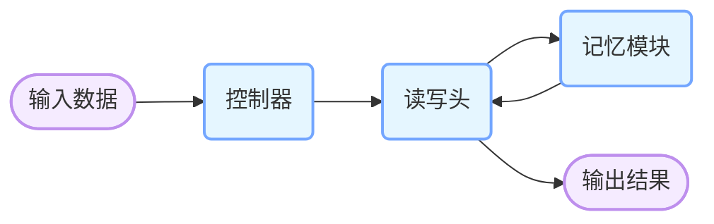

# 神经图灵机在程序化逻辑推理中的新突破

> 关键词：神经图灵机、程序化逻辑推理、深度学习、记忆机制、算法原理

> 摘要：本文聚焦于神经图灵机在程序化逻辑推理领域的新突破。首先介绍了研究的背景、目的和范围，明确预期读者和文档结构。接着阐述神经图灵机的核心概念、原理及架构，通过Python代码详细讲解其核心算法原理和具体操作步骤。同时给出相关的数学模型和公式，并举例说明。在项目实战部分，搭建开发环境，实现源代码并进行解读分析。探讨了神经图灵机在实际中的应用场景，推荐了学习资源、开发工具框架和相关论文著作。最后总结了未来发展趋势与挑战，解答常见问题并提供扩展阅读和参考资料，全面深入地剖析了神经图灵机在程序化逻辑推理中的新进展。

## 1. 背景介绍 
### 1.1 目的和范围
近年来，人工智能领域取得了显著的进展，特别是在深度学习方面。然而，传统的神经网络在处理需要长期记忆和复杂逻辑推理的任务时面临着挑战。神经图灵机（Neural Turing Machine, NTM）作为一种结合了神经网络和图灵机概念的模型，为解决这些问题提供了新的思路。本文的目的是深入探讨神经图灵机在程序化逻辑推理中的新突破，分析其原理、算法和应用。范围涵盖了神经图灵机的基本概念、核心算法、数学模型、实际应用案例以及未来发展趋势等方面。

### 1.2 预期读者
本文的预期读者包括人工智能、机器学习和深度学习领域的研究人员、工程师和学生。对于那些对神经图灵机和程序化逻辑推理感兴趣，希望了解最新技术进展和应用的专业人士，本文将提供有价值的信息和深入的分析。同时，对于想要深入学习人工智能算法和模型的初学者，本文也可以作为一个系统的学习资料。

### 1.3 文档结构概述
本文的结构如下：首先介绍神经图灵机的核心概念和联系，包括其原理和架构；然后详细讲解核心算法原理和具体操作步骤，并使用Python代码进行阐述；接着给出相关的数学模型和公式，并举例说明；在项目实战部分，搭建开发环境，实现源代码并进行解读分析；探讨神经图灵机在实际中的应用场景；推荐学习资源、开发工具框架和相关论文著作；最后总结未来发展趋势与挑战，解答常见问题并提供扩展阅读和参考资料。

### 1.4 术语表
#### 1.4.1 核心术语定义
- **神经图灵机（Neural Turing Machine, NTM）**：一种结合了神经网络和图灵机概念的模型，具有可微分的记忆机制，能够处理需要长期记忆和复杂逻辑推理的任务。
- **程序化逻辑推理**：指通过一系列的规则和步骤，对给定的信息进行逻辑处理和推理，以得出结论的过程。
- **记忆机制**：神经图灵机中的一个重要组成部分，用于存储和检索信息，使得模型能够处理长期依赖问题。
- **注意力机制**：在神经图灵机中，用于控制对记忆单元的访问和操作，使得模型能够根据当前任务的需要选择相关的信息。

#### 1.4.2 相关概念解释
- **图灵机**：一种抽象的计算模型，由艾伦·图灵在1936年提出。图灵机由一个无限长的纸带、一个读写头和一个控制单元组成，能够模拟任何可计算的算法。
- **神经网络**：一种模仿人类神经系统的计算模型，由大量的神经元组成，通过学习数据中的模式和规律来进行预测和分类。
- **深度学习**：一种基于神经网络的机器学习方法，通过构建多层神经网络来学习数据的深层次特征，在图像识别、语音识别等领域取得了显著的成果。

#### 1.4.3 缩略词列表
- **NTM**：Neural Turing Machine（神经图灵机）
- **LSTM**：Long Short-Term Memory（长短期记忆网络）
- **RNN**：Recurrent Neural Network（循环神经网络）

## 2. 核心概念与联系 

### 2.1 神经图灵机的原理
神经图灵机的核心思想是将神经网络的学习能力和图灵机的计算能力相结合。传统的神经网络在处理序列数据时，往往难以处理长期依赖问题，因为它们的记忆能力有限。而神经图灵机引入了一个可微分的记忆模块，使得模型能够存储和检索信息，从而处理长期依赖问题。

神经图灵机由三个主要部分组成：控制器、记忆模块和读写头。控制器是一个神经网络，负责处理输入数据并生成读写头的控制信号。记忆模块是一个二维矩阵，用于存储信息。读写头负责对记忆模块进行读写操作，根据控制器生成的控制信号选择要访问的记忆单元。

### 2.2 神经图灵机的架构
下面是神经图灵机的架构示意图：



### 2.3 核心概念之间的联系
神经图灵机的各个核心概念之间存在着紧密的联系。控制器通过学习输入数据的特征，生成读写头的控制信号，从而控制对记忆模块的访问和操作。记忆模块存储了模型的历史信息，为程序化逻辑推理提供了必要的知识。读写头根据控制器的指令，从记忆模块中读取信息或向记忆模块中写入信息，实现信息的存储和检索。注意力机制在读写头的操作中起到了重要的作用，它能够根据当前任务的需要，选择相关的记忆单元进行访问，提高模型的效率和准确性。

## 3. 核心算法原理 & 具体操作步骤 

### 3.1 核心算法原理
神经图灵机的核心算法主要包括控制器的训练和读写头的操作。控制器通常使用循环神经网络（RNN）或长短期记忆网络（LSTM）来实现，其目的是学习输入数据的特征，并生成读写头的控制信号。读写头的操作包括读取和写入两个过程，具体如下：

#### 读取操作
读取操作的目的是从记忆模块中获取相关的信息。读写头根据控制器生成的控制信号，计算每个记忆单元的权重，然后根据权重对记忆单元进行加权求和，得到读取的信息。

#### 写入操作
写入操作的目的是将新的信息写入到记忆模块中。读写头根据控制器生成的控制信号，计算每个记忆单元的写入权重，然后根据写入权重更新记忆模块中的信息。

### 3.2 具体操作步骤
下面是神经图灵机的具体操作步骤：

1. **初始化**：初始化控制器、记忆模块和读写头的参数。
2. **输入数据**：将输入数据传递给控制器。
3. **控制器处理**：控制器对输入数据进行处理，生成读写头的控制信号。
4. **读取操作**：读写头根据控制信号，从记忆模块中读取信息。
5. **写入操作**：读写头根据控制信号，将新的信息写入到记忆模块中。
6. **输出结果**：将读取的信息和控制器的输出进行合并，得到最终的输出结果。
7. **训练**：根据输出结果和真实标签，计算损失函数，并使用反向传播算法更新控制器和读写头的参数。

### 3.3 Python代码实现
下面是一个简单的神经图灵机的Python代码实现：

```python
import torch
import torch.nn as nn
import torch.nn.functional as F

# 定义控制器
class Controller(nn.Module):
    def __init__(self, input_size, hidden_size, output_size):
        super(Controller, self).__init__()
        self.rnn = nn.LSTM(input_size, hidden_size, batch_first=True)
        self.fc = nn.Linear(hidden_size, output_size)

    def forward(self, x):
        out, _ = self.rnn(x)
        out = self.fc(out[:, -1, :])
        return out

# 定义读写头
class ReadWriteHead(nn.Module):
    def __init__(self, memory_size, memory_dim, control_size):
        super(ReadWriteHead, self).__init__()
        self.memory_size = memory_size
        self.memory_dim = memory_dim
        self.control_size = control_size
        self.fc = nn.Linear(control_size, 2 * memory_size)

    def forward(self, control, memory):
        # 计算读取和写入权重
        weights = self.fc(control)
        read_weights = F.softmax(weights[:, :self.memory_size], dim=1)
        write_weights = F.softmax(weights[:, self.memory_size:], dim=1)

        # 读取操作
        read = torch.bmm(read_weights.unsqueeze(1), memory).squeeze(1)

        # 写入操作
        new_memory = memory.clone()
        write = torch.bmm(write_weights.unsqueeze(2), read.unsqueeze(1))
        new_memory = new_memory + write

        return read, new_memory

# 定义神经图灵机
class NeuralTuringMachine(nn.Module):
    def __init__(self, input_size, hidden_size, output_size, memory_size, memory_dim):
        super(NeuralTuringMachine, self).__init__()
        self.controller = Controller(input_size, hidden_size, output_size)
        self.read_write_head = ReadWriteHead(memory_size, memory_dim, output_size)
        self.memory = nn.Parameter(torch.randn(1, memory_size, memory_dim))

    def forward(self, x):
        control = self.controller(x)
        read, new_memory = self.read_write_head(control, self.memory)
        self.memory = new_memory
        return read

# 测试代码
input_size = 10
hidden_size = 20
output_size = 30
memory_size = 5
memory_dim = 15
ntm = NeuralTuringMachine(input_size, hidden_size, output_size, memory_size, memory_dim)
x = torch.randn(1, 1, input_size)
output = ntm(x)
print(output.shape)
```

## 4. 数学模型和公式 & 详细讲解 & 举例说明 

### 4.1 数学模型和公式
#### 控制器
控制器的输出可以表示为：
$$
h_t = \text{LSTM}(x_t, h_{t-1})
$$
其中，$x_t$ 是输入数据，$h_{t-1}$ 是上一时刻的隐藏状态，$h_t$ 是当前时刻的隐藏状态。

#### 读取操作
读取操作的权重可以表示为：
$$
w_{r,t}^i = \frac{\exp(u_{r,t}^i)}{\sum_{j=1}^N \exp(u_{r,t}^j)}
$$
其中，$u_{r,t}^i$ 是第 $i$ 个记忆单元的读取得分，$N$ 是记忆单元的数量。

读取的信息可以表示为：
$$
r_t = \sum_{i=1}^N w_{r,t}^i M_t^i
$$
其中，$M_t^i$ 是第 $i$ 个记忆单元的内容。

#### 写入操作
写入操作的权重可以表示为：
$$
w_{w,t}^i = \frac{\exp(u_{w,t}^i)}{\sum_{j=1}^N \exp(u_{w,t}^j)}
$$
其中，$u_{w,t}^i$ 是第 $i$ 个记忆单元的写入得分。

新的记忆内容可以表示为：
$$
M_{t+1}^i = M_t^i + w_{w,t}^i e_t
$$
其中，$e_t$ 是写入的信息。

### 4.2 详细讲解
控制器使用LSTM网络对输入数据进行处理，生成隐藏状态 $h_t$。隐藏状态 $h_t$ 作为读写头的控制信号，用于计算读取和写入权重。读取权重 $w_{r,t}^i$ 表示第 $i$ 个记忆单元在读取操作中的重要性，通过对所有记忆单元的读取得分进行softmax操作得到。读取的信息 $r_t$ 是所有记忆单元的内容按照读取权重进行加权求和的结果。写入权重 $w_{w,t}^i$ 表示第 $i$ 个记忆单元在写入操作中的重要性，同样通过softmax操作得到。新的记忆内容 $M_{t+1}^i$ 是在原记忆内容 $M_t^i$ 的基础上，加上写入的信息 $e_t$ 乘以写入权重 $w_{w,t}^i$ 的结果。

### 4.3 举例说明
假设记忆模块有3个记忆单元，每个记忆单元的维度为2，即 $M = \begin{bmatrix} 1 & 2 \\ 3 & 4 \\ 5 & 6 \end{bmatrix}$。控制器生成的读取得分 $u_r = [1, 2, 3]$，写入得分 $u_w = [3, 2, 1]$。

首先计算读取权重：
$$
w_r = \text{softmax}([1, 2, 3]) = \begin{bmatrix} 0.0900 \\ 0.2447 \\ 0.6652 \end{bmatrix}
$$

然后计算读取的信息：
$$
r = w_r^T M = \begin{bmatrix} 0.0900 & 0.2447 & 0.6652 \end{bmatrix} \begin{bmatrix} 1 & 2 \\ 3 & 4 \\ 5 & 6 \end{bmatrix} = \begin{bmatrix} 4.0500 & 5.0500 \end{bmatrix}
$$

接着计算写入权重：
$$
w_w = \text{softmax}([3, 2, 1]) = \begin{bmatrix} 0.6652 \\ 0.2447 \\ 0.0900 \end{bmatrix}
$$

假设写入的信息 $e = \begin{bmatrix} 1 & 1 \end{bmatrix}$，则新的记忆内容为：
$$
M' = M + w_w e = \begin{bmatrix} 1 & 2 \\ 3 & 4 \\ 5 & 6 \end{bmatrix} + \begin{bmatrix} 0.6652 \\ 0.2447 \\ 0.0900 \end{bmatrix} \begin{bmatrix} 1 & 1 \end{bmatrix} = \begin{bmatrix} 1.6652 & 2.6652 \\ 3.2447 & 4.2447 \\ 5.0900 & 6.0900 \end{bmatrix}
$$

## 5. 项目实战：代码实际案例和详细解释说明 

### 5.1  开发环境搭建
为了实现神经图灵机的项目实战，我们需要搭建以下开发环境：

- **操作系统**：推荐使用Linux或macOS，因为它们对深度学习框架的支持更好。
- **Python版本**：建议使用Python 3.7及以上版本。
- **深度学习框架**：使用PyTorch作为深度学习框架，因为它具有动态图的优势，易于调试和开发。

可以使用以下命令安装PyTorch：
```bash
pip install torch torchvision
```

### 5.2  源代码详细实现和代码解读
下面是一个完整的神经图灵机的项目实战代码：

```python
import torch
import torch.nn as nn
import torch.nn.functional as F
import torch.optim as optim

# 定义控制器
class Controller(nn.Module):
    def __init__(self, input_size, hidden_size, output_size):
        super(Controller, self).__init__()
        self.rnn = nn.LSTM(input_size, hidden_size, batch_first=True)
        self.fc = nn.Linear(hidden_size, output_size)

    def forward(self, x):
        out, _ = self.rnn(x)
        out = self.fc(out[:, -1, :])
        return out

# 定义读写头
class ReadWriteHead(nn.Module):
    def __init__(self, memory_size, memory_dim, control_size):
        super(ReadWriteHead, self).__init__()
        self.memory_size = memory_size
        self.memory_dim = memory_dim
        self.control_size = control_size
        self.fc = nn.Linear(control_size, 2 * memory_size)

    def forward(self, control, memory):
        # 计算读取和写入权重
        weights = self.fc(control)
        read_weights = F.softmax(weights[:, :self.memory_size], dim=1)
        write_weights = F.softmax(weights[:, self.memory_size:], dim=1)

        # 读取操作
        read = torch.bmm(read_weights.unsqueeze(1), memory).squeeze(1)

        # 写入操作
        new_memory = memory.clone()
        write = torch.bmm(write_weights.unsqueeze(2), read.unsqueeze(1))
        new_memory = new_memory + write

        return read, new_memory

# 定义神经图灵机
class NeuralTuringMachine(nn.Module):
    def __init__(self, input_size, hidden_size, output_size, memory_size, memory_dim):
        super(NeuralTuringMachine, self).__init__()
        self.controller = Controller(input_size, hidden_size, output_size)
        self.read_write_head = ReadWriteHead(memory_size, memory_dim, output_size)
        self.memory = nn.Parameter(torch.randn(1, memory_size, memory_dim))

    def forward(self, x):
        control = self.controller(x)
        read, new_memory = self.read_write_head(control, self.memory)
        self.memory = new_memory
        return read

# 训练神经图灵机
def train_ntm(ntm, criterion, optimizer, num_epochs, train_loader):
    for epoch in range(num_epochs):
        running_loss = 0.0
        for inputs, labels in train_loader:
            optimizer.zero_grad()
            outputs = ntm(inputs)
            loss = criterion(outputs, labels)
            loss.backward()
            optimizer.step()
            running_loss += loss.item()
        print(f'Epoch {epoch + 1}/{num_epochs}, Loss: {running_loss / len(train_loader)}')

# 主函数
if __name__ == '__main__':
    input_size = 10
    hidden_size = 20
    output_size = 30
    memory_size = 5
    memory_dim = 15
    ntm = NeuralTuringMachine(input_size, hidden_size, output_size, memory_size, memory_dim)
    criterion = nn.MSELoss()
    optimizer = optim.Adam(ntm.parameters(), lr=0.001)
    num_epochs = 10
    # 这里假设train_loader是一个数据加载器
    train_loader = []
    train_ntm(ntm, criterion, optimizer, num_epochs, train_loader)
```

### 5.3  代码解读与分析
#### 控制器
`Controller` 类使用LSTM网络对输入数据进行处理，生成隐藏状态，然后通过全连接层将隐藏状态映射到输出空间。

#### 读写头
`ReadWriteHead` 类根据控制器生成的控制信号，计算读取和写入权重，然后进行读取和写入操作。

#### 神经图灵机
`NeuralTuringMachine` 类将控制器和读写头组合在一起，实现了神经图灵机的整体功能。

#### 训练函数
`train_ntm` 函数用于训练神经图灵机，使用均方误差损失函数和Adam优化器进行训练。

#### 主函数
在主函数中，我们初始化神经图灵机、损失函数和优化器，然后调用训练函数进行训练。

## 6. 实际应用场景 
神经图灵机在程序化逻辑推理领域有广泛的应用场景，以下是一些具体的例子：

### 6.1 自动编程
神经图灵机可以学习代码的模式和规律，根据给定的问题描述生成相应的代码。通过将代码作为输入和输出，神经图灵机可以在记忆模块中存储和检索代码片段，从而实现自动编程的功能。

### 6.2 知识推理
在知识图谱中，神经图灵机可以根据已有的知识进行推理，得出新的结论。例如，在医学知识图谱中，神经图灵机可以根据患者的症状和病史，推理出可能的疾病和治疗方案。

### 6.3 自然语言处理
在自然语言处理任务中，如问答系统、文本生成等，神经图灵机可以处理长文本的信息，通过记忆模块存储和检索相关的知识，提高回答的准确性和生成文本的质量。

### 6.4 游戏AI
在游戏中，神经图灵机可以学习游戏的规则和策略，根据当前的游戏状态进行决策。例如，在围棋游戏中，神经图灵机可以通过记忆模块存储和检索历史棋局，从而做出更明智的落子决策。

## 7. 工具和资源推荐
### 7.1 学习资源推荐
#### 7.1.1 书籍推荐
- 《深度学习》（Deep Learning）：由Ian Goodfellow、Yoshua Bengio和Aaron Courville撰写，是深度学习领域的经典教材，涵盖了神经网络、卷积神经网络、循环神经网络等内容。
- 《神经网络与深度学习》（Neural Networks and Deep Learning）：由Michael Nielsen撰写，是一本免费的在线书籍，以通俗易懂的方式介绍了神经网络和深度学习的基本概念和算法。

#### 7.1.2 在线课程
- Coursera上的“深度学习专项课程”（Deep Learning Specialization）：由Andrew Ng教授授课，包括五门课程，全面介绍了深度学习的理论和实践。
- edX上的“强化学习”（Reinforcement Learning）：由David Silver教授授课，介绍了强化学习的基本概念、算法和应用。

#### 7.1.3 技术博客和网站
- Medium上的Towards Data Science：是一个专注于数据科学和机器学习的技术博客，提供了大量的优质文章和教程。
- arXiv：是一个预印本服务器，提供了最新的学术论文和研究成果，涵盖了人工智能、机器学习等领域。

### 7.2 开发工具框架推荐
#### 7.2.1 IDE和编辑器
- PyCharm：是一款专业的Python集成开发环境，提供了代码编辑、调试、版本控制等功能，适合开发大型的Python项目。
- Jupyter Notebook：是一个交互式的开发环境，支持Python、R等多种编程语言，适合进行数据分析和模型训练。

#### 7.2.2 调试和性能分析工具
- TensorBoard：是TensorFlow的可视化工具，可以用于可视化模型的训练过程、损失函数、准确率等指标，帮助开发者调试和优化模型。
- PyTorch Profiler：是PyTorch的性能分析工具，可以用于分析模型的运行时间、内存使用等情况，帮助开发者找出性能瓶颈。

#### 7.2.3 相关框架和库
- PyTorch：是一个开源的深度学习框架，具有动态图的优势，易于调试和开发，广泛应用于计算机视觉、自然语言处理等领域。
- TensorFlow：是一个开源的深度学习框架，具有强大的分布式训练能力和丰富的工具库，适合开发大规模的深度学习模型。

### 7.3 相关论文著作推荐
#### 7.3.1 经典论文
- "Neural Turing Machines"：由Alex Graves、Greg Wayne和Ivo Danihelka发表，首次提出了神经图灵机的概念和模型。
- "Long Short-Term Memory"：由Sepp Hochreiter和Jürgen Schmidhuber发表，介绍了长短期记忆网络（LSTM）的原理和算法。

#### 7.3.2 最新研究成果
- 可以关注arXiv上关于神经图灵机和程序化逻辑推理的最新研究论文，了解该领域的最新进展和技术趋势。

#### 7.3.3 应用案例分析
- 可以参考一些学术会议和期刊上发表的关于神经图灵机在实际应用中的案例分析，学习如何将神经图灵机应用到具体的项目中。

## 8. 总结：未来发展趋势与挑战
### 8.1 未来发展趋势
- **模型优化**：未来的研究可能会致力于优化神经图灵机的模型结构和算法，提高其性能和效率。例如，引入更复杂的注意力机制、改进记忆模块的设计等。
- **多模态融合**：将神经图灵机与其他模态的信息（如图像、语音等）进行融合，实现更复杂的任务，如多模态推理和决策。
- **应用拓展**：神经图灵机在更多领域的应用将得到拓展，如金融、医疗、交通等，为这些领域带来新的解决方案和创新。

### 8.2 挑战
- **计算资源需求**：神经图灵机的训练和推理需要大量的计算资源，特别是在处理大规模数据和复杂任务时。如何降低计算资源的需求，提高模型的效率，是一个亟待解决的问题。
- **可解释性**：神经图灵机作为一种深度学习模型，其决策过程往往难以解释。在一些对可解释性要求较高的领域，如医疗和金融，如何提高模型的可解释性是一个重要的挑战。
- **数据质量和标注**：神经图灵机的性能很大程度上依赖于数据的质量和标注。如何获取高质量的数据和准确的标注，是应用神经图灵机的关键。

## 9. 附录：常见问题与解答
### 9.1 神经图灵机和传统神经网络有什么区别？
神经图灵机与传统神经网络的主要区别在于引入了可微分的记忆模块。传统神经网络在处理序列数据时，往往难以处理长期依赖问题，因为它们的记忆能力有限。而神经图灵机通过记忆模块可以存储和检索信息，从而处理长期依赖问题，更适合处理需要长期记忆和复杂逻辑推理的任务。

### 9.2 神经图灵机的训练过程复杂吗？
神经图灵机的训练过程相对复杂，因为它涉及到多个组件的协同训练，如控制器、读写头和记忆模块。同时，神经图灵机的训练需要大量的计算资源和时间。但是，通过合理的模型设计和优化算法，可以提高训练的效率和稳定性。

### 9.3 神经图灵机可以应用于哪些具体的任务？
神经图灵机可以应用于自动编程、知识推理、自然语言处理、游戏AI等多个领域。在这些领域中，神经图灵机可以通过记忆模块存储和检索相关的知识，实现复杂的逻辑推理和决策。

## 10. 扩展阅读 & 参考资料
### 10.1 扩展阅读
- "Attention Is All You Need"：介绍了Transformer模型，该模型在自然语言处理领域取得了巨大的成功，其注意力机制与神经图灵机有一定的相似性。
- "Memory Networks"：提出了记忆网络的概念，与神经图灵机类似，都引入了记忆模块来处理长期依赖问题。

### 10.2 参考资料
- Graves, A., Wayne, G., & Danihelka, I. (2014). Neural Turing Machines. arXiv preprint arXiv:1410.5401.
- Hochreiter, S., & Schmidhuber, J. (1997). Long short-term memory. Neural computation, 9(8), 1735-1780.

作者：AI天才研究院/AI Genius Institute & 禅与计算机程序设计艺术 /Zen And The Art of Computer Programming