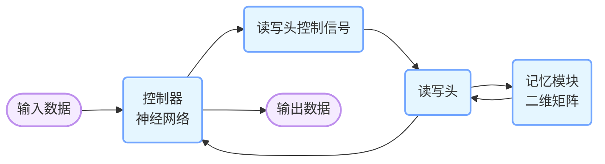

# 神经图灵机在程序化逻辑推理中的新突破

> 关键词：神经图灵机、程序化逻辑推理、深度学习、记忆增强、算法实现

> 摘要：本文围绕神经图灵机在程序化逻辑推理领域的新突破展开深入探讨。首先介绍神经图灵机的背景和相关概念，阐述其核心原理与架构。接着详细讲解神经图灵机的核心算法，通过Python代码进行说明，并给出相关数学模型和公式。然后通过项目实战展示神经图灵机在程序化逻辑推理中的具体应用，包括开发环境搭建、源代码实现与解读。之后分析神经图灵机在实际中的应用场景，推荐学习神经图灵机的工具和资源。最后总结神经图灵机的未来发展趋势与挑战，并对常见问题进行解答，为相关领域的研究和应用提供全面的参考。

## 1. 背景介绍 
### 1.1 目的和范围
本文章旨在深入探讨神经图灵机在程序化逻辑推理方面的新突破。随着人工智能的不断发展，传统的深度学习模型在处理复杂逻辑推理任务时面临着一定的局限性。神经图灵机作为一种结合了神经网络和图灵机概念的新型模型，为解决程序化逻辑推理问题提供了新的思路和方法。本文将详细介绍神经图灵机的原理、算法实现、应用场景等内容，范围涵盖理论基础、代码实现以及实际应用等多个方面，帮助读者全面了解神经图灵机在程序化逻辑推理中的应用和发展。

### 1.2 预期读者
本文的预期读者主要包括人工智能领域的研究人员、开发者、学生以及对神经图灵机和程序化逻辑推理感兴趣的技术爱好者。对于有一定深度学习基础的读者，本文可以帮助他们深入了解神经图灵机的原理和应用；对于初学者，本文将从基础概念入手，逐步引导他们掌握神经图灵机在程序化逻辑推理中的相关知识。

### 1.3 文档结构概述
本文共分为十个部分。第一部分为背景介绍，阐述文章的目的、预期读者和文档结构，同时给出相关术语的定义。第二部分介绍神经图灵机的核心概念与联系，包括原理和架构，并通过文本示意图和Mermaid流程图进行展示。第三部分详细讲解神经图灵机的核心算法原理，并使用Python源代码进行说明。第四部分给出神经图灵机的数学模型和公式，并进行详细讲解和举例说明。第五部分通过项目实战，展示神经图灵机在程序化逻辑推理中的代码实现和详细解释。第六部分分析神经图灵机在实际中的应用场景。第七部分推荐学习神经图灵机的工具和资源，包括学习资源、开发工具框架和相关论文著作。第八部分总结神经图灵机的未来发展趋势与挑战。第九部分为附录，解答常见问题。第十部分提供扩展阅读和参考资料。

### 1.4 术语表
#### 1.4.1 核心术语定义
- **神经图灵机（Neural Turing Machine, NTM）**：一种结合了神经网络和图灵机概念的模型，它引入了外部记忆模块，使得神经网络能够像图灵机一样进行读写操作，从而增强了神经网络处理复杂任务的能力。
- **程序化逻辑推理**：指通过一系列预先定义的规则和步骤，对给定的输入进行逻辑分析和推导，以得出合理的输出。在人工智能领域，程序化逻辑推理通常涉及到对知识的表示、推理规则的应用和推理过程的控制。
- **深度学习**：是一类基于人工神经网络的机器学习技术，通过构建多层神经网络模型，自动从大量数据中学习特征和模式，以实现分类、预测等任务。
- **记忆增强网络**：在神经网络中引入外部记忆模块，使得网络能够存储和检索信息，从而增强网络的记忆能力和处理复杂任务的能力。神经图灵机是记忆增强网络的一种典型代表。

#### 1.4.2 相关概念解释
- **图灵机**：由英国数学家艾伦·图灵在1936年提出的一种抽象计算模型，它由一个无限长的纸带、一个读写头和一个有限状态控制器组成。图灵机通过读写头在纸带上进行读写操作，并根据当前状态和纸带符号进行状态转移，从而实现各种计算任务。
- **神经网络**：是一种模仿人类神经系统的计算模型，由大量的神经元组成。神经元之间通过连接权重进行信息传递和处理，通过调整连接权重，神经网络可以学习输入数据的特征和模式。

#### 1.4.3 缩略词列表
- **NTM**：Neural Turing Machine（神经图灵机）
- **RNN**：Recurrent Neural Network（循环神经网络）
- **LSTM**：Long Short-Term Memory（长短期记忆网络）

## 2. 核心概念与联系 

### 2.1 神经图灵机的核心原理
神经图灵机的核心思想是将神经网络与外部记忆模块相结合，使得神经网络能够像图灵机一样进行读写操作。传统的神经网络在处理长序列数据或需要长期记忆的任务时存在一定的局限性，而神经图灵机通过引入外部记忆模块，能够有效地解决这些问题。

神经图灵机主要由三部分组成：控制器、记忆模块和读写头。控制器通常是一个神经网络，它接收输入数据并生成读写头的控制信号。记忆模块是一个二维矩阵，用于存储信息。读写头根据控制器生成的控制信号，对记忆模块进行读写操作。

### 2.2 神经图灵机的架构
神经图灵机的架构可以用以下文本示意图表示：

```plaintext
输入数据 -> 控制器（神经网络） -> 读写头控制信号
                                 |
                                 v
                            读写头 -> 记忆模块（二维矩阵）
                                 |
                                 v
输出数据 <- 控制器（神经网络）
```

下面是神经图灵机架构的Mermaid流程图：



### 2.3 神经图灵机与程序化逻辑推理的联系
在程序化逻辑推理中，需要对输入数据进行逻辑分析和推导，这通常需要大量的知识和长期的记忆。神经图灵机的外部记忆模块可以存储和检索这些知识，从而为逻辑推理提供支持。控制器可以根据输入数据和记忆模块中的信息，生成推理步骤和决策，实现程序化逻辑推理。

例如，在数学证明中，需要使用各种定理和规则进行推理。神经图灵机可以将这些定理和规则存储在记忆模块中，在推理过程中，控制器可以根据当前的问题和记忆模块中的信息，选择合适的定理和规则进行推导，从而得出证明结果。

## 3. 核心算法原理 & 具体操作步骤 

### 3.1 核心算法原理
神经图灵机的核心算法主要包括读写头的操作和控制器的更新。读写头的操作包括读操作和写操作，读操作从记忆模块中读取信息，写操作将信息写入记忆模块。控制器根据输入数据和读写头的操作结果，更新自身的状态，并生成新的读写头控制信号。

#### 3.1.1 读操作
读操作通过一个加权求和的方式从记忆模块中读取信息。具体来说，读写头会生成一个权重向量，该向量表示对记忆模块中每个位置的关注程度。然后，将记忆模块中的每个位置的向量与对应的权重相乘，并求和，得到读取的信息。

#### 3.1.2 写操作
写操作包括擦除和写入两个步骤。擦除步骤通过一个擦除向量将记忆模块中指定位置的信息擦除，写入步骤通过一个写入向量将新的信息写入记忆模块。

#### 3.1.3 控制器更新
控制器通常是一个循环神经网络，它根据输入数据和读写头的操作结果，更新自身的状态。在每个时间步，控制器接收输入数据和读取的信息，并生成新的隐藏状态和读写头控制信号。

### 3.2 具体操作步骤
下面是神经图灵机的具体操作步骤：

1. **初始化**：初始化记忆模块和控制器的状态。
2. **输入数据**：将输入数据输入到控制器中。
3. **生成控制信号**：控制器根据输入数据生成读写头的控制信号。
4. **读操作**：读写头根据控制信号从记忆模块中读取信息。
5. **控制器更新**：控制器根据输入数据和读取的信息更新自身的状态。
6. **写操作**：读写头根据控制信号将新的信息写入记忆模块。
7. **输出数据**：控制器根据更新后的状态生成输出数据。
8. **重复步骤2-7**：直到达到指定的时间步或满足终止条件。

### 3.3 Python源代码实现
下面是一个简单的神经图灵机的Python代码实现：

```python
import torch
import torch.nn as nn
import torch.nn.functional as F

# 定义神经图灵机的控制器
class Controller(nn.Module):
    def __init__(self, input_size, hidden_size, output_size):
        super(Controller, self).__init__()
        self.rnn = nn.LSTM(input_size, hidden_size, batch_first=True)
        self.fc = nn.Linear(hidden_size, output_size)

    def forward(self, x, hidden):
        output, hidden = self.rnn(x, hidden)
        output = self.fc(output)
        return output, hidden

# 定义神经图灵机的读写头
class Head(nn.Module):
    def __init__(self, hidden_size, memory_size, memory_length):
        super(Head, self).__init__()
        self.fc = nn.Linear(hidden_size, memory_length)

    def forward(self, hidden):
        weights = F.softmax(self.fc(hidden), dim=1)
        return weights

# 定义神经图灵机
class NTM(nn.Module):
    def __init__(self, input_size, hidden_size, output_size, memory_size, memory_length):
        super(NTM, self).__init__()
        self.controller = Controller(input_size, hidden_size, output_size)
        self.read_head = Head(hidden_size, memory_size, memory_length)
        self.write_head = Head(hidden_size, memory_size, memory_length)
        self.memory = torch.randn(memory_size, memory_length)

    def forward(self, x, hidden):
        # 生成控制信号
        output, hidden = self.controller(x, hidden)

        # 读操作
        read_weights = self.read_head(output)
        read_vector = torch.matmul(read_weights, self.memory)

        # 写操作
        write_weights = self.write_head(output)
        self.memory = (1 - write_weights.unsqueeze(2)) * self.memory + write_weights.unsqueeze(2) * output.unsqueeze(1)

        return output, hidden

# 测试神经图灵机
input_size = 10
hidden_size = 20
output_size = 5
memory_size = 100
memory_length = 20

ntm = NTM(input_size, hidden_size, output_size, memory_size, memory_length)
x = torch.randn(1, 1, input_size)
hidden = (torch.randn(1, 1, hidden_size), torch.randn(1, 1, hidden_size))
output, hidden = ntm(x, hidden)
print(output.shape)
```

## 4. 数学模型和公式 & 详细讲解 & 举例说明 

### 4.1 读操作的数学模型和公式
读操作通过一个加权求和的方式从记忆模块中读取信息。设记忆模块为 $M \in \mathbb{R}^{N \times M}$，其中 $N$ 是记忆位置的数量，$M$ 是每个记忆位置的向量维度。读写头生成的权重向量为 $w \in \mathbb{R}^{N}$，满足 $\sum_{i=1}^{N} w_i = 1$。则读取的信息 $r \in \mathbb{R}^{M}$ 可以表示为：

$$
r = \sum_{i=1}^{N} w_i M_i
$$

其中 $M_i$ 是记忆模块中第 $i$ 个位置的向量。

### 4.2 写操作的数学模型和公式
写操作包括擦除和写入两个步骤。擦除向量为 $e \in \mathbb{R}^{M}$，写入向量为 $a \in \mathbb{R}^{M}$。则记忆模块的更新公式为：

$$
M_t = M_{t-1} \odot (1 - w_t \otimes e_t) + w_t \otimes a_t
$$

其中 $M_t$ 是时间步 $t$ 的记忆模块，$w_t$ 是时间步 $t$ 的写权重向量，$\odot$ 表示逐元素相乘，$\otimes$ 表示外积。

### 4.3 控制器更新的数学模型和公式
控制器通常是一个循环神经网络，以LSTM为例，其更新公式如下：

$$
\begin{aligned}
i_t &= \sigma(W_{ii} x_t + W_{hi} h_{t-1} + b_{ii} + b_{hi}) \\
f_t &= \sigma(W_{if} x_t + W_{hf} h_{t-1} + b_{if} + b_{hf}) \\
g_t &= \tanh(W_{ig} x_t + W_{hg} h_{t-1} + b_{ig} + b_{hg}) \\
o_t &= \sigma(W_{io} x_t + W_{ho} h_{t-1} + b_{io} + b_{ho}) \\
c_t &= f_t \odot c_{t-1} + i_t \odot g_t \\
h_t &= o_t \odot \tanh(c_t)
\end{aligned}
$$

其中 $x_t$ 是时间步 $t$ 的输入数据，$h_{t-1}$ 是时间步 $t-1$ 的隐藏状态，$c_{t-1}$ 是时间步 $t-1$ 的细胞状态，$i_t$、$f_t$、$g_t$、$o_t$ 分别是输入门、遗忘门、细胞输入、输出门的输出，$\sigma$ 是 sigmoid 函数，$\tanh$ 是双曲正切函数，$W$ 和 $b$ 是可学习的权重和偏置。

### 4.4 举例说明
假设记忆模块 $M$ 为：

$$
M = \begin{bmatrix}
1 & 2 & 3 \\
4 & 5 & 6 \\
7 & 8 & 9
\end{bmatrix}
$$

读写头生成的权重向量 $w$ 为：

$$
w = \begin{bmatrix}
0.2 \\
0.3 \\
0.5
\end{bmatrix}
$$

则读取的信息 $r$ 为：

$$
r = 0.2 \times \begin{bmatrix}
1 \\
2 \\
3
\end{bmatrix} + 0.3 \times \begin{bmatrix}
4 \\
5 \\
6
\end{bmatrix} + 0.5 \times \begin{bmatrix}
7 \\
8 \\
9
\end{bmatrix} = \begin{bmatrix}
4.9 \\
6.1 \\
7.3
\end{bmatrix}
$$

假设擦除向量 $e$ 为：

$$
e = \begin{bmatrix}
0.1 \\
0.2 \\
0.3
\end{bmatrix}
$$

写入向量 $a$ 为：

$$
a = \begin{bmatrix}
10 \\
11 \\
12
\end{bmatrix}
$$

写权重向量 $w$ 不变，则更新后的记忆模块 $M$ 为：

$$
M' = M \odot (1 - w \otimes e) + w \otimes a
$$

具体计算过程如下：

$$
1 - w \otimes e = \begin{bmatrix}
1 - 0.2 \times 0.1 & 1 - 0.2 \times 0.2 & 1 - 0.2 \times 0.3 \\
1 - 0.3 \times 0.1 & 1 - 0.3 \times 0.2 & 1 - 0.3 \times 0.3 \\
1 - 0.5 \times 0.1 & 1 - 0.5 \times 0.2 & 1 - 0.5 \times 0.3
\end{bmatrix} = \begin{bmatrix}
0.98 & 0.96 & 0.94 \\
0.97 & 0.94 & 0.91 \\
0.95 & 0.9 & 0.85
\end{bmatrix}
$$

$$
w \otimes a = \begin{bmatrix}
0.2 \times 10 & 0.2 \times 11 & 0.2 \times 12 \\
0.3 \times 10 & 0.3 \times 11 & 0.3 \times 12 \\
0.5 \times 10 & 0.5 \times 11 & 0.5 \times 12
\end{bmatrix} = \begin{bmatrix}
2 & 2.2 & 2.4 \\
3 & 3.3 & 3.6 \\
5 & 5.5 & 6
\end{bmatrix}
$$

$$
M' = M \odot (1 - w \otimes e) + w \otimes a = \begin{bmatrix}
1 \times 0.98 + 2 & 2 \times 0.96 + 2.2 & 3 \times 0.94 + 2.4 \\
4 \times 0.97 + 3 & 5 \times 0.94 + 3.3 & 6 \times 0.91 + 3.6 \\
7 \times 0.95 + 5 & 8 \times 0.9 + 5.5 & 9 \times 0.85 + 6
\end{bmatrix} = \begin{bmatrix}
2.98 & 4.12 & 5.22 \\
6.88 & 8 & 9.06 \\
11.65 & 12.7 & 13.65
\end{bmatrix}
$$

## 5. 项目实战：代码实际案例和详细解释说明 

### 5.1  开发环境搭建
为了实现神经图灵机在程序化逻辑推理中的应用，我们需要搭建相应的开发环境。以下是具体的步骤：

#### 5.1.1 安装Python
首先，确保你已经安装了Python。建议使用Python 3.6及以上版本。你可以从Python官方网站（https://www.python.org/downloads/）下载并安装Python。

#### 5.1.2 安装深度学习框架
我们使用PyTorch作为深度学习框架。可以使用以下命令安装PyTorch：

```bash
pip install torch torchvision
```

#### 5.1.3 安装其他依赖库
还需要安装一些其他的依赖库，如NumPy、Matplotlib等。可以使用以下命令安装：

```bash
pip install numpy matplotlib
```

### 5.2  源代码详细实现和代码解读
下面是一个使用神经图灵机解决简单逻辑推理问题的完整代码示例：

```python
import torch
import torch.nn as nn
import torch.nn.functional as F
import numpy as np
import matplotlib.pyplot as plt

# 定义神经图灵机的控制器
class Controller(nn.Module):
    def __init__(self, input_size, hidden_size, output_size):
        super(Controller, self).__init__()
        self.rnn = nn.LSTM(input_size, hidden_size, batch_first=True)
        self.fc = nn.Linear(hidden_size, output_size)

    def forward(self, x, hidden):
        output, hidden = self.rnn(x, hidden)
        output = self.fc(output)
        return output, hidden

# 定义神经图灵机的读写头
class Head(nn.Module):
    def __init__(self, hidden_size, memory_size, memory_length):
        super(Head, self).__init__()
        self.fc = nn.Linear(hidden_size, memory_length)

    def forward(self, hidden):
        weights = F.softmax(self.fc(hidden), dim=1)
        return weights

# 定义神经图灵机
class NTM(nn.Module):
    def __init__(self, input_size, hidden_size, output_size, memory_size, memory_length):
        super(NTM, self).__init__()
        self.controller = Controller(input_size, hidden_size, output_size)
        self.read_head = Head(hidden_size, memory_size, memory_length)
        self.write_head = Head(hidden_size, memory_size, memory_length)
        self.memory = torch.randn(memory_size, memory_length)

    def forward(self, x, hidden):
        # 生成控制信号
        output, hidden = self.controller(x, hidden)

        # 读操作
        read_weights = self.read_head(output)
        read_vector = torch.matmul(read_weights, self.memory)

        # 写操作
        write_weights = self.write_head(output)
        self.memory = (1 - write_weights.unsqueeze(2)) * self.memory + write_weights.unsqueeze(2) * output.unsqueeze(1)

        return output, hidden

# 生成训练数据
def generate_data(num_samples, sequence_length, input_size):
    data = []
    for _ in range(num_samples):
        sequence = torch.randn(1, sequence_length, input_size)
        target = torch.sum(sequence, dim=1)
        data.append((sequence, target))
    return data

# 训练神经图灵机
def train_ntm(ntm, data, num_epochs, learning_rate):
    criterion = nn.MSELoss()
    optimizer = torch.optim.Adam(ntm.parameters(), lr=learning_rate)
    losses = []

    for epoch in range(num_epochs):
        total_loss = 0
        for sequence, target in data:
            hidden = (torch.randn(1, 1, ntm.controller.rnn.hidden_size), torch.randn(1, 1, ntm.controller.rnn.hidden_size))
            optimizer.zero_grad()
            output, hidden = ntm(sequence, hidden)
            loss = criterion(output[:, -1, :], target)
            loss.backward()
            optimizer.step()
            total_loss += loss.item()

        average_loss = total_loss / len(data)
        losses.append(average_loss)
        print(f'Epoch {epoch+1}/{num_epochs}, Loss: {average_loss}')

    return losses

# 超参数设置
input_size = 10
hidden_size = 20
output_size = 10
memory_size = 100
memory_length = 20
num_samples = 1000
sequence_length = 5
num_epochs = 100
learning_rate = 0.001

# 创建神经图灵机模型
ntm = NTM(input_size, hidden_size, output_size, memory_size, memory_length)

# 生成训练数据
data = generate_data(num_samples, sequence_length, input_size)

# 训练神经图灵机
losses = train_ntm(ntm, data, num_epochs, learning_rate)

# 绘制损失曲线
plt.plot(losses)
plt.xlabel('Epoch')
plt.ylabel('Loss')
plt.title('Training Loss')
plt.show()
```

### 5.3  代码解读与分析
#### 5.3.1 控制器（Controller）
控制器是神经图灵机的核心组件之一，它接收输入数据并生成读写头的控制信号。在代码中，控制器使用LSTM网络实现，通过一个全连接层将LSTM的输出映射到所需的输出维度。

#### 5.3.2 读写头（Head）
读写头根据控制器生成的控制信号，对记忆模块进行读写操作。在代码中，读写头通过一个全连接层和softmax函数生成权重向量，用于对记忆模块进行加权求和。

#### 5.3.3 神经图灵机（NTM）
神经图灵机将控制器和读写头组合在一起，实现了完整的读写操作和状态更新。在代码中，神经图灵机的前向传播过程包括生成控制信号、读操作、写操作和输出数据。

#### 5.3.4 训练过程
训练过程包括生成训练数据、定义损失函数和优化器、迭代训练等步骤。在代码中，使用均方误差损失函数（MSE）和Adam优化器进行训练，通过多次迭代更新模型的参数，使得模型的输出逐渐接近目标值。

#### 5.3.5 损失曲线分析
通过绘制损失曲线，可以观察模型的训练过程。如果损失曲线逐渐下降并趋于稳定，说明模型在不断学习和优化；如果损失曲线波动较大或没有明显下降趋势，可能需要调整超参数或检查模型结构。

## 6. 实际应用场景 
神经图灵机在程序化逻辑推理中有许多实际应用场景，以下是一些常见的例子：

### 6.1 自然语言处理
在自然语言处理中，神经图灵机可以用于解决复杂的语义理解和推理任务。例如，在问答系统中，神经图灵机可以将问题和相关的知识存储在记忆模块中，通过逻辑推理生成准确的答案。在机器翻译中，神经图灵机可以利用外部记忆模块存储语法规则和词汇信息，提高翻译的质量和准确性。

### 6.2 数学证明
在数学证明中，需要使用各种定理和规则进行逻辑推理。神经图灵机可以将这些定理和规则存储在记忆模块中，在推理过程中，根据当前的问题和记忆模块中的信息，选择合适的定理和规则进行推导，从而实现自动数学证明。

### 6.3 机器人控制
在机器人控制中，需要对环境信息和任务要求进行逻辑分析和决策。神经图灵机可以将环境信息和历史决策存储在记忆模块中，通过逻辑推理生成机器人的动作指令，提高机器人的智能水平和决策能力。

### 6.4 游戏智能
在游戏中，需要根据游戏规则和当前局势进行逻辑推理和决策。神经图灵机可以将游戏规则和历史游戏数据存储在记忆模块中，通过逻辑推理生成最优的游戏策略，提高游戏智能的水平。

## 7. 工具和资源推荐
### 7.1 学习资源推荐
#### 7.1.1 书籍推荐
- 《深度学习》（Deep Learning）：由Ian Goodfellow、Yoshua Bengio和Aaron Courville所著，是深度学习领域的经典教材，涵盖了神经网络、卷积神经网络、循环神经网络等基础知识，也对神经图灵机等高级模型有一定的介绍。
- 《Python深度学习》（Deep Learning with Python）：由Francois Chollet所著，作者是Keras深度学习框架的开发者。这本书通过大量的实际案例，介绍了如何使用Python和Keras进行深度学习开发，对理解神经图灵机的实现有很大的帮助。

#### 7.1.2 在线课程
- Coursera上的“深度学习专项课程”（Deep Learning Specialization）：由Andrew Ng教授主讲，包括五门课程，涵盖了深度学习的各个方面，包括神经网络基础、卷积神经网络、循环神经网络等。课程内容丰富，讲解详细，是学习深度学习的优质资源。
- edX上的“麻省理工学院：深度学习基础”（MITx: 6.S191x Introduction to Deep Learning）：由麻省理工学院开设，介绍了深度学习的基本概念和算法，包括神经图灵机等高级模型的原理和应用。

#### 7.1.3 技术博客和网站
- Medium：是一个技术博客平台，有许多关于深度学习和神经图灵机的优秀文章。可以关注一些知名的博主，如Andrej Karpathy、Jeremy Howard等，他们经常分享深度学习的最新研究成果和实践经验。
- arXiv：是一个预印本服务器，提供了大量的学术论文，包括神经图灵机的最新研究成果。可以在arXiv上搜索相关的论文，了解神经图灵机的最新发展动态。

### 7.2 开发工具框架推荐
#### 7.2.1 IDE和编辑器
- PyCharm：是一款专门为Python开发设计的集成开发环境（IDE），提供了丰富的代码编辑、调试、版本控制等功能，非常适合深度学习开发。
- Jupyter Notebook：是一个交互式的开发环境，可以在浏览器中编写和运行Python代码，支持代码、文本、图像等多种形式的展示，非常适合进行数据分析和模型实验。

#### 7.2.2 调试和性能分析工具
- TensorBoard：是TensorFlow提供的一个可视化工具，可以用于监控模型的训练过程、可视化模型的结构和性能指标等。虽然我们使用的是PyTorch，但也可以使用一些第三方库将PyTorch的日志信息转换为TensorBoard可以读取的格式。
- PyTorch Profiler：是PyTorch提供的一个性能分析工具，可以用于分析模型的运行时间、内存使用情况等，帮助我们找出模型的性能瓶颈。

#### 7.2.3 相关框架和库
- PyTorch：是一个开源的深度学习框架，提供了丰富的神经网络层和优化算法，支持GPU加速，非常适合实现神经图灵机等复杂模型。
- NumPy：是Python的一个科学计算库，提供了高效的多维数组对象和各种数学函数，是深度学习开发中不可或缺的工具。
- Matplotlib：是Python的一个绘图库，可以用于绘制各种图表，如损失曲线、准确率曲线等，帮助我们直观地观察模型的训练过程和性能。

### 7.3 相关论文著作推荐
#### 7.3.1 经典论文
- 《Neural Turing Machines》：由Alex Graves、Greg Wayne和Ivo Danihelka发表于2014年，是神经图灵机的开创性论文，详细介绍了神经图灵机的原理和架构，并通过实验证明了其在序列学习任务中的有效性。
- 《End-To-End Memory Networks》：由Sainbayar Sukhbaatar、Arthur Szlam、Jason Weston和Rob Fergus发表于2015年，提出了端到端记忆网络的概念，为神经图灵机的发展提供了重要的思路。

#### 7.3.2 最新研究成果
- 可以关注每年的国际机器学习会议（ICML）、神经信息处理系统大会（NeurIPS）、人工智能促进协会会议（AAAI）等顶级学术会议，这些会议上会发表许多关于神经图灵机的最新研究成果。
- 也可以关注一些知名的学术期刊，如《Journal of Artificial Intelligence Research》（JAIR）、《Artificial Intelligence》等，这些期刊会发表经过同行评审的高质量研究论文。

#### 7.3.3 应用案例分析
- 可以在GitHub等开源代码平台上搜索神经图灵机的应用案例，了解如何将神经图灵机应用于实际问题。例如，一些项目将神经图灵机应用于自然语言处理、图像识别等领域，通过分析这些项目的代码和文档，可以学习到神经图灵机的实际应用技巧。

## 8. 总结：未来发展趋势与挑战
### 8.1 未来发展趋势
#### 8.1.1 与其他模型的融合
神经图灵机可以与其他深度学习模型，如卷积神经网络（CNN）、循环神经网络（RNN）等进行融合，以充分发挥各自的优势。例如，将神经图灵机与CNN结合，可以用于处理图像和视频数据，实现更复杂的视觉推理任务；将神经图灵机与RNN结合，可以用于处理序列数据，提高序列建模的能力。

#### 8.1.2 应用领域的拓展
随着技术的不断发展，神经图灵机的应用领域将不断拓展。除了自然语言处理、数学证明、机器人控制等领域，神经图灵机还可以应用于医疗诊断、金融分析、交通规划等领域，为这些领域的决策和推理提供支持。

#### 8.1.3 理论研究的深入
目前，神经图灵机的理论研究还处于初级阶段，许多问题还需要进一步深入研究。例如，神经图灵机的学习算法、复杂度分析、可解释性等问题，都需要更多的研究和探索。未来，随着理论研究的深入，神经图灵机的性能和应用效果将得到进一步提升。

### 8.2 挑战
#### 8.2.1 训练难度大
神经图灵机的训练难度较大，需要大量的计算资源和时间。由于神经图灵机引入了外部记忆模块，模型的参数数量和复杂度都有所增加，使得训练过程更加困难。此外，神经图灵机的训练需要设计合适的损失函数和优化算法，以确保模型能够收敛到最优解。

#### 8.2.2 可解释性差
神经图灵机作为一种深度学习模型，其可解释性较差。由于模型的内部结构和决策过程较为复杂，很难理解模型是如何进行逻辑推理和决策的。这在一些对可解释性要求较高的领域，如医疗诊断、金融分析等，会限制神经图灵机的应用。

#### 8.2.3 数据要求高
神经图灵机的性能和应用效果在很大程度上依赖于训练数据的质量和数量。如果训练数据不足或存在噪声，模型的性能会受到很大影响。此外，神经图灵机在处理复杂逻辑推理任务时，需要大量的标注数据，这增加了数据收集和标注的难度。

## 9. 附录：常见问题与解答
### 9.1 神经图灵机与传统神经网络有什么区别？
神经图灵机与传统神经网络的主要区别在于引入了外部记忆模块。传统神经网络在处理长序列数据或需要长期记忆的任务时存在一定的局限性，而神经图灵机通过外部记忆模块，可以存储和检索信息，从而增强了网络的记忆能力和处理复杂任务的能力。

### 9.2 神经图灵机的训练时间为什么比较长？
神经图灵机的训练时间比较长主要有以下几个原因：
- 模型复杂度高：神经图灵机引入了外部记忆模块，模型的参数数量和复杂度都有所增加，使得训练过程更加复杂。
- 计算资源需求大：神经图灵机的训练需要大量的计算资源，特别是在处理大规模数据时，计算时间会更长。
- 训练算法复杂：神经图灵机的训练需要设计合适的损失函数和优化算法，以确保模型能够收敛到最优解。这些算法的复杂度也会影响训练时间。

### 9.3 如何提高神经图灵机的可解释性？
提高神经图灵机的可解释性是一个具有挑战性的问题，目前可以从以下几个方面入手：
- 可视化：通过可视化技术，将神经图灵机的内部结构和决策过程展示出来，帮助人们理解模型的工作原理。
- 规则提取：从神经图灵机的训练结果中提取规则和模式，将其转化为人类可理解的形式。
- 结合符号推理：将神经图灵机与符号推理方法相结合，利用符号推理的可解释性来增强神经图灵机的可解释性。

### 9.4 神经图灵机在实际应用中面临哪些挑战？
神经图灵机在实际应用中面临以下几个挑战：
- 训练难度大：如前所述，神经图灵机的训练难度较大，需要大量的计算资源和时间。
- 可解释性差：神经图灵机的可解释性较差，在一些对可解释性要求较高的领域，会限制其应用。
- 数据要求高：神经图灵机的性能和应用效果在很大程度上依赖于训练数据的质量和数量，数据收集和标注的难度较大。
- 模型复杂度高：神经图灵机的模型复杂度较高，在实际应用中需要考虑模型的部署和运行效率。

## 10. 扩展阅读 & 参考资料
### 10.1 扩展阅读
- 《Attention Is All You Need》：提出了Transformer模型，是自然语言处理领域的重要突破，对理解神经图灵机的注意力机制有一定的帮助。
- 《Generative Adversarial Nets》：提出了生成对抗网络（GAN），是一种强大的生成模型，与神经图灵机结合可以实现更复杂的任务。

### 10.2 参考资料
- Graves, A., Wayne, G., & Danihelka, I. (2014). Neural Turing Machines. arXiv preprint arXiv:1410.5401.
- Sukhbaatar, S., Szlam, A., Weston, J., & Fergus, R. (2015). End-To-End Memory Networks. In Advances in neural information processing systems (pp. 2440-2448).
- Goodfellow, I. J., Bengio, Y., & Courville, A. (2016). Deep Learning. MIT press.

作者：AI天才研究院/AI Genius Institute & 禅与计算机程序设计艺术 /Zen And The Art of Computer Programming