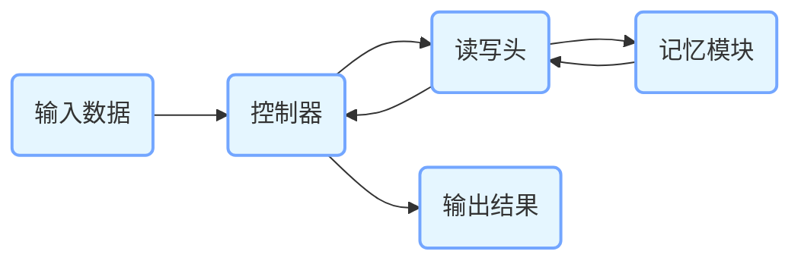

# 神经图灵机在程序化逻辑推理中的新突破应用研究

> 关键词：神经图灵机、程序化逻辑推理、深度学习、记忆增强、新突破应用

> 摘要：本文聚焦于神经图灵机在程序化逻辑推理中的新突破应用。首先介绍了神经图灵机及程序化逻辑推理的相关背景知识，深入剖析神经图灵机的核心概念与架构原理。通过数学模型和公式详细阐释其工作机制，并结合Python代码展示核心算法的具体实现。在项目实战部分，给出实际代码案例并进行详细解读。探讨了神经图灵机在多个实际场景中的应用，同时推荐了相关的学习资源、开发工具框架以及论文著作。最后对神经图灵机在程序化逻辑推理领域的未来发展趋势与挑战进行总结，并提供常见问题解答和扩展阅读参考资料。

## 1. 背景介绍 
### 1.1 目的和范围
本研究的主要目的是深入探讨神经图灵机在程序化逻辑推理中的新突破应用。通过对神经图灵机的原理、算法和实际应用进行全面分析，揭示其在解决复杂逻辑推理问题上的潜力和优势。研究范围涵盖神经图灵机的基本概念、核心算法、数学模型，以及在不同领域的具体应用案例。同时，分析其在未来发展中可能面临的挑战和机遇。

### 1.2 预期读者
本文预期读者包括人工智能、机器学习、计算机科学等领域的研究人员、开发者和学生。对于对神经图灵机和程序化逻辑推理感兴趣的专业人士，本文提供了深入的技术分析和实际应用案例；对于初学者，本文的详细解释和代码示例有助于他们理解相关概念和技术。

### 1.3 文档结构概述
本文将按照以下结构进行组织：首先介绍神经图灵机和程序化逻辑推理的背景知识，包括目的、预期读者和文档结构概述；接着阐述核心概念与联系，包括神经图灵机的原理和架构；然后详细讲解核心算法原理和具体操作步骤，并给出Python代码示例；随后介绍数学模型和公式，并进行详细讲解和举例说明；在项目实战部分，给出实际代码案例并进行详细解读；探讨神经图灵机在实际应用场景中的应用；推荐相关的学习资源、开发工具框架和论文著作；最后总结未来发展趋势与挑战，提供常见问题解答和扩展阅读参考资料。

### 1.4 术语表
#### 1.4.1 核心术语定义
- **神经图灵机（Neural Turing Machine, NTM）**：一种结合了神经网络和图灵机概念的模型，它引入了外部记忆模块，使得神经网络能够进行更复杂的计算和信息存储。
- **程序化逻辑推理**：根据一定的规则和逻辑关系，对程序中的信息进行推理和判断的过程。
- **记忆增强神经网络（Memory-Augmented Neural Network, MANN）**：一类在神经网络中引入外部记忆模块的模型，神经图灵机是其中的一种。
- **注意力机制（Attention Mechanism）**：一种让模型能够有选择地关注输入信息的不同部分的机制，在神经图灵机中用于控制对外部记忆的访问。

#### 1.4.2 相关概念解释
- **图灵机**：由艾伦·图灵提出的一种抽象计算模型，它由一个无限长的纸带和一个读写头组成，能够模拟任何可计算的算法。
- **神经网络**：一种模仿人类神经系统的计算模型，由大量的神经元组成，能够自动学习数据中的模式和规律。
- **深度学习**：一种基于神经网络的机器学习方法，通过构建多层神经网络来学习数据的高层特征表示。

#### 1.4.3 缩略词列表
- **NTM**：神经图灵机（Neural Turing Machine）
- **MANN**：记忆增强神经网络（Memory-Augmented Neural Network）
- **RNN**：循环神经网络（Recurrent Neural Network）
- **LSTM**：长短期记忆网络（Long Short-Term Memory）

## 2. 核心概念与联系 
### 2.1 神经图灵机的基本原理
神经图灵机（NTM）是一种记忆增强的神经网络，它结合了神经网络的学习能力和图灵机的计算能力。NTM的核心思想是引入一个外部记忆模块，使得神经网络能够像图灵机一样进行读写操作，从而实现更复杂的计算和信息存储。

NTM主要由三部分组成：控制器（Controller）、记忆模块（Memory）和读写头（Read/Write Heads）。控制器通常是一个神经网络，它接收输入并生成控制信号，用于控制读写头对记忆模块的访问。记忆模块是一个二维矩阵，用于存储信息。读写头负责从记忆模块中读取信息和向记忆模块中写入信息。

### 2.2 神经图灵机与程序化逻辑推理的联系
程序化逻辑推理需要对程序中的信息进行存储、检索和处理，而神经图灵机的外部记忆模块和读写操作正好满足了这些需求。通过使用神经图灵机，我们可以将程序中的信息存储在记忆模块中，并使用控制器和读写头进行逻辑推理。例如，在处理复杂的程序代码时，神经图灵机可以记住之前的代码片段和执行结果，从而更好地理解代码的逻辑结构和执行流程。

### 2.3 核心概念的文本示意图
```plaintext
+-----------------+
|   输入数据      |
+-----------------+
       |
       v
+-----------------+
|    控制器       |
| (神经网络)      |
+-----------------+
       |
       +------> +-----------------+
       |        |   读写头        |
       |        +-----------------+
       |                 |
       |                 v
       |          +-----------------+
       |          |   记忆模块      |
       |          | (二维矩阵)      |
       |          +-----------------+
       |                 ^
       |                 |
       +------< +-----------------+
                |   读写头        |
                +-----------------+
       |
       v
+-----------------+
|   输出结果      |
+-----------------+
```

### 2.4 Mermaid流程图


## 3. 核心算法原理 & 具体操作步骤 
### 3.1 核心算法原理
神经图灵机的核心算法主要包括控制器的前向传播、读写头的操作和记忆模块的更新。下面我们将详细介绍这些步骤。

#### 3.1.1 控制器的前向传播
控制器通常是一个神经网络，它接收输入数据并生成控制信号。控制信号包括读写头的权重、移位操作和擦除/写入向量等。以一个简单的循环神经网络（RNN）作为控制器为例，其前向传播公式如下：

$$h_t = \tanh(W_{ih}x_t + W_{hh}h_{t-1} + b_h)$$

其中，$h_t$ 是时刻 $t$ 的隐藏状态，$x_t$ 是时刻 $t$ 的输入，$W_{ih}$ 和 $W_{hh}$ 是权重矩阵，$b_h$ 是偏置向量。

#### 3.1.2 读写头的操作
读写头的操作包括读取操作和写入操作。

##### 读取操作
读取操作通过计算记忆模块中每个位置的权重，然后对记忆模块进行加权求和得到读取向量。权重的计算通常使用注意力机制，公式如下：

$$w_t^r = \text{softmax}(K(q_t, M_t))$$

$$r_t = \sum_{i=1}^N w_t^r[i] M_t[i]$$

其中，$w_t^r$ 是时刻 $t$ 的读取权重，$q_t$ 是时刻 $t$ 的查询向量，$M_t$ 是时刻 $t$ 的记忆模块，$r_t$ 是时刻 $t$ 的读取向量。

##### 写入操作
写入操作包括擦除操作和写入操作。擦除操作通过一个擦除向量 $e_t$ 来擦除记忆模块中的部分信息，写入操作通过一个写入向量 $a_t$ 来向记忆模块中写入新的信息。公式如下：

$$M_t'[i] = M_{t-1}[i](1 - w_t^w[i] e_t)$$

$$M_t[i] = M_t'[i] + w_t^w[i] a_t$$

其中，$w_t^w$ 是时刻 $t$ 的写入权重，$M_t'$ 是擦除后的记忆模块，$M_t$ 是更新后的记忆模块。

#### 3.1.3 记忆模块的更新
记忆模块的更新是通过读写头的操作来完成的。在每个时间步，根据读写头的操作，更新记忆模块中的信息。

### 3.2 具体操作步骤
下面是神经图灵机的具体操作步骤：

1. **初始化**：初始化控制器的参数、记忆模块和读写头的状态。
2. **输入数据**：将输入数据输入到控制器中。
3. **控制器前向传播**：控制器根据输入数据生成控制信号。
4. **读写头操作**：根据控制信号，读写头对记忆模块进行读取和写入操作。
5. **记忆模块更新**：根据读写头的操作，更新记忆模块中的信息。
6. **输出结果**：控制器根据读取向量和当前隐藏状态生成输出结果。
7. **重复步骤2-6**：直到处理完所有的输入数据。

### 3.3 Python源代码实现
```python
import torch
import torch.nn as nn
import torch.nn.functional as F

# 定义控制器（简单的RNN）
class Controller(nn.Module):
    def __init__(self, input_size, hidden_size):
        super(Controller, self).__init__()
        self.rnn = nn.RNN(input_size, hidden_size, batch_first=True)

    def forward(self, x, h_0):
        output, h_n = self.rnn(x, h_0)
        return output, h_n

# 定义神经图灵机
class NeuralTuringMachine(nn.Module):
    def __init__(self, input_size, hidden_size, memory_size, memory_dim):
        super(NeuralTuringMachine, self).__init__()
        self.controller = Controller(input_size, hidden_size)
        self.memory_size = memory_size
        self.memory_dim = memory_dim
        self.memory = torch.zeros(memory_size, memory_dim)

    def read(self, query):
        # 计算读取权重
        similarity = torch.matmul(query, self.memory.t())
        w_r = F.softmax(similarity, dim=1)
        # 读取向量
        r = torch.matmul(w_r, self.memory)
        return r

    def write(self, query, e, a):
        # 计算写入权重
        similarity = torch.matmul(query, self.memory.t())
        w_w = F.softmax(similarity, dim=1)
        # 擦除操作
        memory_prime = self.memory * (1 - w_w.t() * e)
        # 写入操作
        self.memory = memory_prime + w_w.t() * a

    def forward(self, x):
        batch_size, seq_len, input_size = x.size()
        h_0 = torch.zeros(1, batch_size, self.controller.rnn.hidden_size)
        output = []
        for t in range(seq_len):
            x_t = x[:, t:t+1, :]
            # 控制器前向传播
            _, h_t = self.controller(x_t, h_0)
            h_t = h_t.squeeze(0)
            # 读取操作
            r_t = self.read(h_t)
            # 模拟写入操作的参数
            e_t = torch.randn(self.memory_dim)
            a_t = torch.randn(self.memory_dim)
            # 写入操作
            self.write(h_t, e_t, a_t)
            # 输出结果
            output_t = h_t + r_t
            output.append(output_t)
        output = torch.stack(output, dim=1)
        return output

# 测试代码
input_size = 10
hidden_size = 20
memory_size = 30
memory_dim = 15
ntm = NeuralTuringMachine(input_size, hidden_size, memory_size, memory_dim)
x = torch.randn(5, 20, input_size)  # 批量大小为5，序列长度为20
output = ntm(x)
print(output.shape)
```

## 4. 数学模型和公式 & 详细讲解 & 举例说明 
### 4.1 数学模型和公式
#### 4.1.1 控制器的数学模型
控制器通常使用神经网络来实现，以简单的RNN为例，其数学模型如下：

$$h_t = \tanh(W_{ih}x_t + W_{hh}h_{t-1} + b_h)$$

其中，$h_t \in \mathbb{R}^{h}$ 是时刻 $t$ 的隐藏状态，$x_t \in \mathbb{R}^{d}$ 是时刻 $t$ 的输入，$W_{ih} \in \mathbb{R}^{h \times d}$ 和 $W_{hh} \in \mathbb{R}^{h \times h}$ 是权重矩阵，$b_h \in \mathbb{R}^{h}$ 是偏置向量。

#### 4.1.2 读取操作的数学模型
读取操作通过注意力机制计算记忆模块中每个位置的权重，然后对记忆模块进行加权求和得到读取向量。数学模型如下：

$$w_t^r = \text{softmax}(K(q_t, M_t))$$

$$r_t = \sum_{i=1}^N w_t^r[i] M_t[i]$$

其中，$w_t^r \in \mathbb{R}^{N}$ 是时刻 $t$ 的读取权重，$q_t \in \mathbb{R}^{d}$ 是时刻 $t$ 的查询向量，$M_t \in \mathbb{R}^{N \times d}$ 是时刻 $t$ 的记忆模块，$r_t \in \mathbb{R}^{d}$ 是时刻 $t$ 的读取向量，$K$ 是相似度函数，通常使用点积相似度：

$$K(q_t, M_t[i]) = q_t^T M_t[i]$$

#### 4.1.3 写入操作的数学模型
写入操作包括擦除操作和写入操作，数学模型如下：

$$M_t'[i] = M_{t-1}[i](1 - w_t^w[i] e_t)$$

$$M_t[i] = M_t'[i] + w_t^w[i] a_t$$

其中，$w_t^w \in \mathbb{R}^{N}$ 是时刻 $t$ 的写入权重，$e_t \in \mathbb{R}^{d}$ 是擦除向量，$a_t \in \mathbb{R}^{d}$ 是写入向量，$M_t' \in \mathbb{R}^{N \times d}$ 是擦除后的记忆模块，$M_t \in \mathbb{R}^{N \times d}$ 是更新后的记忆模块。

### 4.2 详细讲解
#### 4.2.1 控制器的作用
控制器的作用是根据输入数据生成控制信号，用于控制读写头对记忆模块的访问。控制器可以使用不同的神经网络结构，如RNN、LSTM等。在上述公式中，控制器通过RNN对输入数据进行处理，生成隐藏状态 $h_t$。隐藏状态 $h_t$ 可以作为查询向量 $q_t$ 用于读写头的操作。

#### 4.2.2 读取操作的原理
读取操作通过注意力机制选择记忆模块中与查询向量相关的部分，并将这些部分加权求和得到读取向量。注意力机制使得神经图灵机能够有选择地关注记忆模块中的信息，从而提高信息检索的效率。在上述公式中，通过计算查询向量 $q_t$ 与记忆模块 $M_t$ 中每个位置的相似度，然后使用softmax函数将相似度转换为权重 $w_t^r$，最后对记忆模块进行加权求和得到读取向量 $r_t$。

#### 4.2.3 写入操作的原理
写入操作包括擦除操作和写入操作。擦除操作通过擦除向量 $e_t$ 来擦除记忆模块中与写入权重 $w_t^w$ 对应的部分信息，写入操作通过写入向量 $a_t$ 来向记忆模块中写入新的信息。这样可以实现对记忆模块的动态更新。在上述公式中，首先使用擦除向量 $e_t$ 和写入权重 $w_t^w$ 对记忆模块进行擦除操作，得到擦除后的记忆模块 $M_t'$，然后使用写入向量 $a_t$ 和写入权重 $w_t^w$ 对擦除后的记忆模块进行写入操作，得到更新后的记忆模块 $M_t$。

### 4.3 举例说明
假设我们有一个记忆模块 $M$，其大小为 $N = 3$，维度为 $d = 2$，初始状态如下：

$$M = \begin{bmatrix}
1 & 2 \\
3 & 4 \\
5 & 6
\end{bmatrix}$$

查询向量 $q = \begin{bmatrix}
2 & 3
\end{bmatrix}$，擦除向量 $e = \begin{bmatrix}
0.5 & 0.5
\end{bmatrix}$，写入向量 $a = \begin{bmatrix}
10 & 20
\end{bmatrix}$。

#### 4.3.1 读取操作
首先计算查询向量 $q$ 与记忆模块 $M$ 中每个位置的相似度：

$$K(q, M[1]) = q^T M[1] = \begin{bmatrix}
2 & 3
\end{bmatrix} \begin{bmatrix}
1 \\
2
\end{bmatrix} = 2 \times 1 + 3 \times 2 = 8$$

$$K(q, M[2]) = q^T M[2] = \begin{bmatrix}
2 & 3
\end{bmatrix} \begin{bmatrix}
3 \\
4
\end{bmatrix} = 2 \times 3 + 3 \times 4 = 18$$

$$K(q, M[3]) = q^T M[3] = \begin{bmatrix}
2 & 3
\end{bmatrix} \begin{bmatrix}
5 \\
6
\end{bmatrix} = 2 \times 5 + 3 \times 6 = 28$$

然后使用softmax函数计算读取权重：

$$w^r = \text{softmax}(\begin{bmatrix}
8 & 18 & 28
\end{bmatrix}) = \begin{bmatrix}
0.0003 & 0.0474 & 0.9523
\end{bmatrix}$$

最后计算读取向量：

$$r = \sum_{i=1}^3 w^r[i] M[i] = 0.0003 \begin{bmatrix}
1 & 2
\end{bmatrix} + 0.0474 \begin{bmatrix}
3 & 4
\end{bmatrix} + 0.9523 \begin{bmatrix}
5 & 6
\end{bmatrix} = \begin{bmatrix}
4.86 & 5.86
\end{bmatrix}$$

#### 4.3.2 写入操作
首先计算写入权重，假设与读取权重相同：

$$w^w = \begin{bmatrix}
0.0003 & 0.0474 & 0.9523
\end{bmatrix}$$

然后进行擦除操作：

$$M'[1] = M[1](1 - w^w[1] e) = \begin{bmatrix}
1 & 2
\end{bmatrix} (1 - 0.0003 \begin{bmatrix}
0.5 & 0.5
\end{bmatrix}) = \begin{bmatrix}
1 & 2
\end{bmatrix}$$

$$M'[2] = M[2](1 - w^w[2] e) = \begin{bmatrix}
3 & 4
\end{bmatrix} (1 - 0.0474 \begin{bmatrix}
0.5 & 0.5
\end{bmatrix}) = \begin{bmatrix}
2.93 & 3.93
\end{bmatrix}$$

$$M'[3] = M[3](1 - w^w[3] e) = \begin{bmatrix}
5 & 6
\end{bmatrix} (1 - 0.9523 \begin{bmatrix}
0.5 & 0.5
\end{bmatrix}) = \begin{bmatrix}
2.62 & 3.12
\end{bmatrix}$$

最后进行写入操作：

$$M[1] = M'[1] + w^w[1] a = \begin{bmatrix}
1 & 2
\end{bmatrix} + 0.0003 \begin{bmatrix}
10 & 20
\end{bmatrix} = \begin{bmatrix}
1.003 & 2.006
\end{bmatrix}$$

$$M[2] = M'[2] + w^w[2] a = \begin{bmatrix}
2.93 & 3.93
\end{bmatrix} + 0.0474 \begin{bmatrix}
10 & 20
\end{bmatrix} = \begin{bmatrix}
3.404 & 4.878
\end{bmatrix}$$

$$M[3] = M'[3] + w^w[3] a = \begin{bmatrix}
2.62 & 3.12
\end{bmatrix} + 0.9523 \begin{bmatrix}
10 & 20
\end{bmatrix} = \begin{bmatrix}
12.143 & 22.166
\end{bmatrix}$$

通过上述例子，我们可以看到神经图灵机的读取和写入操作是如何工作的。

## 5. 项目实战：代码实际案例和详细解释说明 
### 5.1 开发环境搭建
为了实现神经图灵机在程序化逻辑推理中的应用，我们需要搭建相应的开发环境。以下是具体步骤：

#### 5.1.1 安装Python
首先，确保你已经安装了Python 3.x版本。你可以从Python官方网站（https://www.python.org/downloads/）下载并安装适合你操作系统的Python版本。

#### 5.1.2 安装深度学习框架
我们使用PyTorch作为深度学习框架，因为它提供了丰富的工具和函数来实现神经网络。可以使用以下命令安装PyTorch：

```sh
pip install torch torchvision
```

#### 5.1.3 安装其他依赖库
还需要安装一些其他的依赖库，如NumPy、Matplotlib等。可以使用以下命令安装：

```sh
pip install numpy matplotlib
```

### 5.2 源代码详细实现和代码解读
#### 5.2.1 完整代码实现
```python
import torch
import torch.nn as nn
import torch.nn.functional as F
import numpy as np
import matplotlib.pyplot as plt

# 定义控制器（LSTM）
class Controller(nn.Module):
    def __init__(self, input_size, hidden_size):
        super(Controller, self).__init__()
        self.lstm = nn.LSTM(input_size, hidden_size, batch_first=True)

    def forward(self, x, h_0, c_0):
        output, (h_n, c_n) = self.lstm(x, (h_0, c_0))
        return output, (h_n, c_n)

# 定义神经图灵机
class NeuralTuringMachine(nn.Module):
    def __init__(self, input_size, hidden_size, memory_size, memory_dim):
        super(NeuralTuringMachine, self).__init__()
        self.controller = Controller(input_size, hidden_size)
        self.memory_size = memory_size
        self.memory_dim = memory_dim
        self.memory = torch.zeros(memory_size, memory_dim)

    def read(self, query):
        # 计算读取权重
        similarity = torch.matmul(query, self.memory.t())
        w_r = F.softmax(similarity, dim=1)
        # 读取向量
        r = torch.matmul(w_r, self.memory)
        return r

    def write(self, query, e, a):
        # 计算写入权重
        similarity = torch.matmul(query, self.memory.t())
        w_w = F.softmax(similarity, dim=1)
        # 擦除操作
        memory_prime = self.memory * (1 - w_w.t() * e)
        # 写入操作
        self.memory = memory_prime + w_w.t() * a

    def forward(self, x):
        batch_size, seq_len, input_size = x.size()
        h_0 = torch.zeros(1, batch_size, self.controller.lstm.hidden_size)
        c_0 = torch.zeros(1, batch_size, self.controller.lstm.hidden_size)
        output = []
        for t in range(seq_len):
            x_t = x[:, t:t+1, :]
            # 控制器前向传播
            _, (h_t, c_t) = self.controller(x_t, h_0, c_0)
            h_t = h_t.squeeze(0)
            # 读取操作
            r_t = self.read(h_t)
            # 模拟写入操作的参数
            e_t = torch.randn(self.memory_dim)
            a_t = torch.randn(self.memory_dim)
            # 写入操作
            self.write(h_t, e_t, a_t)
            # 输出结果
            output_t = h_t + r_t
            output.append(output_t)
        output = torch.stack(output, dim=1)
        return output

# 生成示例数据
input_size = 10
hidden_size = 20
memory_size = 30
memory_dim = 15
batch_size = 5
seq_len = 20

x = torch.randn(batch_size, seq_len, input_size)

# 初始化神经图灵机
ntm = NeuralTuringMachine(input_size, hidden_size, memory_size, memory_dim)

# 前向传播
output = ntm(x)

# 打印输出形状
print("Output shape:", output.shape)

# 可视化输出
output_np = output.detach().numpy()
plt.figure(figsize=(10, 6))
for i in range(batch_size):
    plt.plot(output_np[i, :, 0], label=f"Batch {i}")
plt.xlabel("Time step")
plt.ylabel("Output value")
plt.title("Neural Turing Machine Output")
plt.legend()
plt.show()
```

#### 5.2.2 代码解读
1. **控制器定义**：使用LSTM作为控制器，通过`Controller`类实现。LSTM能够处理序列数据，并生成隐藏状态和细胞状态。
2. **神经图灵机定义**：通过`NeuralTuringMachine`类实现，包含控制器、记忆模块和读写头操作。`read`方法实现读取操作，`write`方法实现写入操作。
3. **前向传播**：在`forward`方法中，对输入数据进行逐时间步处理。首先将输入数据输入到控制器中，得到隐藏状态。然后使用隐藏状态进行读取操作，获取读取向量。接着模拟写入操作的参数，进行写入操作。最后将隐藏状态和读取向量相加得到输出结果。
4. **数据生成**：生成示例输入数据，包括批量大小、序列长度和输入维度。
5. **初始化和前向传播**：初始化神经图灵机，并进行前向传播得到输出结果。
6. **可视化**：将输出结果转换为NumPy数组，并使用Matplotlib进行可视化，展示每个批量的输出随时间步的变化。

### 5.3 代码解读与分析
#### 5.3.1 控制器的选择
在上述代码中，我们选择LSTM作为控制器，因为LSTM能够处理序列数据中的长期依赖关系。相比于简单的RNN，LSTM通过门控机制能够更好地捕捉序列中的重要信息。

#### 5.3.2 读写操作的实现
读取操作通过计算查询向量与记忆模块中每个位置的相似度，然后使用softmax函数得到读取权重，最后对记忆模块进行加权求和得到读取向量。写入操作包括擦除操作和写入操作，通过擦除向量和写入向量对记忆模块进行更新。

#### 5.3.3 数据处理和输出
输入数据是一个三维张量，形状为`(batch_size, seq_len, input_size)`。在每个时间步，对输入数据进行处理，得到输出结果。输出结果是一个三维张量，形状为`(batch_size, seq_len, hidden_size)`。

#### 5.3.4 可视化分析
通过可视化输出结果，我们可以观察到神经图灵机在不同时间步的输出变化。这有助于我们理解神经图灵机的工作过程和性能。

## 6. 实际应用场景 
### 6.1 程序代码理解与生成
神经图灵机可以用于程序代码的理解和生成。在程序代码理解方面，神经图灵机可以将代码片段存储在记忆模块中，并根据上下文信息进行逻辑推理，从而更好地理解代码的语义和逻辑结构。在程序代码生成方面，神经图灵机可以根据输入的需求和已有的代码片段，生成符合要求的代码。例如，在自动代码补全、代码翻译等任务中，神经图灵机可以利用其记忆和推理能力，提高代码生成的准确性和效率。

### 6.2 知识图谱推理
知识图谱是一种用于表示实体和实体之间关系的图结构。神经图灵机可以用于知识图谱的推理任务，如实体链接、关系预测等。通过将知识图谱中的实体和关系存储在记忆模块中，神经图灵机可以根据已知的信息进行推理，预测未知的实体链接和关系。例如，在问答系统中，神经图灵机可以利用知识图谱进行推理，回答用户的问题。

### 6.3 智能规划与决策
在智能规划和决策领域，神经图灵机可以用于处理复杂的任务和环境信息。例如，在机器人路径规划中，神经图灵机可以将地图信息和机器人的当前状态存储在记忆模块中，并根据目标和约束条件进行推理，生成最优的路径规划方案。在金融投资决策中，神经图灵机可以将市场数据和投资策略存储在记忆模块中，并根据市场变化进行推理，做出合理的投资决策。

### 6.4 自然语言处理
在自然语言处理任务中，如文本分类、情感分析、机器翻译等，神经图灵机可以用于处理长文本和复杂的语义信息。通过将文本信息存储在记忆模块中，神经图灵机可以更好地捕捉文本中的上下文信息和语义关系，从而提高自然语言处理的性能。例如，在机器翻译中，神经图灵机可以根据源语言文本和已有的翻译规则，生成准确的目标语言翻译。

## 7. 工具和资源推荐
### 7.1 学习资源推荐
#### 7.1.1 书籍推荐
- 《深度学习》（Deep Learning）：由Ian Goodfellow、Yoshua Bengio和Aaron Courville所著，是深度学习领域的经典教材，涵盖了神经网络、深度学习模型和算法等方面的内容。
- 《Python深度学习》（Deep Learning with Python）：由Francois Chollet所著，介绍了如何使用Python和Keras进行深度学习开发，适合初学者入门。
- 《人工智能：一种现代的方法》（Artificial Intelligence: A Modern Approach）：由Stuart Russell和Peter Norvig所著，是人工智能领域的经典教材，涵盖了搜索算法、知识表示、机器学习等方面的内容。

#### 7.1.2 在线课程
- Coursera上的“深度学习专项课程”（Deep Learning Specialization）：由Andrew Ng教授授课，包括神经网络和深度学习、改善深层神经网络、结构化机器学习项目等多个课程，系统地介绍了深度学习的理论和实践。
- edX上的“使用Python进行数据科学”（Data Science with Python）：介绍了如何使用Python进行数据处理、数据分析和机器学习，适合初学者入门。
- Udemy上的“神经网络和深度学习实战”（Neural Networks and Deep Learning in Practice）：通过实际案例介绍了神经网络和深度学习的应用，帮助学习者掌握深度学习的开发技巧。

#### 7.1.3 技术博客和网站
- Medium上的“Towards Data Science”：是一个专注于数据科学和机器学习的技术博客，提供了大量的技术文章和案例分析。
- arXiv：是一个预印本数据库，提供了最新的学术论文和研究成果，涵盖了人工智能、机器学习等多个领域。
- Kaggle：是一个数据科学竞赛平台，提供了大量的数据集和竞赛项目，学习者可以通过参与竞赛来提高自己的实践能力。

### 7.2 开发工具框架推荐
#### 7.2.1 IDE和编辑器
- PyCharm：是一款专业的Python集成开发环境，提供了代码编辑、调试、版本控制等功能，适合Python开发者使用。
- Jupyter Notebook：是一个交互式的笔记本环境，支持Python、R等多种编程语言，适合进行数据分析和模型开发。
- Visual Studio Code：是一款轻量级的代码编辑器，支持多种编程语言和插件扩展，适合快速开发和调试。

#### 7.2.2 调试和性能分析工具
- PyTorch Profiler：是PyTorch提供的性能分析工具，可以帮助开发者分析模型的运行时间和内存使用情况，优化模型性能。
- TensorBoard：是TensorFlow提供的可视化工具，可以帮助开发者可视化模型的训练过程和性能指标，如损失函数、准确率等。
- cProfile：是Python标准库中的性能分析工具，可以帮助开发者分析Python代码的运行时间和函数调用情况。

#### 7.2.3 相关框架和库
- PyTorch：是一个开源的深度学习框架，提供了丰富的工具和函数来实现神经网络和深度学习模型。
- TensorFlow：是另一个开源的深度学习框架，由Google开发，广泛应用于工业界和学术界。
- NumPy：是Python的一个科学计算库，提供了高效的多维数组对象和数学函数，是深度学习开发的基础库之一。
- Pandas：是Python的一个数据处理库，提供了高效的数据结构和数据处理函数，适合进行数据清洗和预处理。

### 7.3 相关论文著作推荐
#### 7.3.1 经典论文
- "Neural Turing Machines"：由Alex Graves、Greg Wayne和Ivo Danihelka发表，首次提出了神经图灵机的概念，并介绍了其原理和应用。
- "Long Short-Term Memory"：由Sepp Hochreiter和Jürgen Schmidhuber发表，介绍了长短期记忆网络（LSTM）的原理和应用，是深度学习领域的经典论文之一。
- "Attention Is All You Need"：由Ashish Vaswani等人发表，介绍了Transformer模型和注意力机制，是自然语言处理领域的重要突破。

#### 7.3.2 最新研究成果
- 在arXiv上搜索“Neural Turing Machine”和“Programmatic Logic Reasoning”等关键词，可以找到最新的研究成果和论文。
- 关注顶级学术会议，如NeurIPS、ICML、ACL等，这些会议会发布人工智能和机器学习领域的最新研究成果。

#### 7.3.3 应用案例分析
- 在Kaggle上搜索相关的竞赛项目和数据集，可以找到神经图灵机在不同领域的应用案例和分析报告。
- 关注科技公司的技术博客和研究报告，如Google、Facebook、Microsoft等，这些公司会分享他们在人工智能和机器学习领域的应用案例和实践经验。

## 8. 总结：未来发展趋势与挑战
### 8.1 未来发展趋势
#### 8.1.1 模型结构的改进
未来，神经图灵机的模型结构可能会得到进一步的改进。例如，引入更复杂的注意力机制、增加记忆模块的容量和灵活性、设计更高效的控制器等，以提高神经图灵机的性能和表达能力。

#### 8.1.2 与其他技术的融合
神经图灵机可能会与其他技术进行融合，如强化学习、知识图谱、图神经网络等。通过融合不同的技术，可以发挥各自的优势，解决更复杂的问题。例如，将神经图灵机与强化学习相结合，可以实现更智能的决策和规划；将神经图灵机与知识图谱相结合，可以提高知识推理的准确性和效率。

#### 8.1.3 应用领域的拓展
随着神经图灵机技术的不断发展，其应用领域也将不断拓展。除了目前的程序代码理解与生成、知识图谱推理、智能规划与决策、自然语言处理等领域，神经图灵机还可能在医疗保健、金融、交通等领域得到广泛应用。例如，在医疗保健领域，神经图灵机可以用于疾病诊断和治疗方案推荐；在金融领域，神经图灵机可以用于风险评估和投资决策。

### 8.2 挑战
#### 8.2.1 计算资源需求
神经图灵机的训练和推理需要大量的计算资源，尤其是在处理大规模数据和复杂任务时。这限制了神经图灵机的应用范围和可扩展性。未来需要开发更高效的算法和硬件平台，以降低计算资源需求。

#### 8.2.2 可解释性问题
神经图灵机是一种基于神经网络的模型，其决策过程往往是黑盒的，缺乏可解释性。在一些对可解释性要求较高的领域，如医疗保健、金融等，这可能会影响神经图灵机的应用。未来需要研究如何提高神经图灵机的可解释性，使其决策过程更加透明和可信。

#### 8.2.3 数据质量和数量
神经图灵机的性能很大程度上依赖于数据的质量和数量。在实际应用中，获取高质量和大规模的数据往往是一个挑战。此外，数据的标注和预处理也需要大量的人力和时间成本。未来需要研究如何利用有限的数据提高神经图灵机的性能，以及如何自动标注和预处理数据。

## 9. 附录：常见问题与解答
### 9.1 神经图灵机与传统神经网络有什么区别？
神经图灵机与传统神经网络的主要区别在于引入了外部记忆模块和读写头操作。传统神经网络通常只能处理当前输入，而神经图灵机可以通过读写头对外部记忆模块进行读写操作，从而实现信息的存储和检索。这使得神经图灵机能够处理更复杂的任务，如程序化逻辑推理。

### 9.2 神经图灵机的训练方法有哪些？
神经图灵机的训练方法通常采用基于梯度的优化算法，如随机梯度下降（SGD）、Adam等。在训练过程中，需要定义合适的损失函数，如交叉熵损失、均方误差损失等，来衡量模型的输出与真实标签之间的差异。通过不断调整模型的参数，使得损失函数最小化。

### 9.3 神经图灵机的记忆模块大小如何选择？
神经图灵机的记忆模块大小需要根据具体的任务和数据来选择。如果记忆模块太小，可能无法存储足够的信息，影响模型的性能；如果记忆模块太大，会增加计算资源的需求和训练时间。一般来说，可以通过实验来选择合适的记忆模块大小。

### 9.4 神经图灵机在实际应用中存在哪些问题？
神经图灵机在实际应用中存在一些问题，如计算资源需求大、可解释性差、数据质量和数量要求高等。此外，神经图灵机的训练过程可能会比较困难，容易出现过拟合和梯度消失等问题。

## 10. 扩展阅读 & 参考资料
### 10.1 扩展阅读
- "Deep Learning for Symbolic Mathematics"：介绍了深度学习在符号数学领域的应用，与神经图灵机在程序化逻辑推理中的应用有一定的关联。
- "Memory-Augmented Neural Networks for Language Understanding"：探讨了记忆增强神经网络在语言理解任务中的应用，对神经图灵机在自然语言处理中的应用有一定的参考价值。

### 10.2 参考资料
- Graves, A., Wayne, G., & Danihelka, I. (2014). Neural Turing Machines. arXiv preprint arXiv:1410.5401.
- Hochreiter, S., & Schmidhuber, J. (1997). Long short-term memory. Neural computation, 9(8), 1735-1780.
- Vaswani, A., Shazeer, N., Parmar, N., Uszkoreit, J., Jones, L., Gomez, A. N.,... & Polosukhin, I. (2017). Attention is all you need. In Advances in neural information processing systems (pp. 5998-6008).

作者：AI天才研究院/AI Genius Institute & 禅与计算机程序设计艺术 /Zen And The Art of Computer Programming