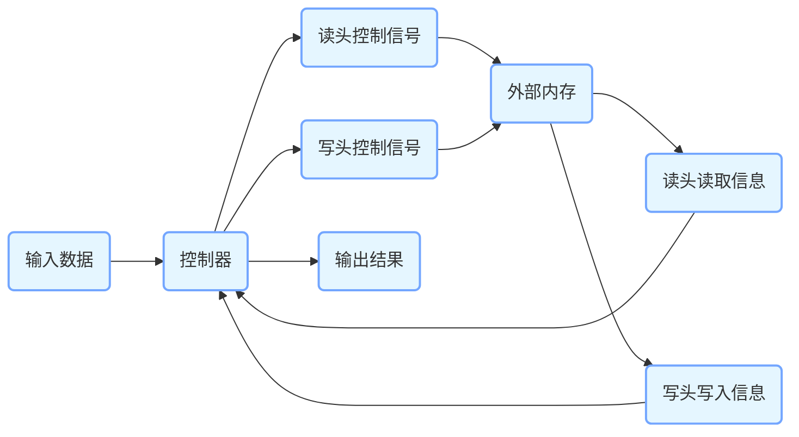

# 神经图灵机在程序化逻辑推理中的突破性应用

> 关键词：神经图灵机、程序化逻辑推理、深度学习、内存机制、推理算法

> 摘要：本文聚焦于神经图灵机在程序化逻辑推理中的突破性应用。首先介绍了神经图灵机和程序化逻辑推理的背景知识，深入剖析神经图灵机的核心概念、架构及工作原理。详细阐述其核心算法原理，给出Python代码示例，并结合数学模型和公式进行解释。通过项目实战展示神经图灵机在程序化逻辑推理中的具体实现和代码解读。探讨了其在多个实际场景中的应用，同时推荐了相关的学习资源、开发工具和论文著作。最后总结神经图灵机的未来发展趋势与挑战，解答常见问题并提供扩展阅读和参考资料，旨在为读者全面呈现神经图灵机在程序化逻辑推理领域的重要价值和应用潜力。

## 1. 背景介绍 
### 1.1 目的和范围
本文章旨在深入探讨神经图灵机在程序化逻辑推理中的突破性应用。随着人工智能技术的不断发展，传统的深度学习模型在处理复杂逻辑推理任务时面临诸多挑战。神经图灵机作为一种新兴的模型，结合了神经网络和图灵机的特性，为解决程序化逻辑推理问题提供了新的思路和方法。本文将详细介绍神经图灵机的原理、算法以及在实际推理任务中的应用，通过理论分析和代码实践，帮助读者全面理解神经图灵机在该领域的应用价值和潜力。

### 1.2 预期读者
本文的预期读者包括人工智能领域的研究人员、开发者、学生以及对神经图灵机和程序化逻辑推理感兴趣的技术爱好者。无论你是对深度学习有一定基础的专业人士，还是刚刚涉足人工智能领域的初学者，都可以从本文中获取有价值的信息。对于研究人员，本文可以为其进一步探索神经图灵机的应用提供参考；对于开发者，能够帮助他们将神经图灵机应用到实际项目中；对于学生和技术爱好者，本文将为他们打开一扇了解新兴技术的窗口。

### 1.3 文档结构概述
本文将按照以下结构进行组织：
1. **背景介绍**：介绍文章的目的、预期读者、文档结构概述以及相关术语表。
2. **核心概念与联系**：详细解释神经图灵机和程序化逻辑推理的核心概念，展示其原理和架构的文本示意图以及Mermaid流程图。
3. **核心算法原理 & 具体操作步骤**：阐述神经图灵机的核心算法原理，并使用Python源代码详细说明具体操作步骤。
4. **数学模型和公式 & 详细讲解 & 举例说明**：给出神经图灵机的数学模型和公式，进行详细讲解并举例说明。
5. **项目实战：代码实际案例和详细解释说明**：通过项目实战，介绍开发环境搭建、源代码详细实现和代码解读。
6. **实际应用场景**：探讨神经图灵机在程序化逻辑推理中的实际应用场景。
7. **工具和资源推荐**：推荐相关的学习资源、开发工具框架和论文著作。
8. **总结：未来发展趋势与挑战**：总结神经图灵机的未来发展趋势和面临的挑战。
9. **附录：常见问题与解答**：解答读者在学习和应用过程中可能遇到的常见问题。
10. **扩展阅读 & 参考资料**：提供扩展阅读的建议和相关参考资料。

### 1.4 术语表
#### 1.4.1 核心术语定义
- **神经图灵机（Neural Turing Machine, NTM）**：一种结合了神经网络和图灵机特性的计算模型，它引入了可读写的外部内存，使得模型能够处理更复杂的计算任务，尤其是需要长期记忆和逻辑推理的任务。
- **程序化逻辑推理**：指通过一系列预先定义的规则和算法，对给定的输入进行逻辑分析和推导，以得出合理的结论。在人工智能领域，程序化逻辑推理通常涉及到符号处理、规则匹配和逻辑运算等操作。
- **深度学习（Deep Learning）**：一种基于人工神经网络的机器学习方法，通过构建多层神经网络来自动学习数据的特征和模式，在图像识别、语音识别、自然语言处理等领域取得了显著的成果。
- **外部内存（External Memory）**：神经图灵机中的一个重要组成部分，用于存储和读取信息。与传统神经网络的内部状态不同，外部内存可以独立于神经网络进行读写操作，使得模型能够处理更复杂的信息存储和检索任务。
- **注意力机制（Attention Mechanism）**：一种在神经网络中广泛应用的技术，用于自动选择和聚焦于输入数据的重要部分。在神经图灵机中，注意力机制用于控制对外部内存的读写操作，使得模型能够根据当前任务的需要有选择地访问内存中的信息。

#### 1.4.2 相关概念解释
- **图灵机（Turing Machine）**：由英国数学家艾伦·图灵在1936年提出的一种抽象计算模型，它由一个无限长的纸带、一个读写头和一个有限状态控制器组成。图灵机可以模拟任何可计算的算法，是现代计算机科学的基础。
- **神经网络（Neural Network）**：一种模仿人类神经系统的计算模型，由大量的神经元组成。神经网络通过对输入数据进行非线性变换，自动学习数据的特征和模式，具有强大的自适应和泛化能力。
- **强化学习（Reinforcement Learning）**：一种机器学习方法，通过智能体与环境进行交互，根据环境反馈的奖励信号来学习最优的行为策略。在神经图灵机中，强化学习可以用于训练模型在程序化逻辑推理任务中做出最优的决策。

#### 1.4.3 缩略词列表
- **NTM**：Neural Turing Machine（神经图灵机）
- **RNN**：Recurrent Neural Network（循环神经网络）
- **LSTM**：Long Short-Term Memory（长短期记忆网络）
- **GRU**：Gated Recurrent Unit（门控循环单元）

## 2. 核心概念与联系 

### 神经图灵机的核心概念
神经图灵机（NTM）是一种将神经网络和图灵机的思想相结合的计算模型。传统的神经网络在处理序列数据时具有一定的局限性，尤其是在需要长期记忆和复杂逻辑推理的任务中。神经图灵机通过引入可读写的外部内存，使得模型能够像图灵机一样进行信息的存储和检索，从而增强了模型的计算能力。

神经图灵机主要由控制器（Controller）、外部内存（External Memory）和读写头（Read/Write Heads）三部分组成。控制器是一个神经网络，负责接收输入数据并生成控制信号，以指导读写头对外部内存进行读写操作。外部内存是一个二维矩阵，用于存储信息。读写头根据控制器的指令，在外部内存上进行读写操作，从而实现信息的存储和检索。

### 程序化逻辑推理的核心概念
程序化逻辑推理是指通过一系列预先定义的规则和算法，对给定的输入进行逻辑分析和推导，以得出合理的结论。在人工智能领域，程序化逻辑推理通常涉及到符号处理、规则匹配和逻辑运算等操作。例如，在专家系统中，通过将领域知识表示为一系列的规则，当输入一个问题时，系统会根据这些规则进行推理，以得出问题的答案。

程序化逻辑推理的核心在于如何将问题形式化表示，并设计合理的推理算法。传统的方法通常基于符号逻辑，如谓词逻辑、命题逻辑等。然而，这些方法在处理复杂的、不确定的信息时存在一定的局限性。近年来，随着深度学习的发展，人们开始尝试将神经网络应用于程序化逻辑推理任务中，神经图灵机就是其中的一种尝试。

### 神经图灵机与程序化逻辑推理的联系
神经图灵机为程序化逻辑推理提供了一种新的解决方案。传统的程序化逻辑推理方法通常需要手动设计规则和算法，对于复杂的问题，这一过程往往非常繁琐且容易出错。神经图灵机通过引入外部内存和注意力机制，能够自动学习和记忆推理过程中的中间结果，从而实现更复杂的逻辑推理任务。

在程序化逻辑推理任务中，神经图灵机可以将输入的问题编码为向量表示，然后通过控制器生成控制信号，指导读写头在外部内存上进行读写操作。在推理过程中，模型可以根据当前的状态和历史信息，有选择地访问外部内存中的信息，从而实现信息的复用和推理的迭代。通过不断地训练，神经图灵机可以学习到有效的推理策略，提高推理的准确性和效率。

### 核心概念原理和架构的文本示意图
```plaintext
+-------------------+
|   输入数据        |
+-------------------+
        |
        v
+-------------------+
|   控制器 (神经网络) |
+-------------------+
        |
        +------> 读头控制信号
        |
        +------> 写头控制信号
        |
        v
+-------------------+
|   外部内存 (二维矩阵) |
+-------------------+
        ^
        |
        +------< 读头读取信息
        |
        +------< 写头写入信息
        |
        v
+-------------------+
|   输出结果        |
+-------------------+
```

### Mermaid 流程图


## 3. 核心算法原理 & 具体操作步骤 

### 核心算法原理
神经图灵机的核心算法主要包括控制器的设计、读写头的操作和外部内存的管理。

#### 控制器
控制器通常是一个循环神经网络（RNN），如长短期记忆网络（LSTM）或门控循环单元（GRU）。控制器接收输入数据，并生成控制信号，用于指导读写头的操作。控制信号包括读头的权重分布、写头的权重分布、写头的添加向量和擦除向量等。

#### 读写头
读头和写头根据控制器生成的控制信号，在外部内存上进行读写操作。读头通过计算与外部内存中每个位置的相似度，得到一个权重分布，然后根据这个权重分布对外部内存中的信息进行加权求和，得到读取的信息。写头首先根据控制信号生成一个擦除向量，用于擦除外部内存中指定位置的信息，然后生成一个添加向量，用于在指定位置添加新的信息。

#### 外部内存
外部内存是一个二维矩阵，用于存储信息。在每个时间步，读写头根据控制信号对外部内存进行读写操作，从而更新外部内存的状态。

### 具体操作步骤
以下是神经图灵机在一个时间步的具体操作步骤：

1. **输入数据**：接收当前时间步的输入数据 $x_t$。
2. **控制器计算**：将输入数据 $x_t$ 和上一个时间步的隐藏状态 $h_{t-1}$ 输入到控制器中，得到当前时间步的隐藏状态 $h_t$。
3. **生成控制信号**：根据当前时间步的隐藏状态 $h_t$，生成读头的权重分布 $w^r_t$、写头的权重分布 $w^w_t$、写头的添加向量 $a_t$ 和擦除向量 $e_t$。
4. **读头操作**：根据读头的权重分布 $w^r_t$，对外部内存 $M_{t-1}$ 进行读取操作，得到读取的信息 $r_t$。
5. **写头操作**：根据写头的权重分布 $w^w_t$、添加向量 $a_t$ 和擦除向量 $e_t$，对外部内存 $M_{t-1}$ 进行写入操作，得到更新后的外部内存 $M_t$。
6. **输出结果**：根据当前时间步的隐藏状态 $h_t$ 和读取的信息 $r_t$，生成输出结果 $y_t$。

### Python源代码详细阐述
以下是一个简化的神经图灵机的Python实现：

```python
import torch
import torch.nn as nn
import torch.nn.functional as F

class NeuralTuringMachine(nn.Module):
    def __init__(self, input_size, output_size, hidden_size, memory_size, memory_length):
        super(NeuralTuringMachine, self).__init__()
        self.input_size = input_size
        self.output_size = output_size
        self.hidden_size = hidden_size
        self.memory_size = memory_size
        self.memory_length = memory_length

        # 控制器
        self.controller = nn.LSTMCell(input_size + memory_size, hidden_size)

        # 读头和写头的权重生成网络
        self.read_head = nn.Linear(hidden_size, memory_length)
        self.write_head = nn.Linear(hidden_size, memory_length)
        self.add_vector = nn.Linear(hidden_size, memory_size)
        self.erase_vector = nn.Linear(hidden_size, memory_size)

        # 输出层
        self.output_layer = nn.Linear(hidden_size + memory_size, output_size)

    def forward(self, x, h_prev, c_prev, M_prev):
        # 步骤1: 输入数据
        r_prev = torch.sum(M_prev * F.softmax(self.read_head(h_prev), dim=1).unsqueeze(-1), dim=1)

        # 步骤2: 控制器计算
        input_concat = torch.cat([x, r_prev], dim=1)
        h, c = self.controller(input_concat, (h_prev, c_prev))

        # 步骤3: 生成控制信号
        w_r = F.softmax(self.read_head(h), dim=1)
        w_w = F.softmax(self.write_head(h), dim=1)
        a = torch.sigmoid(self.add_vector(h))
        e = torch.sigmoid(self.erase_vector(h))

        # 步骤4: 读头操作
        r = torch.sum(M_prev * w_r.unsqueeze(-1), dim=1)

        # 步骤5: 写头操作
        M_erase = M_prev * (1 - w_w.unsqueeze(-1) * e.unsqueeze(1))
        M = M_erase + w_w.unsqueeze(-1) * a.unsqueeze(1)

        # 步骤6: 输出结果
        output_concat = torch.cat([h, r], dim=1)
        y = self.output_layer(output_concat)

        return y, h, c, M

# 示例使用
input_size = 10
output_size = 5
hidden_size = 20
memory_size = 15
memory_length = 25

ntm = NeuralTuringMachine(input_size, output_size, hidden_size, memory_size, memory_length)

x = torch.randn(1, input_size)
h_prev = torch.zeros(1, hidden_size)
c_prev = torch.zeros(1, hidden_size)
M_prev = torch.randn(1, memory_length, memory_size)

y, h, c, M = ntm(x, h_prev, c_prev, M_prev)
print("Output:", y)
```

在上述代码中，我们定义了一个 `NeuralTuringMachine` 类，继承自 `nn.Module`。在 `__init__` 方法中，我们初始化了控制器、读头和写头的权重生成网络以及输出层。在 `forward` 方法中，我们实现了神经图灵机在一个时间步的具体操作步骤。最后，我们给出了一个示例使用，展示了如何调用神经图灵机进行前向传播。

## 4. 数学模型和公式 & 详细讲解 & 举例说明 

### 数学模型和公式
#### 控制器
控制器通常是一个循环神经网络，如LSTM或GRU。以LSTM为例，控制器的计算公式如下：

$$
\begin{aligned}
i_t &= \sigma(W_{ii}x_t + W_{hi}h_{t-1} + b_{ii} + b_{hi}) \\
f_t &= \sigma(W_{if}x_t + W_{hf}h_{t-1} + b_{if} + b_{hf}) \\
o_t &= \sigma(W_{io}x_t + W_{ho}h_{t-1} + b_{io} + b_{ho}) \\
g_t &= \tanh(W_{ig}x_t + W_{hg}h_{t-1} + b_{ig} + b_{hg}) \\
c_t &= f_t \odot c_{t-1} + i_t \odot g_t \\
h_t &= o_t \odot \tanh(c_t)
\end{aligned}
$$

其中，$x_t$ 是输入数据，$h_{t-1}$ 和 $c_{t-1}$ 分别是上一个时间步的隐藏状态和细胞状态，$i_t$、$f_t$、$o_t$ 分别是输入门、遗忘门和输出门，$g_t$ 是候选细胞状态，$W$ 和 $b$ 是权重和偏置，$\sigma$ 是 sigmoid 函数，$\tanh$ 是双曲正切函数，$\odot$ 是逐元素相乘。

#### 读头
读头的权重分布计算公式如下：

$$
w^r_t = \text{softmax}(W_{r}h_t + b_{r})
$$

其中，$W_{r}$ 和 $b_{r}$ 是读头的权重和偏置，$h_t$ 是当前时间步的隐藏状态。读取的信息计算公式如下：

$$
r_t = \sum_{i=1}^{N} w^r_{t,i} M_{t-1,i}
$$

其中，$N$ 是外部内存的长度，$w^r_{t,i}$ 是读头在第 $i$ 个位置的权重，$M_{t-1,i}$ 是外部内存中第 $i$ 个位置的信息。

#### 写头
写头的权重分布计算公式如下：

$$
w^w_t = \text{softmax}(W_{w}h_t + b_{w})
$$

其中，$W_{w}$ 和 $b_{w}$ 是写头的权重和偏置。写头的擦除向量和添加向量计算公式如下：

$$
e_t = \sigma(W_{e}h_t + b_{e})
$$

$$
a_t = \sigma(W_{a}h_t + b_{a})
$$

其中，$W_{e}$、$b_{e}$、$W_{a}$ 和 $b_{a}$ 分别是擦除向量和添加向量的权重和偏置。更新后的外部内存计算公式如下：

$$
M_t = M_{t-1} \odot (1 - w^w_t \odot e_t) + w^w_t \odot a_t
$$

#### 输出层
输出层的计算公式如下：

$$
y_t = W_{y}[h_t; r_t] + b_{y}
$$

其中，$W_{y}$ 和 $b_{y}$ 是输出层的权重和偏置，$[h_t; r_t]$ 表示将 $h_t$ 和 $r_t$ 拼接在一起。

### 详细讲解
#### 控制器
控制器的作用是根据输入数据和上一个时间步的隐藏状态，生成当前时间步的隐藏状态。LSTM通过输入门、遗忘门和输出门的机制，能够有效地处理序列数据中的长期依赖问题。输入门控制新的输入信息是否进入细胞状态，遗忘门控制上一个时间步的细胞状态是否被保留，输出门控制当前时间步的细胞状态是否输出到隐藏状态。

#### 读头
读头通过计算与外部内存中每个位置的相似度，得到一个权重分布。这个权重分布表示读头在每个位置的注意力程度。然后，读头根据这个权重分布对外部内存中的信息进行加权求和，得到读取的信息。

#### 写头
写头首先生成一个擦除向量，用于擦除外部内存中指定位置的信息。擦除向量的每个元素取值在 $[0, 1]$ 之间，表示擦除的程度。然后，写头生成一个添加向量，用于在指定位置添加新的信息。添加向量的每个元素也取值在 $[0, 1]$ 之间，表示添加的程度。最后，写头根据权重分布将擦除向量和添加向量应用到外部内存中，更新外部内存的状态。

#### 输出层
输出层将当前时间步的隐藏状态和读取的信息拼接在一起，通过一个线性变换得到输出结果。

### 举例说明
假设我们有一个神经图灵机，输入数据 $x_t$ 是一个长度为 10 的向量，外部内存 $M_{t-1}$ 是一个 $25 \times 15$ 的矩阵，控制器的隐藏状态 $h_t$ 是一个长度为 20 的向量。

#### 读头操作
读头根据隐藏状态 $h_t$ 生成一个长度为 25 的权重分布 $w^r_t$。假设 $w^r_t$ 的值如下：

$$
w^r_t = [0.1, 0.2, 0.3, \cdots, 0.05]
$$

然后，读头根据这个权重分布对外部内存 $M_{t-1}$ 进行加权求和，得到读取的信息 $r_t$：

$$
r_t = 0.1 \times M_{t-1,1} + 0.2 \times M_{t-1,2} + 0.3 \times M_{t-1,3} + \cdots + 0.05 \times M_{t-1,25}
$$

#### 写头操作
写头根据隐藏状态 $h_t$ 生成一个长度为 25 的权重分布 $w^w_t$、一个长度为 15 的擦除向量 $e_t$ 和一个长度为 15 的添加向量 $a_t$。假设 $w^w_t$、$e_t$ 和 $a_t$ 的值如下：

$$
w^w_t = [0.2, 0.3, 0.1, \cdots, 0.08]
$$

$$
e_t = [0.8, 0.7, 0.6, \cdots, 0.9]
$$

$$
a_t = [0.1, 0.2, 0.3, \cdots, 0.4]
$$

首先，写头根据擦除向量 $e_t$ 对外部内存 $M_{t-1}$ 进行擦除操作：

$$
M_{erase} = M_{t-1} \odot (1 - w^w_t \odot e_t)
$$

然后，写头根据添加向量 $a_t$ 在擦除后的外部内存 $M_{erase}$ 上添加新的信息：

$$
M_t = M_{erase} + w^w_t \odot a_t
$$

#### 输出层操作
输出层将当前时间步的隐藏状态 $h_t$ 和读取的信息 $r_t$ 拼接在一起，通过一个线性变换得到输出结果 $y_t$。假设 $h_t$ 和 $r_t$ 的拼接结果是一个长度为 35 的向量，输出层的权重矩阵 $W_{y}$ 是一个 $5 \times 35$ 的矩阵，偏置向量 $b_{y}$ 是一个长度为 5 的向量。则输出结果 $y_t$ 的计算公式如下：

$$
y_t = W_{y}[h_t; r_t] + b_{y}
$$

## 5. 项目实战：代码实际案例和详细解释说明 

### 5.1  开发环境搭建
#### 操作系统
本项目可以在 Windows、Linux 或 macOS 操作系统上进行开发。建议使用 Linux 系统，因为它在深度学习开发中具有更好的稳定性和兼容性。

#### Python 环境
本项目使用 Python 3.7 及以上版本。可以使用 Anaconda 来管理 Python 环境，以下是创建和激活虚拟环境的步骤：

```bash
# 创建虚拟环境
conda create -n ntm_env python=3.8

# 激活虚拟环境
conda activate ntm_env
```

#### 深度学习框架
本项目使用 PyTorch 作为深度学习框架。可以使用以下命令安装 PyTorch：

```bash
# 根据自己的 CUDA 版本选择合适的安装命令
# 安装 CPU 版本
pip install torch torchvision torchaudio

# 安装 CUDA 版本
pip install torch torchvision torchaudio --extra-index-url https://download.pytorch.org/whl/cu113
```

#### 其他依赖库
还需要安装一些其他的依赖库，如 `numpy`、`matplotlib` 等：

```bash
pip install numpy matplotlib
```

### 5.2  源代码详细实现和代码解读
以下是一个完整的神经图灵机在程序化逻辑推理任务中的代码实现：

```python
import torch
import torch.nn as nn
import torch.optim as optim
import numpy as np
import matplotlib.pyplot as plt

# 定义神经图灵机模型
class NeuralTuringMachine(nn.Module):
    def __init__(self, input_size, output_size, hidden_size, memory_size, memory_length):
        super(NeuralTuringMachine, self).__init__()
        self.input_size = input_size
        self.output_size = output_size
        self.hidden_size = hidden_size
        self.memory_size = memory_size
        self.memory_length = memory_length

        # 控制器
        self.controller = nn.LSTMCell(input_size + memory_size, hidden_size)

        # 读头和写头的权重生成网络
        self.read_head = nn.Linear(hidden_size, memory_length)
        self.write_head = nn.Linear(hidden_size, memory_length)
        self.add_vector = nn.Linear(hidden_size, memory_size)
        self.erase_vector = nn.Linear(hidden_size, memory_size)

        # 输出层
        self.output_layer = nn.Linear(hidden_size + memory_size, output_size)

    def forward(self, x, h_prev, c_prev, M_prev):
        # 步骤1: 输入数据
        r_prev = torch.sum(M_prev * torch.softmax(self.read_head(h_prev), dim=1).unsqueeze(-1), dim=1)

        # 步骤2: 控制器计算
        input_concat = torch.cat([x, r_prev], dim=1)
        h, c = self.controller(input_concat, (h_prev, c_prev))

        # 步骤3: 生成控制信号
        w_r = torch.softmax(self.read_head(h), dim=1)
        w_w = torch.softmax(self.write_head(h), dim=1)
        a = torch.sigmoid(self.add_vector(h))
        e = torch.sigmoid(self.erase_vector(h))

        # 步骤4: 读头操作
        r = torch.sum(M_prev * w_r.unsqueeze(-1), dim=1)

        # 步骤5: 写头操作
        M_erase = M_prev * (1 - w_w.unsqueeze(-1) * e.unsqueeze(1))
        M = M_erase + w_w.unsqueeze(-1) * a.unsqueeze(1)

        # 步骤6: 输出结果
        output_concat = torch.cat([h, r], dim=1)
        y = self.output_layer(output_concat)

        return y, h, c, M

# 生成训练数据
def generate_data(batch_size, seq_length, input_size):
    inputs = torch.randn(batch_size, seq_length, input_size)
    targets = torch.randn(batch_size, seq_length, input_size)
    return inputs, targets

# 训练模型
def train_model(model, optimizer, criterion, num_epochs, batch_size, seq_length, input_size):
    losses = []
    for epoch in range(num_epochs):
        inputs, targets = generate_data(batch_size, seq_length, input_size)
        h = torch.zeros(batch_size, model.hidden_size)
        c = torch.zeros(batch_size, model.hidden_size)
        M = torch.randn(batch_size, model.memory_length, model.memory_size)

        optimizer.zero_grad()
        total_loss = 0
        for t in range(seq_length):
            x = inputs[:, t, :]
            y, h, c, M = model(x, h, c, M)
            loss = criterion(y, targets[:, t, :])
            total_loss += loss

        total_loss.backward()
        optimizer.step()
        losses.append(total_loss.item())

        if (epoch + 1) % 10 == 0:
            print(f'Epoch {epoch + 1}/{num_epochs}, Loss: {total_loss.item()}')

    return losses

# 主函数
if __name__ == '__main__':
    input_size = 10
    output_size = 10
    hidden_size = 20
    memory_size = 15
    memory_length = 25
    batch_size = 32
    seq_length = 20
    num_epochs = 100

    model = NeuralTuringMachine(input_size, output_size, hidden_size, memory_size, memory_length)
    optimizer = optim.Adam(model.parameters(), lr=0.001)
    criterion = nn.MSELoss()

    losses = train_model(model, optimizer, criterion, num_epochs, batch_size, seq_length, input_size)

    # 绘制损失曲线
    plt.plot(losses)
    plt.xlabel('Epoch')
    plt.ylabel('Loss')
    plt.title('Training Loss')
    plt.show()
```

### 代码解读与分析
#### 神经图灵机模型定义
`NeuralTuringMachine` 类继承自 `nn.Module`，定义了神经图灵机的结构和前向传播过程。在 `__init__` 方法中，我们初始化了控制器、读头和写头的权重生成网络以及输出层。在 `forward` 方法中，我们实现了神经图灵机在一个时间步的具体操作步骤，包括输入数据处理、控制器计算、控制信号生成、读写头操作和输出结果生成。

#### 训练数据生成
`generate_data` 函数用于生成训练数据。在这个示例中，我们简单地生成了随机的输入数据和目标数据。在实际应用中，需要根据具体的任务生成合适的训练数据。

#### 训练模型
`train_model` 函数用于训练神经图灵机模型。在每个 epoch 中，我们生成一批训练数据，初始化隐藏状态、细胞状态和外部内存。然后，我们对每个时间步进行前向传播和反向传播，更新模型的参数。最后，我们记录每个 epoch 的损失值，并在每 10 个 epoch 打印一次损失值。

#### 主函数
在主函数中，我们定义了模型的参数，创建了神经图灵机模型、优化器和损失函数。然后，我们调用 `train_model` 函数进行模型训练，并绘制训练损失曲线。

## 6. 实际应用场景 
### 自然语言处理
在自然语言处理领域，神经图灵机可以用于解决复杂的逻辑推理任务，如问答系统、文本蕴含识别等。在问答系统中，神经图灵机可以将问题和文本信息存储在外部内存中，通过不断地推理和查询内存中的信息，找到问题的答案。在文本蕴含识别任务中，神经图灵机可以分析两个文本之间的逻辑关系，判断一个文本是否蕴含另一个文本。

### 智能规划
在智能规划领域，神经图灵机可以用于解决机器人路径规划、任务调度等问题。在机器人路径规划中，神经图灵机可以将地图信息和机器人的当前状态存储在外部内存中，通过推理和搜索，找到最优的路径。在任务调度中，神经图灵机可以根据任务的优先级和资源限制，合理地分配任务，提高任务执行的效率。

### 程序合成
在程序合成领域，神经图灵机可以用于自动生成程序代码。神经图灵机可以将程序的输入输出规范和已知的代码片段存储在外部内存中，通过推理和组合，生成符合要求的程序代码。这种方法可以大大提高程序开发的效率，减少人工编写代码的工作量。

### 知识图谱推理
在知识图谱推理领域，神经图灵机可以用于推断知识图谱中缺失的关系和实体。神经图灵机可以将知识图谱中的实体和关系存储在外部内存中，通过推理和查询内存中的信息，找到潜在的关系和实体。这种方法可以帮助知识图谱不断地扩展和完善，提高知识图谱的应用价值。

## 7. 工具和资源推荐
### 7.1 学习资源推荐
#### 7.1.1 书籍推荐
- 《深度学习》（Deep Learning）：由 Ian Goodfellow、Yoshua Bengio 和 Aaron Courville 所著，是深度学习领域的经典教材，涵盖了深度学习的基本概念、算法和应用。
- 《Python深度学习》（Deep Learning with Python）：由 Francois Chollet 所著，介绍了如何使用 Python 和 Keras 进行深度学习开发，适合初学者入门。
- 《人工智能：一种现代的方法》（Artificial Intelligence: A Modern Approach）：由 Stuart Russell 和 Peter Norvig 所著，是人工智能领域的权威教材，涵盖了人工智能的各个方面，包括逻辑推理、机器学习、自然语言处理等。

#### 7.1.2 在线课程
- Coursera 上的“深度学习专项课程”（Deep Learning Specialization）：由 Andrew Ng 教授授课，包括深度学习基础、卷积神经网络、循环神经网络等内容，是学习深度学习的优质课程。
- edX 上的“强化学习基础”（Fundamentals of Reinforcement Learning）：介绍了强化学习的基本概念、算法和应用，适合对强化学习感兴趣的读者。
- 哔哩哔哩（B 站）上有很多关于深度学习和神经图灵机的教学视频，可以根据自己的需求进行搜索和学习。

#### 7.1.3 技术博客和网站
- Medium 上有很多关于人工智能和深度学习的技术博客，如 Towards Data Science、AI in Plain English 等，可以关注这些博客，获取最新的技术动态和研究成果。
- arXiv 是一个预印本平台，上面有很多关于神经图灵机和程序化逻辑推理的研究论文，可以及时了解该领域的最新研究进展。
- GitHub 上有很多开源的神经图灵机实现代码和相关项目，可以参考这些代码进行学习和实践。

### 7.2 开发工具框架推荐
#### 7.2.1 IDE和编辑器
- PyCharm：是一款专门为 Python 开发设计的集成开发环境（IDE），具有代码编辑、调试、版本控制等功能，非常适合深度学习开发。
- Jupyter Notebook：是一个交互式的开发环境，可以在浏览器中编写和运行代码，同时可以展示代码的运行结果和可视化图表，方便进行数据分析和模型调试。
- Visual Studio Code：是一款轻量级的代码编辑器，支持多种编程语言和插件扩展，具有丰富的代码编辑和调试功能。

#### 7.2.2 调试和性能分析工具
- PyTorch Profiler：是 PyTorch 自带的性能分析工具，可以帮助开发者分析模型的运行时间、内存使用情况等，找出性能瓶颈并进行优化。
- TensorBoard：是 TensorFlow 提供的可视化工具，也可以与 PyTorch 结合使用，用于可视化模型的训练过程、损失曲线、参数分布等信息。
- NVIDIA Nsight Systems：是 NVIDIA 提供的性能分析工具，可以帮助开发者分析 GPU 程序的性能，找出 GPU 计算的瓶颈并进行优化。

#### 7.2.3 相关框架和库
- PyTorch：是一个开源的深度学习框架，具有动态图和静态图两种编程方式，支持多种深度学习模型和算法，是深度学习开发的首选框架之一。
- NumPy：是 Python 中用于科学计算的基础库，提供了高效的多维数组对象和各种数学函数，是深度学习开发中必不可少的工具。
- Matplotlib：是 Python 中用于数据可视化的库，可以绘制各种类型的图表，如折线图、柱状图、散点图等，方便开发者对模型的训练结果进行可视化分析。

### 7.3 相关论文著作推荐
#### 7.3.1 经典论文
- Graves, A., Wayne, G., & Danihelka, I. (2014). Neural Turing Machines. arXiv preprint arXiv:1410.5401. 这是神经图灵机的开创性论文，详细介绍了神经图灵机的结构和算法。
- Sukhbaatar, S., Weston, J., & Fergus, R. (2015). End-To-End Memory Networks. In Advances in neural information processing systems (pp. 2440-2448). 这篇论文提出了端到端的记忆网络，为神经图灵机的发展提供了重要的思路。

#### 7.3.2 最新研究成果
可以关注 arXiv 上的最新研究论文，了解神经图灵机在程序化逻辑推理领域的最新研究进展。例如，一些研究致力于改进神经图灵机的结构和算法，提高其在复杂推理任务中的性能；另一些研究则将神经图灵机应用于新的领域，如医疗诊断、金融预测等。

#### 7.3.3 应用案例分析
可以参考一些学术会议和期刊上的应用案例分析论文，了解神经图灵机在实际项目中的应用情况和效果。例如，在自然语言处理领域，一些论文介绍了神经图灵机在问答系统、文本生成等任务中的应用；在智能规划领域，一些论文介绍了神经图灵机在机器人路径规划、任务调度等任务中的应用。

## 8. 总结：未来发展趋势与挑战
### 未来发展趋势
#### 模型结构优化
未来的研究可能会致力于优化神经图灵机的模型结构，提高其计算效率和表达能力。例如，引入更复杂的注意力机制、改进控制器的设计等，以更好地处理复杂的逻辑推理任务。

#### 与其他技术融合
神经图灵机可能会与其他人工智能技术，如强化学习、知识图谱、迁移学习等进行融合，以实现更强大的智能系统。例如，将神经图灵机与强化学习相结合，让模型在与环境的交互中学习最优的推理策略；将神经图灵机与知识图谱相结合，利用知识图谱中的先验知识提高推理的准确性。

#### 应用领域拓展
随着技术的不断发展，神经图灵机的应用领域将不断拓展。除了自然语言处理、智能规划、程序合成等领域，神经图灵机还可能应用于医疗、金融、交通等更多领域，为这些领域的决策和推理提供支持。

### 面临的挑战
#### 计算资源需求大
神经图灵机的训练和推理过程需要大量的计算资源，尤其是在处理大规模数据和复杂任务时。这限制了神经图灵机的应用范围和可扩展性。未来需要研究更高效的算法和硬件加速技术，以降低计算资源的需求。

#### 可解释性问题
神经图灵机作为一种深度学习模型，其推理过程往往是黑盒的，难以解释模型的决策依据。在一些对可解释性要求较高的领域，如医疗诊断、金融风控等，这是一个亟待解决的问题。未来需要研究如何提高神经图灵机的可解释性，让模型的决策过程更加透明。

#### 数据质量和标注问题
神经图灵机的性能很大程度上依赖于训练数据的质量和标注的准确性。在实际应用中，获取高质量的标注数据往往是一个挑战。未来需要研究如何利用无监督学习、半监督学习等技术，减少对标注数据的依赖，提高模型的泛化能力。

## 9. 附录：常见问题与解答
### 问题1：神经图灵机与传统神经网络有什么区别？
神经图灵机与传统神经网络的主要区别在于引入了可读写的外部内存。传统神经网络的信息存储和处理主要依赖于网络的内部状态，对于需要长期记忆和复杂逻辑推理的任务，处理能力有限。神经图灵机通过外部内存，可以存储和检索更多的信息，从而实现更复杂的计算任务。

### 问题2：神经图灵机的训练难度大吗？
神经图灵机的训练难度相对较大。一方面，神经图灵机的模型结构复杂，参数较多，训练过程需要大量的计算资源和时间。另一方面，神经图灵机的训练需要设计合适的损失函数和优化算法，以确保模型能够学习到有效的推理策略。

### 问题3：神经图灵机可以应用于哪些具体的任务？
神经图灵机可以应用于多种需要逻辑推理的任务，如自然语言处理中的问答系统、文本蕴含识别，智能规划中的机器人路径规划、任务调度，程序合成中的自动代码生成，知识图谱推理中的关系推断等。

### 问题4：如何评估神经图灵机的性能？
评估神经图灵机的性能可以从多个方面进行，如准确率、召回率、F1 值等。对于不同的任务，还可以根据具体的需求设计相应的评估指标。例如，在问答系统中，可以使用答案的准确率和召回率来评估模型的性能；在程序合成中，可以使用生成代码的正确性和效率来评估模型的性能。

### 问题5：神经图灵机的可扩展性如何？
神经图灵机的可扩展性受到计算资源和模型复杂度的限制。在处理大规模数据和复杂任务时，神经图灵机的训练和推理过程需要大量的计算资源，这可能导致模型的训练时间过长或无法在实际应用中部署。未来需要研究更高效的算法和硬件加速技术，以提高神经图灵机的可扩展性。

## 10. 扩展阅读 & 参考资料
### 扩展阅读
- 阅读更多关于深度学习和人工智能的书籍和论文，深入了解相关领域的技术和方法。
- 关注人工智能领域的学术会议和研讨会，如 NeurIPS、ICML、CVPR 等，了解最新的研究动态和成果。
- 参与开源项目和社区，与其他开发者和研究人员交流经验和想法。

### 参考资料
- Graves, A., Wayne, G., & Danihelka, I. (2014). Neural Turing Machines. arXiv preprint arXiv:1410.5401.
- Sukhbaatar, S., Weston, J., & Fergus, R. (2015). End-To-End Memory Networks. In Advances in neural information processing systems (pp. 2440-2448).
- Goodfellow, I., Bengio, Y., & Courville, A. (2016). Deep Learning. MIT press.
- Chollet, F. (2017). Deep Learning with Python. Manning Publications.
- Russell, S. J., & Norvig, P. (2016). Artificial Intelligence: A Modern Approach. Pearson.

作者：AI天才研究院/AI Genius Institute & 禅与计算机程序设计艺术 /Zen And The Art of Computer Programming