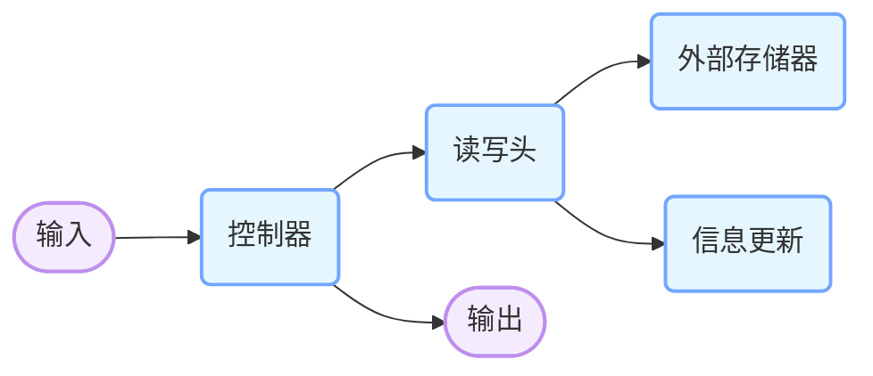

# 神经图灵机在自动化程序修复中的应用

> 关键词：神经图灵机、自动化程序修复、深度学习、程序分析、代码生成

> 摘要：本文深入探讨了神经图灵机在自动化程序修复中的应用。首先介绍了相关背景知识，包括研究目的、预期读者、文档结构和术语表。接着阐述了神经图灵机和自动化程序修复的核心概念及其联系，通过文本示意图和Mermaid流程图进行清晰展示。详细讲解了神经图灵机的核心算法原理，并用Python代码进行说明。同时给出了相关的数学模型和公式，并举例解释。通过项目实战，展示了在自动化程序修复中应用神经图灵机的具体实现步骤和代码解读。分析了其实际应用场景，推荐了学习资源、开发工具框架和相关论文著作。最后总结了未来发展趋势与挑战，并提供常见问题解答和扩展阅读参考资料。

## 1. 背景介绍 
### 1.1 目的和范围
自动化程序修复旨在通过计算机自动检测和修复程序中的错误，提高软件开发的效率和质量。传统的程序修复方法往往依赖于手动编写规则或特定的修复模式，难以处理复杂多变的程序错误。神经图灵机（Neural Turing Machine, NTM）作为一种具有可微分外部存储器的神经网络模型，具备强大的记忆和推理能力，为自动化程序修复提供了新的思路和方法。本文的目的是深入研究神经图灵机在自动化程序修复中的应用，探讨其原理、算法和实际应用效果，为相关领域的研究和实践提供参考。

本文的范围主要涵盖神经图灵机的基本原理、在自动化程序修复中的应用机制、相关算法和实现步骤，以及实际应用场景和未来发展趋势等方面。

### 1.2 预期读者
本文预期读者包括计算机科学领域的研究人员、软件开发工程师、人工智能爱好者等。对于希望了解神经图灵机和自动化程序修复相关技术的人员，本文将提供系统的知识和实践指导。

### 1.3 文档结构概述
本文将按照以下结构进行组织：
- 核心概念与联系：介绍神经图灵机和自动化程序修复的核心概念，以及它们之间的联系。
- 核心算法原理 & 具体操作步骤：详细讲解神经图灵机的核心算法原理，并给出具体的操作步骤和Python代码实现。
- 数学模型和公式 & 详细讲解 & 举例说明：给出神经图灵机和自动化程序修复相关的数学模型和公式，并进行详细讲解和举例说明。
- 项目实战：代码实际案例和详细解释说明：通过一个实际的项目案例，展示神经图灵机在自动化程序修复中的具体实现和代码解读。
- 实际应用场景：分析神经图灵机在自动化程序修复中的实际应用场景。
- 工具和资源推荐：推荐相关的学习资源、开发工具框架和论文著作。
- 总结：未来发展趋势与挑战：总结神经图灵机在自动化程序修复中的发展趋势和面临的挑战。
- 附录：常见问题与解答：提供常见问题的解答。
- 扩展阅读 & 参考资料：提供扩展阅读的建议和参考资料。

### 1.4 术语表
#### 1.4.1 核心术语定义
- **神经图灵机（Neural Turing Machine, NTM）**：一种具有可微分外部存储器的神经网络模型，结合了神经网络的学习能力和图灵机的计算能力。
- **自动化程序修复（Automated Program Repair, APR）**：通过计算机自动检测和修复程序中的错误。
- **程序分析（Program Analysis）**：对程序的语法、语义和行为进行分析，以发现程序中的错误和缺陷。
- **代码生成（Code Generation）**：根据给定的规范或需求，自动生成符合要求的代码。

#### 1.4.2 相关概念解释
- **可微分外部存储器**：神经图灵机中的外部存储器可以通过可微分的操作进行读写，使得神经网络能够学习如何有效地利用存储器中的信息。
- **注意力机制**：神经图灵机中使用的一种机制，用于在外部存储器中选择和聚焦于相关的信息。
- **程序补丁**：用于修复程序错误的代码片段。

#### 1.4.3 缩略词列表
- **NTM**：神经图灵机（Neural Turing Machine）
- **APR**：自动化程序修复（Automated Program Repair）

## 2. 核心概念与联系 

### 神经图灵机核心概念
神经图灵机是由Alex Graves等人在2014年提出的一种神经网络扩展模型。它主要由控制器（Controller）、外部存储器（External Memory）和读写头（Read/Write Heads）组成。

控制器通常是一个循环神经网络（如LSTM或GRU），负责接收输入并生成控制信号。外部存储器是一个二维矩阵，用于存储信息。读写头根据控制器生成的控制信号对外部存储器进行读写操作。

#### 文本示意图
神经图灵机的结构可以用以下文本描述：

```
输入 ---> 控制器 ---> 读写头 ---> 外部存储器
        |                |
        V                V
      输出             信息更新
```

#### Mermaid流程图


### 自动化程序修复核心概念
自动化程序修复的目标是自动检测程序中的错误，并生成合适的补丁来修复这些错误。它通常涉及程序分析、错误定位和代码生成等步骤。

程序分析用于理解程序的结构和行为，找出可能存在错误的位置。错误定位则进一步确定具体的错误点。代码生成根据错误信息和程序上下文，生成能够修复错误的代码补丁。

### 两者的联系
神经图灵机在自动化程序修复中的应用主要体现在以下几个方面：
- **记忆能力**：神经图灵机的外部存储器可以存储程序的历史信息和上下文，帮助模型更好地理解程序的结构和语义，从而更准确地定位错误。
- **推理能力**：控制器可以根据输入和存储器中的信息进行推理，生成合适的修复策略。
- **代码生成**：神经图灵机可以学习程序的语法和语义模式，生成符合要求的代码补丁。

## 3. 核心算法原理 & 具体操作步骤 

### 神经图灵机核心算法原理
神经图灵机的核心算法主要包括控制器的计算、读写头的操作和外部存储器的更新。

#### 控制器计算
控制器通常是一个循环神经网络，其输入为当前时刻的输入向量 $x_t$ 和上一时刻的隐藏状态 $h_{t - 1}$，输出为当前时刻的隐藏状态 $h_t$。以LSTM为例，其计算公式如下：

输入门：
$$i_t = \sigma(W_{ii}x_t + W_{hi}h_{t - 1} + b_i)$$

遗忘门：
$$f_t = \sigma(W_{if}x_t + W_{hf}h_{t - 1} + b_f)$$

细胞状态更新：
$$\tilde{C}_t = \tanh(W_{ic}x_t + W_{hc}h_{t - 1} + b_c)$$
$$C_t = f_t \odot C_{t - 1} + i_t \odot \tilde{C}_t$$

输出门：
$$o_t = \sigma(W_{io}x_t + W_{ho}h_{t - 1} + b_o)$$
$$h_t = o_t \odot \tanh(C_t)$$

其中，$\sigma$ 是 sigmoid 函数，$\tanh$ 是双曲正切函数，$W$ 是权重矩阵，$b$ 是偏置向量，$\odot$ 表示逐元素相乘。

#### 读写头操作
读写头根据控制器的输出生成控制信号，用于对外部存储器进行读写操作。

读头操作：
读头通过注意力机制选择外部存储器中的信息。注意力权重 $w_t^r$ 计算公式如下：

$$w_t^r = \text{Softmax}(K(h_t) \cdot M_t^T)$$

其中，$K(h_t)$ 是根据控制器输出 $h_t$ 生成的查询向量，$M_t$ 是当前时刻的外部存储器。

读向量 $r_t$ 为：
$$r_t = w_t^r \cdot M_t$$

写头操作：
写头首先生成擦除向量 $e_t$ 和添加向量 $a_t$，然后更新外部存储器。

$$M_t = M_{t - 1} \odot (1 - w_t^w \otimes e_t) + w_t^w \otimes a_t$$

其中，$w_t^w$ 是写头的注意力权重，$\otimes$ 表示外积。

#### 外部存储器更新
外部存储器根据写头的操作进行更新，确保模型能够记录和利用程序的历史信息。

### 具体操作步骤及Python代码实现

```python
import torch
import torch.nn as nn
import torch.nn.functional as F

# 定义LSTM控制器
class LSTMController(nn.Module):
    def __init__(self, input_size, hidden_size):
        super(LSTMController, self).__init__()
        self.lstm = nn.LSTM(input_size, hidden_size)

    def forward(self, x, h_prev, c_prev):
        output, (h_next, c_next) = self.lstm(x.unsqueeze(0), (h_prev.unsqueeze(0), c_prev.unsqueeze(0)))
        return output.squeeze(0), h_next.squeeze(0), c_next.squeeze(0)

# 定义读头
class ReadHead(nn.Module):
    def __init__(self, hidden_size, memory_size):
        super(ReadHead, self).__init__()
        self.key = nn.Linear(hidden_size, memory_size)

    def forward(self, h, M):
        key = self.key(h)
        w = F.softmax(torch.matmul(key, M.t()), dim=1)
        r = torch.matmul(w, M)
        return r, w

# 定义写头
class WriteHead(nn.Module):
    def __init__(self, hidden_size, memory_size):
        super(WriteHead, self).__init__()
        self.key = nn.Linear(hidden_size, memory_size)
        self.erase = nn.Linear(hidden_size, memory_size)
        self.add = nn.Linear(hidden_size, memory_size)

    def forward(self, h, M):
        key = self.key(h)
        w = F.softmax(torch.matmul(key, M.t()), dim=1)
        e = torch.sigmoid(self.erase(h))
        a = self.add(h)
        M = M * (1 - torch.ger(w.squeeze(0), e.squeeze(0))) + torch.ger(w.squeeze(0), a.squeeze(0))
        return M, w

# 定义神经图灵机
class NeuralTuringMachine(nn.Module):
    def __init__(self, input_size, hidden_size, memory_size, num_cells):
        super(NeuralTuringMachine, self).__init__()
        self.controller = LSTMController(input_size, hidden_size)
        self.read_head = ReadHead(hidden_size, memory_size)
        self.write_head = WriteHead(hidden_size, memory_size)
        self.memory = torch.zeros(num_cells, memory_size)

    def forward(self, x, h_prev, c_prev):
        h, h_next, c_next = self.controller(x, h_prev, c_prev)
        r, w_r = self.read_head(h, self.memory)
        self.memory, w_w = self.write_head(h, self.memory)
        output = torch.cat([h, r], dim=1)
        return output, h_next, c_next

# 示例使用
input_size = 10
hidden_size = 20
memory_size = 15
num_cells = 5

ntm = NeuralTuringMachine(input_size, hidden_size, memory_size, num_cells)
x = torch.randn(input_size)
h_prev = torch.zeros(hidden_size)
c_prev = torch.zeros(hidden_size)

output, h_next, c_next = ntm(x, h_prev, c_prev)
print("Output shape:", output.shape)
```

## 4. 数学模型和公式 & 详细讲解 & 举例说明 

### 神经图灵机数学模型
神经图灵机的数学模型主要由控制器、读写头和外部存储器的操作组成。

#### 控制器模型
如前面所述，控制器可以用LSTM来表示。其状态更新公式为：

$$
\begin{align*}
i_t &= \sigma(W_{ii}x_t + W_{hi}h_{t - 1} + b_i)\\
f_t &= \sigma(W_{if}x_t + W_{hf}h_{t - 1} + b_f)\\
\tilde{C}_t &= \tanh(W_{ic}x_t + W_{hc}h_{t - 1} + b_c)\\
C_t &= f_t \odot C_{t - 1} + i_t \odot \tilde{C}_t\\
o_t &= \sigma(W_{io}x_t + W_{ho}h_{t - 1} + b_o)\\
h_t &= o_t \odot \tanh(C_t)
\end{align*}
$$

详细讲解：
- 输入门 $i_t$ 决定了当前输入 $x_t$ 中有多少信息要被添加到细胞状态 $C_t$ 中。
- 遗忘门 $f_t$ 决定了上一时刻的细胞状态 $C_{t - 1}$ 中有多少信息要被遗忘。
- 细胞状态更新部分通过 $\tilde{C}_t$ 计算新的候选细胞状态，并结合遗忘门和输入门的结果更新细胞状态 $C_t$。
- 输出门 $o_t$ 决定了细胞状态 $C_t$ 中有多少信息要输出到隐藏状态 $h_t$ 中。

举例说明：
假设输入向量 $x_t$ 的维度为 10，隐藏状态 $h_{t - 1}$ 的维度为 20。权重矩阵 $W_{ii}$ 的维度为 $20 \times 10$，$W_{hi}$ 的维度为 $20 \times 20$，偏置向量 $b_i$ 的维度为 20。通过上述公式，可以计算出输入门 $i_t$ 的值。

#### 读写头模型
读头的注意力权重计算公式为：

$$w_t^r = \text{Softmax}(K(h_t) \cdot M_t^T)$$

详细讲解：
- $K(h_t)$ 是根据控制器输出 $h_t$ 生成的查询向量，用于在外部存储器 $M_t$ 中查找相关信息。
- $\text{Softmax}$ 函数将查询向量与外部存储器的相似度转换为概率分布，即注意力权重 $w_t^r$。

举例说明：
假设查询向量 $K(h_t)$ 的维度为 15，外部存储器 $M_t$ 的维度为 $5 \times 15$。通过矩阵乘法和 $\text{Softmax}$ 函数，可以计算出读头的注意力权重 $w_t^r$。

写头的操作涉及擦除向量 $e_t$ 和添加向量 $a_t$，外部存储器更新公式为：

$$M_t = M_{t - 1} \odot (1 - w_t^w \otimes e_t) + w_t^w \otimes a_t$$

详细讲解：
- 擦除向量 $e_t$ 用于决定要擦除外部存储器中哪些位置的信息。
- 添加向量 $a_t$ 用于决定要在外部存储器中添加哪些信息。
- 写头的注意力权重 $w_t^w$ 决定了擦除和添加操作的位置。

举例说明：
假设擦除向量 $e_t$ 和添加向量 $a_t$ 的维度为 15，写头的注意力权重 $w_t^w$ 的维度为 5。通过外积和逐元素相乘操作，可以更新外部存储器 $M_t$。

### 自动化程序修复中的数学模型
在自动化程序修复中，神经图灵机的目标是学习从错误程序到正确程序的映射。可以将其看作一个序列到序列的学习问题，使用损失函数来衡量模型生成的修复代码与真实修复代码之间的差异。

常用的损失函数是交叉熵损失函数：

$$L = -\sum_{i = 1}^{N} y_i \log(p_i)$$

其中，$y_i$ 是真实标签，$p_i$ 是模型预测的概率。

详细讲解：
交叉熵损失函数衡量了模型预测的概率分布与真实标签的差异。当模型预测的概率分布与真实标签越接近时，损失函数的值越小。

举例说明：
假设模型要生成一个长度为 10 的代码序列，真实标签为 $y = [0, 1, 0, 1, 0, 0, 1, 0, 1, 0]$，模型预测的概率分布为 $p = [0.1, 0.8, 0.2, 0.7, 0.3, 0.2, 0.9, 0.1, 0.8, 0.2]$。通过交叉熵损失函数，可以计算出损失值。

## 5. 项目实战：代码实际案例和详细解释说明 

### 5.1  开发环境搭建
#### 操作系统
推荐使用 Linux 系统，如 Ubuntu 18.04 或更高版本。

#### Python 环境
使用 Python 3.7 或更高版本。可以使用 Anaconda 来管理 Python 环境：

```bash
wget https://repo.anaconda.com/archive/Anaconda3-2021.05-Linux-x86_64.sh
bash Anaconda3-2021.05-Linux-x86_64.sh
```

#### 安装依赖库
安装 PyTorch、NumPy 等必要的库：

```bash
conda install pytorch torchvision torchaudio cudatoolkit=11.3 -c pytorch
conda install numpy
```

### 5.2  源代码详细实现和代码解读
以下是一个简单的使用神经图灵机进行自动化程序修复的示例代码：

```python
import torch
import torch.nn as nn
import torch.optim as optim
import numpy as np

# 定义神经图灵机模型
class NeuralTuringMachine(nn.Module):
    def __init__(self, input_size, hidden_size, memory_size, num_cells):
        super(NeuralTuringMachine, self).__init__()
        self.controller = nn.LSTM(input_size, hidden_size)
        self.read_head = nn.Linear(hidden_size, memory_size)
        self.write_head = nn.Linear(hidden_size, memory_size)
        self.memory = torch.zeros(num_cells, memory_size)

    def forward(self, x, h_prev, c_prev):
        output, (h_next, c_next) = self.controller(x.unsqueeze(0), (h_prev.unsqueeze(0), c_prev.unsqueeze(0)))
        h = output.squeeze(0)
        key = self.read_head(h)
        w = torch.softmax(torch.matmul(key, self.memory.t()), dim=1)
        r = torch.matmul(w, self.memory)
        erase = torch.sigmoid(self.write_head(h))
        add = self.write_head(h)
        self.memory = self.memory * (1 - torch.ger(w.squeeze(0), erase.squeeze(0))) + torch.ger(w.squeeze(0), add.squeeze(0))
        output = torch.cat([h, r], dim=1)
        return output, h_next.squeeze(0), c_next.squeeze(0)

# 定义训练函数
def train(model, criterion, optimizer, input_data, target_data, num_epochs):
    h_prev = torch.zeros(model.controller.hidden_size)
    c_prev = torch.zeros(model.controller.hidden_size)
    for epoch in range(num_epochs):
        optimizer.zero_grad()
        loss = 0
        for i in range(len(input_data)):
            x = torch.tensor(input_data[i], dtype=torch.float32)
            y = torch.tensor(target_data[i], dtype=torch.float32)
            output, h_prev, c_prev = model(x, h_prev, c_prev)
            loss += criterion(output, y)
        loss.backward()
        optimizer.step()
        if (epoch + 1) % 10 == 0:
            print(f'Epoch [{epoch + 1}/{num_epochs}], Loss: {loss.item():.4f}')

# 生成示例数据
input_size = 10
hidden_size = 20
memory_size = 15
num_cells = 5
num_samples = 100
input_data = np.random.randn(num_samples, input_size)
target_data = np.random.randn(num_samples, hidden_size + memory_size)

# 初始化模型、损失函数和优化器
model = NeuralTuringMachine(input_size, hidden_size, memory_size, num_cells)
criterion = nn.MSELoss()
optimizer = optim.Adam(model.parameters(), lr=0.001)

# 训练模型
train(model, criterion, optimizer, input_data, target_data, num_epochs=100)
```

### 5.3  代码解读与分析
#### 模型定义
`NeuralTuringMachine` 类定义了神经图灵机模型，包括控制器、读头和写头。控制器使用 LSTM 实现，读头和写头分别是线性层。

#### 前向传播
在 `forward` 方法中，首先通过控制器计算隐藏状态 $h$，然后使用读头计算注意力权重 $w$ 和读向量 $r$。接着使用写头计算擦除向量 $erase$ 和添加向量 $add$，并更新外部存储器 $memory$。最后将隐藏状态 $h$ 和读向量 $r$ 拼接作为输出。

#### 训练函数
`train` 函数用于训练模型。在每个 epoch 中，遍历输入数据，计算输出并与目标数据计算损失。使用反向传播更新模型参数。

#### 数据生成
使用 `np.random.randn` 生成示例输入数据和目标数据。

#### 初始化和训练
初始化模型、损失函数和优化器，然后调用 `train` 函数进行训练。

## 6. 实际应用场景 
### 软件开发中的错误修复
在软件开发过程中，程序往往会存在各种错误，如语法错误、逻辑错误等。神经图灵机可以通过学习大量的程序代码和错误修复案例，自动检测和修复这些错误。例如，在一个大型的软件开发项目中，开发人员可以使用神经图灵机来快速定位和修复代码中的错误，提高开发效率。

### 代码审查辅助
代码审查是确保代码质量的重要环节。神经图灵机可以作为代码审查的辅助工具，帮助审查人员发现潜在的错误和代码缺陷。通过分析代码的结构和语义，神经图灵机可以提供可能的修复建议，减少审查人员的工作量。

### 自动化测试用例生成
自动化测试用例生成可以帮助开发人员更全面地测试程序。神经图灵机可以学习程序的输入输出关系和错误模式，生成有效的测试用例，提高测试覆盖率。例如，在一个 Web 应用程序的开发中，神经图灵机可以根据程序的功能需求生成各种不同的测试用例，确保程序在各种情况下都能正常运行。

## 7. 工具和资源推荐
### 7.1 学习资源推荐
#### 7.1.1 书籍推荐
- 《深度学习》（Deep Learning）：由 Ian Goodfellow、Yoshua Bengio 和 Aaron Courville 所著，是深度学习领域的经典教材，涵盖了神经网络、深度学习模型等方面的知识。
- 《Python深度学习》（Deep Learning with Python）：由 Francois Chollet 所著，结合 Keras 框架介绍了深度学习的基本概念和实践方法。
- 《神经网络与深度学习》：由邱锡鹏所著，系统地介绍了神经网络和深度学习的理论和算法。

#### 7.1.2 在线课程
- Coursera 上的“深度学习专项课程”（Deep Learning Specialization）：由 Andrew Ng 教授授课，包括深度学习基础、卷积神经网络、循环神经网络等内容。
- edX 上的“强化学习”（Reinforcement Learning）：介绍了强化学习的基本概念和算法。
- 哔哩哔哩上有很多关于深度学习和神经图灵机的教学视频，可以帮助初学者快速入门。

#### 7.1.3 技术博客和网站
- Medium：上面有很多关于深度学习和人工智能的技术文章，涵盖了最新的研究成果和实践经验。
- arXiv：提供了大量的学术论文，包括神经图灵机和自动化程序修复领域的研究论文。
- 机器之心：专注于人工智能领域的资讯和技术分享，有很多关于神经图灵机的解读和应用案例。

### 7.2 开发工具框架推荐
#### 7.2.1 IDE和编辑器
- PyCharm：是一款专门为 Python 开发设计的集成开发环境，提供了代码编辑、调试、版本控制等功能。
- Jupyter Notebook：是一个交互式的开发环境，适合进行数据探索和模型实验。
- Visual Studio Code：是一款轻量级的代码编辑器，支持多种编程语言和插件扩展。

#### 7.2.2 调试和性能分析工具
- PyTorch Profiler：可以帮助开发者分析 PyTorch 模型的性能瓶颈，优化代码性能。
- TensorBoard：是 TensorFlow 提供的可视化工具，也可以用于 PyTorch 模型的训练过程可视化和性能分析。
- cProfile：是 Python 自带的性能分析工具，可以分析 Python 代码的运行时间和函数调用次数。

#### 7.2.3 相关框架和库
- PyTorch：是一个开源的深度学习框架，提供了丰富的神经网络模型和工具，方便开发者进行模型开发和训练。
- TensorFlow：是另一个广泛使用的深度学习框架，具有强大的分布式训练和部署能力。
- NumPy：是 Python 中用于科学计算的基础库，提供了高效的数组操作和数学函数。

### 7.3 相关论文著作推荐
#### 7.3.1 经典论文
- "Neural Turing Machines"：由 Alex Graves 等人发表的论文，首次提出了神经图灵机的概念。
- "Automated Program Repair: A Survey"：对自动化程序修复领域进行了全面的综述，介绍了各种自动化程序修复方法和技术。
- "Learning to Program with Soft Attention over Code"：探讨了如何使用注意力机制来学习程序代码，为自动化程序修复提供了新的思路。

#### 7.3.2 最新研究成果
- 在 arXiv 上可以搜索到关于神经图灵机和自动化程序修复的最新研究论文，了解该领域的最新发展动态。
- 国际顶级会议如 NeurIPS、ICML、ICSE 等也会发表相关的研究成果。

#### 7.3.3 应用案例分析
- 一些开源项目和技术博客会分享神经图灵机在自动化程序修复中的应用案例，可以从中学习实际应用中的经验和技巧。

## 8. 总结：未来发展趋势与挑战
### 未来发展趋势
- **与其他技术的融合**：神经图灵机可能会与强化学习、迁移学习等技术相结合，进一步提高自动化程序修复的性能和效率。例如，通过强化学习可以让神经图灵机在不同的环境中学习更有效的修复策略。
- **跨语言和跨平台支持**：未来的神经图灵机模型可能会支持多种编程语言和平台，能够处理不同类型的程序错误。这将扩大其应用范围，满足更多软件开发场景的需求。
- **可解释性增强**：随着人工智能技术的发展，对模型可解释性的要求越来越高。神经图灵机的可解释性将成为未来研究的一个重要方向，使得开发者能够更好地理解模型的决策过程。

### 挑战
- **数据获取和标注**：自动化程序修复需要大量的程序代码和错误修复案例作为训练数据。然而，获取和标注这些数据是一项艰巨的任务，需要耗费大量的人力和时间。
- **模型复杂度和计算资源**：神经图灵机的模型复杂度较高，训练和推理过程需要大量的计算资源。如何在有限的计算资源下提高模型的性能是一个挑战。
- **泛化能力**：神经图灵机在训练数据上可能表现良好，但在面对未见过的程序错误时，其泛化能力可能不足。如何提高模型的泛化能力，使其能够处理各种复杂的程序错误，是未来需要解决的问题。

## 9. 附录：常见问题与解答
### 神经图灵机与传统神经网络有什么区别？
神经图灵机与传统神经网络的主要区别在于引入了可微分的外部存储器。传统神经网络主要依靠内部的隐藏状态来存储和处理信息，而神经图灵机可以通过读写头对外部存储器进行操作，从而具备更强的记忆和推理能力。

### 神经图灵机在自动化程序修复中的准确率如何？
神经图灵机在自动化程序修复中的准确率受到多种因素的影响，如训练数据的质量和数量、模型的复杂度等。目前的研究表明，神经图灵机在一些特定的程序修复任务中可以取得较好的效果，但在处理复杂的程序错误时，准确率还有待提高。

### 如何评估神经图灵机在自动化程序修复中的性能？
可以使用多种指标来评估神经图灵机在自动化程序修复中的性能，如修复准确率、召回率、F1 值等。修复准确率表示模型正确修复的错误数量占总错误数量的比例，召回率表示模型能够修复的错误数量占实际错误数量的比例，F1 值是准确率和召回率的调和平均值。

## 10. 扩展阅读 & 参考资料
### 扩展阅读
- 进一步了解神经图灵机的变种模型，如 Differentiable Neural Computer（DNC）等。
- 学习自动化程序修复领域的其他方法，如基于搜索的方法、基于机器学习的方法等。

### 参考资料
- Graves, A., Wayne, G., & Danihelka, I. (2014). Neural Turing Machines. arXiv preprint arXiv:1410.5401.
- Le Goues, C., Nguyen, T. T., Forrest, S., & Weimer, W. (2012). A survey of automated program repair. IEEE Transactions on Software Engineering, 38(1), 54-72.
- Yin, H., Neubig, G., Solar-Lezama, A., & Barzilay, R. (2017). Learning to program with soft attention over code. arXiv preprint arXiv:1704.01792.

作者：AI天才研究院/AI Genius Institute & 禅与计算机程序设计艺术 /Zen And The Art of Computer Programming