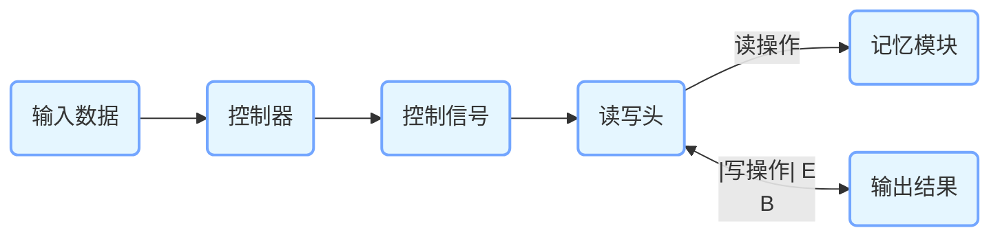

# 神经图灵机增强AI长期规划推理的新方法探索

> 关键词：神经图灵机、AI、长期规划推理、新方法、记忆机制

> 摘要：本文围绕神经图灵机增强AI长期规划推理的新方法展开深入探索。首先介绍了研究的背景信息，包括目的、预期读者、文档结构和相关术语。接着阐述了神经图灵机与AI长期规划推理的核心概念及联系，详细讲解了核心算法原理和具体操作步骤，并给出Python代码示例。同时，运用数学模型和公式对其进行了理论分析。通过项目实战，展示了代码的实际应用和详细解读。探讨了该方法的实际应用场景，推荐了相关的学习资源、开发工具框架和论文著作。最后总结了未来发展趋势与挑战，提供了常见问题解答和扩展阅读参考资料，旨在为相关领域的研究者和开发者提供全面且深入的技术指导。

## 1. 背景介绍 
### 1.1 目的和范围
在当今人工智能领域，长期规划推理能力是衡量AI智能水平的重要指标之一。传统的神经网络在处理长期依赖和复杂规划任务时存在一定的局限性，而神经图灵机（Neural Turing Machine，NTM）作为一种结合了神经网络和外部记忆机制的模型，为解决这些问题提供了新的思路。本文的目的在于探索如何利用神经图灵机增强AI的长期规划推理能力，详细介绍相关的理论知识、算法原理、实际应用以及未来发展方向。范围涵盖了神经图灵机的基本概念、核心算法、数学模型、项目实战等多个方面，旨在为读者提供一个全面且深入的技术视角。

### 1.2 预期读者
本文预期读者主要包括人工智能领域的研究者、开发者、学生以及对AI技术有深入学习需求的爱好者。对于研究者，本文提供了神经图灵机在增强AI长期规划推理方面的最新研究思路和方法；对于开发者，文中包含详细的算法实现和项目实战案例，有助于他们将相关技术应用到实际项目中；对于学生和爱好者，清晰的概念讲解和丰富的学习资源推荐能够帮助他们快速入门和深入理解这一领域。

### 1.3 文档结构概述
本文按照以下结构进行组织：首先介绍研究的背景信息，包括目的、预期读者、文档结构和相关术语；接着阐述神经图灵机与AI长期规划推理的核心概念及联系，给出相应的文本示意图和Mermaid流程图；然后详细讲解核心算法原理和具体操作步骤，并使用Python代码进行说明；运用数学模型和公式对其进行理论分析；通过项目实战展示代码的实际应用和详细解读；探讨该方法的实际应用场景；推荐相关的学习资源、开发工具框架和论文著作；最后总结未来发展趋势与挑战，提供常见问题解答和扩展阅读参考资料。

### 1.4 术语表
#### 1.4.1 核心术语定义
- **神经图灵机（Neural Turing Machine，NTM）**：一种结合了神经网络和外部可读写记忆模块的计算模型，通过注意力机制实现对外部记忆的灵活访问，能够处理复杂的序列任务和长期依赖问题。
- **AI长期规划推理**：指人工智能系统在面对复杂任务时，能够制定一系列长期的行动策略，并根据当前状态和目标进行推理和决策的能力。
- **注意力机制（Attention Mechanism）**：一种在神经网络中广泛应用的技术，通过计算输入序列中不同部分的重要性权重，使模型能够聚焦于关键信息，提高模型的性能和效率。
- **外部记忆模块（External Memory Module）**：神经图灵机中的一个重要组成部分，用于存储和管理历史信息，为模型提供长期记忆能力。

#### 1.4.2 相关概念解释
- **神经网络（Neural Network）**：一种模仿人类神经系统的计算模型，由大量的神经元组成，通过学习数据中的模式和规律来进行预测和决策。
- **循环神经网络（Recurrent Neural Network，RNN）**：一种专门处理序列数据的神经网络，通过在时间步上传递隐藏状态来捕捉序列中的长期依赖关系，但在处理长序列时容易出现梯度消失或梯度爆炸问题。
- **长短期记忆网络（Long Short-Term Memory，LSTM）**：一种改进的循环神经网络，通过引入门控机制来解决RNN的梯度问题，能够更好地处理长序列数据。

#### 1.4.3 缩略词列表
- **NTM**：Neural Turing Machine（神经图灵机）
- **RNN**：Recurrent Neural Network（循环神经网络）
- **LSTM**：Long Short-Term Memory（长短期记忆网络）

## 2. 核心概念与联系 
### 核心概念原理
神经图灵机的核心思想是将传统的神经网络与外部记忆模块相结合，通过引入读写头和注意力机制，使模型能够灵活地访问和操作外部记忆。具体来说，神经图灵机由控制器（Controller）、记忆模块（Memory）、读写头（Read/Write Heads）三部分组成。

控制器通常是一个神经网络，负责接收输入数据并生成控制信号，这些控制信号用于指导读写头对外部记忆的访问。记忆模块是一个二维矩阵，用于存储历史信息，每一行代表一个记忆单元。读写头通过注意力机制计算记忆单元的权重，从而实现对记忆的读写操作。

在AI长期规划推理中，神经图灵机的外部记忆模块可以存储历史状态、中间结果和规划信息，控制器根据当前输入和记忆内容进行推理和决策，生成下一步的行动策略。通过不断地更新记忆和调整策略，神经图灵机能够实现对复杂任务的长期规划和推理。

### 架构的文本示意图
```plaintext
+----------------------+
|      输入数据        |
+----------------------+
           |
           v
+----------------------+
|      控制器（NN）    |
+----------------------+
           |
           +--- 控制信号 ---> +----------------------+
           |                  |      读写头          |
           |                  +----------------------+
           |                             |
           |                             +--- 读操作 ---> +----------------------+
           |                             |               |      记忆模块        |
           |                             +--- 写操作 <--- +----------------------+
           |
           v
+----------------------+
|      输出结果        |
+----------------------+
```

### Mermaid流程图


## 3. 核心算法原理 & 具体操作步骤 
### 核心算法原理
神经图灵机的核心算法主要包括控制器的前向传播、读写头的注意力计算和记忆模块的读写操作。下面我们将详细介绍这些步骤，并给出Python代码示例。

#### 控制器的前向传播
控制器通常使用一个神经网络（如多层感知机或循环神经网络）来实现。假设输入数据为 $x_t$，控制器的隐藏状态为 $h_t$，则控制器的前向传播可以表示为：

$h_t = f(h_{t-1}, x_t)$

其中 $f$ 是控制器的神经网络函数。

#### 读写头的注意力计算
读写头通过注意力机制计算记忆单元的权重，从而实现对记忆的读写操作。假设记忆模块为 $M_t$，读写头的注意力权重为 $w_t$，则注意力计算可以表示为：

$w_t = \text{softmax}(u_t)$

其中 $u_t$ 是读写头的注意力得分，通常通过一个神经网络计算得到。

#### 记忆模块的读写操作
读操作：根据注意力权重 $w_t$ 从记忆模块 $M_t$ 中读取信息：

$r_t = \sum_{i=1}^N w_t[i] M_t[i]$

其中 $N$ 是记忆单元的数量。

写操作：根据注意力权重 $w_t$ 和写入向量 $e_t$、$a_t$ 更新记忆模块 $M_t$：

$M_{t+1}[i] = M_t[i] \odot (1 - w_t[i] \odot e_t) + w_t[i] \odot a_t$

其中 $\odot$ 表示逐元素相乘。

### 具体操作步骤
1. **初始化**：初始化控制器的参数、记忆模块 $M_0$ 和读写头的状态。
2. **输入数据**：接收当前时间步的输入数据 $x_t$。
3. **控制器前向传播**：根据输入数据 $x_t$ 和上一时刻的隐藏状态 $h_{t-1}$ 计算当前时刻的隐藏状态 $h_t$。
4. **读写头注意力计算**：根据控制器的输出 $h_t$ 计算读写头的注意力权重 $w_t$。
5. **读操作**：根据注意力权重 $w_t$ 从记忆模块 $M_t$ 中读取信息 $r_t$。
6. **写操作**：根据控制器的输出 $h_t$ 生成写入向量 $e_t$、$a_t$，并根据注意力权重 $w_t$ 更新记忆模块 $M_{t+1}$。
7. **输出结果**：根据控制器的输出 $h_t$ 和读取信息 $r_t$ 生成当前时间步的输出结果 $y_t$。
8. **重复步骤2-7**：直到完成所有时间步的处理。

### Python代码示例
```python
import torch
import torch.nn as nn
import torch.nn.functional as F

class NeuralTuringMachine(nn.Module):
    def __init__(self, input_size, hidden_size, output_size, memory_size, memory_length):
        super(NeuralTuringMachine, self).__init__()
        self.controller = nn.RNN(input_size, hidden_size, batch_first=True)
        self.read_head = nn.Linear(hidden_size, memory_length)
        self.write_head = nn.Linear(hidden_size, memory_length * 2)
        self.output_layer = nn.Linear(hidden_size + memory_length, output_size)
        self.memory = torch.zeros(memory_size, memory_length)

    def forward(self, x):
        batch_size, seq_length, _ = x.size()
        hidden = torch.zeros(1, batch_size, self.controller.hidden_size)
        outputs = []
        for t in range(seq_length):
            # 控制器前向传播
            input_t = x[:, t:t+1, :]
            output, hidden = self.controller(input_t, hidden)
            # 读写头注意力计算
            read_weight = F.softmax(self.read_head(output.squeeze(1)), dim=1)
            write_params = self.write_head(output.squeeze(1))
            erase_vector = torch.sigmoid(write_params[:, :self.memory.size(1)])
            add_vector = torch.tanh(write_params[:, self.memory.size(1):])
            # 读操作
            read_vector = torch.matmul(read_weight, self.memory)
            # 写操作
            self.memory = self.memory * (1 - read_weight.unsqueeze(2) * erase_vector.unsqueeze(2)) + read_weight.unsqueeze(2) * add_vector.unsqueeze(2)
            # 输出结果
            output_t = self.output_layer(torch.cat([output.squeeze(1), read_vector], dim=1))
            outputs.append(output_t)
        outputs = torch.stack(outputs, dim=1)
        return outputs
```

## 4. 数学模型和公式 & 详细讲解 & 举例说明 
### 数学模型和公式
#### 控制器的前向传播
如前所述，控制器的前向传播可以表示为：

$h_t = f(h_{t-1}, x_t)$

其中 $h_t$ 是控制器在时间步 $t$ 的隐藏状态，$h_{t-1}$ 是上一时刻的隐藏状态，$x_t$ 是当前时间步的输入数据，$f$ 是控制器的神经网络函数。如果控制器使用一个简单的循环神经网络（RNN），则可以表示为：

$h_t = \tanh(W_{hh} h_{t-1} + W_{xh} x_t + b_h)$

其中 $W_{hh}$ 是隐藏状态到隐藏状态的权重矩阵，$W_{xh}$ 是输入数据到隐藏状态的权重矩阵，$b_h$ 是偏置向量。

#### 读写头的注意力计算
读写头的注意力权重 $w_t$ 可以通过以下公式计算：

$w_t = \text{softmax}(u_t)$

其中 $u_t$ 是读写头的注意力得分，通常通过一个神经网络计算得到。假设读写头的注意力得分函数为 $g$，则可以表示为：

$u_t = g(h_t)$

#### 记忆模块的读写操作
读操作：

$r_t = \sum_{i=1}^N w_t[i] M_t[i]$

写操作：

$M_{t+1}[i] = M_t[i] \odot (1 - w_t[i] \odot e_t) + w_t[i] \odot a_t$

### 详细讲解
控制器的前向传播通过神经网络将当前输入数据和上一时刻的隐藏状态进行组合，生成当前时刻的隐藏状态。这个隐藏状态包含了历史信息和当前输入的综合信息，用于指导读写头的操作。

读写头的注意力计算通过计算记忆单元的重要性权重，使模型能够聚焦于关键信息。注意力权重通过 softmax 函数进行归一化，确保所有权重之和为 1。

记忆模块的读操作根据注意力权重对记忆单元进行加权求和，得到读取信息。写操作通过擦除和添加操作更新记忆模块，擦除向量 $e_t$ 用于清除记忆单元中的部分信息，添加向量 $a_t$ 用于添加新的信息。

### 举例说明
假设我们有一个简单的序列预测任务，输入序列为 $[1, 2, 3, 4, 5]$，目标是预测下一个数字。我们可以使用神经图灵机来完成这个任务。

- **初始化**：初始化控制器的参数、记忆模块 $M_0$ 和读写头的状态。
- **输入数据**：依次输入 $1, 2, 3, 4, 5$。
- **控制器前向传播**：根据输入数据和上一时刻的隐藏状态计算当前时刻的隐藏状态。
- **读写头注意力计算**：根据控制器的输出计算读写头的注意力权重。
- **读操作**：根据注意力权重从记忆模块中读取信息。
- **写操作**：根据控制器的输出生成写入向量，更新记忆模块。
- **输出结果**：根据控制器的输出和读取信息生成预测结果。

通过不断地更新记忆和调整策略，神经图灵机可以学习到序列中的模式和规律，从而准确地预测下一个数字。

## 5. 项目实战：代码实际案例和详细解释说明 
### 5.1  开发环境搭建
为了实现神经图灵机并进行长期规划推理的实验，我们需要搭建一个合适的开发环境。以下是具体的步骤：

#### 安装Python
首先，确保你已经安装了Python 3.x版本。可以从Python官方网站（https://www.python.org/downloads/）下载并安装适合你操作系统的Python版本。

#### 安装深度学习框架
我们使用PyTorch作为深度学习框架，因为它具有简洁的API和强大的自动求导功能。可以使用以下命令安装PyTorch：

```sh
pip install torch torchvision
```

#### 安装其他依赖库
还需要安装一些其他的依赖库，如NumPy、Matplotlib等。可以使用以下命令安装：

```sh
pip install numpy matplotlib
```

### 5.2  源代码详细实现和代码解读
以下是一个完整的神经图灵机实现代码示例，用于解决一个简单的序列复制任务：

```python
import torch
import torch.nn as nn
import torch.nn.functional as F
import numpy as np
import matplotlib.pyplot as plt

# 定义神经图灵机类
class NeuralTuringMachine(nn.Module):
    def __init__(self, input_size, hidden_size, output_size, memory_size, memory_length):
        super(NeuralTuringMachine, self).__init__()
        self.controller = nn.RNN(input_size, hidden_size, batch_first=True)
        self.read_head = nn.Linear(hidden_size, memory_length)
        self.write_head = nn.Linear(hidden_size, memory_length * 2)
        self.output_layer = nn.Linear(hidden_size + memory_length, output_size)
        self.memory = torch.zeros(memory_size, memory_length)

    def forward(self, x):
        batch_size, seq_length, _ = x.size()
        hidden = torch.zeros(1, batch_size, self.controller.hidden_size)
        outputs = []
        for t in range(seq_length):
            # 控制器前向传播
            input_t = x[:, t:t+1, :]
            output, hidden = self.controller(input_t, hidden)
            # 读写头注意力计算
            read_weight = F.softmax(self.read_head(output.squeeze(1)), dim=1)
            write_params = self.write_head(output.squeeze(1))
            erase_vector = torch.sigmoid(write_params[:, :self.memory.size(1)])
            add_vector = torch.tanh(write_params[:, self.memory.size(1):])
            # 读操作
            read_vector = torch.matmul(read_weight, self.memory)
            # 写操作
            self.memory = self.memory * (1 - read_weight.unsqueeze(2) * erase_vector.unsqueeze(2)) + read_weight.unsqueeze(2) * add_vector.unsqueeze(2)
            # 输出结果
            output_t = self.output_layer(torch.cat([output.squeeze(1), read_vector], dim=1))
            outputs.append(output_t)
        outputs = torch.stack(outputs, dim=1)
        return outputs

# 生成训练数据
def generate_data(batch_size, seq_length, input_size):
    x = torch.randint(0, 2, (batch_size, seq_length, input_size)).float()
    y = x.clone()
    return x, y

# 训练模型
def train_model(model, optimizer, criterion, num_epochs, batch_size, seq_length, input_size):
    losses = []
    for epoch in range(num_epochs):
        x, y = generate_data(batch_size, seq_length, input_size)
        optimizer.zero_grad()
        output = model(x)
        loss = criterion(output, y)
        loss.backward()
        optimizer.step()
        losses.append(loss.item())
        if (epoch + 1) % 100 == 0:
            print(f'Epoch {epoch+1}/{num_epochs}, Loss: {loss.item()}')
    return losses

# 主函数
if __name__ == '__main__':
    input_size = 5
    hidden_size = 20
    output_size = 5
    memory_size = 10
    memory_length = 20
    batch_size = 32
    seq_length = 10
    num_epochs = 1000
    learning_rate = 0.001

    model = NeuralTuringMachine(input_size, hidden_size, output_size, memory_size, memory_length)
    optimizer = torch.optim.Adam(model.parameters(), lr=learning_rate)
    criterion = nn.MSELoss()

    losses = train_model(model, optimizer, criterion, num_epochs, batch_size, seq_length, input_size)

    # 绘制损失曲线
    plt.plot(losses)
    plt.xlabel('Epoch')
    plt.ylabel('Loss')
    plt.title('Training Loss')
    plt.show()
```

### 5.3  代码解读与分析
#### 神经图灵机类 `NeuralTuringMachine`
- **初始化**：在 `__init__` 方法中，我们定义了控制器、读写头和输出层的神经网络模块，并初始化了记忆模块。
- **前向传播**：在 `forward` 方法中，我们实现了神经图灵机的前向传播过程，包括控制器的前向传播、读写头的注意力计算、记忆模块的读写操作和输出结果的生成。

#### 生成训练数据函数 `generate_data`
该函数用于生成随机的二进制序列作为训练数据，输入和输出数据相同，用于解决序列复制任务。

#### 训练模型函数 `train_model`
该函数用于训练神经图灵机模型，通过多次迭代更新模型的参数，最小化预测结果和真实结果之间的损失。

#### 主函数
在主函数中，我们定义了模型的参数、训练参数，并调用 `train_model` 函数进行训练。最后，绘制了训练损失曲线，用于观察模型的训练效果。

通过以上代码和分析，我们可以看到神经图灵机如何通过外部记忆模块和注意力机制实现对序列数据的处理和学习。

## 6. 实际应用场景 
神经图灵机增强AI长期规划推理的方法在多个领域都有广泛的应用前景，以下是一些具体的实际应用场景：

### 自然语言处理
- **机器翻译**：在机器翻译任务中，神经图灵机可以利用外部记忆模块存储源语言句子的语义信息和历史翻译结果，通过长期规划推理生成更准确、流畅的目标语言翻译。
- **文本生成**：在文本生成任务中，如故事创作、对话生成等，神经图灵机可以根据上下文信息和用户的需求，进行长期规划和推理，生成连贯、有逻辑的文本内容。

### 机器人控制
- **路径规划**：在机器人路径规划任务中，神经图灵机可以存储环境地图信息和历史路径选择，通过长期规划推理找到最优的路径，避免碰撞和重复探索。
- **任务调度**：在机器人多任务调度中，神经图灵机可以根据任务的优先级、时间限制和机器人的当前状态，进行长期规划和决策，合理分配机器人的资源和时间。

### 游戏AI
- **策略游戏**：在策略游戏中，如围棋、象棋等，神经图灵机可以存储历史棋局信息和对手的策略，通过长期规划推理制定最优的下棋策略，提高游戏的胜率。
- **角色扮演游戏**：在角色扮演游戏中，神经图灵机可以根据玩家的行为和游戏剧情，进行长期规划和决策，生成丰富多样的游戏情节和角色发展路径。

### 金融预测
- **股票价格预测**：在股票价格预测中，神经图灵机可以存储历史股票价格数据、市场新闻和宏观经济指标，通过长期规划推理预测股票价格的走势，为投资者提供决策参考。
- **风险评估**：在金融风险评估中，神经图灵机可以根据客户的信用记录、财务状况和市场环境，进行长期规划和分析，评估客户的信用风险和投资风险。

## 7. 工具和资源推荐
### 7.1 学习资源推荐
#### 7.1.1 书籍推荐
- 《深度学习》（Deep Learning）：由Ian Goodfellow、Yoshua Bengio和Aaron Courville所著，是深度学习领域的经典教材，涵盖了神经网络、深度学习模型、优化算法等基础知识。
- 《人工智能：一种现代的方法》（Artificial Intelligence: A Modern Approach）：由Stuart Russell和Peter Norvig所著，是人工智能领域的权威教材，介绍了人工智能的各个方面，包括搜索算法、机器学习、自然语言处理等。
- 《Python深度学习》（Deep Learning with Python）：由Francois Chollet所著，通过Python代码和实际案例介绍了深度学习的基本概念和应用，适合初学者入门。

#### 7.1.2 在线课程
- Coursera上的“深度学习专项课程”（Deep Learning Specialization）：由Andrew Ng教授主讲，包括神经网络和深度学习、改善深层神经网络、结构化机器学习项目、卷积神经网络、序列模型等课程，是学习深度学习的经典课程。
- edX上的“人工智能导论”（Introduction to Artificial Intelligence）：由麻省理工学院（MIT）的Patrick H. Winston教授主讲，介绍了人工智能的基本概念、搜索算法、知识表示、机器学习等内容。
- Udemy上的“完整的深度学习课程：使用Python和TensorFlow”（Complete Deep Learning Bootcamp: Learn to Build AIs）：通过Python和TensorFlow介绍了深度学习的各个方面，包括神经网络、卷积神经网络、循环神经网络等。

#### 7.1.3 技术博客和网站
- Medium上的Towards Data Science：是一个专注于数据科学和机器学习的技术博客，提供了大量的技术文章和实践经验分享。
- arXiv.org：是一个预印本论文平台，涵盖了计算机科学、物理学、数学等多个领域的最新研究成果，是获取最新学术信息的重要渠道。
- GitHub：是一个开源代码托管平台，上面有很多优秀的深度学习项目和代码实现，可以学习和参考。

### 7.2 开发工具框架推荐
#### 7.2.1 IDE和编辑器
- PyCharm：是一款专门为Python开发设计的集成开发环境（IDE），提供了代码编辑、调试、版本控制等功能，适合专业的Python开发者。
- Jupyter Notebook：是一个交互式的开发环境，支持Python、R等多种编程语言，适合数据探索、模型开发和可视化展示。
- Visual Studio Code：是一款轻量级的代码编辑器，支持多种编程语言和插件扩展，具有丰富的功能和良好的用户体验。

#### 7.2.2 调试和性能分析工具
- PyTorch Profiler：是PyTorch提供的性能分析工具，可以帮助开发者分析模型的运行时间、内存使用等性能指标，优化模型的性能。
- TensorBoard：是TensorFlow提供的可视化工具，可以用于可视化模型的训练过程、损失曲线、参数分布等信息，帮助开发者理解模型的训练情况。
- cProfile：是Python标准库中的性能分析工具，可以用于分析Python代码的运行时间和函数调用次数，找出代码中的性能瓶颈。

#### 7.2.3 相关框架和库
- PyTorch：是一个开源的深度学习框架，具有简洁的API和强大的自动求导功能，支持GPU加速，广泛应用于学术界和工业界。
- TensorFlow：是另一个开源的深度学习框架，由Google开发，具有丰富的工具和库，支持分布式训练和移动端部署。
- NumPy：是Python中用于科学计算的基础库，提供了高效的多维数组对象和数学函数，是深度学习框架的基础依赖库。

### 7.3 相关论文著作推荐
#### 7.3.1 经典论文
- "Neural Turing Machines"：由Alex Graves、Greg Wayne和Ivo Danihelka发表于2014年，首次提出了神经图灵机的概念，并详细介绍了其原理和实现方法。
- "Show, Attend and Tell: Neural Image Caption Generation with Visual Attention"：由Kelvin Xu等人发表于2015年，将注意力机制应用于图像描述生成任务，为神经图灵机的发展提供了重要的思路。
- "Long Short-Term Memory"：由Sepp Hochreiter和Jürgen Schmidhuber发表于1997年，提出了长短期记忆网络（LSTM），解决了传统循环神经网络的梯度消失和梯度爆炸问题，为神经图灵机的控制器设计提供了重要的基础。

#### 7.3.2 最新研究成果
- "Differentiable Neural Computers"：由Alex Graves等人发表于2016年，提出了可微分神经计算机（DNC），是神经图灵机的进一步扩展和改进，具有更强的计算能力和表达能力。
- "Meta-Learning with Memory-Augmented Neural Networks"：由Adam Santoro等人发表于2016年，将神经图灵机应用于元学习任务，展示了神经图灵机在快速学习和适应新任务方面的优势。
- "Neural Programmer-Interpreters"：由Scott Reed和Nando de Freitas发表于2015年，提出了神经程序员 - 解释器（NPI）模型，结合了神经网络和程序解释器的思想，为神经图灵机在编程和推理任务中的应用提供了新的思路。

#### 7.3.3 应用案例分析
- "End-to-End Memory Networks"：由Sainbayar Sukhbaatar等人发表于2015年，将记忆网络应用于问答系统，展示了神经图灵机在自然语言处理任务中的应用效果。
- "Learning to Transduce with Unbounded Memory"：由Karol Gregor等人发表于2015年，将神经图灵机应用于序列转换任务，如机器翻译、语音识别等，展示了神经图灵机在处理长序列数据方面的优势。
- "Neural Turing Machines for Image Classification"：由Shuai Zhang等人发表于2016年，将神经图灵机应用于图像分类任务，展示了神经图灵机在计算机视觉领域的应用潜力。

## 8. 总结：未来发展趋势与挑战
### 未来发展趋势
- **与其他技术的融合**：神经图灵机有望与强化学习、生成对抗网络等其他人工智能技术相结合，进一步提升AI的长期规划推理能力。例如，将神经图灵机与强化学习相结合，可以实现更智能的决策和规划，应用于机器人控制、自动驾驶等领域。
- **模型的可解释性**：随着AI技术的广泛应用，模型的可解释性变得越来越重要。未来的研究将致力于提高神经图灵机的可解释性，使其决策过程更加透明和可理解，为实际应用提供更可靠的支持。
- **应用领域的拓展**：神经图灵机的应用领域将不断拓展，除了自然语言处理、机器人控制、游戏AI等领域，还将应用于医疗保健、金融服务、交通运输等更多领域，为解决实际问题提供更有效的方法。

### 挑战
- **计算资源的需求**：神经图灵机由于引入了外部记忆模块和注意力机制，计算复杂度较高，对计算资源的需求较大。如何在有限的计算资源下提高模型的效率和性能，是未来需要解决的一个重要问题。
- **数据的质量和规模**：神经图灵机的性能很大程度上依赖于训练数据的质量和规模。如何获取高质量、大规模的训练数据，并有效地利用这些数据进行模型训练，是另一个需要解决的挑战。
- **模型的稳定性和鲁棒性**：神经图灵机在处理复杂任务时，可能会出现不稳定和鲁棒性差的问题。如何提高模型的稳定性和鲁棒性，使其在不同的环境和条件下都能正常工作，是未来研究的重点之一。

## 9. 附录：常见问题与解答
### 问题1：神经图灵机与传统神经网络有什么区别？
神经图灵机与传统神经网络的主要区别在于引入了外部记忆模块和注意力机制。传统神经网络在处理长序列数据时容易出现梯度消失或梯度爆炸问题，难以处理长期依赖关系。而神经图灵机通过外部记忆模块存储历史信息，通过注意力机制灵活地访问和操作记忆，能够更好地处理长序列数据和复杂的规划任务。

### 问题2：神经图灵机的训练难度如何？
神经图灵机的训练难度相对较高，主要原因包括计算复杂度高、对计算资源的需求大、模型的参数较多等。此外，神经图灵机的训练过程也比较复杂，需要合理设置学习率、优化算法等参数。为了提高训练效率和性能，可以采用一些技巧，如预训练、模型融合等。

### 问题3：神经图灵机在实际应用中有哪些局限性？
神经图灵机在实际应用中存在一些局限性，如计算资源需求大、数据依赖严重、模型可解释性差等。此外，神经图灵机的训练过程也比较复杂，需要大量的时间和数据。在实际应用中，需要根据具体问题和需求，权衡神经图灵机的优缺点，选择合适的模型和方法。

### 问题4：如何评估神经图灵机的性能？
评估神经图灵机的性能可以从多个方面进行，如准确率、召回率、F1值、均方误差等。具体的评估指标需要根据具体的任务和应用场景来选择。此外，还可以通过可视化分析、模型解释等方法，深入了解神经图灵机的决策过程和性能表现。

## 10. 扩展阅读 & 参考资料
### 扩展阅读
- 《强化学习：原理与Python实现》：介绍了强化学习的基本原理和算法，以及如何使用Python实现强化学习模型。
- 《深度学习实战：基于TensorFlow和Keras》：通过实际案例介绍了深度学习的应用和实践，包括图像识别、自然语言处理、语音识别等领域。
- 《人工智能的未来》：探讨了人工智能的发展趋势和未来挑战，以及人工智能对社会和人类的影响。

### 参考资料
- Graves, A., Wayne, G., & Danihelka, I. (2014). Neural Turing Machines. arXiv preprint arXiv:1410.5401.
- Sukhbaatar, S., Weston, J., & Fergus, R. (2015). End-to-End Memory Networks. In Advances in neural information processing systems (pp. 2440-2448).
- Gregor, K., Danihelka, I., Graves, A., & Wierstra, D. (2015). Learning to Transduce with Unbounded Memory. arXiv preprint arXiv:1506.02516.

作者：AI天才研究院/AI Genius Institute & 禅与计算机程序设计艺术 /Zen And The Art of Computer Programming