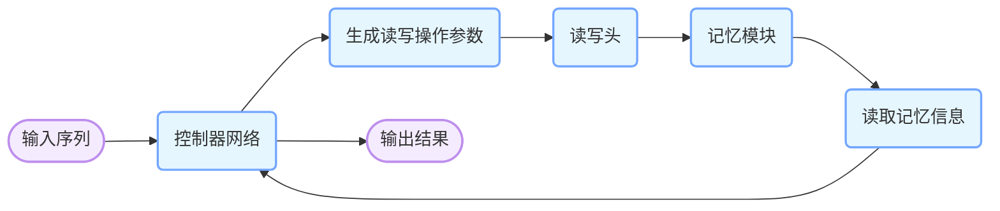

# 神经图灵机增强AI长程推理能力的方法

> 关键词：神经图灵机、AI长程推理、记忆机制、深度学习、强化学习

> 摘要：本文聚焦于神经图灵机增强AI长程推理能力的方法。首先介绍了相关背景知识，包括研究目的、预期读者等内容。接着阐述了神经图灵机和AI长程推理的核心概念及联系，并给出了原理架构的文本示意图和Mermaid流程图。详细讲解了核心算法原理，通过Python代码进行说明，同时介绍了相关数学模型和公式并举例。在项目实战部分，给出了开发环境搭建、源代码实现及解读。探讨了神经图灵机在不同场景的实际应用，推荐了学习资源、开发工具框架以及相关论文著作。最后总结了未来发展趋势与挑战，还提供了常见问题解答和扩展阅读参考资料，旨在全面深入地剖析神经图灵机对AI长程推理能力的增强作用。

## 1. 背景介绍 
### 1.1 目的和范围
随着人工智能技术的不断发展，长程推理能力成为AI面临的重要挑战之一。传统的深度学习模型在处理长序列信息和复杂推理任务时存在一定的局限性，例如在处理需要长期记忆和逐步推理的问题时表现不佳。神经图灵机（Neural Turing Machine，NTM）作为一种结合了神经网络和外部记忆机制的模型，为增强AI的长程推理能力提供了新的思路和方法。本文的目的在于深入探讨神经图灵机是如何增强AI长程推理能力的，详细介绍相关的原理、算法、实际应用等方面的内容，范围涵盖理论分析、代码实现以及实际案例应用等多个层面。

### 1.2 预期读者
本文预期读者包括人工智能领域的研究人员、开发者、学生以及对AI长程推理和神经图灵机感兴趣的技术爱好者。对于研究人员，本文可以为他们的研究提供理论和实践参考；对于开发者，有助于他们将神经图灵机应用到实际项目中；对于学生，能够帮助他们深入理解相关概念和技术；对于技术爱好者，可以拓宽他们在人工智能领域的知识面。

### 1.3 文档结构概述
本文首先对神经图灵机增强AI长程推理能力的背景进行介绍，包括目的、读者群体和文档结构等。接着阐述核心概念，包括神经图灵机和AI长程推理的原理及它们之间的联系，并给出相应的示意图和流程图。然后详细讲解核心算法原理，用Python代码进行说明，同时介绍相关的数学模型和公式。在项目实战部分，介绍开发环境搭建、源代码实现和代码解读。之后探讨神经图灵机在实际场景中的应用，推荐相关的学习资源、开发工具框架和论文著作。最后总结未来发展趋势与挑战，提供常见问题解答和扩展阅读参考资料。

### 1.4 术语表
#### 1.4.1 核心术语定义
- **神经图灵机（Neural Turing Machine）**：是一种结合了神经网络和外部可读写记忆模块的计算模型，通过控制器网络与记忆模块交互，实现对信息的存储和检索，以增强模型处理复杂任务的能力。
- **AI长程推理**：指人工智能系统在处理问题时，需要考虑长序列信息，经过多个步骤的推理和分析，最终得出合理结论的能力。
- **控制器网络**：神经图灵机中负责与外部环境交互、产生读写操作指令的神经网络。
- **记忆模块**：神经图灵机中用于存储信息的外部存储结构，控制器网络可以对其进行读写操作。

#### 1.4.2 相关概念解释
- **注意力机制**：在神经图灵机中，注意力机制用于控制对记忆模块的读写位置，通过计算权重分布，使得模型能够聚焦于记忆中的特定部分，提高信息处理的效率。
- **强化学习**：一种机器学习方法，通过智能体与环境进行交互，根据环境反馈的奖励信号来调整自身的行为策略，以最大化长期累积奖励。神经图灵机可以结合强化学习来优化其在长程推理任务中的表现。

#### 1.4.3 缩略词列表
- **NTM**：Neural Turing Machine（神经图灵机）
- **RNN**：Recurrent Neural Network（循环神经网络）
- **LSTM**：Long Short - Term Memory（长短期记忆网络）

## 2. 核心概念与联系 

### 神经图灵机原理
神经图灵机主要由控制器网络和外部记忆模块组成。控制器网络可以是循环神经网络（如LSTM），它接收输入序列，并根据输入产生对记忆模块的读写操作指令。记忆模块是一个二维矩阵，每一行代表一个记忆单元，控制器网络可以通过读写头对记忆模块进行读写操作。

#### 文本示意图
神经图灵机的整体架构可以描述为：输入序列首先进入控制器网络，控制器网络根据输入生成读写操作的参数，包括读写头的位置、读写权重等。读写头根据这些参数对记忆模块进行读写操作，同时控制器网络根据记忆模块的状态和输入序列进行计算，最终输出结果。

```plaintext
输入序列 -> 控制器网络 -> 读写操作参数 -> 读写头 -> 记忆模块
                                      ^                 |
                                      |                 v
                                  输出结果 <- 控制器网络 
```

#### Mermaid流程图


### AI长程推理概念
AI长程推理要求模型能够处理长序列信息，在推理过程中不断更新和利用之前的信息，逐步得出最终结论。例如，在自然语言处理中的文本问答任务，模型需要理解整个文本的上下文信息，经过多个步骤的推理才能准确回答问题；在棋类游戏中，模型需要预测多个回合后的局势，进行长程的策略规划。

### 神经图灵机与AI长程推理的联系
神经图灵机的外部记忆模块为AI长程推理提供了重要的支持。通过记忆模块，模型可以存储长序列信息，避免在处理长序列时出现信息丢失的问题。控制器网络可以根据当前的推理步骤，灵活地从记忆模块中读取相关信息，进行推理计算，并将中间结果写入记忆模块，以便后续使用。这种机制使得神经图灵机能够更好地处理长程推理任务，提高推理的准确性和效率。

## 3. 核心算法原理 & 具体操作步骤 

### 核心算法原理
神经图灵机的核心算法主要包括控制器网络的计算、读写操作的实现以及记忆模块的更新。下面以一个简单的基于LSTM的控制器网络为例，详细介绍算法原理。

#### 控制器网络计算
控制器网络接收输入序列 $x_t$，并根据当前的隐藏状态 $h_{t - 1}$ 计算新的隐藏状态 $h_t$。对于LSTM控制器网络，其计算过程如下：

```python
import torch
import torch.nn as nn

class LSTMController(nn.Module):
    def __init__(self, input_size, hidden_size):
        super(LSTMController, self).__init__()
        self.lstm = nn.LSTM(input_size, hidden_size)

    def forward(self, x, h_prev, c_prev):
        output, (h_next, c_next) = self.lstm(x.unsqueeze(0).unsqueeze(0), (h_prev.unsqueeze(0), c_prev.unsqueeze(0)))
        return output.squeeze(0).squeeze(0), h_next.squeeze(0), c_next.squeeze(0)
```

#### 读写操作实现
读写操作包括对记忆模块的读取和写入。读取操作根据读取权重 $w_t^r$ 从记忆模块 $M_t$ 中读取信息 $r_t$：

```python
def read_memory(M, w_r):
    r = torch.matmul(w_r.unsqueeze(0), M).squeeze(0)
    return r
```

写入操作根据写入权重 $w_t^w$ 和写入向量 $e_t$、$a_t$ 更新记忆模块 $M_t$：

```python
def write_memory(M, w_w, e, a):
    M_erase = M * (1 - torch.outer(w_w, e))
    M_write = M_erase + torch.outer(w_w, a)
    return M_write
```

#### 记忆模块更新
记忆模块的更新是通过读写操作不断进行的。在每个时间步 $t$，根据控制器网络生成的读写权重和读写向量，对记忆模块进行更新。

### 具体操作步骤
1. **初始化**：初始化控制器网络的参数、记忆模块 $M_0$、隐藏状态 $h_0$ 和细胞状态 $c_0$。
2. **输入处理**：将输入序列 $x_t$ 输入到控制器网络中，计算新的隐藏状态 $h_t$ 和细胞状态 $c_t$。
3. **生成读写操作参数**：根据隐藏状态 $h_t$ 生成读写权重 $w_t^r$、$w_t^w$ 和读写向量 $e_t$、$a_t$。
4. **读写操作**：根据读写权重和读写向量对记忆模块进行读取和写入操作，更新记忆模块 $M_t$。
5. **输出计算**：根据读取的信息 $r_t$ 和隐藏状态 $h_t$ 计算输出结果 $y_t$。
6. **重复步骤2 - 5**：直到处理完所有的输入序列。

```python
# 初始化参数
input_size = 10
hidden_size = 20
memory_size = 30
num_cells = 40

controller = LSTMController(input_size, hidden_size)
M = torch.randn(num_cells, memory_size)
h = torch.zeros(hidden_size)
c = torch.zeros(hidden_size)

# 模拟输入序列
input_sequence = torch.randn(5, input_size)

for t in range(len(input_sequence)):
    x = input_sequence[t]
    # 控制器网络计算
    output, h, c = controller(x, h, c)
    # 生成读写操作参数（简化示例）
    w_r = torch.softmax(torch.randn(num_cells), dim=0)
    w_w = torch.softmax(torch.randn(num_cells), dim=0)
    e = torch.sigmoid(torch.randn(memory_size))
    a = torch.randn(memory_size)
    # 读取操作
    r = read_memory(M, w_r)
    # 写入操作
    M = write_memory(M, w_w, e, a)
    # 输出计算（简化示例）
    y = torch.matmul(output, r)
    print(f"Time step {t}: Output = {y}")
```

## 4. 数学模型和公式 & 详细讲解 & 举例说明 

### 控制器网络数学模型
对于LSTM控制器网络，其核心公式如下：

- **输入门**：$i_t = \sigma(W_{ii}x_t + W_{hi}h_{t - 1}+b_i)$
- **遗忘门**：$f_t = \sigma(W_{if}x_t + W_{hf}h_{t - 1}+b_f)$
- **细胞状态更新**：$\tilde{C}_t=\tanh(W_{ic}x_t + W_{hc}h_{t - 1}+b_c)$
- **细胞状态**：$C_t = f_t \odot C_{t - 1}+i_t \odot \tilde{C}_t$
- **输出门**：$o_t = \sigma(W_{io}x_t + W_{ho}h_{t - 1}+b_o)$
- **隐藏状态**：$h_t = o_t \odot \tanh(C_t)$

其中，$\sigma$ 是 sigmoid 函数，$\tanh$ 是双曲正切函数，$W$ 是权重矩阵，$b$ 是偏置向量，$\odot$ 表示逐元素相乘。

### 读写操作数学模型
#### 读取操作
读取权重 $w_t^r$ 是一个长度为 $N$ 的向量，记忆模块 $M_t$ 是一个 $N \times M$ 的矩阵，读取信息 $r_t$ 的计算公式为：

$$r_t=\sum_{i = 1}^{N}w_t^r[i]M_t[i]$$

#### 写入操作
写入权重 $w_t^w$ 是一个长度为 $N$ 的向量，写入向量 $e_t$ 和 $a_t$ 是长度为 $M$ 的向量，记忆模块更新公式为：

$$M_t[i]=(1 - w_t^w[i]e_t)M_{t - 1}[i]+w_t^w[i]a_t$$

### 详细讲解
控制器网络的LSTM结构通过输入门、遗忘门和输出门来控制信息的流动和存储，能够有效地处理长序列信息。在读写操作中，读取权重 $w_t^r$ 决定了从记忆模块中读取哪些信息，写入权重 $w_t^w$ 决定了将信息写入到记忆模块的哪些位置。写入向量 $e_t$ 用于擦除记忆模块中的部分信息，$a_t$ 用于写入新的信息。

### 举例说明
假设记忆模块 $M$ 是一个 $3 \times 2$ 的矩阵：

$$M=\begin{bmatrix}
1 & 2\\
3 & 4\\
5 & 6
\end{bmatrix}$$

读取权重 $w^r = [0.2, 0.3, 0.5]$，则读取信息 $r$ 为：

$$r = 0.2\begin{bmatrix}1\\2\end{bmatrix}+0.3\begin{bmatrix}3\\4\end{bmatrix}+0.5\begin{bmatrix}5\\6\end{bmatrix}=\begin{bmatrix}0.2\times1 + 0.3\times3+0.5\times5\\0.2\times2 + 0.3\times4+0.5\times6\end{bmatrix}=\begin{bmatrix}3.6\\4.6\end{bmatrix}$$

假设写入权重 $w^w = [0.1, 0.8, 0.1]$，写入向量 $e = [0.5, 0.5]$，$a = [10, 20]$，则更新后的记忆模块 $M'$ 为：

对于第一行：
$$M'[1]=(1 - 0.1\times0.5)\begin{bmatrix}1\\2\end{bmatrix}+0.1\times\begin{bmatrix}10\\20\end{bmatrix}=\begin{bmatrix}0.95\times1+1\\0.95\times2 + 2\end{bmatrix}=\begin{bmatrix}1.95\\3.9\end{bmatrix}$$

对于第二行：
$$M'[2]=(1 - 0.8\times0.5)\begin{bmatrix}3\\4\end{bmatrix}+0.8\times\begin{bmatrix}10\\20\end{bmatrix}=\begin{bmatrix}0.6\times3+8\\0.6\times4 + 16\end{bmatrix}=\begin{bmatrix}9.8\\18.4\end{bmatrix}$$

对于第三行：
$$M'[3]=(1 - 0.1\times0.5)\begin{bmatrix}5\\6\end{bmatrix}+0.1\times\begin{bmatrix}10\\20\end{bmatrix}=\begin{bmatrix}0.95\times5+1\\0.95\times6 + 2\end{bmatrix}=\begin{bmatrix}5.75\\7.7\end{bmatrix}$$

所以更新后的记忆模块为：

$$M'=\begin{bmatrix}
1.95 & 3.9\\
9.8 & 18.4\\
5.75 & 7.7
\end{bmatrix}$$

## 5. 项目实战：代码实际案例和详细解释说明 

### 5.1  开发环境搭建
#### 安装Python
首先需要安装Python，建议使用Python 3.7及以上版本。可以从Python官方网站（https://www.python.org/downloads/）下载安装包，按照安装向导进行安装。

#### 安装深度学习框架
本文使用PyTorch作为深度学习框架，安装命令如下：

```bash
pip install torch torchvision
```

#### 安装其他依赖库
还需要安装一些其他的辅助库，如NumPy、Matplotlib等：

```bash
pip install numpy matplotlib
```

### 5.2  源代码详细实现和代码解读
下面实现一个简单的神经图灵机用于序列复制任务，即输入一个序列，模型需要输出相同的序列。

```python
import torch
import torch.nn as nn
import torch.optim as optim
import numpy as np

# 定义神经图灵机模型
class NeuralTuringMachine(nn.Module):
    def __init__(self, input_size, output_size, hidden_size, memory_size, num_cells):
        super(NeuralTuringMachine, self).__init__()
        self.input_size = input_size
        self.output_size = output_size
        self.hidden_size = hidden_size
        self.memory_size = memory_size
        self.num_cells = num_cells

        # 控制器网络
        self.controller = nn.LSTM(input_size, hidden_size)
        # 读写头参数生成器
        self.read_head_params = nn.Linear(hidden_size, num_cells)
        self.write_head_params = nn.Linear(hidden_size, num_cells + 2 * memory_size)

        # 输出层
        self.output_layer = nn.Linear(hidden_size + memory_size, output_size)

    def forward(self, input_sequence):
        batch_size = input_sequence.size(0)
        seq_length = input_sequence.size(1)

        # 初始化记忆模块、隐藏状态和细胞状态
        M = torch.zeros(batch_size, self.num_cells, self.memory_size)
        h = torch.zeros(1, batch_size, self.hidden_size)
        c = torch.zeros(1, batch_size, self.hidden_size)

        outputs = []

        for t in range(seq_length):
            x = input_sequence[:, t, :].unsqueeze(0)
            # 控制器网络计算
            output, (h, c) = self.controller(x, (h, c))
            output = output.squeeze(0)

            # 生成读写操作参数
            read_params = self.read_head_params(output)
            write_params = self.write_head_params(output)

            w_r = torch.softmax(read_params, dim=1)
            w_w = torch.softmax(write_params[:, :self.num_cells], dim=1)
            e = torch.sigmoid(write_params[:, self.num_cells:self.num_cells + self.memory_size])
            a = write_params[:, self.num_cells + self.memory_size:]

            # 读取操作
            r = torch.matmul(w_r.unsqueeze(1), M).squeeze(1)

            # 写入操作
            M_erase = M * (1 - torch.bmm(w_w.unsqueeze(2), e.unsqueeze(1)))
            M = M_erase + torch.bmm(w_w.unsqueeze(2), a.unsqueeze(1))

            # 输出计算
            combined_output = torch.cat((output, r), dim=1)
            y = self.output_layer(combined_output)
            outputs.append(y)

        outputs = torch.stack(outputs, dim=1)
        return outputs

# 生成训练数据
def generate_data(batch_size, seq_length, input_size):
    input_sequence = torch.randint(0, 2, (batch_size, seq_length, input_size)).float()
    return input_sequence

# 训练模型
input_size = 5
output_size = 5
hidden_size = 20
memory_size = 10
num_cells = 15
batch_size = 32
seq_length = 10
num_epochs = 100
learning_rate = 0.001

model = NeuralTuringMachine(input_size, output_size, hidden_size, memory_size, num_cells)
criterion = nn.MSELoss()
optimizer = optim.Adam(model.parameters(), lr=learning_rate)

for epoch in range(num_epochs):
    input_sequence = generate_data(batch_size, seq_length, input_size)
    target_sequence = input_sequence

    optimizer.zero_grad()
    outputs = model(input_sequence)
    loss = criterion(outputs, target_sequence)
    loss.backward()
    optimizer.step()

    if (epoch + 1) % 10 == 0:
        print(f'Epoch [{epoch + 1}/{num_epochs}], Loss: {loss.item():.4f}')
```

### 5.3  代码解读与分析
#### 模型定义
`NeuralTuringMachine` 类定义了神经图灵机的整体结构。其中，`controller` 是LSTM控制器网络，用于处理输入序列；`read_head_params` 和 `write_head_params` 是线性层，用于生成读写操作的参数；`output_layer` 是输出层，用于生成最终的输出结果。

#### 前向传播
在 `forward` 方法中，首先初始化记忆模块、隐藏状态和细胞状态。然后，对于输入序列的每个时间步，进行以下操作：
1. 控制器网络计算，更新隐藏状态和细胞状态。
2. 生成读写操作参数，包括读取权重、写入权重、擦除向量和写入向量。
3. 进行读取操作，从记忆模块中读取信息。
4. 进行写入操作，更新记忆模块。
5. 将读取的信息和隐藏状态拼接，通过输出层生成最终的输出结果。

#### 训练过程
在训练过程中，使用均方误差损失函数 `nn.MSELoss()` 来衡量模型输出和目标序列之间的差异。使用Adam优化器来更新模型的参数。每个epoch生成一批训练数据，计算损失并进行反向传播和参数更新。

通过不断训练，模型逐渐学习到如何使用记忆模块来存储和检索信息，从而实现序列复制任务，这也体现了神经图灵机在长程推理任务中的应用能力。

## 6. 实际应用场景 
### 自然语言处理
在自然语言处理中，神经图灵机可以用于处理长文本的理解和生成任务。例如，在机器翻译中，需要考虑源语言句子的长距离依赖关系，神经图灵机的记忆模块可以存储之前处理过的单词和短语信息，帮助模型更好地进行翻译。在文本摘要任务中，模型需要从长文本中提取关键信息并生成摘要，神经图灵机可以通过记忆模块存储文本的重要信息，提高摘要的准确性。

### 机器人决策
在机器人领域，神经图灵机可以用于机器人的决策和规划。机器人在执行任务时，需要考虑过去的动作和环境信息，进行长程的决策。例如，在机器人导航任务中，神经图灵机可以将机器人之前走过的路径、遇到的障碍物等信息存储在记忆模块中，根据当前的环境状态和记忆信息，规划出最优的导航路径。

### 游戏AI
在游戏中，神经图灵机可以增强AI的长程推理能力。例如，在棋类游戏中，AI需要预测多个回合后的局势，进行长程的策略规划。神经图灵机的记忆模块可以存储之前的棋局状态和走法，帮助AI更好地分析局势，做出更明智的决策。在实时战略游戏中，AI需要管理资源、建造建筑、指挥部队等，神经图灵机可以帮助AI存储和利用这些信息，制定长期的战略计划。

### 金融预测
在金融领域，神经图灵机可以用于股票价格预测、风险评估等任务。金融市场的变化受到多种因素的影响，并且具有长程的相关性。神经图灵机可以将历史的金融数据、市场动态等信息存储在记忆模块中，通过对这些信息的分析和推理，预测未来的股票价格走势，评估投资风险。

## 7. 工具和资源推荐
### 7.1 学习资源推荐
#### 7.1.1 书籍推荐
- 《深度学习》（Deep Learning）：由Ian Goodfellow、Yoshua Bengio和Aaron Courville所著，是深度学习领域的经典教材，涵盖了神经网络、深度学习模型等多个方面的内容，对于理解神经图灵机的基础理论有很大帮助。
- 《Python深度学习》（Deep Learning with Python）：作者是Francois Chollet，他也是Keras深度学习框架的开发者。这本书以Python和Keras为工具，介绍了深度学习的基本概念和实践方法，适合初学者入门。
- 《人工智能：一种现代的方法》（Artificial Intelligence: A Modern Approach）：由Stuart Russell和Peter Norvig所著，是人工智能领域的权威教材，全面介绍了人工智能的各个方面，包括机器学习、知识表示、推理等内容，对于理解AI长程推理和神经图灵机的应用场景有很大帮助。

#### 7.1.2 在线课程
- Coursera上的“深度学习专项课程”（Deep Learning Specialization）：由Andrew Ng教授主讲，包括五门课程，涵盖了深度学习的基础理论、卷积神经网络、循环神经网络等内容，通过视频讲解、编程作业等方式，帮助学习者深入理解深度学习。
- edX上的“人工智能导论”（Introduction to Artificial Intelligence）：由麻省理工学院（MIT）的Patrick H. Winston教授主讲，介绍了人工智能的基本概念、搜索算法、知识表示、机器学习等内容，对于建立人工智能的整体知识体系有很大帮助。
- Udemy上的“神经网络和深度学习实战”（Neural Networks and Deep Learning in Python）：该课程通过实际案例，介绍了如何使用Python和深度学习框架（如PyTorch、TensorFlow）实现神经网络和深度学习模型，对于实践能力的提升有很大帮助。

#### 7.1.3 技术博客和网站
- Medium：是一个技术博客平台，有很多关于人工智能、深度学习的优秀文章，其中不乏关于神经图灵机的研究和实践分享。
- arXiv：是一个预印本服务器，提供了大量的学术论文，包括神经图灵机的最新研究成果。可以通过搜索关键词“Neural Turing Machine”来获取相关的论文。
- Towards Data Science：是一个专注于数据科学和人工智能的网站，有很多高质量的技术文章和教程，对于学习神经图灵机和AI长程推理有很大帮助。

### 7.2 开发工具框架推荐
#### 7.2.1 IDE和编辑器
- PyCharm：是一款专门为Python开发设计的集成开发环境（IDE），具有代码编辑、调试、自动补全、版本控制等功能，适合开发神经图灵机相关的Python代码。
- Jupyter Notebook：是一个交互式的开发环境，支持Python、R等多种编程语言。可以通过浏览器访问，方便进行代码的编写、运行和可视化，适合进行模型的实验和调试。
- Visual Studio Code：是一款轻量级的代码编辑器，支持多种编程语言和插件扩展。可以通过安装Python插件来进行Python代码的开发，同时还支持代码调试、版本控制等功能。

#### 7.2.2 调试和性能分析工具
- PyTorch Profiler：是PyTorch自带的性能分析工具，可以帮助开发者分析模型的运行时间、内存使用情况等，找出性能瓶颈，进行优化。
- TensorBoard：是TensorFlow的可视化工具，也可以与PyTorch结合使用。可以通过TensorBoard可视化模型的训练过程、损失曲线、参数分布等信息，帮助开发者更好地理解模型的训练情况。
- cProfile：是Python标准库中的性能分析工具，可以分析Python代码的运行时间和函数调用次数，帮助开发者找出代码中的性能问题。

#### 7.2.3 相关框架和库
- PyTorch：是一个开源的深度学习框架，提供了丰富的神经网络层和优化算法，支持GPU加速。可以方便地实现神经图灵机模型，进行模型的训练和推理。
- TensorFlow：是另一个广泛使用的深度学习框架，具有强大的分布式训练和部署能力。也可以用于实现神经图灵机模型，并且有很多相关的教程和示例代码。
- NumPy：是Python的一个科学计算库，提供了高效的多维数组对象和数学函数。在神经图灵机的实现中，NumPy可以用于数据的处理和计算。

### 7.3 相关论文著作推荐
#### 7.3.1 经典论文
- 《Neural Turing Machines》：由Alex Graves、Greg Wayne和Ivo Danihelka发表，首次提出了神经图灵机的概念，详细介绍了神经图灵机的结构和算法原理。
- 《Show, Attend and Tell: Neural Image Caption Generation with Visual Attention》：虽然不是专门关于神经图灵机的论文，但提出了注意力机制在图像描述生成任务中的应用，注意力机制在神经图灵机中也有重要的应用。
- 《Long Short-Term Memory》：由Sepp Hochreiter和Jürgen Schmidhuber发表，介绍了长短期记忆网络（LSTM）的原理，LSTM可以作为神经图灵机的控制器网络。

#### 7.3.2 最新研究成果
可以通过arXiv、ACM Digital Library、IEEE Xplore等学术数据库搜索关于神经图灵机和AI长程推理的最新研究论文。例如，一些研究尝试改进神经图灵机的结构和算法，提高其在长程推理任务中的性能；还有一些研究将神经图灵机应用到新的领域，如医疗诊断、交通流量预测等。

#### 7.3.3 应用案例分析
- 在自然语言处理领域，一些研究论文介绍了神经图灵机在机器翻译、文本摘要等任务中的应用案例，分析了神经图灵机的性能和优势。
- 在机器人领域，相关论文会介绍神经图灵机在机器人决策和规划中的应用案例，包括机器人导航、目标跟踪等任务。
- 在游戏AI领域，一些论文会分析神经图灵机在棋类游戏、实时战略游戏等中的应用效果，探讨如何利用神经图灵机提高游戏AI的智能水平。

## 8. 总结：未来发展趋势与挑战
### 未来发展趋势
#### 模型结构改进
未来可能会出现更多改进的神经图灵机模型结构。例如，引入更复杂的注意力机制，使得模型能够更灵活地对记忆模块进行读写操作；结合其他深度学习模型，如卷积神经网络（CNN）、Transformer等，提高模型的特征提取和处理能力。

#### 应用领域拓展
神经图灵机有望在更多领域得到应用。除了现有的自然语言处理、机器人、游戏AI和金融预测等领域，还可能应用到生物信息学、量子计算等新兴领域。在生物信息学中，神经图灵机可以用于分析生物序列数据，预测蛋白质结构等；在量子计算中，神经图灵机可以帮助优化量子算法，提高量子计算的效率。

#### 与其他技术融合
神经图灵机可能会与其他技术进行融合，如强化学习、元学习等。与强化学习结合，可以使神经图灵机在动态环境中更好地进行决策和规划；与元学习结合，可以让神经图灵机更快地学习新的任务，提高模型的泛化能力。

### 挑战
#### 计算资源需求
神经图灵机的训练和推理需要大量的计算资源，特别是在处理大规模数据和复杂任务时。这限制了神经图灵机的应用范围，未来需要研究更高效的算法和硬件加速技术，降低计算资源的需求。

#### 可解释性问题
神经图灵机作为一种深度学习模型，其决策过程往往缺乏可解释性。在一些对安全性和可靠性要求较高的领域，如医疗诊断、自动驾驶等，模型的可解释性是一个重要的问题。未来需要研究如何提高神经图灵机的可解释性，让用户更好地理解模型的决策过程。

#### 数据质量和数量
神经图灵机的性能很大程度上依赖于训练数据的质量和数量。在实际应用中，获取高质量、大规模的训练数据往往是一个挑战。此外，数据的标注成本也很高，未来需要研究如何利用少量数据进行有效的训练，以及如何提高数据的质量。

## 9. 附录：常见问题与解答
### 问题1：神经图灵机与传统神经网络有什么区别？
传统神经网络（如多层感知机、卷积神经网络等）主要通过神经元之间的连接来处理信息，缺乏显式的记忆机制。而神经图灵机引入了外部记忆模块，通过控制器网络与记忆模块交互，实现对信息的存储和检索，能够更好地处理长序列信息和复杂推理任务。

### 问题2：神经图灵机的训练难度大吗？
神经图灵机的训练难度相对较大。一方面，其模型结构较为复杂，包含控制器网络、读写操作等多个部分，需要调整的参数较多；另一方面，训练过程中需要大量的计算资源和时间，特别是在处理大规模数据时。此外，神经图灵机的训练还需要合适的损失函数和优化算法，以确保模型能够收敛到较好的结果。

### 问题3：神经图灵机可以应用于哪些具体的任务？
神经图灵机可以应用于多种任务，如自然语言处理中的机器翻译、文本摘要、问答系统；机器人领域的决策和规划、导航；游戏AI中的策略规划；金融领域的股票价格预测、风险评估等。

### 问题4：如何评估神经图灵机在长程推理任务中的性能？
可以使用多种指标来评估神经图灵机在长程推理任务中的性能。例如，在自然语言处理任务中，可以使用准确率、召回率、F1值等指标来评估模型的预测准确性；在机器人导航任务中，可以使用导航成功率、路径长度等指标来评估模型的决策能力。此外，还可以通过可视化模型的记忆模块和推理过程，来直观地评估模型的性能。

### 问题5：神经图灵机的记忆模块大小如何选择？
记忆模块的大小选择需要根据具体的任务和数据来确定。如果任务需要处理的信息较多，或者数据的序列长度较长，那么可以选择较大的记忆模块；如果任务相对简单，数据序列较短，那么可以选择较小的记忆模块。一般来说，可以通过实验来尝试不同大小的记忆模块，选择性能最优的设置。

## 10. 扩展阅读 & 参考资料
### 扩展阅读
- 《Attention Is All You Need》：介绍了Transformer模型和注意力机制，对理解神经图灵机中的注意力机制有帮助。
- 《Generative Adversarial Nets》：提出了生成对抗网络（GAN）的概念，GAN与神经图灵机的结合可能会带来新的研究方向。
- 《Reinforcement Learning: An Introduction》：是强化学习领域的经典书籍，对于理解神经图灵机与强化学习的结合有很大帮助。

### 参考资料
- Graves, A., Wayne, G., & Danihelka, I. (2014). Neural Turing Machines. arXiv preprint arXiv:1410.5401.
- Hochreiter, S., & Schmidhuber, J. (1997). Long short-term memory. Neural computation, 9(8), 1735-1780.
- Vaswani, A., Shazeer, N., Parmar, N., Uszkoreit, J., Jones, L., Gomez, A. N.,... & Polosukhin, I. (2017). Attention is all you need. In Advances in neural information processing systems (pp. 5998-6008).

作者：AI天才研究院/AI Genius Institute & 禅与计算机程序设计艺术 /Zen And The Art of Computer Programming