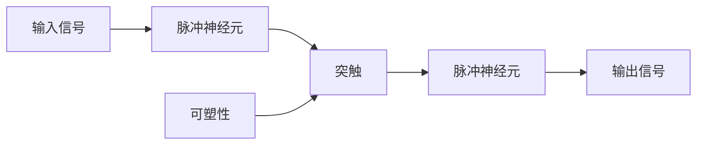

# 神经形态计算:低功耗AI硬件的新范式

> 关键词：神经形态计算、低功耗AI硬件、新范式、神经网络、脉冲神经元

> 摘要：本文深入探讨了神经形态计算这一低功耗AI硬件的新范式。首先介绍了神经形态计算的背景，包括目的范围、预期读者等内容。接着阐述了核心概念与联系，通过文本示意图和Mermaid流程图进行清晰展示。详细讲解了核心算法原理及具体操作步骤，并用Python代码进行说明。给出了相关数学模型和公式并举例。通过项目实战展示代码实际案例和详细解释。分析了实际应用场景，推荐了学习、开发工具和相关论文著作。最后总结了未来发展趋势与挑战，还包含常见问题解答和扩展阅读参考资料，旨在为读者全面呈现神经形态计算这一新兴领域。

## 1. 背景介绍 
### 1.1 目的和范围
随着人工智能（AI）技术的飞速发展，对计算能力的需求呈指数级增长。传统的冯·诺依曼架构计算系统在处理复杂的AI任务时，面临着功耗高、效率低等问题。神经形态计算作为一种新的计算范式，旨在模仿人脑的神经结构和功能，为低功耗AI硬件的发展提供了新的思路。本文的目的是全面介绍神经形态计算的基本概念、算法原理、实际应用等方面，探讨其作为低功耗AI硬件新范式的潜力和挑战。范围涵盖了神经形态计算的理论基础、技术实现以及在不同领域的应用案例。

### 1.2 预期读者
本文的预期读者包括计算机科学、电子工程、人工智能等领域的研究人员、工程师和学生。对于对新兴计算技术感兴趣，特别是关注低功耗AI硬件发展的专业人士，本文将提供有价值的参考。同时，也适合对人工智能和神经科学交叉领域有一定了解，希望深入学习神经形态计算的爱好者。

### 1.3 文档结构概述
本文将按照以下结构进行组织：首先介绍神经形态计算的核心概念与联系，通过文本示意图和流程图直观展示其架构。然后详细阐述核心算法原理和具体操作步骤，并用Python代码进行说明。接着给出相关的数学模型和公式，并通过具体例子进行解释。在项目实战部分，将展示代码实际案例并进行详细解读。之后分析神经形态计算的实际应用场景。再推荐学习、开发工具和相关论文著作。最后总结神经形态计算的未来发展趋势与挑战，并提供常见问题解答和扩展阅读参考资料。

### 1.4 术语表
#### 1.4.1 核心术语定义
- **神经形态计算（Neuromorphic Computing）**：模仿人脑神经系统的结构和功能进行信息处理的计算范式，旨在实现高效、低功耗的计算。
- **脉冲神经元（Spiking Neuron）**：神经形态计算中的基本计算单元，通过脉冲信号进行信息传递和处理。
- **突触（Synapse）**：连接神经元的结构，用于传递和调节神经元之间的信号。
- **可塑性（Plasticity）**：神经元和突触的特性，使其能够根据输入信号和活动历史改变自身的状态和连接强度。
- **低功耗AI硬件（Low-power AI Hardware）**：旨在降低人工智能计算过程中的功耗，提高能源利用效率的硬件设备。

#### 1.4.2 相关概念解释
- **生物神经系统**：人类和动物的神经系统是由大量的神经元和突触组成的复杂网络，能够高效地处理各种信息，具有高度的并行性、自适应性和容错性。神经形态计算借鉴了生物神经系统的这些特性，以实现更高效的计算。
- **人工智能**：研究如何使计算机系统能够模拟人类的智能行为，包括学习、推理、决策等。神经形态计算为人工智能的发展提供了一种新的硬件实现方式，有望解决传统计算架构在处理复杂AI任务时的瓶颈。
- **冯·诺依曼架构**：传统计算机的主流架构，其特点是将计算和存储分离，通过总线进行数据传输。这种架构在处理大规模数据和复杂计算时存在功耗高、效率低的问题，而神经形态计算试图打破这种架构的限制。

#### 1.4.3 缩略词列表
- **ANN**：Artificial Neural Network，人工神经网络
- **SNN**：Spiking Neural Network，脉冲神经网络
- **CMOS**：Complementary Metal-Oxide-Semiconductor，互补金属氧化物半导体

## 2. 核心概念与联系 

神经形态计算的核心概念主要围绕着模仿生物神经系统的结构和功能来构建计算系统。其核心要素包括脉冲神经元、突触和可塑性。

### 文本示意图
生物神经系统中，神经元通过树突接收来自其他神经元的信号，经过细胞体的处理后，通过轴突将脉冲信号传递给其他神经元，而突触则调节着神经元之间信号的传递强度。在神经形态计算中，脉冲神经元对应着计算单元，突触对应着连接这些计算单元的通道，可塑性则使得这些连接能够根据系统的活动进行动态调整。

可以用以下示意图来表示：

```plaintext
          输入信号
             │
             ▼
      ┌─────────────┐
      │  脉冲神经元  │
      └─────────────┘
             │
             ▼
       ┌────────┐
       │  突触  │
       └────────┘
             │
             ▼
      ┌─────────────┐
      │  脉冲神经元  │
      └─────────────┘
             │
             ▼
          输出信号
```

### Mermaid流程图


在这个流程图中，输入信号首先进入脉冲神经元，经过处理后通过突触传递到下一个脉冲神经元，最终产生输出信号。而可塑性则影响着突触的连接强度，使得整个系统能够根据输入和活动历史进行自适应调整。

## 3. 核心算法原理 & 具体操作步骤 

### 脉冲神经元模型
脉冲神经元是神经形态计算的基本计算单元，常见的脉冲神经元模型有积分-放电（Integrate-and-Fire，I&F）模型。下面是该模型的Python代码实现：

```python
import numpy as np
import matplotlib.pyplot as plt

# 定义积分-放电神经元类
class IntegrateAndFireNeuron:
    def __init__(self, tau=10, v_th=1.0, v_rest=0.0):
        # 膜时间常数
        self.tau = tau
        # 阈值电压
        self.v_th = v_th
        # 静息电压
        self.v_rest = v_rest
        # 初始电压
        self.v = v_rest
        # 时间步长
        self.dt = 1.0

    def update(self, I):
        # 根据积分-放电模型更新电压
        dv = (-(self.v - self.v_rest) + I) * (self.dt / self.tau)
        self.v += dv
        # 判断是否产生脉冲
        if self.v >= self.v_th:
            spike = 1
            self.v = self.v_rest
        else:
            spike = 0
        return spike

# 模拟神经元活动
neuron = IntegrateAndFireNeuron()
time_steps = 100
input_current = np.ones(time_steps) * 1.5
spikes = []

for I in input_current:
    spike = neuron.update(I)
    spikes.append(spike)

# 绘制结果
plt.figure(figsize=(10, 6))
plt.subplot(2, 1, 1)
plt.plot(input_current)
plt.title('Input Current')
plt.xlabel('Time Step')
plt.ylabel('Current')

plt.subplot(2, 1, 2)
plt.plot(spikes)
plt.title('Spike Train')
plt.xlabel('Time Step')
plt.ylabel('Spike')

plt.tight_layout()
plt.show()
```

### 算法原理
积分-放电模型的基本思想是将神经元的膜电位看作一个积分器，不断对输入电流进行积分。当膜电位达到阈值时，神经元产生一个脉冲，然后膜电位重置为静息电位。具体来说，膜电位的更新公式为：

$\frac{dv}{dt}=\frac{-(v - v_{rest})+I}{\tau}$

其中，$v$ 是膜电位，$v_{rest}$ 是静息电位，$I$ 是输入电流，$\tau$ 是膜时间常数。

### 具体操作步骤
1. 初始化神经元的参数，包括膜时间常数 $\tau$、阈值电压 $v_{th}$ 和静息电压 $v_{rest}$。
2. 在每个时间步长内，根据输入电流 $I$ 计算膜电位的变化 $\frac{dv}{dt}$。
3. 更新膜电位 $v$。
4. 判断膜电位是否达到阈值 $v_{th}$，如果达到则产生一个脉冲，将膜电位重置为静息电位；否则不产生脉冲。
5. 重复步骤2-4，直到模拟结束。

## 4. 数学模型和公式 & 详细讲解 & 举例说明 

### 积分-放电模型公式
积分-放电模型的数学公式为：

$\frac{dv}{dt}=\frac{-(v - v_{rest})+I}{\tau}$

其中：
- $v$ 是神经元的膜电位，它随时间变化。
- $v_{rest}$ 是神经元的静息电位，当没有输入信号时，膜电位会趋向于这个值。
- $I$ 是输入电流，它可以来自其他神经元或外部刺激。
- $\tau$ 是膜时间常数，它决定了膜电位对输入电流的响应速度。

### 详细讲解
这个公式描述了神经元膜电位的动态变化过程。等式右边的第一项 $-(v - v_{rest})$ 表示膜电位有回到静息电位的趋势，这是由于细胞膜的漏电特性。第二项 $I$ 表示输入电流对膜电位的影响。整个式子除以 $\tau$ 表示这种变化的速度受到膜时间常数的限制。

当输入电流 $I$ 持续存在时，膜电位会逐渐上升。当膜电位达到阈值电压 $v_{th}$ 时，神经元会产生一个脉冲，然后膜电位会迅速重置为静息电位 $v_{rest}$。

### 举例说明
假设一个神经元的参数为：$\tau = 10$ ms，$v_{rest} = 0$ mV，$v_{th} = 1$ mV。输入电流 $I = 1.5$ mV 持续施加。

在初始时刻，$v = v_{rest} = 0$ mV。

根据公式 $\frac{dv}{dt}=\frac{-(v - v_{rest})+I}{\tau}$，在第一个时间步长（$dt = 1$ ms）内：

$\frac{dv}{dt}=\frac{-(0 - 0)+1.5}{10}=0.15$ mV/ms

所以膜电位的变化 $\Delta v=\frac{dv}{dt}\times dt = 0.15$ mV，更新后的膜电位 $v = 0 + 0.15 = 0.15$ mV。

随着时间的推移，膜电位会不断上升，直到达到阈值电压 $v_{th} = 1$ mV，此时神经元产生一个脉冲，膜电位重置为 $v_{rest} = 0$ mV。

## 5. 项目实战：代码实际案例和详细解释说明 

### 5.1  开发环境搭建
为了实现基于神经形态计算的项目，我们可以使用Python作为开发语言，并借助一些常用的科学计算库。以下是具体的搭建步骤：

1. **安装Python**：可以从Python官方网站（https://www.python.org/downloads/）下载并安装适合你操作系统的Python版本，建议安装Python 3.7及以上版本。
2. **安装必要的库**：使用pip命令安装所需的库，包括NumPy、Matplotlib等。

```bash
pip install numpy matplotlib
```

### 5.2  源代码详细实现和代码解读
我们将实现一个简单的脉冲神经网络（SNN）来进行模式识别。以下是完整的代码：

```python
import numpy as np
import matplotlib.pyplot as plt

# 定义积分-放电神经元类
class IntegrateAndFireNeuron:
    def __init__(self, tau=10, v_th=1.0, v_rest=0.0):
        self.tau = tau
        self.v_th = v_th
        self.v_rest = v_rest
        self.v = v_rest
        self.dt = 1.0

    def update(self, I):
        dv = (-(self.v - self.v_rest) + I) * (self.dt / self.tau)
        self.v += dv
        if self.v >= self.v_th:
            spike = 1
            self.v = self.v_rest
        else:
            spike = 0
        return spike

# 定义脉冲神经网络类
class SpikingNeuralNetwork:
    def __init__(self, num_inputs, num_neurons):
        # 初始化突触权重
        self.weights = np.random.rand(num_inputs, num_neurons)
        self.neurons = [IntegrateAndFireNeuron() for _ in range(num_neurons)]

    def forward(self, input_spikes):
        outputs = []
        for i, neuron in enumerate(self.neurons):
            # 计算输入电流
            input_current = np.dot(input_spikes, self.weights[:, i])
            # 更新神经元状态
            spike = neuron.update(input_current)
            outputs.append(spike)
        return np.array(outputs)

# 生成输入模式
input_patterns = [
    np.array([1, 0, 1, 0]),
    np.array([0, 1, 0, 1])
]

# 创建脉冲神经网络
num_inputs = len(input_patterns[0])
num_neurons = 2
snn = SpikingNeuralNetwork(num_inputs, num_neurons)

# 模拟网络活动
time_steps = 10
output_spikes = []

for t in range(time_steps):
    input_spikes = input_patterns[t % len(input_patterns)]
    output = snn.forward(input_spikes)
    output_spikes.append(output)

output_spikes = np.array(output_spikes)

# 绘制结果
plt.figure(figsize=(10, 6))
plt.imshow(output_spikes.T, aspect='auto', cmap='gray')
plt.title('Output Spike Patterns')
plt.xlabel('Time Step')
plt.ylabel('Neuron')
plt.show()
```

### 代码解读与分析
1. **IntegrateAndFireNeuron类**：实现了积分-放电神经元模型，包括膜电位的更新和脉冲的产生。
2. **SpikingNeuralNetwork类**：定义了一个简单的脉冲神经网络，包含突触权重和多个积分-放电神经元。
3. **forward方法**：实现了网络的前向传播过程，根据输入的脉冲模式计算每个神经元的输入电流，并更新神经元的状态，最终输出脉冲模式。
4. **输入模式生成**：定义了两个输入模式，在模拟过程中循环使用。
5. **模拟网络活动**：在多个时间步长内，将输入模式输入到网络中，记录每个时间步的输出脉冲模式。
6. **结果可视化**：使用Matplotlib库将输出脉冲模式以图像的形式展示出来。

通过这个项目实战，我们可以看到如何使用脉冲神经网络进行简单的模式识别，并且了解了神经形态计算在实际应用中的基本实现过程。

## 6. 实际应用场景 
神经形态计算作为一种新兴的计算范式，具有低功耗、高效能等优点，在多个领域有着广泛的应用前景。

### 智能物联网（IoT）
在智能物联网设备中，由于设备通常需要长时间运行且依赖电池供电，对功耗的要求非常高。神经形态计算可以用于实现智能传感器和边缘计算设备，例如在智能家居系统中，通过神经形态芯片对环境数据（如温度、湿度、光照等）进行实时处理和分析，实现智能控制和节能优化。在智能交通系统中，神经形态计算可以用于车辆传感器的数据处理，实现自动驾驶和交通流量监测，同时降低设备的功耗。

### 医疗健康
在医疗领域，神经形态计算可以用于生物信号处理和疾病诊断。例如，对脑电图（EEG）、心电图（ECG）等生物电信号进行实时分析，通过模仿人脑的处理方式，更准确地检测出异常信号和疾病特征。此外，神经形态计算还可以用于开发智能假肢和神经接口设备，实现更自然、高效的人机交互。

### 机器人技术
机器人需要在复杂的环境中实时感知、决策和行动，对计算能力和能源效率有很高的要求。神经形态计算可以为机器人提供更强大的感知和认知能力，例如在机器人视觉系统中，通过脉冲神经网络实现目标识别和场景理解，同时降低计算功耗。在机器人运动控制方面，神经形态计算可以模仿生物神经系统的运动控制机制，实现更灵活、高效的运动规划和控制。

### 国防安全
在国防安全领域，神经形态计算可以用于情报分析、目标检测和识别等任务。例如，对大量的图像、视频和音频数据进行实时处理和分析，快速识别出潜在的威胁目标。此外，神经形态计算还可以用于开发自主无人系统，如无人机和无人车辆，提高其在复杂环境中的生存能力和作战效能。

## 7. 工具和资源推荐
### 7.1 学习资源推荐
#### 7.1.1 书籍推荐
- 《Neuromorphic Engineering: Principles and Practices》：全面介绍了神经形态工程的基本原理和实践方法，涵盖了从生物神经系统到硬件实现的各个方面。
- 《Spiking Neural Networks: An Introduction》：详细介绍了脉冲神经网络的理论和应用，是学习神经形态计算的重要参考书籍。
- 《Neural Networks and Deep Learning》：虽然主要侧重于传统的人工神经网络，但其中的一些概念和方法对理解神经形态计算也有很大的帮助。

#### 7.1.2 在线课程
- Coursera上的“Neural Networks and Deep Learning”课程：由深度学习领域的知名专家Andrew Ng教授授课，系统地介绍了神经网络和深度学习的基础知识。
- edX上的“Neuromorphic Computing”课程：专门针对神经形态计算进行了深入讲解，包括理论原理、硬件实现和应用案例。
- Udemy上的“Introduction to Spiking Neural Networks”课程：以实践为导向，通过大量的代码示例帮助学习者掌握脉冲神经网络的编程实现。

#### 7.1.3 技术博客和网站
- Neuromorphic Computing Foundation（https://neuromorphic.info/）：提供了神经形态计算领域的最新研究成果、会议信息和技术资源。
- IEEE Transactions on Neural Networks and Learning Systems：发表了大量关于神经网络和神经形态计算的高质量学术论文。
- Medium上的“Neuromorphic Computing”专栏：汇集了众多专家和爱好者的文章，分享了神经形态计算的最新进展和应用案例。

### 7.2 开发工具框架推荐
#### 7.2.1 IDE和编辑器
- PyCharm：功能强大的Python集成开发环境，提供了代码编辑、调试、版本控制等一系列功能，适合开发基于Python的神经形态计算项目。
- Jupyter Notebook：交互式的开发环境，支持代码、文本、图表等多种形式的展示，非常适合进行实验和数据分析，在神经形态计算的研究和开发中广泛使用。
- Visual Studio Code：轻量级的代码编辑器，具有丰富的插件生态系统，可以方便地进行Python代码的编写和调试。

#### 7.2.2 调试和性能分析工具
- TensorBoard：用于可视化深度学习模型的训练过程和性能指标，在神经形态计算中可以用于分析脉冲神经网络的训练效果和性能表现。
- Profiler in PyTorch：PyTorch提供的性能分析工具，可以帮助开发者找出代码中的性能瓶颈，优化代码的运行效率。
- Intel VTune Profiler：一款专业的性能分析工具，可用于分析硬件层面的性能问题，对于神经形态计算硬件的开发和优化非常有帮助。

#### 7.2.3 相关框架和库
- Brian2：专门用于模拟脉冲神经网络的Python库，提供了简单易用的API，支持多种脉冲神经元模型和突触可塑性规则。
- Nengo：一个用于构建和模拟神经模型的Python库，结合了神经网络和控制理论的方法，可以方便地实现神经形态计算系统。
- PyTorch-SNN：基于PyTorch的脉冲神经网络框架，利用PyTorch的自动求导和并行计算能力，加速脉冲神经网络的训练和推理过程。

### 7.3 相关论文著作推荐
#### 7.3.1 经典论文
- “A logical calculus of the ideas immanent in nervous activity” by Warren S. McCulloch and Walter Pitts (1943)：提出了最早的人工神经元模型，为神经网络的发展奠定了基础。
- “A theory of Pavlovian conditioning: Variations in the effectiveness of reinforcement and nonreinforcement” by Robert A. Rescorla and Allan R. Wagner (1972)：提出了Rescorla-Wagner模型，是研究突触可塑性的经典理论。
- “Spike-timing-dependent plasticity: a Hebbian learning rule” by Henry Markram, Jeannette Lubke, Michael Frotscher, and Bert Sakmann (1997)：首次提出了脉冲时序依赖可塑性（STDP）的概念，对神经形态计算的发展产生了深远影响。

#### 7.3.2 最新研究成果
- 关注NeurIPS、ICML、CVPR等顶级学术会议上发表的关于神经形态计算的论文，这些论文代表了该领域的最新研究动态和技术趋势。
- 阅读Nature、Science、IEEE Transactions on Neural Networks and Learning Systems等学术期刊上的相关研究成果，了解神经形态计算在理论和应用方面的最新突破。

#### 7.3.3 应用案例分析
- 研究一些实际应用案例，如IBM的TrueNorth芯片在智能物联网和机器人领域的应用，了解神经形态计算在实际场景中的实现方法和效果。
- 分析一些科研项目的成果报告，如欧盟的Human Brain Project中关于神经形态计算的研究应用，学习如何将神经形态计算技术应用于复杂的系统和问题中。

## 8. 总结：未来发展趋势与挑战
### 未来发展趋势
- **硬件集成化**：随着半导体技术的不断发展，神经形态计算芯片将朝着更高的集成度和更小的尺寸方向发展。未来的神经形态芯片可能会集成更多的脉冲神经元和突触，实现更复杂的神经功能，同时降低功耗和成本。
- **与其他技术融合**：神经形态计算将与人工智能、物联网、量子计算等技术深度融合。例如，与人工智能的结合将进一步提升智能系统的学习能力和认知水平；与物联网的融合将实现更高效的边缘计算和智能传感；与量子计算的结合可能会带来计算能力的巨大突破。
- **应用拓展**：神经形态计算的应用领域将不断拓展，除了现有的智能物联网、医疗健康、机器人技术等领域，还将在金融、教育、娱乐等领域发挥重要作用。例如，在金融领域可以用于风险评估和投资决策；在教育领域可以用于个性化学习和智能辅导。

### 挑战
- **理论基础不完善**：虽然神经形态计算已经取得了一定的进展，但目前的理论基础还不够完善。例如，对于生物神经系统的复杂机制还没有完全理解，如何更好地模仿生物神经系统的功能和特性仍然是一个挑战。
- **硬件实现困难**：神经形态计算芯片的设计和制造面临着诸多技术难题，如器件的一致性、可靠性和可扩展性等。此外，如何将神经形态计算芯片与传统的计算系统进行集成也是一个需要解决的问题。
- **算法优化**：现有的神经形态计算算法还存在效率不高、精度不够等问题，需要进一步优化和改进。如何设计出更高效、更智能的算法，以充分发挥神经形态计算的优势，是未来研究的重点之一。

## 9. 附录：常见问题与解答
### 问题1：神经形态计算与传统的人工神经网络有什么区别？
答：传统的人工神经网络通常基于连续的数值计算，使用梯度下降等方法进行训练。而神经形态计算模仿生物神经系统的脉冲信号传递和处理方式，使用脉冲神经元和突触进行信息处理。神经形态计算更注重模拟生物神经系统的动态特性和自适应能力，具有低功耗、高效能等优点。

### 问题2：神经形态计算的硬件实现有哪些方式？
答：神经形态计算的硬件实现方式主要包括基于CMOS技术的芯片设计、忆阻器等新兴器件的应用。CMOS技术可以利用现有的半导体制造工艺，实现大规模的脉冲神经元和突触的集成。忆阻器具有非易失性和可调节电阻的特性，可以模拟突触的可塑性，为神经形态计算提供了新的硬件实现途径。

### 问题3：如何评估神经形态计算系统的性能？
答：评估神经形态计算系统的性能可以从多个方面进行，如计算效率、功耗、准确率、可扩展性等。计算效率可以通过每秒执行的操作数来衡量；功耗可以通过测量系统的能耗来评估；准确率可以通过与实际结果的对比来计算；可扩展性则考虑系统在规模增大时的性能表现。

### 问题4：神经形态计算在实际应用中面临哪些挑战？
答：在实际应用中，神经形态计算面临着理论基础不完善、硬件实现困难、算法优化等挑战。此外，还需要解决与现有系统的兼容性问题，以及如何将神经形态计算技术转化为实际产品和服务的问题。

## 10. 扩展阅读 & 参考资料
- 相关学术论文：可以通过IEEE Xplore、ACM Digital Library等学术数据库搜索关于神经形态计算的最新研究论文。
- 行业报告：关注市场研究机构发布的关于人工智能、半导体等领域的行业报告，了解神经形态计算的市场趋势和应用前景。
- 开源项目：在GitHub等开源代码托管平台上搜索与神经形态计算相关的开源项目，学习他人的代码实现和经验。

作者：AI天才研究院/AI Genius Institute & 禅与计算机程序设计艺术 /Zen And The Art of Computer Programming