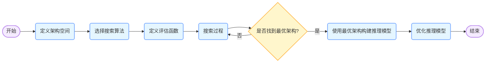

# 神经架构搜索优化推理模型的探索

> 关键词：神经架构搜索、推理模型、优化、深度学习、自动机器学习

> 摘要：本文围绕神经架构搜索优化推理模型展开深入探索。首先介绍了研究的背景、目的、预期读者和文档结构等信息，明确了相关术语。接着阐述了神经架构搜索和推理模型的核心概念及其联系，并给出了相应的原理和架构示意图与流程图。详细讲解了核心算法原理，结合Python代码进行说明，同时介绍了相关的数学模型和公式。通过项目实战案例，展示了如何搭建开发环境、实现源代码并进行解读分析。探讨了神经架构搜索优化推理模型在多个实际场景中的应用，推荐了学习资源、开发工具框架和相关论文著作。最后总结了未来发展趋势与挑战，提供了常见问题解答和扩展阅读参考资料，旨在为相关领域的研究和实践提供全面且深入的指导。

## 1. 背景介绍 
### 1.1 目的和范围
随着深度学习技术的飞速发展，神经网络架构的设计变得越来越复杂。传统的手动设计神经网络架构需要大量的专业知识和经验，且耗时费力。神经架构搜索（Neural Architecture Search, NAS）作为一种自动设计神经网络架构的技术应运而生，旨在通过自动化的方式找到最优的神经网络架构，提高模型的性能和效率。

本文的目的是深入探索神经架构搜索在优化推理模型方面的应用。我们将研究神经架构搜索的核心算法和原理，探讨如何利用神经架构搜索来优化推理模型的性能、降低计算成本和提高推理速度。同时，通过实际项目案例展示神经架构搜索在优化推理模型中的具体应用和效果。

本文的范围涵盖了神经架构搜索的基本概念、核心算法、数学模型、项目实战、实际应用场景以及相关的工具和资源推荐等方面。

### 1.2 预期读者
本文的预期读者包括深度学习领域的研究人员、工程师、数据科学家以及对神经架构搜索和推理模型优化感兴趣的技术爱好者。对于初学者，本文可以作为入门教程，帮助他们了解神经架构搜索的基本概念和方法；对于有一定经验的专业人士，本文可以提供更深入的技术分析和实践案例，为他们的研究和工作提供参考。

### 1.3 文档结构概述
本文的文档结构如下：
1. **背景介绍**：介绍研究的目的、范围、预期读者和文档结构，明确相关术语。
2. **核心概念与联系**：阐述神经架构搜索和推理模型的核心概念，分析它们之间的联系，并给出原理和架构示意图与流程图。
3. **核心算法原理 & 具体操作步骤**：详细讲解神经架构搜索的核心算法原理，结合Python代码进行说明，并给出具体的操作步骤。
4. **数学模型和公式 & 详细讲解 & 举例说明**：介绍神经架构搜索和推理模型的数学模型和公式，进行详细讲解，并通过具体例子进行说明。
5. **项目实战：代码实际案例和详细解释说明**：通过实际项目案例，展示如何搭建开发环境、实现源代码并进行解读分析。
6. **实际应用场景**：探讨神经架构搜索优化推理模型在多个实际场景中的应用。
7. **工具和资源推荐**：推荐学习资源、开发工具框架和相关论文著作。
8. **总结：未来发展趋势与挑战**：总结神经架构搜索优化推理模型的未来发展趋势和面临的挑战。
9. **附录：常见问题与解答**：提供常见问题的解答。
10. **扩展阅读 & 参考资料**：提供扩展阅读的建议和参考资料。

### 1.4 术语表
#### 1.4.1 核心术语定义
- **神经架构搜索（Neural Architecture Search, NAS）**：一种自动设计神经网络架构的技术，通过搜索算法在架构空间中寻找最优的神经网络架构。
- **推理模型**：用于对新数据进行预测或分类的模型，通常在训练模型完成后使用。
- **架构空间**：所有可能的神经网络架构的集合，神经架构搜索算法在这个空间中进行搜索。
- **评估函数**：用于评估一个神经网络架构性能的函数，通常使用验证集上的准确率、损失值等指标。
- **搜索算法**：用于在架构空间中搜索最优架构的算法，如遗传算法、强化学习算法等。

#### 1.4.2 相关概念解释
- **自动机器学习（AutoML）**：一种自动化机器学习过程的技术，包括数据预处理、特征工程、模型选择和超参数调优等任务。神经架构搜索是自动机器学习的一个重要组成部分。
- **深度学习**：一种基于神经网络的机器学习方法，通过构建多层神经网络来学习数据的特征和模式。
- **卷积神经网络（Convolutional Neural Network, CNN）**：一种专门用于处理具有网格结构数据（如图像、音频等）的神经网络，在图像识别、目标检测等领域取得了广泛的应用。
- **循环神经网络（Recurrent Neural Network, RNN）**：一种用于处理序列数据的神经网络，能够捕捉序列数据中的时间依赖关系，在自然语言处理、语音识别等领域有重要应用。

#### 1.4.3 缩略词列表
- **NAS**：Neural Architecture Search（神经架构搜索）
- **CNN**：Convolutional Neural Network（卷积神经网络）
- **RNN**：Recurrent Neural Network（循环神经网络）
- **AutoML**：Automated Machine Learning（自动机器学习）

## 2. 核心概念与联系 
### 2.1 神经架构搜索的核心概念
神经架构搜索的目标是在架构空间中找到最优的神经网络架构，使得模型在给定的数据集上具有最佳的性能。架构空间可以包含各种类型的神经网络层，如卷积层、全连接层、池化层等，以及它们的不同组合和参数设置。

神经架构搜索的基本流程包括以下几个步骤：
1. **定义架构空间**：确定所有可能的神经网络架构的集合。
2. **选择搜索算法**：如遗传算法、强化学习算法、随机搜索等，用于在架构空间中搜索最优架构。
3. **定义评估函数**：用于评估每个候选架构的性能。
4. **搜索过程**：使用搜索算法在架构空间中生成候选架构，并使用评估函数对其进行评估，根据评估结果更新搜索策略，直到找到最优架构。

### 2.2 推理模型的核心概念
推理模型是指在训练模型完成后，用于对新数据进行预测或分类的模型。推理模型的性能直接影响到实际应用的效果，因此需要对其进行优化。推理模型的优化主要包括以下几个方面：
1. **提高模型的准确率**：通过选择合适的神经网络架构和训练方法，提高模型在测试集上的准确率。
2. **降低计算成本**：减少模型的参数数量和计算复杂度，降低推理过程中的计算成本。
3. **提高推理速度**：优化模型的结构和算法，提高推理过程的速度。

### 2.3 神经架构搜索与推理模型的联系
神经架构搜索可以为推理模型提供最优的神经网络架构，从而提高推理模型的性能。通过在架构空间中搜索最优架构，可以找到更适合特定任务和数据集的模型结构，减少模型的参数数量和计算复杂度，提高模型的准确率和推理速度。

例如，在图像分类任务中，神经架构搜索可以自动搜索出具有最佳性能的卷积神经网络架构，使得推理模型在图像分类任务上具有更高的准确率和更快的推理速度。

### 2.4 核心概念原理和架构的文本示意图 
```plaintext
+---------------------+
| 神经架构搜索         |
| +----------------+  |
| | 定义架构空间   |  |
| +----------------+  |
| +----------------+  |
| | 选择搜索算法   |  |
| +----------------+  |
| +----------------+  |
| | 定义评估函数   |  |
| +----------------+  |
| +----------------+  |
| | 搜索过程       |  |
| +----------------+  |
+---------------------+
                |
                v
+---------------------+
| 推理模型优化         |
| +----------------+  |
| | 提高准确率     |  |
| +----------------+  |
| +----------------+  |
| | 降低计算成本   |  |
| +----------------+  |
| +----------------+  |
| | 提高推理速度   |  |
| +----------------+  |
+---------------------+
```

### 2.5 Mermaid 流程图


## 3. 核心算法原理 & 具体操作步骤 
### 3.1 随机搜索算法原理
随机搜索是一种简单而有效的神经架构搜索算法。其基本原理是在架构空间中随机生成候选架构，并使用评估函数对其进行评估，记录下性能最好的架构。

随机搜索算法的具体步骤如下：
1. 初始化一个空的最优架构列表和最优性能值。
2. 重复以下步骤直到达到最大搜索次数：
    - 从架构空间中随机生成一个候选架构。
    - 使用评估函数对候选架构进行评估，得到其性能值。
    - 如果候选架构的性能值优于当前最优性能值，则更新最优架构列表和最优性能值。
3. 返回最优架构列表中的架构。

### 3.2 Python 代码实现
```python
import random

# 定义架构空间
architecture_space = [
    {'layers': [('conv', 32, 3), ('pool', 2), ('fc', 128)], 'learning_rate': 0.001},
    {'layers': [('conv', 64, 3), ('pool', 2), ('fc', 256)], 'learning_rate': 0.0001},
    {'layers': [('conv', 128, 3), ('pool', 2), ('fc', 512)], 'learning_rate': 0.00001}
]

# 定义评估函数（这里简单模拟，实际应用中需要根据具体任务实现）
def evaluate_architecture(architecture):
    # 模拟评估过程，返回一个随机的性能值
    return random.random()

# 随机搜索算法
def random_search(max_trials):
    best_architecture = None
    best_performance = -float('inf')
    for _ in range(max_trials):
        # 从架构空间中随机选择一个架构
        candidate_architecture = random.choice(architecture_space)
        # 评估候选架构的性能
        performance = evaluate_architecture(candidate_architecture)
        if performance > best_performance:
            best_performance = performance
            best_architecture = candidate_architecture
    return best_architecture

# 运行随机搜索算法
max_trials = 10
best_architecture = random_search(max_trials)
print("最优架构:", best_architecture)
```

### 3.3 具体操作步骤
1. **定义架构空间**：根据具体任务和需求，定义所有可能的神经网络架构的集合。可以包括不同类型的神经网络层、层的参数设置等。
2. **实现评估函数**：根据具体任务，实现一个评估函数，用于评估每个候选架构的性能。评估函数可以使用验证集上的准确率、损失值等指标。
3. **运行随机搜索算法**：设置最大搜索次数，调用随机搜索算法进行搜索，得到最优架构。
4. **使用最优架构构建推理模型**：使用得到的最优架构构建推理模型，并进行训练和测试。

## 4. 数学模型和公式 & 详细讲解 & 举例说明 
### 4.1 评估函数的数学模型
评估函数用于评估一个神经网络架构的性能，通常可以表示为一个关于架构参数 $\theta$ 和数据集 $D$ 的函数 $f(\theta, D)$。在分类任务中，常用的评估指标是准确率，其数学公式可以表示为：

$$
\text{Accuracy} = \frac{\text{正确分类的样本数}}{\text{总样本数}}
$$

在回归任务中，常用的评估指标是均方误差（Mean Squared Error, MSE），其数学公式可以表示为：

$$
\text{MSE} = \frac{1}{n} \sum_{i=1}^{n} (y_i - \hat{y}_i)^2
$$

其中，$n$ 是样本数，$y_i$ 是真实值，$\hat{y}_i$ 是预测值。

### 4.2 搜索算法的优化目标
神经架构搜索的优化目标是找到最优的架构参数 $\theta^*$，使得评估函数 $f(\theta, D)$ 取得最大值（对于准确率等指标）或最小值（对于损失值等指标）。可以表示为以下优化问题：

$$
\theta^* = \arg \max_{\theta} f(\theta, D) \quad \text{或} \quad \theta^* = \arg \min_{\theta} f(\theta, D)
$$

### 4.3 举例说明
假设我们有一个简单的图像分类任务，使用卷积神经网络进行分类。我们的架构空间包含不同数量的卷积层和全连接层，以及不同的学习率。我们使用验证集上的准确率作为评估函数。

假设我们有一个候选架构 $\theta_1$，在验证集上的准确率为 $0.8$；另一个候选架构 $\theta_2$，在验证集上的准确率为 $0.9$。根据评估函数，我们可以选择 $\theta_2$ 作为更优的架构。

在实际应用中，我们可以使用随机搜索算法在架构空间中搜索最优架构。每次随机生成一个候选架构，计算其在验证集上的准确率，记录下准确率最高的架构作为最优架构。

## 5. 项目实战：代码实际案例和详细解释说明 
### 5.1  开发环境搭建
#### 5.1.1 安装 Python
首先，确保你已经安装了 Python 3.x 版本。可以从 Python 官方网站（https://www.python.org/downloads/） 下载并安装。

#### 5.1.2 安装深度学习框架
我们使用 PyTorch 作为深度学习框架。可以使用以下命令安装 PyTorch：
```bash
pip install torch torchvision
```

#### 5.1.3 安装其他依赖库
安装其他必要的依赖库，如 NumPy、Matplotlib 等：
```bash
pip install numpy matplotlib
```

### 5.2  源代码详细实现和代码解读
```python
import torch
import torch.nn as nn
import torch.optim as optim
from torchvision import datasets, transforms
import random

# 定义架构空间
architecture_space = [
    {'layers': [('conv', 32, 3), ('pool', 2), ('fc', 128)], 'learning_rate': 0.001},
    {'layers': [('conv', 64, 3), ('pool', 2), ('fc', 256)], 'learning_rate': 0.0001},
    {'layers': [('conv', 128, 3), ('pool', 2), ('fc', 512)], 'learning_rate': 0.00001}
]

# 定义数据集和数据加载器
transform = transforms.Compose([
    transforms.ToTensor(),
    transforms.Normalize((0.1307,), (0.3081,))
])
train_dataset = datasets.MNIST('data', train=True, download=True, transform=transform)
train_loader = torch.utils.data.DataLoader(train_dataset, batch_size=64, shuffle=True)
test_dataset = datasets.MNIST('data', train=False, transform=transform)
test_loader = torch.utils.data.DataLoader(test_dataset, batch_size=1000, shuffle=False)

# 定义神经网络模型
class Net(nn.Module):
    def __init__(self, architecture):
        super(Net, self).__init__()
        layers = []
        in_channels = 1
        for layer_type, out_channels, kernel_size in architecture['layers']:
            if layer_type == 'conv':
                layers.append(nn.Conv2d(in_channels, out_channels, kernel_size))
                layers.append(nn.ReLU())
                in_channels = out_channels
            elif layer_type == 'pool':
                layers.append(nn.MaxPool2d(kernel_size))
        layers.append(nn.Flatten())
        for i in range(len(architecture['layers']) - 1, -1, -1):
            if architecture['layers'][i][0] == 'conv':
                last_conv_out_channels = architecture['layers'][i][1]
                break
        layers.append(nn.Linear(last_conv_out_channels * 7 * 7, architecture['layers'][-1][1]))
        layers.append(nn.ReLU())
        layers.append(nn.Linear(architecture['layers'][-1][1], 10))
        self.layers = nn.Sequential(*layers)

    def forward(self, x):
        return self.layers(x)

# 定义评估函数
def evaluate_architecture(architecture):
    model = Net(architecture)
    criterion = nn.CrossEntropyLoss()
    optimizer = optim.Adam(model.parameters(), lr=architecture['learning_rate'])
    epochs = 5
    for epoch in range(epochs):
        model.train()
        for batch_idx, (data, target) in enumerate(train_loader):
            optimizer.zero_grad()
            output = model(data)
            loss = criterion(output, target)
            loss.backward()
            optimizer.step()
    model.eval()
    correct = 0
    total = 0
    with torch.no_grad():
        for data, target in test_loader:
            output = model(data)
            _, predicted = torch.max(output.data, 1)
            total += target.size(0)
            correct += (predicted == target).sum().item()
    accuracy = correct / total
    return accuracy

# 随机搜索算法
def random_search(max_trials):
    best_architecture = None
    best_accuracy = -float('inf')
    for _ in range(max_trials):
        candidate_architecture = random.choice(architecture_space)
        accuracy = evaluate_architecture(candidate_architecture)
        if accuracy > best_accuracy:
            best_accuracy = accuracy
            best_architecture = candidate_architecture
    return best_architecture

# 运行随机搜索算法
max_trials = 3
best_architecture = random_search(max_trials)
print("最优架构:", best_architecture)
```

### 5.3  代码解读与分析
#### 5.3.1 架构空间定义
`architecture_space` 列表定义了所有可能的神经网络架构，每个架构包含卷积层、池化层和全连接层的设置，以及学习率。

#### 5.3.2 数据集和数据加载器
使用 `torchvision` 库加载 MNIST 数据集，并创建训练集和测试集的数据加载器。

#### 5.3.3 神经网络模型定义
`Net` 类定义了一个动态的神经网络模型，根据传入的架构参数构建不同的网络结构。

#### 5.3.4 评估函数
`evaluate_architecture` 函数用于评估一个候选架构的性能，使用交叉熵损失函数和 Adam 优化器进行训练，然后在测试集上计算准确率。

#### 5.3.5 随机搜索算法
`random_search` 函数实现了随机搜索算法，在架构空间中随机选择候选架构，调用评估函数进行评估，记录下准确率最高的架构。

#### 5.3.6 运行结果分析
运行随机搜索算法后，输出最优架构。通过比较不同架构的准确率，可以选择性能最优的架构用于推理模型。

## 6. 实际应用场景 
### 6.1 图像识别
在图像识别任务中，神经架构搜索可以自动搜索出具有最佳性能的卷积神经网络架构，提高图像识别的准确率和推理速度。例如，在人脸识别、物体检测等领域，使用优化后的推理模型可以更快速、准确地识别图像中的目标。

### 6.2 自然语言处理
在自然语言处理任务中，如文本分类、情感分析、机器翻译等，神经架构搜索可以帮助找到更适合处理自然语言数据的神经网络架构，提高模型的性能和效率。例如，使用优化后的推理模型可以更快速地处理大量的文本数据，提高文本分类的准确率。

### 6.3 语音识别
在语音识别任务中，神经架构搜索可以优化循环神经网络或卷积神经网络的架构，提高语音识别的准确率和实时性。例如，在智能语音助手、语音翻译等应用中，使用优化后的推理模型可以更准确地识别语音指令，提供更好的用户体验。

### 6.4 自动驾驶
在自动驾驶领域，神经架构搜索可以用于优化目标检测、场景感知等模型的架构，提高模型的性能和可靠性。例如，使用优化后的推理模型可以更快速、准确地检测道路上的障碍物和交通标志，为自动驾驶车辆提供更安全的决策依据。

## 7. 工具和资源推荐
### 7.1 学习资源推荐
#### 7.1.1 书籍推荐
- 《深度学习》（Deep Learning）：由 Ian Goodfellow、Yoshua Bengio 和 Aaron Courville 编写，是深度学习领域的经典教材，涵盖了神经网络、深度学习算法、优化方法等方面的内容。
- 《动手学深度学习》（Dive into Deep Learning）：由 Aston Zhang、Zachary C. Lipton、Mu Li 和 Alexander J. Smola 编写，提供了丰富的代码示例和实践项目，适合初学者快速上手深度学习。
- 《神经网络与深度学习》（Neural Networks and Deep Learning）：由 Michael Nielsen 编写，以通俗易懂的方式介绍了神经网络和深度学习的基本概念和算法。

#### 7.1.2 在线课程
- Coursera 上的《深度学习专项课程》（Deep Learning Specialization）：由 Andrew Ng 教授讲授，包括神经网络基础、卷积神经网络、循环神经网络等多个课程，是学习深度学习的经典在线课程。
- edX 上的《人工智能导论》（Introduction to Artificial Intelligence）：由麻省理工学院（MIT）的 Patrick Winston 教授讲授，介绍了人工智能的基本概念、算法和应用。
- 哔哩哔哩（B 站）上的一些深度学习相关视频教程，如李沐老师的《动手学深度学习》课程视频，提供了详细的代码讲解和实践演示。

#### 7.1.3 技术博客和网站
- Medium 上的 Towards Data Science：提供了大量关于数据科学、机器学习和深度学习的技术文章和案例分析。
- arXiv：一个预印本平台，提供了最新的学术研究论文，包括神经架构搜索、深度学习等领域的研究成果。
- 机器之心：专注于人工智能领域的科技媒体，提供了丰富的技术资讯、研究报告和行业动态。

### 7.2 开发工具框架推荐
#### 7.2.1 IDE和编辑器
- PyCharm：一款专门为 Python 开发设计的集成开发环境（IDE），提供了丰富的代码编辑、调试、版本控制等功能。
- Jupyter Notebook：一个交互式的笔记本环境，适合进行数据分析、模型训练和实验验证。可以方便地编写代码、展示结果和添加注释。
- Visual Studio Code：一款轻量级的代码编辑器，支持多种编程语言和插件扩展，具有丰富的代码编辑和调试功能。

#### 7.2.2 调试和性能分析工具
- PyTorch Profiler：PyTorch 提供的性能分析工具，可以帮助用户分析模型的计算性能、内存使用情况等，找出性能瓶颈。
- TensorBoard：TensorFlow 提供的可视化工具，也可以与 PyTorch 结合使用，用于可视化模型的训练过程、损失曲线、准确率等指标。
- NVIDIA Nsight Systems：一款用于 GPU 性能分析的工具，可以帮助用户分析 GPU 上的计算性能和内存使用情况。

#### 7.2.3 相关框架和库
- PyTorch：一个开源的深度学习框架，具有动态图机制、易于使用和调试等优点，广泛应用于学术界和工业界。
- TensorFlow：一个开源的深度学习框架，具有强大的分布式训练和部署能力，支持多种硬件平台。
- AutoGluon：一个自动机器学习框架，提供了神经架构搜索、超参数调优等功能，可以帮助用户快速构建和优化深度学习模型。

### 7.3 相关论文著作推荐
#### 7.3.1 经典论文
- 《Neural Architecture Search with Reinforcement Learning》：介绍了使用强化学习进行神经架构搜索的方法，开创了神经架构搜索领域的先河。
- 《DARTS: Differentiable Architecture Search》：提出了一种可微的神经架构搜索方法，大大提高了搜索效率。
- 《Efficient Neural Architecture Search via Parameter Sharing》：提出了通过参数共享来提高神经架构搜索效率的方法。

#### 7.3.2 最新研究成果
- 关注 arXiv 上关于神经架构搜索的最新研究论文，了解该领域的最新技术和方法。
- 参加国际机器学习会议（ICML）、神经信息处理系统大会（NeurIPS）等顶级学术会议，获取最新的研究成果和行业动态。

#### 7.3.3 应用案例分析
- 一些知名科技公司（如 Google、Microsoft、Facebook 等）发布的技术博客和研究报告，介绍了神经架构搜索在实际应用中的案例和经验。
- 开源项目和竞赛平台（如 Kaggle）上的相关项目和解决方案，提供了实际应用中的代码实现和分析。

## 8. 总结：未来发展趋势与挑战
### 8.1 未来发展趋势
#### 8.1.1 更高效的搜索算法
未来，研究人员将继续探索更高效的神经架构搜索算法，以减少搜索时间和计算成本。例如，结合元学习、进化算法等技术，提高搜索效率和搜索质量。

#### 8.1.2 跨领域的架构搜索
随着深度学习在多个领域的广泛应用，未来的神经架构搜索将不仅仅局限于单一领域，而是朝着跨领域的方向发展。例如，同时考虑图像、文本和语音等多种数据类型的架构搜索。

#### 8.1.3 自动化机器学习的集成
神经架构搜索将与自动化机器学习的其他环节（如数据预处理、特征工程、超参数调优等）更加紧密地集成，实现端到端的自动化机器学习流程。

#### 8.1.4 硬件感知的架构搜索
为了充分发挥硬件的性能，未来的神经架构搜索将考虑硬件的特性和限制，进行硬件感知的架构搜索。例如，针对不同的 GPU、TPU 等硬件平台，搜索出更适合的神经网络架构。

### 8.2 挑战
#### 8.2.1 搜索空间的爆炸式增长
随着神经网络架构的复杂性不断增加，架构空间的规模也呈指数级增长，这给神经架构搜索带来了巨大的挑战。如何有效地缩小搜索空间，提高搜索效率，是当前需要解决的问题之一。

#### 8.2.2 评估函数的准确性
评估函数的准确性直接影响到神经架构搜索的结果。然而，在实际应用中，评估函数往往存在噪声和偏差，导致搜索到的架构并非最优。如何设计更准确、更稳定的评估函数，是神经架构搜索面临的另一个挑战。

#### 8.2.3 计算资源的限制
神经架构搜索通常需要大量的计算资源和时间，这对于一些资源有限的用户来说是一个巨大的障碍。如何在有限的计算资源下进行高效的神经架构搜索，是需要解决的实际问题。

#### 8.2.4 可解释性和可泛化性
目前的神经架构搜索方法大多注重模型的性能，而忽略了模型的可解释性和可泛化性。如何设计出既具有良好性能，又具有可解释性和可泛化性的神经网络架构，是未来需要研究的重要方向。

## 9. 附录：常见问题与解答
### 9.1 神经架构搜索和手动设计架构有什么区别？
神经架构搜索是一种自动化的方法，通过搜索算法在架构空间中自动寻找最优的神经网络架构，而手动设计架构需要人工根据经验和专业知识来设计。神经架构搜索可以节省大量的时间和人力，并且有可能找到比手动设计更好的架构。

### 9.2 神经架构搜索的计算成本高吗？
神经架构搜索通常需要大量的计算资源和时间，因为需要对大量的候选架构进行评估。不过，随着研究的不断发展，出现了一些高效的搜索算法和技术，可以在一定程度上降低计算成本。

### 9.3 如何选择合适的搜索算法？
选择合适的搜索算法需要考虑多个因素，如架构空间的规模、计算资源的限制、搜索时间的要求等。随机搜索是一种简单而有效的方法，适用于小规模的架构空间；遗传算法和强化学习算法可以在大规模的架构空间中搜索，但计算成本较高。

### 9.4 神经架构搜索得到的架构一定是最优的吗？
神经架构搜索得到的架构不一定是全局最优的，因为搜索算法通常只能在有限的时间和计算资源下进行搜索，可能会陷入局部最优解。不过，通过合理设计搜索算法和评估函数，可以提高搜索到较优架构的概率。

## 10. 扩展阅读 & 参考资料
### 10.1 扩展阅读
- 《深度学习实战》（Deep Learning in Practice）：提供了更多深度学习的实际应用案例和代码实现，帮助读者加深对深度学习的理解和应用能力。
- 《人工智能：现代方法》（Artificial Intelligence: A Modern Approach）：全面介绍了人工智能的各个领域，包括机器学习、知识表示、自然语言处理等，是人工智能领域的经典教材。

### 10.2 参考资料
- [Neural Architecture Search: A Survey](https://arxiv.org/abs/1808.05377)：一篇关于神经架构搜索的综述论文，介绍了神经架构搜索的发展历程、主要方法和应用场景。
- [PyTorch官方文档](https://pytorch.org/docs/stable/index.html)：PyTorch 官方提供的详细文档，包括 API 参考、教程和示例代码。
- [TensorFlow官方文档](https://www.tensorflow.org/api_docs)：TensorFlow 官方提供的详细文档，包括 API 参考、教程和示例代码。

作者：AI天才研究院/AI Genius Institute & 禅与计算机程序设计艺术 /Zen And The Art of Computer Programming