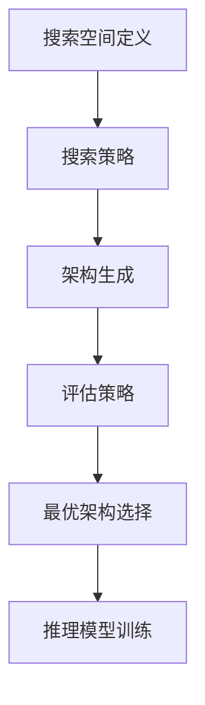

# 神经架构搜索在推理模型自动设计中的应用

> 关键词：神经架构搜索、推理模型自动设计、深度学习、自动机器学习、模型优化

> 摘要：本文深入探讨了神经架构搜索（Neural Architecture Search，NAS）在推理模型自动设计中的应用。首先介绍了相关背景知识，包括研究目的、预期读者和文档结构等。接着阐述了神经架构搜索和推理模型自动设计的核心概念及其联系，给出了原理和架构的示意图与流程图。详细讲解了核心算法原理和具体操作步骤，并使用Python代码进行了阐述。通过数学模型和公式进一步解释了其背后的理论基础，并举例说明。结合项目实战，给出了开发环境搭建、源代码实现和代码解读。分析了实际应用场景，推荐了学习资源、开发工具框架和相关论文著作。最后总结了未来发展趋势与挑战，并对常见问题进行了解答，提供了扩展阅读和参考资料，旨在为读者全面了解神经架构搜索在推理模型自动设计中的应用提供深入的技术指导。

## 1. 背景介绍 
### 1.1 目的和范围
在深度学习领域，模型架构的设计对于模型的性能起着至关重要的作用。传统上，模型架构的设计依赖于专家的经验和大量的试错，这不仅耗时耗力，而且难以找到最优的架构。神经架构搜索（NAS）作为一种自动机器学习技术，旨在自动搜索出最优的神经网络架构。本文章的目的是探讨神经架构搜索在推理模型自动设计中的应用，研究如何利用NAS技术来自动设计高效的推理模型。范围涵盖了神经架构搜索的基本概念、核心算法、数学模型，以及在实际项目中的应用案例和相关工具资源。

### 1.2 预期读者
本文预期读者包括深度学习研究者、人工智能工程师、数据科学家以及对神经架构搜索和推理模型设计感兴趣的技术人员。读者需要具备一定的机器学习和深度学习基础知识，熟悉Python编程语言和常见的深度学习框架（如TensorFlow、PyTorch等）。

### 1.3 文档结构概述
本文的结构如下：首先介绍神经架构搜索和推理模型自动设计的核心概念及其联系，包括原理和架构的示意图与流程图；接着详细讲解核心算法原理和具体操作步骤，并使用Python代码进行阐述；通过数学模型和公式进一步解释其背后的理论基础，并举例说明；结合项目实战，给出开发环境搭建、源代码实现和代码解读；分析实际应用场景；推荐学习资源、开发工具框架和相关论文著作；最后总结未来发展趋势与挑战，解答常见问题，提供扩展阅读和参考资料。

### 1.4 术语表
#### 1.4.1 核心术语定义
- **神经架构搜索（Neural Architecture Search，NAS）**：一种自动机器学习技术，通过搜索算法在给定的搜索空间中自动寻找最优的神经网络架构。
- **推理模型**：用于对新数据进行预测或分类的深度学习模型，通常在训练完成后进行部署和使用。
- **搜索空间**：包含所有可能的神经网络架构的集合，NAS算法在这个空间中进行搜索。
- **评估策略**：用于评估搜索到的神经网络架构性能的方法，通常使用验证集上的准确率、损失函数等指标。
- **优化器**：用于更新神经网络参数以最小化损失函数的算法，如随机梯度下降（SGD）、Adam等。

#### 1.4.2 相关概念解释
- **自动机器学习（AutoML）**：是一种使机器学习过程自动化的技术，包括数据预处理、特征工程、模型选择和超参数调优等。神经架构搜索是AutoML的一个重要分支。
- **深度学习**：一种基于人工神经网络的机器学习方法，通过构建多层神经网络来学习数据的特征和模式。
- **模型压缩**：通过减少模型的参数数量和计算量，来提高模型的推理速度和效率，同时保持模型的性能。神经架构搜索可以与模型压缩技术相结合，设计出高效的推理模型。

#### 1.4.3 缩略词列表
- **NAS**：Neural Architecture Search（神经架构搜索）
- **CNN**：Convolutional Neural Network（卷积神经网络）
- **RNN**：Recurrent Neural Network（循环神经网络）
- **LSTM**：Long Short-Term Memory（长短期记忆网络）
- **ReLU**：Rectified Linear Unit（修正线性单元）

## 2. 核心概念与联系 

### 神经架构搜索（NAS）原理
神经架构搜索的核心思想是在一个预定义的搜索空间中，通过某种搜索策略来寻找最优的神经网络架构。搜索空间通常由一系列的操作（如卷积、池化、全连接等）和它们的组合方式构成。搜索策略可以是基于随机搜索、遗传算法、强化学习等。评估策略用于评估搜索到的架构的性能，通常在验证集上进行评估。

### 推理模型自动设计
推理模型自动设计的目标是自动生成高效的推理模型，这些模型在实际应用中能够快速准确地对新数据进行预测。通过神经架构搜索，可以在搜索空间中找到适合推理任务的最优架构，同时考虑模型的复杂度、计算量和内存占用等因素。

### 核心概念联系
神经架构搜索为推理模型自动设计提供了一种自动化的方法。通过在搜索空间中搜索最优架构，可以避免人工设计架构的局限性，提高推理模型的性能和效率。同时，推理模型自动设计的需求也推动了神经架构搜索技术的发展，促使研究者开发出更高效的搜索算法和评估策略。

### 文本示意图
```plaintext
+------------------+
| 搜索空间定义     |
| （操作集合、连接方式） |
+------------------+
          |
          v
+------------------+
| 搜索策略         |
| （随机搜索、遗传算法、强化学习等） |
+------------------+
          |
          v
+------------------+
| 架构生成         |
| （生成候选架构） |
+------------------+
          |
          v
+------------------+
| 评估策略         |
| （验证集评估）    |
+------------------+
          |
          v
+------------------+
| 最优架构选择     |
| （选择性能最优的架构） |
+------------------+
          |
          v
+------------------+
| 推理模型训练     |
| （使用最优架构训练模型） |
+------------------+
```

### Mermaid 流程图


## 3. 核心算法原理 & 具体操作步骤 

### 随机搜索算法原理
随机搜索是一种简单而直接的神经架构搜索算法。其原理是在搜索空间中随机采样架构，然后评估每个采样架构的性能，选择性能最优的架构作为最终结果。

### Python 代码实现
```python
import random

# 定义搜索空间
search_space = {
    'num_layers': [1, 2, 3, 4, 5],
    'layer_size': [16, 32, 64, 128, 256],
    'activation': ['relu', 'sigmoid', 'tanh']
}

# 定义评估函数（这里简单模拟）
def evaluate_architecture(architecture):
    # 模拟评估过程，返回一个随机得分
    return random.random()

# 随机搜索算法
def random_search(num_trials):
    best_score = -float('inf')
    best_architecture = None
    for _ in range(num_trials):
        # 随机采样一个架构
        architecture = {
            'num_layers': random.choice(search_space['num_layers']),
            'layer_size': random.choice(search_space['layer_size']),
            'activation': random.choice(search_space['activation'])
        }
        # 评估架构性能
        score = evaluate_architecture(architecture)
        if score > best_score:
            best_score = score
            best_architecture = architecture
    return best_architecture

# 进行随机搜索
best_architecture = random_search(num_trials=100)
print("Best architecture:", best_architecture)
```

### 具体操作步骤
1. **定义搜索空间**：确定搜索空间中包含的操作和参数范围，如层数、每层的神经元数量、激活函数等。
2. **定义评估函数**：用于评估每个采样架构的性能，通常使用验证集上的准确率、损失函数等指标。
3. **随机采样架构**：在搜索空间中随机选择一个架构。
4. **评估架构性能**：使用评估函数对采样的架构进行评估。
5. **选择最优架构**：比较所有采样架构的性能，选择性能最优的架构作为最终结果。

## 4. 数学模型和公式 & 详细讲解 & 举例说明 

### 搜索空间表示
搜索空间可以用一个离散的集合 $S$ 来表示，其中每个元素 $s \in S$ 代表一个可能的神经网络架构。例如，假设搜索空间包含层数 $L$、每层的神经元数量 $N$ 和激活函数 $A$ 三个参数，则一个架构 $s$ 可以表示为一个三元组 $s = (L, N, A)$。

### 评估函数
评估函数 $f(s)$ 用于评估架构 $s$ 的性能。通常，评估函数是在验证集上计算的损失函数或准确率。例如，对于分类问题，评估函数可以定义为验证集上的准确率：

$$f(s) = \frac{\text{正确分类的样本数}}{\text{总样本数}}$$

### 搜索目标
搜索目标是在搜索空间 $S$ 中找到使评估函数 $f(s)$ 最大的架构 $s^*$，即：

$$s^* = \arg\max_{s \in S} f(s)$$

### 举例说明
假设搜索空间 $S$ 包含 10 个可能的架构 $\{s_1, s_2, \cdots, s_{10}\}$，评估函数 $f(s)$ 计算每个架构在验证集上的准确率。通过随机搜索算法，我们对每个架构进行评估，得到如下准确率：

| 架构 | 准确率 |
|------|--------|
| $s_1$ | 0.7 |
| $s_2$ | 0.8 |
| $s_3$ | 0.6 |
| $s_4$ | 0.9 |
| $s_5$ | 0.75 |
| $s_6$ | 0.85 |
| $s_7$ | 0.65 |
| $s_8$ | 0.95 |
| $s_9$ | 0.72 |
| $s_{10}$ | 0.82 |

根据搜索目标，我们选择准确率最高的架构 $s_8$ 作为最终结果，因为 $f(s_8) = 0.95$ 是所有架构中最大的。

## 5. 项目实战：代码实际案例和详细解释说明 

### 5.1  开发环境搭建
#### 安装 Python
首先，确保你已经安装了 Python 3.6 或更高版本。可以从 Python 官方网站（https://www.python.org/downloads/）下载并安装。

#### 安装深度学习框架
本文使用 PyTorch 作为深度学习框架，可以使用以下命令安装：
```sh
pip install torch torchvision
```

#### 安装其他依赖库
还需要安装一些其他的依赖库，如 numpy、matplotlib 等：
```sh
pip install numpy matplotlib
```

### 5.2  源代码详细实现和代码解读
#### 定义搜索空间
```python
import torch
import torch.nn as nn

# 定义搜索空间
search_space = {
    'num_layers': [1, 2, 3],
    'layer_size': [16, 32, 64],
    'activation': [nn.ReLU(), nn.Sigmoid(), nn.Tanh()]
}
```
这里定义了一个简单的搜索空间，包含层数、每层的神经元数量和激活函数三个参数。

#### 定义评估函数
```python
import torch.optim as optim
from torchvision import datasets, transforms

# 定义评估函数
def evaluate_architecture(architecture):
    # 定义数据集
    train_dataset = datasets.MNIST(root='./data', train=True,
                                   transform=transforms.ToTensor(), download=True)
    train_loader = torch.utils.data.DataLoader(train_dataset, batch_size=64, shuffle=True)

    test_dataset = datasets.MNIST(root='./data', train=False,
                                  transform=transforms.ToTensor())
    test_loader = torch.utils.data.DataLoader(test_dataset, batch_size=64, shuffle=False)

    # 构建模型
    layers = []
    input_size = 28 * 28
    for i in range(architecture['num_layers']):
        layers.append(nn.Linear(input_size, architecture['layer_size']))
        layers.append(architecture['activation'])
        input_size = architecture['layer_size']
    layers.append(nn.Linear(input_size, 10))
    model = nn.Sequential(*layers)

    # 定义损失函数和优化器
    criterion = nn.CrossEntropyLoss()
    optimizer = optim.SGD(model.parameters(), lr=0.01, momentum=0.5)

    # 训练模型
    num_epochs = 5
    for epoch in range(num_epochs):
        for batch_idx, (data, target) in enumerate(train_loader):
            data = data.view(-1, 28 * 28)
            optimizer.zero_grad()
            output = model(data)
            loss = criterion(output, target)
            loss.backward()
            optimizer.step()

    # 评估模型
    correct = 0
    total = 0
    with torch.no_grad():
        for data, target in test_loader:
            data = data.view(-1, 28 * 28)
            output = model(data)
            _, predicted = torch.max(output.data, 1)
            total += target.size(0)
            correct += (predicted == target).sum().item()

    accuracy = correct / total
    return accuracy
```
评估函数的主要步骤包括：加载 MNIST 数据集、构建模型、定义损失函数和优化器、训练模型以及在测试集上评估模型的准确率。

#### 随机搜索算法
```python
# 随机搜索算法
def random_search(num_trials):
    best_score = -float('inf')
    best_architecture = None
    for _ in range(num_trials):
        # 随机采样一个架构
        architecture = {
            'num_layers': random.choice(search_space['num_layers']),
            'layer_size': random.choice(search_space['layer_size']),
            'activation': random.choice(search_space['activation'])
        }
        # 评估架构性能
        score = evaluate_architecture(architecture)
        if score > best_score:
            best_score = score
            best_architecture = architecture
    return best_architecture

# 进行随机搜索
best_architecture = random_search(num_trials=10)
print("Best architecture:", best_architecture)
```
随机搜索算法在搜索空间中随机采样架构，并评估每个架构的性能，选择性能最优的架构作为最终结果。

### 5.3  代码解读与分析
- **搜索空间定义**：搜索空间的定义决定了算法可以搜索的架构范围。在这个例子中，我们定义了一个简单的搜索空间，包含层数、每层的神经元数量和激活函数三个参数。
- **评估函数**：评估函数用于评估每个采样架构的性能。在这个例子中，我们使用 MNIST 数据集进行训练和测试，评估指标是测试集上的准确率。
- **随机搜索算法**：随机搜索算法是一种简单而直接的搜索算法，通过随机采样架构并评估其性能，选择性能最优的架构。这种算法的优点是实现简单，但缺点是搜索效率较低，可能需要大量的采样才能找到最优架构。

## 6. 实际应用场景 
### 图像分类
在图像分类任务中，神经架构搜索可以自动设计出高效的卷积神经网络（CNN）架构。例如，在 ImageNet 图像分类竞赛中，使用 NAS 技术设计的架构取得了很好的成绩。通过自动搜索最优架构，可以提高模型的准确率和推理速度，减少人工设计架构的工作量。

### 目标检测
目标检测任务需要在图像中准确地定位和识别目标物体。神经架构搜索可以用于设计适合目标检测任务的神经网络架构，如 Faster R-CNN、YOLO 等。通过自动搜索架构，可以提高目标检测的精度和速度，满足实际应用的需求。

### 自然语言处理
在自然语言处理任务中，如文本分类、情感分析、机器翻译等，神经架构搜索可以自动设计出高效的循环神经网络（RNN）或变换器（Transformer）架构。例如，在机器翻译任务中，使用 NAS 技术设计的架构可以提高翻译的质量和效率。

### 医疗影像分析
在医疗影像分析领域，如X光、CT、MRI等影像的诊断，神经架构搜索可以用于设计适合医疗影像分析的神经网络架构。通过自动搜索最优架构，可以提高医疗影像诊断的准确性和效率，辅助医生进行疾病诊断。

## 7. 工具和资源推荐
### 7.1 学习资源推荐
#### 7.1.1 书籍推荐
- 《深度学习》（Deep Learning）：由 Ian Goodfellow、Yoshua Bengio 和 Aaron Courville 所著，是深度学习领域的经典教材，涵盖了深度学习的基本概念、算法和应用。
- 《动手学深度学习》（Dive into Deep Learning）：由 Aston Zhang、Zack C. Lipton、Mu Li 和 Alexander J. Smola 所著，提供了丰富的深度学习代码示例和实践指导。
- 《人工智能：一种现代的方法》（Artificial Intelligence: A Modern Approach）：由 Stuart Russell 和 Peter Norvig 所著，是人工智能领域的经典教材，涵盖了人工智能的各个方面，包括机器学习、自然语言处理、计算机视觉等。

#### 7.1.2 在线课程
- Coursera 上的“深度学习专项课程”（Deep Learning Specialization）：由 Andrew Ng 教授授课，包括深度学习基础、卷积神经网络、循环神经网络等内容。
- edX 上的“强化学习基础”（Foundations of Reinforcement Learning）：介绍了强化学习的基本概念、算法和应用，对于理解神经架构搜索中的强化学习方法有很大帮助。
- 吴恩达老师在网易云课堂上的“深度学习工程师微专业”：提供了系统的深度学习课程，包括理论讲解和实践项目。

#### 7.1.3 技术博客和网站
- Medium 上的 Towards Data Science：是一个专注于数据科学和机器学习的技术博客，提供了许多关于神经架构搜索和深度学习的文章和教程。
- arXiv：是一个预印本论文平台，提供了最新的学术研究成果，包括神经架构搜索领域的研究论文。
- TensorFlow 和 PyTorch 官方文档：是学习深度学习框架的重要资源，提供了详细的文档和教程。

### 7.2 开发工具框架推荐
#### 7.2.1 IDE和编辑器
- PyCharm：是一款专业的 Python 集成开发环境（IDE），提供了丰富的代码编辑、调试和分析功能，适合深度学习项目的开发。
- Jupyter Notebook：是一个交互式的笔记本环境，适合进行数据分析、模型实验和代码演示。
- Visual Studio Code：是一款轻量级的代码编辑器，支持多种编程语言和插件，对于深度学习项目的开发也非常方便。

#### 7.2.2 调试和性能分析工具
- TensorBoard：是 TensorFlow 提供的可视化工具，可以用于可视化模型的训练过程、损失函数曲线、准确率曲线等，帮助开发者调试和优化模型。
- PyTorch Profiler：是 PyTorch 提供的性能分析工具，可以用于分析模型的计算时间、内存占用等性能指标，帮助开发者优化模型性能。
- NVIDIA Nsight Systems：是 NVIDIA 提供的性能分析工具，专门用于分析 GPU 加速的深度学习模型的性能。

#### 7.2.3 相关框架和库
- AutoKeras：是一个开源的自动机器学习框架，提供了简单易用的 API 来进行神经架构搜索和模型自动设计。
- NASBench：是 Google 开源的一个神经架构搜索基准数据集，包含了大量的神经网络架构及其性能评估结果，方便研究者进行算法比较和验证。
- Ray Tune：是一个可扩展的超参数调优和神经架构搜索框架，支持多种搜索算法和评估策略。

### 7.3 相关论文著作推荐
#### 7.3.1 经典论文
- “Neural Architecture Search with Reinforcement Learning”：介绍了使用强化学习进行神经架构搜索的方法，是神经架构搜索领域的经典论文之一。
- “Efficient Neural Architecture Search via Parameter Sharing”：提出了一种基于参数共享的高效神经架构搜索方法，大大减少了搜索时间和计算资源。
- “ProxylessNAS: Direct Neural Architecture Search on Target Task and Hardware”：提出了一种直接在目标任务和硬件上进行神经架构搜索的方法，提高了搜索到的架构在实际应用中的性能。

#### 7.3.2 最新研究成果
- 关注 arXiv 上的最新论文，了解神经架构搜索领域的最新研究进展，如新型搜索算法、搜索空间设计等。
- 参加国际机器学习会议（ICML）、神经信息处理系统大会（NeurIPS）等顶级学术会议，获取最新的研究成果和技术动态。

#### 7.3.3 应用案例分析
- 查看相关的学术论文和技术报告，了解神经架构搜索在图像分类、目标检测、自然语言处理等领域的应用案例和效果评估。
- 参考开源项目和工业界的实践经验，学习如何将神经架构搜索应用到实际项目中。

## 8. 总结：未来发展趋势与挑战
### 未来发展趋势
- **更高效的搜索算法**：未来的研究将致力于开发更高效的神经架构搜索算法，减少搜索时间和计算资源的消耗。例如，结合元学习和迁移学习的方法，利用已有的搜索经验来加速新的搜索过程。
- **与硬件的紧密结合**：随着硬件技术的不断发展，神经架构搜索将更加注重与硬件的紧密结合，设计出适合特定硬件平台的高效架构。例如，针对 GPU、TPU 等加速器的特点进行架构优化。
- **多目标搜索**：除了模型的准确率，未来的神经架构搜索将考虑更多的目标，如模型的复杂度、计算量、内存占用等。通过多目标搜索，可以设计出更加平衡和实用的推理模型。
- **自动化机器学习的普及**：神经架构搜索作为自动机器学习的重要组成部分，将随着自动机器学习技术的普及而得到更广泛的应用。企业和开发者可以利用神经架构搜索工具来自动设计和优化模型，提高开发效率和模型性能。

### 挑战
- **搜索空间的设计**：如何设计合理的搜索空间是神经架构搜索的一个关键挑战。搜索空间过大可能导致搜索时间过长，而搜索空间过小可能无法找到最优架构。
- **评估成本**：评估每个采样架构的性能通常需要大量的计算资源和时间，这限制了神经架构搜索的效率。如何降低评估成本是一个亟待解决的问题。
- **可解释性**：神经架构搜索得到的架构通常比较复杂，缺乏可解释性。如何提高架构的可解释性，让开发者更好地理解和使用搜索到的架构，是未来需要研究的方向。
- **泛化能力**：搜索到的架构在训练集上可能表现良好，但在测试集或实际应用中可能出现过拟合的问题。如何提高搜索到的架构的泛化能力，是神经架构搜索面临的另一个挑战。

## 9. 附录：常见问题与解答
### 问题 1：神经架构搜索和传统的模型设计方法有什么区别？
传统的模型设计方法依赖于专家的经验和大量的试错，需要人工手动设计神经网络的架构。而神经架构搜索是一种自动化的方法，通过搜索算法在给定的搜索空间中自动寻找最优的架构，减少了人工设计的工作量和主观性。

### 问题 2：神经架构搜索需要大量的计算资源吗？
是的，神经架构搜索通常需要大量的计算资源，因为需要对搜索空间中的大量架构进行评估。不过，近年来研究者提出了许多高效的搜索算法和评估策略，如基于参数共享的方法，可以大大减少计算资源的消耗。

### 问题 3：如何选择合适的搜索空间？
选择合适的搜索空间需要考虑多个因素，如任务的复杂度、计算资源的限制等。一般来说，可以从简单的搜索空间开始，逐步扩大搜索范围，同时结合先验知识和经验来设计搜索空间。

### 问题 4：神经架构搜索得到的架构一定是最优的吗？
不一定。由于搜索空间通常非常大，神经架构搜索可能只能找到局部最优的架构，而不是全局最优的架构。此外，评估函数的选择和数据的质量也会影响搜索结果的准确性。

### 问题 5：神经架构搜索可以应用于所有的深度学习任务吗？
理论上，神经架构搜索可以应用于所有的深度学习任务，如图像分类、目标检测、自然语言处理等。但在实际应用中，需要根据任务的特点和需求来选择合适的搜索算法和评估策略。

## 10. 扩展阅读 & 参考资料
### 扩展阅读
- 《深度学习实战》：提供了更多的深度学习实战案例和代码实现，帮助读者更好地理解和应用深度学习技术。
- 《强化学习精要：核心算法与TensorFlow实现》：深入介绍了强化学习的核心算法和实现方法，对于理解神经架构搜索中的强化学习方法有很大帮助。
- 《计算机视觉：算法与应用》：介绍了计算机视觉领域的各种算法和应用，包括图像分类、目标检测、语义分割等，与神经架构搜索在计算机视觉领域的应用密切相关。

### 参考资料
- 相关的学术论文和研究报告，如 arXiv 上的论文、顶级学术会议（ICML、NeurIPS 等）的会议论文。
- 深度学习框架的官方文档，如 TensorFlow 和 PyTorch 的官方文档。
- 开源项目和代码库，如 AutoKeras、NASBench 等。

作者：AI天才研究院/AI Genius Institute & 禅与计算机程序设计艺术 /Zen And The Art of Computer Programming