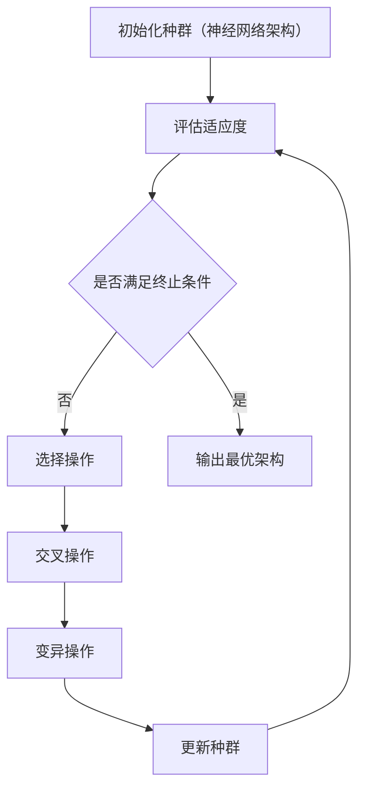

# 神经架构搜索的进化算法优化方法

> 关键词：神经架构搜索、进化算法、优化方法、深度学习、神经网络架构

> 摘要：本文聚焦于神经架构搜索（NAS）中的进化算法优化方法。首先介绍了相关背景，包括研究目的、预期读者、文档结构和术语。接着阐述了核心概念，如神经架构搜索和进化算法，并给出了其联系的示意图与流程图。详细讲解了核心算法原理，用 Python 代码进行了示例。深入探讨了数学模型和公式，并举例说明。通过项目实战，展示了如何搭建开发环境、实现源代码及进行代码解读。分析了实际应用场景，推荐了学习资源、开发工具框架和相关论文著作。最后总结了未来发展趋势与挑战，提供了常见问题解答和扩展阅读参考资料，旨在为相关领域的研究者和开发者提供全面且深入的技术指导。

## 1. 背景介绍 
### 1.1 目的和范围
神经架构搜索（NAS）旨在自动化地发现最优的神经网络架构，以提高模型在各种任务上的性能。传统的神经网络架构设计依赖于专家的经验和手动调优，这不仅耗时费力，而且很难探索到所有可能的架构空间。进化算法作为一种优化算法，具有全局搜索能力，能够在复杂的架构空间中找到较优的解决方案。本文的目的是深入探讨如何使用进化算法来优化神经架构搜索，详细介绍相关的原理、算法、实际应用和未来发展趋势。范围涵盖了从基础概念到实际项目的实现，以及相关的学习资源和研究成果。

### 1.2 预期读者
本文预期读者包括深度学习领域的研究者、人工智能相关专业的学生、从事机器学习和深度学习应用开发的工程师。对于那些希望了解神经架构搜索技术，特别是想探索如何使用进化算法进行优化的读者，本文将提供有价值的技术信息和实践指导。

### 1.3 文档结构概述
本文将按照以下结构展开：首先介绍核心概念，包括神经架构搜索和进化算法的基本原理及其联系；接着详细讲解核心算法原理，并给出 Python 代码示例；然后阐述相关的数学模型和公式，并举例说明；通过项目实战，展示如何在实际场景中应用进化算法进行神经架构搜索；分析实际应用场景；推荐相关的学习资源、开发工具框架和论文著作；最后总结未来发展趋势与挑战，提供常见问题解答和扩展阅读参考资料。

### 1.4 术语表
#### 1.4.1 核心术语定义
- **神经架构搜索（Neural Architecture Search, NAS）**：一种自动化的方法，用于在给定的搜索空间中寻找最优的神经网络架构，以提高模型在特定任务上的性能。
- **进化算法（Evolutionary Algorithm, EA）**：一类基于生物进化原理的优化算法，通过模拟自然选择和遗传机制，在解空间中搜索最优解。
- **适应度函数（Fitness Function）**：在进化算法中，用于评估每个个体（神经网络架构）的优劣程度的函数，通常与模型的性能指标相关，如准确率、损失值等。
- **种群（Population）**：进化算法中一组个体的集合，每个个体代表一个可能的解决方案（神经网络架构）。
- **遗传操作（Genetic Operators）**：包括选择、交叉和变异等操作，用于在种群中生成新的个体，模拟生物进化过程。

#### 1.4.2 相关概念解释
- **搜索空间（Search Space）**：在神经架构搜索中，搜索空间定义了所有可能的神经网络架构的集合。它可以包括不同的层类型（如卷积层、全连接层）、层的数量、神经元的数量等参数的组合。
- **代理模型（Surrogate Model）**：为了减少在真实数据集上评估每个架构的计算成本，代理模型可以用来近似评估架构的性能。代理模型通常是基于少量数据训练的简单模型。
- **超参数（Hyperparameters）**：在神经架构搜索和进化算法中，超参数是指那些需要手动设置的参数，如进化算法的种群大小、交叉概率、变异概率等。

#### 1.4.3 缩略词列表
- **NAS**：Neural Architecture Search
- **EA**：Evolutionary Algorithm
- **CNN**：Convolutional Neural Network
- **RNN**：Recurrent Neural Network

## 2. 核心概念与联系 

### 2.1 神经架构搜索原理
神经架构搜索的核心思想是在一个预定义的搜索空间中，通过某种搜索策略来寻找最优的神经网络架构。搜索空间通常由一系列的架构参数和操作组成，例如层的类型、层的数量、神经元的数量等。搜索策略可以是随机搜索、基于梯度的搜索、强化学习搜索或进化算法搜索等。

### 2.2 进化算法原理
进化算法是一类模拟生物进化过程的优化算法，主要包括遗传算法、进化策略等。其基本步骤包括：
1. **初始化种群**：随机生成一组初始的个体（解决方案），组成种群。
2. **评估适应度**：使用适应度函数评估每个个体的优劣程度。
3. **选择操作**：根据个体的适应度，选择一部分个体作为父代。
4. **交叉操作**：对选中的父代个体进行交叉操作，生成新的个体。
5. **变异操作**：对新生成的个体进行变异操作，引入新的基因。
6. **更新种群**：用新生成的个体替换部分旧的个体，更新种群。
7. **重复步骤 2 - 6**：直到满足终止条件（如达到最大迭代次数、找到满意的解等）。

### 2.3 核心概念联系
进化算法可以用于神经架构搜索，将神经网络架构作为个体，适应度函数可以定义为模型在验证集上的性能指标（如准确率）。通过进化算法的选择、交叉和变异操作，可以在搜索空间中不断探索新的架构，逐步找到最优的神经网络架构。

### 2.4 文本示意图
```plaintext
神经架构搜索空间
|
|-- 初始种群（随机生成的神经网络架构）
|
|-- 进化算法
|   |-- 评估适应度（使用验证集评估架构性能）
|   |-- 选择操作（根据适应度选择父代）
|   |-- 交叉操作（生成新架构）
|   |-- 变异操作（引入新架构）
|   |-- 更新种群
|
|-- 最优神经网络架构
```

### 2.5 Mermaid 流程图


## 3. 核心算法原理 & 具体操作步骤 

### 3.1 进化算法优化神经架构搜索的原理
进化算法通过模拟生物进化过程，在神经架构搜索空间中不断探索和优化。具体来说，它将每个神经网络架构看作一个个体，用适应度函数来评估个体的优劣。通过选择、交叉和变异等遗传操作，不断生成新的个体，逐步逼近最优的神经网络架构。

### 3.2 具体操作步骤
1. **初始化种群**：随机生成一组初始的神经网络架构，组成种群。每个架构可以用一个向量或树结构来表示。
2. **评估适应度**：使用验证集对种群中的每个架构进行训练和评估，计算其适应度值。适应度值可以是模型的准确率、损失值等。
3. **选择操作**：根据个体的适应度值，选择一部分个体作为父代。常用的选择方法包括轮盘赌选择、锦标赛选择等。
4. **交叉操作**：对选中的父代个体进行交叉操作，生成新的个体。交叉操作可以是单点交叉、多点交叉等。
5. **变异操作**：对新生成的个体进行变异操作，引入新的基因。变异操作可以是随机改变架构的某个参数或结构。
6. **更新种群**：用新生成的个体替换部分旧的个体，更新种群。
7. **重复步骤 2 - 6**：直到满足终止条件，如达到最大迭代次数、找到满意的解等。

### 3.3 Python 代码示例
```python
import random
import numpy as np
from sklearn.datasets import make_classification
from sklearn.model_selection import train_test_split
from sklearn.neural_network import MLPClassifier

# 定义搜索空间
search_space = {
    'hidden_layer_sizes': [(10,), (20,), (30,), (10, 10), (20, 20)],
    'activation': ['relu', 'tanh', 'logistic'],
    'solver': ['adam', 'sgd']
}

# 初始化种群
def initialize_population(population_size):
    population = []
    for _ in range(population_size):
        individual = {
            'hidden_layer_sizes': random.choice(search_space['hidden_layer_sizes']),
            'activation': random.choice(search_space['activation']),
            'solver': random.choice(search_space['solver'])
        }
        population.append(individual)
    return population

# 评估适应度
def evaluate_fitness(individual, X_train, y_train, X_val, y_val):
    model = MLPClassifier(**individual)
    model.fit(X_train, y_train)
    accuracy = model.score(X_val, y_val)
    return accuracy

# 选择操作（锦标赛选择）
def tournament_selection(population, tournament_size, X_train, y_train, X_val, y_val):
    tournament = random.sample(population, tournament_size)
    best_individual = max(tournament, key=lambda x: evaluate_fitness(x, X_train, y_train, X_val, y_val))
    return best_individual

# 交叉操作
def crossover(parent1, parent2):
    child = {}
    for key in parent1:
        if random.random() < 0.5:
            child[key] = parent1[key]
        else:
            child[key] = parent2[key]
    return child

# 变异操作
def mutate(individual):
    key = random.choice(list(search_space.keys()))
    individual[key] = random.choice(search_space[key])
    return individual

# 进化算法主函数
def evolutionary_nas(population_size, generations, tournament_size, X_train, y_train, X_val, y_val):
    population = initialize_population(population_size)
    best_fitness = 0
    best_individual = None
    for _ in range(generations):
        new_population = []
        for _ in range(population_size):
            parent1 = tournament_selection(population, tournament_size, X_train, y_train, X_val, y_val)
            parent2 = tournament_selection(population, tournament_size, X_train, y_train, X_val, y_val)
            child = crossover(parent1, parent2)
            child = mutate(child)
            new_population.append(child)
        population = new_population
        for individual in population:
            fitness = evaluate_fitness(individual, X_train, y_train, X_val, y_val)
            if fitness > best_fitness:
                best_fitness = fitness
                best_individual = individual
    return best_individual, best_fitness

# 生成数据集
X, y = make_classification(n_samples=1000, n_features=20, n_informative=10, n_classes=2, random_state=42)
X_train, X_val, y_train, y_val = train_test_split(X, y, test_size=0.2, random_state=42)

# 运行进化算法
best_individual, best_fitness = evolutionary_nas(population_size=10, generations=5, tournament_size=3, X_train=X_train, y_train=y_train, X_val=X_val, y_val=y_val)

print("Best individual:", best_individual)
print("Best fitness:", best_fitness)
```

## 4. 数学模型和公式 & 详细讲解 & 举例说明 

### 4.1 适应度函数
适应度函数用于评估每个神经网络架构的优劣程度。通常，适应度函数与模型在验证集上的性能指标相关，如准确率、损失值等。假设我们使用准确率作为适应度函数，对于一个神经网络架构 $A$，其适应度值 $F(A)$ 可以定义为：

$$F(A) = \text{Accuracy}(A)$$

其中 $\text{Accuracy}(A)$ 是模型在验证集上的准确率。

### 4.2 选择概率
在选择操作中，每个个体被选中作为父代的概率通常与其适应度值成正比。假设种群中有 $N$ 个个体，第 $i$ 个个体的适应度值为 $F(A_i)$，则其被选中的概率 $P(A_i)$ 可以定义为：

$$P(A_i) = \frac{F(A_i)}{\sum_{j=1}^{N} F(A_j)}$$

例如，假设有三个个体 $A_1$、$A_2$ 和 $A_3$，其适应度值分别为 $0.8$、$0.6$ 和 $0.4$，则它们被选中的概率分别为：

$$P(A_1) = \frac{0.8}{0.8 + 0.6 + 0.4} = \frac{0.8}{1.8} \approx 0.44$$
$$P(A_2) = \frac{0.6}{0.8 + 0.6 + 0.4} = \frac{0.6}{1.8} \approx 0.33$$
$$P(A_3) = \frac{0.4}{0.8 + 0.6 + 0.4} = \frac{0.4}{1.8} \approx 0.22$$

### 4.3 交叉操作
交叉操作是通过交换两个父代个体的部分基因来生成新的个体。假设父代个体 $A_1$ 和 $A_2$ 分别表示为向量 $(a_{11}, a_{12}, \cdots, a_{1n})$ 和 $(a_{21}, a_{22}, \cdots, a_{2n})$，交叉点为 $k$，则交叉后生成的子代个体 $C$ 可以表示为：

$$C = (a_{11}, a_{12}, \cdots, a_{1k}, a_{2(k+1)}, a_{2(k+2)}, \cdots, a_{2n})$$

例如，假设 $A_1 = (1, 2, 3, 4)$，$A_2 = (5, 6, 7, 8)$，交叉点 $k = 2$，则交叉后生成的子代个体 $C = (1, 2, 7, 8)$。

### 4.4 变异操作
变异操作是通过随机改变个体的某个基因来引入新的基因。假设个体 $A$ 表示为向量 $(a_1, a_2, \cdots, a_n)$，变异点为 $j$，则变异后生成的个体 $A'$ 可以表示为：

$$A' = (a_1, a_2, \cdots, a_{j-1}, a_j', a_{j+1}, \cdots, a_n)$$

其中 $a_j'$ 是从搜索空间中随机选择的一个值。例如，假设 $A = (1, 2, 3, 4)$，变异点 $j = 3$，搜索空间为 $\{1, 2, 3, 4, 5\}$，则变异后生成的个体 $A'$ 可能为 $(1, 2, 5, 4)$。

## 5. 项目实战：代码实际案例和详细解释说明 

### 5.1  开发环境搭建
1. **安装 Python**：建议使用 Python 3.7 及以上版本。可以从 Python 官方网站（https://www.python.org/downloads/）下载并安装。
2. **安装必要的库**：使用以下命令安装所需的库：
```sh
pip install numpy scikit-learn
```

### 5.2  源代码详细实现和代码解读
```python
import random
import numpy as np
from sklearn.datasets import make_classification
from sklearn.model_selection import train_test_split
from sklearn.neural_network import MLPClassifier

# 定义搜索空间
search_space = {
    'hidden_layer_sizes': [(10,), (20,), (30,), (10, 10), (20, 20)],
    'activation': ['relu', 'tanh', 'logistic'],
    'solver': ['adam', 'sgd']
}

# 初始化种群
def initialize_population(population_size):
    population = []
    for _ in range(population_size):
        individual = {
            'hidden_layer_sizes': random.choice(search_space['hidden_layer_sizes']),
            'activation': random.choice(search_space['activation']),
            'solver': random.choice(search_space['solver'])
        }
        population.append(individual)
    return population

# 评估适应度
def evaluate_fitness(individual, X_train, y_train, X_val, y_val):
    model = MLPClassifier(**individual)
    model.fit(X_train, y_train)
    accuracy = model.score(X_val, y_val)
    return accuracy

# 选择操作（锦标赛选择）
def tournament_selection(population, tournament_size, X_train, y_train, X_val, y_val):
    tournament = random.sample(population, tournament_size)
    best_individual = max(tournament, key=lambda x: evaluate_fitness(x, X_train, y_train, X_val, y_val))
    return best_individual

# 交叉操作
def crossover(parent1, parent2):
    child = {}
    for key in parent1:
        if random.random() < 0.5:
            child[key] = parent1[key]
        else:
            child[key] = parent2[key]
    return child

# 变异操作
def mutate(individual):
    key = random.choice(list(search_space.keys()))
    individual[key] = random.choice(search_space[key])
    return individual

# 进化算法主函数
def evolutionary_nas(population_size, generations, tournament_size, X_train, y_train, X_val, y_val):
    population = initialize_population(population_size)
    best_fitness = 0
    best_individual = None
    for _ in range(generations):
        new_population = []
        for _ in range(population_size):
            parent1 = tournament_selection(population, tournament_size, X_train, y_train, X_val, y_val)
            parent2 = tournament_selection(population, tournament_size, X_train, y_train, X_val, y_val)
            child = crossover(parent1, parent2)
            child = mutate(child)
            new_population.append(child)
        population = new_population
        for individual in population:
            fitness = evaluate_fitness(individual, X_train, y_train, X_val, y_val)
            if fitness > best_fitness:
                best_fitness = fitness
                best_individual = individual
    return best_individual, best_fitness

# 生成数据集
X, y = make_classification(n_samples=1000, n_features=20, n_informative=10, n_classes=2, random_state=42)
X_train, X_val, y_train, y_val = train_test_split(X, y, test_size=0.2, random_state=42)

# 运行进化算法
best_individual, best_fitness = evolutionary_nas(population_size=10, generations=5, tournament_size=3, X_train=X_train, y_train=y_train, X_val=X_val, y_val=y_val)

print("Best individual:", best_individual)
print("Best fitness:", best_fitness)
```

### 5.3  代码解读与分析
1. **搜索空间定义**：`search_space` 字典定义了神经网络架构的搜索空间，包括隐藏层大小、激活函数和优化器。
2. **初始化种群**：`initialize_population` 函数随机生成一组初始的神经网络架构，组成种群。
3. **评估适应度**：`evaluate_fitness` 函数使用 `MLPClassifier` 训练模型，并计算其在验证集上的准确率作为适应度值。
4. **选择操作**：`tournament_selection` 函数使用锦标赛选择方法，从种群中选择适应度最高的个体作为父代。
5. **交叉操作**：`crossover` 函数通过随机交换两个父代个体的基因来生成新的个体。
6. **变异操作**：`mutate` 函数随机改变个体的某个基因，引入新的基因。
7. **进化算法主函数**：`evolutionary_nas` 函数实现了进化算法的主要逻辑，包括初始化种群、评估适应度、选择、交叉、变异和更新种群等步骤。
8. **数据集生成和训练**：使用 `make_classification` 生成一个分类数据集，并将其划分为训练集和验证集。最后运行进化算法，输出最优的神经网络架构和对应的适应度值。

## 6. 实际应用场景 
### 6.1 图像分类
在图像分类任务中，神经架构搜索的进化算法优化方法可以自动搜索最优的卷积神经网络（CNN）架构。传统的 CNN 架构设计需要大量的经验和手动调优，而使用进化算法可以在更广泛的架构空间中搜索，找到性能更好的架构。例如，在 ImageNet 图像分类竞赛中，使用进化算法搜索到的架构在准确率上取得了显著的提升。

### 6.2 目标检测
目标检测任务需要同时完成目标的定位和分类。进化算法可以用于搜索最优的目标检测架构，如 Faster R-CNN、YOLO 等的变体。通过自动调整架构的参数和结构，可以提高目标检测的精度和速度。

### 6.3 自然语言处理
在自然语言处理任务中，如文本分类、机器翻译等，神经架构搜索的进化算法可以搜索最优的循环神经网络（RNN）或Transformer 架构。可以自动调整网络的层数、隐藏单元数量等参数，提高模型在自然语言处理任务上的性能。

### 6.4 医疗影像分析
医疗影像分析需要对医学图像（如X光、CT、MRI等）进行诊断和分析。进化算法可以用于搜索最优的医学影像分析架构，帮助医生更准确地诊断疾病。例如，在乳腺癌筛查中，使用进化算法搜索到的架构可以提高乳腺肿瘤的检测准确率。

## 7. 工具和资源推荐
### 7.1 学习资源推荐
#### 7.1.1 书籍推荐
- 《深度学习》（Deep Learning）：由 Ian Goodfellow、Yoshua Bengio 和 Aaron Courville 撰写，是深度学习领域的经典教材，涵盖了神经网络的基本原理、优化算法等内容。
- 《人工智能：一种现代的方法》（Artificial Intelligence: A Modern Approach）：由 Stuart Russell 和 Peter Norvig 撰写，全面介绍了人工智能的各个领域，包括进化算法和神经架构搜索。
- 《Python 深度学习》（Deep Learning with Python）：由 Francois Chollet 撰写，详细介绍了如何使用 Python 和 Keras 进行深度学习开发，包括神经网络架构设计和优化。

#### 7.1.2 在线课程
- Coursera 上的“深度学习专项课程”（Deep Learning Specialization）：由 Andrew Ng 教授授课，包括神经网络基础、卷积神经网络、循环神经网络等内容。
- edX 上的“人工智能导论”（Introduction to Artificial Intelligence）：介绍了人工智能的基本概念、算法和应用，包括进化算法和神经架构搜索。
- Udemy 上的“Python 机器学习实战”（Machine Learning A-Z™: Hands-On Python & R In Data Science）：通过实际项目介绍了机器学习和深度学习的应用，包括神经架构搜索的实践。

#### 7.1.3 技术博客和网站
- Medium 上的 Towards Data Science：发布了大量关于数据科学、机器学习和深度学习的技术文章，包括神经架构搜索的最新研究成果。
- arXiv.org：是一个预印本服务器，提供了大量关于人工智能和机器学习的研究论文，包括神经架构搜索和进化算法的最新研究。
- Kaggle：是一个数据科学竞赛平台，提供了丰富的数据集和代码示例，可用于学习和实践神经架构搜索。

### 7.2 开发工具框架推荐
#### 7.2.1 IDE和编辑器
- PyCharm：是一款专业的 Python 集成开发环境，提供了代码编辑、调试、版本控制等功能，适合深度学习项目的开发。
- Jupyter Notebook：是一个交互式的开发环境，支持 Python 代码的编写、运行和可视化，适合数据探索和模型实验。
- Visual Studio Code：是一款轻量级的代码编辑器，支持多种编程语言和插件，可用于深度学习项目的开发和调试。

#### 7.2.2 调试和性能分析工具
- TensorBoard：是 TensorFlow 提供的可视化工具，可用于监控模型的训练过程、查看模型的结构和性能指标等。
- PyTorch Profiler：是 PyTorch 提供的性能分析工具，可用于分析模型的运行时间、内存使用等情况，帮助优化模型性能。
- cProfile：是 Python 标准库中的性能分析工具，可用于分析 Python 代码的运行时间和函数调用情况。

#### 7.2.3 相关框架和库
- TensorFlow：是 Google 开发的深度学习框架，提供了丰富的神经网络层和优化算法，支持神经架构搜索的实现。
- PyTorch：是 Facebook 开发的深度学习框架，具有动态图的特点，易于使用和调试，也支持神经架构搜索的实现。
- DEAP：是一个用于实现进化算法的 Python 库，提供了丰富的遗传操作和选择方法，可用于神经架构搜索的进化算法实现。

### 7.3 相关论文著作推荐
#### 7.3.1 经典论文
- “Neural Architecture Search with Reinforcement Learning”：介绍了使用强化学习进行神经架构搜索的方法，是神经架构搜索领域的经典论文之一。
- “Genetic Programming for Evolving Neural Networks”：探讨了使用遗传编程方法进化神经网络的架构，为进化算法在神经架构搜索中的应用奠定了基础。
- “Efficient Neural Architecture Search via Parameter Sharing”：提出了一种基于参数共享的高效神经架构搜索方法，大大减少了搜索的计算成本。

#### 7.3.2 最新研究成果
- “AutoML-Zero: Evolving Machine Learning Algorithms From Scratch”：提出了一种从零开始进化机器学习算法的方法，为神经架构搜索提供了新的思路。
- “Once for All: Train One Network and Specialize It for Efficient Deployment”：提出了一种一次性训练多个架构的方法，可用于高效的神经架构搜索和模型部署。
- “ProxylessNAS: Direct Neural Architecture Search on Target Task and Hardware”：提出了一种无需代理模型的直接神经架构搜索方法，可在目标任务和硬件上进行高效搜索。

#### 7.3.3 应用案例分析
- “Searching for MobileNetV3”：介绍了如何使用神经架构搜索方法搜索适合移动设备的轻量级卷积神经网络架构。
- “EfficientDet: Scalable and Efficient Object Detection”：展示了如何使用神经架构搜索方法搜索高效的目标检测架构。
- “BERT: Pre-training of Deep Bidirectional Transformers for Language Understanding”：虽然不是专门关于神经架构搜索的论文，但介绍了一种在自然语言处理领域取得巨大成功的 Transformer 架构，为神经架构搜索在自然语言处理中的应用提供了参考。

## 8. 总结：未来发展趋势与挑战
### 8.1 未来发展趋势
1. **多目标优化**：未来的神经架构搜索将不仅仅关注模型的准确率，还将考虑模型的计算复杂度、内存使用等多个目标。进化算法可以很好地处理多目标优化问题，通过引入多目标适应度函数和多目标选择方法，搜索出在多个目标上都表现优秀的神经网络架构。
2. **与其他技术的融合**：神经架构搜索的进化算法将与其他技术（如强化学习、迁移学习等）融合，提高搜索的效率和性能。例如，使用强化学习来指导进化算法的搜索过程，或者使用迁移学习来加速模型的训练和评估。
3. **硬件感知的搜索**：随着人工智能硬件的不断发展，未来的神经架构搜索将更加注重硬件的特性和限制。进化算法可以搜索出适合特定硬件平台的神经网络架构，提高模型在硬件上的运行效率。
4. **自动机器学习（AutoML）的普及**：神经架构搜索是自动机器学习的重要组成部分，未来将随着 AutoML 的普及而得到更广泛的应用。进化算法可以作为一种有效的搜索策略，帮助用户自动选择最优的神经网络架构，降低机器学习的使用门槛。

### 8.2 挑战
1. **计算成本**：神经架构搜索的进化算法通常需要大量的计算资源和时间，尤其是在搜索空间较大的情况下。如何降低计算成本，提高搜索效率是一个亟待解决的问题。
2. **搜索空间的定义**：搜索空间的定义对搜索结果有很大的影响。如何合理地定义搜索空间，既保证搜索的全面性，又避免搜索空间过大导致计算成本过高，是一个挑战。
3. **适应度函数的设计**：适应度函数的设计直接影响进化算法的搜索方向和效果。如何设计一个准确、有效的适应度函数，能够反映模型的真实性能，是一个需要深入研究的问题。
4. **可解释性**：神经网络架构通常是复杂的黑盒模型，缺乏可解释性。如何提高神经架构搜索的进化算法所搜索到的架构的可解释性，是一个重要的挑战。

## 9. 附录：常见问题与解答
### 9.1 进化算法在神经架构搜索中的收敛速度如何？
进化算法的收敛速度取决于多个因素，如种群大小、遗传操作的参数、搜索空间的复杂度等。一般来说，较大的种群大小和合适的遗传操作参数可以提高收敛速度。此外，使用代理模型可以减少在真实数据集上评估每个架构的计算成本，从而加速搜索过程。

### 9.2 如何选择进化算法的超参数？
进化算法的超参数包括种群大小、交叉概率、变异概率、选择方法等。这些超参数的选择通常需要通过实验来确定。可以使用网格搜索、随机搜索等方法在一定的参数范围内进行搜索，找到最优的超参数组合。

### 9.3 进化算法在神经架构搜索中容易陷入局部最优解吗？
进化算法具有一定的全局搜索能力，但在某些情况下仍然可能陷入局部最优解。为了避免陷入局部最优解，可以采用一些策略，如增加种群大小、引入多样性保持机制（如精英保留策略）、调整遗传操作的参数等。

### 9.4 神经架构搜索的进化算法可以应用于大规模数据集吗？
可以，但需要考虑计算成本和时间。对于大规模数据集，可以使用代理模型来近似评估架构的性能，减少在真实数据集上的训练和评估次数。此外，可以采用分布式计算的方法，将搜索任务分配到多个计算节点上并行执行，提高搜索效率。

## 10. 扩展阅读 & 参考资料
1. “Neural Architecture Search: A Survey”：全面介绍了神经架构搜索的各种方法和技术，是深入了解神经架构搜索的重要参考资料。
2. “Evolutionary Algorithms in Engineering Applications”：详细介绍了进化算法在工程领域的应用，包括神经网络架构优化等方面的内容。
3. 相关学术会议和期刊：如 NeurIPS、ICML、CVPR、IJCAI 等学术会议，以及 Journal of Artificial Intelligence Research（JAIR）、Artificial Intelligence 等期刊，发表了大量关于神经架构搜索和进化算法的最新研究成果。

作者：AI天才研究院/AI Genius Institute & 禅与计算机程序设计艺术 /Zen And The Art of Computer Programming