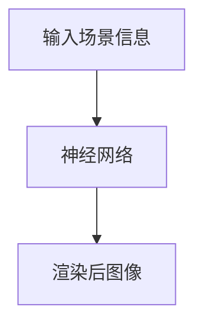

# 神经渲染:AI驱动的计算机图形学新范式

> 关键词：神经渲染、人工智能、计算机图形学、新范式、渲染算法

> 摘要：本文围绕神经渲染这一AI驱动的计算机图形学新范式展开。首先介绍了神经渲染产生的背景、目的、预期读者以及文档结构等信息。接着详细阐述了神经渲染的核心概念、联系、算法原理、数学模型等理论知识。通过项目实战展示了神经渲染在实际中的代码实现与应用。同时分析了神经渲染的实际应用场景，推荐了相关的学习工具、资源和论文著作。最后对神经渲染的未来发展趋势与挑战进行总结，并给出常见问题解答和扩展阅读参考资料，旨在为读者全面深入地理解神经渲染提供一个完整的知识体系。

## 1. 背景介绍 
### 1.1 目的和范围
在传统计算机图形学中，渲染过程通常基于物理模型和几何算法，虽然能够生成高质量的图像，但在处理复杂场景和实时交互等方面存在一定的局限性。神经渲染作为一种新兴的技术范式，借助人工智能的强大能力，为计算机图形学带来了新的突破。本文的目的在于深入探讨神经渲染的原理、算法、应用等方面，详细介绍其核心概念、数学模型和具体实现方法，帮助读者全面了解这一前沿技术。范围涵盖了从理论基础到实际应用的各个层面，包括核心算法的原理阐述、项目实战的代码分析以及实际应用场景的探讨等。

### 1.2 预期读者
本文预期读者主要包括计算机图形学领域的专业人士，如研究人员、开发者等，他们可以通过本文深入了解神经渲染的最新进展和技术细节，为其研究和开发工作提供参考。同时，对人工智能和计算机图形学感兴趣的学生和爱好者也能从本文中获得基础知识和学习方向，为进一步学习和探索该领域奠定基础。此外，从事相关行业的技术管理人员也可以通过本文了解神经渲染的应用前景和发展趋势，为企业的技术战略规划提供决策依据。

### 1.3 文档结构概述
本文共分为十个部分。第一部分为背景介绍，阐述了文章的目的、预期读者和文档结构等基本信息。第二部分详细介绍神经渲染的核心概念与联系，包括相关原理和架构，并通过文本示意图和Mermaid流程图进行直观展示。第三部分讲解核心算法原理和具体操作步骤，结合Python源代码进行详细说明。第四部分介绍神经渲染的数学模型和公式，并通过举例进行详细讲解。第五部分是项目实战，涵盖开发环境搭建、源代码实现和代码解读等内容。第六部分分析神经渲染的实际应用场景。第七部分推荐相关的工具和资源，包括学习资源、开发工具框架和论文著作等。第八部分总结神经渲染的未来发展趋势与挑战。第九部分为附录，解答常见问题。第十部分提供扩展阅读和参考资料，方便读者进一步深入学习。

### 1.4 术语表
#### 1.4.1 核心术语定义
- **神经渲染（Neural Rendering）**：一种将人工智能技术与计算机图形学相结合的渲染方法，利用神经网络来学习和模拟渲染过程，以生成图像或视频。
- **神经网络（Neural Network）**：一种模仿人类神经系统的计算模型，由大量的神经元组成，通过对数据的学习和训练来完成各种任务，如分类、回归等。
- **渲染（Rendering）**：在计算机图形学中，将三维场景转换为二维图像的过程，包括光照计算、材质模拟等多个步骤。
- **隐式表示（Implicit Representation）**：一种用于表示三维物体或场景的方式，通过函数来描述物体的属性，而不是显式地存储每个点的信息。
- **体渲染（Volume Rendering）**：一种用于渲染三维体数据的技术，通过对体数据中的每个体素进行采样和计算，生成二维图像。

#### 1.4.2 相关概念解释
- **深度学习（Deep Learning）**：深度学习是机器学习的一个分支，通过构建深度神经网络来学习数据的复杂特征和模式。在神经渲染中，深度学习技术被广泛应用于学习渲染过程中的复杂映射关系。
- **生成对抗网络（Generative Adversarial Networks，GANs）**：一种由生成器和判别器组成的深度学习模型，通过对抗训练的方式来生成逼真的数据。在神经渲染中，GANs可以用于生成高质量的图像。
- **自动编码器（Autoencoder）**：一种无监督学习模型，由编码器和解码器组成。编码器将输入数据压缩为低维表示，解码器再将低维表示重构为原始数据。在神经渲染中，自动编码器可以用于学习场景的潜在表示。

#### 1.4.3 缩略词列表
- **CNN（Convolutional Neural Network）**：卷积神经网络，一种在图像处理领域广泛应用的神经网络结构。
- **MLP（Multi-Layer Perceptron）**：多层感知机，一种简单的前馈神经网络。
- **RGB（Red, Green, Blue）**：红绿蓝，一种常用的颜色表示方式。
- **UV（Texture Coordinates）**：纹理坐标，用于在三维模型上映射纹理。

## 2. 核心概念与联系 
神经渲染的核心在于利用神经网络来学习渲染过程中的复杂映射关系，从而实现高效、高质量的图像生成。其基本原理是将输入的场景信息（如三维模型、光照条件等）作为神经网络的输入，通过神经网络的学习和训练，输出渲染后的图像。

### 核心概念原理
#### 基于学习的渲染
传统渲染方法通常基于物理模型和几何算法，需要手动设置大量的参数和规则。而神经渲染采用基于学习的方法，通过大量的训练数据让神经网络自动学习渲染过程中的复杂映射关系。例如，在渲染一个具有复杂材质和光照效果的场景时，传统方法需要精确地设置材质属性和光照模型，而神经渲染可以通过学习大量类似场景的渲染结果，自动生成具有相似效果的图像。

#### 隐式表示与渲染
神经渲染中常常使用隐式表示来描述三维物体或场景。隐式表示通过函数来描述物体的属性，而不是显式地存储每个点的信息。这种表示方式具有更高的灵活性和表达能力，可以更好地处理复杂的几何形状和拓扑结构。例如，在渲染一个具有复杂表面细节的物体时，使用隐式表示可以避免显式表示带来的数据冗余和计算复杂度问题。

#### 端到端的渲染
神经渲染可以实现端到端的渲染，即直接从输入的场景信息到输出的渲染图像，中间不需要手动设置多个步骤。这种方式大大简化了渲染流程，提高了渲染效率。例如，在传统渲染中，需要分别进行光照计算、材质模拟、阴影计算等多个步骤，而神经渲染可以通过一个神经网络直接完成整个渲染过程。

### 架构的文本示意图
神经渲染的基本架构通常包括输入层、隐藏层和输出层。输入层接收场景信息，如三维模型的顶点坐标、纹理信息、光照条件等。隐藏层由多个神经网络层组成，用于对输入信息进行处理和特征提取。输出层输出渲染后的图像，通常以RGB图像的形式呈现。

### Mermaid流程图

在这个流程图中，输入场景信息经过神经网络的处理，最终输出渲染后的图像。

## 3. 核心算法原理 & 具体操作步骤 
### 核心算法原理
神经渲染中常用的算法之一是基于多层感知机（MLP）的体渲染算法。该算法的核心思想是通过MLP来学习体数据中的密度和颜色信息，并通过体渲染技术将这些信息转换为二维图像。

### 具体操作步骤
#### 步骤1：数据准备
首先需要准备训练数据，包括三维体数据和对应的二维渲染图像。体数据可以通过三维扫描、模拟等方式获取，渲染图像可以使用传统渲染方法生成。

#### 步骤2：构建MLP模型
使用Python和深度学习框架（如PyTorch）构建MLP模型。以下是一个简单的MLP模型示例代码：
```python
import torch
import torch.nn as nn

class MLP(nn.Module):
    def __init__(self, input_dim, hidden_dim, output_dim):
        super(MLP, self).__init__()
        self.fc1 = nn.Linear(input_dim, hidden_dim)
        self.relu = nn.ReLU()
        self.fc2 = nn.Linear(hidden_dim, output_dim)

    def forward(self, x):
        out = self.fc1(x)
        out = self.relu(out)
        out = self.fc2(out)
        return out

# 初始化MLP模型
input_dim = 3  # 输入维度，例如三维空间坐标
hidden_dim = 128
output_dim = 4  # 输出维度，例如密度和RGB颜色
model = MLP(input_dim, hidden_dim, output_dim)
```

#### 步骤3：训练模型
使用准备好的训练数据对MLP模型进行训练。训练过程中，通过计算模型输出与真实渲染图像之间的损失函数，并使用优化算法（如随机梯度下降）来更新模型参数。以下是训练代码示例：
```python
import torch.optim as optim

# 定义损失函数和优化器
criterion = nn.MSELoss()
optimizer = optim.Adam(model.parameters(), lr=0.001)

# 训练循环
num_epochs = 100
for epoch in range(num_epochs):
    # 假设输入数据为x，真实渲染图像为y
    x = torch.randn(100, input_dim)  # 随机生成输入数据
    y = torch.randn(100, output_dim)  # 随机生成真实渲染图像
    optimizer.zero_grad()
    outputs = model(x)
    loss = criterion(outputs, y)
    loss.backward()
    optimizer.step()
    if (epoch + 1) % 10 == 0:
        print(f'Epoch [{epoch+1}/{num_epochs}], Loss: {loss.item():.4f}')
```

#### 步骤4：渲染图像
训练完成后，使用训练好的模型对新的场景进行渲染。具体步骤包括：在三维空间中采样点，将采样点的坐标输入到模型中，得到每个采样点的密度和颜色信息，然后使用体渲染技术将这些信息转换为二维图像。

## 4. 数学模型和公式 & 详细讲解 & 举例说明 
### 体渲染的数学模型
体渲染的基本思想是通过对三维体数据中的每个体素进行采样和计算，将体数据转换为二维图像。体渲染的数学模型可以用以下公式表示：
$$
C(r) = \int_{t_n}^{t_f} T(t) \sigma(r(t)) c(r(t)) dt
$$
其中，$C(r)$ 表示光线 $r$ 最终的颜色，$t_n$ 和 $t_f$ 分别表示光线的近裁剪平面和远裁剪平面，$T(t)$ 表示光线从起点到 $t$ 位置的透明度，$\sigma(r(t))$ 表示体数据在 $r(t)$ 位置的密度，$c(r(t))$ 表示体数据在 $r(t)$ 位置的颜色。

### 透明度的计算
透明度 $T(t)$ 可以通过以下公式计算：
$$
T(t) = \exp \left( - \int_{t_n}^{t} \sigma(r(s)) ds \right)
$$
这个公式表示光线从起点到 $t$ 位置的透明度是由光线在该路径上经过的所有体素的密度决定的。

### 举例说明
假设我们有一个简单的三维体数据，体素的密度和颜色在空间中是均匀分布的。我们可以通过以下步骤计算光线的最终颜色：
1. 在光线的路径上采样一系列的点。
2. 对于每个采样点，计算其密度和颜色。
3. 根据透明度公式计算光线从起点到该采样点的透明度。
4. 根据体渲染公式计算光线在该采样点的贡献。
5. 将所有采样点的贡献相加，得到光线的最终颜色。

以下是一个简单的Python代码示例，用于计算光线的最终颜色：
```python
import numpy as np

# 假设体素的密度和颜色
sigma = 0.1
c = np.array([1, 0, 0])  # 红色

# 光线的近裁剪平面和远裁剪平面
t_n = 0
t_f = 10

# 采样点数
num_samples = 100

# 采样点位置
t = np.linspace(t_n, t_f, num_samples)

# 计算透明度和颜色贡献
T = np.exp(-sigma * t)
C = np.zeros(3)
for i in range(num_samples - 1):
    dt = t[i + 1] - t[i]
    C += T[i] * sigma * c * dt

print("最终颜色:", C)
```

## 5. 项目实战：代码实际案例和详细解释说明 
### 5.1  开发环境搭建
#### 安装Python和深度学习框架
首先需要安装Python，建议使用Python 3.7及以上版本。然后安装深度学习框架PyTorch，可以根据自己的显卡情况选择合适的版本。以下是安装命令：
```bash
pip install torch torchvision
```

#### 安装其他依赖库
还需要安装一些其他的依赖库，如NumPy、Matplotlib等，用于数据处理和可视化。安装命令如下：
```bash
pip install numpy matplotlib
```

### 5.2  源代码详细实现和代码解读
#### 数据准备
我们使用一个简单的三维体数据作为示例，体数据可以通过NumPy数组表示。以下是数据准备的代码：
```python
import numpy as np

# 生成三维体数据
volume_size = (32, 32, 32)
volume = np.random.rand(*volume_size)  # 随机生成体数据
```

#### 构建MLP模型
使用前面介绍的MLP模型代码构建模型：
```python
import torch
import torch.nn as nn

class MLP(nn.Module):
    def __init__(self, input_dim, hidden_dim, output_dim):
        super(MLP, self).__init__()
        self.fc1 = nn.Linear(input_dim, hidden_dim)
        self.relu = nn.ReLU()
        self.fc2 = nn.Linear(hidden_dim, output_dim)

    def forward(self, x):
        out = self.fc1(x)
        out = self.relu(out)
        out = self.fc2(out)
        return out

# 初始化MLP模型
input_dim = 3  # 输入维度，例如三维空间坐标
hidden_dim = 128
output_dim = 4  # 输出维度，例如密度和RGB颜色
model = MLP(input_dim, hidden_dim, output_dim)
```

#### 训练模型
使用准备好的体数据对模型进行训练：
```python
import torch.optim as optim

# 定义损失函数和优化器
criterion = nn.MSELoss()
optimizer = optim.Adam(model.parameters(), lr=0.001)

# 训练循环
num_epochs = 100
for epoch in range(num_epochs):
    # 随机生成输入数据
    x = torch.randn(100, input_dim)
    # 从体数据中获取对应的真实值
    y = []
    for i in range(x.shape[0]):
        coord = (x[i, 0].item(), x[i, 1].item(), x[i, 2].item())
        coord = np.clip(coord, 0, volume_size[0] - 1).astype(int)
        density = volume[coord]
        color = np.array([density, density, density])
        y.append(np.concatenate([[density], color]))
    y = torch.tensor(y, dtype=torch.float32)

    optimizer.zero_grad()
    outputs = model(x)
    loss = criterion(outputs, y)
    loss.backward()
    optimizer.step()
    if (epoch + 1) % 10 == 0:
        print(f'Epoch [{epoch+1}/{num_epochs}], Loss: {loss.item():.4f}')
```

#### 渲染图像
训练完成后，使用训练好的模型对新的场景进行渲染：
```python
import matplotlib.pyplot as plt

# 定义渲染参数
image_size = (256, 256)
near = 0
far = 10
num_samples = 100

# 初始化图像
image = np.zeros((image_size[0], image_size[1], 3))

# 渲染循环
for i in range(image_size[0]):
    for j in range(image_size[1]):
        # 生成光线
        ray_origin = np.array([0, 0, 0])
        ray_direction = np.array([(i - image_size[0] / 2) / image_size[0], (j - image_size[1] / 2) / image_size[1], 1])
        ray_direction = ray_direction / np.linalg.norm(ray_direction)

        # 采样点位置
        t = np.linspace(near, far, num_samples)
        C = np.zeros(3)
        T = 1
        for k in range(num_samples - 1):
            # 计算采样点坐标
            coord = ray_origin + t[k] * ray_direction
            coord = torch.tensor(coord, dtype=torch.float32).unsqueeze(0)
            # 使用模型预测密度和颜色
            output = model(coord)
            density = output[0, 0].item()
            color = output[0, 1:].detach().numpy()

            # 计算透明度和颜色贡献
            dt = t[k + 1] - t[k]
            T *= np.exp(-density * dt)
            C += T * density * color * dt

        image[i, j] = C

# 显示渲染结果
plt.imshow(image)
plt.show()
```

### 5.3  代码解读与分析
#### 数据准备部分
通过NumPy生成一个简单的三维体数据，用于训练模型。体数据可以表示为一个三维数组，每个元素表示体素的密度。

#### 模型构建部分
使用PyTorch构建一个简单的MLP模型，输入为三维空间坐标，输出为密度和RGB颜色。模型由两个全连接层和一个ReLU激活函数组成。

#### 训练部分
在训练过程中，随机生成输入数据，并从体数据中获取对应的真实值。使用均方误差损失函数和Adam优化器对模型进行训练。

#### 渲染部分
在渲染过程中，对于图像中的每个像素，生成一条光线，并在光线的路径上采样一系列的点。使用训练好的模型预测每个采样点的密度和颜色，然后根据体渲染公式计算光线的最终颜色。最后将所有像素的颜色组合成一张图像并显示。

## 6. 实际应用场景 
### 游戏开发
在游戏开发中，神经渲染可以用于实时渲染复杂的场景和角色。传统的渲染方法在处理复杂的光照效果、材质纹理和动态场景时可能会遇到性能瓶颈，而神经渲染可以通过学习大量的游戏场景数据，快速生成高质量的渲染图像，提高游戏的视觉效果和实时性。例如，在一些大型3D游戏中，使用神经渲染可以实现更加逼真的光照和阴影效果，让玩家沉浸在更加真实的游戏世界中。

### 电影制作
在电影制作中，神经渲染可以用于制作高质量的特效和动画。传统的特效制作需要大量的人工和时间，而神经渲染可以通过学习真实世界的图像和视频数据，自动生成逼真的特效和动画。例如，在一些科幻电影中，使用神经渲染可以制作出逼真的外星生物和宇宙场景，大大提高了电影的视觉冲击力。

### 虚拟现实和增强现实
在虚拟现实（VR）和增强现实（AR）领域，神经渲染可以用于实时渲染虚拟场景和增强现实内容。由于VR和AR需要实时响应用户的动作和视角变化，对渲染速度和质量要求较高。神经渲染可以通过优化算法和模型，实现高效的实时渲染，为用户提供更加流畅和逼真的体验。例如，在VR游戏中，使用神经渲染可以实现更加真实的场景交互和视觉效果，让玩家感受到身临其境的感觉。

### 工业设计和建筑设计
在工业设计和建筑设计中，神经渲染可以用于快速生成设计方案的渲染图像和动画。设计师可以通过输入设计模型和相关参数，使用神经渲染技术快速生成不同视角和光照条件下的渲染效果，帮助他们更好地展示设计方案和进行方案评估。例如，在建筑设计中，使用神经渲染可以生成逼真的建筑外观和内部空间效果，让客户更好地理解设计意图。

## 7. 工具和资源推荐
### 7.1 学习资源推荐
#### 7.1.1 书籍推荐
- 《计算机图形学原理及实践（第3版）》：全面介绍了计算机图形学的基本原理和技术，包括渲染、建模、动画等方面的内容，是学习计算机图形学的经典教材。
- 《深度学习》：由Ian Goodfellow、Yoshua Bengio和Aaron Courville三位深度学习领域的专家撰写，系统地介绍了深度学习的基本概念、算法和应用，对于理解神经渲染中的深度学习技术有很大的帮助。
- 《Python深度学习》：作者是Keras库的开发者Francois Chollet，通过大量的实例介绍了如何使用Python和Keras进行深度学习开发，适合初学者快速上手。

#### 7.1.2 在线课程
- Coursera上的“计算机图形学”课程：由知名高校的教授授课，系统地介绍了计算机图形学的基础知识和技术，包括渲染、建模、动画等方面的内容。
- edX上的“深度学习”课程：由顶尖高校和科研机构的专家授课，深入讲解了深度学习的原理和应用，对于理解神经渲染中的深度学习技术有很大的帮助。
- B站（哔哩哔哩）上有很多关于计算机图形学和深度学习的教程视频，这些视频通常由一些技术爱好者和专业人士制作，内容丰富多样，适合不同层次的学习者。

#### 7.1.3 技术博客和网站
- arXiv：一个预印本数据库，包含了大量的计算机科学、数学、物理学等领域的最新研究成果，对于了解神经渲染的最新研究动态有很大的帮助。
- Medium：一个技术博客平台，上面有很多关于计算机图形学、深度学习和神经渲染的文章，作者来自不同的领域和背景，文章内容丰富多样，有很多值得学习和借鉴的地方。
- GitHub：一个代码托管平台，上面有很多关于神经渲染的开源项目和代码实现，通过学习这些项目和代码，可以更好地理解神经渲染的算法和实现细节。

### 7.2 开发工具框架推荐
#### 7.2.1 IDE和编辑器
- PyCharm：一款专门为Python开发设计的集成开发环境（IDE），具有强大的代码编辑、调试和项目管理功能，适合开发神经渲染相关的Python代码。
- Visual Studio Code：一款轻量级的代码编辑器，支持多种编程语言和插件扩展，具有丰富的代码编辑和调试功能，也可以用于开发神经渲染相关的代码。

#### 7.2.2 调试和性能分析工具
- PyTorch Profiler：PyTorch自带的性能分析工具，可以帮助开发者分析代码的性能瓶颈和资源使用情况，优化代码性能。
- TensorBoard：一个可视化工具，可以用于可视化深度学习模型的训练过程和性能指标，帮助开发者更好地理解模型的训练情况和优化模型。

#### 7.2.3 相关框架和库
- PyTorch：一个开源的深度学习框架，具有强大的张量计算和自动求导功能，广泛应用于深度学习领域，包括神经渲染。
- NumPy：一个Python的科学计算库，提供了高效的多维数组对象和各种数学函数，用于处理和分析数据，在神经渲染中可以用于处理体数据和图像数据。
- Matplotlib：一个Python的绘图库，用于可视化数据和结果，在神经渲染中可以用于显示渲染图像和分析结果。

### 7.3 相关论文著作推荐
#### 7.3.1 经典论文
- "Neural Radiance Fields: Representing Scenes as Neural Radiance Fields for View Synthesis"：提出了神经辐射场（Neural Radiance Fields，NeRF）的概念，是神经渲染领域的经典论文，为后续的研究和应用奠定了基础。
- "Learning to Predict 3D Objects with an Interpolation-based Differentiable Renderer"：介绍了一种基于插值的可微渲染器，用于学习预测三维物体，为神经渲染中的可微渲染技术提供了新的思路。

#### 7.3.2 最新研究成果
- 关注计算机图形学和深度学习领域的顶级会议（如SIGGRAPH、NeurIPS等）上的最新研究成果，这些会议上通常会有很多关于神经渲染的前沿研究和创新方法。
- 在arXiv上搜索关于神经渲染的最新预印本论文，了解该领域的最新研究动态和发展趋势。

#### 7.3.3 应用案例分析
- 一些知名的游戏公司、电影制作公司和科技公司会在其官方博客或技术分享平台上分享神经渲染的应用案例和实践经验，通过学习这些案例可以了解神经渲染在实际应用中的具体实现和效果。

## 8. 总结：未来发展趋势与挑战
### 未来发展趋势
#### 更高的渲染质量
随着深度学习技术的不断发展和硬件性能的提升，神经渲染将能够生成更高质量的渲染图像和视频。未来的神经渲染模型将能够更好地处理复杂的光照效果、材质纹理和动态场景，实现更加逼真的视觉效果。

#### 实时渲染的普及
实时渲染是神经渲染的一个重要应用方向，未来随着算法的优化和硬件的升级，神经渲染将能够实现更加高效的实时渲染，满足游戏、虚拟现实和增强现实等领域对实时性的要求。

#### 与其他技术的融合
神经渲染将与其他技术（如计算机视觉、机器学习、人工智能等）进行更深入的融合，创造出更多的应用场景和创新解决方案。例如，将神经渲染与计算机视觉技术相结合，可以实现更加智能的图像和视频处理；将神经渲染与机器学习技术相结合，可以实现更加自适应的渲染效果。

### 挑战
#### 数据获取和标注
神经渲染需要大量的训练数据来学习渲染过程中的复杂映射关系，而获取和标注这些数据是一个具有挑战性的任务。例如，在渲染复杂的场景和物体时，需要获取大量的真实世界图像和对应的三维模型，并对这些数据进行标注和处理。

#### 计算资源需求
神经渲染通常需要大量的计算资源来训练和运行模型，尤其是在处理大规模的场景和高分辨率的图像时。这对硬件性能和计算资源提出了很高的要求，限制了神经渲染的应用范围和发展速度。

#### 模型解释性和可解释性
深度学习模型通常是黑盒模型，难以解释其决策过程和输出结果。在神经渲染中，模型的解释性和可解释性是一个重要的问题，尤其是在一些对安全性和可靠性要求较高的应用场景中。

## 9. 附录：常见问题与解答
### 问题1：神经渲染与传统渲染有什么区别？
神经渲染与传统渲染的主要区别在于渲染方法和实现方式。传统渲染通常基于物理模型和几何算法，需要手动设置大量的参数和规则，而神经渲染采用基于学习的方法，通过大量的训练数据让神经网络自动学习渲染过程中的复杂映射关系。神经渲染可以更好地处理复杂的场景和实时交互，提高渲染效率和质量。

### 问题2：神经渲染需要哪些技术基础？
神经渲染需要掌握计算机图形学、深度学习和编程等方面的技术基础。具体来说，需要了解渲染算法、三维建模、神经网络、Python编程等知识。同时，还需要掌握一些深度学习框架（如PyTorch、TensorFlow等）的使用方法。

### 问题3：神经渲染的应用前景如何？
神经渲染具有广阔的应用前景，在游戏开发、电影制作、虚拟现实和增强现实、工业设计和建筑设计等领域都有很大的应用潜力。随着技术的不断发展和硬件性能的提升，神经渲染将能够实现更高质量的渲染效果和更高效的实时渲染，为这些领域带来更多的创新和发展机会。

### 问题4：如何学习神经渲染？
学习神经渲染可以从以下几个方面入手：
1. 学习计算机图形学和深度学习的基础知识，掌握渲染算法、神经网络等相关概念和技术。
2. 阅读相关的论文和书籍，了解神经渲染的最新研究成果和发展趋势。
3. 参与开源项目和实践案例，通过实际操作来加深对神经渲染的理解和掌握。
4. 关注行业动态和技术分享，与其他开发者和研究人员交流和学习。

## 10. 扩展阅读 & 参考资料
### 扩展阅读
- 《基于深度学习的计算机图形学》：深入探讨了深度学习在计算机图形学中的应用，包括神经渲染、图像生成、三维重建等方面的内容。
- 《实时渲染（第4版）》：详细介绍了实时渲染的原理和技术，包括光照计算、材质模拟、阴影计算等方面的内容，对于理解神经渲染中的实时渲染技术有很大的帮助。

### 参考资料
- [Neural Radiance Fields官方网站](https://www.matthewtancik.com/nerf)
- [PyTorch官方文档](https://pytorch.org/docs/stable/index.html)
- [NumPy官方文档](https://numpy.org/doc/stable/)
- [Matplotlib官方文档](https://matplotlib.org/stable/index.html)

作者：AI天才研究院/AI Genius Institute & 禅与计算机程序设计艺术 /Zen And The Art of Computer Programming