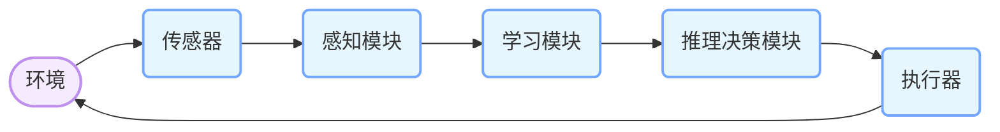

# 神经科学启发的AI Agent认知模型设计

> 关键词：神经科学、AI Agent、认知模型、模型设计、人工智能

> 摘要：本文深入探讨了基于神经科学启发的AI Agent认知模型设计。从背景介绍出发，阐述了研究的目的、范围、预期读者等内容。详细讲解了核心概念及其联系，包括认知模型的原理和架构，并通过Mermaid流程图进行直观展示。深入剖析了核心算法原理，用Python代码进行详细阐述，同时给出了相关的数学模型和公式。通过项目实战，展示了代码的实际案例并进行详细解释。介绍了该认知模型的实际应用场景，推荐了学习、开发相关的工具和资源，最后总结了未来发展趋势与挑战，解答了常见问题并提供了扩展阅读和参考资料。旨在为相关领域的研究人员和开发者提供全面而深入的指导。

## 1. 背景介绍 
### 1.1 目的和范围
本研究的目的在于设计一种受神经科学启发的AI Agent认知模型。随着人工智能技术的不断发展，传统的AI模型在处理复杂环境和任务时逐渐暴露出局限性。神经科学作为研究人类大脑和神经系统的学科，为AI Agent的设计提供了丰富的灵感和理论基础。通过借鉴神经科学的原理和机制，我们期望设计出的认知模型能够使AI Agent具有更强大的感知、学习、推理和决策能力，从而更好地适应复杂多变的环境。

本研究的范围涵盖了从神经科学原理的提取到AI Agent认知模型的设计、实现和应用。具体包括对神经科学中关键概念的研究，如神经元的信息传递、神经网络的学习机制等；将这些原理转化为AI Agent认知模型的架构和算法；通过代码实现模型并进行实验验证；探索模型在不同实际场景中的应用。

### 1.2 预期读者
本文的预期读者主要包括人工智能领域的研究人员、开发者、学者，以及对神经科学与人工智能交叉领域感兴趣的学生和爱好者。对于研究人员和学者，本文可以为他们的研究提供新的思路和方法；对于开发者，本文可以帮助他们在实际项目中设计和实现更智能的AI Agent；对于学生和爱好者，本文可以作为他们了解神经科学启发的AI Agent认知模型的入门资料。

### 1.3 文档结构概述
本文将按照以下结构进行组织：
- 核心概念与联系：介绍神经科学启发的AI Agent认知模型的核心概念，包括认知模型的原理和架构，并通过文本示意图和Mermaid流程图进行展示。
- 核心算法原理 & 具体操作步骤：详细讲解认知模型的核心算法原理，并用Python代码进行详细阐述。
- 数学模型和公式 & 详细讲解 & 举例说明：给出认知模型的数学模型和公式，并进行详细讲解和举例说明。
- 项目实战：代码实际案例和详细解释说明：通过一个实际项目案例，展示认知模型的代码实现和详细解释。
- 实际应用场景：介绍认知模型在不同实际场景中的应用。
- 工具和资源推荐：推荐学习、开发相关的工具和资源，包括书籍、在线课程、技术博客、IDE和编辑器、调试和性能分析工具、相关框架和库以及相关论文著作等。
- 总结：未来发展趋势与挑战：总结认知模型的未来发展趋势和面临的挑战。
- 附录：常见问题与解答：解答读者可能遇到的常见问题。
- 扩展阅读 & 参考资料：提供扩展阅读的建议和相关参考资料。

### 1.4 术语表
#### 1.4.1 核心术语定义
- **AI Agent**：人工智能代理，是一种能够感知环境、进行决策并采取行动的智能实体。
- **认知模型**：模拟人类认知过程的模型，包括感知、学习、推理、决策等环节。
- **神经科学**：研究人类大脑和神经系统的结构、功能和活动规律的学科。
- **神经元**：神经系统的基本结构和功能单位，能够接收、处理和传递信息。
- **神经网络**：由大量神经元相互连接形成的网络，能够进行信息处理和学习。

#### 1.4.2 相关概念解释
- **信息传递**：神经元之间通过电信号和化学信号进行信息的传递。
- **突触可塑性**：突触的连接强度可以根据神经元的活动情况进行调整，是神经网络学习的基础。
- **强化学习**：一种机器学习方法，通过智能体与环境进行交互，根据环境反馈的奖励信号来学习最优的行为策略。

#### 1.4.3 缩略词列表
- **AI**：Artificial Intelligence，人工智能
- **ML**：Machine Learning，机器学习
- **RL**：Reinforcement Learning，强化学习

## 2. 核心概念与联系 
### 核心概念原理
神经科学启发的AI Agent认知模型的核心原理是借鉴神经科学中大脑的认知机制，将其应用于AI Agent的设计中。大脑是一个高度复杂的信息处理系统，具有强大的感知、学习、推理和决策能力。AI Agent认知模型试图模拟大脑的这些功能，使AI Agent能够更好地适应环境和完成任务。

在感知方面，大脑通过各种感觉器官（如眼睛、耳朵、皮肤等）接收外界信息，并将其转化为神经信号传递到大脑皮层进行处理。AI Agent可以通过各种传感器（如摄像头、麦克风、传感器阵列等）感知环境信息，并将其转化为数字信号进行处理。

在学习方面，大脑通过神经元之间的突触可塑性来实现学习。当神经元频繁地同时激活时，它们之间的突触连接强度会增强；反之，当神经元很少同时激活时，突触连接强度会减弱。AI Agent可以通过机器学习算法（如深度学习、强化学习等）来实现学习，根据环境反馈的信息调整自身的参数和策略。

在推理和决策方面，大脑通过对感知信息和学习到的知识进行整合和分析，做出合理的决策。AI Agent可以通过推理算法（如逻辑推理、概率推理等）和决策算法（如优化算法、博弈论等）来实现推理和决策，根据环境状态和目标选择最优的行动方案。

### 架构的文本示意图
```plaintext
+---------------------+
|  环境               |
+---------------------+
        |
        v
+---------------------+
|  传感器             |
+---------------------+
        |
        v
+---------------------+
|  感知模块           |
+---------------------+
        |
        v
+---------------------+
|  学习模块           |
+---------------------+
        |
        v
+---------------------+
|  推理决策模块       |
+---------------------+
        |
        v
+---------------------+
|  执行器             |
+---------------------+
        |
        v
+---------------------+
|  环境               |
+---------------------+
```
该示意图展示了神经科学启发的AI Agent认知模型的基本架构。AI Agent通过传感器感知环境信息，将其传递给感知模块进行处理。感知模块将处理后的信息传递给学习模块，学习模块根据环境反馈的信息进行学习和参数调整。推理决策模块根据感知信息和学习到的知识进行推理和决策，生成行动方案。执行器根据行动方案执行相应的动作，影响环境。环境的变化又会被传感器感知，形成一个闭环的反馈系统。

### Mermaid流程图

该流程图直观地展示了AI Agent与环境之间的交互过程。从环境中获取信息，经过感知、学习、推理决策等环节，最终通过执行器对环境产生影响，形成一个循环的过程。

## 3. 核心算法原理 & 具体操作步骤 
### 核心算法原理
神经科学启发的AI Agent认知模型的核心算法主要包括感知算法、学习算法和推理决策算法。

#### 感知算法
感知算法的主要任务是将传感器获取的原始信息转化为AI Agent能够理解和处理的特征表示。在计算机视觉领域，常用的感知算法包括卷积神经网络（Convolutional Neural Network，CNN）。CNN通过卷积层、池化层和全连接层等结构，自动提取图像的特征。

以下是一个简单的使用PyTorch实现的CNN感知算法示例：
```python
import torch
import torch.nn as nn

class SimpleCNN(nn.Module):
    def __init__(self):
        super(SimpleCNN, self).__init__()
        self.conv1 = nn.Conv2d(3, 16, kernel_size=3, padding=1)
        self.relu1 = nn.ReLU()
        self.pool1 = nn.MaxPool2d(2)
        self.conv2 = nn.Conv2d(16, 32, kernel_size=3, padding=1)
        self.relu2 = nn.ReLU()
        self.pool2 = nn.MaxPool2d(2)
        self.fc1 = nn.Linear(32 * 8 * 8, 128)
        self.relu3 = nn.ReLU()
        self.fc2 = nn.Linear(128, 10)

    def forward(self, x):
        x = self.pool1(self.relu1(self.conv1(x)))
        x = self.pool2(self.relu2(self.conv2(x)))
        x = x.view(-1, 32 * 8 * 8)
        x = self.relu3(self.fc1(x))
        x = self.fc2(x)
        return x

# 初始化模型
model = SimpleCNN()
# 随机生成一个输入
input_tensor = torch.randn(1, 3, 32, 32)
# 前向传播
output = model(input_tensor)
print(output)
```
在这个示例中，我们定义了一个简单的CNN模型，包含两个卷积层、两个池化层和两个全连接层。通过前向传播，将输入的图像数据转化为特征表示。

#### 学习算法
学习算法的主要任务是根据环境反馈的信息调整AI Agent的参数和策略，使其能够不断提高性能。强化学习是一种常用的学习算法，其中深度Q网络（Deep Q-Network，DQN）是一种经典的深度强化学习算法。

以下是一个简单的使用PyTorch实现的DQN学习算法示例：
```python
import torch
import torch.nn as nn
import torch.optim as optim
import numpy as np

# 定义Q网络
class QNetwork(nn.Module):
    def __init__(self, state_size, action_size):
        super(QNetwork, self).__init__()
        self.fc1 = nn.Linear(state_size, 64)
        self.relu = nn.ReLU()
        self.fc2 = nn.Linear(64, action_size)

    def forward(self, x):
        x = self.relu(self.fc1(x))
        x = self.fc2(x)
        return x

# 初始化Q网络和目标Q网络
state_size = 4
action_size = 2
q_network = QNetwork(state_size, action_size)
target_q_network = QNetwork(state_size, action_size)
target_q_network.load_state_dict(q_network.state_dict())

# 定义优化器和损失函数
optimizer = optim.Adam(q_network.parameters(), lr=0.001)
criterion = nn.MSELoss()

# 模拟一个经验回放缓冲区
replay_buffer = []

# 训练循环
for episode in range(100):
    state = np.random.randn(state_size)
    state = torch.FloatTensor(state).unsqueeze(0)
    action = np.random.randint(action_size)
    next_state = np.random.randn(state_size)
    next_state = torch.FloatTensor(next_state).unsqueeze(0)
    reward = np.random.randn()
    done = np.random.choice([True, False])

    # 将经验存储到回放缓冲区
    replay_buffer.append((state, action, reward, next_state, done))

    if len(replay_buffer) >= 32:
        # 从回放缓冲区中随机采样一批经验
        batch = np.random.choice(replay_buffer, 32)
        states, actions, rewards, next_states, dones = zip(*batch)

        states = torch.cat(states)
        actions = torch.tensor(actions, dtype=torch.long).unsqueeze(1)
        rewards = torch.tensor(rewards, dtype=torch.float32).unsqueeze(1)
        next_states = torch.cat(next_states)
        dones = torch.tensor(dones, dtype=torch.float32).unsqueeze(1)

        # 计算Q值
        q_values = q_network(states).gather(1, actions)
        next_q_values = target_q_network(next_states).max(1)[0].unsqueeze(1)
        target_q_values = rewards + (1 - dones) * 0.99 * next_q_values

        # 计算损失
        loss = criterion(q_values, target_q_values)

        # 反向传播和优化
        optimizer.zero_grad()
        loss.backward()
        optimizer.step()

        # 更新目标Q网络
        target_q_network.load_state_dict(q_network.state_dict())

    print(f"Episode {episode}: Loss = {loss.item()}")
```
在这个示例中，我们定义了一个Q网络和一个目标Q网络，使用经验回放缓冲区来存储和采样经验。通过计算Q值和目标Q值之间的损失，进行反向传播和优化，不断更新Q网络的参数。同时，定期更新目标Q网络的参数，以提高学习的稳定性。

#### 推理决策算法
推理决策算法的主要任务是根据感知信息和学习到的知识，选择最优的行动方案。在强化学习中，常用的推理决策算法包括贪心策略和ε-贪心策略。

以下是一个简单的ε-贪心策略的Python实现：
```python
import numpy as np

def epsilon_greedy_policy(q_values, epsilon):
    if np.random.rand() < epsilon:
        # 随机选择一个动作
        action = np.random.randint(len(q_values))
    else:
        # 选择Q值最大的动作
        action = np.argmax(q_values)
    return action

# 示例Q值
q_values = [0.1, 0.2, 0.3, 0.4]
epsilon = 0.1
action = epsilon_greedy_policy(q_values, epsilon)
print(f"Selected action: {action}")
```
在这个示例中，根据ε的值，以一定的概率随机选择一个动作，或者选择Q值最大的动作。

### 具体操作步骤
1. **数据准备**：收集和整理与任务相关的环境数据，包括传感器数据、奖励数据等。对数据进行预处理，如归一化、特征提取等。
2. **模型初始化**：根据任务的需求和环境的特点，选择合适的感知算法、学习算法和推理决策算法。初始化模型的参数。
3. **训练模型**：将准备好的数据输入到模型中，使用学习算法进行训练。在训练过程中，不断调整模型的参数，使其能够更好地适应环境。
4. **模型评估**：使用测试数据对训练好的模型进行评估，计算模型的性能指标，如准确率、召回率、平均回报等。
5. **部署和优化**：将评估合格的模型部署到实际环境中，根据实际运行情况对模型进行优化和调整。

## 4. 数学模型和公式 & 详细讲解 & 举例说明 
### 感知算法的数学模型和公式
#### 卷积神经网络（CNN）
在CNN中，卷积层的数学模型可以表示为：
$$y_{i,j}^l = \sum_{m=0}^{M-1}\sum_{n=0}^{N-1}x_{i+m,j+n}^{l-1} \cdot w_{m,n}^l + b^l$$
其中，$y_{i,j}^l$ 表示第 $l$ 层卷积层在位置 $(i,j)$ 处的输出，$x_{i+m,j+n}^{l-1}$ 表示第 $l-1$ 层在位置 $(i+m,j+n)$ 处的输入，$w_{m,n}^l$ 表示第 $l$ 层的卷积核在位置 $(m,n)$ 处的权重，$b^l$ 表示第 $l$ 层的偏置，$M$ 和 $N$ 分别表示卷积核的高度和宽度。

池化层的数学模型可以表示为：
$$y_{i,j}^l = \max_{m=0}^{M-1}\max_{n=0}^{N-1}x_{i \cdot s + m,j \cdot s + n}^{l-1}$$
其中，$y_{i,j}^l$ 表示第 $l$ 层池化层在位置 $(i,j)$ 处的输出，$x_{i \cdot s + m,j \cdot s + n}^{l-1}$ 表示第 $l-1$ 层在位置 $(i \cdot s + m,j \cdot s + n)$ 处的输入，$s$ 表示池化的步长，$M$ 和 $N$ 分别表示池化窗口的高度和宽度。

举例说明：假设输入图像的大小为 $32 \times 32$，卷积核的大小为 $3 \times 3$，步长为 $1$，填充为 $1$，则卷积层的输出大小仍然为 $32 \times 32$。如果使用 $2 \times 2$ 的最大池化层，步长为 $2$，则池化层的输出大小为 $16 \times 16$。

### 学习算法的数学模型和公式
#### 深度Q网络（DQN）
DQN的目标是学习一个Q函数 $Q(s,a)$，表示在状态 $s$ 下采取动作 $a$ 的期望累积回报。Q函数的更新公式可以表示为：
$$Q(s,a) \leftarrow Q(s,a) + \alpha \left[r + \gamma \max_{a'} Q(s',a') - Q(s,a)\right]$$
其中，$\alpha$ 是学习率，$r$ 是当前的奖励，$\gamma$ 是折扣因子，$s'$ 是下一个状态。

在DQN中，使用神经网络来近似Q函数。损失函数通常采用均方误差（Mean Squared Error，MSE）：
$$L(\theta) = \frac{1}{N} \sum_{i=1}^{N} \left(r_i + \gamma \max_{a'} Q(s_i',a';\theta^-) - Q(s_i,a_i;\theta)\right)^2$$
其中，$\theta$ 是Q网络的参数，$\theta^-$ 是目标Q网络的参数，$N$ 是批量大小。

举例说明：假设在一个简单的迷宫游戏中，状态 $s$ 表示当前的位置，动作 $a$ 表示向上、向下、向左或向右移动。当AI Agent从状态 $s$ 移动到状态 $s'$ 并获得奖励 $r$ 时，根据DQN的更新公式，更新Q网络的参数，使得Q函数能够更好地估计在不同状态下采取不同动作的价值。

### 推理决策算法的数学模型和公式
#### ε-贪心策略
ε-贪心策略的数学模型可以表示为：
$$\pi(a|s) = \begin{cases}
1 - \epsilon + \frac{\epsilon}{|A(s)|}, & \text{if } a = \arg\max_{a'} Q(s,a') \\
\frac{\epsilon}{|A(s)|}, & \text{otherwise}
\end{cases}$$
其中，$\pi(a|s)$ 表示在状态 $s$ 下采取动作 $a$ 的概率，$\epsilon$ 是探索率，$|A(s)|$ 表示在状态 $s$ 下可用的动作数量。

举例说明：假设在一个有 $4$ 个动作可选的环境中，$\epsilon = 0.1$。如果当前状态下Q值最大的动作是动作 $2$，则选择动作 $2$ 的概率为 $1 - 0.1 + \frac{0.1}{4} = 0.925$，选择其他动作的概率为 $\frac{0.1}{4} = 0.025$。

## 5. 项目实战：代码实际案例和详细解释说明 
### 5.1  开发环境搭建
本项目使用Python语言进行开发，需要安装以下库：
- **PyTorch**：用于构建和训练深度学习模型。
- **NumPy**：用于数值计算。
- **OpenAI Gym**：用于提供各种强化学习环境。

可以使用以下命令安装这些库：
```bash
pip install torch numpy gym
```

### 5.2  源代码详细实现和代码解读
以下是一个使用神经科学启发的AI Agent认知模型解决OpenAI Gym中的CartPole-v1环境的完整代码示例：
```python
import torch
import torch.nn as nn
import torch.optim as optim
import numpy as np
import gym

# 定义Q网络
class QNetwork(nn.Module):
    def __init__(self, state_size, action_size):
        super(QNetwork, self).__init__()
        self.fc1 = nn.Linear(state_size, 64)
        self.relu = nn.ReLU()
        self.fc2 = nn.Linear(64, action_size)

    def forward(self, x):
        x = self.relu(self.fc1(x))
        x = self.fc2(x)
        return x

# 定义ε-贪心策略
def epsilon_greedy_policy(q_values, epsilon):
    if np.random.rand() < epsilon:
        action = np.random.randint(len(q_values))
    else:
        action = np.argmax(q_values)
    return action

# 初始化环境
env = gym.make('CartPole-v1')
state_size = env.observation_space.shape[0]
action_size = env.action_space.n

# 初始化Q网络和目标Q网络
q_network = QNetwork(state_size, action_size)
target_q_network = QNetwork(state_size, action_size)
target_q_network.load_state_dict(q_network.state_dict())

# 定义优化器和损失函数
optimizer = optim.Adam(q_network.parameters(), lr=0.001)
criterion = nn.MSELoss()

# 定义超参数
epsilon = 1.0
epsilon_decay = 0.995
epsilon_min = 0.01
gamma = 0.99
batch_size = 32
replay_buffer = []
max_buffer_size = 10000

# 训练循环
for episode in range(1000):
    state = env.reset()
    state = torch.FloatTensor(state).unsqueeze(0)
    total_reward = 0
    done = False

    while not done:
        # 使用ε-贪心策略选择动作
        q_values = q_network(state).detach().numpy()[0]
        action = epsilon_greedy_policy(q_values, epsilon)

        # 执行动作
        next_state, reward, done, _ = env.step(action)
        next_state = torch.FloatTensor(next_state).unsqueeze(0)

        # 将经验存储到回放缓冲区
        replay_buffer.append((state, action, reward, next_state, done))
        if len(replay_buffer) > max_buffer_size:
            replay_buffer.pop(0)

        total_reward += reward
        state = next_state

        if len(replay_buffer) >= batch_size:
            # 从回放缓冲区中随机采样一批经验
            batch = np.random.choice(replay_buffer, batch_size)
            states, actions, rewards, next_states, dones = zip(*batch)

            states = torch.cat(states)
            actions = torch.tensor(actions, dtype=torch.long).unsqueeze(1)
            rewards = torch.tensor(rewards, dtype=torch.float32).unsqueeze(1)
            next_states = torch.cat(next_states)
            dones = torch.tensor(dones, dtype=torch.float32).unsqueeze(1)

            # 计算Q值
            q_values = q_network(states).gather(1, actions)
            next_q_values = target_q_network(next_states).max(1)[0].unsqueeze(1)
            target_q_values = rewards + (1 - dones) * gamma * next_q_values

            # 计算损失
            loss = criterion(q_values, target_q_values)

            # 反向传播和优化
            optimizer.zero_grad()
            loss.backward()
            optimizer.step()

            # 更新目标Q网络
            target_q_network.load_state_dict(q_network.state_dict())

    # 衰减探索率
    if epsilon > epsilon_min:
        epsilon *= epsilon_decay

    print(f"Episode {episode}: Total Reward = {total_reward}, Epsilon = {epsilon}")

# 测试模型
state = env.reset()
state = torch.FloatTensor(state).unsqueeze(0)
total_reward = 0
done = False

while not done:
    q_values = q_network(state).detach().numpy()[0]
    action = np.argmax(q_values)
    next_state, reward, done, _ = env.step(action)
    next_state = torch.FloatTensor(next_state).unsqueeze(0)
    total_reward += reward
    state = next_state

print(f"Test Total Reward = {total_reward}")

env.close()
```
### 代码解读与分析
1. **Q网络定义**：定义了一个简单的全连接神经网络作为Q网络，用于估计在不同状态下采取不同动作的Q值。
2. **ε-贪心策略**：实现了ε-贪心策略，用于在训练过程中平衡探索和利用。
3. **环境初始化**：使用OpenAI Gym初始化CartPole-v1环境，并获取状态空间和动作空间的大小。
4. **Q网络和目标Q网络初始化**：初始化Q网络和目标Q网络，并将目标Q网络的参数初始化为与Q网络相同。
5. **优化器和损失函数**：使用Adam优化器和均方误差损失函数。
6. **超参数设置**：设置了探索率、折扣因子、批量大小等超参数。
7. **训练循环**：在每个回合中，AI Agent与环境进行交互，使用ε-贪心策略选择动作，将经验存储到回放缓冲区。当回放缓冲区中的经验数量达到批量大小时，从回放缓冲区中随机采样一批经验，计算Q值和目标Q值之间的损失，进行反向传播和优化。定期更新目标Q网络的参数。
8. **探索率衰减**：随着训练的进行，逐渐减小探索率，使AI Agent更多地利用已经学习到的知识。
9. **测试模型**：在训练结束后，使用训练好的模型在环境中进行测试，计算总奖励。

通过这个项目实战，我们可以看到如何使用神经科学启发的AI Agent认知模型解决实际的强化学习问题。

## 6. 实际应用场景 
### 机器人导航
在机器人导航领域，神经科学启发的AI Agent认知模型可以帮助机器人更好地感知环境、学习环境的地图和规则，并做出合理的决策。机器人可以通过传感器（如激光雷达、摄像头等）感知周围的环境信息，使用感知算法提取环境的特征。学习算法可以帮助机器人学习环境的地图和路径规划策略。推理决策算法可以根据当前的环境状态和目标，选择最优的行动方案，使机器人能够安全、高效地到达目的地。

### 自动驾驶
在自动驾驶领域，AI Agent认知模型可以用于车辆的感知、决策和控制。车辆可以通过各种传感器（如摄像头、毫米波雷达、超声波传感器等）感知周围的交通环境，包括道路、车辆、行人等。感知算法可以对传感器数据进行处理，识别交通标志、车道线、障碍物等。学习算法可以学习交通规则和驾驶策略。推理决策算法可以根据感知到的环境信息和学习到的知识，做出加速、减速、转弯等决策，实现自动驾驶。

### 游戏AI
在游戏领域，神经科学启发的AI Agent认知模型可以用于开发智能的游戏AI。游戏AI可以通过感知游戏环境，学习游戏规则和策略，与玩家进行对抗或合作。例如，在策略游戏中，AI Agent可以根据当前的游戏局势，选择最优的发展策略和战斗策略；在角色扮演游戏中，AI Agent可以根据玩家的行为和游戏剧情，做出相应的反应和决策。

### 智能家居
在智能家居领域，AI Agent认知模型可以用于实现智能设备的自动化控制和个性化服务。智能家居系统可以通过传感器（如温度传感器、湿度传感器、人体红外传感器等）感知家庭环境的状态，使用感知算法对环境信息进行处理。学习算法可以学习用户的生活习惯和偏好。推理决策算法可以根据环境状态和用户的习惯，自动控制智能设备的开关、调节温度、亮度等，为用户提供个性化的服务。

## 7. 工具和资源推荐
### 7.1 学习资源推荐
#### 7.1.1 书籍推荐
- 《深度学习》（Deep Learning）：由Ian Goodfellow、Yoshua Bengio和Aaron Courville所著，是深度学习领域的经典教材，涵盖了深度学习的基本概念、算法和应用。
- 《强化学习：原理与Python实现》（Reinforcement Learning: An Introduction）：由Richard S. Sutton和Andrew G. Barto所著，是强化学习领域的权威书籍，详细介绍了强化学习的基本原理和算法。
- 《神经科学：探索脑》（Neuroscience: Exploring the Brain）：由Mark F. Bear、Barry W. Connors和Michael A. Paradiso所著，是神经科学领域的经典教材，介绍了神经系统的结构、功能和活动规律。

#### 7.1.2 在线课程
- Coursera上的“深度学习专项课程”（Deep Learning Specialization）：由吴恩达教授主讲，包括五门课程，涵盖了深度学习的各个方面。
- Udemy上的“强化学习实战”（Reinforcement Learning in Action）：通过实际项目案例，介绍了强化学习的算法和应用。
- edX上的“神经科学基础”（Fundamentals of Neuroscience）：由哈佛大学的教授主讲，介绍了神经科学的基本概念和研究方法。

#### 7.1.3 技术博客和网站
- Medium上的“Towards Data Science”：是一个专注于数据科学和人工智能的技术博客，提供了大量的文章和教程。
- arXiv.org：是一个预印本服务器，提供了大量的最新研究论文，涵盖了神经科学、人工智能等多个领域。
- OpenAI的官方博客：提供了OpenAI在人工智能领域的最新研究成果和应用案例。

### 7.2 开发工具框架推荐
#### 7.2.1 IDE和编辑器
- PyCharm：是一款专门为Python开发设计的集成开发环境，提供了丰富的功能和插件，方便代码的编写、调试和管理。
- Jupyter Notebook：是一个交互式的开发环境，支持Python、R等多种编程语言，适合进行数据分析和模型实验。
- Visual Studio Code：是一款轻量级的代码编辑器，支持多种编程语言和插件，具有强大的代码编辑和调试功能。

#### 7.2.2 调试和性能分析工具
- TensorBoard：是TensorFlow提供的一个可视化工具，用于监控和分析深度学习模型的训练过程和性能。
- Py-Spy：是一个用于Python代码性能分析的工具，可以帮助开发者找出代码中的性能瓶颈。
- gdb：是一个通用的调试器，支持多种编程语言，可以用于调试Python代码和C++代码。

#### 7.2.3 相关框架和库
- PyTorch：是一个开源的深度学习框架，提供了丰富的神经网络层和优化算法，支持GPU加速，易于使用和扩展。
- TensorFlow：是Google开发的一个开源的深度学习框架，具有强大的分布式训练和部署能力，广泛应用于工业界和学术界。
- OpenAI Gym：是一个用于开发和比较强化学习算法的工具包，提供了各种标准的强化学习环境。

### 7.3 相关论文著作推荐
#### 7.3.1 经典论文
- “Playing Atari with Deep Reinforcement Learning”：由Volodymyr Mnih等人发表，提出了深度Q网络（DQN）算法，开创了深度强化学习的先河。
- “ImageNet Classification with Deep Convolutional Neural Networks”：由Alex Krizhevsky等人发表，提出了AlexNet模型，在ImageNet图像分类竞赛中取得了优异的成绩，推动了卷积神经网络的发展。
- “A Logical Calculus of the Ideas Immanent in Nervous Activity”：由Warren S. McCulloch和Walter Pitts发表，提出了McCulloch-Pitts神经元模型，为神经网络的研究奠定了基础。

#### 7.3.2 最新研究成果
- 关注NeurIPS、ICML、CVPR等顶级人工智能会议的论文，这些会议汇集了人工智能领域的最新研究成果。
- 关注《Nature》、《Science》、《Neuron》等顶级学术期刊上关于神经科学和人工智能的研究论文。

#### 7.3.3 应用案例分析
- 阅读一些实际应用案例的分析文章，了解神经科学启发的AI Agent认知模型在不同领域的应用情况和效果。例如，一些关于自动驾驶、机器人导航等领域的技术报告和研究论文。

## 8. 总结：未来发展趋势与挑战
### 未来发展趋势
- **跨学科融合**：神经科学启发的AI Agent认知模型将与神经科学、认知心理学、计算机科学等多个学科进行更深入的融合。通过借鉴神经科学的最新研究成果，不断完善AI Agent的认知模型，使其更加接近人类的认知能力。
- **多模态感知与决策**：未来的AI Agent将具备多模态感知能力，能够同时处理视觉、听觉、触觉等多种信息。在决策过程中，将综合考虑多种模态的信息，做出更加准确和合理的决策。
- **自适应学习与进化**：AI Agent将具备自适应学习和进化的能力，能够根据环境的变化和任务的需求，自动调整自己的学习策略和模型参数。同时，通过遗传算法等方法，实现AI Agent的进化和优化。
- **人机协作与共生**：AI Agent将与人类进行更加紧密的协作和共生。在医疗、教育、金融等领域，AI Agent将作为人类的助手，为人类提供更加智能和高效的服务。同时，人类也可以为AI Agent提供指导和反馈，促进AI Agent的发展和进步。

### 挑战
- **神经科学原理的理解和应用**：虽然神经科学为AI Agent认知模型的设计提供了丰富的灵感和理论基础，但目前我们对神经科学的理解还存在很多不足。如何准确地理解和应用神经科学的原理，将其转化为有效的AI算法和模型，是一个亟待解决的问题。
- **计算资源的限制**：神经科学启发的AI Agent认知模型通常需要大量的计算资源来进行训练和推理。随着模型的复杂度不断增加，对计算资源的需求也越来越高。如何在有限的计算资源下，提高模型的性能和效率，是一个挑战。
- **伦理和安全问题**：随着AI Agent的应用越来越广泛，伦理和安全问题也日益凸显。例如，AI Agent的决策可能会对人类的利益产生影响，如何确保AI Agent的决策是公正、公平和安全的，是一个需要关注的问题。
- **数据隐私和保护**：AI Agent的训练和推理通常需要大量的数据，这些数据可能包含用户的隐私信息。如何在保护用户数据隐私的前提下，充分利用数据进行模型训练和优化，是一个挑战。

## 9. 附录：常见问题与解答
### 问题1：神经科学启发的AI Agent认知模型与传统的AI模型有什么区别？
传统的AI模型通常是基于规则或统计方法进行设计的，缺乏对人类认知机制的深入理解。而神经科学启发的AI Agent认知模型借鉴了神经科学中大脑的认知机制，如神经元的信息传递、神经网络的学习机制等，使AI Agent具有更强大的感知、学习、推理和决策能力，能够更好地适应复杂多变的环境。

### 问题2：如何选择合适的感知算法、学习算法和推理决策算法？
选择合适的算法需要考虑任务的需求、环境的特点和数据的类型。例如，在处理图像数据时，可以选择卷积神经网络作为感知算法；在处理序列数据时，可以选择循环神经网络。在学习算法方面，如果任务是一个有监督学习问题，可以选择深度学习算法；如果任务是一个强化学习问题，可以选择深度Q网络、策略梯度算法等。在推理决策算法方面，可以根据任务的特点选择贪心策略、ε-贪心策略、蒙特卡罗树搜索等。

### 问题3：在训练过程中，模型的性能不稳定怎么办？
模型性能不稳定可能是由于多种原因引起的，如学习率设置不合理、数据分布不均衡、模型过拟合等。可以尝试调整学习率，采用自适应学习率方法，如Adagrad、Adadelta、Adam等。对数据进行预处理，如归一化、数据增强等，以提高数据的质量和多样性。使用正则化方法，如L1和L2正则化、Dropout等，以防止模型过拟合。

### 问题4：如何评估神经科学启发的AI Agent认知模型的性能？
可以使用多种指标来评估模型的性能，如准确率、召回率、F1值、平均回报、均方误差等。具体选择哪种指标需要根据任务的类型和目标来确定。例如，在分类任务中，可以使用准确率、召回率和F1值来评估模型的性能；在强化学习任务中，可以使用平均回报来评估模型的性能。同时，还可以进行可视化分析，如绘制学习曲线、损失曲线等，以直观地观察模型的训练过程和性能变化。

## 10. 扩展阅读 & 参考资料
### 扩展阅读
- 《人工智能：一种现代的方法》（Artificial Intelligence: A Modern Approach）：这本书全面介绍了人工智能的各个方面，包括搜索算法、知识表示、机器学习、自然语言处理等，是人工智能领域的经典教材。
- 《脑与意识》（Consciousness and the Brain）：由Stanislas Dehaene所著，探讨了意识的神经基础和认知机制，对理解人类的认知过程有很大的帮助。
- 《复杂》（Complexity: A Guided Tour）：由Melanie Mitchell所著，介绍了复杂系统的概念、理论和方法，对于理解神经网络和AI Agent的行为有一定的启示作用。

### 参考资料
- Goodfellow, I., Bengio, Y., & Courville, A. (2016). Deep Learning. MIT Press.
- Sutton, R. S., & Barto, A. G. (2018). Reinforcement Learning: An Introduction. MIT Press.
- Bear, M. F., Connors, B. W., & Paradiso, M. A. (2015). Neuroscience: Exploring the Brain. Lippincott Williams & Wilkins.
- Mnih, V., Kavukcuoglu, K., Silver, D., Rusu, A. A., Veness, J., Bellemare, M. G.,... & Petersen, S. (2015). Human-level control through deep reinforcement learning. Nature, 518(7540), 529-533.
- Krizhevsky, A., Sutskever, I., & Hinton, G. E. (2012). ImageNet classification with deep convolutional neural networks. In Advances in neural information processing systems (pp. 1097-1105).
- McCulloch, W. S., & Pitts, W. (1943). A logical calculus of the ideas immanent in nervous activity. The bulletin of mathematical biophysics, 5(4), 115-133.

作者：AI天才研究院/AI Genius Institute & 禅与计算机程序设计艺术 /Zen And The Art of Computer Programming