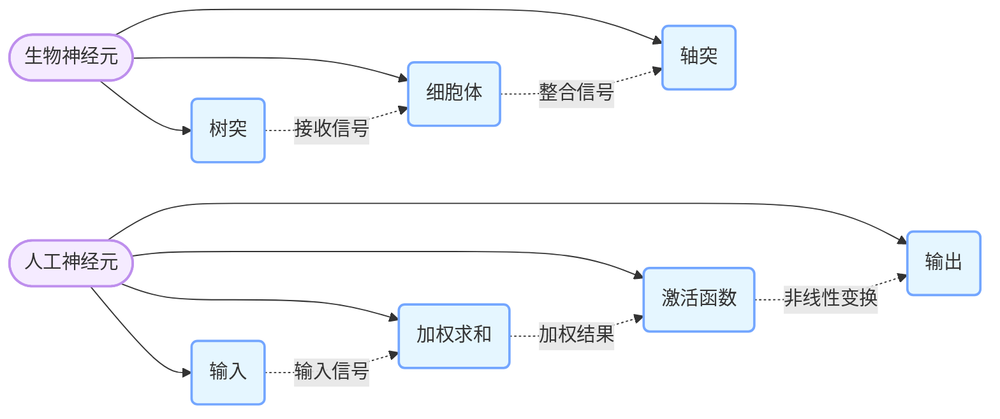

# 神经科学启发的AI算法设计

> 关键词：神经科学、AI算法、生物神经元、人工神经网络、突触可塑性、深度学习、计算神经科学

> 摘要：本文围绕神经科学启发的AI算法设计展开深入探讨。首先介绍了神经科学与AI算法结合的背景和意义，阐述相关核心概念及其联系，包括生物神经元与人工神经元的对应关系等。详细讲解了核心算法原理，通过Python代码示例进行说明。分析了其中涉及的数学模型和公式，并举例解释。接着通过项目实战展示代码实现和解读，探讨了该类算法的实际应用场景。推荐了相关的学习资源、开发工具框架以及论文著作。最后总结了未来发展趋势与挑战，还提供了常见问题解答和扩展阅读参考资料，旨在全面展现神经科学启发的AI算法设计的理论、实践和发展前景。

## 1. 背景介绍 
### 1.1 目的和范围
神经科学与人工智能的交叉领域正日益成为研究热点。本文章的目的在于深入探讨神经科学如何启发AI算法的设计，从神经科学的基本原理出发，揭示其对AI算法的理论支持和实践指导作用。范围涵盖神经科学的基础概念、基于神经科学的AI算法核心原理、相关数学模型、实际项目案例以及未来发展趋势等多个方面，旨在为读者提供一个全面且深入的关于神经科学启发的AI算法设计的知识体系。

### 1.2 预期读者
本文预期读者包括对人工智能、神经科学感兴趣的科研人员、工程师、学生等。对于从事AI算法研究和开发的专业人士，可从中获取新的设计思路和方法；对于学生群体，有助于加深对AI算法和神经科学之间联系的理解；对于一般的技术爱好者，能为其打开一个跨学科研究的新视野。

### 1.3 文档结构概述
本文将按照以下结构展开：首先介绍背景信息，包括目的、预期读者和文档结构等；接着阐述核心概念与联系，明确神经科学和AI算法相关概念的对应关系和相互作用；然后详细讲解核心算法原理及具体操作步骤，并用Python代码示例进行说明；再分析数学模型和公式，通过举例加深理解；之后进行项目实战，展示代码实现和解读；探讨实际应用场景；推荐相关的工具和资源；最后总结未来发展趋势与挑战，提供常见问题解答和扩展阅读参考资料。

### 1.4 术语表
#### 1.4.1 核心术语定义
- **生物神经元**：神经系统的基本结构和功能单位，能够接收、整合和传递电信号，是生物神经系统信息处理的基础。
- **人工神经元**：AI算法中模拟生物神经元功能的数学模型，是人工神经网络的基本组成单元。
- **突触可塑性**：生物神经元之间突触连接强度可随活动而改变的特性，在学习和记忆过程中起着关键作用。
- **人工神经网络（ANN）**：由大量人工神经元相互连接组成的计算模型，用于模拟生物神经系统的信息处理方式。
- **深度学习**：基于深度神经网络的机器学习方法，通过多层神经网络自动学习数据的特征表示。

#### 1.4.2 相关概念解释
- **计算神经科学**：运用数学和计算方法研究神经系统的结构和功能，为AI算法设计提供理论基础。
- **神经编码**：神经系统将外界信息转换为神经信号的方式，对理解信息在生物神经系统中的处理有重要意义。
- **神经调节**：神经系统通过化学物质等调节神经元活动和突触传递的过程，影响神经系统的整体功能。

#### 1.4.3 缩略词列表
- **ANN**：人工神经网络（Artificial Neural Network）
- **DNN**：深度神经网络（Deep Neural Network）
- **CNN**：卷积神经网络（Convolutional Neural Network）
- **RNN**：循环神经网络（Recurrent Neural Network）

## 2. 核心概念与联系 

### 生物神经元与人工神经元的对应关系
生物神经元是神经系统的基本单元，它主要由树突、细胞体和轴突组成。树突负责接收来自其他神经元的信号，细胞体对这些信号进行整合，当整合后的信号达到一定阈值时，轴突会产生动作电位并将信号传递给其他神经元。

人工神经元是对生物神经元的数学抽象。它接收多个输入信号，每个输入信号乘以相应的权重，然后将这些加权输入求和，再通过一个激活函数进行非线性变换，得到最终的输出。

下面是生物神经元与人工神经元对应关系的文本示意图：

生物神经元：树突（接收信号） -> 细胞体（整合信号） -> 轴突（传递信号）
人工神经元：输入（加权求和） -> 激活函数（非线性变换） -> 输出

### Mermaid流程图


### 突触可塑性与神经网络学习机制
突触可塑性是生物神经系统学习和记忆的基础。在生物体内，神经元之间的突触连接强度会根据神经元的活动情况发生改变。当两个神经元同时兴奋时，它们之间的突触连接会增强；反之，则会减弱。

在人工神经网络中，这一特性对应着权重的更新。通过训练算法，如反向传播算法，神经网络会根据输入数据和期望输出之间的误差来调整神经元之间的连接权重，使得网络的输出逐渐接近期望输出，从而实现学习的目的。

### 神经系统的层次结构与深度神经网络
生物神经系统具有层次结构，从感觉神经元到中间神经元再到运动神经元，不同层次的神经元负责不同的信息处理任务。这种层次结构使得神经系统能够高效地处理复杂的信息。

深度神经网络模仿了生物神经系统的层次结构，通过多层的神经元网络来学习数据的不同层次的特征表示。例如，在图像识别任务中，浅层的神经网络可能学习到图像的边缘、纹理等低级特征，而深层的神经网络则可以学习到物体的形状、类别等高级特征。

## 3. 核心算法原理 & 具体操作步骤 

### 感知机算法原理
感知机是最简单的人工神经网络模型，它由一个输入层和一个输出层组成。其基本思想是通过对输入特征进行加权求和，然后通过一个阈值函数判断输出是1还是0。

#### Python源代码实现
```python
import numpy as np

class Perceptron:
    def __init__(self, input_size, learning_rate=0.1, epochs=100):
        # 初始化权重和偏置
        self.weights = np.zeros(input_size)
        self.bias = 0
        self.learning_rate = learning_rate
        self.epochs = epochs

    def activation_function(self, x):
        # 阈值函数
        return 1 if x >= 0 else 0

    def predict(self, x):
        # 计算加权和
        z = np.dot(x, self.weights) + self.bias
        # 通过激活函数得到预测结果
        return self.activation_function(z)

    def train(self, X, y):
        for _ in range(self.epochs):
            for i in range(len(X)):
                # 计算预测值
                prediction = self.predict(X[i])
                # 计算误差
                error = y[i] - prediction
                # 更新权重和偏置
                self.weights += self.learning_rate * error * X[i]
                self.bias += self.learning_rate * error
```

#### 具体操作步骤
1. **初始化**：设置输入特征的数量、学习率和训练轮数，随机初始化权重和偏置。
2. **前向传播**：对于每个输入样本，计算加权和并通过激活函数得到预测值。
3. **计算误差**：将预测值与真实标签进行比较，计算误差。
4. **更新权重和偏置**：根据误差和学习率更新权重和偏置。
5. **重复训练**：重复步骤2 - 4，直到达到指定的训练轮数。

### 反向传播算法原理
反向传播算法是训练多层神经网络的核心算法，它通过计算误差的梯度来更新网络的权重和偏置。

#### Python源代码实现
```python
import numpy as np

class NeuralNetwork:
    def __init__(self, input_size, hidden_size, output_size):
        # 初始化权重
        self.weights_input_hidden = np.random.rand(input_size, hidden_size)
        self.weights_hidden_output = np.random.rand(hidden_size, output_size)

    def sigmoid(self, x):
        # Sigmoid激活函数
        return 1 / (1 + np.exp(-x))

    def sigmoid_derivative(self, x):
        # Sigmoid函数的导数
        return x * (1 - x)

    def forward(self, X):
        # 前向传播
        self.hidden_input = np.dot(X, self.weights_input_hidden)
        self.hidden_output = self.sigmoid(self.hidden_input)
        self.output_input = np.dot(self.hidden_output, self.weights_hidden_output)
        self.output_output = self.sigmoid(self.output_input)
        return self.output_output

    def backward(self, X, y, output):
        # 反向传播
        self.output_error = y - output
        self.output_delta = self.output_error * self.sigmoid_derivative(output)

        self.hidden_error = self.output_delta.dot(self.weights_hidden_output.T)
        self.hidden_delta = self.hidden_error * self.sigmoid_derivative(self.hidden_output)

        # 更新权重
        self.weights_hidden_output += self.hidden_output.T.dot(self.output_delta)
        self.weights_input_hidden += X.T.dot(self.hidden_delta)

    def train(self, X, y, epochs):
        for _ in range(epochs):
            output = self.forward(X)
            self.backward(X, y, output)
```

#### 具体操作步骤
1. **初始化**：随机初始化网络的权重。
2. **前向传播**：将输入数据传入网络，计算各层的输出。
3. **计算误差**：计算输出层的误差。
4. **反向传播**：从输出层开始，依次计算各层的误差梯度。
5. **更新权重**：根据误差梯度更新网络的权重。
6. **重复训练**：重复步骤2 - 5，直到达到指定的训练轮数。

## 4. 数学模型和公式 & 详细讲解 & 举例说明 

### 感知机的数学模型
感知机的数学模型可以表示为：
$$y = f(\sum_{i=1}^{n} w_i x_i + b)$$
其中，$x_i$ 是输入特征，$w_i$ 是对应的权重，$b$ 是偏置，$f$ 是激活函数。在感知机中，激活函数通常是阈值函数：
$$f(z) = \begin{cases}
1, & z \geq 0 \\
0, & z < 0
\end{cases}$$

#### 详细讲解
感知机的核心思想是通过对输入特征进行加权求和，然后根据求和结果是否大于等于0来判断输出是1还是0。权重 $w_i$ 表示输入特征的重要程度，偏置 $b$ 可以看作是一个额外的输入，其值始终为1。

#### 举例说明
假设我们有一个二维输入向量 $X = [x_1, x_2]$，权重 $W = [w_1, w_2]$，偏置 $b$。则加权和为 $z = w_1 x_1 + w_2 x_2 + b$。如果 $z \geq 0$，则输出 $y = 1$；否则，$y = 0$。

### 反向传播算法的数学模型
反向传播算法基于链式法则来计算误差的梯度。假设我们有一个简单的两层神经网络，输入层有 $n$ 个神经元，隐藏层有 $m$ 个神经元，输出层有 $k$ 个神经元。

#### 前向传播公式
- 隐藏层输入：$z_j^h = \sum_{i=1}^{n} w_{ij}^h x_i + b_j^h$
- 隐藏层输出：$a_j^h = f(z_j^h)$
- 输出层输入：$z_k^o = \sum_{j=1}^{m} w_{jk}^o a_j^h + b_k^o$
- 输出层输出：$a_k^o = f(z_k^o)$

其中，$w_{ij}^h$ 是输入层到隐藏层的权重，$b_j^h$ 是隐藏层的偏置，$w_{jk}^o$ 是隐藏层到输出层的权重，$b_k^o$ 是输出层的偏置，$f$ 是激活函数。

#### 误差计算
假设我们使用均方误差作为损失函数：
$$E = \frac{1}{2} \sum_{k=1}^{k} (t_k - a_k^o)^2$$
其中，$t_k$ 是真实标签。

#### 反向传播公式
- 输出层误差：$\delta_k^o = (a_k^o - t_k) f'(z_k^o)$
- 隐藏层误差：$\delta_j^h = f'(z_j^h) \sum_{k=1}^{k} \delta_k^o w_{jk}^o$
- 权重更新：$\Delta w_{jk}^o = -\eta \delta_k^o a_j^h$，$\Delta w_{ij}^h = -\eta \delta_j^h x_i$
- 偏置更新：$\Delta b_k^o = -\eta \delta_k^o$，$\Delta b_j^h = -\eta \delta_j^h$

其中，$\eta$ 是学习率，$f'$ 是激活函数的导数。

#### 详细讲解
反向传播算法的核心是通过链式法则从输出层开始，依次计算各层的误差梯度。误差梯度表示了损失函数关于权重和偏置的变化率，通过负梯度方向更新权重和偏置可以使损失函数逐渐减小。

#### 举例说明
假设我们有一个简单的两层神经网络，输入层有2个神经元，隐藏层有3个神经元，输出层有1个神经元。输入向量 $X = [0.5, 0.3]$，真实标签 $t = 1$。通过前向传播计算各层的输出，然后根据均方误差计算误差。再通过反向传播计算各层的误差梯度，最后更新权重和偏置。

## 5. 项目实战：代码实际案例和详细解释说明 

### 5.1  开发环境搭建
#### 安装Python
首先需要安装Python，建议使用Python 3.6及以上版本。可以从Python官方网站（https://www.python.org/downloads/）下载安装包进行安装。

#### 安装相关库
本项目需要使用一些常用的Python库，如NumPy、Matplotlib等。可以使用pip命令进行安装：
```sh
pip install numpy matplotlib
```

### 5.2  源代码详细实现和代码解读
#### 实现一个简单的神经网络进行手写数字识别
```python
import numpy as np
from keras.datasets import mnist
from keras.utils import to_categorical
import matplotlib.pyplot as plt

# 加载MNIST数据集
(train_images, train_labels), (test_images, test_labels) = mnist.load_data()

# 数据预处理
train_images = train_images.reshape((60000, 28 * 28)).astype('float32') / 255
test_images = test_images.reshape((10000, 28 * 28)).astype('float32') / 255

train_labels = to_categorical(train_labels)
test_labels = to_categorical(test_labels)

# 定义神经网络类
class SimpleNeuralNetwork:
    def __init__(self, input_size, hidden_size, output_size):
        # 初始化权重
        self.weights_input_hidden = np.random.randn(input_size, hidden_size) * 0.01
        self.weights_hidden_output = np.random.randn(hidden_size, output_size) * 0.01
        self.bias_hidden = np.zeros((1, hidden_size))
        self.bias_output = np.zeros((1, output_size))

    def sigmoid(self, x):
        # Sigmoid激活函数
        return 1 / (1 + np.exp(-x))

    def sigmoid_derivative(self, x):
        # Sigmoid函数的导数
        return x * (1 - x)

    def forward(self, X):
        # 前向传播
        self.hidden_input = np.dot(X, self.weights_input_hidden) + self.bias_hidden
        self.hidden_output = self.sigmoid(self.hidden_input)
        self.output_input = np.dot(self.hidden_output, self.weights_hidden_output) + self.bias_output
        self.output_output = self.sigmoid(self.output_input)
        return self.output_output

    def backward(self, X, y, output):
        # 反向传播
        self.output_error = output - y
        self.output_delta = self.output_error * self.sigmoid_derivative(output)

        self.hidden_error = self.output_delta.dot(self.weights_hidden_output.T)
        self.hidden_delta = self.h