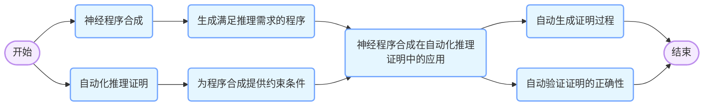

# 神经程序合成在自动化推理证明中的探索

> 关键词：神经程序合成、自动化推理证明、深度学习、程序生成、逻辑推理

> 摘要：本文聚焦于神经程序合成在自动化推理证明领域的应用与探索。首先介绍了研究背景，明确目的、范围、预期读者及文档结构，阐述相关术语。接着详细讲解神经程序合成与自动化推理证明的核心概念、联系以及架构原理，并给出相应的示意图和流程图。深入分析核心算法原理，用 Python 代码进行阐述，同时介绍相关数学模型和公式，并举例说明。通过项目实战展示代码实现与解读，探讨其实际应用场景。推荐了学习资源、开发工具框架以及相关论文著作。最后总结未来发展趋势与挑战，解答常见问题并提供扩展阅读和参考资料，旨在为该领域的研究与实践提供全面且深入的指导。

## 1. 背景介绍 
### 1.1 目的和范围
自动化推理证明在数学、计算机科学、人工智能等众多领域具有至关重要的地位，它能够自动验证和推导数学定理、逻辑公式等的正确性。然而，传统的自动化推理证明方法在处理复杂问题时面临着效率低下、难以处理自然语言描述等挑战。神经程序合成作为一种新兴技术，结合了深度学习和程序合成的思想，有望为自动化推理证明带来新的突破。

本文的目的在于深入探索神经程序合成在自动化推理证明中的应用，研究其核心原理、算法实现以及实际应用场景。范围涵盖了神经程序合成和自动化推理证明的基本概念、相关算法、数学模型，以及通过具体项目实战展示其应用过程，同时对未来发展趋势和挑战进行分析。

### 1.2 预期读者
本文预期读者包括对人工智能、自动化推理证明、程序合成等领域感兴趣的研究人员、工程师和学生。对于希望了解神经程序合成技术在自动化推理证明中应用的专业人士，以及想要探索该领域新方法和新思路的初学者都具有参考价值。

### 1.3 文档结构概述
本文将按照以下结构展开：
- 核心概念与联系：介绍神经程序合成和自动化推理证明的核心概念，以及它们之间的联系，并给出相应的架构示意图和流程图。
- 核心算法原理 & 具体操作步骤：详细阐述神经程序合成在自动化推理证明中的核心算法原理，并用 Python 代码进行具体实现和解释。
- 数学模型和公式 & 详细讲解 & 举例说明：介绍相关的数学模型和公式，并通过具体例子进行详细讲解。
- 项目实战：代码实际案例和详细解释说明：通过一个具体的项目实战，展示神经程序合成在自动化推理证明中的应用过程，包括开发环境搭建、源代码实现和代码解读。
- 实际应用场景：探讨神经程序合成在自动化推理证明中的实际应用场景。
- 工具和资源推荐：推荐学习资源、开发工具框架以及相关论文著作。
- 总结：未来发展趋势与挑战：总结神经程序合成在自动化推理证明中的发展趋势和面临的挑战。
- 附录：常见问题与解答：解答读者在阅读过程中可能遇到的常见问题。
- 扩展阅读 & 参考资料：提供扩展阅读的建议和相关参考资料。

### 1.4 术语表
#### 1.4.1 核心术语定义
- **神经程序合成（Neural Program Synthesis）**：利用神经网络技术自动生成满足特定需求的计算机程序的过程。它结合了深度学习的强大表示能力和程序合成的逻辑推理能力，通过学习大量的程序示例来生成新的程序。
- **自动化推理证明（Automated Reasoning Proof）**：使用计算机程序自动验证和推导数学定理、逻辑公式等的正确性的过程。它涉及到逻辑推理、符号计算等多种技术，旨在减少人工证明的工作量和错误率。
- **深度学习（Deep Learning）**：一种基于人工神经网络的机器学习方法，通过构建多层神经网络来学习数据的高级表示和特征。深度学习在图像识别、自然语言处理等领域取得了显著的成果。
- **程序生成（Program Generation）**：根据特定的需求和规范，自动生成计算机程序的过程。程序生成可以基于规则、模板或机器学习等方法实现。
- **逻辑推理（Logical Reasoning）**：根据已知的事实和规则，推导出新的结论的过程。逻辑推理是自动化推理证明的核心，常见的逻辑推理方法包括演绎推理、归纳推理等。

#### 1.4.2 相关概念解释
- **神经网络（Neural Network）**：一种模仿人类神经系统的计算模型，由大量的神经元组成。神经网络可以通过学习数据来调整神经元之间的连接权重，从而实现对数据的分类、预测等任务。
- **生成对抗网络（Generative Adversarial Network，GAN）**：一种深度学习模型，由生成器和判别器组成。生成器负责生成数据，判别器负责判断生成的数据是否真实。通过不断的对抗训练，生成器可以生成越来越逼真的数据。
- **强化学习（Reinforcement Learning）**：一种机器学习方法，智能体通过与环境进行交互，根据环境反馈的奖励信号来学习最优的行为策略。强化学习在机器人控制、游戏等领域有广泛的应用。

#### 1.4.3 缩略词列表
- **NPS**：Neural Program Synthesis（神经程序合成）
- **ARP**：Automated Reasoning Proof（自动化推理证明）
- **DL**：Deep Learning（深度学习）
- **GAN**：Generative Adversarial Network（生成对抗网络）
- **RL**：Reinforcement Learning（强化学习）

## 2. 核心概念与联系 

### 神经程序合成的核心概念
神经程序合成的目标是自动生成满足特定需求的程序。它通常基于深度学习模型，通过学习大量的程序示例来捕捉程序的结构和语义信息。具体来说，神经程序合成可以分为以下几个步骤：
1. **输入表示**：将问题的描述（如自然语言描述、逻辑公式等）转换为神经网络可以处理的输入表示，例如向量或矩阵。
2. **模型学习**：使用深度学习模型（如循环神经网络、卷积神经网络等）对大量的程序示例进行学习，学习程序的语法和语义信息。
3. **程序生成**：根据输入的问题描述和学习到的模型，生成满足需求的程序。

### 自动化推理证明的核心概念
自动化推理证明的核心是使用计算机程序自动验证和推导数学定理、逻辑公式等的正确性。它通常基于逻辑推理规则和符号计算方法，通过对问题进行形式化表示和推理来得出结论。自动化推理证明可以分为以下几个步骤：
1. **问题形式化**：将问题（如数学定理、逻辑公式等）转换为形式化的表示，例如一阶逻辑公式、命题逻辑公式等。
2. **推理规则应用**：根据形式化的问题表示和预定义的推理规则，进行逻辑推理和推导。
3. **证明验证**：验证推理过程和结论的正确性。

### 神经程序合成与自动化推理证明的联系
神经程序合成和自动化推理证明之间存在着密切的联系。一方面，神经程序合成可以为自动化推理证明提供新的方法和思路。通过生成满足特定需求的程序，可以实现自动化推理证明中的某些步骤，例如自动生成证明过程、自动验证证明的正确性等。另一方面，自动化推理证明的技术和方法可以为神经程序合成提供理论支持和约束条件。例如，逻辑推理规则可以作为程序生成的约束条件，确保生成的程序具有正确性和逻辑性。

### 核心概念原理和架构的文本示意图
```plaintext
+---------------------+       +---------------------+
| 神经程序合成         |       | 自动化推理证明       |
| - 输入表示           |       | - 问题形式化         |
| - 模型学习           |       | - 推理规则应用       |
| - 程序生成           |       | - 证明验证           |
+---------------------+       +---------------------+
            |                          |
            | 生成满足推理需求的程序   | 为程序合成提供约束条件
            |                          |
            v                          v
+-------------------------------------------------+
| 神经程序合成在自动化推理证明中的应用           |
| - 自动生成证明过程                             |
| - 自动验证证明的正确性                         |
+-------------------------------------------------+
```

### Mermaid 流程图


## 3. 核心算法原理 & 具体操作步骤 

### 核心算法原理
神经程序合成在自动化推理证明中的核心算法通常基于深度学习模型，例如循环神经网络（RNN）、长短期记忆网络（LSTM）或门控循环单元（GRU）等。这些模型可以学习程序的序列结构和语义信息，从而生成满足特定需求的程序。

下面以 LSTM 为例，介绍神经程序合成的核心算法原理。LSTM 是一种特殊的 RNN，它可以有效地处理长序列数据，避免了传统 RNN 中的梯度消失问题。

LSTM 的核心结构包括输入门、遗忘门、输出门和细胞状态。输入门控制新的输入信息进入细胞状态，遗忘门控制细胞状态中旧信息的遗忘，输出门控制细胞状态中的信息输出。具体的计算公式如下：

- 遗忘门：
$$
f_t = \sigma(W_f[h_{t-1}, x_t] + b_f)
$$
- 输入门：
$$
i_t = \sigma(W_i[h_{t-1}, x_t] + b_i)
$$
- 细胞状态更新：
$$
\tilde{C}_t = \tanh(W_C[h_{t-1}, x_t] + b_C)
$$
$$
C_t = f_t \odot C_{t-1} + i_t \odot \tilde{C}_t
$$
- 输出门：
$$
o_t = \sigma(W_o[h_{t-1}, x_t] + b_o)
$$
$$
h_t = o_t \odot \tanh(C_t)
$$

其中，$x_t$ 是时刻 $t$ 的输入，$h_{t-1}$ 是上一时刻的隐藏状态，$C_{t-1}$ 是上一时刻的细胞状态，$\sigma$ 是 sigmoid 函数，$\tanh$ 是双曲正切函数，$W_f$、$W_i$、$W_C$、$W_o$ 是权重矩阵，$b_f$、$b_i$、$b_C$、$b_o$ 是偏置向量。

### 具体操作步骤
以下是神经程序合成在自动化推理证明中的具体操作步骤：

1. **数据预处理**：收集和整理程序示例和推理问题的数据集，将其转换为适合神经网络处理的格式。例如，将程序代码和问题描述转换为词向量序列。
2. **模型构建**：使用深度学习框架（如 PyTorch 或 TensorFlow）构建 LSTM 模型。模型的输入是问题描述的词向量序列，输出是程序代码的词向量序列。
3. **模型训练**：使用预处理后的数据集对 LSTM 模型进行训练。训练过程中，通过最小化预测的程序代码和真实程序代码之间的损失函数（如交叉熵损失）来调整模型的参数。
4. **程序生成**：在训练完成后，将待解决的推理问题输入到训练好的模型中，模型将生成满足需求的程序代码。
5. **证明验证**：使用生成的程序代码进行推理证明，并验证证明的正确性。

### Python 源代码实现
```python
import torch
import torch.nn as nn
import torch.optim as optim

# 定义 LSTM 模型
class LSTMProgramSynthesis(nn.Module):
    def __init__(self, input_size, hidden_size, output_size):
        super(LSTMProgramSynthesis, self).__init__()
        self.hidden_size = hidden_size
        self.lstm = nn.LSTM(input_size, hidden_size)
        self.fc = nn.Linear(hidden_size, output_size)

    def forward(self, input):
        output, _ = self.lstm(input.view(len(input), 1, -1))
        output = self.fc(output.view(len(input), -1))
        return output

# 数据预处理示例
input_size = 10
hidden_size = 20
output_size = 10
model = LSTMProgramSynthesis(input_size, hidden_size, output_size)

# 定义损失函数和优化器
criterion = nn.CrossEntropyLoss()
optimizer = optim.Adam(model.parameters(), lr=0.001)

# 模拟训练数据
input_data = torch.randn(5, input_size)
target_data = torch.randint(0, output_size, (5,))

# 训练模型
for epoch in range(100):
    optimizer.zero_grad()
    output = model(input_data)
    loss = criterion(output, target_data)
    loss.backward()
    optimizer.step()

    if epoch % 10 == 0:
        print(f'Epoch {epoch}, Loss: {loss.item()}')

# 程序生成示例
new_input = torch.randn(5, input_size)
generated_output = model(new_input)
print('Generated output:', generated_output)
```

### 代码解释
1. **模型定义**：定义了一个简单的 LSTM 模型 `LSTMProgramSynthesis`，包括一个 LSTM 层和一个全连接层。
2. **数据预处理**：模拟了输入数据和目标数据，将其转换为适合模型输入的格式。
3. **模型训练**：使用交叉熵损失函数和 Adam 优化器对模型进行训练，迭代 100 个 epoch。
4. **程序生成**：使用训练好的模型对新的输入数据进行程序生成。

## 4. 数学模型和公式 & 详细讲解 & 举例说明 

### 数学模型和公式
在神经程序合成在自动化推理证明中，涉及到多个数学模型和公式，下面详细介绍几个重要的部分。

#### 损失函数
在训练神经程序合成模型时，通常使用损失函数来衡量模型预测的程序代码和真实程序代码之间的差异。常见的损失函数包括交叉熵损失（Cross-Entropy Loss）和均方误差损失（Mean Squared Error Loss）。

交叉熵损失的公式如下：
$$
L = -\frac{1}{N} \sum_{i=1}^{N} \sum_{j=1}^{M} y_{ij} \log(p_{ij})
$$
其中，$N$ 是样本数量，$M$ 是类别数量，$y_{ij}$ 是第 $i$ 个样本的第 $j$ 个类别的真实标签（通常是 0 或 1），$p_{ij}$ 是模型预测的第 $i$ 个样本的第 $j$ 个类别的概率。

均方误差损失的公式如下：
$$
L = \frac{1}{N} \sum_{i=1}^{N} \sum_{j=1}^{M} (y_{ij} - p_{ij})^2
$$

#### 梯度下降优化算法
在训练模型时，需要使用优化算法来调整模型的参数，使得损失函数最小化。常见的优化算法包括随机梯度下降（Stochastic Gradient Descent，SGD）、Adam 优化器等。

随机梯度下降的更新公式如下：
$$
\theta_{t+1} = \theta_t - \eta \nabla L(\theta_t)
$$
其中，$\theta_t$ 是第 $t$ 次迭代时的模型参数，$\eta$ 是学习率，$\nabla L(\theta_t)$ 是损失函数关于模型参数的梯度。

Adam 优化器的更新公式如下：
$$
m_{t+1} = \beta_1 m_t + (1 - \beta_1) \nabla L(\theta_t)
$$
$$
v_{t+1} = \beta_2 v_t + (1 - \beta_2) (\nabla L(\theta_t))^2
$$
$$
\hat{m}_{t+1} = \frac{m_{t+1}}{1 - \beta_1^t}
$$
$$
\hat{v}_{t+1} = \frac{v_{t+1}}{1 - \beta_2^t}
$$
$$
\theta_{t+1} = \theta_t - \frac{\eta}{\sqrt{\hat{v}_{t+1}} + \epsilon} \hat{m}_{t+1}
$$
其中，$m_t$ 和 $v_t$ 分别是一阶矩估计和二阶矩估计，$\beta_1$ 和 $\beta_2$ 是衰减率，$\epsilon$ 是一个小的常数，用于避免除零错误。

### 详细讲解
#### 损失函数的选择
交叉熵损失通常用于分类问题，它可以衡量模型预测的概率分布和真实标签的概率分布之间的差异。在神经程序合成中，程序代码可以看作是一个分类问题，每个词或符号可以看作是一个类别，因此交叉熵损失是一个合适的选择。

均方误差损失通常用于回归问题，它可以衡量模型预测的数值和真实数值之间的差异。如果程序代码的生成可以看作是一个连续数值的生成问题，那么均方误差损失可能是一个合适的选择。

#### 优化算法的选择
随机梯度下降是一种简单而有效的优化算法，它通过随机选择一个样本或一个小批量样本进行梯度计算和参数更新，从而减少计算量。但是，随机梯度下降的收敛速度可能较慢，并且容易陷入局部最优解。

Adam 优化器结合了动量和自适应学习率的思想，它可以自适应地调整每个参数的学习率，从而加快收敛速度，并且不容易陷入局部最优解。因此，Adam 优化器在深度学习中得到了广泛的应用。

### 举例说明
假设我们有一个简单的神经程序合成任务，目标是生成一个由 0 和 1 组成的长度为 5 的二进制序列。我们可以使用交叉熵损失和 Adam 优化器来训练模型。

```python
import torch
import torch.nn as nn
import torch.optim as optim

# 定义简单的模型
class SimpleModel(nn.Module):
    def __init__(self):
        super(SimpleModel, self).__init__()
        self.fc = nn.Linear(10, 2)

    def forward(self, x):
        return self.fc(x)

# 模拟数据
input_data = torch.randn(10, 10)
target_data = torch.randint(0, 2, (10, 5))

# 定义模型、损失函数和优化器
model = SimpleModel()
criterion = nn.CrossEntropyLoss()
optimizer = optim.Adam(model.parameters(), lr=0.001)

# 训练模型
for epoch in range(100):
    optimizer.zero_grad()
    outputs = []
    for i in range(5):
        output = model(input_data)
        outputs.append(output)
    outputs = torch.stack(outputs, dim=1)
    loss = criterion(outputs.view(-1, 2), target_data.view(-1))
    loss.backward()
    optimizer.step()

    if epoch % 10 == 0:
        print(f'Epoch {epoch}, Loss: {loss.item()}')
```

在这个例子中，我们定义了一个简单的全连接模型，输入是一个长度为 10 的向量，输出是一个长度为 2 的向量，表示 0 和 1 的概率。我们使用交叉熵损失和 Adam 优化器来训练模型，迭代 100 个 epoch。

## 5. 项目实战：代码实际案例和详细解释说明 

### 5.1  开发环境搭建
在进行神经程序合成在自动化推理证明的项目实战之前，需要搭建相应的开发环境。以下是具体的步骤：

#### 安装 Python
首先，确保你已经安装了 Python 3.x 版本。可以从 Python 官方网站（https://www.python.org/downloads/）下载并安装适合你操作系统的 Python 版本。

#### 安装深度学习框架
我们推荐使用 PyTorch 作为深度学习框架，因为它具有简洁的 API 和强大的计算能力。可以使用以下命令安装 PyTorch：
```sh
pip install torch torchvision
```

#### 安装其他依赖库
还需要安装一些其他的依赖库，例如 NumPy、Matplotlib 等。可以使用以下命令安装：
```sh
pip install numpy matplotlib
```

### 5.2  源代码详细实现和代码解读
以下是一个简单的神经程序合成在自动化推理证明的项目实战示例，目标是生成一个简单的逻辑推理程序。

```python
import torch
import torch.nn as nn
import torch.optim as optim
import numpy as np

# 定义数据集
input_data = np.array([[1, 0, 1], [0, 1, 1], [1, 1, 0], [0, 0, 1]], dtype=np.float32)
target_data = np.array([[1], [0], [1], [0]], dtype=np.float32)

input_data = torch.from_numpy(input_data)
target_data = torch.from_numpy(target_data)

# 定义模型
class LogicProgramSynthesis(nn.Module):
    def __init__(self):
        super(LogicProgramSynthesis, self).__init__()
        self.fc1 = nn.Linear(3, 4)
        self.relu = nn.ReLU()
        self.fc2 = nn.Linear(4, 1)
        self.sigmoid = nn.Sigmoid()

    def forward(self, x):
        out = self.fc1(x)
        out = self.relu(out)
        out = self.fc2(out)
        out = self.sigmoid(out)
        return out

model = LogicProgramSynthesis()

# 定义损失函数和优化器
criterion = nn.BCELoss()
optimizer = optim.Adam(model.parameters(), lr=0.001)

# 训练模型
num_epochs = 1000
for epoch in range(num_epochs):
    optimizer.zero_grad()
    outputs = model(input_data)
    loss = criterion(outputs, target_data)
    loss.backward()
    optimizer.step()

    if (epoch + 1) % 100 == 0:
        print(f'Epoch [{epoch+1}/{num_epochs}], Loss: {loss.item():.4f}')

# 测试模型
test_input = torch.tensor([[1, 1, 1]], dtype=torch.float32)
prediction = model(test_input)
print(f'Prediction: {prediction.item():.4f}')
```

### 代码解读
1. **数据集定义**：定义了一个简单的输入数据集 `input_data` 和目标数据集 `target_data`，表示逻辑推理的输入和输出。
2. **模型定义**：定义了一个简单的神经网络模型 `LogicProgramSynthesis`，包括一个全连接层、一个 ReLU 激活函数、另一个全连接层和一个 Sigmoid 激活函数。
3. **损失函数和优化器**：使用二元交叉熵损失函数 `BCELoss` 和 Adam 优化器进行模型训练。
4. **模型训练**：迭代训练模型 1000 个 epoch，每个 epoch 中计算损失并进行反向传播和参数更新。
5. **模型测试**：使用一个新的输入数据进行模型测试，并输出预测结果。

### 5.3  代码解读与分析
#### 模型结构分析
该模型是一个简单的两层神经网络，输入层有 3 个神经元，隐藏层有 4 个神经元，输出层有 1 个神经元。ReLU 激活函数用于引入非线性，Sigmoid 激活函数用于将输出映射到 [0, 1] 区间，适合二元分类问题。

#### 损失函数分析
二元交叉熵损失函数 `BCELoss` 用于衡量模型预测的概率和真实标签之间的差异，在二元分类问题中是一个常用的损失函数。

#### 优化器分析
Adam 优化器结合了动量和自适应学习率的思想，能够自适应地调整每个参数的学习率，加快收敛速度，并且不容易陷入局部最优解。

#### 训练过程分析
在训练过程中，模型通过不断调整参数来最小化损失函数。随着训练的进行，损失值逐渐减小，说明模型的性能在不断提升。

#### 测试结果分析
通过测试新的输入数据，模型输出的预测结果表示该输入对应的逻辑推理结果的概率。可以根据预测结果判断逻辑推理的结果。

## 6. 实际应用场景 
神经程序合成在自动化推理证明中有广泛的实际应用场景，以下是一些具体的例子：

### 数学定理证明
在数学领域，证明定理是一项复杂而耗时的任务。神经程序合成可以自动生成证明过程，帮助数学家验证和推导定理的正确性。例如，对于一些复杂的几何定理、代数定理等，神经程序合成可以通过学习大量的证明示例，生成可能的证明思路和步骤。

### 软件验证
在软件开发过程中，确保软件的正确性是至关重要的。神经程序合成可以用于自动生成软件验证程序，验证软件的功能是否符合预期。例如，对于一个排序算法，可以使用神经程序合成生成验证程序，验证排序算法的输出是否正确。

### 硬件设计验证
在硬件设计中，验证硬件电路的正确性也是一个重要的问题。神经程序合成可以用于自动生成硬件验证程序，验证硬件电路的功能是否符合设计要求。例如，对于一个数字电路，可以使用神经程序合成生成验证程序，验证电路的输入输出关系是否正确。

### 自然语言推理
在自然语言处理领域，自然语言推理是一个重要的任务，即根据给定的前提和假设，推导出合理的结论。神经程序合成可以用于自动生成自然语言推理程序，帮助计算机理解和处理自然语言中的逻辑关系。例如，对于一篇新闻文章，可以使用神经程序合成生成推理程序，分析文章中的因果关系、逻辑推理等。

### 智能教育
在教育领域，神经程序合成可以用于开发智能教育系统，帮助学生学习逻辑推理和证明方法。例如，系统可以根据学生的学习情况和问题，自动生成适合学生的证明练习和提示，帮助学生提高逻辑推理能力。

## 7. 工具和资源推荐
### 7.1 学习资源推荐
#### 7.1.1 书籍推荐
- 《深度学习》（Deep Learning）：由 Ian Goodfellow、Yoshua Bengio 和 Aaron Courville 所著，是深度学习领域的经典教材，涵盖了神经网络、深度学习模型、优化算法等方面的知识。
- 《Python 深度学习》（Deep Learning with Python）：由 Francois Chollet 所著，介绍了如何使用 Python 和 Keras 进行深度学习开发，包括神经网络的构建、训练和应用等方面的内容。
- 《程序设计语言原理》（Principles of Programming Languages）：由 Robert W. Sebesta 所著，介绍了程序设计语言的基本概念、语法、语义等方面的知识，对于理解程序合成有很大的帮助。

#### 7.1.2 在线课程
- Coursera 上的 “深度学习专项课程”（Deep Learning Specialization）：由 Andrew Ng 教授授课，包括神经网络和深度学习、改善深层神经网络、结构化机器学习项目、卷积神经网络、序列模型等多个课程，是深度学习领域的经典在线课程。
- edX 上的 “人工智能基础”（Introduction to Artificial Intelligence）：由麻省理工学院（MIT）的 Patrick H. Winston 教授授课，介绍了人工智能的基本概念、算法和应用，包括搜索算法、知识表示、推理、机器学习等方面的内容。
- Udemy 上的 “Python 深度学习实战”（Deep Learning with Python Hands-On）：介绍了如何使用 Python 和 PyTorch 进行深度学习开发，包括神经网络的构建、训练和应用等方面的内容。

#### 7.1.3 技术博客和网站
- Medium 上的 Towards Data Science：是一个专注于数据科学和机器学习的技术博客，上面有很多关于深度学习、程序合成等方面的优秀文章。
- arXiv.org：是一个预印本服务器，上面有很多关于人工智能、机器学习、程序合成等领域的最新研究论文。
- GitHub：是一个开源代码托管平台，上面有很多关于神经程序合成和自动化推理证明的开源项目，可以参考和学习。

### 7.2 开发工具框架推荐
#### 7.2.1 IDE和编辑器
- PyCharm：是一个专门为 Python 开发设计的集成开发环境（IDE），具有代码编辑、调试、版本控制等功能，非常适合进行深度学习和程序合成开发。
- Jupyter Notebook：是一个交互式的笔记本环境，可以在浏览器中编写和运行 Python 代码，支持代码、文本、图像等多种格式的展示，非常适合进行数据探索和模型实验。
- Visual Studio Code：是一个轻量级的代码编辑器，支持多种编程语言和插件扩展，具有代码高亮、自动补全、调试等功能，非常适合进行快速开发和调试。

#### 7.2.2 调试和性能分析工具
- PyTorch Profiler：是 PyTorch 提供的一个性能分析工具，可以帮助开发者分析模型的性能瓶颈，包括计算时间、内存使用等方面的信息。
- TensorBoard：是 TensorFlow 提供的一个可视化工具，可以帮助开发者可视化模型的训练过程、损失函数、准确率等信息，方便进行模型调优。
- cProfile：是 Python 标准库中的一个性能分析工具，可以帮助开发者分析 Python 代码的性能瓶颈，找出耗时较长的函数和代码段。

#### 7.2.3 相关框架和库
- PyTorch：是一个开源的深度学习框架，具有简洁的 API 和强大的计算能力，支持动态图和静态图两种模式，非常适合进行深度学习开发。
- TensorFlow：是一个开源的深度学习框架，具有广泛的应用和丰富的工具集，支持分布式训练和模型部署，非常适合进行大规模深度学习开发。
- Keras：是一个高级神经网络 API，基于 TensorFlow、Theano 等后端，具有简洁的 API 和易于使用的特点，非常适合进行快速模型实验和开发。

### 7.3 相关论文著作推荐
#### 7.3.1 经典论文
- "Neural Program Synthesis by Jointly Learning to Parse and Generate Programs"：提出了一种联合学习解析和生成程序的神经程序合成方法，通过学习程序的语法和语义信息来生成满足需求的程序。
- "Automated Theorem Proving in the 21st Century"：介绍了自动化推理证明在 21 世纪的发展现状和趋势，包括基于逻辑推理、机器学习等方法的自动化推理证明技术。
- "Deep Learning for Symbolic Mathematics"：探讨了深度学习在符号数学领域的应用，包括自动生成数学证明、求解数学方程等方面的研究。

#### 7.3.2 最新研究成果
- "Neural Program Induction with Tree-structured Attention"：提出了一种基于树结构注意力机制的神经程序合成方法，能够更好地捕捉程序的层次结构和语义信息。
- "Learning to Prove Theorems via Interacting with Proof Assistants"：介绍了一种通过与证明助手交互来学习证明定理的方法，结合了深度学习和自动化推理证明的技术。
- "Automated Reasoning for Deep Neural Networks"：研究了如何使用自动化推理证明技术来验证深度神经网络的正确性和安全性。

#### 7.3.3 应用案例分析
- "Using Neural Program Synthesis for Software Verification"：介绍了神经程序合成在软件验证中的应用案例，通过生成验证程序来验证软件的功能是否符合预期。
- "Automated Hardware Design Verification with Neural Program Synthesis"：探讨了神经程序合成在硬件设计验证中的应用，通过生成验证程序来验证硬件电路的功能是否符合设计要求。
- "Natural Language Inference with Neural Program Synthesis"：展示了神经程序合成在自然语言推理中的应用，通过生成推理程序来分析自然语言中的逻辑关系。

## 8. 总结：未来发展趋势与挑战
### 未来发展趋势
#### 与其他技术的融合
神经程序合成在自动化推理证明中将与更多的技术进行融合，例如强化学习、知识图谱、量子计算等。与强化学习的融合可以使模型通过与环境的交互来学习更优的程序生成策略；与知识图谱的融合可以利用知识图谱中的丰富知识来指导程序合成和推理证明；与量子计算的融合可能会带来计算能力的巨大提升，加速推理证明的过程。

#### 处理更复杂的问题
随着技术的不断发展，神经程序合成将能够处理更复杂的推理证明问题，例如处理大规模的数学定理证明、复杂软件系统的验证等。模型将能够学习更复杂的程序结构和语义信息，生成更高效、更准确的证明程序。

#### 跨领域应用拓展
神经程序合成在自动化推理证明的应用将不仅仅局限于数学、计算机科学等领域，还将拓展到更多的跨领域应用，例如生物医学、金融、交通等领域。在生物医学领域，可以用于药物研发、基因分析等方面的推理证明；在金融领域，可以用于风险评估、投资决策等方面的推理证明。

### 面临的挑战
#### 数据获取和标注
神经程序合成需要大量的程序示例和推理问题的数据集进行训练，但是获取和标注这些数据是一个具有挑战性的任务。特别是对于一些复杂的推理证明问题，数据的标注需要专业的知识和技能，成本较高。

#### 模型可解释性
深度学习模型通常是黑盒模型，其决策过程和推理机制难以解释。在自动化推理证明中，模型的可解释性是非常重要的，因为我们需要理解模型生成的证明过程和结论的正确性。提高模型的可解释性是一个亟待解决的问题。

#### 计算资源需求
神经程序合成通常需要大量的计算资源进行模型训练和推理，特别是对于大规模的数据集和复杂的模型结构。计算资源的需求限制了模型的训练速度和应用范围，如何提高计算效率是一个重要的挑战。

## 9. 附录：常见问题与解答
### 问题 1：神经程序合成和传统程序合成有什么区别？
神经程序合成是基于深度学习技术的程序合成方法，它通过学习大量的程序示例来生成满足需求的程序。传统程序合成通常基于规则、模板或搜索算法，需要人工定义规则和模板。神经程序合成具有更强的泛化能力和适应性，能够处理更复杂的问题，但模型的可解释性较差。

### 问题 2：神经程序合成在自动化推理证明中的准确率如何？
神经程序合成在自动化推理证明中的准确率受到多种因素的影响，例如数据集的质量和规模、模型的结构和参数、推理问题的复杂度等。目前，神经程序合成在一些简单的推理证明问题上已经取得了较好的准确率，但在处理复杂问题时仍然存在一定的挑战。

### 问题 3：如何评估神经程序合成模型在自动化推理证明中的性能？
可以使用多种指标来评估神经程序合成模型在自动化推理证明中的性能，例如准确率、召回率、F1 值、证明时间等。准确率表示模型生成的证明结果与真实结果的匹配程度；召回率表示模型能够找到的真实证明结果的比例；F1 值是准确率和召回率的调和平均数；证明时间表示模型生成证明结果所需的时间。

### 问题 4：神经程序合成在自动化推理证明中是否可以完全替代人工证明？
目前，神经程序合成在自动化推理证明中还不能完全替代人工证明。虽然神经程序合成可以自动生成证明过程，但在一些复杂的推理证明问题上，模型的理解能力和推理能力仍然有限，需要人工进行指导和验证。人工证明具有更强的创造性和灵活性，能够处理一些模型无法处理的问题。因此，未来的发展趋势是将神经程序合成和人工证明相结合，发挥各自的优势。

## 10. 扩展阅读 & 参考资料
### 扩展阅读
- 《人工智能：现代方法》（Artificial Intelligence: A Modern Approach）：全面介绍了人工智能的基本概念、算法和应用，包括搜索算法、知识表示、推理、机器学习、自然语言处理等方面的内容。
- 《程序分析与验证》（Program Analysis and Verification）：介绍了程序分析和验证的基本概念、算法和工具，包括静态分析、动态分析、模型检查等方面的内容。
- 《机器学习》（Machine Learning）：由 Tom M. Mitchell 所著，是机器学习领域的经典教材，涵盖了机器学习的基本概念、算法和应用，包括决策树、神经网络、支持向量机等方面的内容。

### 参考资料
- Goodfellow, I., Bengio, Y., & Courville, A. (2016). Deep Learning. MIT Press.
- Chollet, F. (2017). Deep Learning with Python. Manning Publications.
- Sebesta, R. W. (2016). Concepts of Programming Languages. Pearson.
- Vinyals, O., & Kaiser, L. (2015). Neural Program Synthesis by Jointly Learning to Parse and Generate Programs. arXiv preprint arXiv:1504.03881.
- Harrison, J. (2009). Handbook of Practical Logic and Automated Reasoning. Cambridge University Press.
- Lample, G., & Charton, M. (2019). Deep Learning for Symbolic Mathematics. arXiv preprint arXiv:1912.01412.

作者：AI天才研究院/AI Genius Institute & 禅与计算机程序设计艺术 /Zen And The Art of Computer Programming