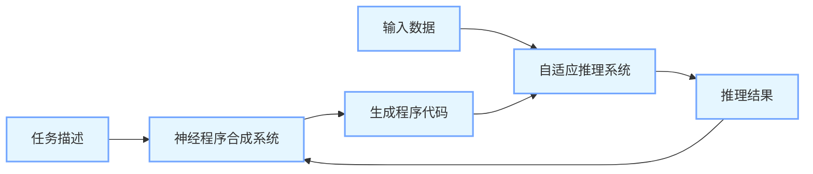

# 神经程序合成在自适应推理系统设计中的创新

> 关键词：神经程序合成、自适应推理系统、创新设计、深度学习、程序生成

> 摘要：本文聚焦于神经程序合成在自适应推理系统设计中的创新应用。首先介绍了相关背景，包括目的范围、预期读者等内容。接着详细阐述了核心概念与联系，通过文本示意图和Mermaid流程图展示其架构。深入探讨了核心算法原理并给出Python源代码进行说明，同时介绍了相关数学模型和公式。通过项目实战案例，从开发环境搭建到源代码实现与解读，全面展示了神经程序合成在实际中的应用。分析了其实际应用场景，推荐了学习资源、开发工具框架以及相关论文著作。最后总结了未来发展趋势与挑战，并提供常见问题解答和扩展阅读参考资料，旨在为该领域的研究和实践提供全面而深入的指导。

## 1. 背景介绍 
### 1.1 目的和范围
在当今人工智能快速发展的时代，自适应推理系统能够根据不同的输入和环境动态调整推理策略，以实现高效准确的推理结果。神经程序合成作为一种新兴技术，为自适应推理系统的设计带来了新的思路和方法。本文的目的在于深入探讨神经程序合成在自适应推理系统设计中的创新点，包括其原理、算法、应用场景等方面。范围涵盖了神经程序合成的基本概念、相关算法原理、数学模型，以及在实际项目中的应用案例，同时分析了其未来的发展趋势和面临的挑战。

### 1.2 预期读者
本文预期读者包括计算机科学、人工智能、机器学习等领域的研究人员、开发者和学生。对于对神经程序合成和自适应推理系统感兴趣的专业人士，本文可以提供深入的技术分析和实践指导；对于初学者，也可以作为了解该领域的入门资料，帮助他们建立起相关的知识体系。

### 1.3 文档结构概述
本文将按照以下结构进行组织：首先介绍核心概念与联系，包括神经程序合成和自适应推理系统的基本原理以及它们之间的联系，并通过示意图和流程图进行展示；接着详细讲解核心算法原理和具体操作步骤，使用Python代码进行说明；然后介绍相关的数学模型和公式，并举例说明；通过项目实战案例，包括开发环境搭建、源代码实现和解读，展示神经程序合成在自适应推理系统中的实际应用；分析其实际应用场景；推荐学习资源、开发工具框架和相关论文著作；最后总结未来发展趋势与挑战，提供常见问题解答和扩展阅读参考资料。

### 1.4 术语表
#### 1.4.1 核心术语定义
- **神经程序合成（Neural Program Synthesis）**：利用神经网络技术自动生成计算机程序的过程。通过学习大量的程序示例，神经网络可以学习到程序的结构和语义，从而生成满足特定需求的程序。
- **自适应推理系统（Adaptive Reasoning System）**：一种能够根据不同的输入数据、环境条件和任务要求，动态调整推理策略和模型参数的智能系统。它可以在不同的情况下实现高效准确的推理。
- **深度学习（Deep Learning）**：一种基于人工神经网络的机器学习方法，通过构建多层神经网络来学习数据的复杂特征和模式。

#### 1.4.2 相关概念解释
- **程序生成**：指根据特定的规范或需求，自动生成计算机程序的过程。神经程序合成是程序生成的一种特殊形式，它利用神经网络的学习能力来实现程序的自动生成。
- **推理策略**：在自适应推理系统中，推理策略是指系统根据不同的情况选择合适的推理方法和步骤的规则。不同的推理策略可能适用于不同的输入数据和任务要求。

#### 1.4.3 缩略词列表
- **NPS**：Neural Program Synthesis（神经程序合成）
- **ARS**：Adaptive Reasoning System（自适应推理系统）
- **DL**：Deep Learning（深度学习）

## 2. 核心概念与联系 

### 神经程序合成原理
神经程序合成的核心思想是利用神经网络来学习程序的结构和语义，从而实现自动生成程序的目的。通常，神经程序合成系统会接受一个任务描述作为输入，例如自然语言描述的问题或一组输入输出示例，然后通过神经网络生成一个满足该任务要求的程序。

神经网络在神经程序合成中扮演着重要的角色。常见的神经网络架构包括循环神经网络（RNN）、长短期记忆网络（LSTM）和变换器（Transformer）等。这些网络可以学习到程序的序列结构和语义信息，从而生成合理的程序代码。

### 自适应推理系统原理
自适应推理系统的目标是在不同的情况下实现高效准确的推理。它通常包括以下几个关键组件：输入模块、推理引擎、策略选择模块和输出模块。输入模块负责接收输入数据，推理引擎根据输入数据进行推理，策略选择模块根据不同的情况选择合适的推理策略，输出模块将推理结果输出。

自适应推理系统的核心在于策略选择模块。该模块可以根据输入数据的特征、任务要求和环境条件等因素，动态调整推理策略。例如，在处理简单问题时，系统可以选择简单快速的推理策略；而在处理复杂问题时，系统可以选择更精确但耗时的推理策略。

### 神经程序合成与自适应推理系统的联系
神经程序合成可以为自适应推理系统提供强大的程序生成能力。在自适应推理系统中，不同的推理策略可能需要不同的程序来实现。神经程序合成可以根据不同的推理策略需求，自动生成相应的程序代码，从而实现推理策略的动态调整。

另一方面，自适应推理系统可以为神经程序合成提供反馈信息。在生成程序的过程中，神经程序合成系统可以根据自适应推理系统的推理结果，不断调整生成的程序，以提高程序的质量和性能。

### 文本示意图
```plaintext
神经程序合成系统
|-- 输入：任务描述（自然语言或输入输出示例）
|-- 神经网络（RNN/LSTM/Transformer等）
|   |-- 学习程序结构和语义
|-- 输出：生成的程序代码

自适应推理系统
|-- 输入模块：接收输入数据
|-- 推理引擎：根据输入数据进行推理
|-- 策略选择模块：根据情况选择推理策略
|-- 输出模块：输出推理结果

联系：神经程序合成生成的程序用于自适应推理系统的推理策略实现，自适应推理系统的反馈用于改进神经程序合成的程序生成
```

### Mermaid流程图


## 3. 核心算法原理 & 具体操作步骤 

### 神经程序合成的核心算法原理
神经程序合成的核心算法通常基于深度学习模型，下面以变换器（Transformer）为例进行说明。

变换器是一种基于注意力机制的神经网络架构，它可以有效地处理序列数据。在神经程序合成中，变换器可以学习到程序的序列结构和语义信息，从而生成合理的程序代码。

变换器的主要组件包括编码器和解码器。编码器将输入的任务描述编码为一系列的特征向量，解码器根据这些特征向量生成程序代码。

### Python源代码实现
```python
import torch
import torch.nn as nn
import torch.optim as optim
from torch.utils.data import Dataset, DataLoader

# 定义变换器模型
class TransformerModel(nn.Module):
    def __init__(self, input_dim, output_dim, d_model, nhead, num_layers):
        super(TransformerModel, self).__init__()
        self.encoder = nn.Embedding(input_dim, d_model)
        self.transformer_encoder = nn.TransformerEncoder(
            nn.TransformerEncoderLayer(d_model, nhead), num_layers
        )
        self.decoder = nn.Linear(d_model, output_dim)

    def forward(self, src):
        src = self.encoder(src)
        src = self.transformer_encoder(src)
        output = self.decoder(src)
        return output

# 定义数据集类
class ProgramDataset(Dataset):
    def __init__(self, inputs, outputs):
        self.inputs = inputs
        self.outputs = outputs

    def __len__(self):
        return len(self.inputs)

    def __getitem__(self, idx):
        input_seq = torch.tensor(self.inputs[idx], dtype=torch.long)
        output_seq = torch.tensor(self.outputs[idx], dtype=torch.long)
        return input_seq, output_seq

# 训练模型
def train_model(model, dataloader, criterion, optimizer, epochs):
    model.train()
    for epoch in range(epochs):
        total_loss = 0
        for inputs, outputs in dataloader:
            optimizer.zero_grad()
            outputs_pred = model(inputs)
            loss = criterion(outputs_pred.view(-1, outputs_pred.size(-1)), outputs.view(-1))
            loss.backward()
            optimizer.step()
            total_loss += loss.item()
        print(f'Epoch {epoch+1}/{epochs}, Loss: {total_loss/len(dataloader)}')

# 示例数据
inputs = [[1, 2, 3], [4, 5, 6]]
outputs = [[7, 8, 9], [10, 11, 12]]

# 数据集和数据加载器
dataset = ProgramDataset(inputs, outputs)
dataloader = DataLoader(dataset, batch_size=2, shuffle=True)

# 模型参数
input_dim = 10
output_dim = 10
d_model = 128
nhead = 4
num_layers = 2

# 初始化模型、损失函数和优化器
model = TransformerModel(input_dim, output_dim, d_model, nhead, num_layers)
criterion = nn.CrossEntropyLoss()
optimizer = optim.Adam(model.parameters(), lr=0.001)

# 训练模型
train_model(model, dataloader, criterion, optimizer, epochs=10)
```

### 具体操作步骤
1. **数据准备**：收集大量的任务描述和对应的程序代码作为训练数据。将数据进行预处理，例如将文本转换为数字序列。
2. **模型定义**：根据需求选择合适的神经网络架构，如变换器。定义模型的输入维度、输出维度、隐藏层维度等参数。
3. **训练模型**：使用准备好的训练数据对模型进行训练。定义损失函数和优化器，通过反向传播算法更新模型的参数。
4. **生成程序**：在训练完成后，将新的任务描述输入到模型中，模型将生成相应的程序代码。

## 4. 数学模型和公式 & 详细讲解 & 举例说明 

### 变换器的数学模型
变换器的核心是注意力机制，其中最常用的是缩放点积注意力（Scaled Dot-Product Attention）。

#### 缩放点积注意力公式
$$
\text{Attention}(Q, K, V) = \text{softmax}\left(\frac{QK^T}{\sqrt{d_k}}\right)V
$$

其中，$Q$ 是查询矩阵，$K$ 是键矩阵，$V$ 是值矩阵，$d_k$ 是键向量的维度。

#### 详细讲解
- **查询矩阵 $Q$**：表示需要关注的信息。在神经程序合成中，查询矩阵可以表示输入的任务描述。
- **键矩阵 $K$**：表示可供关注的信息。键矩阵可以表示程序代码的特征向量。
- **值矩阵 $V$**：表示需要聚合的信息。值矩阵可以表示程序代码的语义信息。
- **缩放因子 $\sqrt{d_k}$**：用于防止点积结果过大，避免梯度消失或爆炸问题。
- **Softmax函数**：将点积结果转换为概率分布，使得注意力权重之和为1。

### 多头注意力机制
变换器使用多头注意力机制（Multi-Head Attention）来增强模型的表达能力。多头注意力机制将查询、键和值矩阵分别投影到多个低维子空间中，然后在每个子空间中计算注意力，最后将结果拼接起来。

#### 多头注意力公式
$$
\text{MultiHead}(Q, K, V) = \text{Concat}(\text{head}_1, \cdots, \text{head}_h)W^O
$$

其中，$\text{head}_i = \text{Attention}(QW_i^Q, KW_i^K, VW_i^V)$，$W_i^Q$、$W_i^K$ 和 $W_i^V$ 是投影矩阵，$W^O$ 是输出投影矩阵，$h$ 是头的数量。

### 举例说明
假设我们有一个查询向量 $q$、一个键向量 $k$ 和一个值向量 $v$，维度均为 $d_k = 4$。

$$
q = \begin{bmatrix}1 \\ 2 \\ 3 \\ 4\end{bmatrix}, \quad k = \begin{bmatrix}5 \\ 6 \\ 7 \\ 8\end{bmatrix}, \quad v = \begin{bmatrix}9 \\ 10 \\ 11 \\ 12\end{bmatrix}
$$

首先计算点积 $q^Tk = 1\times5 + 2\times6 + 3\times7 + 4\times8 = 70$。

然后计算缩放点积 $\frac{q^Tk}{\sqrt{d_k}} = \frac{70}{\sqrt{4}} = 35$。

假设使用Softmax函数后得到的注意力权重为 $0.8$，则注意力输出为 $0.8\times v = \begin{bmatrix}7.2 \\ 8 \\ 8.8 \\ 9.6\end{bmatrix}$。

在多头注意力机制中，我们可以将查询、键和值向量分别投影到多个低维子空间中，然后在每个子空间中进行上述计算，最后将结果拼接起来。

## 5. 项目实战：代码实际案例和详细解释说明 

### 5.1  开发环境搭建
#### 操作系统
建议使用Linux系统，如Ubuntu 18.04或更高版本。Windows系统也可以使用，但可能会遇到一些兼容性问题。

#### 编程语言和库
- **Python**：建议使用Python 3.7或更高版本。
- **深度学习框架**：使用PyTorch作为深度学习框架。可以通过以下命令安装：
```sh
pip install torch torchvision
```
- **其他库**：还需要安装一些其他的库，如NumPy、Pandas等。可以使用以下命令安装：
```sh
pip install numpy pandas
```

#### 开发工具
可以使用Jupyter Notebook或PyCharm作为开发工具。Jupyter Notebook适合进行交互式开发和实验，PyCharm适合进行大型项目的开发和调试。

### 5.2  源代码详细实现和代码解读
以下是一个简单的神经程序合成项目的源代码示例，用于生成简单的加法程序。

```python
import torch
import torch.nn as nn
import torch.optim as optim
from torch.utils.data import Dataset, DataLoader

# 定义数据集类
class AdditionDataset(Dataset):
    def __init__(self, num_examples):
        self.inputs = []
        self.outputs = []
        for i in range(num_examples):
            a = torch.randint(0, 10, (1,)).item()
            b = torch.randint(0, 10, (1,)).item()
            input_seq = [a, b]
            output_seq = [a + b]
            self.inputs.append(input_seq)
            self.outputs.append(output_seq)

    def __len__(self):
        return len(self.inputs)

    def __getitem__(self, idx):
        input_seq = torch.tensor(self.inputs[idx], dtype=torch.long)
        output_seq = torch.tensor(self.outputs[idx], dtype=torch.long)
        return input_seq, output_seq

# 定义简单的神经网络模型
class AdditionModel(nn.Module):
    def __init__(self, input_dim, output_dim, hidden_dim):
        super(AdditionModel, self).__init__()
        self.fc1 = nn.Linear(input_dim, hidden_dim)
        self.relu = nn.ReLU()
        self.fc2 = nn.Linear(hidden_dim, output_dim)

    def forward(self, x):
        x = self.fc1(x)
        x = self.relu(x)
        x = self.fc2(x)
        return x

# 训练模型
def train_model(model, dataloader, criterion, optimizer, epochs):
    model.train()
    for epoch in range(epochs):
        total_loss = 0
        for inputs, outputs in dataloader:
            optimizer.zero_grad()
            outputs_pred = model(inputs.float())
            loss = criterion(outputs_pred.view(-1), outputs.float())
            loss.backward()
            optimizer.step()
            total_loss += loss.item()
        print(f'Epoch {epoch+1}/{epochs}, Loss: {total_loss/len(dataloader)}')

# 生成程序
def generate_program(model, input_seq):
    model.eval()
    with torch.no_grad():
        input_tensor = torch.tensor(input_seq, dtype=torch.float).unsqueeze(0)
        output = model(input_tensor)
        output = output.squeeze().item()
        return output

# 数据集和数据加载器
num_examples = 1000
dataset = AdditionDataset(num_examples)
dataloader = DataLoader(dataset, batch_size=32, shuffle=True)

# 模型参数
input_dim = 2
output_dim = 1
hidden_dim = 16

# 初始化模型、损失函数和优化器
model = AdditionModel(input_dim, output_dim, hidden_dim)
criterion = nn.MSELoss()
optimizer = optim.Adam(model.parameters(), lr=0.001)

# 训练模型
train_model(model, dataloader, criterion, optimizer, epochs=10)

# 生成程序示例
input_seq = [3, 5]
output = generate_program(model, input_seq)
print(f'Input: {input_seq}, Output: {output}')
```

### 代码解读与分析
#### 数据集类 `AdditionDataset`
- 该类用于生成加法问题的训练数据。在初始化时，随机生成一定数量的加法问题，每个问题由两个加数和它们的和组成。
- `__len__` 方法返回数据集的大小。
- `__getitem__` 方法根据索引返回对应的输入和输出数据。

#### 神经网络模型 `AdditionModel`
- 该模型是一个简单的全连接神经网络，包含一个输入层、一个隐藏层和一个输出层。
- `forward` 方法定义了模型的前向传播过程，输入数据经过线性变换和ReLU激活函数后，输出预测结果。

#### 训练函数 `train_model`
- 该函数用于训练模型。在每个epoch中，遍历数据集，计算损失函数，通过反向传播算法更新模型的参数。

#### 生成程序函数 `generate_program`
- 该函数用于生成程序。将输入数据输入到模型中，得到预测结果。

#### 主程序
- 首先创建数据集和数据加载器。
- 然后初始化模型、损失函数和优化器。
- 调用训练函数训练模型。
- 最后调用生成程序函数生成一个加法问题的结果。

## 6. 实际应用场景 
### 自动化编程
神经程序合成可以用于自动化编程，根据用户的需求自动生成程序代码。例如，在软件开发中，开发人员可以使用自然语言描述需求，神经程序合成系统可以根据描述生成相应的代码，提高开发效率。

### 智能推理系统
在智能推理系统中，神经程序合成可以用于生成不同的推理策略和算法。例如，在医疗诊断系统中，根据患者的症状和检查结果，神经程序合成系统可以生成相应的诊断程序和治疗方案。

### 机器人编程
在机器人编程中，神经程序合成可以用于生成机器人的控制程序。例如，根据机器人的任务要求，神经程序合成系统可以生成机器人的运动轨迹规划程序和动作执行程序。

### 数据处理和分析
在数据处理和分析中，神经程序合成可以用于生成数据处理和分析的程序。例如，根据用户的数据处理需求，神经程序合成系统可以生成数据清洗、特征提取和模型训练的程序。

## 7. 工具和资源推荐
### 7.1 学习资源推荐
#### 7.1.1 书籍推荐
- 《深度学习》（Deep Learning）：由Ian Goodfellow、Yoshua Bengio和Aaron Courville撰写，是深度学习领域的经典教材，介绍了深度学习的基本原理和方法。
- 《Python深度学习》（Deep Learning with Python）：由Francois Chollet撰写，以Python和Keras为工具，介绍了深度学习的实践应用。
- 《人工智能：一种现代的方法》（Artificial Intelligence: A Modern Approach）：由Stuart Russell和Peter Norvig撰写，是人工智能领域的经典教材，涵盖了人工智能的各个方面。

#### 7.1.2 在线课程
- Coursera上的“深度学习专项课程”（Deep Learning Specialization）：由Andrew Ng教授授课，包括深度学习的基础、卷积神经网络、循环神经网络等内容。
- edX上的“人工智能导论”（Introduction to Artificial Intelligence）：由MIT教授授课，介绍了人工智能的基本概念和方法。
- Udemy上的“Python实战深度学习”（Deep Learning with Python Hands-On）：通过实际项目介绍了Python和深度学习的应用。

#### 7.1.3 技术博客和网站
- arXiv：一个预印本平台，提供了大量的学术论文，包括神经程序合成和自适应推理系统的最新研究成果。
- Medium：一个技术博客平台，有很多关于深度学习和人工智能的文章。
- Towards Data Science：专注于数据科学和机器学习的博客网站，提供了很多实用的教程和案例。

### 7.2 开发工具框架推荐
#### 7.2.1 IDE和编辑器
- PyCharm：一款专门为Python开发设计的集成开发环境，提供了代码编辑、调试、版本控制等功能。
- Jupyter Notebook：一个交互式的开发环境，适合进行数据分析和深度学习实验。
- Visual Studio Code：一款轻量级的代码编辑器，支持多种编程语言，有丰富的插件和扩展。

#### 7.2.2 调试和性能分析工具
- PyTorch Profiler：PyTorch提供的性能分析工具，可以帮助开发者分析模型的性能瓶颈。
- TensorBoard：TensorFlow提供的可视化工具，也可以用于PyTorch模型的可视化和性能分析。
- cProfile：Python内置的性能分析工具，可以帮助开发者分析代码的运行时间和内存使用情况。

#### 7.2.3 相关框架和库
- PyTorch：一个开源的深度学习框架，提供了丰富的神经网络层和优化算法。
- TensorFlow：另一个开源的深度学习框架，具有广泛的应用和社区支持。
- NumPy：一个用于科学计算的Python库，提供了高效的数组操作和数学函数。
- Pandas：一个用于数据处理和分析的Python库，提供了数据结构和数据操作方法。

### 7.3 相关论文著作推荐
#### 7.3.1 经典论文
- “Attention Is All You Need”：介绍了变换器（Transformer）架构，是神经程序合成和自然语言处理领域的经典论文。
- “Neural Program Synthesis”：首次提出了神经程序合成的概念，为该领域的研究奠定了基础。
- “Adaptive Reasoning in Artificial Intelligence”：探讨了自适应推理系统的基本原理和方法。

#### 7.3.2 最新研究成果
- 可以在arXiv和各大学术会议上查找神经程序合成和自适应推理系统的最新研究成果，如ICML、NeurIPS等。

#### 7.3.3 应用案例分析
- 可以在ACM、IEEE等学术数据库中查找神经程序合成和自适应推理系统的应用案例分析，了解它们在实际中的应用效果和挑战。

## 8. 总结：未来发展趋势与挑战
### 未来发展趋势
- **融合多种技术**：神经程序合成将与其他技术，如知识图谱、强化学习等相结合，以提高程序生成的质量和性能。
- **应用领域拓展**：神经程序合成将在更多的领域得到应用，如金融、教育、交通等，为这些领域的智能化发展提供支持。
- **模型优化**：随着深度学习技术的不断发展，神经程序合成的模型将不断优化，提高生成程序的效率和准确性。

### 挑战
- **数据缺乏**：神经程序合成需要大量的训练数据，但目前可用的程序数据集相对较少，限制了模型的性能。
- **语义理解**：准确理解任务描述的语义是神经程序合成的关键，但目前的自然语言处理技术还存在一定的局限性。
- **可解释性**：神经程序合成生成的程序往往缺乏可解释性，难以理解程序的生成过程和决策依据。

## 9. 附录：常见问题与解答
### 问题1：神经程序合成和传统程序生成有什么区别？
神经程序合成利用神经网络的学习能力，通过学习大量的程序示例来生成程序。而传统程序生成通常基于规则和模板，需要人工编写规则和模板。神经程序合成具有更强的灵活性和适应性，可以处理更复杂的任务。

### 问题2：神经程序合成的训练数据从哪里获取？
可以从开源代码库、学术数据集和实际项目中收集训练数据。一些公开的代码托管平台，如GitHub，提供了大量的开源代码，可以作为训练数据的来源。

### 问题3：如何评估神经程序合成生成的程序的质量？
可以从多个方面评估程序的质量，如程序的正确性、效率、可读性等。可以使用测试用例来验证程序的正确性，使用性能分析工具来评估程序的效率。

### 问题4：神经程序合成在实际应用中存在哪些挑战？
神经程序合成在实际应用中存在数据缺乏、语义理解困难、可解释性差等挑战。此外，生成的程序可能存在安全隐患，需要进行严格的安全检测。

## 10. 扩展阅读 & 参考资料
### 扩展阅读
- 《人工智能与机器学习》：深入探讨了人工智能和机器学习的理论和应用。
- 《程序设计语言原理》：介绍了程序设计语言的基本原理和设计方法。
- 《算法导论》：经典的算法教材，介绍了各种算法的设计和分析方法。

### 参考资料
- Goodfellow, I., Bengio, Y., & Courville, A. (2016). Deep Learning. MIT Press.
- Chollet, F. (2017). Deep Learning with Python. Manning Publications.
- Russell, S. J., & Norvig, P. (2020). Artificial Intelligence: A Modern Approach. Pearson.
- Vaswani, A., Shazeer, N., Parmar, N., Uszkoreit, J., Jones, L., Gomez, A. N.,... & Polosukhin, I. (2017). Attention is all you need. Advances in neural information processing systems, 5998-6008.

作者：AI天才研究院/AI Genius Institute & 禅与计算机程序设计艺术 /Zen And The Art of Computer Programming