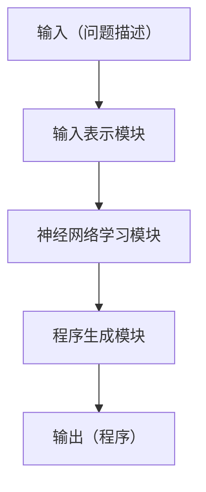

# 神经程序归纳在自动化数学推理中的突破

> 关键词：神经程序归纳、自动化数学推理、深度学习、程序合成、数学证明

> 摘要：本文深入探讨了神经程序归纳在自动化数学推理领域所取得的突破。首先介绍了相关背景，包括研究目的、预期读者和文档结构等。接着详细阐述了神经程序归纳和自动化数学推理的核心概念及联系，通过文本示意图和Mermaid流程图进行直观展示。分析了核心算法原理并给出Python源代码进行说明，同时介绍了相关的数学模型和公式。通过项目实战，展示了代码的实际案例并进行详细解读。探讨了神经程序归纳在自动化数学推理中的实际应用场景，推荐了学习资源、开发工具框架和相关论文著作。最后总结了未来发展趋势与挑战，解答了常见问题，并提供了扩展阅读和参考资料。

## 1. 背景介绍 
### 1.1 目的和范围
自动化数学推理是人工智能领域的一个重要研究方向，旨在让计算机自动完成数学定理的证明、公式的推导等任务。传统的自动化推理方法在处理复杂的数学问题时面临诸多挑战，如搜索空间过大、难以处理自然语言描述的问题等。神经程序归纳作为一种新兴的技术，结合了深度学习和程序合成的思想，为自动化数学推理带来了新的突破。本文的目的是深入研究神经程序归纳在自动化数学推理中的应用，分析其核心原理、算法实现和实际应用场景，探讨其未来发展趋势与挑战。
### 1.2 预期读者
本文适合对人工智能、自动化推理、深度学习和程序合成等领域感兴趣的研究人员、工程师和学生阅读。读者需要具备一定的数学基础和编程知识，熟悉Python编程语言和深度学习的基本概念。
### 1.3 文档结构概述
本文将按照以下结构进行组织：
1. 背景介绍：介绍研究目的、预期读者和文档结构。
2. 核心概念与联系：阐述神经程序归纳和自动化数学推理的核心概念，展示它们之间的联系。
3. 核心算法原理 & 具体操作步骤：分析神经程序归纳的核心算法原理，给出Python源代码进行说明。
4. 数学模型和公式 & 详细讲解 & 举例说明：介绍相关的数学模型和公式，并进行详细讲解和举例说明。
5. 项目实战：代码实际案例和详细解释说明：通过项目实战，展示代码的实际案例并进行详细解读。
6. 实际应用场景：探讨神经程序归纳在自动化数学推理中的实际应用场景。
7. 工具和资源推荐：推荐学习资源、开发工具框架和相关论文著作。
8. 总结：未来发展趋势与挑战：总结神经程序归纳在自动化数学推理中的未来发展趋势与挑战。
9. 附录：常见问题与解答：解答常见问题。
10. 扩展阅读 & 参考资料：提供扩展阅读和参考资料。
### 1.4 术语表
#### 1.4.1 核心术语定义
- **神经程序归纳（Neural Program Induction）**：一种结合深度学习和程序合成的技术，通过神经网络学习程序的结构和语义，自动生成满足特定需求的程序。
- **自动化数学推理（Automated Mathematical Reasoning）**：让计算机自动完成数学定理的证明、公式的推导等任务的技术。
- **程序合成（Program Synthesis）**：根据给定的规范或示例，自动生成满足要求的程序的技术。
- **深度学习（Deep Learning）**：一类基于人工神经网络的机器学习技术，通过多层神经网络学习数据的特征和模式。
#### 1.4.2 相关概念解释
- **神经网络（Neural Network）**：一种模仿人类神经系统的计算模型，由大量的神经元组成，通过神经元之间的连接和权重来学习数据的特征和模式。
- **循环神经网络（Recurrent Neural Network，RNN）**：一种具有循环结构的神经网络，能够处理序列数据，常用于自然语言处理和时间序列分析等领域。
- **长短期记忆网络（Long Short-Term Memory，LSTM）**：一种特殊的循环神经网络，能够解决传统RNN在处理长序列数据时的梯度消失问题，常用于处理长文本和语音识别等任务。
- **注意力机制（Attention Mechanism）**：一种在神经网络中用于自动选择重要信息的机制，能够提高模型的性能和可解释性。
#### 1.4.3 缩略词列表
- **RNN**：Recurrent Neural Network
- **LSTM**：Long Short-Term Memory
- **CNN**：Convolutional Neural Network
- **GPT**：Generative Pretrained Transformer

## 2. 核心概念与联系 
### 核心概念原理
#### 神经程序归纳
神经程序归纳的核心思想是利用神经网络学习程序的结构和语义，从而自动生成满足特定需求的程序。具体来说，神经程序归纳通常包括以下几个步骤：
1. **输入表示**：将问题的描述（如自然语言文本、数学公式等）转换为神经网络能够处理的输入表示。
2. **神经网络学习**：使用神经网络（如RNN、LSTM、Transformer等）对输入表示进行学习，提取程序的结构和语义信息。
3. **程序生成**：根据学习到的信息，生成满足需求的程序。

#### 自动化数学推理
自动化数学推理的目标是让计算机自动完成数学定理的证明、公式的推导等任务。传统的自动化推理方法主要基于逻辑推理和搜索算法，如归结原理、模型检查等。而神经程序归纳为自动化数学推理提供了一种新的思路，通过学习大量的数学证明和推理示例，自动生成新的证明和推理程序。

### 架构的文本示意图
```plaintext
输入（问题描述） -> 输入表示模块 -> 神经网络学习模块 -> 程序生成模块 -> 输出（程序）
```
### Mermaid流程图


## 3. 核心算法原理 & 具体操作步骤 
### 核心算法原理
神经程序归纳的核心算法通常基于深度学习模型，如RNN、LSTM和Transformer等。以LSTM为例，其基本原理是通过门控机制来控制信息的流动，从而解决传统RNN在处理长序列数据时的梯度消失问题。

### 具体操作步骤
#### 1. 数据准备
收集大量的数学推理示例，包括问题描述、证明过程和最终答案等。将这些示例进行预处理，转换为适合神经网络输入的格式。

#### 2. 模型构建
使用LSTM构建神经网络模型。模型的输入是问题描述的编码表示，输出是程序的生成概率分布。

#### 3. 模型训练
使用准备好的数据对模型进行训练，通过优化损失函数来调整模型的参数，使得模型能够生成更准确的程序。

#### 4. 程序生成
在训练好的模型上，输入新的问题描述，模型将根据学习到的知识生成满足需求的程序。

### Python源代码详细阐述
```python
import torch
import torch.nn as nn
import torch.optim as optim

# 定义LSTM模型
class NeuralProgramInduction(nn.Module):
    def __init__(self, input_size, hidden_size, output_size):
        super(NeuralProgramInduction, self).__init__()
        self.hidden_size = hidden_size
        self.lstm = nn.LSTM(input_size, hidden_size)
        self.fc = nn.Linear(hidden_size, output_size)

    def forward(self, input):
        output, _ = self.lstm(input)
        output = self.fc(output[-1])
        return output

# 数据准备
input_size = 10
hidden_size = 20
output_size = 5
batch_size = 32
sequence_length = 10

# 生成随机输入数据
input_data = torch.randn(sequence_length, batch_size, input_size)
target_data = torch.randint(0, output_size, (batch_size,))

# 初始化模型
model = NeuralProgramInduction(input_size, hidden_size, output_size)

# 定义损失函数和优化器
criterion = nn.CrossEntropyLoss()
optimizer = optim.Adam(model.parameters(), lr=0.001)

# 模型训练
num_epochs = 100
for epoch in range(num_epochs):
    optimizer.zero_grad()
    output = model(input_data)
    loss = criterion(output, target_data)
    loss.backward()
    optimizer.step()
    if (epoch + 1) % 10 == 0:
        print(f'Epoch [{epoch+1}/{num_epochs}], Loss: {loss.item():.4f}')

# 程序生成
new_input = torch.randn(sequence_length, 1, input_size)
with torch.no_grad():
    output = model(new_input)
    predicted = torch.argmax(output, dim=1)
    print(f'Predicted program: {predicted.item()}')
```

## 4. 数学模型和公式 & 详细讲解 & 举例说明 
### 数学模型
神经程序归纳的数学模型通常基于概率图模型和深度学习模型。以LSTM为例，其数学模型可以表示为：

$$
\begin{align*}
i_t &= \sigma(W_{ii}x_t + b_{ii} + W_{hi}h_{t-1} + b_{hi}) \\
f_t &= \sigma(W_{if}x_t + b_{if} + W_{hf}h_{t-1} + b_{hf}) \\
g_t &= \tanh(W_{ig}x_t + b_{ig} + W_{hg}h_{t-1} + b_{hg}) \\
o_t &= \sigma(W_{io}x_t + b_{io} + W_{ho}h_{t-1} + b_{ho}) \\
c_t &= f_t \odot c_{t-1} + i_t \odot g_t \\
h_t &= o_t \odot \tanh(c_t)
\end{align*}
$$

其中，$x_t$ 是输入向量，$h_{t-1}$ 是上一时刻的隐藏状态，$c_{t-1}$ 是上一时刻的细胞状态，$i_t$、$f_t$、$o_t$ 分别是输入门、遗忘门和输出门，$g_t$ 是候选细胞状态，$\sigma$ 是 sigmoid 函数，$\tanh$ 是双曲正切函数，$\odot$ 是逐元素乘法。

### 详细讲解
- **输入门（Input Gate）**：控制当前输入信息的多少进入细胞状态。
- **遗忘门（Forget Gate）**：控制上一时刻的细胞状态有多少需要被遗忘。
- **输出门（Output Gate）**：控制当前细胞状态的多少输出到隐藏状态。
- **候选细胞状态（Candidate Cell State）**：根据当前输入和上一时刻的隐藏状态计算得到的候选细胞状态。

### 举例说明
假设我们要处理一个时间序列数据，每个时间步的输入是一个长度为 10 的向量。我们使用一个隐藏状态维度为 20 的 LSTM 模型。在每个时间步，LSTM 模型将根据输入门、遗忘门和输出门的控制，更新细胞状态和隐藏状态。最终，我们可以根据隐藏状态生成输出。

## 5. 项目实战：代码实际案例和详细解释说明 
### 5.1  开发环境搭建
#### 操作系统
推荐使用 Linux 或 macOS 操作系统，因为它们对深度学习开发的支持更好。

#### 编程语言
使用 Python 作为开发语言，版本建议为 3.7 及以上。

#### 深度学习框架
使用 PyTorch 作为深度学习框架，它具有简洁易用、灵活性高的特点。可以通过以下命令安装 PyTorch：
```sh
pip install torch torchvision
```

### 5.2  源代码详细实现和代码解读
```python
import torch
import torch.nn as nn
import torch.optim as optim
from torch.utils.data import Dataset, DataLoader

# 自定义数据集类
class MathDataset(Dataset):
    def __init__(self, data):
        self.data = data

    def __len__(self):
        return len(self.data)

    def __getitem__(self, idx):
        input_seq, target = self.data[idx]
        return torch.tensor(input_seq, dtype=torch.float32), torch.tensor(target, dtype=torch.long)

# 定义神经程序归纳模型
class NeuralProgramInduction(nn.Module):
    def __init__(self, input_size, hidden_size, output_size):
        super(NeuralProgramInduction, self).__init__()
        self.hidden_size = hidden_size
        self.lstm = nn.LSTM(input_size, hidden_size)
        self.fc = nn.Linear(hidden_size, output_size)

    def forward(self, input):
        output, _ = self.lstm(input)
        output = self.fc(output[-1])
        return output

# 生成示例数据
data = [
    ([1, 2, 3, 4, 5], 1),
    ([2, 3, 4, 5, 6], 2),
    ([3, 4, 5, 6, 7], 3)
]

# 创建数据集和数据加载器
dataset = MathDataset(data)
dataloader = DataLoader(dataset, batch_size=1, shuffle=True)

# 初始化模型、损失函数和优化器
input_size = 1
hidden_size = 10
output_size = 3
model = NeuralProgramInduction(input_size, hidden_size, output_size)
criterion = nn.CrossEntropyLoss()
optimizer = optim.Adam(model.parameters(), lr=0.001)

# 模型训练
num_epochs = 100
for epoch in range(num_epochs):
    for inputs, targets in dataloader:
        inputs = inputs.unsqueeze(2)
        optimizer.zero_grad()
        outputs = model(inputs)
        loss = criterion(outputs, targets)
        loss.backward()
        optimizer.step()
    if (epoch + 1) % 10 == 0:
        print(f'Epoch [{epoch+1}/{num_epochs}], Loss: {loss.item():.4f}')

# 程序生成
new_input = torch.tensor([[1, 2, 3, 4, 5]], dtype=torch.float32).unsqueeze(2)
with torch.no_grad():
    output = model(new_input)
    predicted = torch.argmax(output, dim=1)
    print(f'Predicted program: {predicted.item()}')
```

### 5.3  代码解读与分析
- **自定义数据集类**：`MathDataset` 类继承自 `torch.utils.data.Dataset`，用于加载和处理数据。
- **神经程序归纳模型**：`NeuralProgramInduction` 类继承自 `torch.nn.Module`，定义了一个基于 LSTM 的神经程序归纳模型。
- **数据加载器**：使用 `torch.utils.data.DataLoader` 来批量加载数据。
- **模型训练**：使用交叉熵损失函数和 Adam 优化器对模型进行训练。
- **程序生成**：在训练好的模型上，输入新的问题描述，模型将生成对应的程序。

## 6. 实际应用场景 
### 数学定理证明
神经程序归纳可以用于自动生成数学定理的证明过程。通过学习大量的数学证明示例，模型可以自动生成满足特定条件的证明程序，从而辅助数学家进行定理证明。

### 公式推导
在数学和物理等领域，经常需要进行公式的推导。神经程序归纳可以根据给定的条件和目标，自动生成公式推导的程序，提高推导的效率和准确性。

### 智能数学教育
在智能数学教育系统中，神经程序归纳可以用于自动生成解题步骤和提示。当学生遇到难题时，系统可以根据问题描述生成相应的解题程序，帮助学生理解和解决问题。

### 科学研究
在科学研究中，经常需要进行复杂的数学计算和推理。神经程序归纳可以帮助科学家自动生成计算和推理程序，提高研究效率和质量。

## 7. 工具和资源推荐
### 7.1 学习资源推荐
#### 7.1.1 书籍推荐
- 《深度学习》（Deep Learning）：由 Ian Goodfellow、Yoshua Bengio 和 Aaron Courville 所著，是深度学习领域的经典教材。
- 《Python深度学习》（Deep Learning with Python）：由 Francois Chollet 所著，介绍了如何使用 Python 和 Keras 进行深度学习开发。
- 《人工智能：一种现代的方法》（Artificial Intelligence: A Modern Approach）：由 Stuart Russell 和 Peter Norvig 所著，是人工智能领域的经典教材。

#### 7.1.2 在线课程
- Coursera 上的《深度学习专项课程》（Deep Learning Specialization）：由 Andrew Ng 教授授课，系统介绍了深度学习的基本概念和方法。
- edX 上的《强化学习》（Reinforcement Learning）：介绍了强化学习的基本概念和算法。
- 哔哩哔哩上的一些深度学习相关课程，如李宏毅的《机器学习》课程。

#### 7.1.3 技术博客和网站
- Medium 上的 Towards Data Science：分享了大量关于数据科学和机器学习的文章。
- arXiv：提供了最新的学术论文，包括深度学习和自动化推理等领域的研究成果。
- 机器之心：关注人工智能领域的最新动态和技术进展。

### 7.2 开发工具框架推荐
#### 7.2.1 IDE和编辑器
- PyCharm：一款专业的 Python 集成开发环境，提供了丰富的代码编辑、调试和项目管理功能。
- Jupyter Notebook：一种交互式的编程环境，适合进行数据分析和模型实验。
- Visual Studio Code：一款轻量级的代码编辑器，支持多种编程语言和插件扩展。

#### 7.2.2 调试和性能分析工具
- PyTorch Profiler：用于分析 PyTorch 模型的性能瓶颈。
- TensorBoard：用于可视化深度学习模型的训练过程和结果。
- VS Code 的调试工具：可以方便地对 Python 代码进行调试。

#### 7.2.3 相关框架和库
- PyTorch：一个开源的深度学习框架，具有简洁易用、灵活性高的特点。
- TensorFlow：另一个流行的深度学习框架，提供了丰富的工具和库。
- NLTK：自然语言处理工具包，用于处理文本数据。

### 7.3 相关论文著作推荐
#### 7.3.1 经典论文
- "Neural Programmer-Interpreters"：介绍了神经程序归纳的基本思想和方法。
- "Automated Theorem Proving in Lean"：探讨了在 Lean 定理证明器中进行自动化定理证明的方法。
- "DeepMath - Deep Sequence Models for Premise Selection"：提出了使用深度学习模型进行前提选择的方法。

#### 7.3.2 最新研究成果
- 关注 arXiv 上关于神经程序归纳和自动化数学推理的最新论文，了解该领域的最新研究动态。

#### 7.3.3 应用案例分析
- 一些学术会议和期刊上会发表关于神经程序归纳在实际应用中的案例分析，如 AAAI、IJCAI 等会议。

## 8. 总结：未来发展趋势与挑战
### 未来发展趋势
#### 模型性能提升
随着深度学习技术的不断发展，神经程序归纳模型的性能将不断提升。通过使用更强大的神经网络架构、更大规模的数据集和更高效的训练算法，模型将能够处理更复杂的数学推理问题。

#### 跨领域应用拓展
神经程序归纳不仅可以应用于数学推理领域，还可以拓展到其他领域，如自然语言处理、计算机视觉、机器人等。通过将神经程序归纳与其他领域的技术相结合，可以实现更智能的应用。

#### 与人类专家的协作
未来，神经程序归纳系统将与人类专家进行更紧密的协作。人类专家可以为系统提供指导和反馈，帮助系统不断学习和改进；系统可以为人类专家提供辅助和支持，提高工作效率和质量。

### 挑战
#### 数据稀缺性
高质量的数学推理数据相对稀缺，这给神经程序归纳模型的训练带来了挑战。如何获取和标注更多的数学推理数据，是未来需要解决的问题之一。

#### 可解释性
神经程序归纳模型通常是黑盒模型，其决策过程难以解释。在一些对可解释性要求较高的应用场景中，如数学教育和科学研究，如何提高模型的可解释性是一个重要的挑战。

#### 计算资源需求
神经程序归纳模型通常需要大量的计算资源进行训练和推理。如何降低模型的计算资源需求，提高模型的效率，是未来需要解决的问题之一。

## 9. 附录：常见问题与解答
### 1. 神经程序归纳和传统自动化推理方法有什么区别？
传统自动化推理方法主要基于逻辑推理和搜索算法，如归结原理、模型检查等。而神经程序归纳结合了深度学习和程序合成的思想，通过学习大量的示例来自动生成程序。神经程序归纳在处理自然语言描述的问题和复杂的推理任务时具有更好的性能。

### 2. 神经程序归纳模型的训练需要多长时间？
训练时间取决于多个因素，如模型的复杂度、数据集的大小、计算资源等。一般来说，训练一个复杂的神经程序归纳模型可能需要数天甚至数周的时间。

### 3. 如何评估神经程序归纳模型的性能？
可以使用多种指标来评估神经程序归纳模型的性能，如准确率、召回率、F1 值等。此外，还可以通过人工评估和实际应用来评估模型的性能。

### 4. 神经程序归纳模型可以处理哪些类型的数学推理问题？
神经程序归纳模型可以处理多种类型的数学推理问题，如定理证明、公式推导、方程求解等。但是，模型的性能和适用范围取决于训练数据和模型的复杂度。

## 10. 扩展阅读 & 参考资料
### 扩展阅读
- 《深度学习进阶：自然语言处理》：深入介绍了深度学习在自然语言处理中的应用。
- 《强化学习：原理与Python实现》：详细讲解了强化学习的原理和算法。
- 《数学与猜想：数学中的归纳和类比》：探讨了数学中的归纳和类比方法。

### 参考资料
- Goodfellow, I., Bengio, Y., & Courville, A. (2016). Deep Learning. MIT Press.
- Chollet, F. (2017). Deep Learning with Python. Manning Publications.
- Russell, S. J., & Norvig, P. (2016). Artificial Intelligence: A Modern Approach. Pearson.

作者：AI天才研究院/AI Genius Institute & 禅与计算机程序设计艺术 /Zen And The Art of Computer Programming