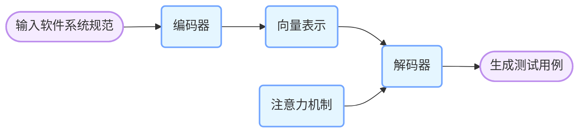

# 神经程序综合在自动化测试生成中的创新

> 关键词：神经程序综合、自动化测试生成、深度学习、程序合成、测试用例

> 摘要：本文聚焦于神经程序综合在自动化测试生成领域的创新应用。首先介绍了神经程序综合和自动化测试生成的背景知识，阐述了两者结合的目的和意义。接着深入探讨了神经程序综合的核心概念、算法原理以及相关数学模型。通过实际的项目实战案例，详细展示了如何运用神经程序综合进行自动化测试生成。分析了神经程序综合在不同场景下的实际应用，推荐了相关的学习资源、开发工具和论文著作。最后总结了神经程序综合在自动化测试生成中的未来发展趋势与挑战，并对常见问题进行了解答。

## 1. 背景介绍 
### 1.1 目的和范围
随着软件系统的规模和复杂度不断增加，软件测试的重要性日益凸显。自动化测试生成作为提高软件测试效率和质量的关键技术，一直是研究的热点。传统的自动化测试生成方法往往依赖于手动编写的规则和约束，难以应对复杂多变的软件系统。神经程序综合作为一种新兴的技术，结合了深度学习和程序合成的思想，为自动化测试生成带来了新的思路和方法。

本文的目的是深入探讨神经程序综合在自动化测试生成中的创新应用，分析其原理、方法和实际效果。具体范围包括神经程序综合的核心概念、算法原理、数学模型、项目实战、实际应用场景以及相关的工具和资源推荐等方面。

### 1.2 预期读者
本文的预期读者包括软件测试工程师、软件开发人员、人工智能研究人员以及对自动化测试生成和神经程序综合感兴趣的技术爱好者。对于软件测试工程师，本文可以提供新的测试生成方法和技术；对于软件开发人员，有助于理解如何利用神经程序综合提高软件的可测试性；对于人工智能研究人员，可以作为神经程序综合在实际应用中的参考；对于技术爱好者，可以拓宽对新兴技术的了解。

### 1.3 文档结构概述
本文将按照以下结构进行组织：
- 核心概念与联系：介绍神经程序综合和自动化测试生成的核心概念，以及它们之间的联系。
- 核心算法原理 & 具体操作步骤：详细阐述神经程序综合的算法原理，并给出具体的操作步骤，同时使用Python源代码进行说明。
- 数学模型和公式 & 详细讲解 & 举例说明：介绍神经程序综合所涉及的数学模型和公式，并通过具体例子进行详细讲解。
- 项目实战：代码实际案例和详细解释说明：通过实际的项目案例，展示如何运用神经程序综合进行自动化测试生成，包括开发环境搭建、源代码实现和代码解读。
- 实际应用场景：分析神经程序综合在不同场景下的实际应用。
- 工具和资源推荐：推荐相关的学习资源、开发工具和论文著作。
- 总结：未来发展趋势与挑战：总结神经程序综合在自动化测试生成中的未来发展趋势和面临的挑战。
- 附录：常见问题与解答：对常见问题进行解答。
- 扩展阅读 & 参考资料：提供扩展阅读的建议和参考资料。

### 1.4 术语表
#### 1.4.1 核心术语定义
- **神经程序综合（Neural Program Synthesis）**：利用神经网络技术自动生成满足特定规范和需求的程序的过程。
- **自动化测试生成（Automated Test Generation）**：通过自动化工具和技术生成测试用例的过程，以提高软件测试的效率和质量。
- **深度学习（Deep Learning）**：一类基于人工神经网络的机器学习技术，通过多层神经网络对数据进行学习和建模。
- **程序合成（Program Synthesis）**：根据给定的规范和需求，自动生成满足这些要求的程序的技术。
- **测试用例（Test Case）**：一组输入数据和预期输出，用于验证软件系统的正确性。

#### 1.4.2 相关概念解释
- **神经网络（Neural Network）**：一种模仿人类神经系统的计算模型，由多个神经元组成，可以自动学习数据中的模式和规律。
- **编码器 - 解码器（Encoder - Decoder）**：一种常用的神经网络架构，用于将输入序列编码为中间表示，然后将中间表示解码为输出序列。
- **注意力机制（Attention Mechanism）**：一种在神经网络中用于动态分配注意力权重的技术，可以提高模型对重要信息的关注程度。

#### 1.4.3 缩略词列表
- **NPS**：神经程序综合（Neural Program Synthesis）
- **ATG**：自动化测试生成（Automated Test Generation）
- **DL**：深度学习（Deep Learning）
- **PS**：程序合成（Program Synthesis）

## 2. 核心概念与联系 
### 2.1 神经程序综合的核心概念
神经程序综合是一种结合了深度学习和程序合成的技术，旨在利用神经网络自动生成满足特定规范和需求的程序。其核心思想是将程序合成问题转化为一个序列生成问题，通过神经网络学习输入规范和输出程序之间的映射关系。

神经程序综合通常采用编码器 - 解码器架构，其中编码器将输入的规范（如自然语言描述、代码片段等）编码为一个固定长度的向量表示，解码器则根据这个向量表示生成输出程序。为了提高模型的性能，还可以引入注意力机制，让模型在生成程序的过程中动态地关注输入规范中的重要信息。

### 2.2 自动化测试生成的核心概念
自动化测试生成是指通过自动化工具和技术生成测试用例的过程，以提高软件测试的效率和质量。传统的自动化测试生成方法主要包括随机测试、基于模型的测试和符号执行等。

随机测试是一种简单而有效的测试方法，通过随机生成输入数据来执行软件系统，以发现潜在的错误。基于模型的测试则是根据软件系统的模型（如状态图、流程图等）生成测试用例，保证测试用例的覆盖率。符号执行是一种静态分析技术，通过对程序进行符号化执行，生成能够覆盖程序所有可能路径的测试用例。

### 2.3 神经程序综合与自动化测试生成的联系
神经程序综合为自动化测试生成带来了新的思路和方法。传统的自动化测试生成方法往往依赖于手动编写的规则和约束，难以应对复杂多变的软件系统。而神经程序综合可以通过学习大量的代码和测试用例，自动生成满足特定规范和需求的测试用例。

具体来说，神经程序综合可以将软件系统的规范（如功能需求、接口定义等）作为输入，通过神经网络生成相应的测试用例。这种方法可以大大提高测试用例的生成效率和质量，同时减少人工编写测试用例的工作量。

### 2.4 核心概念原理和架构的文本示意图
神经程序综合在自动化测试生成中的应用架构可以描述如下：

输入层接收软件系统的规范信息，如自然语言描述、代码片段等。编码器将输入信息编码为一个固定长度的向量表示，这个向量表示包含了输入信息的语义特征。解码器根据编码器输出的向量表示，生成相应的测试用例。在生成过程中，注意力机制可以帮助解码器动态地关注输入信息中的重要部分，提高测试用例的生成质量。

### 2.5 Mermaid 流程图


## 3. 核心算法原理 & 具体操作步骤 
### 3.1 核心算法原理
神经程序综合在自动化测试生成中常用的算法是基于编码器 - 解码器架构的序列生成算法。下面详细介绍其原理：

#### 3.1.1 编码器
编码器的作用是将输入的软件系统规范信息编码为一个固定长度的向量表示。常用的编码器是循环神经网络（RNN）或其变体，如长短期记忆网络（LSTM）和门控循环单元（GRU）。

以LSTM为例，LSTM单元可以根据当前输入和上一时刻的隐藏状态更新当前的隐藏状态。编码器将输入序列依次输入到LSTM单元中，最后一个时刻的隐藏状态即为编码后的向量表示。

#### 3.1.2 解码器
解码器的作用是根据编码器输出的向量表示生成测试用例。解码器同样可以使用RNN或其变体。在生成过程中，解码器会根据当前时刻的隐藏状态和上一时刻的输出预测当前时刻的输出。

#### 3.1.3 注意力机制
注意力机制可以帮助解码器在生成测试用例的过程中动态地关注输入信息中的重要部分。具体来说，注意力机制会计算输入序列中每个位置的注意力权重，然后根据这些权重对输入序列进行加权求和，得到一个上下文向量。解码器在生成当前时刻的输出时，会结合上下文向量和当前时刻的隐藏状态进行预测。

### 3.2 具体操作步骤
#### 3.2.1 数据准备
首先需要收集大量的软件系统规范信息和对应的测试用例作为训练数据。将这些数据进行预处理，如分词、编码等，以便输入到神经网络中。

#### 3.2.2 模型构建
使用深度学习框架（如TensorFlow、PyTorch等）构建编码器 - 解码器模型，并引入注意力机制。

#### 3.2.3 模型训练
将预处理后的数据输入到模型中进行训练，使用合适的损失函数（如交叉熵损失）来优化模型的参数。

#### 3.2.4 测试用例生成
使用训练好的模型，输入新的软件系统规范信息，生成相应的测试用例。

### 3.3 Python源代码详细阐述
以下是一个使用PyTorch实现的简单的神经程序综合模型，用于自动化测试生成：

```python
import torch
import torch.nn as nn
import torch.optim as optim

# 定义编码器
class Encoder(nn.Module):
    def __init__(self, input_size, hidden_size):
        super(Encoder, self).__init__()
        self.hidden_size = hidden_size
        self.embedding = nn.Embedding(input_size, hidden_size)
        self.gru = nn.GRU(hidden_size, hidden_size)

    def forward(self, input, hidden):
        embedded = self.embedding(input).view(1, 1, -1)
        output = embedded
        output, hidden = self.gru(output, hidden)
        return output, hidden

    def initHidden(self):
        return torch.zeros(1, 1, self.hidden_size)

# 定义解码器
class Decoder(nn.Module):
    def __init__(self, hidden_size, output_size):
        super(Decoder, self).__init__()
        self.hidden_size = hidden_size
        self.embedding = nn.Embedding(output_size, hidden_size)
        self.gru = nn.GRU(hidden_size, hidden_size)
        self.out = nn.Linear(hidden_size, output_size)
        self.softmax = nn.LogSoftmax(dim=1)

    def forward(self, input, hidden):
        output = self.embedding(input).view(1, 1, -1)
        output = torch.relu(output)
        output, hidden = self.gru(output, hidden)
        output = self.softmax(self.out(output[0]))
        return output, hidden

    def initHidden(self):
        return torch.zeros(1, 1, self.hidden_size)

# 训练模型
def train(input_tensor, target_tensor, encoder, decoder, encoder_optimizer, decoder_optimizer, criterion):
    encoder_hidden = encoder.initHidden()
    encoder_optimizer.zero_grad()
    decoder_optimizer.zero_grad()
    input_length = input_tensor.size(0)
    target_length = target_tensor.size(0)
    encoder_outputs = torch.zeros(input_length, encoder.hidden_size)
    loss = 0
    for ei in range(input_length):
        encoder_output, encoder_hidden = encoder(input_tensor[ei], encoder_hidden)
        encoder_outputs[ei] = encoder_output[0, 0]
    decoder_input = torch.tensor([[0]])
    decoder_hidden = encoder_hidden
    for di in range(target_length):
        decoder_output, decoder_hidden = decoder(decoder_input, decoder_hidden)
        topv, topi = decoder_output.topk(1)
        decoder_input = topi.squeeze().detach()
        loss += criterion(decoder_output, target_tensor[di].unsqueeze(0))
    loss.backward()
    encoder_optimizer.step()
    decoder_optimizer.step()
    return loss.item() / target_length

# 生成测试用例
def generate_test_case(encoder, decoder, input_tensor, max_length=100):
    with torch.no_grad():
        encoder_hidden = encoder.initHidden()
        input_length = input_tensor.size(0)
        encoder_outputs = torch.zeros(input_length, encoder.hidden_size)
        for ei in range(input_length):
            encoder_output, encoder_hidden = encoder(input_tensor[ei], encoder_hidden)
            encoder_outputs[ei] = encoder_output[0, 0]
        decoder_input = torch.tensor([[0]])
        decoder_hidden = encoder_hidden
        output_seq = []
        for di in range(max_length):
            decoder_output, decoder_hidden = decoder(decoder_input, decoder_hidden)
            topv, topi = decoder_output.topk(1)
            output_seq.append(topi.item())
            if topi.item() == 1:  # 结束符
                break
            decoder_input = topi.squeeze().detach()
        return output_seq

# 示例使用
input_size = 100
hidden_size = 256
output_size = 100
encoder = Encoder(input_size, hidden_size)
decoder = Decoder(hidden_size, output_size)
encoder_optimizer = optim.SGD(encoder.parameters(), lr=0.01)
decoder_optimizer = optim.SGD(decoder.parameters(), lr=0.01)
criterion = nn.NLLLoss()
# 假设 input_tensor 和 target_tensor 是预处理后的输入和目标张量
# input_tensor =...
# target_tensor =...
# for i in range(100):
#     loss = train(input_tensor, target_tensor, encoder, decoder, encoder_optimizer, decoder_optimizer, criterion)
#     print(f'Epoch {i+1}, Loss: {loss}')
# test_input_tensor =...
# test_case = generate_test_case(encoder, decoder, test_input_tensor)
# print('Generated test case:', test_case)
```

在上述代码中，我们定义了编码器和解码器两个模块，使用GRU作为循环单元。train函数用于训练模型，generate_test_case函数用于生成测试用例。

## 4. 数学模型和公式 & 详细讲解 & 举例说明 
### 4.1 编码器的数学模型和公式
编码器的主要作用是将输入序列 $\mathbf{x} = [x_1, x_2, \cdots, x_T]$ 编码为一个固定长度的向量表示 $\mathbf{h}_T$。以LSTM为例，LSTM单元的数学模型可以表示为：

$$
\begin{align*}
\mathbf{i}_t &= \sigma(\mathbf{W}_{ii}\mathbf{x}_t + \mathbf{W}_{hi}\mathbf{h}_{t-1} + \mathbf{b}_i) \\
\mathbf{f}_t &= \sigma(\mathbf{W}_{if}\mathbf{x}_t + \mathbf{W}_{hf}\mathbf{h}_{t-1} + \mathbf{b}_f) \\
\mathbf{g}_t &= \tanh(\mathbf{W}_{ig}\mathbf{x}_t + \mathbf{W}_{hg}\mathbf{h}_{t-1} + \mathbf{b}_g) \\
\mathbf{o}_t &= \sigma(\mathbf{W}_{io}\mathbf{x}_t + \mathbf{W}_{ho}\mathbf{h}_{t-1} + \mathbf{b}_o) \\
\mathbf{c}_t &= \mathbf{f}_t \odot \mathbf{c}_{t-1} + \mathbf{i}_t \odot \mathbf{g}_t \\
\mathbf{h}_t &= \mathbf{o}_t \odot \tanh(\mathbf{c}_t)
\end{align*}
$$

其中，$\mathbf{i}_t$ 是输入门，$\mathbf{f}_t$ 是遗忘门，$\mathbf{g}_t$ 是候选记忆单元，$\mathbf{o}_t$ 是输出门，$\mathbf{c}_t$ 是细胞状态，$\mathbf{h}_t$ 是隐藏状态，$\sigma$ 是 sigmoid 函数，$\tanh$ 是双曲正切函数，$\odot$ 是逐元素相乘，$\mathbf{W}$ 是权重矩阵，$\mathbf{b}$ 是偏置向量。

编码器最终输出的向量表示为 $\mathbf{h}_T$，即最后一个时刻的隐藏状态。

### 4.2 解码器的数学模型和公式
解码器根据编码器输出的向量表示 $\mathbf{h}_T$ 生成测试用例。解码器同样可以使用LSTM单元，其数学模型与编码器类似。假设解码器的输入序列为 $\mathbf{y} = [y_1, y_2, \cdots, y_{T'}]$，则解码器的隐藏状态更新公式为：

$$
\begin{align*}
\mathbf{i}_t' &= \sigma(\mathbf{W}_{ii}'\mathbf{y}_t + \mathbf{W}_{hi}'\mathbf{h}_{t-1}' + \mathbf{b}_i') \\
\mathbf{f}_t' &= \sigma(\mathbf{W}_{if}'\mathbf{y}_t + \mathbf{W}_{hf}'\mathbf{h}_{t-1}' + \mathbf{b}_f') \\
\mathbf{g}_t' &= \tanh(\mathbf{W}_{ig}'\mathbf{y}_t + \mathbf{W}_{hg}'\mathbf{h}_{t-1}' + \mathbf{b}_g') \\
\mathbf{o}_t' &= \sigma(\mathbf{W}_{io}'\mathbf{y}_t + \mathbf{W}_{ho}'\mathbf{h}_{t-1}' + \mathbf{b}_o') \\
\mathbf{c}_t' &= \mathbf{f}_t' \odot \mathbf{c}_{t-1}' + \mathbf{i}_t' \odot \mathbf{g}_t' \\
\mathbf{h}_t' &= \mathbf{o}_t' \odot \tanh(\mathbf{c}_t')
\end{align*}
$$

解码器在每个时刻 $t$ 的输出 $\mathbf{\hat{y}}_t$ 可以通过一个全连接层得到：

$$
\mathbf{\hat{y}}_t = \text{softmax}(\mathbf{W}_o\mathbf{h}_t' + \mathbf{b}_o)
$$

其中，$\text{softmax}$ 函数用于将输出转换为概率分布。

### 4.3 注意力机制的数学模型和公式
注意力机制的核心思想是计算输入序列中每个位置的注意力权重，然后根据这些权重对输入序列进行加权求和，得到一个上下文向量。注意力权重的计算可以通过以下公式实现：

$$
\mathbf{e}_{t,i} = \mathbf{v}_a^T \tanh(\mathbf{W}_a\mathbf{h}_i + \mathbf{U}_a\mathbf{h}_t')
$$

$$
\alpha_{t,i} = \frac{\exp(\mathbf{e}_{t,i})}{\sum_{j=1}^T \exp(\mathbf{e}_{t,j})}
$$

其中，$\mathbf{e}_{t,i}$ 是注意力得分，$\alpha_{t,i}$ 是注意力权重，$\mathbf{v}_a$、$\mathbf{W}_a$ 和 $\mathbf{U}_a$ 是可学习的参数。

上下文向量 $\mathbf{c}_t$ 可以通过以下公式计算：

$$
\mathbf{c}_t = \sum_{i=1}^T \alpha_{t,i} \mathbf{h}_i
$$

解码器在生成当前时刻的输出时，会结合上下文向量 $\mathbf{c}_t$ 和当前时刻的隐藏状态 $\mathbf{h}_t'$ 进行预测：

$$
\mathbf{\hat{y}}_t = \text{softmax}(\mathbf{W}_o[\mathbf{h}_t'; \mathbf{c}_t] + \mathbf{b}_o)
$$

其中，$[\mathbf{h}_t'; \mathbf{c}_t]$ 表示将 $\mathbf{h}_t'$ 和 $\mathbf{c}_t$ 拼接在一起。

### 4.4 举例说明
假设输入序列 $\mathbf{x} = [x_1, x_2, x_3]$，编码器将其编码为向量表示 $\mathbf{h}_3$。解码器开始生成测试用例，初始输入为起始符 $y_1$。在第一个时刻，解码器根据 $\mathbf{h}_3$ 和 $y_1$ 计算隐藏状态 $\mathbf{h}_1'$，然后通过注意力机制计算上下文向量 $\mathbf{c}_1$。最后，结合 $\mathbf{h}_1'$ 和 $\mathbf{c}_1$ 预测输出 $\mathbf{\hat{y}}_1$。

假设 $\mathbf{h}_3 = [0.2, 0.3, 0.4]$，$y_1$ 经过嵌入层后的向量为 $\mathbf{y}_1 = [0.1, 0.2, 0.3]$，则解码器的隐藏状态更新过程如下：

$$
\begin{align*}
\mathbf{i}_1' &= \sigma(\mathbf{W}_{ii}'\mathbf{y}_1 + \mathbf{W}_{hi}'\mathbf{h}_3 + \mathbf{b}_i') \\
\mathbf{f}_1' &= \sigma(\mathbf{W}_{if}'\mathbf{y}_1 + \mathbf{W}_{hf}'\mathbf{h}_3 + \mathbf{b}_f') \\
\mathbf{g}_1' &= \tanh(\mathbf{W}_{ig}'\mathbf{y}_1 + \mathbf{W}_{hg}'\mathbf{h}_3 + \mathbf{b}_g') \\
\mathbf{o}_1' &= \sigma(\mathbf{W}_{io}'\mathbf{y}_1 + \mathbf{W}_{ho}'\mathbf{h}_3 + \mathbf{b}_o') \\
\mathbf{c}_1' &= \mathbf{f}_1' \odot \mathbf{c}_0' + \mathbf{i}_1' \odot \mathbf{g}_1' \\
\mathbf{h}_1' &= \mathbf{o}_1' \odot \tanh(\mathbf{c}_1')
\end{align*}
$$

假设注意力机制计算得到的注意力权重为 $\alpha_{1,1} = 0.2$，$\alpha_{1,2} = 0.3$，$\alpha_{1,3} = 0.5$，则上下文向量为：

$$
\mathbf{c}_1 = 0.2\mathbf{h}_1 + 0.3\mathbf{h}_2 + 0.5\mathbf{h}_3
$$

最后，结合 $\mathbf{h}_1'$ 和 $\mathbf{c}_1$ 预测输出 $\mathbf{\hat{y}}_1$：

$$
\mathbf{\hat{y}}_1 = \text{softmax}(\mathbf{W}_o[\mathbf{h}_1'; \mathbf{c}_1] + \mathbf{b}_o)
$$

## 5. 项目实战：代码实际案例和详细解释说明 
### 5.1  开发环境搭建
#### 5.1.1 安装Python
首先需要安装Python，建议使用Python 3.7及以上版本。可以从Python官方网站（https://www.python.org/downloads/）下载并安装。

#### 5.1.2 安装深度学习框架
本文使用PyTorch作为深度学习框架，可以通过以下命令安装：

```sh
pip install torch torchvision
```

#### 5.1.3 安装其他依赖库
还需要安装一些其他的依赖库，如numpy、tqdm等，可以通过以下命令安装：

```sh
pip install numpy tqdm
```

### 5.2  源代码详细实现和代码解读
#### 5.2.1 数据预处理
首先需要对训练数据进行预处理，包括分词、编码等操作。以下是一个简单的数据预处理示例：

```python
import torch
from torch.utils.data import Dataset, DataLoader
import numpy as np

class TestDataset(Dataset):
    def __init__(self, input_seqs, target_seqs):
        self.input_seqs = input_seqs
        self.target_seqs = target_seqs

    def __len__(self):
        return len(self.input_seqs)

    def __getitem__(self, idx):
        input_seq = self.input_seqs[idx]
        target_seq = self.target_seqs[idx]
        input_tensor = torch.tensor(input_seq, dtype=torch.long)
        target_tensor = torch.tensor(target_seq, dtype=torch.long)
        return input_tensor, target_tensor

# 示例数据
input_seqs = [[1, 2, 3], [4, 5, 6]]
target_seqs = [[7, 8, 9], [10, 11, 12]]
dataset = TestDataset(input_seqs, target_seqs)
dataloader = DataLoader(dataset, batch_size=1, shuffle=True)
```

在上述代码中，我们定义了一个TestDataset类，用于封装输入序列和目标序列。然后使用DataLoader将数据集封装成可迭代的数据加载器。

#### 5.2.2 模型定义
使用前面介绍的编码器和解码器类定义模型：

```python
import torch
import torch.nn as nn

class Encoder(nn.Module):
    def __init__(self, input_size, hidden_size):
        super(Encoder, self).__init__()
        self.hidden_size = hidden_size
        self.embedding = nn.Embedding(input_size, hidden_size)
        self.gru = nn.GRU(hidden_size, hidden_size)

    def forward(self, input, hidden):
        embedded = self.embedding(input).view(1, 1, -1)
        output = embedded
        output, hidden = self.gru(output, hidden)
        return output, hidden

    def initHidden(self):
        return torch.zeros(1, 1, self.hidden_size)

class Decoder(nn.Module):
    def __init__(self, hidden_size, output_size):
        super(Decoder, self).__init__()
        self.hidden_size = hidden_size
        self.embedding = nn.Embedding(output_size, hidden_size)
        self.gru = nn.GRU(hidden_size, hidden_size)
        self.out = nn.Linear(hidden_size, output_size)
        self.softmax = nn.LogSoftmax(dim=1)

    def forward(self, input, hidden):
        output = self.embedding(input).view(1, 1, -1)
        output = torch.relu(output)
        output, hidden = self.gru(output, hidden)
        output = self.softmax(self.out(output[0]))
        return output, hidden

    def initHidden(self):
        return torch.zeros(1, 1, self.hidden_size)

input_size = 100
hidden_size = 256
output_size = 100
encoder = Encoder(input_size, hidden_size)
decoder = Decoder(hidden_size, output_size)
```

#### 5.2.3 模型训练
使用前面定义的train函数进行模型训练：

```python
import torch.optim as optim
import tqdm

criterion = nn.NLLLoss()
encoder_optimizer = optim.SGD(encoder.parameters(), lr=0.01)
decoder_optimizer = optim.SGD(decoder.parameters(), lr=0.01)

num_epochs = 100
for epoch in tqdm.tqdm(range(num_epochs)):
    total_loss = 0
    for input_tensor, target_tensor in dataloader:
        loss = train(input_tensor[0], target_tensor[0], encoder, decoder, encoder_optimizer, decoder_optimizer, criterion)
        total_loss += loss
    print(f'Epoch {epoch+1}, Loss: {total_loss / len(dataloader)}')
```

#### 5.2.4 测试用例生成
使用前面定义的generate_test_case函数生成测试用例：

```python
test_input_tensor = torch.tensor([1, 2, 3], dtype=torch.long)
test_case = generate_test_case(encoder, decoder, test_input_tensor)
print('Generated test case:', test_case)
```

### 5.3  代码解读与分析
#### 5.3.1 数据预处理
数据预处理的主要目的是将输入序列和目标序列转换为适合神经网络输入的张量形式。通过定义TestDataset类和使用DataLoader，我们可以方便地管理和加载数据。

#### 5.3.2 模型定义
编码器和解码器的定义使用了PyTorch的nn.Module类，通过继承该类并实现forward方法，我们可以定义自己的神经网络模型。编码器使用GRU单元将输入序列编码为向量表示，解码器使用GRU单元根据编码器输出的向量表示生成测试用例。

#### 5.3.3 模型训练
模型训练过程中，我们使用SGD优化器和NLLLoss损失函数来优化模型的参数。通过多次迭代训练数据，不断调整模型的参数，使得模型能够更好地生成测试用例。

#### 5.3.4 测试用例生成
在模型训练完成后，我们可以使用generate_test_case函数输入新的软件系统规范信息，生成相应的测试用例。

## 6. 实际应用场景 
### 6.1 软件系统的单元测试
在软件开发过程中，单元测试是保证代码质量的重要手段。神经程序综合可以根据函数的输入输出规范和代码逻辑，自动生成单元测试用例，提高单元测试的覆盖率和效率。

例如，对于一个计算两个整数之和的函数 `add(a, b)`，神经程序综合可以根据函数的输入输出规范（如输入为两个整数，输出为它们的和）生成各种不同的测试用例，包括正常情况和边界情况，如 `add(0, 0)`、`add(1, -1)` 等。

### 6.2 接口测试
在分布式系统和微服务架构中，接口测试是确保不同组件之间通信正常的关键。神经程序综合可以根据接口的定义和文档，自动生成接口测试用例，验证接口的正确性和稳定性。

例如，对于一个RESTful API接口 `/api/users/{id}`，神经程序综合可以根据接口的请求方法（如GET、POST等）、请求参数和响应格式，生成各种不同的测试用例，包括正常请求和异常请求，如 `GET /api/users/1`、`POST /api/users` 等。

### 6.3 安全测试
安全测试是发现软件系统中安全漏洞的重要手段。神经程序综合可以根据安全测试的规则和要求，自动生成安全测试用例，检测软件系统中的安全漏洞，如SQL注入、跨站脚本攻击（XSS）等。

例如，对于一个包含用户输入的表单，神经程序综合可以生成包含恶意输入的测试用例，如 `' OR 1=1 --` 用于检测SQL注入漏洞。

### 6.4 性能测试
性能测试是评估软件系统性能指标的重要手段。神经程序综合可以根据性能测试的目标和要求，自动生成性能测试用例，模拟不同的用户负载和场景，评估软件系统的性能表现。

例如，对于一个Web应用程序，神经程序综合可以生成不同并发用户数和请求频率的测试用例，评估系统的响应时间、吞吐量等性能指标。

## 7. 工具和资源推荐
### 7.1 学习资源推荐
#### 7.1.1 书籍推荐
- 《深度学习》（Deep Learning）：由Ian Goodfellow、Yoshua Bengio和Aaron Courville合著，是深度学习领域的经典教材，介绍了深度学习的基本原理、算法和应用。
- 《Python深度学习》（Deep Learning with Python）：由Francois Chollet（Keras框架的作者）所著，通过实际的代码示例介绍了如何使用Python和Keras进行深度学习开发。
- 《程序合成》（Program Synthesis）：由Sumit Gulwani、Omer Tripp和William Harris所著，系统地介绍了程序合成的理论、算法和应用。

#### 7.1.2 在线课程
- Coursera上的“深度学习专项课程”（Deep Learning Specialization）：由Andrew Ng教授授课，包括深度学习的基础知识、卷积神经网络、循环神经网络等内容。
- edX上的“人工智能基础”（Introduction to Artificial Intelligence）：介绍了人工智能的基本概念、算法和应用，包括深度学习和程序合成等方面的内容。
- Udemy上的“Python神经网络编程”（Neural Networks with Python）：通过实际的代码示例介绍了如何使用Python和NumPy构建神经网络。

#### 7.1.3 技术博客和网站
- Medium上的“Towards Data Science”：是一个专注于数据科学和机器学习的技术博客，经常发布关于深度学习和程序合成的最新研究成果和实践经验。
- arXiv.org：是一个预印本服务器，提供了大量关于人工智能、深度学习和程序合成的学术论文。
- GitHub：是一个代码托管平台，上面有许多开源的深度学习和程序合成项目，可以学习和参考。

### 7.2 开发工具框架推荐
#### 7.2.1 IDE和编辑器
- PyCharm：是一个专门为Python开发设计的集成开发环境（IDE），提供了代码编辑、调试、版本控制等功能，非常适合深度学习项目的开发。
- Jupyter Notebook：是一个交互式的开发环境，可以在浏览器中编写和运行代码，非常适合进行数据探索和模型实验。
- Visual Studio Code：是一个轻量级的代码编辑器，支持多种编程语言和插件，通过安装相关的插件可以实现深度学习项目的开发。

#### 7.2.2 调试和性能分析工具
- TensorBoard：是TensorFlow提供的一个可视化工具，可以用于可视化模型的训练过程、损失函数的变化、模型的结构等信息，帮助开发者进行调试和性能分析。
- PyTorch Profiler：是PyTorch提供的一个性能分析工具，可以用于分析模型的运行时间、内存使用情况等，帮助开发者优化模型的性能。
- cProfile：是Python标准库中的一个性能分析工具，可以用于分析Python代码的运行时间和函数调用关系，帮助开发者找出代码中的性能瓶颈。

#### 7.2.3 相关框架和库
- PyTorch：是一个开源的深度学习框架，提供了丰富的神经网络层和优化算法，支持GPU加速，非常适合进行深度学习项目的开发。
- TensorFlow：是另一个开源的深度学习框架，由Google开发，提供了高级的API和分布式训练功能，广泛应用于工业界和学术界。
- Keras：是一个高级的深度学习框架，基于TensorFlow、Theano等后端，提供了简单易用的API，适合初学者快速上手。

### 7.3 相关论文著作推荐
#### 7.3.1 经典论文
- "Sequence to Sequence Learning with Neural Networks"：介绍了编码器 - 解码器架构在序列生成任务中的应用，为神经程序综合提供了重要的理论基础。
- "Attention Is All You Need"：提出了Transformer架构，引入了注意力机制，大大提高了序列生成任务的性能。
- "Program Synthesis using Neural Attention"：将注意力机制应用于程序合成任务，展示了神经程序综合的有效性。

#### 7.3.2 最新研究成果
- "Neural Program Induction for Automated Testing"：研究了神经程序综合在自动化测试生成中的应用，提出了一种基于神经网络的测试用例生成方法。
- "Learning to Generate Test Cases from Natural Language Specifications"：探索了如何从自然语言规范中生成测试用例，结合了自然语言处理和神经程序综合的技术。
- "Automated Test Generation with Deep Reinforcement Learning"：将深度强化学习应用于自动化测试生成，通过智能体与环境的交互不断优化测试用例的生成。

#### 7.3.3 应用案例分析
- "Applying Neural Program Synthesis to Software Testing in Industry"：介绍了神经程序综合在工业界软件测试中的实际应用案例，分析了其优势和挑战。
- "Case Studies on Automated Test Generation using Neural Networks"：通过多个实际案例展示了神经程序综合在自动化测试生成中的应用效果和性能。

## 8. 总结：未来发展趋势与挑战
### 8.1 未来发展趋势
#### 8.1.1 与其他技术的融合
神经程序综合将与其他技术如自然语言处理、计算机视觉、强化学习等进行更深入的融合。例如，结合自然语言处理技术，可以实现从自然语言描述中自动生成测试用例；结合强化学习技术，可以通过智能体与环境的交互不断优化测试用例的生成。

#### 8.1.2 跨领域应用
神经程序综合在自动化测试生成中的应用将拓展到更多的领域，如医疗、金融、交通等。在这些领域，软件系统的安全性和可靠性至关重要，神经程序综合可以帮助生成高质量的测试用例，提高软件系统的质量和稳定性。

#### 8.1.3 模型的可解释性和可解释性
随着神经程序综合模型的复杂度不断增加，模型的可解释性和可解释性将成为研究的重点。如何让模型生成的测试用例具有可解释性，以及如何理解模型的决策过程，将是未来需要解决的问题。

### 8.2 挑战
#### 8.2.1 数据的获取和标注
神经程序综合需要大量的训练数据，而获取和标注这些数据是一个挑战。特别是在一些领域，如安全测试，很难获取到真实的攻击数据，并且标注这些数据也需要专业的知识和技能。

#### 8.2.2 模型的泛化能力
神经程序综合模型的泛化能力是一个关键问题。模型在训练数据上表现良好，但在新的场景和数据上可能表现不佳。如何提高模型的泛化能力，使其能够适应不同的软件系统和测试需求，是未来需要解决的问题。

#### 8.2.3 计算资源的需求
神经程序综合模型通常需要大量的计算资源进行训练和推理。特别是在处理大规模的软件系统和复杂的测试场景时，计算资源的需求会更加显著。如何优化模型的结构和算法，减少计算资源的需求，是未来需要解决的问题。

## 9. 附录：常见问题与解答
### 9.1 神经程序综合生成的测试用例的质量如何保证？
神经程序综合生成的测试用例的质量可以通过以下几种方式保证：
- **数据质量**：使用高质量的训练数据，包括多样化的软件系统规范和对应的测试用例，以提高模型的泛化能力。
- **模型评估**：使用合适的评估指标，如测试用例的覆盖率、错误检测率等，对生成的测试用例进行评估，不断优化模型的性能。
- **人工审查**：对生成的测试用例进行人工审查，排除不合理或无效的测试用例，确保测试用例的质量。

### 9.2 神经程序综合是否可以完全替代人工编写测试用例？
神经程序综合可以大大提高测试用例的生成效率和质量，但目前还不能完全替代人工编写测试用例。以下是一些原因：
- **领域知识**：在某些领域，如安全测试，需要专业的领域知识来编写有效的测试用例，神经程序综合模型可能无法完全理解这些领域知识。
- **复杂场景**：对于一些复杂的测试场景，如涉及到人机交互、系统集成等，人工编写测试用例仍然具有优势。
- **可解释性**：神经程序综合模型生成的测试用例可能缺乏可解释性，人工编写测试用例可以更好地满足测试人员对测试用例的理解和控制。

### 9.3 如何选择合适的深度学习框架进行神经程序综合？
选择合适的深度学习框架进行神经程序综合可以考虑以下几个因素：
- **易用性**：框架的API是否简单易用，是否有丰富的文档和示例代码，是否适合初学者上手。
- **性能**：框架的训练和推理速度是否快，是否支持GPU加速，是否能够处理大规模的数据和复杂的模型。
- **社区支持**：框架的社区是否活跃，是否有大量的开发者和用户，是否能够及时获取到最新的技术和资源。
- **应用场景**：根据具体的应用场景和需求，选择适合的框架。例如，如果需要进行分布式训练，可以选择TensorFlow；如果需要快速迭代和实验，可以选择Keras。

## 10. 扩展阅读 & 参考资料
### 10.1 扩展阅读
- 《人工智能：现代方法》（Artificial Intelligence: A Modern Approach）：介绍了人工智能的基本概念、算法和应用，包括深度学习、机器学习、自然语言处理等方面的内容。
- 《Python机器学习实战》（Machine Learning in Action）：通过实际的代码示例介绍了如何使用Python进行机器学习开发，包括分类、回归、聚类等算法。
- 《软件测试的艺术》（The Art of Software Testing）：介绍了软件测试的基本概念、方法和技术，是软件测试领域的经典著作。

### 10.2 参考资料
- Goodfellow, I., Bengio, Y., & Courville, A. (2016). Deep Learning. MIT Press.
- Chollet, F. (2017). Deep Learning with Python. Manning Publications.
- Gulwani, S., Tripp, O., & Harris, W. (2017). Program Synthesis. Morgan & Claypool Publishers.
- Sutskever, I., Vinyals, O., & Le, Q. V. (2014). Sequence to Sequence Learning with Neural Networks. Advances in Neural Information Processing Systems.
- Vaswani, A., Shazeer, N., Parmar, N., Uszkoreit, J., Jones, L., Gomez, A. N.,... & Polosukhin, I. (2017). Attention Is All You Need. Advances in Neural Information Processing Systems.
- Yin, P., & Neubig, G. (2017). Program Synthesis using Neural Attention. Transactions of the Association for Computational Linguistics.

作者：AI天才研究院/AI Genius Institute & 禅与计算机程序设计艺术 /Zen And The Art of Computer Programming