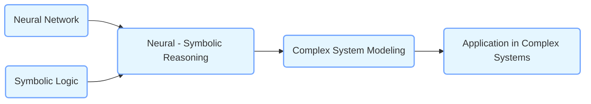

# 神经符号推理在复杂系统建模中的突破性进展

> 关键词：神经符号推理、复杂系统建模、深度学习、符号逻辑、知识表示

> 摘要：本文围绕神经符号推理在复杂系统建模中的突破性进展展开。首先介绍了研究的背景，包括目的、预期读者、文档结构和相关术语。接着阐述了神经符号推理与复杂系统建模的核心概念及它们之间的联系，给出了原理和架构的文本示意图与 Mermaid 流程图。详细讲解了核心算法原理，并用 Python 代码进行阐述，同时给出了相关数学模型和公式，并举例说明。通过项目实战展示了代码的实际案例和详细解释。分析了神经符号推理在复杂系统建模中的实际应用场景，推荐了学习资源、开发工具框架和相关论文著作。最后总结了未来发展趋势与挑战，还提供了常见问题解答和扩展阅读参考资料，旨在全面深入地探讨神经符号推理在复杂系统建模领域的重要进展和应用。

## 1. 背景介绍 
### 1.1 目的和范围
随着科学技术的不断发展，复杂系统建模在众多领域如气象预报、金融市场分析、生物系统研究等变得越来越重要。传统的建模方法在处理复杂系统的不确定性、非线性和大规模数据时面临诸多挑战。神经符号推理作为一种新兴的技术，结合了神经网络强大的感知和学习能力以及符号逻辑的严谨推理能力，为复杂系统建模提供了新的思路和方法。本文的目的在于深入探讨神经符号推理在复杂系统建模中的突破性进展，分析其原理、算法、应用场景等方面的内容，范围涵盖从理论基础到实际应用的多个层面。

### 1.2 预期读者
本文预期读者包括计算机科学、人工智能、控制科学与工程等相关专业的研究人员和学生，对复杂系统建模和神经符号推理技术感兴趣的工程师和技术爱好者，以及在实际应用中需要处理复杂系统问题的行业从业者。

### 1.3 文档结构概述
本文将按照以下结构展开：首先介绍核心概念与联系，包括神经符号推理和复杂系统建模的基本概念以及它们之间的关系；接着阐述核心算法原理和具体操作步骤，用 Python 代码详细说明；然后给出相关的数学模型和公式，并举例解释；通过项目实战展示代码的实际应用和详细解读；分析神经符号推理在复杂系统建模中的实际应用场景；推荐相关的学习资源、开发工具框架和论文著作；最后总结未来发展趋势与挑战，提供常见问题解答和扩展阅读参考资料。

### 1.4 术语表
#### 1.4.1 核心术语定义
- **神经符号推理**：将神经网络的感知和学习能力与符号逻辑的推理能力相结合的一种推理方法，旨在利用神经网络处理数据和学习模式，同时利用符号逻辑进行知识表示和推理。
- **复杂系统建模**：对具有多个相互作用的组件、呈现出非线性、不确定性和涌现行为的系统进行数学描述和分析的过程。
- **深度学习**：一种基于人工神经网络的机器学习方法，通过构建多层神经网络来自动学习数据中的特征和模式。
- **符号逻辑**：用符号来表示命题、谓词和逻辑关系，进行推理和证明的逻辑系统。
- **知识表示**：将知识以计算机能够理解和处理的方式进行表示，以便进行推理和决策。

#### 1.4.2 相关概念解释
- **神经网络**：由大量的神经元组成的计算模型，能够自动学习数据中的模式和特征，常用于图像识别、语音识别等领域。
- **感知器**：神经网络的基本组成单元，能够对输入信号进行加权求和并通过激活函数输出结果。
- **谓词逻辑**：符号逻辑的一种，用于描述对象之间的关系和属性，通过谓词和量词来表达命题。
- **不确定性推理**：在信息不完整或不确定的情况下进行推理的方法，常用的有概率推理、模糊推理等。

#### 1.4.3 缩略词列表
- **NN**：Neural Network（神经网络）
- **DL**：Deep Learning（深度学习）
- **SL**：Symbolic Logic（符号逻辑）
- **NSR**：Neural-Symbolic Reasoning（神经符号推理）

## 2. 核心概念与联系 

### 神经符号推理的原理
神经符号推理的核心思想是将神经网络和符号逻辑有机结合。神经网络具有强大的感知和学习能力，能够从大量的数据中自动提取特征和模式。例如，在图像识别任务中，卷积神经网络（CNN）可以自动学习图像中的特征，如边缘、纹理等。而符号逻辑则具有严谨的推理能力，能够根据已知的知识和规则进行推理和证明。例如，在数学证明中，我们可以根据公理和定理进行推导。

神经符号推理通过将神经网络的输出转化为符号表示，然后利用符号逻辑进行推理，或者将符号知识融入到神经网络的训练中，从而实现两者的优势互补。例如，在一个智能问答系统中，神经网络可以对用户的问题进行语义理解，将其转化为符号表示，然后利用符号逻辑进行推理，找到问题的答案。

### 复杂系统建模的原理
复杂系统建模是对具有多个相互作用的组件、呈现出非线性、不确定性和涌现行为的系统进行数学描述和分析的过程。复杂系统的特点包括：
- **多个组件**：系统由多个不同的组件组成，这些组件之间相互作用。
- **非线性**：组件之间的相互作用不是简单的线性关系，而是呈现出复杂的非线性特征。
- **不确定性**：系统的行为受到多种不确定因素的影响，难以准确预测。
- **涌现行为**：系统的整体行为不能简单地由各个组件的行为相加得到，而是会出现一些新的、不可预测的行为。

复杂系统建模的方法包括数学模型、物理模型、计算机模拟等。例如，在气象预报中，我们可以通过建立大气动力学模型来模拟天气变化；在金融市场分析中，我们可以通过建立金融数学模型来预测股票价格的走势。

### 神经符号推理与复杂系统建模的联系
神经符号推理为复杂系统建模提供了一种新的方法和思路。复杂系统的建模需要处理大量的不确定信息和复杂的关系，传统的建模方法往往难以胜任。神经符号推理可以利用神经网络的学习能力来处理复杂系统中的不确定信息和数据，同时利用符号逻辑的推理能力来处理系统中的规则和知识，从而提高复杂系统建模的准确性和可靠性。

例如，在生物系统建模中，神经符号推理可以通过神经网络学习生物分子之间的相互作用模式，然后利用符号逻辑进行基因调控网络的推理和分析。在交通系统建模中，神经符号推理可以通过神经网络预测交通流量，然后利用符号逻辑进行交通规则的推理和优化。

### 文本示意图
```plaintext
+---------------------+           +---------------------+
|     Neural Network  |           |     Symbolic Logic  |
|  (Perception &      |           |  (Reasoning &        |
|   Learning)         |           |   Knowledge)         |
+---------------------+           +---------------------+
          |                               |
          |                               |
          v                               v
+---------------------+           +---------------------+
|    Neural-Symbolic  |           |    Complex System   |
|    Reasoning        |           |    Modeling         |
|  (Combining NN & SL)|           |  (Handling Complex  |
|                     |           |   Systems)           |
+---------------------+           +---------------------+
          |                               |
          |                               |
          v                               v
+------------------------------------------------------+
|                 Application in Complex Systems       |
|  (e.g., Weather Forecasting, Financial Analysis, etc.)|
+------------------------------------------------------+
```

### Mermaid 流程图


## 3. 核心算法原理 & 具体操作步骤 

### 核心算法原理
神经符号推理的核心算法主要包括两个方面：一是将神经网络的输出转化为符号表示，二是将符号知识融入到神经网络的训练中。

#### 神经网络输出转化为符号表示
一种常见的方法是使用分类器将神经网络的输出映射到离散的符号类别。例如，在图像分类任务中，神经网络的输出是一个概率分布，表示图像属于各个类别的概率。我们可以选择概率最大的类别作为符号表示。

```python
import torch
import torch.nn as nn
import torch.optim as optim

# 定义一个简单的神经网络分类器
class SimpleClassifier(nn.Module):
    def __init__(self, input_size, num_classes):
        super(SimpleClassifier, self).__init__()
        self.fc = nn.Linear(input_size, num_classes)
        self.softmax = nn.Softmax(dim=1)

    def forward(self, x):
        x = self.fc(x)
        x = self.softmax(x)
        return x

# 初始化模型
input_size = 10
num_classes = 3
model = SimpleClassifier(input_size, num_classes)

# 模拟输入数据
input_data = torch.randn(1, input_size)

# 前向传播
output = model(input_data)

# 获取符号表示
symbol = torch.argmax(output, dim=1).item()
print(f"Symbol representation: {symbol}")
```

#### 符号知识融入神经网络训练
可以通过在损失函数中加入符号约束来实现。例如，我们知道某些类别的输出之间存在一定的逻辑关系，我们可以将这些关系转化为约束条件，加入到损失函数中。

```python
# 假设我们知道类别 0 和类别 1 不能同时出现
# 定义符号约束损失
def symbolic_constraint_loss(output):
    p0 = output[0, 0]
    p1 = output[0, 1]
    constraint = torch.max(p0 + p1 - 1, torch.tensor(0.0))
    return constraint

# 定义总损失函数
criterion = nn.CrossEntropyLoss()
optimizer = optim.SGD(model.parameters(), lr=0.01)

# 模拟目标标签
target = torch.tensor([2])

# 计算总损失
output = model(input_data)
cross_entropy_loss = criterion(output, target)
symbolic_loss = symbolic_constraint_loss(output)
total_loss = cross_entropy_loss + symbolic_loss

# 反向传播和优化
optimizer.zero_grad()
total_loss.backward()
optimizer.step()
```

### 具体操作步骤
1. **数据准备**：收集和整理复杂系统的相关数据，包括输入数据和目标数据。对数据进行预处理，如归一化、编码等。
2. **神经网络设计**：根据数据的特点和任务的需求，设计合适的神经网络结构。可以选择不同类型的神经网络，如全连接神经网络、卷积神经网络、循环神经网络等。
3. **符号知识表示**：将复杂系统中的规则和知识用符号逻辑进行表示。例如，使用谓词逻辑表示对象之间的关系和属性。
4. **神经符号推理模型构建**：将神经网络和符号逻辑结合起来，构建神经符号推理模型。可以通过上述的方法将神经网络的输出转化为符号表示，或者将符号知识融入到神经网络的训练中。
5. **模型训练**：使用准备好的数据对神经符号推理模型进行训练。在训练过程中，根据损失函数的反馈不断调整模型的参数，使模型的性能不断提高。
6. **模型评估**：使用测试数据对训练好的模型进行评估，计算模型的准确率、召回率、F1 值等指标，评估模型的性能。
7. **模型应用**：将训练好的模型应用到实际的复杂系统建模中，进行预测、决策等任务。

## 4. 数学模型和公式 & 详细讲解 & 举例说明 

### 神经网络的数学模型
神经网络可以看作是一个函数逼近器，通过多层神经元的非线性变换来逼近复杂的函数。以全连接神经网络为例，第 $l$ 层的第 $j$ 个神经元的输出 $a_j^l$ 可以表示为：

$$
z_j^l = \sum_{i=1}^{n_{l-1}} w_{ji}^l a_i^{l-1} + b_j^l
$$

$$
a_j^l = f(z_j^l)
$$

其中，$w_{ji}^l$ 是第 $l-1$ 层的第 $i$ 个神经元到第 $l$ 层的第 $j$ 个神经元的权重，$b_j^l$ 是第 $l$ 层的第 $j$ 个神经元的偏置，$n_{l-1}$ 是第 $l-1$ 层的神经元数量，$f$ 是激活函数，如 sigmoid 函数、ReLU 函数等。

### 符号逻辑的数学模型
符号逻辑主要使用命题逻辑和谓词逻辑来表示知识和进行推理。命题逻辑使用命题变量和逻辑运算符（如 $\neg$（非）、$\wedge$（与）、$\vee$（或）、$\rightarrow$（蕴含）等）来构建命题。例如，命题 $P$ 和 $Q$ 的合取可以表示为 $P \wedge Q$。

谓词逻辑则在命题逻辑的基础上引入了谓词和量词（如 $\forall$（全称量词）、$\exists$（存在量词））。例如，$\forall x (P(x) \rightarrow Q(x))$ 表示对于所有的 $x$，如果 $x$ 满足 $P$，则 $x$ 满足 $Q$。

### 神经符号推理的数学模型
神经符号推理的数学模型可以看作是神经网络和符号逻辑的结合。例如，在将神经网络的输出转化为符号表示时，我们可以使用一个映射函数 $\phi$ 将神经网络的输出 $y$ 映射到符号集合 $S$ 中的一个符号 $s$：

$$
s = \phi(y)
$$

在将符号知识融入神经网络训练时，我们可以在损失函数 $L$ 中加入符号约束项 $C$：

$$
L_{total} = L_{nn} + \lambda C
$$

其中，$L_{nn}$ 是神经网络的原始损失函数，如交叉熵损失函数，$\lambda$ 是符号约束项的权重。

### 举例说明
假设我们有一个简单的图像分类任务，图像有三种类型：猫、狗和鸟。我们使用一个简单的全连接神经网络进行分类，神经网络的输出是一个三维向量 $y = [y_1, y_2, y_3]$，分别表示图像属于猫、狗和鸟的概率。

我们可以使用以下映射函数将神经网络的输出转化为符号表示：

$$
\phi(y) = 
\begin{cases}
\text{cat}, & \text{if } \arg\max(y) = 0 \\
\text{dog}, & \text{if } \arg\max(y) = 1 \\
\text{bird}, & \text{if } \arg\max(y) = 2
\end{cases}
$$

假设我们知道猫和狗不能同时出现在一张图像中，我们可以将这个符号知识表示为一个约束条件：

$$
C = \max(y_1 + y_2 - 1, 0)
$$

然后将这个约束条件加入到损失函数中，进行模型训练。

## 5. 项目实战：代码实际案例和详细解释说明 

### 5.1  开发环境搭建
我们使用 Python 作为开发语言，主要使用以下库：
- **PyTorch**：一个开源的深度学习框架，用于构建和训练神经网络。
- **NumPy**：一个用于科学计算的 Python 库，提供了高效的数组操作。
- **Matplotlib**：一个用于数据可视化的 Python 库，用于绘制图表。

可以使用以下命令安装这些库：
```sh
pip install torch numpy matplotlib
```

### 5.2  源代码详细实现和代码解读
我们以一个简单的手写数字识别任务为例，展示神经符号推理在复杂系统建模中的应用。

```python
import torch
import torch.nn as nn
import torch.optim as optim
from torchvision import datasets, transforms
import matplotlib.pyplot as plt

# 数据预处理
transform = transforms.Compose([
    transforms.ToTensor(),
    transforms.Normalize((0.1307,), (0.3081,))
])

# 加载训练集和测试集
train_dataset = datasets.MNIST(root='./data', train=True,
                               download=True, transform=transform)
test_dataset = datasets.MNIST(root='./data', train=False,
                              download=True, transform=transform)

train_loader = torch.utils.data.DataLoader(train_dataset, batch_size=64, shuffle=True)
test_loader = torch.utils.data.DataLoader(test_dataset, batch_size=1000, shuffle=False)

# 定义神经网络模型
class SimpleNet(nn.Module):
    def __init__(self):
        super(SimpleNet, self).__init__()
        self.fc1 = nn.Linear(28 * 28, 128)
        self.fc2 = nn.Linear(128, 10)
        self.relu = nn.ReLU()
        self.softmax = nn.Softmax(dim=1)

    def forward(self, x):
        x = x.view(-1, 28 * 28)
        x = self.relu(self.fc1(x))
        x = self.fc2(x)
        x = self.softmax(x)
        return x

# 初始化模型、损失函数和优化器
model = SimpleNet()
criterion = nn.CrossEntropyLoss()
optimizer = optim.SGD(model.parameters(), lr=0.01)

# 训练模型
num_epochs = 5
for epoch in range(num_epochs):
    running_loss = 0.0
    for i, (images, labels) in enumerate(train_loader):
        optimizer.zero_grad()
        outputs = model(images)
        loss = criterion(outputs, labels)
        loss.backward()
        optimizer.step()
        running_loss += loss.item()
    print(f'Epoch {epoch + 1}, Loss: {running_loss / len(train_loader)}')

# 测试模型
correct = 0
total = 0
with torch.no_grad():
    for images, labels in test_loader:
        outputs = model(images)
        _, predicted = torch.max(outputs.data, 1)
        total += labels.size(0)
        correct += (predicted == labels).sum().item()

print(f'Accuracy on test set: {100 * correct / total}%')

# 神经符号推理：假设我们知道数字 0 和 1 不能同时出现在一个小批量中
# 定义符号约束损失
def symbolic_constraint_loss(outputs):
    batch_size = outputs.size(0)
    p0 = outputs[:, 0]
    p1 = outputs[:, 1]
    constraint = torch.max(p0 + p1 - 1, torch.tensor(0.0))
    return constraint.mean()

# 重新训练模型，加入符号约束
model = SimpleNet()
criterion = nn.CrossEntropyLoss()
optimizer = optim.SGD(model.parameters(), lr=0.01)
lambda_constraint = 0.1

for epoch in range(num_epochs):
    running_loss = 0.0
    for i, (images, labels) in enumerate(train_loader):
        optimizer.zero_grad()
        outputs = model(images)
        cross_entropy_loss = criterion(outputs, labels)
        symbolic_loss = symbolic_constraint_loss(outputs)
        total_loss = cross_entropy_loss + lambda_constraint * symbolic_loss
        total_loss.backward()
        optimizer.step()
        running_loss += total_loss.item()
    print(f'Epoch {epoch + 1}, Loss: {running_loss / len(train_loader)}')

# 再次测试模型
correct = 0
total = 0
with torch.no_grad():
    for images, labels in test_loader:
        outputs = model(images)
        _, predicted = torch.max(outputs.data, 1)
        total += labels.size(0)
        correct += (predicted == labels).sum().item()

print(f'Accuracy on test set after symbolic constraint: {100 * correct / total}%')
```

### 5.3  代码解读与分析
1. **数据预处理**：使用 `transforms` 对图像数据进行预处理，包括将图像转换为张量和归一化操作。
2. **数据加载**：使用 `torch.utils.data.DataLoader` 加载训练集和测试集，设置批量大小和是否打乱数据。
3. **模型定义**：定义一个简单的全连接神经网络 `SimpleNet`，包括两个全连接层和一个 ReLU 激活函数。
4. **模型训练**：使用交叉熵损失函数和随机梯度下降优化器对模型进行训练，训练多个 epoch。
5. **模型测试**：在测试集上评估模型的准确率。
6. **神经符号推理**：定义符号约束损失函数，假设数字 0 和 1 不能同时出现在一个小批量中。重新训练模型，将符号约束损失加入到总损失中。
7. **再次测试**：再次在测试集上评估加入符号约束后的模型准确率。

通过比较加入符号约束前后的模型准确率，我们可以看到神经符号推理对模型性能的影响。

## 6. 实际应用场景 
### 气象预报
气象系统是一个典型的复杂系统，受到多种因素的影响，如大气环流、地形地貌、海洋温度等。神经符号推理可以用于气象预报中，通过神经网络学习历史气象数据中的模式和规律，然后利用符号逻辑进行气象规则的推理和分析。例如，根据气象学中的一些基本规则，如冷空气南下会导致气温下降，我们可以将这些规则用符号逻辑表示，然后融入到神经网络的训练中，提高气象预报的准确性。

### 金融市场分析
金融市场也是一个复杂系统，具有高度的不确定性和非线性。神经符号推理可以用于金融市场分析中，通过神经网络分析大量的金融数据，如股票价格、成交量、宏观经济指标等，提取数据中的特征和模式。同时，利用符号逻辑表示金融市场的规则和知识，如股票价格的波动与公司业绩、宏观经济环境等因素的关系，进行推理和预测。例如，在股票投资决策中，神经符号推理可以帮助投资者综合考虑各种因素，做出更合理的投资决策。

### 生物系统研究
生物系统是一个极其复杂的系统，包括基因调控网络、蛋白质相互作用网络等。神经符号推理可以用于生物系统研究中，通过神经网络学习生物分子之间的相互作用模式，然后利用符号逻辑进行基因调控网络的推理和分析。例如，在基因治疗中，神经符号推理可以帮助科学家理解基因之间的调控关系，找到合适的治疗靶点。

### 交通系统优化
交通系统是一个复杂的动态系统，受到交通流量、道路状况、交通规则等多种因素的影响。神经符号推理可以用于交通系统优化中，通过神经网络预测交通流量，然后利用符号逻辑进行交通规则的推理和优化。例如，在智能交通管理中，神经符号推理可以根据实时的交通信息，合理调整交通信号灯的时间，优化交通流量，减少拥堵。

## 7. 工具和资源推荐
### 7.1 学习资源推荐
#### 7.1.1 书籍推荐
- 《深度学习》（Deep Learning）：由 Ian Goodfellow、Yoshua Bengio 和 Aaron Courville 所著，是深度学习领域的经典教材，涵盖了神经网络、深度学习算法、优化方法等方面的内容。
- 《人工智能：一种现代的方法》（Artificial Intelligence: A Modern Approach）：由 Stuart Russell 和 Peter Norvig 所著，是人工智能领域的权威教材，介绍了人工智能的基本概念、算法和应用，包括符号逻辑推理和机器学习等内容。
- 《神经符号人工智能：从机器学习到基于知识的推理》（Neural-Symbolic Artificial Intelligence: The State of the Art）：由 Artur S. d'Avila Garcez、Krysia Broda 和 Dov M. Gabbay 所著，专门介绍了神经符号推理的理论和方法。

#### 7.1.2 在线课程
- Coursera 上的“深度学习专项课程”（Deep Learning Specialization）：由 Andrew Ng 教授授课，包括神经网络基础、卷积神经网络、循环神经网络等内容。
- edX 上的“人工智能导论”（Introduction to Artificial Intelligence）：由麻省理工学院（MIT）的 Patrick H. Winston 教授授课，介绍了人工智能的基本概念和方法。
- Udemy 上的“神经符号推理实战”（Practical Neural-Symbolic Reasoning）：专门讲解神经符号推理的实际应用和编程实现。

#### 7.1.3 技术博客和网站
- Medium 上的 AI 相关博客：有很多关于人工智能和神经符号推理的文章，包括最新的研究成果和技术应用。
- arXiv.org：一个预印本数据库，提供了大量的人工智能和机器学习领域的研究论文。
- Towards Data Science：一个专注于数据科学和人工智能的网站，有很多高质量的技术文章和教程。

### 7.2 开发工具框架推荐
#### 7.2.1 IDE和编辑器
- PyCharm：一个专门为 Python 开发设计的集成开发环境（IDE），提供了代码编辑、调试、版本控制等功能。
- Jupyter Notebook：一个交互式的开发环境，适合进行数据探索、模型训练和结果展示。
- Visual Studio Code：一个轻量级的代码编辑器，支持多种编程语言，有丰富的插件可以扩展功能。

#### 7.2.2 调试和性能分析工具
- PyTorch Profiler：PyTorch 提供的性能分析工具，可以帮助开发者分析模型的运行时间和内存使用情况。
- TensorBoard：一个可视化工具，用于监控和分析深度学习模型的训练过程，如损失函数的变化、准确率的变化等。
- cProfile：Python 标准库中的性能分析工具，可以分析 Python 代码的运行时间和函数调用情况。

#### 7.2.3 相关框架和库
- PyTorch：一个开源的深度学习框架，提供了丰富的神经网络层和优化算法，易于使用和扩展。
- TensorFlow：另一个流行的深度学习框架，具有强大的分布式训练和部署能力。
- scikit-learn：一个用于机器学习的 Python 库，提供了多种机器学习算法和工具，如分类、回归、聚类等。

### 7.3 相关论文著作推荐
#### 7.3.1 经典论文
- “Neural-Symbolic Learning and Reasoning: Contributions and Challenges”：该论文介绍了神经符号学习和推理的发展历程、主要方法和面临的挑战。
- “DeepProbLog: Neural Probabilistic Logic Programming”：提出了 DeepProbLog 模型，将深度学习和概率逻辑编程相结合。
- “Towards Neural-Symbolic Artificial Intelligence”：探讨了神经符号人工智能的发展方向和潜在应用。

#### 7.3.2 最新研究成果
- 关注 arXiv.org 上关于神经符号推理的最新预印本论文，了解该领域的最新研究进展。
- 参加人工智能领域的顶级会议，如 NeurIPS、ICML、AAAI 等，获取最新的研究成果和技术动态。

#### 7.3.3 应用案例分析
- 阅读相关领域的应用案例论文，如气象预报、金融市场分析、生物系统研究等领域中神经符号推理的应用案例，学习如何将神经符号推理技术应用到实际问题中。

## 8. 总结：未来发展趋势与挑战
### 未来发展趋势
- **更紧密的融合**：未来神经符号推理将实现神经网络和符号逻辑更紧密的融合，不仅仅是简单的结合，而是在模型架构、训练方法等方面进行深度融合，以更好地发挥两者的优势。
- **多模态融合**：神经符号推理将与多模态数据处理相结合，如结合图像、文本、语音等多种模态的数据进行推理和决策，提高复杂系统建模的能力。
- **可解释性增强**：随着人工智能在关键领域的应用越来越广泛，对模型的可解释性要求也越来越高。神经符号推理由于其符号逻辑的特性，有望在可解释性方面取得更大的进展，为用户提供更清晰的决策依据。
- **跨领域应用拓展**：神经符号推理将在更多的领域得到应用，如医疗保健、自动驾驶、工业自动化等，为解决这些领域的复杂问题提供新的方法和手段。

### 挑战
- **理论基础不完善**：目前神经符号推理的理论基础还不够完善，缺乏统一的理论框架和方法。需要进一步研究神经网络和符号逻辑之间的数学关系，建立更加严谨的理论体系。
- **计算复杂度高**：神经符号推理涉及到神经网络的训练和符号逻辑的推理，计算复杂度较高。如何提高计算效率，降低计算成本，是一个亟待解决的问题。
- **数据和知识获取困难**：复杂系统建模需要大量的数据和知识，而数据和知识的获取往往比较困难。如何有效地获取和整合数据和知识，是神经符号推理面临的一个挑战。
- **模型可扩展性差**：目前的神经符号推理模型在处理大规模复杂系统时，可扩展性较差。需要研究更加高效的模型架构和算法，提高模型的可扩展性。

## 9. 附录：常见问题与解答
### 问题 1：神经符号推理和传统的机器学习方法有什么区别？
传统的机器学习方法主要依赖于数据驱动的学习，通过大量的数据来训练模型，学习数据中的模式和规律。而神经符号推理不仅利用数据进行学习，还结合了符号逻辑的推理能力，能够处理复杂的知识和规则。神经符号推理可以将领域知识融入到模型中，提高模型的可解释性和泛化能力。

### 问题 2：神经符号推理在复杂系统建模中的优势是什么？
神经符号推理在复杂系统建模中的优势主要体现在以下几个方面：
- 能够处理复杂系统中的不确定性和非线性，通过神经网络学习数据中的模式和特征。
- 可以利用符号逻辑表示和处理复杂系统中的规则和知识，提高模型的推理能力和可解释性。
- 能够将数据和知识进行有机结合，充分发挥两者的优势，提高复杂系统建模的准确性和可靠性。

### 问题 3：如何选择合适的神经网络结构和符号逻辑表示方法？
选择合适的神经网络结构和符号逻辑表示方法需要考虑以下因素：
- 数据的特点：如果数据是图像数据，可以选择卷积神经网络；如果数据是序列数据，可以选择循环神经网络。
- 任务的需求：根据具体的任务需求，选择合适的神经网络结构和符号逻辑表示方法。例如，如果任务需要处理复杂的逻辑关系，可以选择谓词逻辑进行表示。
- 计算资源：考虑计算资源的限制，选择合适的模型复杂度。

### 问题 4：神经符号推理模型的训练时间通常比较长，有什么方法可以提高训练效率？
可以采用以下方法提高神经符号推理模型的训练效率：
- 优化模型架构：选择合适的神经网络结构，减少模型的参数数量，降低计算复杂度。
- 采用并行计算：利用 GPU 或分布式计算平台进行并行计算，加速模型的训练过程。
- 数据预处理：对数据进行合理的预处理，如数据增强、归一化等，提高数据的质量和可用性。
- 优化训练算法：选择合适的优化算法，如 Adam、Adagrad 等，调整学习率等超参数，提高训练效率。

## 10. 扩展阅读 & 参考资料
- Goodfellow, I., Bengio, Y., & Courville, A. (2016). Deep Learning. MIT Press.
- Russell, S. J., & Norvig, P. (2016). Artificial Intelligence: A Modern Approach. Pearson.
- d'Avila Garcez, A. S., Broda, K., & Gabbay, D. M. (2009). Neural-Symbolic Learning and Reasoning: Foundations and Applications. Springer.
- arXiv.org: https://arxiv.org/
- Towards Data Science: https://towardsdatascience.com/
- PyTorch Documentation: https://pytorch.org/docs/stable/index.html
- TensorFlow Documentation: https://www.tensorflow.org/api_docs

作者：AI天才研究院/AI Genius Institute & 禅与计算机程序设计艺术 /Zen And The Art of Computer Programming