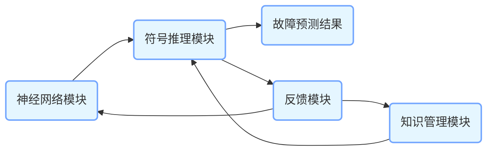

# 神经符号推理在复杂系统故障预测中的实践

> 关键词：神经符号推理、复杂系统、故障预测、机器学习、知识表示

> 摘要：本文深入探讨了神经符号推理在复杂系统故障预测中的实践应用。首先介绍了研究的背景、目的、预期读者和文档结构，明确了相关术语。接着阐述了神经符号推理的核心概念、原理及架构，通过Mermaid流程图展示其工作流程。详细讲解了核心算法原理，并用Python代码进行具体实现。给出了相关数学模型和公式，并举例说明。通过项目实战，展示了如何搭建开发环境、实现源代码及对代码进行解读分析。探讨了神经符号推理在复杂系统故障预测中的实际应用场景，推荐了学习资源、开发工具框架以及相关论文著作。最后总结了未来发展趋势与挑战，提供了常见问题解答和扩展阅读参考资料，旨在为相关领域的研究者和实践者提供全面的技术指导。

## 1. 背景介绍 
### 1.1 目的和范围
在当今科技飞速发展的时代，复杂系统如航空航天系统、电力网络、工业自动化生产线等在各个领域发挥着至关重要的作用。这些系统的正常运行对于保障生产安全、提高经济效益具有重要意义。然而，由于系统的复杂性和不确定性，故障的发生难以避免。故障预测能够提前发现潜在的故障隐患，采取相应的措施进行预防和修复，从而减少故障带来的损失。

神经符号推理结合了神经网络强大的感知和学习能力以及符号推理的逻辑表达和知识利用能力，为复杂系统故障预测提供了一种新的思路和方法。本研究的目的在于探索神经符号推理在复杂系统故障预测中的应用，通过理论分析和实践验证，展示其有效性和优势。

本研究的范围主要涵盖了神经符号推理的基本原理、核心算法，以及在复杂系统故障预测中的具体应用。包括对复杂系统故障数据的处理、特征提取，神经符号推理模型的构建、训练和评估，以及实际应用案例的分析。

### 1.2 预期读者
本文的预期读者主要包括以下几类人群：
- 研究人员：对人工智能、机器学习、故障诊断等领域感兴趣的科研工作者，希望通过本文了解神经符号推理在复杂系统故障预测中的最新研究进展和应用方法。
- 工程师：从事复杂系统设计、开发和维护的工程师，如航空航天工程师、电力工程师、工业自动化工程师等，期望借助神经符号推理技术提高系统的可靠性和安全性。
- 学生：计算机科学、控制工程、电气工程等相关专业的本科生和研究生，通过阅读本文可以拓宽知识面，了解前沿技术在实际工程中的应用。

### 1.3 文档结构概述
本文的结构如下：
- 背景介绍：阐述研究的目的和范围、预期读者以及文档结构概述，并对相关术语进行解释。
- 核心概念与联系：介绍神经符号推理的核心概念、原理和架构，通过文本示意图和Mermaid流程图展示其工作流程。
- 核心算法原理 & 具体操作步骤：详细讲解神经符号推理的核心算法原理，并用Python代码进行具体实现。
- 数学模型和公式 & 详细讲解 & 举例说明：给出神经符号推理的数学模型和公式，并进行详细讲解，通过具体例子说明其应用。
- 项目实战：代码实际案例和详细解释说明：通过一个实际的复杂系统故障预测项目，展示如何搭建开发环境、实现源代码及对代码进行解读分析。
- 实际应用场景：探讨神经符号推理在复杂系统故障预测中的实际应用场景。
- 工具和资源推荐：推荐学习资源、开发工具框架以及相关论文著作。
- 总结：未来发展趋势与挑战：总结神经符号推理在复杂系统故障预测中的应用现状，分析未来发展趋势和面临的挑战。
- 附录：常见问题与解答：提供常见问题的解答，帮助读者更好地理解和应用本文的内容。
- 扩展阅读 & 参考资料：提供相关的扩展阅读资料和参考文献，方便读者进一步深入研究。

### 1.4 术语表
#### 1.4.1 核心术语定义
- 神经符号推理（Neural-Symbolic Reasoning）：一种将神经网络和符号推理相结合的技术，利用神经网络进行数据的感知和学习，利用符号推理进行知识的表达和逻辑推理。
- 复杂系统（Complex System）：由大量相互作用的组件组成的系统，具有高度的复杂性、不确定性和非线性。
- 故障预测（Fault Prediction）：通过对系统运行数据的分析和处理，提前预测系统可能发生的故障。
- 知识表示（Knowledge Representation）：将人类的知识以计算机能够理解和处理的方式进行表示。
- 符号逻辑（Symbolic Logic）：一种基于符号和规则的逻辑推理方法，用于处理知识和进行推理。

#### 1.4.2 相关概念解释
- 神经网络（Neural Network）：一种模仿人类神经系统的计算模型，由大量的神经元组成，能够自动学习数据中的模式和特征。
- 深度学习（Deep Learning）：一种基于神经网络的机器学习方法，通过构建多层神经网络来学习数据的深层次特征。
- 机器学习（Machine Learning）：让计算机通过数据学习模式和规律，从而实现预测和决策的技术。
- 专家系统（Expert System）：一种基于知识和规则的人工智能系统，能够模拟人类专家的决策过程。

#### 1.4.3 缩略词列表
- ANN（Artificial Neural Network）：人工神经网络
- DNN（Deep Neural Network）：深度神经网络
- ML（Machine Learning）：机器学习
- NLP（Natural Language Processing）：自然语言处理

## 2. 核心概念与联系 
### 2.1 神经符号推理的核心概念
神经符号推理的核心思想是将神经网络的感知和学习能力与符号推理的逻辑表达和知识利用能力相结合。神经网络擅长处理大规模的数据和复杂的模式，能够自动从数据中学习特征和规律。而符号推理则擅长处理知识和逻辑关系，能够进行精确的推理和决策。

在复杂系统故障预测中，神经符号推理可以通过神经网络对系统的运行数据进行感知和特征提取，将数据转化为符号表示。然后，利用符号推理对这些符号进行逻辑推理，结合先验知识和规则，预测系统可能发生的故障。

### 2.2 神经符号推理的原理
神经符号推理的原理可以分为以下几个步骤：
1. **数据感知**：使用神经网络对复杂系统的运行数据进行感知和处理，提取数据中的特征。例如，对于电力系统，可以使用传感器采集电压、电流、功率等数据，然后通过神经网络对这些数据进行处理，提取出与故障相关的特征。
2. **符号表示**：将神经网络提取的特征转化为符号表示。符号表示可以是离散的概念、命题或逻辑表达式，能够方便地进行知识表示和逻辑推理。例如，将电压值转化为“高电压”、“正常电压”、“低电压”等符号。
3. **知识表示与推理**：利用符号逻辑对符号表示进行知识表示和推理。知识可以是领域专家的经验、规则或先验知识，通过符号逻辑可以将这些知识形式化，并进行推理和决策。例如，根据“高电压”和“设备过热”等符号，可以推断出可能存在“电路故障”。
4. **反馈与学习**：将符号推理的结果反馈给神经网络，对神经网络进行调整和优化。同时，根据新的数据和推理结果，更新知识表示和规则，提高推理的准确性和可靠性。

### 2.3 神经符号推理的架构
神经符号推理的架构主要包括以下几个部分：
- **神经网络模块**：负责对系统的运行数据进行感知和特征提取，将数据转化为符号表示。
- **符号推理模块**：负责对符号表示进行知识表示和推理，根据先验知识和规则进行故障预测。
- **知识管理模块**：负责知识的存储、更新和维护，提供符号推理所需的知识和规则。
- **反馈模块**：负责将符号推理的结果反馈给神经网络，对神经网络进行调整和优化。

### 2.4 文本示意图和Mermaid流程图
#### 文本示意图
```plaintext
+-----------------+          +-----------------+          +-----------------+
|  神经网络模块   | -------> |  符号推理模块   | -------> |  故障预测结果   |
| (数据感知、特征提取)      | (知识表示、推理)  |           |                 |
+-----------------+          +-----------------+          +-----------------+
          ^                            |
          |                            |
          |                            v
+-----------------+          +-----------------+
|  知识管理模块   | <------- |  反馈模块       |
| (知识存储、更新)          | (结果反馈、优化)  |
+-----------------+          +-----------------+
```

#### Mermaid流程图


## 3. 核心算法原理 & 具体操作步骤 
### 3.1 核心算法原理
神经符号推理的核心算法主要包括神经网络的训练算法和符号推理的逻辑算法。

#### 神经网络训练算法
常用的神经网络训练算法是反向传播算法（Backpropagation Algorithm）。反向传播算法通过计算神经网络的输出与期望输出之间的误差，然后将误差反向传播到神经网络的各个层，调整神经元的权重和偏置，使得误差最小化。

假设神经网络有 $L$ 层，第 $l$ 层的神经元数量为 $n_l$，输入层为第 $0$ 层，输出层为第 $L$ 层。第 $l$ 层第 $j$ 个神经元的输入为 $z_j^l$，输出为 $a_j^l$，权重为 $w_{ij}^l$，偏置为 $b_j^l$，激活函数为 $\sigma$。则有：

$$z_j^l = \sum_{i=1}^{n_{l-1}} w_{ij}^l a_i^{l-1} + b_j^l$$

$$a_j^l = \sigma(z_j^l)$$

反向传播算法的具体步骤如下：
1. **前向传播**：从输入层开始，依次计算每一层神经元的输入和输出，直到输出层。
2. **计算误差**：计算输出层的实际输出与期望输出之间的误差，通常使用均方误差（Mean Squared Error，MSE）作为损失函数。

$$E = \frac{1}{2} \sum_{j=1}^{n_L} (y_j - a_j^L)^2$$

其中，$y_j$ 是期望输出，$a_j^L$ 是实际输出。

3. **反向传播**：从输出层开始，依次计算每一层神经元的误差项 $\delta_j^l$，并根据误差项调整权重和偏置。

$$\delta_j^L = (a_j^L - y_j) \sigma'(z_j^L)$$

$$\delta_j^l = \left( \sum_{k=1}^{n_{l+1}} w_{jk}^{l+1} \delta_k^{l+1} \right) \sigma'(z_j^l)$$

$$\Delta w_{ij}^l = -\eta \delta_j^l a_i^{l-1}$$

$$\Delta b_j^l = -\eta \delta_j^l$$

其中，$\eta$ 是学习率，$\sigma'(z)$ 是激活函数的导数。

4. **更新权重和偏置**：根据计算得到的 $\Delta w_{ij}^l$ 和 $\Delta b_j^l$，更新权重和偏置。

$$w_{ij}^l = w_{ij}^l + \Delta w_{ij}^l$$

$$b_j^l = b_j^l + \Delta b_j^l$$

#### 符号推理逻辑算法
符号推理的逻辑算法主要基于符号逻辑，如命题逻辑、谓词逻辑等。在复杂系统故障预测中，可以使用规则推理的方法，根据预先定义的规则和事实进行推理。

例如，定义以下规则：
- 规则1：如果“高电压”且“设备过热”，则“电路故障”。
- 规则2：如果“低电压”且“电流异常”，则“电源故障”。

已知事实：“高电压”和“设备过热”。根据规则1，可以推断出“电路故障”。

### 3.2 具体操作步骤
#### 步骤1：数据预处理
收集复杂系统的运行数据，对数据进行清洗、归一化等预处理操作，以提高数据的质量和可用性。

#### 步骤2：神经网络训练
使用预处理后的数据训练神经网络，调整神经网络的参数，使得神经网络能够准确地提取数据中的特征。

#### 步骤3：符号表示转换
将神经网络提取的特征转化为符号表示，建立特征与符号之间的映射关系。

#### 步骤4：知识表示与规则定义
根据领域专家的经验和先验知识，定义符号推理所需的知识和规则。

#### 步骤5：符号推理
使用符号推理算法，根据符号表示和规则进行推理，预测系统可能发生的故障。

#### 步骤6：反馈与优化
将符号推理的结果反馈给神经网络，对神经网络进行调整和优化。同时，根据新的数据和推理结果，更新知识表示和规则。

### 3.3 Python代码实现
```python
import numpy as np

# 定义激活函数及其导数
def sigmoid(x):
    return 1 / (1 + np.exp(-x))

def sigmoid_derivative(x):
    return sigmoid(x) * (1 - sigmoid(x))

# 定义神经网络类
class NeuralNetwork:
    def __init__(self, input_size, hidden_size, output_size):
        # 初始化权重和偏置
        self.weights_input_hidden = np.random.rand(input_size, hidden_size)
        self.bias_hidden = np.zeros((1, hidden_size))
        self.weights_hidden_output = np.random.rand(hidden_size, output_size)
        self.bias_output = np.zeros((1, output_size))

    def forward(self, X):
        # 前向传播
        self.hidden_input = np.dot(X, self.weights_input_hidden) + self.bias_hidden
        self.hidden_output = sigmoid(self.hidden_input)
        self.output_input = np.dot(self.hidden_output, self.weights_hidden_output) + self.bias_output
        self.output = sigmoid(self.output_input)
        return self.output

    def backward(self, X, y, output):
        # 反向传播
        self.output_error = y - output
        self.output_delta = self.output_error * sigmoid_derivative(self.output_input)

        self.hidden_error = self.output_delta.dot(self.weights_hidden_output.T)
        self.hidden_delta = self.hidden_error * sigmoid_derivative(self.hidden_input)

        # 更新权重和偏置
        self.weights_hidden_output += self.hidden_output.T.dot(self.output_delta)
        self.bias_output += np.sum(self.output_delta, axis=0, keepdims=True)
        self.weights_input_hidden += X.T.dot(self.hidden_delta)
        self.bias_hidden += np.sum(self.hidden_delta, axis=0, keepdims=True)

    def train(self, X, y, epochs):
        for epoch in range(epochs):
            output = self.forward(X)
            self.backward(X, y, output)

# 示例数据
X = np.array([[0, 0], [0, 1], [1, 0], [1, 1]])
y = np.array([[0], [1], [1], [0]])

# 创建神经网络
input_size = 2
hidden_size = 2
output_size = 1
nn = NeuralNetwork(input_size, hidden_size, output_size)

# 训练神经网络
epochs = 10000
nn.train(X, y, epochs)

# 测试神经网络
test_output = nn.forward(X)
print("Test Output:")
print(test_output)
```

## 4. 数学模型和公式 & 详细讲解 & 举例说明 
### 4.1 神经网络的数学模型
神经网络可以看作是一个函数逼近器，通过调整神经元的权重和偏置，将输入数据映射到输出数据。

#### 单层感知机
单层感知机是最简单的神经网络模型，由一个输入层和一个输出层组成。假设输入向量为 $\mathbf{x} = [x_1, x_2, \cdots, x_n]^T$，权重向量为 $\mathbf{w} = [w_1, w_2, \cdots, w_n]^T$，偏置为 $b$，则输出 $y$ 可以表示为：

$$y = f\left( \sum_{i=1}^{n} w_i x_i + b \right) = f(\mathbf{w}^T \mathbf{x} + b)$$

其中，$f$ 是激活函数，常用的激活函数有阶跃函数、sigmoid函数、ReLU函数等。

#### 多层感知机
多层感知机（Multilayer Perceptron，MLP）由一个输入层、多个隐藏层和一个输出层组成。第 $l$ 层第 $j$ 个神经元的输入和输出可以表示为：

$$z_j^l = \sum_{i=1}^{n_{l-1}} w_{ij}^l a_i^{l-1} + b_j^l$$

$$a_j^l = \sigma(z_j^l)$$

其中，$n_{l-1}$ 是第 $l-1$ 层的神经元数量，$w_{ij}^l$ 是第 $l-1$ 层第 $i$ 个神经元到第 $l$ 层第 $j$ 个神经元的权重，$b_j^l$ 是第 $l$ 层第 $j$ 个神经元的偏置，$\sigma$ 是激活函数。

### 4.2 反向传播算法的数学推导
#### 误差函数
通常使用均方误差（MSE）作为误差函数，对于一个样本 $(\mathbf{x}, \mathbf{y})$，误差函数可以表示为：

$$E = \frac{1}{2} \sum_{j=1}^{n_L} (y_j - a_j^L)^2$$

其中，$n_L$ 是输出层的神经元数量，$y_j$ 是期望输出，$a_j^L$ 是实际输出。

#### 输出层误差项
根据链式法则，输出层第 $j$ 个神经元的误差项 $\delta_j^L$ 可以表示为：

$$\delta_j^L = \frac{\partial E}{\partial z_j^L} = \frac{\partial E}{\partial a_j^L} \cdot \frac{\partial a_j^L}{\partial z_j^L}$$

$$\frac{\partial E}{\partial a_j^L} = -(y_j - a_j^L)$$

$$\frac{\partial a_j^L}{\partial z_j^L} = \sigma'(z_j^L)$$

所以，

$$\delta_j^L = (a_j^L - y_j) \sigma'(z_j^L)$$

#### 隐藏层误差项
隐藏层第 $j$ 个神经元的误差项 $\delta_j^l$ 可以通过输出层的误差项反向传播得到：

$$\delta_j^l = \frac{\partial E}{\partial z_j^l} = \sum_{k=1}^{n_{l+1}} \frac{\partial E}{\partial z_k^{l+1}} \cdot \frac{\partial z_k^{l+1}}{\partial z_j^l}$$

$$\frac{\partial E}{\partial z_k^{l+1}} = \delta_k^{l+1}$$

$$\frac{\partial z_k^{l+1}}{\partial z_j^l} = w_{jk}^{l+1} \sigma'(z_j^l)$$

所以，

$$\delta_j^l = \left( \sum_{k=1}^{n_{l+1}} w_{jk}^{l+1} \delta_k^{l+1} \right) \sigma'(z_j^l)$$

#### 权重和偏置的更新
根据误差项，可以计算权重和偏置的更新量：

$$\Delta w_{ij}^l = -\eta \frac{\partial E}{\partial w_{ij}^l} = -\eta \delta_j^l a_i^{l-1}$$

$$\Delta b_j^l = -\eta \frac{\partial E}{\partial b_j^l} = -\eta \delta_j^l$$

其中，$\eta$ 是学习率。

### 4.3 符号推理的数学模型
符号推理主要基于符号逻辑，如命题逻辑、谓词逻辑等。在命题逻辑中，命题是一个可以判断真假的陈述句，用大写字母表示。例如，$P$ 表示“高电压”，$Q$ 表示“设备过热”，$R$ 表示“电路故障”。

#### 命题逻辑的基本运算
- 合取（$\land$）：表示“且”的关系，$P \land Q$ 表示 $P$ 和 $Q$ 同时为真。
- 析取（$\lor$）：表示“或”的关系，$P \lor Q$ 表示 $P$ 或 $Q$ 至少有一个为真。
- 否定（$\neg$）：表示“非”的关系，$\neg P$ 表示 $P$ 为假。
- 蕴含（$\rightarrow$）：表示“如果……那么……”的关系，$P \rightarrow Q$ 表示如果 $P$ 为真，则 $Q$ 为真。

#### 规则推理
规则可以表示为蕴含式，例如，规则“如果“高电压”且“设备过热”，则“电路故障””可以表示为：

$$P \land Q \rightarrow R$$

已知事实 $P$ 和 $Q$ 为真，根据蕴含式的推理规则，可以推断出 $R$ 为真。

### 4.4 举例说明
#### 神经网络举例
假设我们有一个简单的神经网络，输入层有2个神经元，隐藏层有2个神经元，输出层有1个神经元。输入数据为 $\mathbf{x} = [0, 1]$，权重和偏置如下：

$$\mathbf{W}_{input \to hidden} = \begin{bmatrix} 0.1 & 0.2 \\ 0.3 & 0.4 \end{bmatrix}$$

$$\mathbf{b}_{hidden} = \begin{bmatrix} 0.5 \\ 0.6 \end{bmatrix}$$

$$\mathbf{W}_{hidden \to output} = \begin{bmatrix} 0.7 \\ 0.8 \end{bmatrix}$$

$$b_{output} = 0.9$$

激活函数为sigmoid函数。

首先，计算隐藏层的输入和输出：

$$\mathbf{z}_{hidden} = \mathbf{x} \cdot \mathbf{W}_{input \to hidden} + \mathbf{b}_{hidden} = \begin{bmatrix} 0 & 1 \end{bmatrix} \cdot \begin{bmatrix} 0.1 & 0.2 \\ 0.3 & 0.4 \end{bmatrix} + \begin{bmatrix} 0.5 \\ 0.6 \end{bmatrix} = \begin{bmatrix} 0.8 \\ 1.0 \end{bmatrix}$$

$$\mathbf{a}_{hidden} = \sigma(\mathbf{z}_{hidden}) = \begin{bmatrix} \frac{1}{1 + e^{-0.8}} \\ \frac{1}{1 + e^{-1.0}} \end{bmatrix} \approx \begin{bmatrix} 0.69 \\ 0.73 \end{bmatrix}$$

然后，计算输出层的输入和输出：

$$z_{output} = \mathbf{a}_{hidden} \cdot \mathbf{W}_{hidden \to output} + b_{output} = \begin{bmatrix} 0.69 & 0.73 \end{bmatrix} \cdot \begin{bmatrix} 0.7 \\ 0.8 \end{bmatrix} + 0.9 \approx 2.0$$

$$a_{output} = \sigma(z_{output}) = \frac{1}{1 + e^{-2.0}} \approx 0.88$$

#### 符号推理举例
假设我们有以下规则和事实：
- 规则1：$P \land Q \rightarrow R$
- 规则2：$S \land T \rightarrow U$
- 事实：$P$ 为真，$Q$ 为真

根据规则1，可以推断出 $R$ 为真。

## 5. 项目实战：代码实际案例和详细解释说明 
### 5.1  开发环境搭建
#### 操作系统
建议使用Linux或Windows操作系统，本项目在Ubuntu 20.04和Windows 10上进行了测试。

#### Python环境
安装Python 3.7及以上版本，可以从Python官方网站（https://www.python.org/downloads/）下载并安装。

#### 依赖库
安装以下Python依赖库：
- NumPy：用于数值计算。
- Pandas：用于数据处理和分析。
- Scikit-learn：用于机器学习算法。
- TensorFlow或PyTorch：用于深度学习模型的构建和训练。

可以使用以下命令安装依赖库：
```sh
pip install numpy pandas scikit-learn tensorflow
```

### 5.2  源代码详细实现和代码解读
#### 数据加载和预处理
```python
import pandas as pd
from sklearn.preprocessing import StandardScaler

# 加载数据
data = pd.read_csv('complex_system_data.csv')

# 分离特征和标签
X = data.drop('fault_label', axis=1)
y = data['fault_label']

# 数据标准化
scaler = StandardScaler()
X_scaled = scaler.fit_transform(X)
```

**代码解读**：
- 使用Pandas库的 `read_csv` 函数加载复杂系统的运行数据。
- 使用 `drop` 函数分离特征和标签，`fault_label` 列是故障标签。
- 使用 `StandardScaler` 对特征数据进行标准化处理，使得数据的均值为0，标准差为1。

#### 神经网络模型构建和训练
```python
import tensorflow as tf
from tensorflow.keras.models import Sequential
from tensorflow.keras.layers import Dense

# 构建神经网络模型
model = Sequential([
    Dense(64, activation='relu', input_shape=(X_scaled.shape[1],)),
    Dense(32, activation='relu'),
    Dense(1, activation='sigmoid')
])

# 编译模型
model.compile(optimizer='adam', loss='binary_crossentropy', metrics=['accuracy'])

# 训练模型
model.fit(X_scaled, y, epochs=100, batch_size=32, validation_split=0.2)
```

**代码解读**：
- 使用TensorFlow的Keras API构建一个简单的神经网络模型，包含一个输入层、两个隐藏层和一个输出层。
- 使用 `compile` 函数编译模型，指定优化器为 `adam`，损失函数为 `binary_crossentropy`，评估指标为 `accuracy`。
- 使用 `fit` 函数训练模型，指定训练数据、训练轮数、批次大小和验证集比例。

#### 符号表示转换和符号推理
```python
# 假设已经定义了符号表示和规则
symbol_mapping = {
    'high_voltage': [1, 0, 0],
    'normal_voltage': [0, 1, 0],
    'low_voltage': [0, 0, 1]
}

rules = [
    {'conditions': ['high_voltage', 'device_overheat'], 'conclusion': 'circuit_fault'},
    {'conditions': ['low_voltage', 'current_anomaly'], 'conclusion': 'power_supply_fault'}
]

# 示例数据
sample_data = [1, 0, 0]  # 表示高电压

# 符号表示转换
symbol = None
for key, value in symbol_mapping.items():
    if sample_data == value:
        symbol = key
        break

# 符号推理
fault_prediction = None
for rule in rules:
    if symbol in rule['conditions']:
        fault_prediction = rule['conclusion']
        break

print("Fault Prediction:", fault_prediction)
```

**代码解读**：
- 定义了符号表示和规则，`symbol_mapping` 是特征与符号之间的映射关系，`rules` 是符号推理的规则。
- 对于示例数据，通过遍历 `symbol_mapping` 找到对应的符号表示。
- 遍历 `rules`，如果符号满足规则的条件，则推断出故障类型。

### 5.3  代码解读与分析
#### 数据预处理的重要性
数据预处理是机器学习和深度学习中的重要步骤，能够提高数据的质量和可用性。标准化处理可以使得不同特征的数据具有相同的尺度，避免某些特征对模型的影响过大。

#### 神经网络模型的选择和调优
在构建神经网络模型时，需要根据具体的问题选择合适的模型结构和超参数。例如，隐藏层的数量和神经元的数量会影响模型的复杂度和性能。可以通过交叉验证等方法进行超参数调优。

#### 符号推理的灵活性和可解释性
符号推理具有灵活性和可解释性的优点。可以根据领域专家的经验和先验知识定义规则，并且推理过程可以清晰地展示出来。但是，符号推理也存在规则难以定义和维护的问题。

## 6. 实际应用场景 
### 6.1 航空航天系统
在航空航天系统中，复杂的电子设备、机械部件和飞行控制系统容易出现故障。神经符号推理可以通过对传感器数据的分析，如温度、压力、振动等，提取特征并转化为符号表示。结合航空领域的知识和规则，预测系统可能发生的故障，如发动机故障、航电系统故障等。提前发现故障隐患可以及时采取措施进行维修和调整，保障飞行安全。

### 6.2 电力网络
电力网络是一个庞大而复杂的系统，包括发电、输电、变电、配电等多个环节。神经符号推理可以对电力系统的运行数据进行监测和分析，如电压、电流、功率等。通过神经网络提取数据中的特征，将其转化为符号表示，如“高电压”、“低电压”、“过载”等。利用电力系统的知识和规则，预测可能发生的故障，如线路故障、变压器故障等。及时发现故障可以采取相应的措施进行故障隔离和修复，保障电力供应的稳定性。

### 6.3 工业自动化生产线
工业自动化生产线通常由多个机器人、传感器和控制器组成，设备之间的协同工作非常复杂。神经符号推理可以对生产线的运行数据进行实时监测，如设备的运行状态、生产效率、产品质量等。通过神经网络提取数据中的特征，将其转化为符号表示，如“设备故障”、“生产异常”等。结合工业生产的知识和规则，预测可能发生的故障，提前安排维修和保养计划，提高生产效率和产品质量。

### 6.4 医疗设备
医疗设备如心脏起搏器、核磁共振成像仪等对患者的健康至关重要。神经符号推理可以对医疗设备的运行数据进行分析，如设备的参数设置、工作状态、患者的生理指标等。通过神经网络提取数据中的特征，将其转化为符号表示，如“设备故障”、“参数异常”等。利用医学领域的知识和规则，预测设备可能发生的故障，及时进行维修和更换，保障患者的安全。

## 7. 工具和资源推荐
### 7.1 学习资源推荐
#### 7.1.1 书籍推荐
- 《深度学习》（Deep Learning）：由Ian Goodfellow、Yoshua Bengio和Aaron Courville合著，是深度学习领域的经典教材，详细介绍了神经网络的原理、算法和应用。
- 《人工智能：一种现代的方法》（Artificial Intelligence: A Modern Approach）：由Stuart Russell和Peter Norvig合著，是人工智能领域的权威教材，涵盖了符号推理、机器学习、知识表示等多个方面的内容。
- 《Python机器学习》（Python Machine Learning）：由Sebastian Raschka和Vahid Mirjalili合著，介绍了如何使用Python进行机器学习和深度学习的开发，包括神经网络的实现和应用。

#### 7.1.2 在线课程
- Coursera上的“深度学习专项课程”（Deep Learning Specialization）：由Andrew Ng教授主讲，包括神经网络基础、卷积神经网络、循环神经网络等多个课程，是学习深度学习的优质资源。
- edX上的“人工智能导论”（Introduction to Artificial Intelligence）：由麻省理工学院（MIT）的Patrick H. Winston教授主讲，介绍了人工智能的基本概念、算法和应用。
- Udemy上的“Python深度学习实战”（Deep Learning with Python）：通过实际项目介绍了如何使用Python和TensorFlow进行深度学习的开发。

#### 7.1.3 技术博客和网站
- Medium：是一个技术博客平台，有很多关于人工智能、机器学习和深度学习的文章，如Towards Data Science等。
- arXiv：是一个预印本数据库，提供了大量的学术论文，涵盖了人工智能、机器学习等多个领域的最新研究成果。
- GitHub：是一个代码托管平台，有很多开源的人工智能和机器学习项目，可以学习和参考。

### 7.2 开发工具框架推荐
#### 7.2.1 IDE和编辑器
- PyCharm：是一款专门为Python开发设计的集成开发环境（IDE），提供了代码编辑、调试、版本控制等功能，适合开发大型的Python项目。
- Jupyter Notebook：是一个交互式的开发环境，可以在浏览器中编写和运行Python代码，适合进行数据分析和机器学习实验。
- Visual Studio Code：是一款轻量级的代码编辑器，支持多种编程语言，有丰富的插件和扩展，可以用于Python开发。

#### 7.2.2 调试和性能分析工具
- TensorBoard：是TensorFlow的可视化工具，可以用于可视化神经网络的训练过程、损失函数的变化、模型的结构等。
- PyTorch Profiler：是PyTorch的性能分析工具，可以用于分析模型的运行时间、内存使用情况等，帮助优化模型性能。
- cProfile：是Python的内置性能分析工具，可以用于分析Python代码的运行时间和函数调用情况。

#### 7.2.3 相关框架和库
- TensorFlow：是Google开发的开源深度学习框架，提供了丰富的工具和库，支持多种深度学习模型的构建和训练。
- PyTorch：是Facebook开发的开源深度学习框架，具有动态图的特点，适合进行研究和开发。
- Scikit-learn：是一个开源的机器学习库，提供了多种机器学习算法和工具，如分类、回归、聚类等。

### 7.3 相关论文著作推荐
#### 7.3.1 经典论文
- “Learning Representations by Back-propagating Errors”：由David E. Rumelhart、Geoffrey E. Hinton和Ronald J. Williams发表于1986年，介绍了反向传播算法，是神经网络领域的经典论文。
- “A Logical Calculus of the Ideas Immanent in Nervous Activity”：由Warren S. McCulloch和Walter Pitts发表于1943年，提出了神经元模型，是神经网络的奠基之作。
- “Knowledge Representation and Reasoning”：由Ronald J. Brachman和Hector J. Levesque著，介绍了知识表示和推理的基本概念和方法。

#### 7.3.2 最新研究成果
- “Neural-Symbolic Computing: An Effective Methodology for Integrating Machine Learning and Reasoning”：介绍了神经符号推理的最新研究进展和方法。
- “Combining Neural Networks and Symbolic Reasoning for Complex Problem Solving”：探讨了如何将神经网络和符号推理相结合解决复杂问题。

#### 7.3.3 应用案例分析
- “Fault Prediction in Complex Systems Using Neural-Symbolic Reasoning”：介绍了神经符号推理在复杂系统故障预测中的应用案例。
- “Neural-Symbolic Approaches for Predictive Maintenance in Industrial Systems”：探讨了神经符号推理在工业系统预测性维护中的应用。

## 8. 总结：未来发展趋势与挑战
### 8.1 未来发展趋势
#### 融合更多的知识源
未来的神经符号推理系统将融合更多的知识源，如文本知识、图像知识、音频知识等。通过多模态的知识表示和推理，提高系统的智能水平和故障预测的准确性。

#### 强化学习与神经符号推理的结合
强化学习可以让系统在与环境的交互中不断学习和优化，将强化学习与神经符号推理相结合，可以使系统更加灵活地应对复杂的环境和任务。例如，在复杂系统故障预测中，通过强化学习可以动态调整推理规则和模型参数，提高系统的适应性和性能。

#### 可解释性和透明性的提升
随着人工智能技术的广泛应用，人们对模型的可解释性和透明性越来越关注。未来的神经符号推理系统将更加注重可解释性和透明性，能够清晰地展示推理过程和决策依据，让用户更好地理解和信任系统。

#### 边缘计算和物联网的应用
随着边缘计算和物联网技术的发展，越来越多的设备和传感器可以实时采集数据。神经符号推理可以在边缘设备上进行实时处理和分析，减少数据传输和处理的延迟，提高故障预测的实时性和效率。

### 8.2 面临的挑战
#### 知识表示和融合的难题
如何有效地表示和融合不同类型的知识是神经符号推理面临的一个重要挑战。不同的知识源具有不同的结构和语义，需要开发合适的知识表示方法和融合算法，将它们统一到一个系统中。

#### 计算资源的限制
神经符号推理系统通常需要大量的计算资源来进行模型训练和推理。在一些资源受限的环境中，如边缘设备和嵌入式系统，如何在有限的计算资源下实现高效的推理是一个亟待解决的问题。

#### 数据质量和标注的问题
神经符号推理系统的性能很大程度上依赖于数据的质量和标注的准确性。在实际应用中，数据可能存在噪声、缺失值等问题，标注数据也需要耗费大量的人力和时间。如何处理这些数据质量和标注问题，提高系统的鲁棒性和可靠性是一个挑战。

#### 模型的可扩展性和通用性
随着复杂系统的不断发展和变化，神经符号推理系统需要具备良好的可扩展性和通用性，能够适应不同类型的系统和故障预测任务。如何设计具有可扩展性和通用性的模型结构和算法是一个需要研究的问题。

## 9. 附录：常见问题与解答
### 9.1 神经符号推理与传统机器学习方法有什么区别？
传统机器学习方法主要基于数据驱动，通过对大量数据的学习来建立模型，缺乏对知识和逻辑的显式表示和推理。而神经符号推理结合了神经网络的感知和学习能力以及符号推理的逻辑表达和知识利用能力，能够更好地处理复杂的语义信息和逻辑关系，提高故障预测的准确性和可解释性。

### 9.2 如何选择合适的神经网络模型？
选择合适的神经网络模型需要考虑多个因素，如数据的特点、问题的复杂度、计算资源等。对于简单的分类和回归问题，可以选择单层感知机或多层感知机；对于图像和语音处理问题，可以选择卷积神经网络（CNN）或循环神经网络（RNN）；对于复杂的序列处理问题，可以选择长短时记忆网络（LSTM）或门控循环单元（GRU）。

### 9.3 符号推理的规则如何定义？
符号推理的规则可以根据领域专家的经验和先验知识进行定义。可以通过与领域专家进行交流和访谈，收集他们的知识和经验，然后将其转化为规则的形式。也可以从已有的文献和数据中挖掘规则。在定义规则时，需要考虑规则的准确性、完整性和一致性。

### 9.4 神经符号推理系统的训练时间长怎么办？
如果神经符号推理系统的训练时间长，可以考虑以下方法：
- 优化模型结构：减少模型的复杂度，如减少隐藏层的数量和神经元的数量。
- 调整超参数：如学习率、批次大小等，选择合适的超参数可以加快训练速度。
- 使用硬件加速：如GPU或TPU，可以显著提高训练速度。
- 数据采样：对大规模数据进行采样，减少训练数据的数量。

### 9.5 神经符号推理系统的可解释性如何保证？
为了保证神经符号推理系统的可解释性，可以采取以下措施：
- 使用可解释的模型结构：如决策树、规则引擎等，这些模型的推理过程可以清晰地展示出来。
- 可视化推理过程：通过可视化工具将推理过程和决策依据展示给用户，让用户更好地理解系统的工作原理。
- 提供知识解释：在推理过程中，提供相关的知识和规则的解释，让用户了解推理的依据。

## 10. 扩展阅读 & 参考资料
### 10.1 扩展阅读
- 《知识图谱：方法、实践与应用》：介绍了知识图谱的基本概念、构建方法和应用场景，与神经符号推理中的知识表示和推理密切相关。
- 《深度学习实战：基于Python的理论与实现》：通过实际项目详细介绍了深度学习的开发过程，包括神经网络的构建、训练和优化。
- 《人工智能与复杂系统》：探讨了人工智能在复杂系统中的应用，如故障诊断、预测和控制等。

### 10.2 参考资料
- Rumelhart, D. E., Hinton, G. E., & Williams, R. J. (1986). Learning representations by back-propagating errors. Nature, 323(6088), 533-536.
- McCulloch, W. S., & Pitts, W. (1943). A logical calculus of the ideas immanent in nervous activity. The bulletin of mathematical biophysics, 5(4), 115-133.
- Brachman, R. J., & Levesque, H. J. (2004). Knowledge representation and reasoning. Morgan Kaufmann.

作者：AI天才研究院/AI Genius Institute & 禅与计算机程序设计艺术 /Zen And The Art of Computer Programming