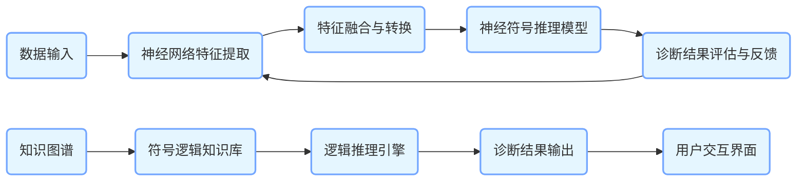

# 神经符号推理在复杂问题诊断中的优势

> 关键词：神经符号推理、复杂问题诊断、深度学习、符号逻辑、知识表达

> 摘要：本文聚焦于神经符号推理在复杂问题诊断领域的应用，深入探讨其优势。首先介绍了神经符号推理的背景知识，包括目的、预期读者和文档结构等。接着阐述了核心概念与联系，通过文本示意图和 Mermaid 流程图进行直观展示。详细讲解了核心算法原理，并给出 Python 代码示例。对相关数学模型和公式进行了推导和举例说明。通过项目实战，展示了代码实现和详细解读。分析了神经符号推理在实际应用场景中的表现，推荐了学习资源、开发工具和相关论文著作。最后总结了神经符号推理的未来发展趋势与挑战，并提供了常见问题解答和扩展阅读参考资料。

## 1. 背景介绍 
### 1.1 目的和范围
复杂问题诊断在众多领域，如医疗、工业故障排查、金融风险评估等，都具有至关重要的意义。传统的诊断方法在面对复杂、不确定和动态变化的问题时，往往表现出局限性。神经符号推理作为一种融合了神经网络的学习能力和符号逻辑的推理能力的新兴技术，为复杂问题诊断提供了新的思路和方法。本文的目的是深入分析神经符号推理在复杂问题诊断中的优势，探讨其原理、算法、应用场景等方面，为相关领域的研究和实践提供参考。

### 1.2 预期读者
本文的预期读者包括计算机科学、人工智能、自动化控制、医学、金融等领域的研究人员、工程师和技术爱好者。对于希望了解神经符号推理技术，以及探索其在复杂问题诊断中应用的读者具有一定的参考价值。

### 1.3 文档结构概述
本文将按照以下结构进行组织：首先介绍神经符号推理的背景知识，包括目的、预期读者和文档结构等；接着阐述核心概念与联系，通过文本示意图和 Mermaid 流程图进行直观展示；详细讲解核心算法原理，并给出 Python 代码示例；对相关数学模型和公式进行推导和举例说明；通过项目实战，展示代码实现和详细解读；分析神经符号推理在实际应用场景中的表现；推荐学习资源、开发工具和相关论文著作；最后总结神经符号推理的未来发展趋势与挑战，并提供常见问题解答和扩展阅读参考资料。

### 1.4 术语表
#### 1.4.1 核心术语定义
- **神经符号推理**：一种融合了神经网络的学习能力和符号逻辑的推理能力的技术，旨在结合两者的优势，实现更强大的智能推理。
- **复杂问题诊断**：对具有高度复杂性、不确定性和动态变化特征的问题进行分析、判断和解决的过程。
- **深度学习**：一类基于人工神经网络的机器学习技术，通过多层神经网络自动学习数据的特征和模式。
- **符号逻辑**：使用符号和规则进行推理和表达知识的逻辑系统，如命题逻辑、谓词逻辑等。
- **知识表达**：将现实世界中的知识以计算机可以处理的形式进行表示的方法。

#### 1.4.2 相关概念解释
- **神经网络与符号逻辑的融合**：神经网络擅长从数据中学习特征和模式，但缺乏明确的逻辑推理能力；符号逻辑则可以进行精确的推理和知识表达，但在处理不确定和复杂数据时存在困难。神经符号推理通过某种方式将两者结合起来，以充分发挥各自的优势。
- **知识图谱**：一种以图的形式表示知识的方法，节点表示实体，边表示实体之间的关系。知识图谱可以为神经符号推理提供丰富的背景知识。

#### 1.4.3 缩略词列表
- **NN**：神经网络（Neural Network）
- **DL**：深度学习（Deep Learning）
- **SL**：符号逻辑（Symbolic Logic）
- **KGE**：知识图谱嵌入（Knowledge Graph Embedding）

## 2. 核心概念与联系 
神经符号推理的核心思想是将神经网络和符号逻辑相结合，以实现更强大的智能推理能力。在复杂问题诊断中，神经网络可以用于从大量数据中学习特征和模式，而符号逻辑则可以用于对这些特征和模式进行逻辑推理和知识表达。

### 文本示意图
以下是神经符号推理在复杂问题诊断中的核心概念示意图：

```plaintext
+----------------------+          +----------------------+
|      数据输入        |          |      知识图谱        |
+----------------------+          +----------------------+
         |                                 |
         v                                 v
+----------------------+          +----------------------+
|    神经网络特征提取  |          |    符号逻辑知识库    |
+----------------------+          +----------------------+
         |                                 |
         v                                 v
+----------------------+          +----------------------+
|    特征融合与转换    |          |    逻辑推理引擎      |
+----------------------+          +----------------------+
         |                                 |
         v                                 v
+----------------------+          +----------------------+
|    神经符号推理模型  |          |    诊断结果输出      |
+----------------------+          +----------------------+
         |                                 |
         v                                 v
+----------------------+          +----------------------+
|    诊断结果评估与反馈|          |    用户交互界面      |
+----------------------+          +----------------------+
```

### Mermaid 流程图


在这个流程图中，数据输入经过神经网络进行特征提取，知识图谱中的信息被存储在符号逻辑知识库中。特征提取结果和知识库中的信息经过融合和转换后，输入到神经符号推理模型中进行推理。推理结果经过评估和反馈后，可以用于调整神经网络和符号逻辑的参数。最终的诊断结果通过用户交互界面呈现给用户。

## 3. 核心算法原理 & 具体操作步骤 
### 核心算法原理
神经符号推理的核心算法主要包括神经网络的特征提取、符号逻辑的推理和两者的融合。以下是一个简单的神经符号推理算法的步骤：

1. **数据预处理**：对输入的数据进行清洗、归一化等预处理操作，以便神经网络能够更好地处理。
2. **神经网络特征提取**：使用神经网络（如卷积神经网络、循环神经网络等）对预处理后的数据进行特征提取。
3. **符号逻辑表示**：将提取的特征转换为符号逻辑表示，例如将特征向量映射到命题逻辑或谓词逻辑中的原子命题。
4. **逻辑推理**：使用符号逻辑的推理规则（如归结原理、模态逻辑推理等）对符号逻辑表示进行推理，得到中间结果。
5. **结果融合**：将逻辑推理的结果与神经网络的输出进行融合，得到最终的诊断结果。

### Python 代码示例
以下是一个简单的 Python 代码示例，演示了如何使用神经网络进行特征提取，并将提取的特征与符号逻辑进行结合：

```python
import torch
import torch.nn as nn

# 定义一个简单的神经网络用于特征提取
class FeatureExtractor(nn.Module):
    def __init__(self, input_size, hidden_size, output_size):
        super(FeatureExtractor, self).__init__()
        self.fc1 = nn.Linear(input_size, hidden_size)
        self.relu = nn.ReLU()
        self.fc2 = nn.Linear(hidden_size, output_size)

    def forward(self, x):
        out = self.fc1(x)
        out = self.relu(out)
        out = self.fc2(out)
        return out

# 模拟数据输入
input_size = 10
hidden_size = 20
output_size = 5
batch_size = 32

# 创建特征提取器
feature_extractor = FeatureExtractor(input_size, hidden_size, output_size)

# 生成随机输入数据
input_data = torch.randn(batch_size, input_size)

# 进行特征提取
features = feature_extractor(input_data)

# 模拟符号逻辑推理
# 这里简单地将特征转换为布尔值进行逻辑推理
symbolic_features = (features > 0).float()

# 假设我们有一个简单的逻辑规则：如果第一个特征为真，则诊断结果为 1，否则为 0
diagnosis_results = (symbolic_features[:, 0] == 1).float()

print("诊断结果:", diagnosis_results)
```

### 具体操作步骤
1. **定义神经网络**：根据具体问题的需求，定义一个合适的神经网络结构，用于特征提取。
2. **训练神经网络**：使用训练数据对神经网络进行训练，以学习数据的特征和模式。
3. **符号逻辑表示**：将神经网络提取的特征转换为符号逻辑表示，可以使用映射函数或规则将特征向量映射到符号逻辑中的原子命题。
4. **逻辑推理**：使用符号逻辑的推理规则对符号逻辑表示进行推理，得到中间结果。
5. **结果融合**：将逻辑推理的结果与神经网络的输出进行融合，得到最终的诊断结果。
6. **评估和优化**：使用测试数据对诊断结果进行评估，根据评估结果对神经网络和符号逻辑的参数进行优化。

## 4. 数学模型和公式 & 详细讲解 & 举例说明 
### 神经网络特征提取
在神经符号推理中，神经网络用于从输入数据中提取特征。假设输入数据为 $\mathbf{x} \in \mathbb{R}^n$，神经网络的参数为 $\theta$，则神经网络的输出 $\mathbf{h} \in \mathbb{R}^m$ 可以表示为：

$$\mathbf{h} = f(\mathbf{x}; \theta)$$

其中 $f$ 是神经网络的映射函数，通常由多个层的线性变换和非线性激活函数组成。例如，一个简单的全连接神经网络可以表示为：

$$\mathbf{h}_1 = \sigma(\mathbf{W}_1\mathbf{x} + \mathbf{b}_1)$$
$$\mathbf{h}_2 = \sigma(\mathbf{W}_2\mathbf{h}_1 + \mathbf{b}_2)$$
$$\cdots$$
$$\mathbf{h} = \sigma(\mathbf{W}_k\mathbf{h}_{k - 1} + \mathbf{b}_k)$$

其中 $\mathbf{W}_i$ 是第 $i$ 层的权重矩阵，$\mathbf{b}_i$ 是第 $i$ 层的偏置向量，$\sigma$ 是非线性激活函数，如 ReLU 函数：

$$\sigma(x) = \max(0, x)$$

### 符号逻辑表示
将神经网络提取的特征 $\mathbf{h}$ 转换为符号逻辑表示。假设我们有一组原子命题 $\{p_1, p_2, \cdots, p_l\}$，可以通过一个映射函数 $\phi$ 将特征 $\mathbf{h}$ 映射到原子命题的真值：

$$\phi(\mathbf{h}) = [\text{truth}(p_1), \text{truth}(p_2), \cdots, \text{truth}(p_l)]$$

其中 $\text{truth}(p_i)$ 表示原子命题 $p_i$ 的真值，可以是布尔值（真或假）或概率值。

### 逻辑推理
在符号逻辑中，我们可以使用推理规则对符号逻辑表示进行推理。例如，在命题逻辑中，常用的推理规则包括假言推理（Modus Ponens）：

如果 $p$ 为真，且 $p \to q$ 为真，则 $q$ 为真。

用数学公式表示为：

$$\frac{p, p \to q}{q}$$

### 结果融合
将逻辑推理的结果与神经网络的输出进行融合。假设神经网络的输出为 $\mathbf{y}_n$，逻辑推理的结果为 $\mathbf{y}_s$，则最终的诊断结果 $\mathbf{y}$ 可以表示为：

$$\mathbf{y} = g(\mathbf{y}_n, \mathbf{y}_s)$$

其中 $g$ 是融合函数，可以是简单的加权平均：

$$\mathbf{y} = \alpha\mathbf{y}_n + (1 - \alpha)\mathbf{y}_s$$

其中 $\alpha \in [0, 1]$ 是权重系数。

### 举例说明
假设我们有一个简单的医疗诊断问题，输入数据是患者的症状特征 $\mathbf{x} = [x_1, x_2, x_3]$，分别表示发热、咳嗽和头痛的程度。我们使用一个简单的神经网络进行特征提取：

$$\mathbf{h} = \sigma(\mathbf{W}\mathbf{x} + \mathbf{b})$$

其中 $\mathbf{W}$ 是权重矩阵，$\mathbf{b}$ 是偏置向量。假设提取的特征 $\mathbf{h} = [h_1, h_2]$。

我们定义两个原子命题：$p_1$ 表示“患者可能患有流感”，$p_2$ 表示“患者需要进一步检查”。通过映射函数 $\phi$ 将特征 $\mathbf{h}$ 映射到原子命题的真值：

$$\text{truth}(p_1) = (h_1 > 0.5)$$
$$\text{truth}(p_2) = (h_2 > 0.6)$$

假设我们有一个逻辑规则：如果 $p_1$ 为真，则 $p_2$ 为真。根据假言推理规则，如果 $\text{truth}(p_1) = \text{true}$，则 $\text{truth}(p_2) = \text{true}$。

最后，我们将逻辑推理的结果与神经网络的输出进行融合，得到最终的诊断结果。

## 5. 项目实战：代码实际案例和详细解释说明 
### 5.1  开发环境搭建
为了实现神经符号推理在复杂问题诊断中的应用，我们需要搭建一个开发环境。以下是具体的步骤：

1. **安装 Python**：推荐使用 Python 3.7 及以上版本，可以从 Python 官方网站（https://www.python.org/downloads/）下载并安装。
2. **安装深度学习框架**：我们选择 PyTorch 作为深度学习框架，可以使用以下命令进行安装：
```sh
pip install torch torchvision
```
3. **安装其他必要的库**：还需要安装一些其他的库，如 NumPy、Pandas 等，可以使用以下命令进行安装：
```sh
pip install numpy pandas
```

### 5.2  源代码详细实现和代码解读
以下是一个完整的项目实战代码示例，用于演示神经符号推理在复杂问题诊断中的应用。假设我们要解决一个简单的工业故障诊断问题，输入数据是设备的传感器数据，输出是故障类型。

```python
import torch
import torch.nn as nn
import torch.optim as optim
import numpy as np
import pandas as pd

# 定义一个简单的神经网络用于特征提取
class FeatureExtractor(nn.Module):
    def __init__(self, input_size, hidden_size, output_size):
        super(FeatureExtractor, self).__init__()
        self.fc1 = nn.Linear(input_size, hidden_size)
        self.relu = nn.ReLU()
        self.fc2 = nn.Linear(hidden_size, output_size)

    def forward(self, x):
        out = self.fc1(x)
        out = self.relu(out)
        out = self.fc2(out)
        return out

# 定义符号逻辑推理函数
def symbolic_reasoning(features):
    # 假设我们有一个简单的逻辑规则：如果第一个特征大于 0.5，则故障类型为 1，否则为 0
    symbolic_features = (features > 0.5).float()
    diagnosis_results = (symbolic_features[:, 0] == 1).float()
    return diagnosis_results

# 生成模拟数据
input_size = 10
hidden_size = 20
output_size = 5
num_samples = 1000

# 生成随机输入数据
input_data = torch.randn(num_samples, input_size)

# 生成随机标签
labels = torch.randint(0, 2, (num_samples,))

# 创建特征提取器
feature_extractor = FeatureExtractor(input_size, hidden_size, output_size)

# 定义损失函数和优化器
criterion = nn.CrossEntropyLoss()
optimizer = optim.Adam(feature_extractor.parameters(), lr=0.001)

# 训练模型
num_epochs = 100
for epoch in range(num_epochs):
    # 前向传播
    features = feature_extractor(input_data)
    diagnosis_results = symbolic_reasoning(features)

    # 计算损失
    loss = criterion(diagnosis_results, labels)

    # 反向传播和优化
    optimizer.zero_grad()
    loss.backward()
    optimizer.step()

    if (epoch + 1) % 10 == 0:
        print(f'Epoch [{epoch+1}/{num_epochs}], Loss: {loss.item():.4f}')

# 测试模型
test_input_data = torch.randn(100, input_size)
test_features = feature_extractor(test_input_data)
test_diagnosis_results = symbolic_reasoning(test_features)

print("测试诊断结果:", test_diagnosis_results)
```

### 代码解读与分析
1. **特征提取器定义**：`FeatureExtractor` 类定义了一个简单的全连接神经网络，用于从输入数据中提取特征。
2. **符号逻辑推理函数**：`symbolic_reasoning` 函数实现了一个简单的符号逻辑推理规则，根据提取的特征判断故障类型。
3. **数据生成**：使用 `torch.randn` 函数生成随机输入数据和标签。
4. **模型训练**：使用交叉熵损失函数和 Adam 优化器对特征提取器进行训练。
5. **模型测试**：使用新的随机输入数据对模型进行测试，输出诊断结果。

通过这个项目实战，我们可以看到如何将神经网络的特征提取能力和符号逻辑的推理能力相结合，实现复杂问题的诊断。

## 6. 实际应用场景 
神经符号推理在复杂问题诊断中有广泛的实际应用场景，以下是一些常见的应用场景：

### 医疗诊断
在医疗领域，神经符号推理可以结合患者的临床数据（如症状、检查结果等）和医学知识图谱，进行疾病的诊断和预测。例如，通过神经网络提取患者的症状特征，然后使用符号逻辑推理规则结合医学知识进行疾病的诊断。

### 工业故障诊断
在工业生产中，设备的故障诊断是一个复杂的问题。神经符号推理可以结合设备的传感器数据和设备的知识模型，进行故障的诊断和预警。例如，通过神经网络提取设备的运行状态特征，然后使用符号逻辑推理规则判断设备是否出现故障。

### 金融风险评估
在金融领域，风险评估是一个重要的问题。神经符号推理可以结合客户的财务数据、信用记录和金融市场的知识，进行风险的评估和预测。例如，通过神经网络提取客户的财务特征，然后使用符号逻辑推理规则判断客户的信用风险。

### 智能交通系统
在智能交通系统中，交通流量预测、交通事故预警等问题都属于复杂问题诊断。神经符号推理可以结合交通传感器数据、地图信息和交通规则，进行交通状况的诊断和预测。例如，通过神经网络提取交通流量特征，然后使用符号逻辑推理规则判断是否会发生交通事故。

## 7. 工具和资源推荐
### 7.1 学习资源推荐
#### 7.1.1 书籍推荐
- 《深度学习》（Deep Learning）：由 Ian Goodfellow、Yoshua Bengio 和 Aaron Courville 编写，是深度学习领域的经典教材，涵盖了神经网络的基本原理、算法和应用。
- 《人工智能：一种现代的方法》（Artificial Intelligence: A Modern Approach）：由 Stuart Russell 和 Peter Norvig 编写，是人工智能领域的权威教材，介绍了人工智能的各个方面，包括符号逻辑推理和机器学习。
- 《神经符号人工智能：从原理到实践》（Neural-Symbolic Artificial Intelligence: Principles and Practice）：详细介绍了神经符号推理的原理、算法和应用，是学习神经符号推理的重要参考书籍。

#### 7.1.2 在线课程
- Coursera 上的“深度学习专项课程”（Deep Learning Specialization）：由 Andrew Ng 教授授课，涵盖了深度学习的基础知识和应用，是学习深度学习的优质课程。
- edX 上的“人工智能导论”（Introduction to Artificial Intelligence）：介绍了人工智能的基本概念、算法和应用，包括符号逻辑推理和机器学习。
- 哔哩哔哩上的一些关于神经符号推理的技术分享视频，这些视频通常由业内专家或研究人员制作，内容丰富且易于理解。

#### 7.1.3 技术博客和网站
- Medium 上有许多关于人工智能和神经符号推理的技术博客，作者们会分享最新的研究成果和实践经验。
- arXiv 是一个预印本数据库，提供了大量关于人工智能、机器学习和神经符号推理的最新研究论文。
- AI开源社区，如 GitHub 上的相关项目和论坛，开发者们会在这些平台上分享代码和交流技术。

### 7.2 开发工具框架推荐
#### 7.2.1 IDE和编辑器
- PyCharm：是一款专门为 Python 开发设计的集成开发环境（IDE），具有强大的代码编辑、调试和项目管理功能。
- Jupyter Notebook：是一个基于网页的交互式开发环境，适合进行数据探索、模型实验和代码演示。
- Visual Studio Code：是一款轻量级的代码编辑器，支持多种编程语言，并且有丰富的插件可以扩展功能。

#### 7.2.2 调试和性能分析工具
- PyTorch Profiler：是 PyTorch 提供的性能分析工具，可以帮助开发者分析模型的运行时间、内存使用等性能指标。
- TensorBoard：是 TensorFlow 提供的可视化工具，也可以与 PyTorch 结合使用，用于可视化模型的训练过程和性能指标。
- cProfile：是 Python 内置的性能分析工具，可以帮助开发者分析代码的运行时间和函数调用关系。

#### 7.2.3 相关框架和库
- PyTorch：是一个开源的深度学习框架，具有动态图计算、自动求导等优点，广泛应用于神经网络的开发和训练。
- TensorFlow：是另一个流行的深度学习框架，提供了丰富的工具和库，支持分布式训练和模型部署。
- NetworkX：是一个用于创建、操作和研究复杂网络的 Python 库，可以用于知识图谱的构建和分析。

### 7.3 相关论文著作推荐
#### 7.3.1 经典论文
- “Neural-Symbolic Learning and Reasoning: Contributions and Challenges”：该论文对神经符号学习和推理的发展历程、贡献和挑战进行了全面的综述。
- “Combining Neural Networks and Symbolic Reasoning for Natural Language Processing”：探讨了如何将神经网络和符号推理相结合，应用于自然语言处理任务。
- “Knowledge Graph Embedding: A Survey of Approaches and Applications”：对知识图谱嵌入技术进行了详细的综述，介绍了各种知识图谱嵌入方法和应用场景。

#### 7.3.2 最新研究成果
- 可以通过 arXiv、ACM Digital Library、IEEE Xplore 等学术数据库搜索最新的关于神经符号推理的研究论文，了解该领域的最新发展动态。

#### 7.3.3 应用案例分析
- 一些顶级学术会议（如 AAAI、IJCAI、NeurIPS 等）的论文集中会有关于神经符号推理在实际应用场景中的案例分析，可以从中学习到如何将理论方法应用于实际问题。

## 8. 总结：未来发展趋势与挑战
### 未来发展趋势
- **更深度的融合**：未来神经符号推理将朝着更深度的融合方向发展，不仅仅是简单地将神经网络和符号逻辑相结合，而是在模型结构、算法设计和训练方法等方面进行更深入的融合，以实现更强大的智能推理能力。
- **跨领域应用**：神经符号推理将在更多的领域得到应用，如生物信息学、环境科学、社会科学等。通过结合不同领域的知识和数据，解决更复杂的实际问题。
- **与知识图谱的结合**：知识图谱作为一种重要的知识表示和推理工具，将与神经符号推理更加紧密地结合。通过知识图谱提供丰富的背景知识，提高神经符号推理的准确性和可解释性。
- **可解释性增强**：随着人工智能技术的广泛应用，模型的可解释性变得越来越重要。未来神经符号推理将更加注重可解释性的研究，通过符号逻辑的推理过程，为模型的决策提供可解释的依据。

### 挑战
- **融合难度**：神经网络和符号逻辑具有不同的特点和表示方式，如何将两者进行有效的融合是一个挑战。需要解决特征表示、推理规则的学习和整合等问题。
- **数据和知识的获取**：神经符号推理需要大量的数据和知识作为支撑，如何获取高质量的数据和知识是一个挑战。同时，如何将这些数据和知识进行有效的管理和利用也是需要解决的问题。
- **计算复杂度**：神经符号推理涉及到神经网络的训练和符号逻辑的推理，计算复杂度较高。如何提高算法的效率，降低计算成本是一个挑战。
- **可解释性与性能的平衡**：在提高模型可解释性的同时，如何保证模型的性能不受影响是一个挑战。需要在可解释性和性能之间找到一个平衡点。

## 9. 附录：常见问题与解答
### 问题 1：神经符号推理与传统的机器学习方法有什么区别？
传统的机器学习方法主要基于数据驱动，通过神经网络等模型从数据中学习特征和模式，但缺乏明确的逻辑推理能力。而神经符号推理融合了神经网络的学习能力和符号逻辑的推理能力，不仅可以从数据中学习，还可以进行逻辑推理和知识表达，具有更强的可解释性和推理能力。

### 问题 2：神经符号推理需要多少数据进行训练？
神经符号推理所需的数据量取决于具体的问题和模型的复杂度。一般来说，与传统的机器学习方法类似，需要足够的数据来训练神经网络，以学习数据的特征和模式。同时，还需要一定的知识图谱或规则来支持符号逻辑的推理。

### 问题 3：如何评估神经符号推理模型的性能？
可以使用传统的机器学习评估指标，如准确率、召回率、F1 值等，来评估神经符号推理模型的性能。此外，还可以考虑模型的可解释性、推理效率等方面的指标。

### 问题 4：神经符号推理在实际应用中存在哪些限制？
神经符号推理在实际应用中存在一些限制，如融合难度、数据和知识的获取、计算复杂度等。此外，模型的可解释性和性能之间的平衡也是一个需要解决的问题。

## 10. 扩展阅读 & 参考资料
### 扩展阅读
- 关于深度学习和神经网络的更多知识，可以阅读《动手学深度学习》（Dive into Deep Learning）等书籍。
- 对于符号逻辑和知识表示的深入学习，可以参考《数理逻辑》（Mathematical Logic）等教材。
- 了解知识图谱的相关内容，可以阅读《知识图谱：方法、实践与应用》等书籍。

### 参考资料
- Goodfellow, I., Bengio, Y., & Courville, A. (2016). Deep Learning. MIT Press.
- Russell, S. J., & Norvig, P. (2020). Artificial Intelligence: A Modern Approach. Pearson.
- Hitzler, P., Seda, A. K., & Zhang, Y. (2020). Neural-Symbolic Artificial Intelligence: Principles and Practice. Morgan & Claypool Publishers.

作者：AI天才研究院/AI Genius Institute & 禅与计算机程序设计艺术 /Zen And The Art of Computer Programming