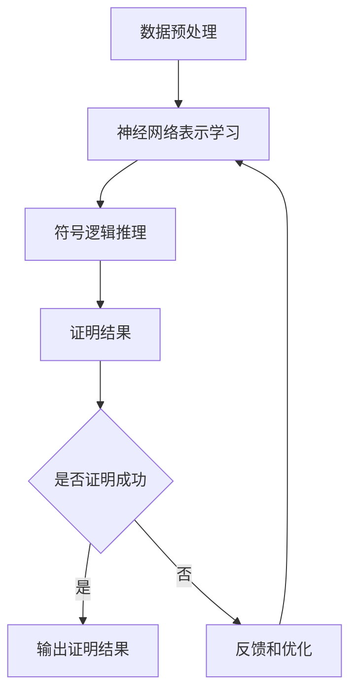

# 神经符号推理在自动定理证明中的应用

> 关键词：神经符号推理、自动定理证明、深度学习、符号逻辑、人工智能

> 摘要：本文深入探讨了神经符号推理在自动定理证明中的应用。首先介绍了相关背景知识，包括目的、预期读者等。接着阐述了神经符号推理和自动定理证明的核心概念及联系，详细讲解了核心算法原理并给出 Python 代码示例，同时分析了相关的数学模型和公式。通过项目实战展示了具体的代码实现和解读。之后探讨了其实际应用场景，推荐了学习所需的工具和资源，包括书籍、在线课程等。最后总结了未来发展趋势与挑战，解答了常见问题并列出了参考资料，旨在为读者全面呈现神经符号推理在自动定理证明领域的应用全貌。

## 1. 背景介绍 
### 1.1 目的和范围
自动定理证明是计算机科学中的一个重要领域，旨在让计算机自动证明数学定理或逻辑命题。传统的自动定理证明方法主要基于符号逻辑和规则推理，虽然在某些领域取得了显著成果，但在处理复杂问题时面临着效率低下、搜索空间爆炸等挑战。神经符号推理结合了神经网络的强大学习能力和符号逻辑的精确推理能力，为自动定理证明带来了新的思路和方法。本文的目的是全面介绍神经符号推理在自动定理证明中的应用，包括其核心概念、算法原理、实际应用场景等，同时提供相关的代码示例和工具资源推荐，帮助读者深入理解和掌握这一领域的知识和技术。

### 1.2 预期读者
本文适合对人工智能、自动定理证明、神经符号推理等领域感兴趣的研究人员、开发者和学生阅读。读者需要具备一定的数学基础，包括线性代数、概率论等，以及基本的编程知识，如 Python 编程语言。

### 1.3 文档结构概述
本文将按照以下结构进行组织：
1. 背景介绍：介绍本文的目的、预期读者和文档结构。
2. 核心概念与联系：阐述神经符号推理和自动定理证明的核心概念，以及它们之间的联系。
3. 核心算法原理 & 具体操作步骤：详细讲解神经符号推理在自动定理证明中的核心算法原理，并给出具体的操作步骤和 Python 代码示例。
4. 数学模型和公式 & 详细讲解 & 举例说明：分析神经符号推理在自动定理证明中的数学模型和公式，并通过具体的例子进行说明。
5. 项目实战：代码实际案例和详细解释说明：通过一个具体的项目实战，展示神经符号推理在自动定理证明中的应用，包括开发环境搭建、源代码实现和代码解读。
6. 实际应用场景：探讨神经符号推理在自动定理证明中的实际应用场景。
7. 工具和资源推荐：推荐学习神经符号推理和自动定理证明所需的工具和资源，包括书籍、在线课程、技术博客和网站等。
8. 总结：未来发展趋势与挑战：总结神经符号推理在自动定理证明中的发展趋势和面临的挑战。
9. 附录：常见问题与解答：解答读者在学习和应用过程中常见的问题。
10. 扩展阅读 & 参考资料：提供相关的扩展阅读材料和参考资料。

### 1.4 术语表
#### 1.4.1 核心术语定义
- **神经符号推理（Neural-Symbolic Reasoning）**：结合神经网络的学习能力和符号逻辑的推理能力，实现对复杂问题的有效处理和推理。
- **自动定理证明（Automated Theorem Proving）**：利用计算机程序自动证明数学定理或逻辑命题的过程。
- **神经网络（Neural Network）**：一种模仿人类神经系统的计算模型，由大量的神经元组成，能够自动学习数据中的模式和规律。
- **符号逻辑（Symbolic Logic）**：用符号和规则来表示和推理逻辑关系的方法。

#### 1.4.2 相关概念解释
- **深度学习（Deep Learning）**：神经网络的一个分支，通过多层神经元的组合，能够学习到数据的深层次特征和表示。
- **知识图谱（Knowledge Graph）**：一种以图的形式表示知识的方法，由实体和关系组成，能够方便地进行知识的存储和查询。
- **强化学习（Reinforcement Learning）**：一种机器学习方法，通过智能体与环境的交互，不断尝试不同的动作，以获得最大的累积奖励。

#### 1.4.3 缩略词列表
- **MLP**：多层感知机（Multilayer Perceptron）
- **LSTM**：长短期记忆网络（Long Short-Term Memory）
- **CNN**：卷积神经网络（Convolutional Neural Network）
- **RNN**：循环神经网络（Recurrent Neural Network）

## 2. 核心概念与联系 
### 2.1 神经符号推理的原理
神经符号推理的核心思想是将神经网络和符号逻辑相结合，充分发挥两者的优势。神经网络具有强大的学习能力，能够从大量的数据中自动学习到模式和规律；而符号逻辑则具有精确的推理能力，能够根据规则和事实进行严谨的推理。在神经符号推理中，神经网络通常用于对数据进行特征提取和表示学习，将输入数据转换为适合符号逻辑处理的形式；符号逻辑则用于对这些表示进行推理和决策，得出最终的结论。

### 2.2 自动定理证明的原理
自动定理证明的目标是通过计算机程序自动证明数学定理或逻辑命题。传统的自动定理证明方法主要基于符号逻辑，通过对命题进行形式化表示，然后运用推理规则进行推导，直到得出证明结果。常见的自动定理证明方法包括归结法、自然演绎法等。随着人工智能技术的发展，基于机器学习和深度学习的自动定理证明方法也逐渐兴起，这些方法通过学习大量的证明实例，自动发现证明的模式和规律，从而提高证明的效率和成功率。

### 2.3 神经符号推理与自动定理证明的联系
神经符号推理为自动定理证明带来了新的思路和方法。一方面，神经网络可以用于对定理和证明进行表示学习，将定理和证明转换为低维向量表示，从而减少搜索空间，提高证明效率；另一方面，符号逻辑可以用于对神经网络学习到的表示进行推理和验证，确保证明的正确性和严谨性。通过将神经符号推理应用于自动定理证明，可以充分发挥两者的优势，提高自动定理证明的性能和能力。

### 2.4 核心概念原理和架构的文本示意图
神经符号推理在自动定理证明中的应用架构可以分为以下几个部分：
1. **数据预处理**：将定理和证明文本进行预处理，包括分词、词性标注、命名实体识别等，将其转换为适合神经网络处理的形式。
2. **神经网络表示学习**：使用神经网络对预处理后的数据进行表示学习，将定理和证明转换为低维向量表示。
3. **符号逻辑推理**：使用符号逻辑对神经网络学习到的表示进行推理和验证，得出证明结果。
4. **反馈和优化**：根据证明结果对神经网络和符号逻辑推理进行反馈和优化，提高证明的准确性和效率。

### 2.5 Mermaid 流程图


## 3. 核心算法原理 & 具体操作步骤 
### 3.1 核心算法原理
神经符号推理在自动定理证明中的核心算法主要包括以下几个步骤：
1. **数据表示**：将定理和证明文本转换为适合神经网络处理的形式，通常使用词向量表示。
2. **神经网络学习**：使用神经网络对数据进行学习，提取定理和证明的特征表示。
3. **符号逻辑推理**：使用符号逻辑对神经网络学习到的特征表示进行推理，得出证明结果。
4. **反馈和优化**：根据证明结果对神经网络和符号逻辑推理进行反馈和优化，提高证明的准确性和效率。

### 3.2 具体操作步骤
#### 3.2.1 数据准备
首先，需要收集和整理用于训练和测试的定理和证明数据。这些数据可以来自数学教材、学术论文、在线定理证明库等。然后，对数据进行预处理，包括分词、词性标注、命名实体识别等，将其转换为适合神经网络处理的形式。

#### 3.2.2 词向量表示
使用词向量模型（如 Word2Vec、GloVe 等）将定理和证明文本中的每个词转换为低维向量表示。这样可以将文本数据转换为数值数据，便于神经网络进行处理。

#### 3.2.3 神经网络模型构建
选择合适的神经网络模型（如 MLP、LSTM、CNN 等）对数据进行学习。在训练过程中，使用监督学习或强化学习的方法，让神经网络学习到定理和证明之间的关系。

#### 3.2.4 符号逻辑推理
使用符号逻辑推理工具（如 Prolog、Z3 等）对神经网络学习到的特征表示进行推理。符号逻辑推理工具可以根据规则和事实进行严谨的推理，得出证明结果。

#### 3.2.5 反馈和优化
根据证明结果对神经网络和符号逻辑推理进行反馈和优化。如果证明成功，则可以将该证明实例加入到训练数据中，进一步提高神经网络的学习能力；如果证明失败，则需要分析失败的原因，调整神经网络的参数或符号逻辑推理的规则，重新进行证明。

### 3.3 Python 源代码示例
```python
import numpy as np
import tensorflow as tf
from tensorflow.keras.models import Sequential
from tensorflow.keras.layers import Dense, LSTM

# 数据准备
# 假设我们有一些定理和证明的文本数据
theorems = ["定理1：若 a > b 且 b > c，则 a > c", "定理2：三角形内角和为 180 度"]
proofs = ["证明1：因为 a > b 且 b > c，根据传递性可得 a > c", "证明2：通过作辅助线将三角形转化为平角，可得三角形内角和为 180 度"]

# 词向量表示
# 这里使用简单的词索引表示，实际应用中可以使用 Word2Vec 等工具
vocab = set()
for theorem in theorems:
    for word in theorem.split():
        vocab.add(word)
for proof in proofs:
    for word in proof.split():
        vocab.add(word)
word2idx = {word: idx for idx, word in enumerate(vocab)}

# 将文本转换为词索引序列
theorem_sequences = []
for theorem in theorems:
    sequence = [word2idx[word] for word in theorem.split()]
    theorem_sequences.append(sequence)

proof_sequences = []
for proof in proofs:
    sequence = [word2idx[word] for word in proof.split()]
    proof_sequences.append(sequence)

# 构建神经网络模型
model = Sequential()
model.add(LSTM(128, input_shape=(None, len(vocab))))
model.add(Dense(len(vocab), activation='softmax'))

model.compile(loss='categorical_crossentropy', optimizer='adam', metrics=['accuracy'])

# 训练模型
# 这里简单假设输入是定理序列，输出是证明序列
# 实际应用中需要更复杂的处理
X = np.array(theorem_sequences)
y = np.array(proof_sequences)
model.fit(X, y, epochs=10, batch_size=1)

# 进行推理
# 输入一个新的定理，预测其证明
new_theorem = "定理3：若 x > 0 且 y > 0，则 x + y > 0"
new_sequence = [word2idx[word] for word in new_theorem.split()]
new_sequence = np.array([new_sequence])
prediction = model.predict(new_sequence)
print("预测的证明：", prediction)
```

## 4. 数学模型和公式 & 详细讲解 & 举例说明 
### 4.1 神经网络的数学模型
神经网络是一种基于神经元的计算模型，其基本单元是神经元。神经元接收输入信号，经过加权求和和非线性变换后，输出一个信号。神经网络通常由多个神经元组成，形成不同的层，包括输入层、隐藏层和输出层。

#### 4.1.1 神经元的数学模型
神经元的数学模型可以表示为：
$$
y = f(\sum_{i=1}^{n} w_i x_i + b)
$$
其中，$x_i$ 是输入信号，$w_i$ 是对应的权重，$b$ 是偏置，$f$ 是激活函数。

#### 4.1.2 多层感知机（MLP）的数学模型
多层感知机是一种最基本的神经网络模型，由输入层、多个隐藏层和输出层组成。其数学模型可以表示为：
$$
h^{(l)} = f(W^{(l)} h^{(l-1)} + b^{(l)})
$$
其中，$h^{(l)}$ 是第 $l$ 层的输出，$W^{(l)}$ 是第 $l$ 层的权重矩阵，$b^{(l)}$ 是第 $l$ 层的偏置向量，$f$ 是激活函数。

### 4.2 符号逻辑的数学模型
符号逻辑是用符号和规则来表示和推理逻辑关系的方法。常见的符号逻辑包括命题逻辑和一阶逻辑。

#### 4.2.1 命题逻辑的数学模型
命题逻辑是研究命题之间逻辑关系的逻辑系统。命题是一个可以判断真假的陈述句。命题逻辑的基本符号包括命题变量、逻辑连接词（如 $\neg$、$\wedge$、$\vee$、$\rightarrow$ 等）。命题逻辑的公式可以通过递归定义得到。例如，命题变量是公式，若 $A$ 和 $B$ 是公式，则 $\neg A$、$A \wedge B$、$A \vee B$、$A \rightarrow B$ 也是公式。

#### 4.2.2 一阶逻辑的数学模型
一阶逻辑是在命题逻辑的基础上，引入了量词（如 $\forall$、$\exists$）和谓词的逻辑系统。一阶逻辑的公式可以表示更复杂的逻辑关系。例如，$\forall x (P(x) \rightarrow Q(x))$ 表示对于所有的 $x$，如果 $x$ 满足 $P$ 则 $x$ 满足 $Q$。

### 4.3 神经符号推理的数学模型
神经符号推理的数学模型可以看作是神经网络和符号逻辑的结合。在神经符号推理中，神经网络用于对数据进行特征提取和表示学习，将输入数据转换为适合符号逻辑处理的形式；符号逻辑则用于对这些表示进行推理和决策，得出最终的结论。

#### 4.3.1 神经网络表示学习的数学模型
假设输入数据为 $x$，神经网络的输出为 $h$，则神经网络表示学习的数学模型可以表示为：
$$
h = f_{\theta}(x)
$$
其中，$f_{\theta}$ 是神经网络的映射函数，$\theta$ 是神经网络的参数。

#### 4.3.2 符号逻辑推理的数学模型
假设神经网络的输出 $h$ 经过符号逻辑推理后得到的结果为 $y$，则符号逻辑推理的数学模型可以表示为：
$$
y = g(h)
$$
其中，$g$ 是符号逻辑推理的函数。

### 4.4 举例说明
假设我们要证明命题：“若 $a > b$ 且 $b > c$，则 $a > c$”。

#### 4.4.1 数据表示
将命题转换为词向量表示，例如：
$a$ -> $[0.1, 0.2, 0.3]$
$b$ -> $[0.4, 0.5, 0.6]$
$c$ -> $[0.7, 0.8, 0.9]$
$>$ -> $[0.2, 0.3, 0.4]$
且 -> $[0.5, 0.6, 0.7]$
则命题“若 $a > b$ 且 $b > c$，则 $a > c$”可以表示为一个向量序列。

#### 4.4.2 神经网络学习
使用神经网络对向量序列进行学习，提取命题的特征表示。假设神经网络的输出为 $h$。

#### 4.4.3 符号逻辑推理
使用符号逻辑推理工具对 $h$ 进行推理。根据传递性规则，如果 $a > b$ 且 $b > c$，则可以推出 $a > c$。通过符号逻辑推理，得出证明结果。

## 5. 项目实战：代码实际案例和详细解释说明 
### 5.1  开发环境搭建
#### 5.1.1 安装 Python
首先，需要安装 Python 编程语言。建议使用 Python 3.6 及以上版本。可以从 Python 官方网站（https://www.python.org/downloads/）下载并安装。

#### 5.1.2 安装必要的库
在项目中，需要使用一些 Python 库，如 TensorFlow、NumPy 等。可以使用以下命令进行安装：
```sh
pip install tensorflow numpy
```

### 5.2  源代码详细实现和代码解读
```python
import numpy as np
import tensorflow as tf
from tensorflow.keras.models import Sequential
from tensorflow.keras.layers import Dense, LSTM

# 数据准备
# 这里简单假设我们有一些定理和证明的文本数据
theorems = ["若 a > b 且 b > c，则 a > c", "三角形内角和为 180 度"]
proofs = ["因为 a > b 且 b > c，根据传递性可得 a > c", "通过作辅助线将三角形转化为平角，可得三角形内角和为 180 度"]

# 词向量表示
# 构建词汇表
vocab = set()
for theorem in theorems:
    for word in theorem.split():
        vocab.add(word)
for proof in proofs:
    for word in proof.split():
        vocab.add(word)
word2idx = {word: idx for idx, word in enumerate(vocab)}

# 将文本转换为词索引序列
def text_to_sequence(text):
    sequence = [word2idx[word] for word in text.split()]
    return sequence

theorem_sequences = [text_to_sequence(theorem) for theorem in theorems]
proof_sequences = [text_to_sequence(proof) for proof in proofs]

# 构建神经网络模型
model = Sequential()
model.add(LSTM(128, input_shape=(None, len(vocab))))
model.add(Dense(len(vocab), activation='softmax'))

model.compile(loss='categorical_crossentropy', optimizer='adam', metrics=['accuracy'])

# 数据处理
# 对序列进行填充，使其长度一致
max_length = max(max(len(seq) for seq in theorem_sequences), max(len(seq) for seq in proof_sequences))
theorem_sequences = tf.keras.preprocessing.sequence.pad_sequences(theorem_sequences, maxlen=max_length)
proof_sequences = tf.keras.preprocessing.sequence.pad_sequences(proof_sequences, maxlen=max_length)

# 训练模型
X = np.array(theorem_sequences)
y = np.array(proof_sequences)
model.fit(X, y, epochs=10, batch_size=1)

# 进行推理
new_theorem = "若 x > 0 且 y > 0，则 x + y > 0"
new_sequence = text_to_sequence(new_theorem)
new_sequence = tf.keras.preprocessing.sequence.pad_sequences([new_sequence], maxlen=max_length)
prediction = model.predict(new_sequence)
predicted_indices = np.argmax(prediction, axis=-1)
predicted_proof = [list(word2idx.keys())[idx] for idx in predicted_indices[0]]
print("预测的证明：", " ".join(predicted_proof))
```

### 5.3  代码解读与分析
#### 5.3.1 数据准备
首先，我们定义了一些定理和证明的文本数据。然后，构建了一个词汇表，将每个词映射到一个唯一的索引。接着，将定理和证明文本转换为词索引序列。

#### 5.3.2 神经网络模型构建
我们使用 Keras 构建了一个简单的 LSTM 模型。LSTM 模型可以处理序列数据，适合用于处理文本数据。模型的输入是定理的词索引序列，输出是证明的词索引序列。

#### 5.3.3 数据处理
为了使所有序列的长度一致，我们使用 `pad_sequences` 函数对序列进行填充。

#### 5.3.4 模型训练
使用 `fit` 函数对模型进行训练，指定训练数据、训练轮数和批量大小。

#### 5.3.5 推理
输入一个新的定理，将其转换为词索引序列并进行填充，然后使用训练好的模型进行预测。最后，将预测结果转换为文本形式输出。

## 6. 实际应用场景 
### 6.1 数学定理证明
神经符号推理在数学定理证明中具有重要的应用价值。传统的自动定理证明方法在处理复杂的数学定理时往往效率低下，而神经符号推理可以通过学习大量的证明实例，自动发现证明的模式和规律，从而提高证明的效率和成功率。例如，在几何定理证明、代数定理证明等领域，神经符号推理可以帮助数学家更快地找到证明思路，减少人工证明的工作量。

### 6.2 软件验证
在软件开发过程中，需要对软件的正确性进行验证。传统的软件验证方法主要基于形式化方法，需要手动编写复杂的验证规则和证明过程。神经符号推理可以通过学习软件的行为模式和验证规则，自动生成验证证明，从而提高软件验证的效率和准确性。例如，在操作系统、编译器、网络协议等领域，神经符号推理可以帮助开发人员更快地发现软件中的漏洞和错误，提高软件的可靠性和安全性。

### 6.3 智能教育
在智能教育领域，神经符号推理可以用于辅助学生进行定理证明和逻辑推理。通过构建智能辅导系统，利用神经符号推理技术对学生的证明过程进行分析和指导，帮助学生更好地理解和掌握定理证明的方法和技巧。例如，在数学教育、逻辑教育等领域，神经符号推理可以为学生提供个性化的学习方案，提高学习效果。

### 6.4 知识图谱推理
知识图谱是一种以图的形式表示知识的方法，由实体和关系组成。神经符号推理可以用于知识图谱的推理和补全。通过学习知识图谱中的实体和关系，利用神经符号推理技术对知识图谱进行推理，发现新的知识和关系，从而完善知识图谱。例如，在语义网、搜索引擎等领域，神经符号推理可以帮助用户更好地理解和利用知识图谱中的信息。

## 7. 工具和资源推荐
### 7.1 学习资源推荐
#### 7.1.1 书籍推荐
- 《人工智能：一种现代的方法》（Artificial Intelligence: A Modern Approach）：这是一本经典的人工智能教材，涵盖了人工智能的各个领域，包括自动定理证明、神经符号推理等。
- 《深度学习》（Deep Learning）：这本书详细介绍了深度学习的基本原理和方法，对于理解神经网络在神经符号推理中的应用有很大帮助。
- 《符号逻辑与机械定理证明》（Symbolic Logic and Mechanical Theorem Proving）：这本书专门介绍了符号逻辑和自动定理证明的相关知识和技术。

#### 7.1.2 在线课程
- Coursera 上的 “人工智能基础”（Foundations of Artificial Intelligence）：该课程由斯坦福大学的教授授课，涵盖了人工智能的基本概念和方法，包括自动定理证明和神经符号推理。
- edX 上的 “深度学习”（Deep Learning）：这是一门由吴恩达教授授课的深度学习课程，详细介绍了深度学习的原理和应用。
- 中国大学 MOOC 上的 “人工智能”：该课程由国内多所高校的教授联合授课，内容丰富，适合初学者学习。

#### 7.1.3 技术博客和网站
- arXiv.org：这是一个预印本平台，提供了大量的人工智能、机器学习等领域的研究论文，包括神经符号推理和自动定理证明的最新研究成果。
- Medium 上的人工智能相关博客：Medium 上有很多人工智能领域的博主，他们会分享自己的研究成果和实践经验，对于学习神经符号推理和自动定理证明很有帮助。
- 机器之心：这是一个专注于人工智能技术的媒体平台，提供了大量的人工智能领域的新闻、技术文章和研究报告。

### 7.2 开发工具框架推荐
#### 7.2.1 IDE和编辑器
- PyCharm：这是一款专门为 Python 开发设计的集成开发环境（IDE），提供了丰富的功能和插件，适合开发神经符号推理和自动定理证明相关的项目。
- Jupyter Notebook：这是一个交互式的开发环境，适合进行数据分析、模型训练和实验验证。可以方便地展示代码和结果，对于学习和研究非常有帮助。
- Visual Studio Code：这是一款轻量级的代码编辑器，支持多种编程语言和插件，具有良好的扩展性和用户体验。

#### 7.2.2 调试和性能分析工具
- TensorBoard：这是 TensorFlow 提供的一个可视化工具，可以用于监控模型的训练过程、分析模型的性能和结构。
- Py-Spy：这是一个 Python 性能分析工具，可以用于分析 Python 代码的性能瓶颈，找出代码中运行缓慢的部分。
- PDB：这是 Python 自带的调试工具，可以用于调试 Python 代码，帮助开发者找出代码中的错误和问题。

#### 7.2.3 相关框架和库
- TensorFlow：这是一个开源的深度学习框架，提供了丰富的神经网络模型和工具，适合开发神经符号推理相关的项目。
- PyTorch：这是另一个流行的深度学习框架，具有动态图和易于使用的特点，适合进行研究和实验。
- Prolog：这是一种基于逻辑编程的编程语言，适合进行符号逻辑推理。可以使用 Prolog 实现自动定理证明中的符号逻辑推理部分。
- Z3：这是一个开源的定理证明器，支持多种逻辑和理论，可以用于自动定理证明和软件验证。

### 7.3 相关论文著作推荐
#### 7.3.1 经典论文
- "Neural Theorem Provers"：这篇论文介绍了一种基于神经网络的定理证明方法，通过学习证明的模式和规律，实现自动定理证明。
- "DeepProbLog: Neural Probabilistic Logic Programming"：这篇论文提出了一种将深度学习和概率逻辑编程相结合的方法，用于处理不确定的知识和推理。
- "Symbolic Knowledge Distillation: from General Language Models to Commonsense Models"：这篇论文探讨了如何从通用语言模型中提取符号知识，用于常识推理和自动定理证明。

#### 7.3.2 最新研究成果
可以关注 arXiv.org 上的最新研究论文，了解神经符号推理和自动定理证明领域的最新进展。此外，还可以关注人工智能领域的顶级会议，如 NeurIPS、ICML、AAAI 等，这些会议上会发表很多相关的研究成果。

#### 7.3.3 应用案例分析
可以阅读一些相关的应用案例分析文章，了解神经符号推理在实际应用中的具体实现和效果。例如，一些关于软件验证、智能教育等领域的案例分析文章，可以帮助我们更好地理解神经符号推理的应用场景和优势。

## 8. 总结：未来发展趋势与挑战
### 8.1 未来发展趋势
#### 8.1.1 更强的学习能力
未来的神经符号推理系统将具有更强的学习能力，能够从更多的数据中学习到更复杂的模式和规律，从而提高自动定理证明的效率和成功率。

#### 8.1.2 更好的可解释性
目前，神经网络的可解释性是一个挑战。未来的神经符号推理系统将更加注重可解释性，能够提供清晰的推理过程和解释，让用户更好地理解证明的结果。

#### 8.1.3 与其他技术的融合
神经符号推理将与其他技术，如知识图谱、强化学习等进行更深入的融合，实现更强大的推理和决策能力。

#### 8.1.4 广泛的应用领域
随着技术的不断发展，神经符号推理将在更多的领域得到应用，如医疗诊断、金融风险评估等。

### 8.2 面临的挑战
#### 8.2.1 数据获取和标注
神经符号推理需要大量的训练数据，而获取和标注这些数据是一个挑战。特别是在自动定理证明领域，高质量的证明数据相对较少，需要花费大量的时间和精力进行收集和整理。

#### 8.2.2 模型复杂度和计算资源
神经符号推理系统通常具有较高的模型复杂度，需要大量的计算资源进行训练和推理。如何在有限的计算资源下提高系统的性能是一个需要解决的问题。

#### 8.2.3 符号逻辑和神经网络的融合
符号逻辑和神经网络的融合是神经符号推理的核心问题，但目前还没有一种完美的融合方法。如何将两者的优势充分发挥出来，同时避免各自的缺点，是一个需要深入研究的问题。

#### 8.2.4 可解释性和可靠性
神经网络的黑盒性质使得其推理过程难以解释，而自动定理证明需要保证证明的可靠性和可解释性。如何提高神经符号推理系统的可解释性和可靠性是一个重要的挑战。

## 9. 附录：常见问题与解答
### 9.1 什么是神经符号推理？
神经符号推理是将神经网络的学习能力和符号逻辑的推理能力相结合的一种方法，旨在充分发挥两者的优势，实现对复杂问题的有效处理和推理。

### 9.2 神经符号推理在自动定理证明中有什么优势？
神经符号推理可以利用神经网络的学习能力，从大量的证明实例中自动发现证明的模式和规律，从而提高证明的效率和成功率。同时，符号逻辑可以保证证明的严谨性和正确性。

### 9.3 如何选择合适的神经网络模型用于自动定理证明？
选择合适的神经网络模型需要考虑问题的特点和数据的类型。对于序列数据，可以选择 LSTM、GRU 等模型；对于图像数据，可以选择 CNN 模型。此外，还可以根据模型的复杂度、训练时间和性能等因素进行综合考虑。

### 9.4 如何处理自动定理证明中的不确定性？
可以使用概率逻辑和贝叶斯推理等方法来处理自动定理证明中的不确定性。例如，在 DeepProbLog 中，将深度学习和概率逻辑编程相结合，用于处理不确定的知识和推理。

### 9.5 神经符号推理的可解释性如何提高？
可以采用一些方法来提高神经符号推理的可解释性，如可视化推理过程、生成解释文本等。此外，还可以使用可解释的神经网络模型，如决策树、规则网络等。

## 10. 扩展阅读 & 参考资料
### 10.1 扩展阅读
- 《人工智能中的逻辑》（Logic in Artificial Intelligence）：这本书深入介绍了逻辑在人工智能中的应用，包括自动定理证明、知识表示等方面。
- 《机器学习》（Machine Learning）：这本书系统地介绍了机器学习的基本概念、方法和算法，对于理解神经网络在神经符号推理中的应用有很大帮助。
- 《计算机科学中的逻辑基础》（Foundations of Logic in Computer Science）：这本书介绍了计算机科学中的逻辑基础，包括命题逻辑、一阶逻辑等，对于理解自动定理证明的原理和方法很有帮助。

### 10.2 参考资料
- 相关的学术论文和研究报告，可以从 arXiv.org、ACM Digital Library、IEEE Xplore 等学术数据库中获取。
- 开源项目和代码库，如 GitHub 上的相关项目，可以参考和学习他人的实现和经验。
- 官方文档和教程，如 TensorFlow、PyTorch 等框架的官方文档和教程，可以帮助我们更好地使用这些工具和框架。

作者：AI天才研究院/AI Genius Institute & 禅与计算机程序设计艺术 /Zen And The Art of Computer Programming