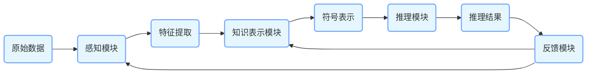

# 神经符号推理系统的设计与实现

> 关键词：神经符号推理系统、神经网络、符号推理、知识表示、算法原理

> 摘要：本文深入探讨了神经符号推理系统的设计与实现。首先介绍了神经符号推理系统的背景，包括其目的、预期读者、文档结构和相关术语。接着阐述了核心概念与联系，通过文本示意图和 Mermaid 流程图展示其架构。详细讲解了核心算法原理，并使用 Python 源代码进行说明。同时给出了数学模型和公式，并举例说明。通过项目实战，展示了代码实际案例及详细解释。分析了实际应用场景，推荐了学习资源、开发工具框架和相关论文著作。最后总结了未来发展趋势与挑战，并提供了常见问题与解答和扩展阅读参考资料。

## 1. 背景介绍 
### 1.1 目的和范围
神经符号推理系统旨在结合神经网络的强大感知能力和符号推理的逻辑表达与推理能力，实现更智能、更灵活的推理和决策。本文章的范围涵盖了神经符号推理系统从概念理解、算法设计到实际实现的全过程，包括核心概念的阐述、算法原理的分析、项目实战的演示以及实际应用场景的探讨等。

### 1.2 预期读者
本文预期读者包括对人工智能、机器学习、知识表示与推理等领域感兴趣的研究人员、开发者和学生。对于希望深入了解神经符号推理系统的工作原理、设计方法和实现技巧的人群具有较高的参考价值。

### 1.3 文档结构概述
本文首先介绍神经符号推理系统的背景知识，包括目的、读者和文档结构等。然后详细阐述核心概念与联系，通过示意图和流程图展示系统架构。接着讲解核心算法原理，并使用 Python 代码进行实现。之后给出数学模型和公式，并举例说明。通过项目实战展示代码案例和详细解释。分析实际应用场景，推荐相关学习资源、开发工具框架和论文著作。最后总结未来发展趋势与挑战，提供常见问题解答和扩展阅读参考资料。

### 1.4 术语表
#### 1.4.1 核心术语定义
- **神经网络（Neural Network）**：一种模仿人类神经系统的计算模型，由大量的神经元组成，通过对数据的学习来自动提取特征和模式。
- **符号推理（Symbolic Reasoning）**：基于符号和逻辑规则进行推理和决策的方法，能够对知识进行明确的表示和精确的推理。
- **神经符号推理系统（Neural-Symbolic Reasoning System）**：结合了神经网络和符号推理的优势，能够处理不确定的感知信息并进行逻辑推理的系统。
- **知识表示（Knowledge Representation）**：将知识以某种形式表示出来，以便计算机能够理解和处理的方法。

#### 1.4.2 相关概念解释
- **深度学习（Deep Learning）**：神经网络的一个分支，通过多层神经网络对数据进行深度特征学习，在图像识别、语音识别等领域取得了显著的成果。
- **逻辑编程（Logic Programming）**：一种基于逻辑规则进行编程的方法，通过定义事实和规则来进行推理和求解问题。
- **知识图谱（Knowledge Graph）**：一种以图的形式表示知识的方法，通过节点和边来表示实体和实体之间的关系。

#### 1.4.3 缩略词列表
- **MLP（Multi-Layer Perceptron）**：多层感知机，一种常见的神经网络模型。
- **FOL（First-Order Logic）**：一阶逻辑，一种常用的符号逻辑系统。
- **CNN（Convolutional Neural Network）**：卷积神经网络，常用于图像和视频处理。

## 2. 核心概念与联系 
神经符号推理系统的核心在于将神经网络和符号推理相结合。神经网络擅长处理感知数据，如图像、语音等，能够自动提取数据中的特征和模式。而符号推理则能够对知识进行明确的表示和逻辑推理，处理复杂的语义信息。

### 文本示意图
神经符号推理系统主要由以下几个部分组成：
- **感知模块**：通常由神经网络实现，负责对原始数据进行感知和特征提取。例如，使用卷积神经网络对图像进行分类，提取图像的特征。
- **知识表示模块**：将知识以符号的形式表示出来，如使用一阶逻辑、知识图谱等。知识表示模块可以将感知模块提取的特征转化为符号表示，以便进行逻辑推理。
- **推理模块**：基于符号推理规则进行推理和决策。推理模块可以根据知识表示模块提供的符号知识和规则，进行逻辑推理，得出结论。
- **反馈模块**：将推理结果反馈给感知模块和知识表示模块，进行模型的调整和优化。反馈模块可以根据推理结果的准确性，调整神经网络的参数和知识表示的方式。

### Mermaid 流程图


在这个流程图中，原始数据首先经过感知模块进行特征提取，然后将提取的特征转化为符号表示，进入推理模块进行推理。推理结果经过反馈模块，对感知模块和知识表示模块进行调整和优化。

## 3. 核心算法原理 & 具体操作步骤 
### 核心算法原理
神经符号推理系统的核心算法主要包括神经网络的训练算法和符号推理的算法。

#### 神经网络训练算法
常见的神经网络训练算法是反向传播算法（Backpropagation）。反向传播算法通过计算损失函数对神经网络参数的梯度，然后使用梯度下降法更新参数，使得损失函数最小化。

以下是一个简单的多层感知机（MLP）的 Python 实现，使用 PyTorch 库：
```python
import torch
import torch.nn as nn
import torch.optim as optim

# 定义一个简单的 MLP 模型
class MLP(nn.Module):
    def __init__(self, input_size, hidden_size, output_size):
        super(MLP, self).__init__()
        self.fc1 = nn.Linear(input_size, hidden_size)
        self.relu = nn.ReLU()
        self.fc2 = nn.Linear(hidden_size, output_size)

    def forward(self, x):
        out = self.fc1(x)
        out = self.relu(out)
        out = self.fc2(out)
        return out

# 初始化模型、损失函数和优化器
input_size = 10
hidden_size = 20
output_size = 2
model = MLP(input_size, hidden_size, output_size)
criterion = nn.CrossEntropyLoss()
optimizer = optim.SGD(model.parameters(), lr=0.01)

# 生成一些随机数据进行训练
num_samples = 100
inputs = torch.randn(num_samples, input_size)
labels = torch.randint(0, output_size, (num_samples,))

# 训练模型
num_epochs = 100
for epoch in range(num_epochs):
    # 前向传播
    outputs = model(inputs)
    loss = criterion(outputs, labels)

    # 反向传播和优化
    optimizer.zero_grad()
    loss.backward()
    optimizer.step()

    if (epoch+1) % 10 == 0:
        print(f'Epoch [{epoch+1}/{num_epochs}], Loss: {loss.item():.4f}')
```

#### 符号推理算法
符号推理算法可以使用一阶逻辑推理规则，如归结原理（Resolution Principle）。归结原理是一种基于逻辑子句的推理方法，通过不断地进行归结操作，直到得出结论或证明矛盾。

以下是一个简单的归结原理的 Python 实现：
```python
class Clause:
    def __init__(self, literals):
        self.literals = set(literals)

    def __str__(self):
        return ' ∨ '.join(map(str, self.literals))

    def __eq__(self, other):
        return self.literals == other.literals

    def __hash__(self):
        return hash(frozenset(self.literals))

    def resolve(self, other):
        resolvents = []
        for literal1 in self.literals:
            for literal2 in other.literals:
                if literal1 == -literal2:
                    new_literals = (self.literals - {literal1}) | (other.literals - {literal2})
                    resolvents.append(Clause(new_literals))
        return resolvents

# 示例
clause1 = Clause([1, -2])
clause2 = Clause([2, 3])
resolvents = clause1.resolve(clause2)
for resolvent in resolvents:
    print(resolvent)
```

### 具体操作步骤
1. **数据准备**：收集和整理原始数据，将其划分为训练集、验证集和测试集。
2. **感知模块训练**：使用神经网络对训练数据进行训练，提取数据的特征。
3. **知识表示**：将感知模块提取的特征转化为符号表示，构建知识图谱或逻辑规则。
4. **推理模块设计**：根据知识表示的方式，设计符号推理算法，如归结原理、前向链推理等。
5. **系统集成**：将感知模块、知识表示模块和推理模块集成到一起，构建神经符号推理系统。
6. **系统评估和优化**：使用验证集和测试集对系统进行评估，根据评估结果对系统进行优化，如调整神经网络的参数、修改知识表示的方式等。

## 4. 数学模型和公式 & 详细讲解 & 举例说明 
### 神经网络的数学模型
#### 神经元模型
神经元是神经网络的基本组成单元，其数学模型可以表示为：
$$y = f(\sum_{i=1}^{n} w_i x_i + b)$$
其中，$x_i$ 是输入信号，$w_i$ 是连接权重，$b$ 是偏置，$f$ 是激活函数。常见的激活函数有 Sigmoid 函数、ReLU 函数等。

#### 多层感知机（MLP）
多层感知机是一种前馈神经网络，由输入层、隐藏层和输出层组成。假设输入层有 $n$ 个神经元，第 $l$ 层有 $m_l$ 个神经元，第 $l+1$ 层有 $m_{l+1}$ 个神经元，则第 $l+1$ 层的第 $j$ 个神经元的输出可以表示为：
$$a_j^{l+1} = f(\sum_{i=1}^{m_l} w_{ij}^{l+1} a_i^l + b_j^{l+1})$$
其中，$a_i^l$ 是第 $l$ 层的第 $i$ 个神经元的输出，$w_{ij}^{l+1}$ 是第 $l$ 层的第 $i$ 个神经元到第 $l+1$ 层的第 $j$ 个神经元的连接权重，$b_j^{l+1}$ 是第 $l+1$ 层的第 $j$ 个神经元的偏置，$f$ 是激活函数。

### 符号推理的数学模型
#### 一阶逻辑
一阶逻辑是一种常用的符号逻辑系统，用于表示和推理知识。一阶逻辑的基本元素包括常量、变量、函数、谓词和量词。例如，命题 “所有的人都会死亡” 可以用一阶逻辑表示为：
$$\forall x (Person(x) \rightarrow Mortal(x))$$
其中，$\forall$ 是全称量词，表示 “对于所有的”，$x$ 是变量，$Person(x)$ 和 $Mortal(x)$ 是谓词。

#### 归结原理
归结原理是一种基于逻辑子句的推理方法。逻辑子句是由文字的析取组成的公式，文字是原子公式或其否定。归结原理的基本思想是通过不断地进行归结操作，将两个子句合并为一个新的子句，直到得出结论或证明矛盾。

假设 $C_1$ 和 $C_2$ 是两个子句，$L_1 \in C_1$ 和 $L_2 \in C_2$ 是两个互补文字（即 $L_1 = \neg L_2$），则 $C_1$ 和 $C_2$ 的归结式 $R$ 可以表示为：
$$R = (C_1 - \{L_1\}) \cup (C_2 - \{L_2\})$$

### 举例说明
#### 神经网络示例
假设我们有一个简单的二分类问题，输入数据是二维向量，输出是类别标签（0 或 1）。我们可以使用一个简单的 MLP 模型进行分类。

输入数据 $x = [x_1, x_2]$，隐藏层有 3 个神经元，输出层有 1 个神经元。则隐藏层的第 $j$ 个神经元的输出可以表示为：
$$h_j = f(w_{j1} x_1 + w_{j2} x_2 + b_j)$$
其中，$f$ 是激活函数，如 ReLU 函数 $f(z) = \max(0, z)$。

输出层的神经元的输出可以表示为：
$$y = \sigma(w_{11} h_1 + w_{12} h_2 + w_{13} h_3 + b)$$
其中，$\sigma$ 是 Sigmoid 函数 $\sigma(z) = \frac{1}{1 + e^{-z}}$。

#### 符号推理示例
假设我们有以下两个子句：
$C_1 = \{P(x), \neg Q(x)\}$
$C_2 = \{Q(y), R(y)\}$

我们可以对 $C_1$ 和 $C_2$ 进行归结操作，取 $L_1 = \neg Q(x)$ 和 $L_2 = Q(y)$，则归结式 $R$ 为：
$$R = \{P(x), R(y)\}$$

## 5. 项目实战：代码实际案例和详细解释说明 
### 5.1  开发环境搭建
#### 安装 Python
首先，需要安装 Python 3.x 版本。可以从 Python 官方网站（https://www.python.org/downloads/）下载并安装。

#### 安装必要的库
使用以下命令安装必要的库：
```sh
pip install torch numpy pandas matplotlib
```
- `torch`：用于构建和训练神经网络。
- `numpy`：用于数值计算。
- `pandas`：用于数据处理和分析。
- `matplotlib`：用于数据可视化。

### 5.2  源代码详细实现和代码解读
#### 数据集准备
我们使用一个简单的鸢尾花数据集进行示例。鸢尾花数据集包含 150 个样本，每个样本有 4 个特征（花萼长度、花萼宽度、花瓣长度、花瓣宽度），分为 3 个类别（Setosa、Versicolour、Virginica）。

```python
import pandas as pd
from sklearn.datasets import load_iris
from sklearn.model_selection import train_test_split
import torch
import torch.nn as nn
import torch.optim as optim

# 加载鸢尾花数据集
iris = load_iris()
X = iris.data
y = iris.target

# 划分训练集和测试集
X_train, X_test, y_train, y_test = train_test_split(X, y, test_size=0.2, random_state=42)

# 转换为 PyTorch 张量
X_train = torch.FloatTensor(X_train)
y_train = torch.LongTensor(y_train)
X_test = torch.FloatTensor(X_test)
y_test = torch.LongTensor(y_test)
```

#### 定义神经网络模型
```python
class IrisNet(nn.Module):
    def __init__(self):
        super(IrisNet, self).__init__()
        self.fc1 = nn.Linear(4, 10)
        self.relu = nn.ReLU()
        self.fc2 = nn.Linear(10, 3)

    def forward(self, x):
        out = self.fc1(x)
        out = self.relu(out)
        out = self.fc2(out)
        return out

model = IrisNet()
```

#### 定义损失函数和优化器
```python
criterion = nn.CrossEntropyLoss()
optimizer = optim.Adam(model.parameters(), lr=0.01)
```

#### 训练模型
```python
num_epochs = 100
for epoch in range(num_epochs):
    # 前向传播
    outputs = model(X_train)
    loss = criterion(outputs, y_train)

    # 反向传播和优化
    optimizer.zero_grad()
    loss.backward()
    optimizer.step()

    if (epoch+1) % 10 == 0:
        print(f'Epoch [{epoch+1}/{num_epochs}], Loss: {loss.item():.4f}')
```

#### 测试模型
```python
with torch.no_grad():
    outputs = model(X_test)
    _, predicted = torch.max(outputs.data, 1)
    accuracy = (predicted == y_test).sum().item() / y_test.size(0)
    print(f'Accuracy: {accuracy:.2f}')
```

### 5.3  代码解读与分析
- **数据集准备**：使用 `sklearn` 库加载鸢尾花数据集，并将其划分为训练集和测试集。然后将数据转换为 PyTorch 张量，以便后续使用。
- **定义神经网络模型**：定义了一个简单的全连接神经网络 `IrisNet`，包含一个输入层、一个隐藏层和一个输出层。
- **定义损失函数和优化器**：使用交叉熵损失函数 `nn.CrossEntropyLoss()` 和 Adam 优化器 `optim.Adam()` 进行模型训练。
- **训练模型**：通过迭代训练集，进行前向传播、计算损失、反向传播和参数更新。
- **测试模型**：在测试集上进行预测，并计算模型的准确率。

## 6. 实际应用场景 
神经符号推理系统在许多领域都有广泛的应用，以下是一些常见的应用场景：

### 自然语言处理
- **问答系统**：神经符号推理系统可以结合神经网络对自然语言的理解能力和符号推理的逻辑推理能力，实现更准确、更智能的问答。例如，在医疗问答系统中，系统可以根据患者的问题，结合医学知识图谱进行推理，给出准确的诊断和建议。
- **机器翻译**：神经符号推理系统可以帮助处理翻译中的语义和逻辑问题。通过将神经网络的翻译能力和符号推理的语义理解相结合，提高翻译的质量和准确性。

### 计算机视觉
- **目标检测与识别**：神经符号推理系统可以在目标检测和识别中引入先验知识和逻辑推理。例如，在自动驾驶中，系统可以根据图像识别出道路上的车辆、行人等目标，并结合交通规则和逻辑推理，做出合理的决策。
- **场景理解**：神经符号推理系统可以对图像或视频中的场景进行更深入的理解。通过将感知到的视觉信息转化为符号表示，并结合知识图谱进行推理，系统可以理解场景中的事件和关系。

### 医疗领域
- **疾病诊断**：神经符号推理系统可以结合患者的症状、检查结果和医学知识图谱进行疾病诊断。通过神经网络提取患者数据的特征，然后使用符号推理进行逻辑推理，得出可能的疾病诊断结果。
- **治疗方案推荐**：根据患者的病情和诊断结果，神经符号推理系统可以结合医学知识和临床经验，推荐合适的治疗方案。

### 金融领域
- **风险评估**：神经符号推理系统可以结合金融数据和风险评估模型进行风险评估。通过神经网络分析金融数据的特征，然后使用符号推理进行逻辑推理，评估投资风险。
- **投资决策**：根据市场数据、公司财务信息和投资策略，神经符号推理系统可以帮助投资者做出更合理的投资决策。

## 7. 工具和资源推荐
### 7.1 学习资源推荐
#### 7.1.1 书籍推荐
- 《深度学习》（Deep Learning）：由 Ian Goodfellow、Yoshua Bengio 和 Aaron Courville 撰写，是深度学习领域的经典教材，涵盖了神经网络、深度学习模型、训练算法等方面的内容。
- 《人工智能：一种现代的方法》（Artificial Intelligence: A Modern Approach）：由 Stuart Russell 和 Peter Norvig 撰写，是人工智能领域的权威教材，介绍了人工智能的各个方面，包括知识表示、推理、机器学习等。
- 《神经网络与深度学习》：由邱锡鹏撰写，是国内深度学习领域的优秀教材，详细介绍了神经网络的原理、算法和应用。

#### 7.1.2 在线课程
- Coursera 上的 “深度学习专项课程”（Deep Learning Specialization）：由 Andrew Ng 教授授课，包括深度学习基础、卷积神经网络、循环神经网络等课程。
- edX 上的 “人工智能导论”（Introduction to Artificial Intelligence）：由麻省理工学院（MIT）的 Patrick Winston 教授授课，介绍了人工智能的基本概念、方法和应用。
- 哔哩哔哩（B 站）上有许多关于深度学习和人工智能的教程，如 “霹雳吧啦 Wz” 的深度学习系列教程。

#### 7.1.3 技术博客和网站
- Medium：有许多关于人工智能、深度学习的技术博客，如 Towards Data Science、The AI Blog 等。
- arXiv：是一个预印本数据库，提供了大量关于人工智能、机器学习的最新研究论文。
- 开源中国（OSChina）：提供了许多关于开源技术和人工智能的文章和资讯。

### 7.2 开发工具框架推荐
#### 7.2.1 IDE和编辑器
- PyCharm：是一款专门为 Python 开发设计的集成开发环境（IDE），提供了代码编辑、调试、版本控制等功能。
- Jupyter Notebook：是一个交互式的开发环境，适合进行数据分析、模型训练和可视化。
- Visual Studio Code：是一款轻量级的代码编辑器，支持多种编程语言和插件，可用于 Python 开发。

#### 7.2.2 调试和性能分析工具
- PyTorch Profiler：是 PyTorch 提供的性能分析工具，可以帮助开发者分析模型的性能瓶颈。
- TensorBoard：是 TensorFlow 提供的可视化工具，也可以用于 PyTorch 模型的可视化和性能分析。
- PDB：是 Python 自带的调试器，可以帮助开发者调试 Python 代码。

#### 7.2.3 相关框架和库
- PyTorch：是一个开源的深度学习框架，提供了丰富的神经网络模型和训练算法。
- TensorFlow：是另一个流行的深度学习框架，具有广泛的应用和社区支持。
- scikit-learn：是一个用于机器学习的 Python 库，提供了许多常用的机器学习算法和工具。

### 7.3 相关论文著作推荐
#### 7.3.1 经典论文
- “Deep Learning”：由 Yann LeCun、Yoshua Bengio 和 Geoffrey Hinton 撰写的综述论文，介绍了深度学习的发展历程、基本概念和应用。
- “Neural-Symbolic Learning and Reasoning: Contributions and Challenges”：探讨了神经符号学习和推理的发展现状、贡献和挑战。
- “Knowledge Graph Embedding: A Survey of Approaches and Applications”：对知识图谱嵌入的方法和应用进行了综述。

#### 7.3.2 最新研究成果
- 可以通过 arXiv、ACM Digital Library、IEEE Xplore 等数据库搜索关于神经符号推理系统的最新研究论文。

#### 7.3.3 应用案例分析
- 可以参考一些知名企业和研究机构的技术博客，如 Google AI Blog、Facebook AI Research 等，了解神经符号推理系统在实际应用中的案例和经验。

## 8. 总结：未来发展趋势与挑战
### 未来发展趋势
- **深度融合**：未来神经符号推理系统将实现神经网络和符号推理的更深度融合，充分发挥两者的优势，实现更智能、更灵活的推理和决策。
- **多模态融合**：神经符号推理系统将结合多种模态的数据，如图像、语音、文本等，实现更全面、更准确的感知和推理。
- **知识驱动**：随着知识图谱和语义网的发展，神经符号推理系统将更加注重知识的利用和驱动，提高系统的推理能力和可解释性。
- **自动化和智能化**：神经符号推理系统将实现更自动化和智能化的设计和优化，减少人工干预，提高系统的效率和性能。

### 挑战
- **理论基础**：神经符号推理系统的理论基础还不够完善，需要进一步研究神经网络和符号推理的融合机制、知识表示和推理的数学模型等。
- **可解释性**：虽然符号推理具有较好的可解释性，但神经网络的黑盒性质使得神经符号推理系统的可解释性仍然是一个挑战。需要研究如何提高神经网络的可解释性，以及如何将可解释性融入到神经符号推理系统中。
- **计算资源**：神经符号推理系统通常需要大量的计算资源，特别是在处理大规模数据和复杂任务时。需要研究如何优化算法和模型，减少计算资源的消耗。
- **数据质量**：神经符号推理系统的性能很大程度上依赖于数据的质量。需要研究如何提高数据的质量，以及如何处理数据中的噪声和不确定性。

## 9. 附录：常见问题与解答
### 问题 1：神经符号推理系统与传统的神经网络和符号推理方法有什么区别？
传统的神经网络擅长处理感知数据，具有强大的特征提取和模式识别能力，但缺乏逻辑推理和知识表示的能力。传统的符号推理方法能够对知识进行明确的表示和逻辑推理，但对感知数据的处理能力较弱。神经符号推理系统结合了两者的优势，既能够处理感知数据，又能够进行逻辑推理和知识表示。

### 问题 2：神经符号推理系统的可解释性如何？
神经符号推理系统的可解释性相对较好，因为符号推理部分可以提供明确的推理过程和逻辑依据。但由于神经网络的黑盒性质，整个系统的可解释性仍然存在一定的挑战。目前，一些研究致力于提高神经网络的可解释性，如使用可视化技术、特征重要性分析等方法。

### 问题 3：如何选择合适的神经网络模型和符号推理算法？
选择合适的神经网络模型和符号推理算法需要考虑具体的应用场景和任务需求。对于感知数据处理，可以选择卷积神经网络（CNN）、循环神经网络（RNN）等适合的模型。对于符号推理，可以选择归结原理、前向链推理等算法。同时，还需要考虑数据的规模、复杂度和计算资源等因素。

### 问题 4：神经符号推理系统的训练过程有什么特点？
神经符号推理系统的训练过程通常需要结合神经网络的训练和符号推理的优化。在训练过程中，需要同时考虑感知模块的性能和推理模块的准确性。可以采用联合训练、交替训练等方法进行训练，以达到最佳的性能。

## 10. 扩展阅读 & 参考资料
- 《神经计算原理》
- 《知识表示与推理》
- “A Survey on Neural-Symbolic Integration for Machine Learning”
- “Neural-Symbolic Computing: An Effective Methodology for Principled Integration of Machine Learning and Reasoning”

作者：AI天才研究院/AI Genius Institute & 禅与计算机程序设计艺术 /Zen And The Art of Computer Programming