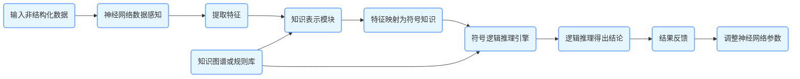

# 神经符号推理：增强AI Agent的逻辑能力

> 关键词：神经符号推理、AI Agent、逻辑能力、深度学习、符号逻辑、知识表示

> 摘要：本文聚焦于神经符号推理在增强AI Agent逻辑能力方面的应用。首先介绍了神经符号推理的背景，包括其目的、适用读者群体、文档结构以及相关术语。接着阐述了神经符号推理的核心概念，通过文本示意图和Mermaid流程图展示其原理和架构。详细讲解了核心算法原理，并用Python代码进行说明，同时给出了相关的数学模型和公式。通过项目实战，从开发环境搭建到源代码实现与解读，深入分析了神经符号推理的实际应用。还探讨了其在不同场景中的应用，推荐了学习资源、开发工具框架和相关论文著作。最后总结了神经符号推理的未来发展趋势与挑战，并提供了常见问题解答和扩展阅读参考资料。

## 1. 背景介绍 
### 1.1 目的和范围
随着人工智能技术的不断发展，AI Agent在各个领域得到了广泛应用。然而，现有的AI Agent在处理复杂逻辑任务时往往表现出一定的局限性。神经符号推理作为一种新兴的技术，旨在将神经网络的强大感知能力与符号逻辑的精确推理能力相结合，从而增强AI Agent的逻辑能力。本文的目的是全面介绍神经符号推理的相关概念、算法、数学模型以及实际应用，帮助读者深入理解该技术，并为其在实际项目中的应用提供指导。范围涵盖了神经符号推理的基本原理、核心算法、数学模型、项目实战以及未来发展趋势等方面。

### 1.2 预期读者
本文预期读者包括人工智能领域的研究人员、开发者、学生以及对AI Agent逻辑能力提升感兴趣的技术爱好者。对于研究人员，本文可以为其提供神经符号推理领域的最新研究进展和思路；对于开发者，本文提供了具体的算法实现和项目实战案例，有助于其在实际项目中应用该技术；对于学生，本文可以作为学习神经符号推理的入门资料，帮助其建立起相关的知识体系；对于技术爱好者，本文可以让他们了解神经符号推理这一前沿技术的基本概念和应用场景。

### 1.3 文档结构概述
本文共分为十个部分。第一部分为背景介绍，包括目的和范围、预期读者、文档结构概述以及术语表。第二部分介绍神经符号推理的核心概念与联系，通过文本示意图和Mermaid流程图展示其原理和架构。第三部分详细讲解核心算法原理，并使用Python源代码进行阐述。第四部分给出神经符号推理的数学模型和公式，并进行详细讲解和举例说明。第五部分通过项目实战，介绍开发环境搭建、源代码详细实现和代码解读。第六部分探讨神经符号推理的实际应用场景。第七部分推荐学习资源、开发工具框架和相关论文著作。第八部分总结神经符号推理的未来发展趋势与挑战。第九部分为附录，提供常见问题与解答。第十部分给出扩展阅读和参考资料。

### 1.4 术语表
#### 1.4.1 核心术语定义
- **神经符号推理（Neural-Symbolic Reasoning）**：将神经网络的感知能力与符号逻辑的推理能力相结合的一种推理方法，旨在利用神经网络处理非结构化数据，同时利用符号逻辑进行精确的推理和知识表示。
- **AI Agent**：具有自主决策和行动能力的人工智能实体，能够感知环境、处理信息并做出相应的决策。
- **逻辑能力**：指AI Agent在处理问题时进行推理、判断、演绎和归纳等逻辑操作的能力。
- **神经网络（Neural Network）**：一种模仿人类神经系统的计算模型，由大量的神经元组成，能够自动从数据中学习特征和模式。
- **符号逻辑（Symbolic Logic）**：使用符号和规则来表示和处理逻辑关系的方法，如命题逻辑、谓词逻辑等。

#### 1.4.2 相关概念解释
- **知识表示（Knowledge Representation）**：将知识以计算机能够理解和处理的方式进行表示的方法，常见的知识表示形式包括语义网络、框架、规则等。在神经符号推理中，知识表示用于将符号逻辑中的知识与神经网络中的数据进行关联。
- **推理引擎（Reasoning Engine）**：用于执行推理任务的程序模块，根据给定的知识和规则，推导出新的结论。在神经符号推理中，推理引擎结合了神经网络和符号逻辑的处理能力，实现复杂的推理任务。
- **深度学习（Deep Learning）**：一种基于神经网络的机器学习方法，通过多层神经网络对数据进行学习和表示。在神经符号推理中，深度学习可以用于处理非结构化数据，如文本、图像等。

#### 1.4.3 缩略词列表
- **NN**：Neural Network（神经网络）
- **SL**：Symbolic Logic（符号逻辑）
- **NLP**：Natural Language Processing（自然语言处理）
- **CV**：Computer Vision（计算机视觉）

## 2. 核心概念与联系 

神经符号推理的核心思想是将神经网络和符号逻辑相结合，以充分发挥两者的优势。神经网络具有强大的感知能力，能够处理非结构化数据，如文本、图像和语音等。而符号逻辑则具有精确的推理能力，能够进行复杂的逻辑推理和知识表示。通过将两者结合，神经符号推理可以使AI Agent在处理复杂任务时既能够感知环境信息，又能够进行精确的逻辑推理。

### 核心概念原理
神经符号推理的原理可以分为以下几个步骤：
1. **数据感知**：使用神经网络对输入的非结构化数据进行处理，提取特征和模式。例如，在自然语言处理中，可以使用循环神经网络（RNN）或卷积神经网络（CNN）对文本进行编码；在计算机视觉中，可以使用卷积神经网络对图像进行特征提取。
2. **知识表示**：将提取的特征转换为符号逻辑中的知识表示形式。这可以通过定义映射规则或使用知识图谱来实现。例如，将神经网络输出的特征向量映射到知识图谱中的实体和关系。
3. **逻辑推理**：使用符号逻辑的推理规则对知识进行推理，得出新的结论。例如，使用命题逻辑或谓词逻辑进行推理。
4. **结果反馈**：将推理结果反馈给神经网络，用于调整神经网络的参数，以提高推理的准确性。

### 架构示意图
以下是神经符号推理的架构示意图：

```plaintext
+-------------------+        +-------------------+        +-------------------+
|  神经网络 (NN)    |        |  知识表示模块    |        |  符号逻辑推理引擎 |
|                   | -----> |                   | -----> |                   |
|  数据感知与特征  |        |  特征到符号映射  |        |  逻辑推理与结论  |
|  提取            |        |                   |        |                   |
+-------------------+        +-------------------+        +-------------------+
                            ^                                       |
                            |                                       v
                      +-------------------+                   +-------------------+
                      |  知识图谱或规则库  |                   |  结果反馈与调整  |
                      |                   | <----------------- |                   |
                      |  知识存储与管理  |                   |  神经网络参数调整 |
                      +-------------------+                   +-------------------+
```

### Mermaid流程图


## 3. 核心算法原理 & 具体操作步骤 

### 核心算法原理
神经符号推理的核心算法主要涉及神经网络和符号逻辑的结合。下面以一个简单的自然语言推理任务为例，介绍其算法原理。

假设我们要判断两个句子之间的逻辑关系（如蕴含、矛盾或中立）。我们可以使用预训练的语言模型（如BERT）作为神经网络部分，用于对句子进行编码，然后将编码后的特征输入到符号逻辑推理模块中进行推理。

### 具体操作步骤
1. **数据预处理**：对输入的句子进行分词、词嵌入等预处理操作，将其转换为适合神经网络处理的格式。
2. **神经网络编码**：使用预训练的语言模型对句子进行编码，得到句子的特征向量。
3. **知识表示**：将特征向量映射到符号逻辑中的知识表示形式。例如，可以定义一个映射函数，将特征向量映射到命题逻辑中的命题。
4. **逻辑推理**：使用符号逻辑的推理规则对命题进行推理，得出句子之间的逻辑关系。
5. **结果反馈**：根据推理结果，调整神经网络的参数，以提高推理的准确性。

### Python源代码实现
```python
import torch
from transformers import BertTokenizer, BertModel

# 初始化BERT分词器和模型
tokenizer = BertTokenizer.from_pretrained('bert-base-uncased')
model = BertModel.from_pretrained('bert-base-uncased')

# 输入句子
sentence1 = "The cat is on the mat."
sentence2 = "There is a cat on the mat."

# 数据预处理
inputs1 = tokenizer(sentence1, return_tensors='pt')
inputs2 = tokenizer(sentence2, return_tensors='pt')

# 神经网络编码
with torch.no_grad():
    outputs1 = model(**inputs1)
    outputs2 = model(**inputs2)

# 提取句子特征向量
embedding1 = outputs1.last_hidden_state.mean(dim=1)
embedding2 = outputs2.last_hidden_state.mean(dim=1)

# 简单的知识表示：这里假设特征向量直接对应命题
# 逻辑推理：简单示例，判断两个句子是否相似
similarity = torch.cosine_similarity(embedding1, embedding2)

# 结果判断
if similarity > 0.9:
    print("两个句子逻辑关系为蕴含")
else:
    print("两个句子逻辑关系为中立")
```

### 代码解释
1. **数据预处理**：使用BERT分词器对输入的句子进行分词，并将其转换为PyTorch张量。
2. **神经网络编码**：使用预训练的BERT模型对句子进行编码，得到句子的隐藏状态。
3. **特征提取**：对隐藏状态进行平均池化，得到句子的特征向量。
4. **知识表示**：这里简单地将特征向量直接对应命题。
5. **逻辑推理**：使用余弦相似度计算两个句子特征向量的相似度，根据相似度判断句子之间的逻辑关系。

## 4. 数学模型和公式 & 详细讲解 & 举例说明 

### 神经网络部分
在神经符号推理中，神经网络通常用于数据感知和特征提取。以多层感知机（MLP）为例，其数学模型可以表示为：

$$
\mathbf{h}^{(l)} = f(\mathbf{W}^{(l)}\mathbf{h}^{(l - 1)} + \mathbf{b}^{(l)})
$$

其中，$\mathbf{h}^{(l)}$ 是第 $l$ 层的隐藏状态向量，$\mathbf{W}^{(l)}$ 是第 $l$ 层的权重矩阵，$\mathbf{b}^{(l)}$ 是第 $l$ 层的偏置向量，$f$ 是激活函数，如ReLU函数：

$$
f(x) = \max(0, x)
$$

### 知识表示部分
知识表示是将神经网络提取的特征映射到符号逻辑中的知识表示形式。假设我们有一个特征向量 $\mathbf{x}$，我们可以定义一个映射函数 $\phi$ 将其映射到符号逻辑中的命题 $p$：

$$
p = \phi(\mathbf{x})
$$

### 逻辑推理部分
在符号逻辑推理中，我们使用逻辑规则进行推理。以命题逻辑为例，常见的逻辑规则包括合取（$\land$）、析取（$\lor$）和否定（$\neg$）。例如，假设有两个命题 $p$ 和 $q$，它们的合取可以表示为：

$$
p \land q
$$

### 举例说明
假设我们有一个简单的分类任务，输入是一个二维特征向量 $\mathbf{x} = [x_1, x_2]$，我们使用一个两层的MLP进行特征提取。第一层的权重矩阵 $\mathbf{W}^{(1)}$ 和偏置向量 $\mathbf{b}^{(1)}$ 分别为：

$$
\mathbf{W}^{(1)} = \begin{bmatrix}
1 & 2 \\
3 & 4
\end{bmatrix}, \quad \mathbf{b}^{(1)} = \begin{bmatrix}
0.1 \\
0.2
\end{bmatrix}
$$

激活函数为ReLU函数。则第一层的输出 $\mathbf{h}^{(1)}$ 为：

$$
\mathbf{h}^{(1)} = f(\mathbf{W}^{(1)}\mathbf{x} + \mathbf{b}^{(1)}) = f\left(\begin{bmatrix}
1 & 2 \\
3 & 4
\end{bmatrix}\begin{bmatrix}
x_1 \\
x_2
\end{bmatrix} + \begin{bmatrix}
0.1 \\
0.2
\end{bmatrix}\right)
$$

假设我们将 $\mathbf{h}^{(1)}$ 映射到两个命题 $p$ 和 $q$，具体映射规则为：

$$
p = \begin{cases}
\text{True}, & \text{if } h_1^{(1)} > 0 \\
\text{False}, & \text{otherwise}
\end{cases}
$$

$$
q = \begin{cases}
\text{True}, & \text{if } h_2^{(1)} > 0 \\
\text{False}, & \text{otherwise}
\end{cases}
$$

现在我们要判断命题 $p \land q$ 的真假。如果 $h_1^{(1)} > 0$ 且 $h_2^{(1)} > 0$，则 $p \land q$ 为真；否则为假。

## 5. 项目实战：代码实际案例和详细解释说明 

### 5.1  开发环境搭建
#### 操作系统
可以选择Linux（如Ubuntu）、Windows或macOS等操作系统。这里以Ubuntu 20.04为例进行说明。

#### 编程语言和环境
- **Python**：建议使用Python 3.7及以上版本。可以通过以下命令安装Python：
```bash
sudo apt update
sudo apt install python3 python3-pip
```
- **虚拟环境**：使用`virtualenv`或`conda`创建虚拟环境，以隔离项目依赖。这里使用`virtualenv`：
```bash
pip install virtualenv
virtualenv -p python3 neuro_symbolic_env
source neuro_symbolic_env/bin/activate
```

#### 依赖库安装
安装必要的Python库，包括`torch`、`transformers`等：
```bash
pip install torch transformers
```

### 5.2  源代码详细实现和代码解读
以下是一个更完整的自然语言推理项目的源代码：

```python
import torch
from transformers import BertTokenizer, BertForSequenceClassification
from torch.utils.data import DataLoader, Dataset

# 自定义数据集类
class NliDataset(Dataset):
    def __init__(self, sentences1, sentences2, labels, tokenizer, max_length):
        self.sentences1 = sentences1
        self.sentences2 = sentences2
        self.labels = labels
        self.tokenizer = tokenizer
        self.max_length = max_length

    def __len__(self):
        return len(self.sentences1)

    def __getitem__(self, idx):
        sentence1 = self.sentences1[idx]
        sentence2 = self.sentences2[idx]
        label = self.labels[idx]

        inputs = self.tokenizer(sentence1, sentence2, return_tensors='pt', max_length=self.max_length, padding='max_length', truncation=True)
        input_ids = inputs['input_ids'].squeeze()
        attention_mask = inputs['attention_mask'].squeeze()

        return {
            'input_ids': input_ids,
            'attention_mask': attention_mask,
            'labels': torch.tensor(label, dtype=torch.long)
        }

# 训练函数
def train(model, dataloader, optimizer, device, epochs):
    model.train()
    for epoch in range(epochs):
        total_loss = 0
        for batch in dataloader:
            input_ids = batch['input_ids'].to(device)
            attention_mask = batch['attention_mask'].to(device)
            labels = batch['labels'].to(device)

            optimizer.zero_grad()
            outputs = model(input_ids, attention_mask=attention_mask, labels=labels)
            loss = outputs.loss
            loss.backward()
            optimizer.step()

            total_loss += loss.item()

        print(f'Epoch {epoch + 1}/{epochs}, Loss: {total_loss / len(dataloader)}')

# 测试函数
def test(model, dataloader, device):
    model.eval()
    correct = 0
    total = 0
    with torch.no_grad():
        for batch in dataloader:
            input_ids = batch['input_ids'].to(device)
            attention_mask = batch['attention_mask'].to(device)
            labels = batch['labels'].to(device)

            outputs = model(input_ids, attention_mask=attention_mask)
            logits = outputs.logits
            predictions = torch.argmax(logits, dim=1)

            total += labels.size(0)
            correct += (predictions == labels).sum().item()

    accuracy = correct / total
    print(f'Test Accuracy: {accuracy}')

# 主函数
def main():
    # 初始化分词器和模型
    tokenizer = BertTokenizer.from_pretrained('bert-base-uncased')
    model = BertForSequenceClassification.from_pretrained('bert-base-uncased', num_labels=3)

    # 示例数据
    sentences1 = ["The cat is on the mat.", "The dog is in the yard."]
    sentences2 = ["There is a cat on the mat.", "The dog is sleeping."]
    labels = [0, 1]  # 0: 蕴含, 1: 中立

    # 创建数据集和数据加载器
    dataset = NliDataset(sentences1, sentences2, labels, tokenizer, max_length=128)
    dataloader = DataLoader(dataset, batch_size=2, shuffle=True)

    # 设备选择
    device = torch.device('cuda' if torch.cuda.is_available() else 'cpu')
    model.to(device)

    # 优化器
    optimizer = torch.optim.Adam(model.parameters(), lr=2e-5)

    # 训练模型
    train(model, dataloader, optimizer, device, epochs=3)

    # 测试模型
    test(model, dataloader, device)

if __name__ == "__main__":
    main()
```

### 5.3  代码解读与分析
1. **自定义数据集类**：`NliDataset` 类继承自`torch.utils.data.Dataset`，用于处理自然语言推理数据集。在`__getitem__`方法中，使用BERT分词器对输入的句子对进行分词，并将其转换为适合模型输入的格式。
2. **训练函数**：`train` 函数用于训练模型。在每个epoch中，遍历数据加载器中的每个批次，计算损失并进行反向传播和参数更新。
3. **测试函数**：`test` 函数用于测试模型的性能。在测试过程中，使用模型对输入进行预测，并计算预测准确率。
4. **主函数**：`main` 函数是程序的入口点。初始化分词器和模型，创建数据集和数据加载器，选择设备，定义优化器，然后进行模型训练和测试。

## 6. 实际应用场景 
### 自然语言处理
- **文本蕴含识别**：判断一个文本是否蕴含另一个文本的意思。例如，在信息检索中，可以利用神经符号推理判断查询语句和文档之间的蕴含关系，提高检索的准确性。
- **语义理解**：帮助AI Agent更好地理解文本的语义，进行语义推理和问答。例如，在智能客服系统中，神经符号推理可以根据用户的问题进行逻辑推理，给出准确的回答。

### 计算机视觉
- **图像理解**：结合图像特征和符号知识，对图像进行更深入的理解。例如，在自动驾驶中，神经符号推理可以将摄像头捕捉到的图像信息与交通规则等符号知识相结合，做出更合理的决策。
- **目标检测与识别**：利用符号逻辑对检测到的目标进行推理和分类。例如，在安防监控系统中，可以根据目标的特征和场景信息，判断目标是否存在异常行为。

### 医疗领域
- **疾病诊断**：将患者的症状、检查结果等数据与医学知识图谱相结合，进行疾病的诊断和推理。例如，神经符号推理可以帮助医生更准确地判断患者的病情，提供更合理的治疗方案。
- **医疗决策支持**：在医疗决策过程中，考虑多种因素进行逻辑推理，为医生提供决策支持。例如，在手术方案选择中，神经符号推理可以综合考虑患者的身体状况、手术风险等因素，给出最佳的手术方案。

### 金融领域
- **风险评估**：结合金融数据和风险评估规则，对金融产品或投资组合进行风险评估。例如，神经符号推理可以分析市场趋势、企业财务状况等因素，预测投资风险。
- **信贷审批**：根据客户的信用信息和信贷政策，进行信贷审批决策。例如，神经符号推理可以判断客户是否符合信贷条件，以及给予的信贷额度。

## 7. 工具和资源推荐
### 7.1 学习资源推荐
#### 7.1.1 书籍推荐
- 《人工智能：一种现代的方法》（*Artificial Intelligence: A Modern Approach*）：全面介绍了人工智能的各个领域，包括符号逻辑推理和神经网络等内容，是学习人工智能的经典教材。
- 《深度学习》（*Deep Learning*）：由Ian Goodfellow、Yoshua Bengio和Aaron Courville编写，详细介绍了深度学习的理论和实践，对于理解神经网络在神经符号推理中的应用有很大帮助。
- 《知识图谱：方法、实践与应用》：介绍了知识图谱的构建、表示和推理方法，对于神经符号推理中的知识表示和逻辑推理有重要的参考价值。

#### 7.1.2 在线课程
- Coursera上的“人工智能基础”（*Foundations of Artificial Intelligence*）课程：由哥伦比亚大学的教授授课，涵盖了人工智能的基本概念、搜索算法、逻辑推理等内容。
- edX上的“深度学习专项课程”（*Deep Learning Specialization*）：由Andrew Ng教授授课，系统地介绍了深度学习的各个方面，包括神经网络的原理、训练方法等。
- B站等平台上的一些开源课程，如“动手学深度学习”，提供了丰富的代码实践和讲解，有助于快速掌握深度学习的应用。

#### 7.1.3 技术博客和网站
- arXiv：提供了大量的学术论文预印本，涵盖了神经符号推理等人工智能领域的最新研究成果。
- Medium：有许多人工智能领域的博主分享他们的研究和实践经验，对于了解神经符号推理的应用案例和技术趋势有很大帮助。
- AI开源社区，如GitHub、OpenAI等，提供了许多开源的代码库和项目，可供学习和参考。

### 7.2 开发工具框架推荐
#### 7.2.1 IDE和编辑器
- PyCharm：是一款专门为Python开发设计的集成开发环境，具有强大的代码编辑、调试和项目管理功能，适合开发神经符号推理项目。
- Jupyter Notebook：是一个交互式的开发环境，支持Python代码的实时运行和可视化展示，非常适合进行算法实验和数据分析。
- Visual Studio Code：是一款轻量级的代码编辑器，具有丰富的插件生态系统，可以通过安装Python相关插件来进行Python开发。

#### 7.2.2 调试和性能分析工具
- PyTorch Profiler：是PyTorch自带的性能分析工具，可以帮助开发者分析模型的运行时间、内存使用等情况，优化模型性能。
- TensorBoard：是TensorFlow的可视化工具，也可以与PyTorch结合使用，用于可视化模型的训练过程、损失曲线等信息。
- pdb：是Python的标准调试器，可以在代码中设置断点，逐步调试代码，帮助开发者定位问题。

#### 7.2.3 相关框架和库
- PyTorch：是一个开源的深度学习框架，提供了丰富的神经网络模型和优化算法，支持GPU加速，非常适合用于神经符号推理中的神经网络部分。
- TensorFlow：是另一个广泛使用的深度学习框架，具有强大的分布式训练和部署能力，也可以用于神经符号推理的开发。
- NetworkX：是一个用于创建、操作和研究复杂网络的Python库，可以用于构建和处理知识图谱，在神经符号推理的知识表示和逻辑推理中发挥重要作用。

### 7.3 相关论文著作推荐
#### 7.3.1 经典论文
- “Neural-Symbolic Learning and Reasoning: Contributions and Challenges”：该论文系统地介绍了神经符号学习和推理的发展历程、主要贡献和面临的挑战，是了解该领域的重要文献。
- “DualSystem2e: A Neural-Symbolic System for Reasoning with Time and Uncertainty”：提出了一种结合神经网络和符号逻辑的系统，用于处理时间和不确定性推理问题。
- “Neural Theorem Provers”：介绍了一种基于神经网络的定理证明器，将神经网络的学习能力与符号逻辑的推理能力相结合。

#### 7.3.2 最新研究成果
- 关注顶级人工智能会议，如NeurIPS、ICML、AAAI等，这些会议上发表的论文代表了该领域的最新研究成果。可以通过会议官网或arXiv等平台获取相关论文。
- 一些知名学术期刊，如Journal of Artificial Intelligence Research（JAIR）、Artificial Intelligence等，也会发表神经符号推理领域的高质量研究论文。

#### 7.3.3 应用案例分析
- 一些实际应用案例会在行业报告、技术博客或学术论文中进行介绍。例如，在医疗领域的应用案例可以在医疗信息学相关的会议和期刊中找到；在金融领域的应用案例可以关注金融科技相关的研究和报道。

## 8. 总结：未来发展趋势与挑战
### 未来发展趋势
- **更深度的融合**：未来神经符号推理将实现神经网络和符号逻辑更深度的融合，不仅在算法层面进行结合，还将在架构设计、知识表示等方面进行创新，以充分发挥两者的优势。
- **跨领域应用拓展**：神经符号推理将在更多领域得到应用，如教育、交通、能源等。通过结合不同领域的知识和数据，解决更复杂的实际问题。
- **与其他技术的结合**：与强化学习、迁移学习等技术相结合，提高AI Agent的学习能力和泛化能力。例如，将神经符号推理与强化学习相结合，使AI Agent在复杂环境中能够进行更合理的决策。

### 挑战
- **知识表示和融合的难题**：如何将神经网络提取的特征准确地映射到符号逻辑中的知识表示形式，以及如何有效地融合不同来源的知识，仍然是一个挑战。
- **计算资源和效率问题**：神经符号推理涉及到神经网络的训练和符号逻辑的推理，计算复杂度较高，需要大量的计算资源和时间。如何提高计算效率，降低计算成本，是需要解决的问题。
- **可解释性和可靠性**：虽然神经符号推理在一定程度上提高了AI的可解释性，但仍然需要进一步提高模型的可解释性和可靠性，以便在一些关键领域得到应用。

## 9. 附录：常见问题与解答
### 1. 神经符号推理与传统的神经网络方法有什么区别？
传统的神经网络方法主要侧重于从数据中学习特征和模式，缺乏明确的逻辑推理能力。而神经符号推理将神经网络的感知能力与符号逻辑的推理能力相结合，能够进行更复杂的逻辑推理和知识表示，提高了AI Agent的逻辑能力和可解释性。

### 2. 神经符号推理在实际应用中面临哪些困难？
神经符号推理在实际应用中面临的困难包括知识表示和融合的难题、计算资源和效率问题、可解释性和可靠性等方面。例如，如何将不同来源的知识进行有效的融合，如何在保证推理准确性的前提下提高计算效率，以及如何让模型的决策过程更加可解释和可靠。

### 3. 如何选择合适的神经网络模型和符号逻辑方法？
选择合适的神经网络模型和符号逻辑方法需要考虑具体的应用场景和任务需求。对于自然语言处理任务，可以选择预训练的语言模型，如BERT、GPT等；对于计算机视觉任务，可以选择卷积神经网络，如ResNet、VGG等。在符号逻辑方法方面，可以根据任务的逻辑复杂度选择命题逻辑、谓词逻辑等。

### 4. 神经符号推理的训练过程有什么特点？
神经符号推理的训练过程通常涉及到神经网络的训练和符号逻辑的推理。在训练过程中，需要将神经网络的输出与符号逻辑的知识表示进行关联，并根据推理结果调整神经网络的参数。同时，还需要考虑如何平衡神经网络的学习能力和符号逻辑的推理能力。

## 10. 扩展阅读 & 参考资料
### 扩展阅读
- 关注相关的学术会议和期刊，如IJCAI、ACM Transactions on Intelligent Systems and Technology等，获取更多关于神经符号推理的最新研究成果。
- 阅读一些相关的技术博客和论坛，如Reddit上的人工智能板块、Stack Overflow上的相关问题等，了解其他开发者的经验和实践。

### 参考资料
- Goodfellow, I., Bengio, Y., & Courville, A. (2016). *Deep Learning*. MIT Press.
- Russell, S. J., & Norvig, P. (2020). *Artificial Intelligence: A Modern Approach*. Pearson.
- 相关的学术论文和研究报告，可通过学术搜索引擎（如Google Scholar）获取。

作者：AI天才研究院/AI Genius Institute & 禅与计算机程序设计艺术 /Zen And The Art of Computer Programming